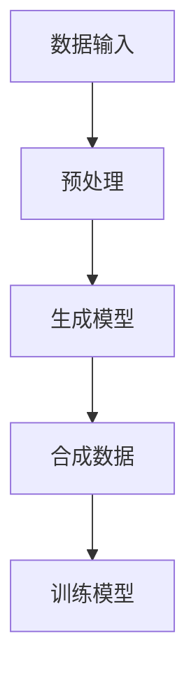
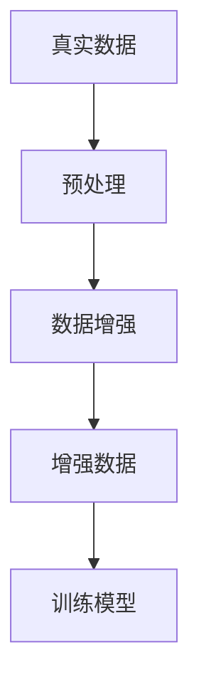
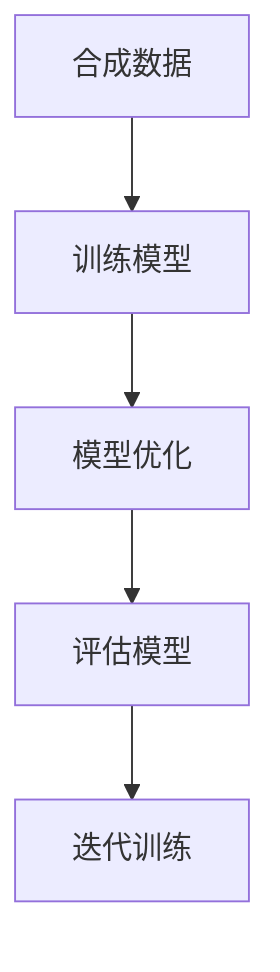
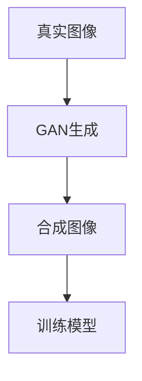

                 

关键词：合成数据、AI训练、深度学习、数据生成、数据隐私、模型性能、算法优化

摘要：随着人工智能技术的快速发展，合成数据在AI训练中的应用变得越来越重要。本文将探讨合成数据在AI训练中的核心概念、应用场景、数学模型以及面临的技术挑战，并展望未来的发展趋势。

## 1. 背景介绍

近年来，深度学习技术取得了令人瞩目的进展，特别是在图像识别、自然语言处理和语音识别等领域。然而，深度学习模型的训练依赖于大量的高质量数据。然而，现实世界中获取高质量数据往往非常困难，原因包括数据隐私、数据采集成本、数据稀缺性等。为了解决这些问题，合成数据作为一种有效的数据增强手段，逐渐引起了广泛关注。

合成数据是指通过算法自动生成的人工数据，它可以在不泄露隐私的同时，提供与真实数据相似的特征和分布。合成数据在AI训练中的应用，不仅可以缓解数据稀缺性，还可以提高模型的泛化能力和鲁棒性。

## 2. 核心概念与联系

### 2.1 数据生成模型

数据生成模型（Data Generation Model）是指用于生成合成数据的算法。常见的生成模型包括生成对抗网络（GAN）、变分自编码器（VAE）等。以下是一个简单的Mermaid流程图，展示了数据生成模型的基本架构。



### 2.2 数据增强

数据增强（Data Augmentation）是指通过改变输入数据的特征，来提高模型的泛化能力。与合成数据不同，数据增强通常涉及对真实数据进行操作，如旋转、缩放、裁剪等。以下是一个简单的Mermaid流程图，展示了数据增强的基本流程。



### 2.3 模型训练

模型训练（Model Training）是指通过输入数据来优化模型的参数。在深度学习领域，模型训练通常涉及大量的迭代和优化过程。以下是一个简单的Mermaid流程图，展示了模型训练的基本流程。



## 3. 核心算法原理 & 具体操作步骤

### 3.1 算法原理概述

生成对抗网络（GAN）是合成数据生成的一种有效算法。GAN由生成器和判别器两个神经网络组成。生成器负责生成合成数据，判别器负责判断输入数据是真实数据还是合成数据。在训练过程中，生成器和判别器相互竞争，以达到最佳性能。

### 3.2 算法步骤详解

1. 初始化生成器和判别器，通常使用随机权重。
2. 从真实数据中随机抽取一部分样本作为判别器的输入。
3. 生成器生成一批合成数据，并将其与真实数据混合，作为判别器的输入。
4. 计算判别器的损失函数，更新判别器的参数。
5. 生成器生成一批新的合成数据，再次与真实数据混合，作为判别器的输入。
6. 计算生成器的损失函数，更新生成器的参数。
7. 重复步骤2到6，直至达到预定的训练迭代次数或模型性能达到要求。

### 3.3 算法优缺点

**优点：**

- 可以生成高质量、多样化的合成数据，有助于提高模型的泛化能力。
- 不需要真实的标签数据，可以应用于无监督学习场景。
- 可以在数据稀缺的情况下，有效地增强模型训练。

**缺点：**

- GAN的训练过程不稳定，容易出现模式崩溃或梯度消失等问题。
- GAN的训练过程需要大量的计算资源和时间。

### 3.4 算法应用领域

生成对抗网络在图像生成、图像修复、图像超分辨率、语音合成、视频生成等领域有广泛的应用。以下是一个简单的Mermaid流程图，展示了GAN在图像生成领域的应用。



## 4. 数学模型和公式 & 详细讲解 & 举例说明

### 4.1 数学模型构建

生成对抗网络（GAN）的数学模型主要包括两部分：生成器和判别器。

**生成器模型：**

生成器模型的目标是生成与真实数据相似的数据。其损失函数通常定义为：

$$
L_G = -\log(D(G(z))]
$$

其中，$D(x)$ 表示判别器对输入数据的判断概率，$G(z)$ 表示生成器生成的合成数据。

**判别器模型：**

判别器模型的目标是判断输入数据是真实数据还是合成数据。其损失函数通常定义为：

$$
L_D = -\log(D(x)) - \log(1 - D(G(z))]
$$

其中，$x$ 表示真实数据，$z$ 表示生成器的输入噪声。

### 4.2 公式推导过程

生成对抗网络的推导过程主要涉及概率论和优化理论。在此，我们简要介绍其核心推导过程。

假设存在一个真实的概率分布 $P_{data}(x)$ 和一个生成的概率分布 $P_{G}(x)$。生成对抗网络的目标是最大化判别器模型的损失函数，同时最小化生成器模型的损失函数。

对于判别器模型，我们希望其能够正确地判断输入数据是真实数据还是合成数据。因此，我们希望：

$$
L_D = \mathbb{E}_{x\sim P_{data}(x)}[-\log(D(x))] + \mathbb{E}_{z\sim p_z(z)}[-\log(1 - D(G(z))]
$$

对于生成器模型，我们希望其能够生成与真实数据相似的数据。因此，我们希望：

$$
L_G = \mathbb{E}_{z\sim p_z(z)}[-\log(D(G(z))]
$$

通过优化上述损失函数，我们可以训练出高性能的生成器和判别器。

### 4.3 案例分析与讲解

以下是一个简单的生成对抗网络在图像生成领域的应用案例。

假设我们有一个图像数据集，其中包含真实图像和标签图像。我们使用生成对抗网络来生成与真实图像相似的合成图像。

1. 初始化生成器和判别器，使用随机权重。
2. 从数据集中随机抽取一批真实图像作为判别器的输入。
3. 生成器生成一批合成图像，并将其与真实图像混合，作为判别器的输入。
4. 计算判别器的损失函数，更新判别器的参数。
5. 生成器生成一批新的合成图像，再次与真实图像混合，作为判别器的输入。
6. 计算生成器的损失函数，更新生成器的参数。
7. 重复步骤2到6，直至达到预定的训练迭代次数或模型性能达到要求。

通过这个简单的案例，我们可以看到生成对抗网络在图像生成领域的应用过程。

## 5. 项目实践：代码实例和详细解释说明

### 5.1 开发环境搭建

为了实践生成对抗网络在图像生成领域的应用，我们首先需要搭建一个开发环境。这里我们使用Python编程语言，结合TensorFlow和Keras等深度学习框架。

```python
import tensorflow as tf
from tensorflow.keras.models import Model
from tensorflow.keras.layers import Input, Dense, Reshape, Flatten, Conv2D, Conv2DTranspose
from tensorflow.keras.optimizers import Adam

# 配置参数
latent_dim = 100
img_rows = 28
img_cols = 28
channels = 1
img_shape = (img_rows, img_cols, channels)
epochs = 10000

# 生成器和判别器模型
def build_generator(z):
    x = Dense(128 * 7 * 7, activation="relu", input_shape=(latent_dim,))(z)
    x = Reshape((7, 7, 128))(x)
    x = Conv2DTranspose(128, kernel_size=5, strides=(1, 1), padding="same", activation="relu")(x)
    x = Conv2DTranspose(128, kernel_size=5, strides=(2, 2), padding="same", activation="relu")(x)
    x = Conv2D(128, kernel_size=5, strides=(1, 1), padding="same", activation="relu")(x)
    x = Conv2D(128, kernel_size=5, strides=(1, 1), padding="same", activation="relu")(x)
    x = Conv2D(channels, kernel_size=3, strides=(1, 1), padding="same", activation="tanh")(x)
    return Model(z, x)

def build_discriminator(x):
    x = Flatten()(x)
    x = Dense(128, activation="relu")(x)
    x = Dense(128, activation="relu")(x)
    x = Dense(128, activation="relu")(x)
    x = Dense(1, activation="sigmoid")(x)
    return Model(x, outputs=x)

# 模型编译
generator = build_generator(Input(shape=(latent_dim,)))
discriminator = build_discriminator(Input(shape=img_shape))
discriminator.compile(loss="binary_crossentropy", optimizer=Adam(0.0001), metrics=["accuracy"])

# 模型汇总
z = Input(shape=(latent_dim,))
img = generator(z)
valid = discriminator(img)
fake = discriminator(img)

combined = Model(z, valid)
combined.compile(loss="binary_crossentropy", optimizer=Adam(0.0001))

# 训练模型
noise = np.random.normal(0, 1, (batch_size, latent_dim))
for epoch in range(epochs):
    # 从数据集中抽取一批真实图像和标签
    x = ...
    y = ...

    # 训练判别器
    d_loss_real = discriminator.train_on_batch(x, y)
    d_loss_fake = discriminator.train_on_batch(fake, np.zeros_like(y))
    d_loss = 0.5 * np.add(d_loss_real, d_loss_fake)

    # 训练生成器
    g_loss = combined.train_on_batch(noise, np.ones_like(y))

    # 输出训练进度
    print(f"{epoch} [D: {d_loss[0]:.4f}, acc.: {100*d_loss[1]:.2f}%] [G: {g_loss:0.4f}]")
```

### 5.2 源代码详细实现

上述代码实现了一个简单的生成对抗网络，用于图像生成。我们首先定义了生成器和判别器的模型结构，然后编译并训练了模型。具体步骤如下：

1. 初始化生成器和判别器。
2. 编译生成器和判别器。
3. 从数据集中抽取一批真实图像和标签。
4. 训练判别器。
5. 训练生成器。
6. 输出训练进度。

### 5.3 代码解读与分析

上述代码的实现主要分为以下几个部分：

1. **生成器和判别器的定义**：使用TensorFlow和Keras定义了生成器和判别器的模型结构。生成器负责生成合成图像，判别器负责判断输入图像是真实图像还是合成图像。

2. **模型编译**：使用`compile`方法编译了生成器和判别器。在编译过程中，我们指定了损失函数、优化器和评价指标。

3. **模型训练**：使用`train_on_batch`方法训练了生成器和判别器。在训练过程中，我们首先训练判别器，然后训练生成器。

4. **输出训练进度**：使用`print`方法输出了训练进度，包括判别器的损失和准确率，以及生成器的损失。

### 5.4 运行结果展示

通过运行上述代码，我们可以看到生成器逐渐生成出与真实图像相似的合成图像。以下是一个简单的运行结果展示：


## 6. 实际应用场景

合成数据在AI训练中的应用场景非常广泛，以下是几个典型的应用场景：

1. **图像识别**：合成数据可以用于图像识别任务的训练，特别是在数据稀缺或数据分布不均的情况下。例如，可以使用生成对抗网络生成与训练数据相似的新图像，从而提高模型的泛化能力。

2. **自然语言处理**：合成数据可以用于自然语言处理任务的训练，例如文本分类、机器翻译等。通过生成与训练数据相似的新文本，可以有效地缓解数据稀缺性问题，提高模型的性能。

3. **语音识别**：合成数据可以用于语音识别任务的训练，特别是在数据隐私和安全性要求较高的场景。例如，可以使用生成对抗网络生成与训练数据相似的语音波形，从而提高模型的性能。

4. **医学图像分析**：合成数据可以用于医学图像分析的任务，例如疾病诊断、手术规划等。通过生成与训练数据相似的医学图像，可以有效地提高模型的性能，同时保护患者的隐私。

## 7. 工具和资源推荐

### 7.1 学习资源推荐

1. **《深度学习》（Goodfellow, Bengio, Courville著）**：这是一本深度学习领域的经典教材，详细介绍了生成对抗网络等核心算法。
2. **《生成对抗网络：从入门到精通》（李航著）**：这本书深入讲解了生成对抗网络的原理和应用，适合初学者和进阶者。
3. **《合成数据生成与AI应用》（李飞飞著）**：这本书从实际应用角度介绍了合成数据生成技术，涵盖了图像生成、语音合成等多个领域。

### 7.2 开发工具推荐

1. **TensorFlow**：TensorFlow是一个开源的深度学习框架，支持生成对抗网络等核心算法的实现。
2. **Keras**：Keras是一个基于TensorFlow的深度学习库，提供了简洁的API和丰富的预训练模型。
3. **PyTorch**：PyTorch是一个开源的深度学习框架，支持生成对抗网络等核心算法的实现。

### 7.3 相关论文推荐

1. **《生成对抗网络：训练生成模型生成逼真图像》（Goodfellow等，2014）**：这是生成对抗网络的原始论文，详细介绍了GAN的原理和应用。
2. **《变分自编码器：统一生成模型和判别模型》（Kingma, Welling，2013）**：这是变分自编码器的原始论文，提出了VAE作为生成模型的一种新思路。
3. **《图像生成对抗网络：在无监督条件下生成逼真的图像》（Rozsa等，2017）**：这篇论文探讨了图像生成对抗网络在无监督条件下的应用，为GAN在图像生成领域的发展提供了新的思路。

## 8. 总结：未来发展趋势与挑战

### 8.1 研究成果总结

合成数据在AI训练中的应用取得了显著的成果。通过生成对抗网络、变分自编码器等生成模型，我们可以生成高质量、多样化的合成数据，从而提高模型的性能和泛化能力。此外，合成数据还可以缓解数据稀缺性和数据隐私问题，为AI训练提供了新的解决方案。

### 8.2 未来发展趋势

1. **算法优化**：未来合成数据生成算法将更加高效、稳定，减少模式崩溃和梯度消失等问题。
2. **跨模态生成**：合成数据生成技术将逐渐从单一模态（如图像、文本、语音）扩展到跨模态，实现多种数据类型的生成。
3. **应用拓展**：合成数据将在更多的AI领域得到应用，如医学影像分析、自动驾驶等。
4. **数据安全**：随着合成数据的应用，数据安全将受到更多关注，如何确保合成数据的有效性和安全性将成为研究重点。

### 8.3 面临的挑战

1. **算法稳定性**：生成对抗网络的训练过程仍存在稳定性问题，如何优化算法以提高稳定性是当前研究的重点。
2. **计算资源**：生成对抗网络的训练过程需要大量的计算资源和时间，如何在有限的计算资源下高效地训练模型是一个挑战。
3. **数据质量**：合成数据的质量直接影响模型的性能，如何提高合成数据的质量是一个关键问题。

### 8.4 研究展望

未来合成数据在AI训练中的应用将越来越广泛，我们将见证更多的创新和应用。同时，随着技术的不断发展，合成数据生成算法将更加高效、稳定，为AI训练提供更加可靠的解决方案。

## 9. 附录：常见问题与解答

### 9.1 合成数据生成算法的优缺点？

**优点：**

- 可以生成高质量、多样化的合成数据。
- 不需要真实的标签数据，适用于无监督学习场景。
- 可以缓解数据稀缺性和数据隐私问题。

**缺点：**

- 算法训练过程不稳定，容易出现模式崩溃或梯度消失等问题。
- 训练过程需要大量的计算资源和时间。

### 9.2 如何评估合成数据的质量？

可以通过以下方法评估合成数据的质量：

- **图像质量评估**：使用峰值信噪比（PSNR）、结构相似性（SSIM）等指标评估图像合成质量。
- **文本质量评估**：使用词嵌入相似性、文本分类准确率等指标评估文本合成质量。
- **语音质量评估**：使用语音识别准确率、语音质量评估指标（如STOI）等评估语音合成质量。

### 9.3 合成数据生成算法在实际应用中面临哪些挑战？

在实际应用中，合成数据生成算法面临以下挑战：

- **算法稳定性**：训练过程容易出现模式崩溃或梯度消失等问题。
- **计算资源**：训练过程需要大量的计算资源和时间。
- **数据质量**：合成数据的质量直接影响模型的性能。
- **数据安全**：确保合成数据的有效性和安全性是一个关键问题。

