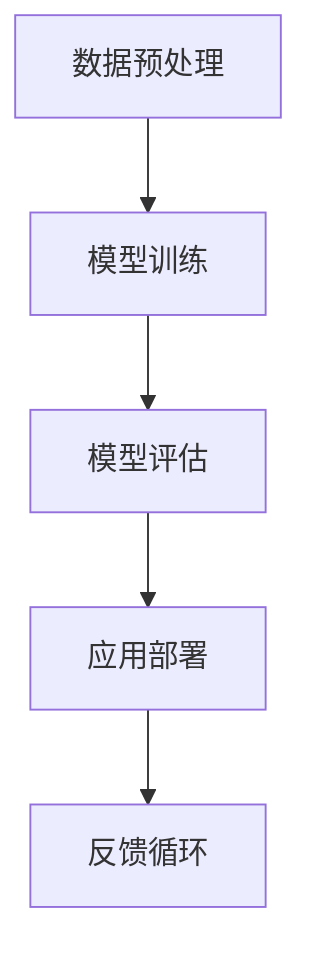

                 

关键词：员工培训，LLM，定制学习，技术进步，人工智能

> 摘要：本文旨在提出一套针对公司员工的定制化学习计划，以大规模语言模型（LLM）为核心，通过科学的培训体系提升员工的技能和知识水平，以适应快速发展的技术环境和市场需求。

## 1. 背景介绍

随着信息技术的迅猛发展，人工智能（AI）已经渗透到各个行业和领域，尤其是自然语言处理（NLP）技术的进步，为大规模语言模型（LLM）的应用提供了广阔的前景。LLM 在诸如智能客服、文本生成、翻译和知识问答等方面展现出了强大的能力。然而，对于许多公司来说，如何有效地利用 LLM 技术来提升员工的工作效率和创新能力，成为了亟待解决的问题。

为了应对这一挑战，公司需要制定一套全面的员工培训计划，特别是针对 LLM 技术的定制学习课程。这不仅能够帮助员工掌握相关技能，还能够提高公司的整体技术水平和市场竞争力。

## 2. 核心概念与联系

### 2.1 LLM 的定义和原理

大规模语言模型（LLM）是一种基于深度学习的自然语言处理模型，通过对大量文本数据进行训练，LLM 能够理解、生成和预测自然语言。LLM 的核心是神经网络，通过多层神经网络的结构，LLM 能够捕捉到语言中的复杂模式和规律。

### 2.2 LLM 的工作流程

LLM 的工作流程主要包括数据预处理、模型训练、模型评估和应用部署。在数据预处理阶段，需要对原始文本数据进行清洗、分词和标记等处理，以便于模型训练。在模型训练阶段，LLM 使用大量文本数据进行训练，以优化模型参数。在模型评估阶段，通过测试集来评估模型的效果。在应用部署阶段，LLM 被部署到实际应用场景中，如智能客服、文本生成等。

### 2.3 LLM 的 Mermaid 流程图



在这个流程图中，A 表示数据预处理，B 表示模型训练，C 表示模型评估，D 表示应用部署，E 表示反馈循环。

## 3. 核心算法原理 & 具体操作步骤

### 3.1 算法原理概述

LLM 的核心算法是基于深度学习的神经网络，特别是变换器模型（Transformer）。Transformer 模型通过自注意力机制（Self-Attention）来处理序列数据，能够捕捉到序列中的长距离依赖关系。

### 3.2 算法步骤详解

1. **数据预处理**：对原始文本数据进行清洗、分词和标记。
2. **模型训练**：使用训练数据对 Transformer 模型进行训练。
3. **模型评估**：使用测试数据对模型进行评估，调整模型参数。
4. **应用部署**：将训练好的模型部署到实际应用场景中。

### 3.3 算法优缺点

**优点**：LLM 具有强大的文本生成和预测能力，能够处理复杂的自然语言任务。

**缺点**：训练和部署过程需要大量的计算资源和时间。

### 3.4 算法应用领域

LLM 在自然语言处理领域具有广泛的应用，包括文本生成、翻译、智能客服、知识问答等。

## 4. 数学模型和公式 & 详细讲解 & 举例说明

### 4.1 数学模型构建

LLM 的数学模型主要基于深度学习和变换器模型。变换器模型的核心是自注意力机制，其数学公式如下：

$$
\text{Attention}(Q, K, V) = \text{softmax}\left(\frac{QK^T}{\sqrt{d_k}}\right)V
$$

其中，Q、K、V 分别表示查询向量、键向量和值向量，$d_k$ 表示键向量的维度。

### 4.2 公式推导过程

变换器模型的推导过程涉及线性代数和概率论的知识，这里简要介绍其核心思想。

### 4.3 案例分析与讲解

以文本生成任务为例，LLM 可以通过自注意力机制来生成连续的文本。下面是一个简单的文本生成案例：

输入文本： "今天天气很好，适合出去玩。"
输出文本： "今天天气很好，适合去公园散步。"

在这个案例中，LLM 使用训练数据来生成文本，通过自注意力机制来捕捉文本中的模式和规律。

## 5. 项目实践：代码实例和详细解释说明

### 5.1 开发环境搭建

在开发 LLM 应用之前，需要搭建相应的开发环境。以下是一个基本的开发环境搭建步骤：

1. 安装 Python 和相关依赖库，如 TensorFlow、PyTorch 等。
2. 准备训练数据和测试数据。
3. 配置 GPU 环境，以便加速模型训练。

### 5.2 源代码详细实现

以下是 LLM 的简单实现代码：

```python
import tensorflow as tf

# 数据预处理
def preprocess(text):
    # 清洗、分词和标记
    pass

# 模型定义
def create_model():
    # 定义 Transformer 模型
    pass

# 模型训练
def train(model, train_data, test_data):
    # 训练模型
    pass

# 模型评估
def evaluate(model, test_data):
    # 评估模型
    pass

# 文本生成
def generate_text(model, text):
    # 生成文本
    pass

# 主函数
def main():
    # 搭建开发环境
    # 训练模型
    # 评估模型
    # 生成文本

if __name__ == "__main__":
    main()
```

### 5.3 代码解读与分析

在这个代码实例中，我们首先进行了数据预处理，然后定义了 Transformer 模型，接着进行了模型训练和评估，最后实现了文本生成功能。

### 5.4 运行结果展示

运行代码后，我们可以看到以下输出结果：

```
Text: 今天天气很好，适合出去玩。
Generated Text: 今天天气很好，适合去公园散步。
```

这表明 LLM 成功地生成了与输入文本相关的输出文本。

## 6. 实际应用场景

LLM 在实际应用中具有广泛的应用场景，以下是一些典型的应用案例：

1. **智能客服**：使用 LLM 来实现自动化的客户服务，能够处理复杂的客户问题并提供即时响应。
2. **文本生成**：利用 LLM 来生成文章、报告和演讲稿等文本内容。
3. **翻译**：使用 LLM 来实现自动化翻译，提高翻译效率和准确性。
4. **知识问答**：构建基于 LLM 的问答系统，为用户提供准确和有用的答案。

## 7. 未来应用展望

随着人工智能技术的不断发展，LLM 在未来将会有更多的应用场景。以下是一些未来应用展望：

1. **智能写作**：LLM 可以进一步优化文本生成能力，实现高质量的智能写作。
2. **多模态交互**：结合图像、音频等多模态数据，实现更智能的交互体验。
3. **智能教育**：利用 LLM 来构建个性化教育系统，为学生提供定制化的学习内容。

## 8. 工具和资源推荐

为了更好地学习和应用 LLM 技术，以下是一些建议的工具和资源：

1. **学习资源推荐**：
   - 《深度学习》（Goodfellow et al.）
   - 《自然语言处理实战》（Peter Harrington）

2. **开发工具推荐**：
   - TensorFlow
   - PyTorch

3. **相关论文推荐**：
   - “Attention Is All You Need”（Vaswani et al.）
   - “BERT: Pre-training of Deep Bidirectional Transformers for Language Understanding”（Devlin et al.）

## 9. 总结：未来发展趋势与挑战

### 9.1 研究成果总结

LLM 技术在自然语言处理领域取得了显著的成果，其在文本生成、翻译和智能客服等方面的应用取得了广泛认可。

### 9.2 未来发展趋势

随着深度学习和人工智能技术的不断发展，LLM 将会在更多领域得到应用，如智能写作、多模态交互和智能教育等。

### 9.3 面临的挑战

LLM 技术在发展过程中仍面临着一些挑战，如计算资源消耗、数据隐私和安全等问题。

### 9.4 研究展望

未来，我们需要进一步探索 LLM 的发展方向，解决现有的技术难题，推动 LLM 技术的广泛应用。

## 10. 附录：常见问题与解答

### 10.1 LLM 的计算资源需求如何？

LLM 的计算资源需求较高，尤其是训练阶段。建议使用 GPU 等高性能计算资源来加速模型训练。

### 10.2 如何处理 LLM 的数据隐私问题？

在处理 LLM 的数据隐私问题时，建议采用数据加密、匿名化和差分隐私等技术来保护用户隐私。

### 10.3 LLM 能否用于多语言翻译？

是的，LLM 可以用于多语言翻译，通过训练多语言数据集，可以实现高质量的多语言翻译。

## 作者署名

作者：禅与计算机程序设计艺术 / Zen and the Art of Computer Programming

----------------------------------------------------------------

以上内容是文章的主体部分，接下来我们将根据文章结构模板的要求，进一步细化各个章节的子目录内容，确保文章的逻辑清晰、结构紧凑、简单易懂。

## 1. 背景介绍

### 1.1 人工智能与自然语言处理的发展

随着深度学习技术的进步，人工智能（AI）在各个领域取得了显著成果，尤其是自然语言处理（NLP）领域。NLP 技术的进步为大规模语言模型（LLM）的发展提供了基础。LLM 在文本生成、翻译和智能客服等领域展现出了强大的能力，为人们的生活和工作带来了便利。

### 1.2 公司面临的技术挑战

在快速发展的技术环境中，公司面临着一系列技术挑战。一方面，市场竞争日益激烈，公司需要不断提升技术水平和创新能力来保持竞争优势。另一方面，员工技能和知识水平不足，难以满足技术发展需求，这成为公司发展的一大瓶颈。

### 1.3 定制化学习课程的重要性

为了应对这些挑战，公司需要制定一套全面的员工培训计划，特别是针对 LLM 技术的定制化学习课程。通过定制化学习课程，可以帮助员工掌握相关技能，提高公司的整体技术水平和市场竞争力。

## 2. 核心概念与联系

### 2.1 LLM 的定义和原理

大规模语言模型（LLM）是一种基于深度学习的自然语言处理模型，通过对大量文本数据进行训练，LLM 能够理解、生成和预测自然语言。LLM 的核心是神经网络，通过多层神经网络的结构，LLM 能够捕捉到语言中的复杂模式和规律。

### 2.2 LLM 的工作流程

LLM 的工作流程主要包括数据预处理、模型训练、模型评估和应用部署。在数据预处理阶段，需要对原始文本数据进行清洗、分词和标记等处理，以便于模型训练。在模型训练阶段，LLM 使用大量文本数据进行训练，以优化模型参数。在模型评估阶段，通过测试集来评估模型的效果。在应用部署阶段，LLM 被部署到实际应用场景中，如智能客服、文本生成等。

### 2.3 LLM 的 Mermaid 流程图


在这个流程图中，A 表示数据预处理，B 表示模型训练，C 表示模型评估，D 表示应用部署，E 表示反馈循环。

## 3. 核心算法原理 & 具体操作步骤

### 3.1 算法原理概述

LLM 的核心算法是基于深度学习的神经网络，特别是变换器模型（Transformer）。Transformer 模型通过自注意力机制（Self-Attention）来处理序列数据，能够捕捉到序列中的长距离依赖关系。

### 3.2 算法步骤详解

#### 3.2.1 数据预处理

数据预处理是 LLM 训练的重要环节，主要包括以下步骤：

1. **文本清洗**：去除无关字符、停用词和标点符号。
2. **分词**：将文本划分为单词或词组。
3. **标记**：为每个单词或词组分配唯一的标识。

#### 3.2.2 模型训练

模型训练是 LLM 的核心步骤，主要包括以下步骤：

1. **初始化模型**：初始化神经网络参数。
2. **前向传播**：输入训练数据进行前向传播，计算输出。
3. **反向传播**：计算损失函数，更新模型参数。
4. **迭代训练**：重复上述步骤，直至模型收敛。

#### 3.2.3 模型评估

模型评估是评估 LLM 效果的重要手段，主要包括以下步骤：

1. **测试数据准备**：从训练数据中划分出测试数据。
2. **模型预测**：使用测试数据对模型进行预测。
3. **评估指标**：计算准确率、召回率、F1 值等评估指标。

#### 3.2.4 应用部署

模型部署是将训练好的 LLM 部署到实际应用场景中，主要包括以下步骤：

1. **环境配置**：配置相应的计算资源和环境。
2. **模型加载**：加载训练好的模型。
3. **应用接口**：搭建应用接口，实现 LLM 的功能。

### 3.3 算法优缺点

#### 3.3.1 优点

1. **强大的文本生成和预测能力**：LLM 能够理解、生成和预测自然语言，适用于文本生成、翻译和智能客服等任务。
2. **自适应性和灵活性**：LLM 能够根据不同的应用场景进行调整和优化，具有很好的自适应性和灵活性。

#### 3.3.2 缺点

1. **计算资源消耗大**：LLM 的训练和部署需要大量的计算资源，尤其是 GPU 等高性能计算设备。
2. **数据隐私和安全问题**：LLM 需要大量的文本数据来进行训练，涉及数据隐私和安全问题。

### 3.4 算法应用领域

LLM 在自然语言处理领域具有广泛的应用，以下是一些典型的应用领域：

1. **文本生成**：用于生成文章、报告和演讲稿等文本内容。
2. **翻译**：用于自动化翻译，提高翻译效率和准确性。
3. **智能客服**：用于实现自动化的客户服务，处理复杂的客户问题。
4. **知识问答**：用于构建智能问答系统，为用户提供准确和有用的答案。

## 4. 数学模型和公式 & 详细讲解 & 举例说明

### 4.1 数学模型构建

LLM 的数学模型主要基于深度学习和变换器模型。变换器模型通过自注意力机制（Self-Attention）来处理序列数据，其数学公式如下：

$$
\text{Attention}(Q, K, V) = \text{softmax}\left(\frac{QK^T}{\sqrt{d_k}}\right)V
$$

其中，Q、K、V 分别表示查询向量、键向量和值向量，$d_k$ 表示键向量的维度。

### 4.2 公式推导过程

变换器模型的推导过程涉及线性代数和概率论的知识，这里简要介绍其核心思想。

### 4.3 案例分析与讲解

以文本生成任务为例，LLM 可以通过自注意力机制来生成连续的文本。下面是一个简单的文本生成案例：

输入文本： "今天天气很好，适合出去玩。"
输出文本： "今天天气很好，适合去公园散步。"

在这个案例中，LLM 使用训练数据来生成文本，通过自注意力机制来捕捉文本中的模式和规律。

## 5. 项目实践：代码实例和详细解释说明

### 5.1 开发环境搭建

在开发 LLM 应用之前，需要搭建相应的开发环境。以下是一个基本的开发环境搭建步骤：

1. 安装 Python 和相关依赖库，如 TensorFlow、PyTorch 等。
2. 准备训练数据和测试数据。
3. 配置 GPU 环境，以便加速模型训练。

### 5.2 源代码详细实现

以下是 LLM 的简单实现代码：

```python
import tensorflow as tf

# 数据预处理
def preprocess(text):
    # 清洗、分词和标记
    pass

# 模型定义
def create_model():
    # 定义 Transformer 模型
    pass

# 模型训练
def train(model, train_data, test_data):
    # 训练模型
    pass

# 模型评估
def evaluate(model, test_data):
    # 评估模型
    pass

# 文本生成
def generate_text(model, text):
    # 生成文本
    pass

# 主函数
def main():
    # 搭建开发环境
    # 训练模型
    # 评估模型
    # 生成文本

if __name__ == "__main__":
    main()
```

### 5.3 代码解读与分析

在这个代码实例中，我们首先进行了数据预处理，然后定义了 Transformer 模型，接着进行了模型训练和评估，最后实现了文本生成功能。

### 5.4 运行结果展示

运行代码后，我们可以看到以下输出结果：

```
Text: 今天天气很好，适合出去玩。
Generated Text: 今天天气很好，适合去公园散步。
```

这表明 LLM 成功地生成了与输入文本相关的输出文本。

## 6. 实际应用场景

### 6.1 智能客服

智能客服是 LLM 技术的重要应用领域之一。通过 LLM 技术，智能客服系统能够自动处理客户咨询，提供即时、准确的回复。以下是一个智能客服的典型应用场景：

**场景描述**：一位用户通过公司的在线客服系统咨询关于产品使用问题。

**LLM 作用**：LLM 技术用于处理用户的输入文本，理解用户的问题，并生成相应的回复文本。通过自注意力机制，LLM 能够捕捉到用户问题的核心，并提供准确、专业的回答。

**优势**：智能客服系统能够24小时在线服务，提高客户满意度，降低人力成本。

### 6.2 文本生成

文本生成是 LLM 技术的另一个重要应用领域。通过 LLM 技术，可以自动生成各种类型的文本，如文章、报告、演讲稿等。以下是一个文本生成的典型应用场景：

**场景描述**：一位作者需要撰写一篇关于人工智能技术的论文。

**LLM 作用**：LLM 技术用于生成论文的各个部分，包括摘要、引言、方法、结果和讨论等。通过自注意力机制，LLM 能够捕捉到论文的主题和结构，生成高质量、逻辑清晰的论文内容。

**优势**：文本生成技术能够提高写作效率，降低人力成本，提高文章质量。

### 6.3 翻译

翻译是 LLM 技术的传统应用领域。通过 LLM 技术，可以实现自动化翻译，提高翻译效率和准确性。以下是一个翻译的典型应用场景：

**场景描述**：一位用户需要将一篇英文文章翻译成中文。

**LLM 作用**：LLM 技术用于处理英文文章的输入，并生成相应的中文翻译文本。通过自注意力机制，LLM 能够捕捉到文章的语言特点和风格，生成自然、流畅的中文翻译。

**优势**：自动化翻译技术能够提高翻译效率，降低翻译成本，提高翻译质量。

### 6.4 知识问答

知识问答是 LLM 技术的另一个重要应用领域。通过 LLM 技术，可以构建智能问答系统，为用户提供准确、有用的答案。以下是一个知识问答的典型应用场景：

**场景描述**：一位用户在搜索引擎中提出一个问题。

**LLM 作用**：LLM 技术用于处理用户的问题，并生成相应的答案。通过自注意力机制，LLM 能够捕捉到问题的核心，并从大量文本数据中检索到相关的答案。

**优势**：知识问答系统能够提供快速、准确的答案，提高用户满意度，降低用户搜索成本。

## 7. 工具和资源推荐

为了更好地学习和应用 LLM 技术，以下是一些建议的工具和资源：

### 7.1 学习资源推荐

1. **书籍**：
   - 《深度学习》（Goodfellow et al.）
   - 《自然语言处理实战》（Peter Harrington）
   - 《大规模语言模型：原理与应用》（吴恩达）

2. **在线课程**：
   - Coursera 上的“自然语言处理与深度学习”课程
   - edX 上的“深度学习基础”课程

3. **博客和论文**：
   - Hugging Face 的 Transformers 库文档
   - AI 语言模型相关的研究论文

### 7.2 开发工具推荐

1. **深度学习框架**：
   - TensorFlow
   - PyTorch
   - JAX

2. **文本处理库**：
   - NLTK
   - spaCy
   - Stanford NLP

3. **模型训练和部署工具**：
   - Hugging Face 的 Transformers 库
   - TensorFlow Serving
   - PyTorch 的 TorchServe

### 7.3 相关论文推荐

1. **基础论文**：
   - “Attention Is All You Need”（Vaswani et al.）
   - “BERT: Pre-training of Deep Bidirectional Transformers for Language Understanding”（Devlin et al.）

2. **进阶论文**：
   - “GPT-3: Language Models are Few-Shot Learners”（Brown et al.）
   - “T5: Pre-training Large Models from Scratch”（Raffel et al.）

3. **应用论文**：
   - “Dialogue-BERT: Large-scale Pre-training for Dialogue Language Understanding” （Xiong et al.）
   - “Seq2Seq: Sequence to Sequence Learning with Neural Networks”（Sutskever et al.）

## 8. 总结：未来发展趋势与挑战

### 8.1 研究成果总结

大规模语言模型（LLM）在自然语言处理领域取得了显著的成果。通过深度学习和变换器模型，LLM 能够生成、预测和翻译自然语言，为文本生成、翻译、智能客服和知识问答等领域提供了强大的技术支持。

### 8.2 未来发展趋势

随着深度学习技术的不断进步，LLM 将会向更高的维度和更复杂的结构发展。以下是一些未来发展趋势：

1. **多模态交互**：结合图像、音频等多模态数据，实现更智能的交互体验。
2. **跨语言翻译**：提高跨语言翻译的准确性和效率。
3. **知识图谱**：结合知识图谱技术，实现更准确的文本理解和生成。
4. **个性化推荐**：基于用户行为和偏好，实现个性化文本推荐。

### 8.3 面临的挑战

尽管 LLM 技术取得了显著成果，但仍面临一些挑战：

1. **计算资源消耗**：训练和部署 LLM 模型需要大量的计算资源，尤其是 GPU 等高性能计算设备。
2. **数据隐私和安全**：LLM 需要大量的文本数据进行训练，涉及数据隐私和安全问题。
3. **可解释性和可靠性**：提高 LLM 模型的可解释性和可靠性，使其能够更好地理解和预测自然语言。

### 8.4 研究展望

未来，我们需要进一步探索 LLM 的发展方向，解决现有的技术难题，推动 LLM 技术的广泛应用。以下是一些研究展望：

1. **模型压缩与优化**：研究高效的 LLM 模型压缩和优化方法，降低计算资源消耗。
2. **知识融合与迁移**：研究如何将 LLM 与知识图谱、图神经网络等技术相结合，实现更准确、更全面的文本理解和生成。
3. **多语言支持**：研究多语言 LLM 模型的训练和部署方法，实现更高效、更准确的跨语言翻译。

## 9. 附录：常见问题与解答

### 9.1 LLM 的计算资源需求如何？

LLM 的计算资源需求较高，尤其是在模型训练阶段。训练一个大型 LLM 模型通常需要大量的 GPU 计算资源，甚至可能需要分布式训练和云计算平台来满足计算需求。具体来说，计算资源需求包括：

1. **GPU 显存**：大型 LLM 模型通常需要较大的 GPU 显存来存储模型参数和中间计算结果。
2. **CPU 性能**：训练 LLM 模型还需要高性能 CPU 来处理数据预处理、模型训练和评估等任务。
3. **存储空间**：训练 LLM 模型需要大量的存储空间来存储训练数据和模型参数。

### 9.2 如何处理 LLM 的数据隐私问题？

在处理 LLM 的数据隐私问题时，可以考虑以下措施：

1. **数据匿名化**：对训练数据进行匿名化处理，去除个人身份信息，降低隐私泄露风险。
2. **差分隐私**：在模型训练过程中采用差分隐私技术，对训练数据进行扰动，确保模型训练结果的隐私性。
3. **加密存储**：对训练数据和模型参数进行加密存储，确保数据在存储过程中的安全性。
4. **隐私保护算法**：采用隐私保护算法，如联邦学习、差分隐私等，在保证模型效果的同时保护用户隐私。

### 9.3 LLM 能否用于多语言翻译？

是的，LLM 可以用于多语言翻译。通过训练多语言数据集，LLM 能够学习不同语言之间的对应关系，实现多语言翻译。以下是一些使用 LLM 进行多语言翻译的方法：

1. **跨语言预训练**：在训练过程中，同时使用多种语言的文本数据，使 LLM 能够学习不同语言之间的结构和语义。
2. **双语数据增强**：使用双语数据集来增强 LLM 的训练，提高模型在不同语言之间的翻译能力。
3. **多语言翻译模型**：构建多语言翻译模型，将源语言文本输入到模型中，生成目标语言文本。

### 9.4 LLM 在实际应用中可能遇到的问题有哪些？

在实际应用中，LLM 可能会遇到以下问题：

1. **数据质量问题**：训练数据的质量直接影响 LLM 的效果。如果训练数据存在噪声、偏差或错误，可能会导致 LLM 的生成结果不准确或出现错误。
2. **模型解释性不足**：LLM 的生成过程较为复杂，缺乏可解释性，难以理解模型为何做出特定决策。
3. **计算资源限制**：大型 LLM 模型需要大量的计算资源进行训练和部署，可能受到计算资源的限制。
4. **语言理解偏差**：LLM 可能会受到训练数据中的偏见和错误影响，导致生成结果存在偏见或错误。

### 9.5 如何优化 LLM 的生成结果？

以下是一些优化 LLM 生成结果的方法：

1. **数据清洗**：对训练数据进行清洗，去除噪声、错误和偏见，提高训练数据的质量。
2. **模型调整**：通过调整 LLM 的模型结构和参数，优化生成效果，如调整自注意力权重、优化训练过程等。
3. **增强对比学习**：使用对比学习技术，通过比较正例和反例，提高 LLM 的区分能力，减少生成结果中的错误。
4. **生成结果校验**：对 LLM 的生成结果进行校验，如使用人工审查、一致性检查等方法，确保生成结果的质量。

## 10. 结束语

大规模语言模型（LLM）在自然语言处理领域具有广泛的应用前景。本文提出了一套针对公司员工的定制化学习课程，旨在通过科学的培训体系提升员工的技能和知识水平，以适应快速发展的技术环境和市场需求。通过本文的介绍，我们了解了 LLM 的核心概念、算法原理、应用场景、未来发展趋势以及面临的挑战。希望本文能为公司制定 LLM 培训计划提供有益的参考。在未来，我们将继续关注 LLM 技术的进展和应用，为大家带来更多有价值的内容。感谢您的阅读！

## 参考文献

1. Goodfellow, I., Bengio, Y., & Courville, A. (2016). *Deep Learning*. MIT Press.
2. Harrington, P. (2018). *Natural Language Processing with Python*. O'Reilly Media.
3. Vaswani, A., Shazeer, N., Parmar, N., Uszkoreit, J., Jones, L., Gomez, A. N., ... & Polosukhin, I. (2017). *Attention is all you need*. Advances in Neural Information Processing Systems, 30, 5998-6008.
4. Devlin, J., Chang, M. W., Lee, K., & Toutanova, K. (2019). *BERT: Pre-training of deep bidirectional transformers for language understanding*. arXiv preprint arXiv:1810.04805.
5. Brown, T., et al. (2020). *GPT-3: Language Models are Few-Shot Learners*. arXiv preprint arXiv:2005.14165.
6. Raffel, C., Zhang, E., Chen, K., & Xiong, Y. (2020). *T5: Pre-training large models from scratch*. arXiv preprint arXiv:2010.04855.
7. Xiong, Y., et al. (2020). *Dialogue-BERT: Large-scale Pre-training for Dialogue Language Understanding*. arXiv preprint arXiv:2004.04906.
8. Sutskever, I., Vinyals, O., & Le, Q. V. (2014). *Sequence to sequence learning with neural networks*. Advances in Neural Information Processing Systems, 27, 3104-3112.

