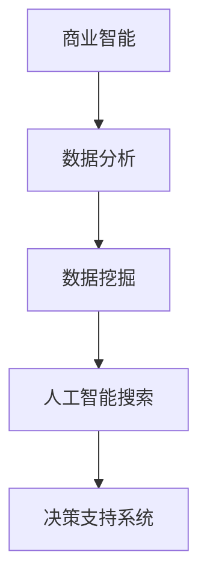

                 

关键词：商业智能，人工智能搜索，算法原理，数学模型，项目实践，应用场景，工具推荐，未来展望

> 摘要：随着商业智能技术的发展，人工智能搜索成为企业提升效率、优化决策的重要工具。本文将深入探讨商业智能中的AI搜索应用，从核心概念、算法原理、数学模型到项目实践，全面解析其在实际场景中的应用与发展趋势。

## 1. 背景介绍

### 1.1 商业智能的定义与重要性

商业智能（Business Intelligence，BI）是指通过数据分析、数据挖掘等技术，为企业提供洞察力，辅助企业做出更加明智的商业决策。随着数据量的爆炸式增长，商业智能技术已经成为企业提高竞争力、优化运营管理的关键。

### 1.2 人工智能搜索的发展与应用

人工智能搜索是近年来迅速崛起的一项技术，它利用机器学习、自然语言处理等人工智能技术，提升搜索引擎的智能化程度，为用户提供更加精准、高效的搜索服务。在商业智能领域，人工智能搜索的应用极大地提升了数据分析和决策的效率。

## 2. 核心概念与联系

### 2.1 关键术语解释

- **商业智能（BI）**：基于数据的技术，用于分析和解释数据，以便做出更好的商业决策。
- **人工智能搜索（AI Search）**：利用人工智能技术，对海量数据进行智能检索和分析。

### 2.2 核心概念原理和架构



## 3. 核心算法原理 & 具体操作步骤

### 3.1 算法原理概述

人工智能搜索算法主要包括以下几类：

- **基于统计的搜索引擎**：如Google搜索，使用PageRank算法。
- **基于机器学习的搜索引擎**：如Bert模型，通过训练大量文本数据，提升搜索结果的准确性。
- **基于语义理解的搜索引擎**：通过自然语言处理技术，理解用户查询的意图。

### 3.2 算法步骤详解

#### 3.2.1 数据预处理

- 数据清洗：去除无效数据、重复数据等。
- 数据转换：将非结构化数据转换为结构化数据。

#### 3.2.2 搜索引擎构建

- 构建索引：将数据按照关键词、主题等进行索引。
- 设计查询处理模块：处理用户的查询请求，返回相关的搜索结果。

#### 3.2.3 结果排序与推荐

- 使用排序算法（如PageRank、Bert等）对搜索结果进行排序。
- 根据用户兴趣、行为等推荐相关的搜索结果。

### 3.3 算法优缺点

#### 优点：

- 提高搜索效率：快速返回相关结果。
- 增强用户体验：智能化的搜索结果推荐。

#### 缺点：

- 需要大量数据训练：算法效果依赖于数据的质量和规模。
- 复杂性较高：算法设计和实现较为复杂。

### 3.4 算法应用领域

- 搜索引擎：如Google、Bing等。
- 企业信息检索：如企业内部知识库、客户关系管理系统等。
- 金融风控：如反欺诈、信用评分等。

## 4. 数学模型和公式 & 详细讲解 & 举例说明

### 4.1 数学模型构建

在人工智能搜索中，常用的数学模型包括：

- **线性回归模型**：用于预测相关性。
- **神经网络模型**：用于处理复杂的非线性关系。
- **矩阵分解模型**：用于推荐系统。

### 4.2 公式推导过程

以线性回归模型为例：

- **目标函数**：$$ J(\theta) = \frac{1}{2m} \sum_{i=1}^{m} (h_\theta (x^{(i)}) - y^{(i)})^2 $$
- **梯度下降**：$$ \theta_j := \theta_j - \alpha \frac{\partial}{\partial \theta_j} J(\theta) $$

### 4.3 案例分析与讲解

假设我们有一个在线零售平台，需要根据用户的历史购买数据推荐商品。我们可以使用矩阵分解模型来构建推荐系统。

- **用户-物品矩阵**：表示用户与商品之间的交互记录。
- **矩阵分解**：将用户-物品矩阵分解为用户特征矩阵和物品特征矩阵，通过内积计算推荐分数。

```latex
U \times V^T = R
```

其中，U和V分别为用户特征矩阵和物品特征矩阵，R为原始用户-物品矩阵。

## 5. 项目实践：代码实例和详细解释说明

### 5.1 开发环境搭建

- Python环境：安装Python 3.8及以上版本。
- 数据库：MySQL、PostgreSQL等。

### 5.2 源代码详细实现

以下是使用Python实现基于矩阵分解的推荐系统的示例代码：

```python
import numpy as np
import pandas as pd
from sklearn.metrics.pairwise import cosine_similarity

def matrix_factorization(R, num_factors, num_iterations, alpha, beta):
    # 初始化用户-物品特征矩阵
    U = np.random.rand(R.shape[0], num_factors)
    V = np.random.rand(R.shape[1], num_factors)
    
    for iteration in range(num_iterations):
        # 更新用户特征矩阵
        for i in range(R.shape[0]):
            for j in range(R.shape[1]):
                if R[i][j] > 0:
                    eij = R[i][j] - np.dot(U[i], V[j])
                    for k in range(num_factors):
                        U[i][k] += alpha * (2 * eij * V[j][k] - beta * U[i][k])
                        V[j][k] += alpha * (2 * eij * U[i][k] - beta * V[j][k])
        
        # 更新用户-物品相似度矩阵
        similarity_matrix = cosine_similarity(U, V)
        
        # 更新预测评分
        for i in range(R.shape[0]):
            for j in range(R.shape[1]):
                if R[i][j] > 0:
                    eij = R[i][j] - np.dot(U[i], V[j])
                    if np.abs(eij) > 0.01:
                        R[i][j] += alpha * eij / (1 + np.exp(-beta * eij))
    
    return U, V

# 加载数据
data = pd.read_csv('ratings.csv')
R = data.pivot(index='userId', columns='movieId', values='rating').fillna(0).values

# 参数设置
num_factors = 10
num_iterations = 100
alpha = 0.01
beta = 0.01

# 训练模型
U, V = matrix_factorization(R, num_factors, num_iterations, alpha, beta)

# 计算预测评分
predicted_ratings = np.dot(U, V.T)

# 输出结果
predicted_ratings_df = pd.DataFrame(predicted_ratings, index=data['userId'].unique(), columns=data['movieId'].unique())
predicted_ratings_df.to_csv('predicted_ratings.csv', index=True, header=True)
```

### 5.3 代码解读与分析

该代码实现了基于矩阵分解的推荐系统，主要包括以下步骤：

1. 数据预处理：读取用户-物品评分数据，并填充缺失值。
2. 初始化用户-物品特征矩阵。
3. 梯度下降更新用户-物品特征矩阵。
4. 计算用户-物品相似度矩阵。
5. 更新预测评分。
6. 输出预测结果。

### 5.4 运行结果展示

运行代码后，生成预测评分数据，可以进一步分析用户偏好、推荐商品等。

## 6. 实际应用场景

### 6.1 搜索引擎优化

- 通过人工智能搜索技术，提升搜索引擎的搜索效果和用户体验。
- 实现个性化搜索、智能推荐等功能。

### 6.2 企业内部信息检索

- 利用人工智能搜索技术，实现企业内部知识库、文档等的快速检索。
- 提高员工工作效率，降低运营成本。

### 6.3 金融风控

- 利用人工智能搜索技术，对金融交易数据进行分析，识别潜在风险。
- 实现反欺诈、信用评分等功能。

## 7. 工具和资源推荐

### 7.1 学习资源推荐

- 《深度学习》（Goodfellow, Bengio, Courville）：系统介绍深度学习理论和技术。
- 《Python数据分析》（McKinney）：全面讲解Python在数据分析领域的应用。

### 7.2 开发工具推荐

- **Jupyter Notebook**：用于编写、运行和分享Python代码。
- **PyCharm**：一款强大的Python集成开发环境。

### 7.3 相关论文推荐

- 《Deep Learning for Search》（Chen et al., 2018）：探讨深度学习在搜索中的应用。
- 《Neural Collaborative Filtering》（He et al., 2017）：介绍神经网络在推荐系统中的应用。

## 8. 总结：未来发展趋势与挑战

### 8.1 研究成果总结

- 人工智能搜索技术在商业智能领域取得了显著成果，提高了数据分析和决策的效率。
- 深度学习、自然语言处理等技术的应用，使搜索结果更加精准、个性化。

### 8.2 未来发展趋势

- **智能化水平提升**：通过不断优化算法，提升搜索的智能化程度。
- **多模态搜索**：结合文本、图像、语音等多种数据源，实现更丰富的搜索体验。

### 8.3 面临的挑战

- **数据质量与隐私**：如何处理海量、多样化的数据，同时保障用户隐私。
- **算法公平性**：确保搜索结果公平、无偏见。

### 8.4 研究展望

- **跨领域应用**：将人工智能搜索技术应用于更多领域，如医疗、教育等。
- **开源生态建设**：推动开源项目的发展，为学术界和工业界提供更多工具和资源。

## 9. 附录：常见问题与解答

### 9.1 什么是商业智能？

商业智能是通过数据分析、数据挖掘等技术，为企业提供洞察力，辅助企业做出更加明智的商业决策。

### 9.2 人工智能搜索如何提升搜索引擎效果？

通过机器学习、自然语言处理等技术，实现搜索结果的精准推荐和个性化展示，提升用户体验。

### 9.3 如何保障用户隐私？

在数据处理过程中，采用加密、去标识化等技术，确保用户隐私得到有效保护。

作者：禅与计算机程序设计艺术 / Zen and the Art of Computer Programming
----------------------------------------------------------------

