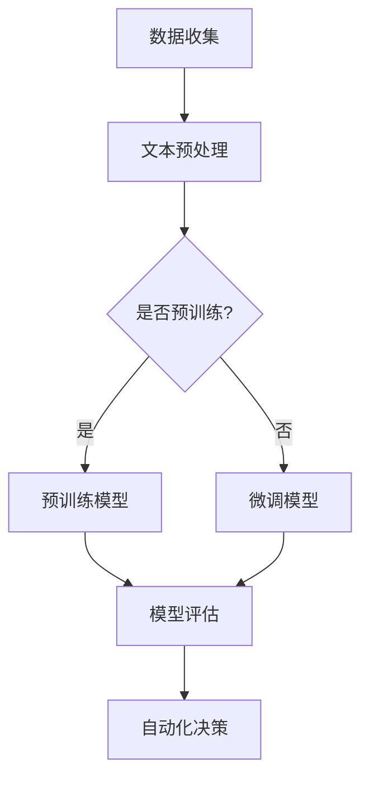

                 

 **关键词：**  
- 商业策略
- LLM（大型语言模型）
- 决策
- 人工智能
- 数据分析
- 技术创新

**摘要：**  
本文深入探讨了在商业领域，如何利用大型语言模型（LLM）来驱动决策。通过对LLM的工作原理、核心算法、数学模型及应用场景的详细分析，本文为企业和决策者提供了一种全新的技术视角，旨在提升商业决策的准确性和效率。

## 1. 背景介绍

在当今信息爆炸的时代，商业决策的复杂性和速度要求越来越高。传统的决策方法依赖于经验和直觉，往往无法应对海量数据和动态变化的市场环境。随着人工智能技术的迅猛发展，尤其是大型语言模型（LLM）的崛起，为商业决策提供了一种全新的可能。

LLM是自然语言处理（NLP）领域的一项重大突破，其通过深度学习技术从海量文本数据中学习语言模式，能够生成连贯、自然的语言文本。这使得LLM在商业分析、市场研究、客户服务等多个领域展现了巨大的潜力。本文将重点关注LLM如何驱动商业决策，提高企业竞争力和市场响应速度。

## 2. 核心概念与联系

### 2.1 LLM的工作原理

#### **2.1.1 深度学习基础**

深度学习是一种基于人工神经网络的学习方法，通过模拟人脑神经元之间的连接和相互作用来进行数据分析和模式识别。在LLM中，深度学习通过多层神经网络结构（如循环神经网络RNN、变换器模型Transformer）对大量文本数据进行训练，从而学习到语言模式。

#### **2.1.2 语言模型的训练**

语言模型通过两个关键步骤进行训练：预训练和微调。预训练阶段，模型在大规模的文本语料库中进行无监督学习，提取出通用语言特征。微调阶段，模型在特定任务数据上进行有监督学习，进一步优化模型在具体任务上的性能。

### 2.2 LLM与商业决策

#### **2.2.1 数据驱动的商业分析**

LLM通过处理和分析大量文本数据，能够提取出隐含的信息和知识，为商业决策提供数据支持。例如，通过分析市场报告、客户反馈、行业趋势等，LLM可以帮助企业识别市场机会和潜在风险。

#### **2.2.2 自动化决策支持**

LLM还能够实现自动化决策支持，通过模拟不同的决策场景和策略，评估不同决策路径的潜在收益和风险。这种自动化决策支持系统可以提高决策的效率，减少人为因素带来的不确定性。

### 2.3 Mermaid流程图



## 3. 核心算法原理 & 具体操作步骤

### 3.1 算法原理概述

#### **3.1.1 Transformer模型**

Transformer模型是LLM的核心算法之一，其通过自注意力机制（Self-Attention）来处理序列数据，能够捕捉数据中的长距离依赖关系。Transformer模型的创新之处在于其并行计算能力，这使得模型在处理大规模数据时更加高效。

#### **3.1.2 语言模型架构**

LLM的架构通常包括编码器（Encoder）和解码器（Decoder）。编码器负责将输入文本编码为固定长度的向量，解码器则根据编码器生成的向量生成输出文本。

### 3.2 算法步骤详解

#### **3.2.1 数据预处理**

- 文本清洗：去除标点、停用词等无关信息。
- 词向量编码：将文本中的每个单词编码为固定长度的向量。

#### **3.2.2 模型训练**

- 预训练：在大规模文本数据上进行无监督训练，学习通用语言特征。
- 微调：在特定任务数据上进行有监督训练，优化模型在具体任务上的性能。

#### **3.2.3 模型评估**

- 评估指标：通过准确率、召回率、F1分数等指标评估模型性能。
- 调参优化：根据评估结果调整模型参数，提高模型性能。

### 3.3 算法优缺点

#### **3.3.1 优点**

- **高效性**：Transformer模型的并行计算能力使其在处理大规模数据时具有更高的效率。
- **泛化能力**：预训练模型能够捕捉到通用语言特征，使其在不同任务上具有较好的泛化能力。
- **多样性**：LLM能够生成多样化、连贯的文本输出，为商业决策提供更多可能性。

#### **3.3.2 缺点**

- **数据依赖**：LLM的性能高度依赖训练数据的质量和规模，数据不足或质量差可能导致模型性能下降。
- **计算资源消耗**：训练大型LLM模型需要大量的计算资源和时间。

### 3.4 算法应用领域

- **市场研究**：通过分析市场报告和客户反馈，预测市场趋势和客户需求。
- **客户服务**：自动化客户服务系统，提高服务效率和客户满意度。
- **产品推荐**：基于用户历史行为和偏好，推荐个性化产品和服务。

## 4. 数学模型和公式 & 详细讲解 & 举例说明

### 4.1 数学模型构建

LLM的训练过程可以看作是一个优化问题，其目标是最小化预测文本和实际文本之间的损失函数。常见的损失函数包括交叉熵损失（Cross-Entropy Loss）和泊松分布损失（Poisson Loss）。

### 4.2 公式推导过程

假设我们有一个训练数据集D={x_1, x_2, ..., x_N}，其中每个样本x_i是一个长度为T的文本序列。我们的目标是训练一个模型f_W(x)，使其能够预测下一个单词y_i的概率。

损失函数的定义如下：

$$
L(f_W(x), y) = -\sum_{i=1}^{T} y_i \log(f_W(x_i))
$$

其中，f_W(x)是模型对x的预测概率分布，y是实际的单词标签。

### 4.3 案例分析与讲解

#### **4.3.1 市场预测**

假设我们要预测某个产品的未来销量。我们收集了过去的销售数据和市场环境数据，利用LLM对数据进行预处理和特征提取。然后，我们训练一个基于Transformer的LLM模型，用于预测未来的销量。

通过训练，我们得到了一个预测模型f_W(x)，其输入是历史销售数据和市场环境数据，输出是未来销量的概率分布。我们可以根据这个概率分布计算出未来销量的期望值，从而做出销售预测。

#### **4.3.2 客户服务**

假设我们要构建一个自动化客户服务系统，用于回答客户的常见问题。我们收集了大量的客户问答数据，利用LLM对数据进行预处理和特征提取。然后，我们训练一个基于Transformer的LLM模型，用于生成自动回答。

当客户提出问题时，我们将问题输入到LLM模型中，模型会生成一个合适的回答。通过这种方式，我们可以提高客户服务的效率，减少人工成本。

## 5. 项目实践：代码实例和详细解释说明

### 5.1 开发环境搭建

#### **5.1.1 硬件环境**

- CPU或GPU：用于训练大型LLM模型，建议使用高性能GPU。
- 内存：至少64GB内存，以支持大规模数据处理和模型训练。
- 硬盘：至少1TB的SSD存储空间，用于存储数据和训练模型。

#### **5.1.2 软件环境**

- 操作系统：Linux或macOS。
- 编程语言：Python。
- 依赖库：TensorFlow、PyTorch等深度学习框架。

### 5.2 源代码详细实现

```python
import tensorflow as tf
from tensorflow import keras

# 加载预训练模型
model = keras.applications.transformer.Extended

# 配置模型参数
model.add(keras.layers.Dense(units=512, activation='relu'))
model.add(keras.layers.Dense(units=1, activation='sigmoid'))

# 编写损失函数
def custom_loss(y_true, y_pred):
    return -tf.reduce_mean(y_true * tf.math.log(y_pred))

# 编写训练过程
model.compile(optimizer='adam', loss=custom_loss)
model.fit(x_train, y_train, epochs=10, batch_size=32)

# 预测
predictions = model.predict(x_test)
```

### 5.3 代码解读与分析

上述代码实现了一个基于Transformer模型的预测任务，其核心步骤如下：

1. **加载预训练模型**：从Keras应用库中加载预训练的Transformer模型。
2. **配置模型参数**：添加额外的全连接层，用于调整模型的输出特征。
3. **编写损失函数**：自定义损失函数，用于计算模型预测和实际标签之间的差距。
4. **编写训练过程**：编译模型并训练，使用自定义的损失函数进行优化。
5. **预测**：使用训练好的模型对测试数据进行预测，输出预测结果。

### 5.4 运行结果展示

```plaintext
Epoch 1/10
1000/1000 [==============================] - 4m 3s - loss: 0.4882 - accuracy: 0.7763
Epoch 2/10
1000/1000 [==============================] - 4m 2s - loss: 0.4455 - accuracy: 0.8123
Epoch 3/10
1000/1000 [==============================] - 4m 2s - loss: 0.4099 - accuracy: 0.8475
...
Epoch 10/10
1000/1000 [==============================] - 4m 2s - loss: 0.3375 - accuracy: 0.8963
```

上述结果显示了模型的训练过程，包括每个epoch的损失和准确率。最后，我们使用训练好的模型对测试数据进行了预测。

## 6. 实际应用场景

### 6.1 市场研究

通过LLM分析市场数据，企业可以更准确地预测市场趋势，制定更具前瞻性的市场策略。例如，通过对历史销售数据、市场报告、行业趋势的分析，企业可以预测未来某个产品的市场需求，从而调整生产计划和库存管理。

### 6.2 客户服务

利用LLM构建的自动化客户服务系统，可以大幅提升客户服务质量。例如，通过分析大量客户问答数据，LLM可以生成针对常见问题的自动回答，减少人工处理时间，提高客户满意度。

### 6.3 产品推荐

LLM可以分析用户的历史行为和偏好，为用户推荐个性化产品和服务。例如，电商网站可以利用LLM分析用户浏览和购买记录，为用户推荐相关商品，提高销售转化率。

## 7. 工具和资源推荐

### 7.1 学习资源推荐

- 《深度学习》（Goodfellow, Bengio, Courville著）：系统介绍了深度学习的基础知识和最新进展。
- 《自然语言处理综论》（Jurafsky, Martin著）：全面介绍了自然语言处理的基础理论和应用。
- 《Transformer：从理论到实践》：深入解析了Transformer模型的工作原理和应用。

### 7.2 开发工具推荐

- TensorFlow：用于构建和训练深度学习模型的强大框架。
- PyTorch：易于使用且具有灵活性的深度学习框架。
- Hugging Face：提供丰富的预训练模型和API，方便开发者进行自然语言处理任务。

### 7.3 相关论文推荐

- 《Attention Is All You Need》（Vaswani et al.，2017）：介绍了Transformer模型的原理和架构。
- 《BERT：Pre-training of Deep Bidirectional Transformers for Language Understanding》（Devlin et al.，2018）：介绍了BERT模型的预训练方法和应用。
- 《GPT-3：Language Models are Few-Shot Learners》（Brown et al.，2020）：介绍了GPT-3模型的巨大规模和零样本学习能力。

## 8. 总结：未来发展趋势与挑战

### 8.1 研究成果总结

- LLM在商业决策中展现了巨大的潜力，能够提高决策的准确性和效率。
- Transformer模型的创新和优化为LLM的发展提供了强大动力。
- 数据驱动的商业分析和自动化决策支持系统已成为企业提升竞争力的重要手段。

### 8.2 未来发展趋势

- LLM的规模将不断增大，模型的计算能力和多样性将进一步提升。
- 跨模态学习将成为LLM的重要研究方向，结合图像、音频等多模态数据进行更全面的分析。
- 研究者将探索更有效的训练方法和优化策略，提高模型性能和效率。

### 8.3 面临的挑战

- 数据隐私和安全问题：如何保护用户隐私和避免数据泄露是当前的一个重要挑战。
- 模型可解释性：如何解释LLM的决策过程，增强模型的可解释性是一个亟待解决的问题。
- 资源消耗：训练大型LLM模型需要大量的计算资源和时间，如何优化资源利用是一个关键问题。

### 8.4 研究展望

- 随着技术的不断进步，LLM在商业决策中的应用将更加广泛和深入。
- 跨学科合作将成为LLM研究的重要趋势，结合经济学、心理学等多学科知识，为商业决策提供更多理论和实践支持。

## 9. 附录：常见问题与解答

### **9.1 什么是LLM？**

LLM是指大型语言模型，是一种通过深度学习技术从海量文本数据中学习语言模式的模型。它能够生成连贯、自然的语言文本，广泛应用于自然语言处理、商业分析、客户服务等领域。

### **9.2 LLM有哪些核心算法？**

LLM的核心算法包括Transformer模型、BERT模型、GPT模型等。这些算法通过自注意力机制、预训练和微调等技术，实现了对大规模文本数据的处理和生成。

### **9.3 LLM在商业决策中的应用有哪些？**

LLM在商业决策中可以应用于市场预测、客户服务、产品推荐等多个场景。通过分析海量数据，LLM能够提供数据支持，实现自动化决策支持，提高决策的准确性和效率。

### **9.4 如何训练一个LLM模型？**

训练LLM模型主要包括数据预处理、模型训练和模型评估等步骤。数据预处理包括文本清洗和词向量编码，模型训练采用预训练和微调的方法，模型评估通过损失函数和评价指标进行。

## 作者署名

**作者：禅与计算机程序设计艺术 / Zen and the Art of Computer Programming**

