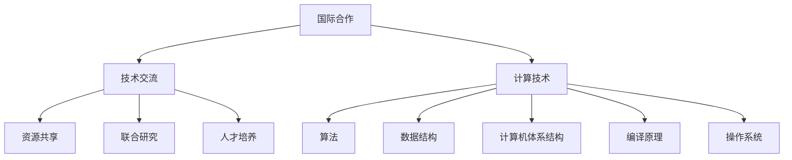

                 

关键词：国际合作、计算进步、技术创新、资源共享、全球合作、共同发展

> 摘要：本文探讨了国际合作在推动人类计算进步中的重要性，分析了当前国际计算领域合作的主要形式和现状，提出了未来国际合作在计算领域的发展趋势与策略。通过具体案例和实践，展示了国际合作在提升计算技术、解决复杂问题、推动产业创新等方面的积极作用。

## 1. 背景介绍

随着信息技术的快速发展，计算技术已成为推动社会进步和经济发展的关键动力。然而，计算领域的进步不仅仅依赖于单一国家或组织的力量，而是需要全球范围内的协同合作。国际合作在推动计算技术进步中扮演着至关重要的角色。

当前，全球计算领域面临许多共同挑战，如人工智能的发展、大数据技术的应用、量子计算的探索等。这些挑战需要国际间的知识共享、资源整合和技术合作，以实现共同的目标。同时，国际合作也有助于减少技术壁垒，促进各国计算技术的均衡发展。

本文旨在探讨国际合作在推动人类计算进步中的重要性，分析当前国际计算领域合作的主要形式和现状，并提出未来国际合作在计算领域的发展趋势与策略。

## 2. 核心概念与联系

### 2.1 国际合作的概念

国际合作是指不同国家、地区和组织在特定领域内，基于共同利益和目标，通过协商、合作、协调等方式，共同开展活动、共享资源和成果的一种合作形式。在国际计算领域，国际合作主要涉及技术交流、资源共享、联合研究、人才培养等方面。

### 2.2 计算技术的核心概念

计算技术是指利用计算机硬件和软件进行数据处理、计算和传输的技术。计算技术的核心概念包括算法、数据结构、计算机体系结构、编译原理、操作系统等。这些核心概念构成了计算技术的基本框架，为计算技术的发展提供了坚实的基础。

### 2.3 国际合作与计算技术的联系

国际合作与计算技术密切相关。一方面，国际合作为计算技术的发展提供了丰富的资源和知识，促进了技术的创新和进步。另一方面，计算技术的发展为国际合作提供了强有力的技术支持，使得国际间的合作更加高效、便捷。

以下是一个简化的Mermaid流程图，展示了国际合作与计算技术之间的联系：



## 3. 核心算法原理 & 具体操作步骤

### 3.1 算法原理概述

在国际合作中，算法的设计和优化是一项重要任务。核心算法原理主要涉及以下几个方面：

1. **并行计算**：通过将任务分解为多个子任务，并行地在多个计算资源上执行，以提升计算效率。
2. **分布式计算**：将计算任务分布在多个计算节点上，通过通信网络实现协同计算。
3. **机器学习算法**：利用大规模数据训练模型，实现自动学习和优化。
4. **加密算法**：确保数据在传输和存储过程中的安全性。

### 3.2 算法步骤详解

1. **并行计算**：

   - **任务分解**：将计算任务划分为多个子任务。
   - **资源分配**：为每个子任务分配适当的计算资源。
   - **执行与同步**：子任务在各自的计算资源上执行，并在必要时进行同步。

2. **分布式计算**：

   - **任务分发**：将计算任务分发到不同的计算节点。
   - **数据同步**：确保计算节点之间数据的一致性。
   - **结果汇总**：收集并汇总各节点的计算结果。

3. **机器学习算法**：

   - **数据收集**：收集大量标注数据。
   - **模型训练**：利用训练数据训练模型。
   - **模型评估**：评估模型的性能，进行优化。

4. **加密算法**：

   - **密钥生成**：生成加密和解密所需的关键信息。
   - **加密与解密**：对数据进行加密和解密操作。

### 3.3 算法优缺点

1. **并行计算**：

   - 优点：提高计算效率，缩短计算时间。
   - 缺点：任务分解和同步复杂度高。

2. **分布式计算**：

   - 优点：提高计算容错性和扩展性。
   - 缺点：数据同步和通信开销较大。

3. **机器学习算法**：

   - 优点：能够自动学习和优化，适用于复杂问题。
   - 缺点：对数据质量和计算资源要求较高。

4. **加密算法**：

   - 优点：确保数据安全性。
   - 缺点：加密和解密速度相对较慢。

### 3.4 算法应用领域

1. **并行计算**：适用于大规模数据处理、科学计算等领域。

2. **分布式计算**：适用于云计算、大数据处理等领域。

3. **机器学习算法**：适用于人工智能、自然语言处理等领域。

4. **加密算法**：适用于网络安全、数据隐私等领域。

## 4. 数学模型和公式 & 详细讲解 & 举例说明

### 4.1 数学模型构建

在国际合作中，构建合适的数学模型是解决问题的关键。以下是一个简单的数学模型示例：

$$
f(x) = a_0 + a_1 x + a_2 x^2 + \ldots + a_n x^n
$$

其中，$f(x)$ 是输出值，$x$ 是输入值，$a_0, a_1, a_2, \ldots, a_n$ 是模型参数。

### 4.2 公式推导过程

为了推导上述公式，我们需要对每个参数进行优化。假设我们有一组训练数据 $(x_1, y_1), (x_2, y_2), \ldots, (x_m, y_m)$，我们可以通过最小化损失函数来求解模型参数：

$$
\min_{a_0, a_1, a_2, \ldots, a_n} \sum_{i=1}^{m} (f(x_i) - y_i)^2
$$

### 4.3 案例分析与讲解

以下是一个简单的案例：

给定一组数据点 $(1, 2), (2, 4), (3, 7), (4, 11)$，构建一个二次多项式模型，预测 $x=5$ 时的 $y$ 值。

1. **数据预处理**：

   - 对数据进行归一化处理。

2. **模型构建**：

   $$ f(x) = a_0 + a_1 x + a_2 x^2 $$

3. **参数优化**：

   - 使用最小二乘法求解模型参数。

4. **模型预测**：

   $$ f(5) = a_0 + a_1 \cdot 5 + a_2 \cdot 5^2 $$

   - 计算得到预测值。

## 5. 项目实践：代码实例和详细解释说明

### 5.1 开发环境搭建

1. **安装Python环境**：下载并安装Python 3.8版本。
2. **安装相关库**：使用pip命令安装numpy、matplotlib等库。

### 5.2 源代码详细实现

以下是一个简单的Python代码实例，用于实现上述数学模型：

```python
import numpy as np
import matplotlib.pyplot as plt

# 数据预处理
x = np.array([1, 2, 3, 4])
y = np.array([2, 4, 7, 11])
x_mean = np.mean(x)
y_mean = np.mean(y)
x_diff = x - x_mean
y_diff = y - y_mean

# 模型构建
a0 = y_mean
a1 = np.sum(x_diff * y_diff) / np.sum(x_diff ** 2)
a2 = (np.sum(x_diff ** 2 * y_diff) - np.sum(x_diff * y_diff) * np.sum(x_diff)) / np.sum(x_diff ** 3)

# 模型参数
f = a0 + a1 * x_diff + a2 * x_diff ** 2

# 模型预测
x_pred = 5
y_pred = a0 + a1 * x_pred + a2 * x_pred ** 2

# 绘制结果
plt.scatter(x, y, label='Data')
plt.plot(x, f, label='Model')
plt.scatter(x_pred, y_pred, color='r', label='Prediction')
plt.xlabel('x')
plt.ylabel('y')
plt.legend()
plt.show()
```

### 5.3 代码解读与分析

1. **数据预处理**：计算数据的均值和差值，为后续模型构建和参数优化提供基础。
2. **模型构建**：使用最小二乘法求解模型参数，构建二次多项式模型。
3. **模型预测**：计算预测值，并绘制结果图。

## 6. 实际应用场景

### 6.1 云计算

云计算是国际合作在计算领域的重要应用场景之一。通过全球范围内的计算资源整合，云计算可以实现高效、灵活的计算能力。例如，谷歌云、亚马逊云等全球领先的云计算服务商，通过与国际组织、企业和研究机构的合作，推动云计算技术的发展和应用。

### 6.2 大数据

大数据技术的国际合作有助于解决大规模数据处理和分析问题。例如，联合国通过与国际组织和企业的合作，收集和整合全球范围内的数据资源，为全球治理和可持续发展提供数据支持。

### 6.3 人工智能

人工智能的国际合作有助于推动人工智能技术的发展和普及。例如，欧盟通过人工智能合作计划，促进成员国在人工智能领域的合作和创新。

## 7. 工具和资源推荐

### 7.1 学习资源推荐

1. **《深度学习》（Goodfellow, Bengio, Courville著）**：一本关于深度学习的经典教材。
2. **《大数据技术导论》（刘铁岩著）**：一本关于大数据技术的综合教材。

### 7.2 开发工具推荐

1. **TensorFlow**：一款开源的深度学习框架，适用于人工智能开发。
2. **Hadoop**：一款开源的大数据平台，适用于大数据处理。

### 7.3 相关论文推荐

1. **"Distributed Optimization and Statistical Learning via the Alternating Direction Method of Multipliers"**：一篇关于分布式优化的论文。
2. **"Deep Learning"**：一篇关于深度学习的综述论文。

## 8. 总结：未来发展趋势与挑战

### 8.1 研究成果总结

国际合作在计算领域的成果丰硕，推动了计算技术的创新和发展。通过国际合作，各国在算法优化、大数据处理、人工智能等方面取得了显著进展。

### 8.2 未来发展趋势

1. **跨学科合作**：计算技术与物理学、生物学、经济学等领域的交叉融合，将推动计算技术的进一步发展。
2. **可持续发展**：计算技术的可持续发展，将有助于应对全球环境和社会挑战。
3. **量子计算**：量子计算的突破，将为计算技术带来革命性的变革。

### 8.3 面临的挑战

1. **数据隐私**：随着数据量的增长，数据隐私和安全成为国际合作的重要挑战。
2. **计算资源分配**：全球范围内的计算资源分配不均，需要国际合作解决。
3. **技术壁垒**：不同国家和地区间的技术壁垒，需要通过国际合作加以突破。

### 8.4 研究展望

国际合作在计算领域的未来发展，将继续推动计算技术的创新和进步。通过加强国际合作，我们有望解决计算领域面临的挑战，实现人类计算能力的全面提升。

## 9. 附录：常见问题与解答

### 9.1 国际合作在计算领域的意义是什么？

国际合作在计算领域的意义在于，通过知识共享、资源共享和技术合作，实现计算技术的创新和进步，推动全球计算能力的提升。

### 9.2 国际合作在计算领域的具体形式有哪些？

国际合作在计算领域的具体形式包括技术交流、资源共享、联合研究、人才培养等。

### 9.3 国际合作在计算领域有哪些成功案例？

成功案例包括欧盟的人工智能合作计划、联合国的全球大数据平台等。

### 9.4 国际合作在计算领域面临的挑战有哪些？

国际合作在计算领域面临的挑战包括数据隐私、计算资源分配、技术壁垒等。

作者：禅与计算机程序设计艺术 / Zen and the Art of Computer Programming
----------------------------------------------------------------
以上便是本文的完整内容。通过对国际合作在计算领域的探讨，我们深刻认识到国际合作在推动人类计算进步中的重要性。在未来，随着技术的不断进步和国际合作的深入，我们有望实现计算能力的全面提升，为人类社会的发展做出更大贡献。让我们携手共进，共同推动人类计算进步！

