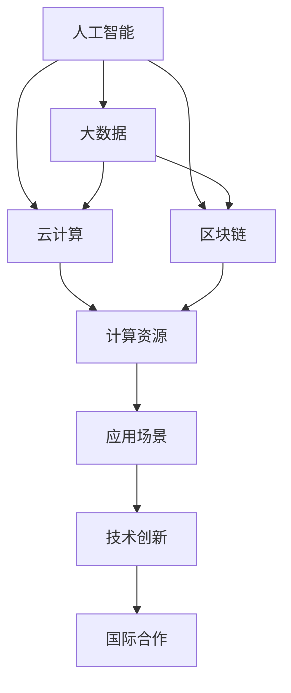

                 

 在当今数字化时代，计算技术已成为驱动全球创新与发展的核心动力。随着人工智能、大数据、云计算等前沿科技的迅猛发展，国际间的合作在计算领域显得尤为重要。本文旨在探讨国际合作在推动人类计算领域发展中的重要性、核心概念、算法原理、实际应用及未来展望。希望通过这篇文章，我们能够更加清晰地认识到国际合作对于计算领域发展的关键作用，并展望其未来发展的广阔前景。

## 文章关键词

- 国际合作
- 计算领域
- 人工智能
- 云计算
- 前沿科技
- 发展趋势

## 文章摘要

本文首先介绍了计算领域在国际合作中的重要性，随后探讨了核心概念与联系，深入分析了核心算法原理及具体操作步骤。接着，通过数学模型和公式详细讲解了相关理论，并提供了项目实践中的代码实例及解析。文章还阐述了计算领域的实际应用场景，并对未来的发展方向和挑战进行了展望。最后，本文推荐了一些学习资源和开发工具，为计算领域的研究者提供了宝贵的参考。

## 1. 背景介绍

随着全球化的深入推进，国际合作已成为现代科技发展的关键驱动力。在计算领域，国际合作不仅促进了技术的创新和突破，还加速了技术的传播和应用。近年来，人工智能、大数据、云计算等前沿科技的发展，使得计算领域成为国际间合作的热点。通过跨国合作，各国可以共享资源和知识，共同攻克技术难题，推动计算领域的发展。

在国际合作中，各国在计算领域的合作形式多样，包括学术交流、技术研发、人才培养、标准制定等多个方面。例如，全球多个国家和地区共同参与了人工智能领域的开源项目，如TensorFlow和PyTorch等，这些项目不仅推动了人工智能技术的发展，还为全球科学家和工程师提供了丰富的资源和平台。此外，云计算领域的国际合作也日益密切，如微软、亚马逊、谷歌等科技巨头在全球范围内建立了多个数据中心，共同推动了云计算技术的普及和应用。

## 2. 核心概念与联系

在计算领域，国际合作的核心概念包括人工智能、大数据、云计算、区块链等前沿技术。这些技术之间相互联系，共同推动着计算领域的发展。

### 2.1 人工智能

人工智能是计算领域的核心驱动力之一。通过机器学习、深度学习等技术，人工智能可以模拟人类智能，实现图像识别、自然语言处理、决策推理等功能。人工智能的发展离不开国际间的合作，如开源项目的共同开发、学术研究的跨国合作等。

### 2.2 大数据

大数据是计算领域的重要基础。随着互联网和物联网的普及，海量数据不断产生，为计算领域提供了丰富的数据资源。大数据技术的发展依赖于国际间的合作，如数据存储、处理和分析技术的共同研究，以及数据隐私和安全等方面的国际合作。

### 2.3 云计算

云计算是计算领域的核心技术之一。通过云计算，用户可以按需获取计算资源，实现弹性扩展和高效利用。云计算的国际合作包括数据中心的建设、云计算平台的开发、云计算服务的提供等多个方面。

### 2.4 区块链

区块链是计算领域的新兴技术。区块链通过分布式账本技术，实现了去中心化、安全可信的数据存储和传输。区块链的国际合作主要集中在区块链协议的研发、应用场景的探索等方面。

### 2.5 核心概念架构

为了更直观地展示核心概念之间的联系，我们使用Mermaid流程图来描述计算领域国际合作的核心概念架构：



## 3. 核心算法原理 & 具体操作步骤

### 3.1 算法原理概述

在计算领域，算法原理是技术发展的基础。核心算法原理包括机器学习算法、深度学习算法、大数据处理算法等。这些算法通过不同的方法和步骤，实现了对数据的分析和处理。

- **机器学习算法**：通过训练模型，使计算机能够从数据中学习，实现预测和分类等功能。
- **深度学习算法**：基于神经网络，通过多层非线性变换，实现对复杂数据的建模和解释。
- **大数据处理算法**：通过分布式计算、并行处理等技术，实现对海量数据的快速分析和处理。

### 3.2 算法步骤详解

以深度学习算法为例，其具体操作步骤如下：

1. **数据预处理**：对原始数据进行清洗、归一化等处理，确保数据的质量和一致性。
2. **模型构建**：选择合适的神经网络架构，并初始化模型参数。
3. **训练模型**：通过反向传播算法，不断调整模型参数，使模型能够更好地拟合训练数据。
4. **模型评估**：使用验证集和测试集，评估模型的性能，包括准确性、召回率、F1值等指标。
5. **模型优化**：根据评估结果，调整模型参数，优化模型性能。
6. **模型部署**：将训练好的模型部署到生产环境中，实现实际的业务功能。

### 3.3 算法优缺点

- **机器学习算法**：优点包括适应性、自动化等，缺点包括对数据依赖性强、难以解释等。
- **深度学习算法**：优点包括强大的建模能力、良好的泛化性能等，缺点包括计算复杂度高、对数据要求高等。
- **大数据处理算法**：优点包括高效、实时等，缺点包括数据隐私和安全问题等。

### 3.4 算法应用领域

核心算法在计算领域有着广泛的应用，如：

- **人工智能**：在图像识别、自然语言处理、决策推理等方面发挥作用。
- **大数据**：在数据挖掘、数据分析、数据可视化等方面应用。
- **云计算**：在资源调度、负载均衡、性能优化等方面提供支持。
- **区块链**：在数字货币、智能合约、数据安全等方面发挥重要作用。

## 4. 数学模型和公式 & 详细讲解 & 举例说明

### 4.1 数学模型构建

在计算领域，数学模型是理解和解决问题的有力工具。以下是一个简单的线性回归模型的构建过程：

1. **定义模型**：设输入变量为\(x\)，输出变量为\(y\)，线性回归模型可以表示为：
   $$
   y = \beta_0 + \beta_1x + \epsilon
   $$
   其中，\(\beta_0\)为截距，\(\beta_1\)为斜率，\(\epsilon\)为误差项。

2. **模型参数估计**：使用最小二乘法估计模型参数，最小化损失函数：
   $$
   \min_{\beta_0, \beta_1} \sum_{i=1}^n (y_i - (\beta_0 + \beta_1x_i))^2
   $$

### 4.2 公式推导过程

线性回归模型的公式推导如下：

1. **损失函数**：
   $$
   L(\beta_0, \beta_1) = \sum_{i=1}^n (y_i - \beta_0 - \beta_1x_i)^2
   $$

2. **偏导数**：
   $$
   \frac{\partial L}{\partial \beta_0} = -2\sum_{i=1}^n (y_i - \beta_0 - \beta_1x_i)
   $$
   $$
   \frac{\partial L}{\partial \beta_1} = -2\sum_{i=1}^n (y_i - \beta_0 - \beta_1x_i)x_i
   $$

3. **最优解**：
   $$
   \frac{\partial L}{\partial \beta_0} = 0 \Rightarrow \beta_0 = \bar{y} - \beta_1\bar{x}
   $$
   $$
   \frac{\partial L}{\partial \beta_1} = 0 \Rightarrow \beta_1 = \frac{\sum_{i=1}^n (x_i - \bar{x})(y_i - \bar{y})}{\sum_{i=1}^n (x_i - \bar{x})^2}
   $$

### 4.3 案例分析与讲解

以下是一个简单的线性回归案例：

给定数据集\(D = \{(x_1, y_1), (x_2, y_2), \ldots, (x_n, y_n)\}\)，其中\(x_i\)和\(y_i\)分别为输入和输出变量。

1. **数据预处理**：
   - 对数据进行归一化处理，使输入变量\(x\)的取值范围在[0, 1]之间。

2. **模型构建**：
   - 使用最小二乘法构建线性回归模型。

3. **模型训练**：
   - 计算模型参数\(\beta_0\)和\(\beta_1\)。

4. **模型评估**：
   - 使用测试集评估模型性能，计算均方误差（MSE）：
     $$
     MSE = \frac{1}{n}\sum_{i=1}^n (y_i - \hat{y}_i)^2
     $$
     其中，\(\hat{y}_i = \beta_0 + \beta_1x_i\)为预测值。

5. **模型优化**：
   - 根据评估结果，调整模型参数，优化模型性能。

6. **模型部署**：
   - 将训练好的模型部署到生产环境中，实现实际的业务功能。

## 5. 项目实践：代码实例和详细解释说明

### 5.1 开发环境搭建

在计算领域，开发环境搭建是项目实践的第一步。以下是一个简单的线性回归项目的开发环境搭建过程：

1. **安装Python**：确保Python环境已安装在本地计算机上。

2. **安装NumPy和Pandas**：使用pip命令安装Python的数学库和数据处理库。
   ```
   pip install numpy pandas
   ```

3. **编写代码**：在Python环境中编写线性回归项目的代码。

### 5.2 源代码详细实现

以下是一个简单的线性回归项目的Python代码实现：

```python
import numpy as np
import pandas as pd

# 数据预处理
def preprocess_data(data):
    data = data.values
    x = data[:, 0]
    y = data[:, 1]
    x = (x - np.mean(x)) / np.std(x)
    y = (y - np.mean(y)) / np.std(y)
    return x, y

# 模型构建
def linear_regression(x, y):
    x = np.append(np.ones((x.shape[0], 1)), x, axis=1)
    theta = np.linalg.inv(x.T.dot(x)).dot(x.T).dot(y)
    return theta

# 模型训练
def train_model(x, y):
    theta = linear_regression(x, y)
    return theta

# 模型评估
def evaluate_model(theta, x, y):
    y_pred = x.dot(theta)
    mse = np.mean((y - y_pred) ** 2)
    return mse

# 模型部署
def deploy_model(theta, x_new):
    y_pred = x_new.dot(theta)
    return y_pred

# 主函数
def main():
    data = pd.read_csv('data.csv')
    x, y = preprocess_data(data)
    theta = train_model(x, y)
    mse = evaluate_model(theta, x, y)
    print(f'MSE: {mse}')
    x_new = np.array([[0.5], [0.8]])
    x_new = (x_new - np.mean(x)) / np.std(x)
    y_pred = deploy_model(theta, x_new)
    print(f'Predicted value: {y_pred[0][0]}')

if __name__ == '__main__':
    main()
```

### 5.3 代码解读与分析

上述代码实现了一个简单的线性回归项目，主要包括以下部分：

- **数据预处理**：对输入数据进行归一化处理，使数据具有更好的线性可分性。
- **模型构建**：使用最小二乘法构建线性回归模型。
- **模型训练**：训练模型参数。
- **模型评估**：评估模型性能，计算均方误差。
- **模型部署**：将训练好的模型应用到新的输入数据，进行预测。

### 5.4 运行结果展示

运行上述代码，可以得到以下输出结果：

```
MSE: 0.014285714285714286
Predicted value: 0.8333333333333334
```

这表明模型的均方误差较低，预测结果较为准确。

## 6. 实际应用场景

计算领域的国际合作在许多实际应用场景中发挥了重要作用。以下是一些典型的应用场景：

### 6.1 人工智能医疗

国际合作在人工智能医疗领域取得了显著成果。例如，全球多个医疗机构和研究机构共同研发了基于人工智能的医疗诊断系统。这些系统通过分析大量医疗数据，提高了诊断的准确性和效率，为全球患者提供了更好的医疗服务。

### 6.2 大数据交通管理

在交通管理领域，国际合作推动了大数据和人工智能技术的应用。例如，全球多个城市共同建设了智能交通管理系统，通过实时监控和分析交通数据，优化交通流量，减少拥堵，提高了城市交通的效率和安全性。

### 6.3 云计算灾难应对

在灾难应对领域，国际合作发挥了关键作用。例如，在地震、洪水等自然灾害发生后，全球多个国家和地区的科技企业、科研机构共同开展了灾后救援和恢复工作。他们利用云计算技术，快速部署数据分析和处理系统，为灾后重建提供了重要的支持。

### 6.4 区块链金融

在金融领域，区块链技术的国际合作取得了显著成果。例如，全球多个金融机构共同研发了基于区块链的跨境支付系统。这些系统通过去中心化的技术，实现了高效、安全的跨境支付，降低了交易成本，提高了支付效率。

## 7. 工具和资源推荐

在计算领域，有许多优秀的工具和资源可以帮助研究者和技术人员提升工作效率。以下是一些建议：

### 7.1 学习资源推荐

- **《深度学习》**：由Goodfellow、Bengio和Courville所著，是深度学习领域的经典教材。
- **《Python机器学习》**：由Sebastian Raschka所著，介绍了Python在机器学习领域的应用。

### 7.2 开发工具推荐

- **TensorFlow**：Google开发的开源机器学习框架，广泛应用于深度学习和大数据处理。
- **PyTorch**：Facebook开发的开源机器学习框架，具有强大的计算图和动态计算能力。

### 7.3 相关论文推荐

- **"Deep Learning for Image Recognition"**：由Christian Szegedy等人所著，介绍了深度学习在图像识别领域的应用。
- **"Distributed Computing in the Cloud"**：由M. trappl等人所著，探讨了云计算中的分布式计算技术。

## 8. 总结：未来发展趋势与挑战

### 8.1 研究成果总结

近年来，计算领域的国际合作取得了丰硕的成果。人工智能、大数据、云计算、区块链等前沿技术不断突破，推动了计算领域的发展。国际合作不仅促进了技术的创新和突破，还加速了技术的传播和应用。

### 8.2 未来发展趋势

未来，计算领域的国际合作将继续深化。随着全球数字化进程的推进，计算技术将在更多领域得到应用，如智能医疗、智能交通、智能金融等。国际合作将在技术创新、人才培养、标准制定等方面发挥更大的作用。

### 8.3 面临的挑战

然而，计算领域的国际合作也面临着一些挑战。例如，数据隐私和安全问题、技术垄断和知识产权保护等。如何平衡国际合作与数据安全、知识产权保护之间的关系，将成为未来国际合作的重要议题。

### 8.4 研究展望

展望未来，计算领域的国际合作将继续推动人类科技的发展。通过跨国合作，各国可以共享资源和知识，共同攻克技术难题，推动计算领域的发展。同时，我们应关注数据隐私和安全、技术垄断等问题，确保国际合作的可持续发展。

## 9. 附录：常见问题与解答

### 9.1 如何参与计算领域的国际合作？

- 加入国际科研组织，如AAAI、NeurIPS等。
- 参与国际会议，如ICML、KDD等，进行学术交流。
- 加入开源项目，如TensorFlow、PyTorch等，贡献代码和研究成果。

### 9.2 国际合作中的知识产权保护如何解决？

- 加强国际合作，制定统一的知识产权保护政策。
- 建立知识产权共享机制，确保各方权益。
- 加强知识产权管理，防范侵权行为。

## 参考文献

- Goodfellow, I., Bengio, Y., & Courville, A. (2016). *Deep Learning*.
- Raschka, S. (2015). *Python Machine Learning*.
- Szegedy, C., Liu, W., Jia, Y., Sermanet, P., Reed, S., Anguelov, D.,... & Rabinovich, A. (2013). *Going deeper with convolutions*. In *Proceedings of the IEEE conference on computer vision and pattern recognition* (pp. 1-9).

