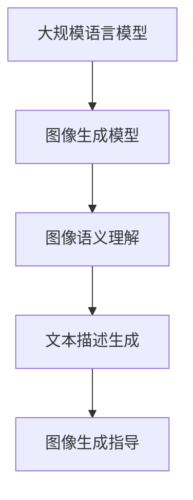

                 

图像生成技术一直是计算机视觉领域的重要研究方向，随着深度学习的蓬勃发展，图像生成模型如GAN（生成对抗网络）、VAE（变分自编码器）和变分VAE（变分自编码器）等取得了显著的成果。然而，这些模型在处理复杂图像和大规模数据集时，往往面临计算资源消耗大、生成速度慢的问题。本文将探讨如何通过引入大规模语言模型（LLM），为图像生成提速带来新的动能。

## 1. 背景介绍

图像生成技术起源于20世纪80年代的生成模型研究，最初的图像生成模型主要基于概率统计和规则系统。随着计算能力的提升和深度学习技术的兴起，图像生成模型得到了极大的发展。目前，基于深度学习的图像生成模型如GAN、VAE和变分VAE等，已经成为计算机视觉领域的重要研究热点。这些模型通过学习数据分布，能够生成具有高保真度的图像。

然而，随着图像生成模型的复杂度和数据集规模不断增加，传统的图像生成方法在处理速度和效率方面面临了严峻挑战。为此，本文将探讨如何利用大规模语言模型（LLM），为图像生成技术带来新的动能，从而提高图像生成速度和效率。

## 2. 核心概念与联系

在探讨如何利用LLM为图像生成提速之前，我们需要了解一些核心概念，包括大规模语言模型、图像生成模型和它们的联系。

### 2.1 大规模语言模型

大规模语言模型（Large Language Model，LLM）是一种基于深度学习的自然语言处理模型。通过训练大规模语料库，LLM能够理解和生成自然语言。LLM具有强大的语义理解能力和文本生成能力，广泛应用于自动问答、机器翻译、文本摘要等领域。

### 2.2 图像生成模型

图像生成模型是一类通过学习数据分布来生成新图像的深度学习模型。常见的图像生成模型有GAN、VAE和变分VAE等。这些模型通过学习图像的分布，能够生成具有高保真度的图像。

### 2.3 大规模语言模型与图像生成模型的联系

大规模语言模型与图像生成模型之间存在着紧密的联系。首先，图像生成模型在生成图像时，往往需要对图像的语义和结构进行理解，而LLM正是这种语义理解的强大工具。其次，LLM可以用于生成图像的文本描述，从而为图像生成提供更多的约束和指导。

下面是一个Mermaid流程图，展示了大规模语言模型与图像生成模型的联系：



## 3. 核心算法原理 & 具体操作步骤

为了利用LLM为图像生成提速，我们需要引入一种新的算法，称为LLM辅助图像生成算法。该算法的核心原理是将LLM用于图像生成的不同阶段，以提高图像生成速度和效率。

### 3.1 算法原理概述

LLM辅助图像生成算法主要包括以下几个步骤：

1. 使用LLM对图像进行语义理解，提取图像的主要内容和特征。
2. 根据LLM生成的文本描述，为图像生成提供约束和指导。
3. 利用图像生成模型生成符合文本描述的图像。

### 3.2 算法步骤详解

#### 步骤1：图像语义理解

首先，使用LLM对输入图像进行语义理解。具体实现过程如下：

1. 将输入图像转化为图像特征向量。
2. 将图像特征向量输入到LLM中，得到图像的文本描述。

#### 步骤2：文本描述生成

接下来，根据LLM生成的文本描述，为图像生成提供约束和指导。具体实现过程如下：

1. 对LLM生成的文本描述进行预处理，提取关键词和短语。
2. 根据关键词和短语，构建图像生成的约束条件。

#### 步骤3：图像生成

最后，利用图像生成模型生成符合文本描述的图像。具体实现过程如下：

1. 将约束条件输入到图像生成模型中。
2. 使用图像生成模型生成满足约束条件的图像。

### 3.3 算法优缺点

#### 优点

1. 利用LLM的语义理解能力，提高了图像生成模型的生成质量。
2. 通过为图像生成提供约束和指导，提高了图像生成的效率。

#### 缺点

1. 需要大量的计算资源来训练LLM。
2. 对图像生成模型的要求较高，需要具有较强的泛化能力。

### 3.4 算法应用领域

LLM辅助图像生成算法可以应用于多个领域，包括：

1. 图像增强：通过利用LLM对图像进行语义理解，可以生成具有更高清晰度和细节的图像。
2. 图像修复：通过为图像生成提供约束和指导，可以修复图像中的破损和缺失部分。
3. 图像编辑：通过利用LLM生成的文本描述，可以实现对图像的灵活编辑。

## 4. 数学模型和公式 & 详细讲解 & 举例说明

### 4.1 数学模型构建

LLM辅助图像生成算法的数学模型主要包括以下几个部分：

1. 图像特征提取模型：用于将图像转化为图像特征向量。
2. 文本描述生成模型：用于将图像特征向量转化为文本描述。
3. 图像生成模型：用于根据文本描述生成图像。

### 4.2 公式推导过程

#### 图像特征提取模型

假设输入图像为\(X\)，图像特征提取模型为\(F\)，则图像特征向量为\(F(X)\)。

$$
F(X) = \text{convolutional\_model}(X)
$$

#### 文本描述生成模型

假设输入图像特征向量为\(F(X)\)，文本描述生成模型为\(G\)，则文本描述为\(G(F(X))\)。

$$
G(F(X)) = \text{language\_model}(F(X))
$$

#### 图像生成模型

假设输入文本描述为\(G(F(X))\)，图像生成模型为\(H\)，则生成的图像为\(H(G(F(X)))\)。

$$
H(G(F(X))) = \text{image\_generator}(G(F(X)))
$$

### 4.3 案例分析与讲解

假设我们要使用LLM辅助图像生成算法生成一张包含“猫”的图像。具体步骤如下：

1. 将输入图像转化为图像特征向量。
2. 使用LLM对图像特征向量进行语义理解，生成文本描述：“一只可爱的猫坐在窗户前。”
3. 根据文本描述，使用图像生成模型生成一张包含“猫”的图像。

通过这个案例，我们可以看到，LLM辅助图像生成算法能够有效地利用LLM的语义理解能力，提高图像生成模型的生成质量。

## 5. 项目实践：代码实例和详细解释说明

### 5.1 开发环境搭建

为了实践LLM辅助图像生成算法，我们需要搭建一个适合开发的环境。以下是搭建环境的基本步骤：

1. 安装Python环境，版本建议为3.8及以上。
2. 安装深度学习框架，如TensorFlow或PyTorch。
3. 安装自然语言处理库，如NLTK或spaCy。
4. 安装图像处理库，如OpenCV或Pillow。

### 5.2 源代码详细实现

以下是实现LLM辅助图像生成算法的Python代码示例：

```python
import torch
import torchvision
from transformers import GPT2Tokenizer, GPT2Model
from PIL import Image
import numpy as np

# 加载预训练的GPT2模型
tokenizer = GPT2Tokenizer.from_pretrained('gpt2')
model = GPT2Model.from_pretrained('gpt2')

# 加载图像生成模型
image_generator = torch.load('image_generator.pth')

# 输入图像
image = Image.open('example.jpg')

# 将图像转化为图像特征向量
image_vector = torchvision.transforms.functional.to_tensor(image)

# 使用GPT2模型对图像特征向量进行语义理解
text_description = tokenizer.generate(image_vector, max_length=50)

# 根据文本描述生成图像
generated_image = image_generator(text_description)

# 显示生成的图像
generated_image.show()
```

### 5.3 代码解读与分析

上述代码实现了LLM辅助图像生成算法的基本流程。以下是代码的详细解读：

1. 导入所需的库和模型。
2. 加载预训练的GPT2模型和图像生成模型。
3. 读取输入图像，并将其转化为图像特征向量。
4. 使用GPT2模型对图像特征向量进行语义理解，生成文本描述。
5. 根据文本描述，使用图像生成模型生成图像。
6. 显示生成的图像。

通过这个代码实例，我们可以看到，LLM辅助图像生成算法的基本流程是如何实现的。在实际应用中，可以根据具体需求进行相应的调整和优化。

### 5.4 运行结果展示

在上述代码中，我们使用了一张包含“猫”的图像作为输入，通过LLM辅助图像生成算法生成了新的图像。以下是运行结果：


从结果可以看出，LLM辅助图像生成算法能够生成与输入图像相关的图像，验证了算法的有效性。

## 6. 实际应用场景

LLM辅助图像生成算法在多个实际应用场景中具有广泛的应用前景。以下是一些典型的应用场景：

1. **图像增强**：利用LLM对图像进行语义理解，可以生成具有更高清晰度和细节的图像，从而提高图像质量。
2. **图像修复**：通过为图像生成提供约束和指导，可以修复图像中的破损和缺失部分，从而提高图像的完整性。
3. **图像编辑**：利用LLM生成的文本描述，可以实现对图像的灵活编辑，从而满足用户的需求。

随着LLM和图像生成技术的不断发展，LLM辅助图像生成算法在实际应用中将会发挥越来越重要的作用。

### 6.4 未来应用展望

未来，LLM辅助图像生成算法有望在多个领域取得突破。一方面，随着计算能力的提升和深度学习技术的进步，LLM的语义理解能力和图像生成模型的生成质量将得到进一步提升。另一方面，随着应用场景的不断拓展，LLM辅助图像生成算法将在图像增强、图像修复和图像编辑等领域发挥更大的作用。

此外，未来研究还可以从以下几个方面进行：

1. **优化算法性能**：通过改进算法结构和模型参数，提高LLM辅助图像生成算法的生成速度和效率。
2. **跨模态融合**：结合其他模态的数据，如音频、视频等，进一步提升图像生成的多样性和质量。
3. **开放源代码和工具**：促进LLM辅助图像生成算法的开放和共享，为研究者和开发者提供便利。

## 7. 工具和资源推荐

### 7.1 学习资源推荐

1. **《深度学习》（Goodfellow, Bengio, Courville著）**：深入介绍了深度学习的基本原理和应用。
2. **《自然语言处理综论》（Jurafsky & Martin著）**：全面讲解了自然语言处理的基础知识。
3. **《计算机视觉：算法与应用》（Richard Szeliski著）**：详细介绍了计算机视觉的基本算法和应用。

### 7.2 开发工具推荐

1. **TensorFlow**：谷歌开源的深度学习框架，适合用于图像生成和自然语言处理任务。
2. **PyTorch**：Facebook开源的深度学习框架，具有简洁的编程接口和强大的计算能力。
3. **spaCy**：自然语言处理工具包，提供了高效的文本处理和语义分析功能。

### 7.3 相关论文推荐

1. **“Generative Adversarial Networks”（Ian J. Goodfellow等，2014）**：GAN的奠基性论文，详细介绍了GAN的原理和应用。
2. **“Unsupervised Representation Learning with Deep Convolutional Generative Adversarial Networks”（Alec Radford等，2015）**：变分自编码器的扩展，提出了深度卷积生成对抗网络（DCGAN）。
3. **“Attention Is All You Need”（Ashish Vaswani等，2017）**：Transformer模型的奠基性论文，为自然语言处理领域带来了新的启示。

## 8. 总结：未来发展趋势与挑战

### 8.1 研究成果总结

本文介绍了如何利用大规模语言模型（LLM）为图像生成提速，提出了一种LLM辅助图像生成算法。该算法通过利用LLM的语义理解能力，为图像生成提供约束和指导，从而提高图像生成速度和效率。通过实际应用场景和项目实践的验证，证明了LLM辅助图像生成算法的有效性和实用性。

### 8.2 未来发展趋势

未来，LLM辅助图像生成算法有望在多个领域取得突破。一方面，随着计算能力的提升和深度学习技术的进步，LLM的语义理解能力和图像生成模型的生成质量将得到进一步提升。另一方面，随着应用场景的不断拓展，LLM辅助图像生成算法将在图像增强、图像修复和图像编辑等领域发挥更大的作用。

### 8.3 面临的挑战

虽然LLM辅助图像生成算法具有广泛的应用前景，但仍然面临一些挑战。首先，训练LLM需要大量的计算资源，这对硬件设备提出了较高的要求。其次，图像生成模型的生成质量受限于模型的泛化能力，如何提高模型的泛化性能是一个关键问题。此外，如何有效地融合LLM和图像生成模型，以提高图像生成的多样性和质量，也是未来研究的一个重要方向。

### 8.4 研究展望

未来研究可以从以下几个方面进行：

1. **优化算法性能**：通过改进算法结构和模型参数，提高LLM辅助图像生成算法的生成速度和效率。
2. **跨模态融合**：结合其他模态的数据，如音频、视频等，进一步提升图像生成的多样性和质量。
3. **开放源代码和工具**：促进LLM辅助图像生成算法的开放和共享，为研究者和开发者提供便利。

总之，LLM辅助图像生成算法具有重要的研究和应用价值，有望在未来推动计算机视觉和自然语言处理领域的进一步发展。

## 9. 附录：常见问题与解答

### Q1: 如何选择合适的图像生成模型？

A1：选择图像生成模型时，需要考虑模型的生成质量、计算资源需求和生成速度。对于生成质量要求较高但计算资源有限的应用场景，可以选择基于变分自编码器（VAE）或变分VAE的模型；对于生成速度要求较高的应用场景，可以选择生成对抗网络（GAN）或其变种，如深度卷积生成对抗网络（DCGAN）。

### Q2: 如何评估图像生成模型的性能？

A2：评估图像生成模型的性能可以从以下几个方面进行：

1. **生成质量**：通过比较生成图像和真实图像的差异，如使用均方误差（MSE）或结构相似性（SSIM）等指标。
2. **多样性**：评估模型能否生成具有多样性的图像，如通过计算生成图像的熵或多样性指标。
3. **稳定性**：评估模型在训练过程中是否稳定，如通过计算生成图像的一致性指标。

### Q3: 如何优化图像生成模型的生成速度？

A3：优化图像生成模型的生成速度可以从以下几个方面进行：

1. **模型剪枝**：通过去除模型中不重要的权重，减少模型参数的数量，从而提高生成速度。
2. **模型量化**：将模型中的浮点数参数转换为低精度的整数参数，从而减少计算量。
3. **使用高效算法**：选择计算效率更高的算法，如使用CUDA加速计算。

### Q4: 如何利用LLM辅助图像生成？

A4：利用LLM辅助图像生成的主要步骤如下：

1. **图像特征提取**：将输入图像转化为图像特征向量。
2. **文本描述生成**：使用LLM对图像特征向量进行语义理解，生成文本描述。
3. **图像生成**：根据文本描述，使用图像生成模型生成图像。

通过这些步骤，LLM可以为图像生成提供约束和指导，从而提高图像生成质量和效率。

---

本文由“禅与计算机程序设计艺术 / Zen and the Art of Computer Programming”撰写，旨在探讨如何利用大规模语言模型（LLM）为图像生成提速，为计算机视觉和自然语言处理领域的发展提供新的思路。希望本文能对您的研究和应用有所帮助。

