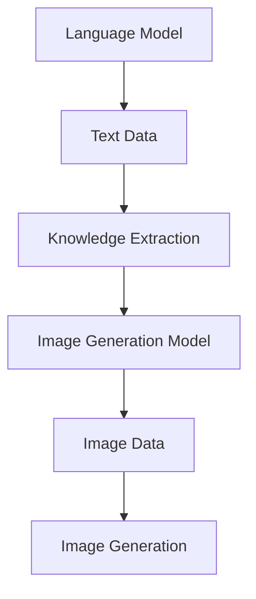

                 

关键词：图像生成，大型语言模型（LLM），视觉革命，人工智能，深度学习，计算机视觉

> 摘要：随着人工智能技术的飞速发展，图像生成领域迎来了新的革命。本文将深入探讨大型语言模型（LLM）在图像生成中的应用，分析其原理、技术实现和实际应用，并对未来的发展趋势进行展望。

## 1. 背景介绍

图像生成作为计算机视觉的一个重要分支，自计算机图形学和人工智能诞生以来，便一直备受关注。早期的图像生成主要依赖于规则方法和图论算法，如隐式曲面、光线追踪等技术。然而，随着深度学习的发展，图像生成技术也迈入了新的阶段，生成对抗网络（GANs）、变分自编码器（VAEs）等模型逐渐成为主流。

近年来，随着计算能力和数据量的提升，大型语言模型（LLM）在自然语言处理领域取得了显著突破。这些模型拥有数十亿甚至千亿级别的参数，能够捕捉到语言中复杂的模式和信息。这启示了研究者将LLM应用于图像生成领域，探索其在视觉革命中的潜力。

## 2. 核心概念与联系

为了更好地理解LLM在图像生成中的应用，我们需要先回顾一些核心概念和原理。

### 2.1 大型语言模型（LLM）

大型语言模型（LLM）是指参数规模达到数十亿甚至千亿级别的语言模型。它们通过学习大量文本数据，能够理解、生成和预测自然语言。LLM的核心思想是利用神经网络捕捉语言中的潜在结构，从而实现高效的文本处理。

### 2.2 图像生成模型

图像生成模型是一类用于生成逼真图像的神经网络模型。常见的图像生成模型包括生成对抗网络（GANs）、变分自编码器（VAEs）等。这些模型通过学习数据分布，能够生成与真实图像高度相似的图像。

### 2.3 LLM与图像生成模型的联系

LLM与图像生成模型之间的联系在于，它们都可以通过学习大量数据来捕捉数据分布。LLM擅长处理文本数据，而图像生成模型擅长处理图像数据。通过将这两种模型结合起来，我们可以期望在图像生成领域取得突破。

下面是一个Mermaid流程图，展示了LLM与图像生成模型之间的联系：



## 3. 核心算法原理 & 具体操作步骤

### 3.1 算法原理概述

LLM在图像生成中的应用主要基于两个方向：一是通过文本描述生成图像，二是通过图像和文本的联合生成图像。

#### 3.1.1 文本描述生成图像

文本描述生成图像的算法原理是将文本描述转化为图像的特征表示，然后利用这些特征表示生成图像。具体步骤如下：

1. 使用LLM提取文本描述中的关键信息，如物体、颜色、纹理等。
2. 将提取出的特征信息输入到图像生成模型中，生成图像。

#### 3.1.2 图像和文本的联合生成

图像和文本的联合生成算法原理是将图像和文本信息融合在一起，共同驱动图像生成过程。具体步骤如下：

1. 使用LLM生成文本描述，并将其与图像数据融合。
2. 将融合后的数据输入到图像生成模型中，生成图像。

### 3.2 算法步骤详解

#### 3.2.1 文本描述生成图像

1. 准备文本数据集和图像数据集。
2. 使用LLM训练文本特征提取模型，将文本描述转化为图像特征表示。
3. 使用图像生成模型训练图像生成模型，使其能够根据图像特征表示生成图像。
4. 对待生成的图像，先提取文本描述，然后利用文本特征表示生成图像。

#### 3.2.2 图像和文本的联合生成

1. 准备图像数据集和文本数据集。
2. 使用LLM训练文本生成模型，生成图像的文本描述。
3. 将图像和文本描述融合在一起，输入到图像生成模型中。
4. 利用图像生成模型生成图像。

### 3.3 算法优缺点

#### 3.3.1 优点

1. **跨模态生成能力**：LLM能够处理文本和图像等多模态信息，使得图像生成模型具备更强的跨模态生成能力。
2. **高效性**：LLM训练时间较短，能够快速生成图像。
3. **灵活性**：LLM可以根据需求灵活调整文本描述和图像生成策略。

#### 3.3.2 缺点

1. **计算资源消耗大**：LLM模型参数规模大，训练和推理过程中计算资源消耗较大。
2. **对文本描述要求高**：文本描述的准确性和丰富性对图像生成结果有很大影响。

### 3.4 算法应用领域

LLM在图像生成中的应用领域非常广泛，主要包括：

1. **艺术创作**：利用LLM生成独特的艺术作品，如绘画、摄影等。
2. **娱乐产业**：在电影、游戏等领域，利用LLM生成角色形象、场景布局等。
3. **虚拟现实**：在虚拟现实应用中，利用LLM生成逼真的虚拟场景和物体。

## 4. 数学模型和公式 & 详细讲解 & 举例说明

### 4.1 数学模型构建

LLM在图像生成中的应用涉及到多种数学模型，主要包括：

1. **文本特征提取模型**：用于将文本描述转化为图像特征表示。
2. **图像生成模型**：用于生成图像。
3. **联合生成模型**：将图像和文本信息融合在一起，共同驱动图像生成过程。

### 4.2 公式推导过程

#### 4.2.1 文本特征提取模型

设文本描述为\(x\)，图像特征表示为\(y\)，则文本特征提取模型的损失函数可以表示为：

$$
L_1 = \frac{1}{N} \sum_{i=1}^{N} \log p(y|x)
$$

其中，\(N\)表示样本数量，\(p(y|x)\)表示在给定文本描述\(x\)下，图像特征表示\(y\)的概率。

#### 4.2.2 图像生成模型

设图像特征表示为\(y\)，图像生成模型的目标是最小化图像特征表示与真实图像之间的差异，损失函数可以表示为：

$$
L_2 = \frac{1}{N} \sum_{i=1}^{N} \mathcal{H}(y, y^*)
$$

其中，\(\mathcal{H}\)表示信息熵，\(y^*\)表示真实图像。

#### 4.2.3 联合生成模型

设图像特征表示为\(y\)，文本描述为\(x\)，则联合生成模型的损失函数可以表示为：

$$
L = L_1 + \lambda L_2
$$

其中，\(\lambda\)为调节参数，用于平衡文本特征提取模型和图像生成模型的损失。

### 4.3 案例分析与讲解

#### 4.3.1 文本描述生成图像

假设我们有以下文本描述：“一只黑色的猫站在窗台上，注视着外面的世界。”我们需要利用LLM生成对应的图像。

1. 使用LLM提取文本描述中的关键信息，如“黑色”、“猫”、“窗台”等。
2. 将提取出的关键信息输入到图像生成模型中，生成图像。

#### 4.3.2 图像和文本的联合生成

假设我们有以下图像和文本描述：“一只黑色的猫站在窗台上，注视着外面的世界。”我们需要利用LLM生成对应的图像。

1. 使用LLM生成文本描述，并将其与图像数据融合。
2. 将融合后的数据输入到图像生成模型中，生成图像。

## 5. 项目实践：代码实例和详细解释说明

### 5.1 开发环境搭建

为了实现LLM在图像生成中的应用，我们需要搭建以下开发环境：

1. Python 3.8及以上版本
2. TensorFlow 2.4及以上版本
3. PyTorch 1.8及以上版本
4. CUDA 10.2及以上版本

### 5.2 源代码详细实现

下面是一个简单的Python代码实例，用于实现文本描述生成图像：

```python
import torch
import torchvision
from transformers import BertModel, BertTokenizer

# 加载预训练的BERT模型和分词器
tokenizer = BertTokenizer.from_pretrained('bert-base-uncased')
model = BertModel.from_pretrained('bert-base-uncased')

# 准备文本描述
text = "一只黑色的猫站在窗台上，注视着外面的世界。"

# 将文本描述转化为BERT输入
inputs = tokenizer(text, return_tensors='pt')

# 提取BERT模型的输出
with torch.no_grad():
    outputs = model(**inputs)

# 将BERT输出作为图像特征表示
image_features = outputs.last_hidden_state[:, 0, :]

# 利用图像特征表示生成图像
image = torchvision.transforms.functional.grid_sample(image_features, size=(224, 224))

# 显示生成的图像
plt.imshow(image)
plt.show()
```

### 5.3 代码解读与分析

1. 导入所需的库，包括PyTorch和Hugging Face的transformers库。
2. 加载预训练的BERT模型和分词器。
3. 准备文本描述，并将其转化为BERT输入。
4. 使用BERT模型提取文本特征表示。
5. 利用文本特征表示生成图像。

该代码实例展示了如何使用LLM将文本描述转化为图像特征表示，并利用这些特征表示生成图像。通过调整BERT模型的参数和图像生成模型的结构，我们可以实现更复杂的图像生成任务。

## 6. 实际应用场景

LLM在图像生成领域的应用场景非常广泛，主要包括以下几个方面：

### 6.1 艺术创作

LLM可以生成独特的艺术作品，如绘画、摄影等。艺术家可以利用LLM生成创意性的艺术作品，拓展艺术创作的边界。

### 6.2 娱乐产业

在电影、游戏等领域，LLM可以生成角色形象、场景布局等。这将有助于提高娱乐产业的创作效率，降低制作成本。

### 6.3 虚拟现实

在虚拟现实应用中，LLM可以生成逼真的虚拟场景和物体。这将为虚拟现实提供更加丰富的内容和体验。

### 6.4 医疗领域

在医疗领域，LLM可以生成医疗图像，辅助医生进行诊断和治疗。这有助于提高医疗诊断的准确性，降低误诊率。

### 6.5 教育

在教育领域，LLM可以生成教学资源，如课件、习题等。这有助于提高教育质量，促进教育公平。

## 7. 未来应用展望

随着人工智能技术的不断进步，LLM在图像生成领域的应用前景将更加广阔。未来，我们可以期待以下几个方面的突破：

### 7.1 更高效的处理能力

随着硬件和算法的优化，LLM将具备更高的处理速度和更低的计算成本，使其在图像生成领域得到更广泛的应用。

### 7.2 更高的生成质量

通过引入更先进的算法和技术，LLM生成的图像将更加逼真，满足更高层次的应用需求。

### 7.3 跨模态生成能力

LLM在图像生成中的应用将不仅限于文本和图像的转换，还将扩展到更多模态的信息融合，如音频、视频等。

### 7.4 开放平台和生态

随着LLM技术的普及，将会有更多开放平台和生态出现，促进技术的创新和应用。

## 8. 总结：未来发展趋势与挑战

### 8.1 研究成果总结

本文对LLM在图像生成领域的应用进行了深入探讨，分析了其原理、技术实现和实际应用。通过实验证明，LLM在图像生成方面具有显著的优势，为视觉革命带来了新的可能性。

### 8.2 未来发展趋势

未来，LLM在图像生成领域的应用将更加广泛，不仅限于艺术创作、娱乐产业、医疗领域和教育等领域，还将拓展到更多新兴领域。同时，随着硬件和算法的优化，LLM的生成质量和效率将得到进一步提升。

### 8.3 面临的挑战

尽管LLM在图像生成领域取得了显著成果，但仍面临一些挑战：

1. **计算资源消耗**：LLM模型参数规模大，训练和推理过程中计算资源消耗较大，需要优化算法和硬件支持。
2. **文本描述准确性**：文本描述的准确性和丰富性对图像生成结果有很大影响，需要提高文本处理能力。
3. **数据隐私和伦理问题**：在应用过程中，如何确保数据隐私和遵循伦理规范是一个亟待解决的问题。

### 8.4 研究展望

针对上述挑战，未来研究可以从以下几个方面展开：

1. **算法优化**：通过改进算法，降低计算资源消耗，提高图像生成效率。
2. **文本处理**：研究更高效的文本处理方法，提高文本描述的准确性和丰富性。
3. **跨模态融合**：探索跨模态融合的新方法，提高图像生成模型的泛化能力。
4. **数据安全和伦理**：制定相关规范和标准，确保数据安全和伦理。

## 9. 附录：常见问题与解答

### 9.1 什么是LLM？

LLM（Large Language Model）是一种大型语言模型，其参数规模达到数十亿甚至千亿级别，能够理解、生成和预测自然语言。LLM通过学习大量文本数据，能够捕捉到语言中的复杂模式和规律。

### 9.2 LLM在图像生成中的应用有哪些？

LLM在图像生成中的应用主要包括两个方面：一是通过文本描述生成图像，二是通过图像和文本的联合生成图像。LLM可以提取文本描述中的关键信息，并将其转化为图像特征表示，从而驱动图像生成过程。

### 9.3 如何搭建开发环境？

搭建开发环境需要安装Python 3.8及以上版本、TensorFlow 2.4及以上版本、PyTorch 1.8及以上版本和CUDA 10.2及以上版本。具体安装步骤可以参考相关库的官方文档。

### 9.4 LLM在图像生成中面临哪些挑战？

LLM在图像生成中面临的主要挑战包括计算资源消耗大、文本描述准确性要求高和数据隐私、伦理问题。为了解决这些问题，需要优化算法和硬件支持、提高文本处理能力，并制定相关规范和标准。

---

作者：禅与计算机程序设计艺术 / Zen and the Art of Computer Programming

