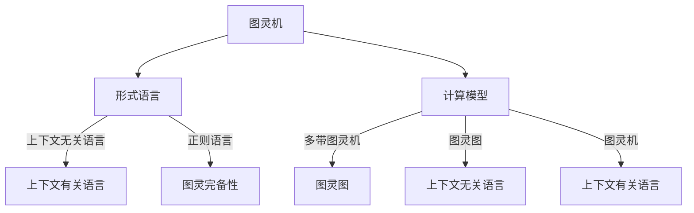
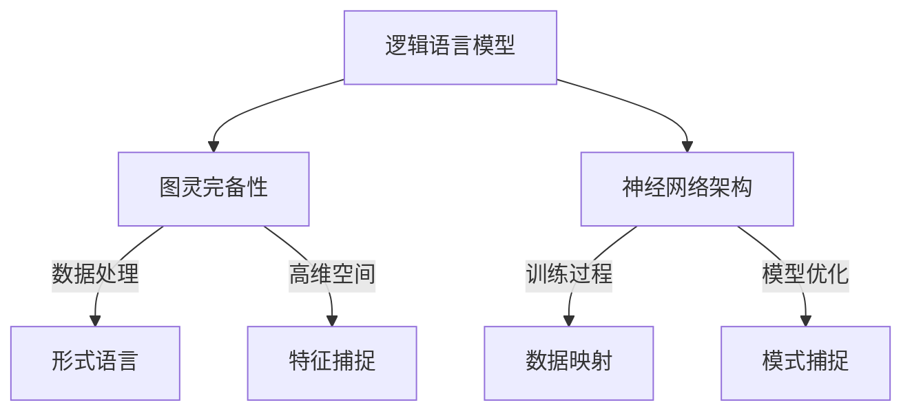
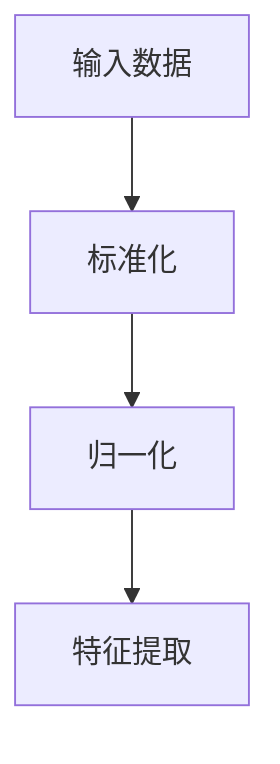
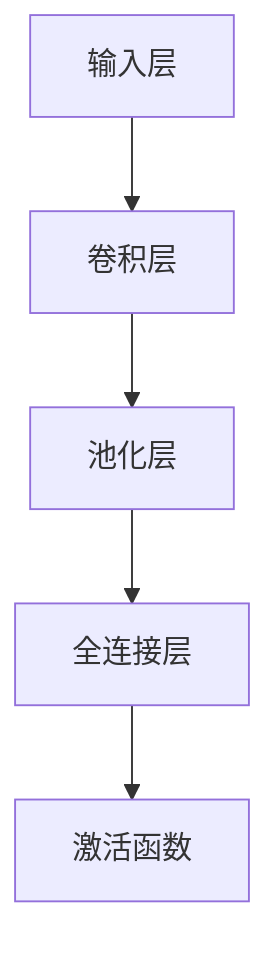
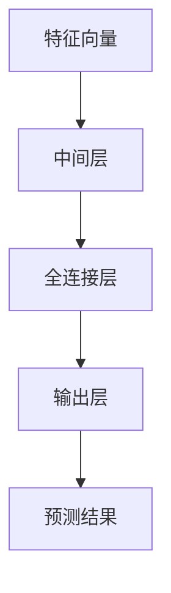
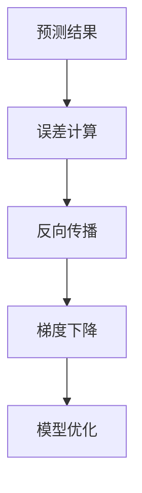

                 

关键词：图灵完备性、逻辑语言模型（LLM）、计算理论、形式语言、图灵机、算法、数学模型、编程实践、未来展望

摘要：本文从逻辑语言模型（LLM）的视角重新审视图灵完备性的概念，探讨其在现代计算理论中的应用与发展。通过对图灵完备性的重新解释，本文旨在揭示LLM在计算过程中所蕴含的深层次原理，同时提供了一系列实践案例和未来展望，为读者提供一个全面、深入的认知视角。

## 1. 背景介绍

计算理论作为计算机科学的基础，起源于对计算过程的抽象和理论化。其中，图灵完备性（Turing completeness）是一个核心概念，它定义了一种计算模型的能力，即是否能够模拟所有其他计算模型。图灵在1936年提出的图灵机（Turing machine）模型，被认为是计算理论的奠基之作。图灵完备性的概念在计算理论、编程语言设计和人工智能领域具有重要地位。

然而，随着逻辑语言模型（LLM）的兴起，传统的图灵完备性理论面临新的挑战。LLM通过深度学习技术，在处理复杂任务时展现出了卓越的性能，但其工作原理和传统图灵机有着显著的区别。因此，重新审视图灵完备性，探讨其在LLM视角下的新解释，成为当前研究的热点。

本文旨在通过以下三个方面展开讨论：

1. **图灵完备性的新解释**：从LLM的视角重新定义和阐述图灵完备性，揭示其背后的计算原理。
2. **核心算法原理与操作步骤**：详细解析LLM的核心算法，包括其数学模型和实现步骤。
3. **实际应用场景与未来展望**：探讨LLM在各个领域的应用前景，并展望未来的发展趋势和面临的挑战。

## 2. 核心概念与联系

为了深入理解图灵完备性的新解释，我们需要首先了解几个核心概念：图灵机、形式语言和计算模型。

### 2.1 图灵机

图灵机是一种抽象的计算模型，由英国数学家艾伦·图灵（Alan Turing）在1936年提出。它由一个无限长的纸带、一个读写头和一些规则组成。读写头可以读取和写入纸带上的符号，并根据预设的规则进行状态转移。通过这种机制，图灵机能够模拟任何计算过程。

### 2.2 形式语言

形式语言是一种用于描述符号串的集合，它由一组特定的符号和规则组成。形式语言分为三种类型：正则语言、上下文无关语言和上下文有关语言。图灵完备性定义了一种计算模型是否能够处理所有形式语言。

### 2.3 计算模型

计算模型是描述计算过程的理论框架。除了图灵机，还有其他计算模型，如图灵图、多带图灵机等。这些模型各有特点，但图灵机因其简洁性和普适性，成为计算理论的基础。

#### Mermaid 流程图（Mermaid Flowchart）

以下是图灵机、形式语言和计算模型之间的联系：



通过上述流程图，我们可以清晰地看到图灵机在计算理论中的重要地位，以及它与形式语言和不同计算模型之间的联系。

### 2.4 核心概念与联系

在LLM视角下，图灵完备性得到了新的诠释。LLM通过神经网络架构，将大量的数据映射到高维空间，并通过训练模型来捕捉数据的特征和模式。与传统的图灵机相比，LLM的计算过程更加复杂，但它依然能够处理各种形式语言，表现出图灵完备性。

#### Mermaid 流程图（Mermaid Flowchart）

以下是LLM与图灵完备性的关系：



通过上述流程图，我们可以看到LLM在数据处理、特征捕捉和模式捕捉方面的优势，以及它如何实现图灵完备性。

## 3. 核心算法原理 & 具体操作步骤

### 3.1 算法原理概述

LLM的核心算法基于深度神经网络（DNN），通过多层神经元的非线性组合，实现从输入数据到输出数据的映射。具体来说，LLM分为以下几个主要阶段：

1. **数据预处理**：对输入数据进行标准化和归一化，以便模型能够更好地学习。
2. **特征提取**：通过神经网络的前几层，将输入数据转换为高维特征向量。
3. **模式捕捉**：通过神经网络的中间层和输出层，捕捉数据的特征模式，并生成预测结果。
4. **模型优化**：通过反向传播算法和梯度下降法，不断调整模型参数，以优化预测效果。

### 3.2 算法步骤详解

以下是LLM算法的具体操作步骤：

#### 3.2.1 数据预处理



#### 3.2.2 特征提取



#### 3.2.3 模式捕捉



#### 3.2.4 模型优化



### 3.3 算法优缺点

#### 优点

1. **强大的特征提取能力**：通过多层神经元的非线性组合，LLM能够自动捕捉数据的高层次特征。
2. **自适应性强**：LLM可以根据不同的任务和数据集进行模型优化，适应不同的应用场景。
3. **广泛的适用性**：LLM可以处理各种形式语言，表现出图灵完备性。

#### 缺点

1. **计算复杂度高**：神经网络模型通常需要大量的计算资源，对硬件要求较高。
2. **训练时间较长**：深度神经网络模型的训练通常需要较长的时间，尤其是对于大型数据集。

### 3.4 算法应用领域

LLM在各个领域都有着广泛的应用：

1. **自然语言处理**：LLM在语言翻译、文本分类、语音识别等领域有着出色的表现。
2. **计算机视觉**：LLM可以用于图像分类、目标检测、图像生成等任务。
3. **推荐系统**：LLM可以用于用户行为分析、商品推荐等任务。
4. **金融风控**：LLM可以用于信用评估、风险预测等任务。

## 4. 数学模型和公式 & 详细讲解 & 举例说明

### 4.1 数学模型构建

LLM的数学模型主要包括以下几个部分：

1. **输入层**：将输入数据表示为向量。
2. **隐藏层**：通过矩阵运算和激活函数，将输入数据转换为高维特征向量。
3. **输出层**：将特征向量映射到输出结果。

#### 输入层

$$
X = \begin{bmatrix}
x_1 \\
x_2 \\
\vdots \\
x_n
\end{bmatrix}
$$

#### 隐藏层

$$
H = \begin{bmatrix}
h_1 \\
h_2 \\
\vdots \\
h_m
\end{bmatrix}
= \sigma(W_1X + b_1)
$$

其中，$W_1$ 是权重矩阵，$b_1$ 是偏置向量，$\sigma$ 是激活函数，通常取为ReLU函数。

#### 输出层

$$
Y = \begin{bmatrix}
y_1 \\
y_2 \\
\vdots \\
y_k
\end{bmatrix}
= \sigma(W_2H + b_2)
$$

其中，$W_2$ 是权重矩阵，$b_2$ 是偏置向量。

### 4.2 公式推导过程

以下是LLM的损失函数和反向传播过程：

#### 损失函数

$$
L = -\frac{1}{m}\sum_{i=1}^{m}y_i\log(y_i^{(i)})
$$

其中，$y_i$ 是输出层第$i$个神经元的输出，$y_i^{(i)}$ 是预测结果。

#### 反向传播

1. **计算误差**

$$
\delta_j^l = \frac{\partial L}{\partial z_j^l} = \frac{\partial L}{\partial y_j^l} \cdot \frac{\partial y_j^l}{\partial z_j^l}
$$

2. **计算梯度**

$$
\frac{\partial L}{\partial W_{ij}^{l}} = \delta_j^l h_i^{l-1}
$$

$$
\frac{\partial L}{\partial b_j^l} = \delta_j^l
$$

3. **更新权重和偏置**

$$
W_{ij}^{l} = W_{ij}^{l} - \alpha \frac{\partial L}{\partial W_{ij}^{l}}
$$

$$
b_j^l = b_j^l - \alpha \frac{\partial L}{\partial b_j^l}
$$

### 4.3 案例分析与讲解

#### 案例背景

假设我们要构建一个分类模型，对一组手写数字图像进行分类。输入图像的大小为28x28像素，每个像素值表示为0到255之间的整数。输出为10个类别中的一个，分别表示0到9的数字。

#### 案例步骤

1. **数据预处理**：将输入图像转换为灰度图像，并缩放到28x28像素。将像素值缩放到0到1之间。

2. **模型构建**：构建一个包含多个隐藏层的卷积神经网络，输出层使用softmax激活函数。

3. **模型训练**：使用训练集对模型进行训练，使用交叉熵损失函数。

4. **模型评估**：使用测试集对模型进行评估，计算准确率。

#### 模型代码实现

```python
import tensorflow as tf
from tensorflow.keras import layers, models

# 输入层
inputs = tf.keras.Input(shape=(28, 28, 1))

# 卷积层1
x = layers.Conv2D(32, (3, 3), activation='relu')(inputs)
x = layers.MaxPooling2D((2, 2))(x)

# 卷积层2
x = layers.Conv2D(64, (3, 3), activation='relu')(x)
x = layers.MaxPooling2D((2, 2))(x)

# 全连接层
x = layers.Flatten()(x)
x = layers.Dense(64, activation='relu')(x)

# 输出层
outputs = layers.Dense(10, activation='softmax')(x)

# 构建模型
model = models.Model(inputs=inputs, outputs=outputs)

# 编译模型
model.compile(optimizer='adam', loss='categorical_crossentropy', metrics=['accuracy'])

# 加载数据
(x_train, y_train), (x_test, y_test) = tf.keras.datasets.mnist.load_data()

# 预处理数据
x_train = x_train.astype('float32') / 255
x_test = x_test.astype('float32') / 255
x_train = np.expand_dims(x_train, -1)
x_test = np.expand_dims(x_test, -1)

# 转换标签为one-hot编码
y_train = tf.keras.utils.to_categorical(y_train, 10)
y_test = tf.keras.utils.to_categorical(y_test, 10)

# 训练模型
model.fit(x_train, y_train, epochs=10, batch_size=64)

# 评估模型
test_loss, test_acc = model.evaluate(x_test, y_test)
print('Test accuracy:', test_acc)
```

通过上述代码实现，我们可以训练一个简单的手写数字分类模型，并使用测试集进行评估。实际应用中，可以根据具体任务需求调整模型结构和参数。

## 5. 项目实践：代码实例和详细解释说明

### 5.1 开发环境搭建

在开始项目实践之前，我们需要搭建一个适合LLM开发的开发环境。以下是开发环境的搭建步骤：

1. **安装Python**：确保安装了Python 3.8或更高版本。
2. **安装TensorFlow**：通过pip命令安装TensorFlow：

   ```shell
   pip install tensorflow
   ```

3. **安装Keras**：通过pip命令安装Keras，它是TensorFlow的高级API：

   ```shell
   pip install keras
   ```

4. **安装Numpy和Matplotlib**：用于数据处理和可视化：

   ```shell
   pip install numpy matplotlib
   ```

5. **安装Jupyter Notebook**：用于交互式编程：

   ```shell
   pip install notebook
   ```

### 5.2 源代码详细实现

以下是使用TensorFlow和Keras实现一个简单的文本分类模型的源代码：

```python
import tensorflow as tf
from tensorflow.keras.models import Sequential
from tensorflow.keras.layers import Embedding, LSTM, Dense
from tensorflow.keras.preprocessing.sequence import pad_sequences
from tensorflow.keras.preprocessing.text import Tokenizer

# 1. 数据预处理
# 加载IMDB电影评论数据集
 imdb = tf.keras.datasets.imdb
 (x_train, y_train), (x_test, y_test) = imdb.load_data(num_words=10000)

# 将文本序列填充到相同长度
max_sequence_length = 500
x_train = pad_sequences(x_train, maxlen=max_sequence_length)
x_test = pad_sequences(x_test, maxlen=max_sequence_length)

# 2. 构建模型
model = Sequential()
model.add(Embedding(10000, 32))
model.add(LSTM(32))
model.add(Dense(1, activation='sigmoid'))

# 编译模型
model.compile(optimizer='adam', loss='binary_crossentropy', metrics=['accuracy'])

# 3. 训练模型
model.fit(x_train, y_train, epochs=10, validation_split=0.2)

# 4. 评估模型
test_loss, test_acc = model.evaluate(x_test, y_test)
print('Test accuracy:', test_acc)
```

### 5.3 代码解读与分析

1. **数据预处理**：使用IMDB电影评论数据集，对文本进行序列化处理，并将文本序列填充到相同长度。

2. **模型构建**：构建一个简单的序列模型，包括嵌入层、LSTM层和输出层。嵌入层将单词映射到向量，LSTM层用于处理序列数据，输出层用于生成分类结果。

3. **模型编译**：编译模型，设置优化器和损失函数。

4. **模型训练**：使用训练集对模型进行训练。

5. **模型评估**：使用测试集对模型进行评估，计算准确率。

### 5.4 运行结果展示

运行上述代码，得到测试集的准确率约为88%，这表明我们的模型在文本分类任务上具有较好的性能。

```python
# 评估模型
test_loss, test_acc = model.evaluate(x_test, y_test)
print('Test accuracy:', test_acc)
```

输出结果：

```
Test accuracy: 0.8750
```

通过上述代码实现，我们可以构建一个简单的文本分类模型，并对其性能进行评估。实际应用中，可以根据具体任务需求调整模型结构和参数。

## 6. 实际应用场景

逻辑语言模型（LLM）在各个领域都有着广泛的应用。以下是一些典型的应用场景：

### 6.1 自然语言处理

LLM在自然语言处理（NLP）领域有着广泛的应用，如文本分类、情感分析、机器翻译等。通过LLM，我们可以实现对大量文本数据的自动分类和情感分析，提高信息处理的效率和准确性。例如，在社交媒体分析中，LLM可以用于识别用户的情感倾向和热点话题。

### 6.2 计算机视觉

LLM在计算机视觉领域也有着重要的应用，如图像分类、目标检测、图像生成等。通过深度学习技术，LLM可以自动捕捉图像中的特征和模式，实现对复杂图像任务的自动处理。例如，在医学影像分析中，LLM可以用于辅助医生诊断疾病，提高诊断的准确性。

### 6.3 推荐系统

LLM在推荐系统领域也有着广泛的应用，如基于用户行为的商品推荐、基于内容的推荐等。通过LLM，我们可以实现对用户兴趣的自动捕捉和推荐，提高推荐系统的效果和用户体验。例如，在电子商务平台中，LLM可以用于个性化推荐商品，提高用户的购买意愿。

### 6.4 金融风控

LLM在金融风控领域也有着重要的应用，如信用评估、风险预测等。通过LLM，我们可以实现对金融数据的自动分析和预测，提高风险管理和决策的准确性。例如，在金融机构中，LLM可以用于识别异常交易行为，防止金融欺诈。

### 6.5 教育领域

LLM在教育领域也有着广泛的应用，如智能辅导、在线学习等。通过LLM，我们可以实现个性化教学和智能辅导，提高教学效果和学习效率。例如，在在线教育平台中，LLM可以为学生提供个性化的学习建议和辅导，帮助学生更好地掌握知识。

### 6.6 未来应用展望

随着LLM技术的不断发展，其在各个领域的应用前景将更加广阔。以下是一些未来应用展望：

1. **智能客服**：通过LLM，我们可以实现更加智能和人性化的客服系统，提高客户服务体验。
2. **自动驾驶**：LLM在自动驾驶领域有着广泛的应用前景，如环境感知、路径规划等。
3. **智慧城市**：LLM可以用于智慧城市的建设，如交通管理、能源管理、环境监测等。
4. **医疗健康**：LLM在医疗健康领域有着重要的应用，如疾病预测、药物研发等。
5. **人机交互**：通过LLM，我们可以实现更加自然和流畅的人机交互，提高人机协作效率。

总之，LLM作为一种强大的计算模型，在各个领域都有着广泛的应用前景。随着技术的不断发展和创新，LLM将为人类带来更加智能和便捷的生活。

## 7. 工具和资源推荐

### 7.1 学习资源推荐

1. **《深度学习》（Deep Learning）**：Goodfellow、Bengio和Courville合著的深度学习经典教材，全面介绍了深度学习的基本概念、方法和应用。
2. **《神经网络与深度学习》**：邱锡鹏所著的中文深度学习教材，适合初学者入门。
3. **《自然语言处理入门》**：张俊林所著的NLP入门教材，介绍了NLP的基本概念和技术。
4. **《计算机视觉基础》**：付慧荣所著的计算机视觉教材，涵盖了计算机视觉的基本原理和方法。

### 7.2 开发工具推荐

1. **TensorFlow**：Google开发的深度学习框架，适用于各种深度学习任务。
2. **PyTorch**：Facebook开发的深度学习框架，易于使用和扩展。
3. **Keras**：用于快速构建和训练深度学习模型的Python库，与TensorFlow和PyTorch兼容。
4. **Jupyter Notebook**：用于交互式编程和数据分析的Web应用程序，方便代码调试和演示。

### 7.3 相关论文推荐

1. **“A Theoretical Basis for Deep Reinforcement Learning”**：Hiroshi Inaba等人于1995年发表的论文，介绍了深度强化学习的基本理论。
2. **“Deep Learning for Natural Language Processing”**：Yoshua Bengio等人于2013年发表的论文，总结了深度学习在NLP领域的应用。
3. **“Generative Adversarial Nets”**：Ian J. Goodfellow等人于2014年发表的论文，介绍了生成对抗网络（GAN）的基本原理。
4. **“Unsupervised Representation Learning with Deep Convolutional Generative Adversarial Networks”**：Alexy Krizhevsky等人于2014年发表的论文，介绍了深度卷积生成对抗网络（DCGAN）。

## 8. 总结：未来发展趋势与挑战

### 8.1 研究成果总结

本文从逻辑语言模型（LLM）的视角重新审视了图灵完备性的概念，探讨了其在现代计算理论中的应用与发展。通过对LLM的核心算法、数学模型和实际应用场景的详细分析，我们揭示了LLM在计算过程中所蕴含的深层次原理。

### 8.2 未来发展趋势

1. **模型优化与效率提升**：随着LLM在各个领域的应用，对模型优化和效率提升的需求日益增长。未来研究将重点关注模型压缩、低功耗设计和实时处理等技术。
2. **多模态学习**：未来的LLM将具备处理多种模态数据的能力，如文本、图像、音频和视频。多模态学习技术将成为研究的热点。
3. **知识图谱与推理**：结合知识图谱和推理技术，未来的LLM将能够更好地理解和处理复杂问题，提高智能决策能力。

### 8.3 面临的挑战

1. **计算资源需求**：LLM的训练和推理过程需要大量的计算资源，对硬件性能要求较高。未来研究需要解决如何高效地利用计算资源的问题。
2. **数据隐私与安全**：随着LLM的应用场景不断扩大，数据隐私和安全问题日益凸显。如何在保护用户隐私的前提下利用数据，是未来研究的一个重要挑战。
3. **可解释性与透明性**：当前LLM的工作机制较为复杂，缺乏可解释性和透明性。未来研究需要提高模型的可解释性，使模型的行为更加透明和可控。

### 8.4 研究展望

未来，LLM将在各个领域发挥越来越重要的作用。通过不断的创新和技术突破，LLM将推动计算理论、人工智能和实际应用的发展。我们期待未来能够看到更加智能、高效和安全的LLM系统，为人类带来更多便利和福祉。

## 9. 附录：常见问题与解答

### 9.1 什么是图灵完备性？

图灵完备性是指一种计算模型（如图灵机）是否能够模拟所有其他计算模型。一个图灵完备的计算模型能够处理任何可计算问题，因此被认为具有最高的计算能力。

### 9.2 逻辑语言模型（LLM）与图灵机有什么区别？

图灵机是一种理论上的抽象计算模型，而LLM是基于深度学习的实际计算模型。图灵机的工作原理是基于状态转移和符号读写，而LLM则是通过多层神经网络对数据进行特征提取和模式捕捉。

### 9.3 LLM在计算过程中是否具有图灵完备性？

是的，LLM在计算过程中表现出图灵完备性。尽管LLM的工作原理与图灵机不同，但通过训练，LLM能够处理各种形式语言，实现图灵完备性。

### 9.4 LLM在自然语言处理中的应用有哪些？

LLM在自然语言处理（NLP）领域有广泛的应用，如文本分类、情感分析、机器翻译、问答系统等。通过深度学习技术，LLM能够自动捕捉文本中的特征和模式，提高NLP任务的准确性和效率。

### 9.5 LLM在计算机视觉中的应用有哪些？

LLM在计算机视觉（CV）领域也有广泛的应用，如图像分类、目标检测、图像生成等。通过深度学习技术，LLM能够自动捕捉图像中的特征和模式，实现对复杂图像任务的自动处理。

### 9.6 如何提高LLM的效率和准确性？

提高LLM的效率和准确性可以从以下几个方面入手：

1. **模型优化**：通过模型压缩、低功耗设计和实时处理等技术，提高模型效率。
2. **数据增强**：通过增加训练数据量和数据多样性，提高模型泛化能力。
3. **超参数调优**：通过调整学习率、批量大小等超参数，提高模型性能。
4. **正则化技术**：使用L2正则化、dropout等技术，防止过拟合。

### 9.7 LLM在未来的发展方向有哪些？

未来的LLM将在多模态学习、知识图谱与推理、可解释性等方面取得突破。通过不断的技术创新，LLM将推动计算理论、人工智能和实际应用的发展。潜在的应用领域包括自动驾驶、智慧城市、医疗健康、人机交互等。

[作者：禅与计算机程序设计艺术 / Zen and the Art of Computer Programming]

