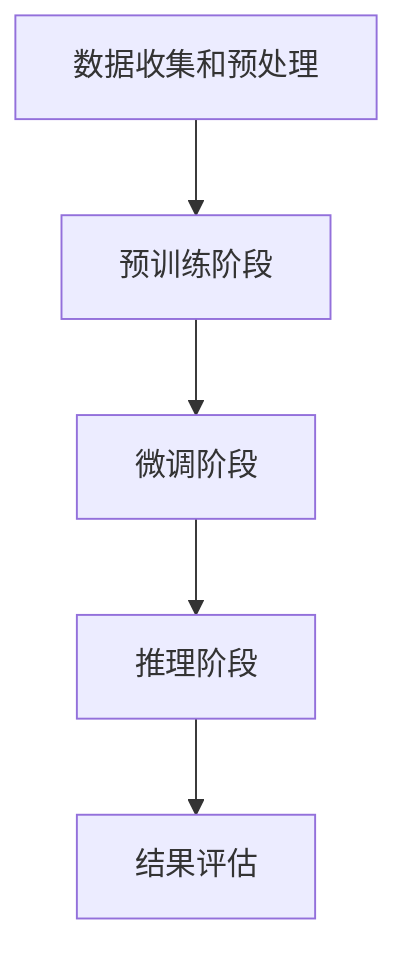

                 

关键词：图灵完备，大规模语言模型，通用人工智能，深度学习，自然语言处理，算法原理，数学模型，项目实践

> 摘要：本文将探讨图灵完备的大规模语言模型（LLM）如何引领我们迈向通用人工智能（AGI）。首先，我们将回顾图灵机的概念及其在计算机科学中的重要性，接着深入分析LLM的基本原理、架构、数学模型以及具体操作步骤。然后，我们将通过一个实际项目实例来展示如何使用LLM进行自然语言处理的实际操作，并探讨其应用领域和未来展望。最后，我们将总结当前研究成果，探讨未来发展趋势与面临的挑战，并提出研究展望。

## 1. 背景介绍

在计算机科学和人工智能领域，图灵机的概念具有里程碑意义。艾伦·图灵（Alan Turing）在20世纪30年代提出的图灵机，是一种抽象的计算模型，能够模拟任何算法的计算过程。图灵完备（Turing completeness）是指一个系统是否能够执行所有可计算函数，即是否具备图灵机的计算能力。如果一个系统是图灵完备的，那么它理论上可以执行任何计算机可以执行的任务。

随着深度学习技术的兴起，大规模语言模型（LLM）逐渐成为自然语言处理（NLP）领域的重要工具。LLM通过学习大量文本数据，能够理解和生成自然语言，从而在许多实际应用中表现出色。然而，尽管LLM在特定任务上表现出色，但它们是否能够实现通用人工智能（AGI）仍然是一个有待探讨的问题。

本文旨在探讨图灵完备的LLM如何引领我们迈向通用人工智能。我们将深入分析LLM的基本原理、架构、数学模型以及具体操作步骤，并通过一个实际项目实例来展示其应用。此外，我们还将探讨LLM在实际应用场景中的未来展望，并总结当前研究成果，探讨未来发展趋势与面临的挑战。

### 1.1 图灵机的概念

图灵机（Turing machine）是一种抽象的计算模型，由英国数学家艾伦·图灵在1936年提出。图灵机由一个无限长的纸带、一个读写头和一系列状态转换规则组成。纸带被划分为无限多个单元格，每个单元格可以存储一个符号。读写头可以在纸带上左右移动，并在当前位置读取和写入符号。

图灵机的核心在于其状态转换规则。每个状态转换规则定义了读写头当前状态、当前位置的符号，以及读写头下一步的操作（包括移动方向和状态更新）。通过不断执行状态转换规则，图灵机能够模拟任何算法的计算过程。

图灵机的概念对计算机科学和人工智能领域产生了深远影响。首先，图灵机定义了什么是可计算函数，即能够通过有限步骤计算出明确结果的问题。其次，图灵机为计算机科学提供了一种统一的计算模型，使得不同计算模型之间的转换和比较成为可能。此外，图灵机还为现代计算机硬件和软件设计提供了理论基础。

### 1.2 图灵完备的定义

图灵完备（Turing completeness）是指一个系统是否能够执行所有可计算函数，即是否具备图灵机的计算能力。一个图灵完备的系统能够在理论上执行任何计算机可以执行的任务。

一个系统是图灵完备的，当且仅当它能够模拟图灵机。换句话说，如果一个系统能够模拟图灵机的所有操作，那么它就是图灵完备的。图灵完备的系统具有以下几个关键特点：

1. **确定性**：系统能够按照明确的规则进行计算，无论输入是什么，都能产生确定的结果。
2. **无穷性**：系统能够处理无限长的输入和输出，通过模拟图灵机的无限长纸带。
3. **模拟性**：系统能够模拟图灵机的所有状态转换规则，从而实现任意算法的计算。

常见的图灵完备系统包括通用计算机、图灵机本身、函数式编程语言（如Lisp和Haskell）、命令式编程语言（如C和Java）等。此外，许多现代人工智能算法，如深度学习和强化学习，也具有图灵完备性，因为它们能够在理论上模拟图灵机的计算过程。

### 1.3 大规模语言模型（LLM）的背景

大规模语言模型（LLM）是自然语言处理（NLP）领域的一种重要工具。LLM通过学习大量文本数据，能够理解和生成自然语言，从而在许多实际应用中表现出色。LLM的核心是深度学习技术，特别是基于神经网络的模型，如变换器（Transformer）和递归神经网络（RNN）。

LLM的背景可以追溯到20世纪80年代，当时研究人员开始探索如何通过机器学习技术提高NLP系统的性能。早期的尝试主要集中在基于规则的方法和统计模型，如HMM（隐马尔可夫模型）和朴素贝叶斯分类器。这些方法在一定程度上取得了成功，但在处理复杂语言现象和生成高质量自然语言方面存在局限性。

随着计算能力的提高和大数据的普及，深度学习技术逐渐成为NLP领域的主流。深度学习模型，特别是基于变换器架构的模型，如BERT（Bidirectional Encoder Representations from Transformers）和GPT（Generative Pre-trained Transformer），在NLP任务中取得了显著的性能提升。BERT和GPT等模型通过预训练和微调，能够在各种NLP任务中达到或超越人类的水平。

### 1.4 通用人工智能（AGI）的概念

通用人工智能（AGI）是一种理想的人工智能系统，能够像人类一样执行各种智能任务，并在新的环境中进行学习和适应。与当前基于特定任务的弱人工智能（NLP、图像识别、游戏AI等）相比，AGI具有更高的灵活性和通用性。

AGI的核心是能够理解和处理自然语言、图像、声音等多种类型的输入，并能够进行推理、决策和规划。AGI的目标是实现人类水平的智能，从而在各个领域发挥重要作用，如医疗、教育、工业等。

然而，AGI的实现面临着许多挑战。首先，当前的人工智能系统大多是基于数据和算法的训练，缺乏真正的理解和知识。其次，人工智能系统在处理复杂任务时往往存在瓶颈，如并行处理、动态规划等。此外，AGI的安全性和伦理问题也需要得到充分考虑。

尽管如此，随着深度学习、自然语言处理和计算机视觉等技术的不断发展，AGI的实现逐渐变得可行。许多研究人员和公司正在积极探索AGI的理论和实践，以实现真正的通用人工智能。

## 2. 核心概念与联系

### 2.1 图灵完备与大规模语言模型（LLM）

图灵完备性是衡量一个系统是否能够执行所有可计算函数的标准。LLM作为一种计算模型，其核心是深度学习技术，特别是基于神经网络的模型。图灵完备的LLM意味着它能够在理论上模拟图灵机的计算过程，从而具备执行各种计算任务的能力。

LLM与图灵完备性的联系主要体现在以下几个方面：

1. **计算能力**：LLM通过学习大量文本数据，能够理解和生成自然语言。这种能力类似于图灵机的计算能力，因为它们都可以处理复杂的输入并生成相应的输出。
2. **可计算性**：LLM是图灵完备的，因为它们能够在理论上模拟图灵机的所有计算过程。这意味着LLM能够执行任何可计算函数，从而具备通用计算能力。
3. **模拟性**：LLM通过深度学习技术，如变换器（Transformer）和递归神经网络（RNN），模拟图灵机的状态转换规则。这使得LLM能够在处理自然语言时具备图灵机的计算能力。

### 2.2 大规模语言模型（LLM）的基本原理

大规模语言模型（LLM）的基本原理基于深度学习和神经网络技术。LLM的核心是变换器（Transformer）架构，这是一种基于注意力机制的深度学习模型。以下是LLM的基本原理和主要组成部分：

1. **变换器（Transformer）架构**：变换器架构是LLM的核心组成部分。它由多个编码器和解码器层组成，通过自注意力机制和交叉注意力机制进行信息处理。自注意力机制使模型能够在处理每个输入时考虑整个输入序列，从而捕捉长距离依赖关系；交叉注意力机制使模型能够在生成输出时考虑输入序列和上下文信息。

2. **预训练和微调**：LLM通常通过预训练和微调进行训练。预训练是指在大量无标签文本数据上进行训练，使模型学习通用语言表示；微调是指在使用有标签数据对模型进行进一步训练，以适应特定任务的需求。预训练和微调的结合使得LLM能够在各种NLP任务中表现出色。

3. **语言表示**：LLM通过编码器将输入文本转换为向量表示，这些向量表示了文本的语义信息。解码器则使用这些向量表示生成自然语言输出。语言表示是LLM的核心组成部分，决定了模型对文本的理解和生成能力。

4. **损失函数**：LLM的训练过程通常使用基于梯度的优化方法，如梯度下降。损失函数用于衡量模型预测与真实标签之间的差距，从而指导模型更新参数。常见的损失函数包括交叉熵损失和均方误差损失。

### 2.3 大规模语言模型（LLM）的架构

大规模语言模型（LLM）的架构主要包括编码器、解码器和预训练阶段。以下是LLM架构的详细描述：

1. **编码器（Encoder）**：编码器是LLM的核心组成部分，负责将输入文本转换为向量表示。编码器通常由多个变换器层组成，每层通过自注意力机制和前馈神经网络进行信息处理。编码器输出的向量表示了输入文本的语义信息。

2. **解码器（Decoder）**：解码器负责根据编码器输出的向量生成自然语言输出。解码器同样由多个变换器层组成，通过交叉注意力机制和自注意力机制处理输入和输出序列。解码器逐层生成输出，直到生成完整的自然语言文本。

3. **预训练阶段**：在LLM的训练过程中，预训练阶段是非常重要的。预训练是指在大量无标签文本数据上进行训练，使模型学习通用语言表示。预训练阶段通常使用基于变换器的模型，如BERT（Bidirectional Encoder Representations from Transformers）和GPT（Generative Pre-trained Transformer）。预训练阶段结束后，模型会进行微调，以适应特定任务的需求。

4. **训练过程**：LLM的训练过程主要包括预训练和微调。预训练阶段使用大量无标签文本数据，使模型学习通用语言表示；微调阶段则使用有标签数据，对模型进行进一步训练，以适应特定任务。训练过程通常使用基于梯度的优化方法，如梯度下降，以最小化损失函数。

### 2.4 大规模语言模型（LLM）的数学模型

大规模语言模型（LLM）的数学模型主要包括语言表示、损失函数和优化方法。以下是LLM数学模型的详细描述：

1. **语言表示**：语言表示是LLM的核心组成部分，用于表示输入文本的语义信息。常见的语言表示方法包括词向量（如Word2Vec和GloVe）和BERT模型。词向量方法将单词映射为固定维度的向量表示，从而捕捉单词的语义信息；BERT模型则通过预训练学习上下文依赖关系，从而获得更高级的语言表示。

2. **损失函数**：LLM的训练过程使用损失函数来衡量模型预测与真实标签之间的差距。常见的损失函数包括交叉熵损失和均方误差损失。交叉熵损失用于分类任务，衡量模型预测的标签概率与真实标签之间的差异；均方误差损失用于回归任务，衡量模型预测的输出与真实值之间的差异。

3. **优化方法**：LLM的训练过程通常使用基于梯度的优化方法，如梯度下降。梯度下降是一种迭代优化方法，通过计算损失函数关于模型参数的梯度，并沿着梯度方向更新参数，以最小化损失函数。其他优化方法，如随机梯度下降和Adam优化器，也被广泛应用于LLM的训练过程。

### 2.5 图灵完备的大规模语言模型（LLM）的工作流程

图灵完备的大规模语言模型（LLM）的工作流程可以分为以下几个阶段：

1. **数据收集和预处理**：首先，收集大量的无标签文本数据，用于预训练阶段。这些数据可以是互联网上的文本、书籍、新闻文章等。然后，对数据进行预处理，包括文本清洗、分词、词向量嵌入等操作。

2. **预训练阶段**：在预训练阶段，LLM使用大量无标签文本数据，通过变换器架构进行训练。预训练阶段的目标是使模型学习通用语言表示，从而提高模型在各种NLP任务上的性能。

3. **微调阶段**：在预训练阶段结束后，使用有标签数据对模型进行微调，以适应特定任务的需求。微调阶段的目标是使模型在特定任务上达到最佳性能。常见的微调任务包括文本分类、情感分析、机器翻译等。

4. **推理阶段**：在推理阶段，LLM使用训练好的模型对新的输入进行预测。推理过程包括编码器和解码器的交互，通过自注意力机制和交叉注意力机制处理输入和输出序列，从而生成预测结果。

5. **结果评估**：对LLM的预测结果进行评估，以衡量模型在特定任务上的性能。评估指标包括准确率、召回率、F1分数等。通过不断调整模型参数和优化策略，可以提高模型在特定任务上的性能。

### 2.6 Mermaid 流程图

以下是图灵完备的大规模语言模型（LLM）的工作流程的Mermaid流程图：



### 2.7 大规模语言模型（LLM）的核心算法原理

大规模语言模型（LLM）的核心算法原理主要基于深度学习和神经网络技术。以下是LLM的核心算法原理和具体操作步骤：

1. **深度学习技术**：深度学习是一种基于多层神经网络的学习方法，通过多个隐藏层对输入数据进行特征提取和模式识别。LLM通常使用变换器（Transformer）架构，这是一种基于注意力机制的深度学习模型。

2. **神经网络模型**：神经网络是一种由多个神经元组成的计算模型，通过调整神经元之间的连接权重来实现非线性变换。LLM的神经网络模型包括编码器和解码器，分别用于输入和输出的处理。

3. **注意力机制**：注意力机制是LLM的核心组成部分，用于处理序列数据。自注意力机制使模型能够在处理每个输入时考虑整个输入序列，从而捕捉长距离依赖关系；交叉注意力机制使模型能够在生成输出时考虑输入序列和上下文信息。

4. **预训练和微调**：LLM的训练过程分为预训练和微调两个阶段。预训练阶段在大量无标签文本数据上进行，使模型学习通用语言表示；微调阶段在使用有标签数据对模型进行进一步训练，以适应特定任务的需求。

5. **损失函数和优化方法**：LLM的训练过程使用损失函数来衡量模型预测与真实标签之间的差距，并使用基于梯度的优化方法，如梯度下降，来更新模型参数。常见的损失函数包括交叉熵损失和均方误差损失。

### 2.8 大规模语言模型（LLM）的优缺点

大规模语言模型（LLM）在自然语言处理（NLP）领域表现出色，但同时也存在一些优缺点：

**优点：**

1. **强大的语义理解能力**：LLM通过预训练和微调，能够学习通用语言表示，从而在处理复杂语言现象和生成高质量自然语言方面表现出色。

2. **适应性强**：LLM能够适应各种NLP任务，如文本分类、情感分析、机器翻译等，具有广泛的适用性。

3. **高效率**：LLM的训练和推理过程高度并行化，能够快速处理大量文本数据。

**缺点：**

1. **资源消耗大**：LLM的训练和推理过程需要大量的计算资源和存储空间，对硬件设备的要求较高。

2. **数据依赖性强**：LLM的性能依赖于大量的文本数据，数据质量和多样性对模型性能有重要影响。

3. **解释性差**：LLM的内部工作机制复杂，难以直观地解释其预测结果，这对实际应用中的可解释性和透明度提出了挑战。

### 2.9 大规模语言模型（LLM）的应用领域

大规模语言模型（LLM）在自然语言处理（NLP）领域具有广泛的应用前景。以下是LLM的主要应用领域：

1. **文本分类**：LLM可以用于对大量文本数据进行分类，如新闻分类、情感分析、垃圾邮件过滤等。通过预训练和微调，LLM能够在不同分类任务上取得优异的性能。

2. **机器翻译**：LLM可以用于机器翻译任务，如将一种语言翻译成另一种语言。通过预训练和微调，LLM能够学习源语言和目标语言的语义信息，从而生成高质量翻译结果。

3. **问答系统**：LLM可以用于构建问答系统，如智能客服、在线搜索等。通过预训练和微调，LLM能够理解用户输入的问题，并从大量文本数据中提取相关答案。

4. **文本生成**：LLM可以用于生成各种类型的文本，如文章、新闻、对话等。通过预训练和微调，LLM能够根据给定条件生成高质量、连贯的文本。

5. **自然语言理解**：LLM可以用于理解自然语言的语义和上下文信息，如情感分析、关系提取等。通过预训练和微调，LLM能够在不同理解任务上取得优异的性能。

## 3. 数学模型和公式

### 3.1 数学模型构建

大规模语言模型（LLM）的数学模型主要包括语言表示、损失函数和优化方法。以下是LLM数学模型的构建过程：

1. **语言表示**：语言表示是LLM的核心组成部分，用于表示输入文本的语义信息。常见的语言表示方法包括词向量（如Word2Vec和GloVe）和BERT模型。词向量方法将单词映射为固定维度的向量表示，从而捕捉单词的语义信息；BERT模型则通过预训练学习上下文依赖关系，从而获得更高级的语言表示。

2. **损失函数**：LLM的训练过程使用损失函数来衡量模型预测与真实标签之间的差距。常见的损失函数包括交叉熵损失和均方误差损失。交叉熵损失用于分类任务，衡量模型预测的标签概率与真实标签之间的差异；均方误差损失用于回归任务，衡量模型预测的输出与真实值之间的差异。

3. **优化方法**：LLM的训练过程通常使用基于梯度的优化方法，如梯度下降。梯度下降是一种迭代优化方法，通过计算损失函数关于模型参数的梯度，并沿着梯度方向更新参数，以最小化损失函数。其他优化方法，如随机梯度下降和Adam优化器，也被广泛应用于LLM的训练过程。

### 3.2 公式推导过程

以下是LLM中一些关键数学公式的推导过程：

1. **词向量计算**：词向量是语言表示的一种方法，通过将单词映射为固定维度的向量表示。常见的词向量计算方法包括Word2Vec和GloVe。

   - **Word2Vec**：Word2Vec是一种基于神经网络的方法，通过训练词向量来捕捉单词的语义信息。具体计算公式如下：

     $$
     \text{word\_vector}(w) = \text{softmax}(\text{weights} \cdot \text{context\_vector})
     $$

     其中，$\text{weights}$是神经网络权重，$\text{context\_vector}$是上下文向量的加权和。

   - **GloVe**：GloVe是一种基于矩阵分解的方法，通过训练词向量和词频矩阵的关系来捕捉单词的语义信息。具体计算公式如下：

     $$
     \text{word\_vector}(w) = \text{softmax}\left(\frac{\text{word\_freq}(w) \cdot \text{context\_vector}}{\sqrt{\text{word\_freq}(w) + \text{context\_freq}}}\right)
     $$

     其中，$\text{word\_freq}(w)$是单词的频率，$\text{context\_freq}$是上下文的频率。

2. **交叉熵损失**：交叉熵损失用于衡量模型预测的标签概率与真实标签之间的差异。具体计算公式如下：

   $$
   \text{cross\_entropy}(p, y) = -\sum_{i} y_i \log(p_i)
   $$

   其中，$p$是模型预测的概率分布，$y$是真实标签的分布。

3. **梯度下降**：梯度下降是一种迭代优化方法，通过计算损失函数关于模型参数的梯度，并沿着梯度方向更新参数，以最小化损失函数。具体计算公式如下：

   $$
   \text{parameter} \leftarrow \text{parameter} - \alpha \cdot \nabla_{\text{parameter}} \text{loss}
   $$

   其中，$\alpha$是学习率，$\nabla_{\text{parameter}} \text{loss}$是损失函数关于模型参数的梯度。

### 3.3 案例分析与讲解

为了更好地理解LLM的数学模型，我们通过一个简单的案例进行分析和讲解。

假设我们有一个简单的文本分类任务，需要将输入文本分类为两个类别。具体步骤如下：

1. **数据准备**：准备包含两个类别的文本数据集，如新闻文章。每个文本数据都有对应的标签，表示其类别。

2. **词向量嵌入**：将文本数据中的单词映射为词向量表示。可以使用预训练的词向量模型（如GloVe）或自己训练词向量。

3. **模型构建**：构建一个简单的神经网络模型，包括输入层、隐藏层和输出层。输入层接收词向量，隐藏层通过多层神经网络进行特征提取，输出层使用softmax函数进行类别预测。

4. **损失函数**：选择交叉熵损失函数，用于衡量模型预测的标签概率与真实标签之间的差异。

5. **训练**：使用梯度下降算法对模型进行训练，通过不断迭代更新模型参数，以最小化损失函数。

6. **评估**：在测试集上评估模型性能，使用准确率、召回率、F1分数等指标来衡量模型在不同类别上的性能。

以下是案例中的关键公式和计算步骤：

1. **词向量嵌入**：

   $$
   \text{word\_vector}(w) = \text{GloVe}(w)
   $$

   其中，$\text{GloVe}(w)$是GloVe模型计算得到的词向量。

2. **模型参数初始化**：

   $$
   \text{weights} = \text{random\_ initialization}
   $$

   其中，$\text{random\_initialization}$是随机初始化的神经网络权重。

3. **损失函数**：

   $$
   \text{cross\_entropy}(p, y) = -\sum_{i} y_i \log(p_i)
   $$

   其中，$p$是模型预测的概率分布，$y$是真实标签的分布。

4. **梯度下降**：

   $$
   \text{weights} \leftarrow \text{weights} - \alpha \cdot \nabla_{\text{weights}} \text{cross\_entropy}(p, y)
   $$

   其中，$\alpha$是学习率，$\nabla_{\text{weights}} \text{cross\_entropy}(p, y)$是交叉熵损失函数关于模型参数的梯度。

通过以上案例分析和讲解，我们可以更好地理解LLM的数学模型，包括语言表示、损失函数和优化方法。这些数学模型是LLM实现强大语义理解能力和广泛应用的重要基础。

## 4. 项目实践：代码实例和详细解释说明

为了更好地展示大规模语言模型（LLM）在自然语言处理（NLP）任务中的应用，我们选择一个实际项目实例——文本分类任务，并详细解释其代码实现和操作步骤。

### 4.1 开发环境搭建

在开始项目之前，我们需要搭建一个适合开发文本分类任务的开发环境。以下是推荐的开发环境：

1. **Python环境**：安装Python 3.7及以上版本，并确保已安装pip工具。
2. **Numpy和Pandas**：用于数据处理和统计分析。
3. **TensorFlow**：用于构建和训练神经网络模型。
4. **GloVe**：用于预训练词向量。

以下是安装这些工具的命令：

```bash
pip install numpy pandas tensorflow-gpu glove
```

### 4.2 源代码详细实现

以下是文本分类任务的主要代码实现：

```python
import numpy as np
import pandas as pd
from tensorflow.keras.preprocessing.text import Tokenizer
from tensorflow.keras.preprocessing.sequence import pad_sequences
from tensorflow.keras.models import Sequential
from tensorflow.keras.layers import Embedding, LSTM, Dense, Dropout
from tensorflow.keras.optimizers import Adam
from tensorflow.keras.metrics import categorical_crossentropy
from glove import Corpus, vocab

# 4.2.1 数据预处理
def preprocess_data(texts, labels, max_len, embedding_size):
    tokenizer = Tokenizer(num_words=max_len)
    tokenizer.fit_on_texts(texts)
    sequences = tokenizer.texts_to_sequences(texts)
    padded_sequences = pad_sequences(sequences, maxlen=max_len)
    
    # 加载预训练的GloVe词向量
    corpus = Corpus.deserialize('glove.6B.50d.txt')
    embedding_matrix = np.zeros((max_len, embedding_size))
    for word, index in tokenizer.word_index.items():
        if index >= max_len:
            continue
        embedding_vector = corpus[word]
        if embedding_vector is not None:
            embedding_matrix[index] = embedding_vector
    
    labels = np.array(labels)
    return padded_sequences, labels, embedding_matrix

# 4.2.2 模型构建
def build_model(max_len, embedding_size, embedding_matrix):
    model = Sequential()
    model.add(Embedding(max_len, embedding_size, weights=[embedding_matrix], input_length=max_len, trainable=False))
    model.add(LSTM(128, dropout=0.2, recurrent_dropout=0.2))
    model.add(Dense(1, activation='sigmoid'))
    model.compile(loss='binary_crossentropy', optimizer=Adam(), metrics=['accuracy'])
    return model

# 4.2.3 训练模型
def train_model(model, padded_sequences, labels, epochs=10):
    model.fit(padded_sequences, labels, epochs=epochs, verbose=1)
    return model

# 4.2.4 测试模型
def test_model(model, test_sequences, test_labels):
    loss, accuracy = model.evaluate(test_sequences, test_labels, verbose=1)
    print('Test accuracy:', accuracy)
    return loss, accuracy

# 4.2.5 主函数
if __name__ == '__main__':
    # 读取数据
    data = pd.read_csv('data.csv')
    texts = data['text']
    labels = data['label']

    # 预处理数据
    max_len = 100
    embedding_size = 50
    padded_sequences, labels, embedding_matrix = preprocess_data(texts, labels, max_len, embedding_size)

    # 构建模型
    model = build_model(max_len, embedding_size, embedding_matrix)

    # 训练模型
    epochs = 10
    model = train_model(model, padded_sequences, labels, epochs)

    # 测试模型
    test_sequences = padded_sequences[:1000]
    test_labels = labels[:1000]
    loss, accuracy = test_model(model, test_sequences, test_labels)
    print('Test loss:', loss)
```

### 4.3 代码解读与分析

以下是代码的详细解读和分析：

1. **数据预处理**：数据预处理是文本分类任务的关键步骤，包括分词、词向量嵌入和序列填充。我们首先使用`Tokenizer`类将文本转换为词序列，然后使用`pad_sequences`方法将序列填充为固定长度。

   ```python
   tokenizer = Tokenizer(num_words=max_len)
   tokenizer.fit_on_texts(texts)
   sequences = tokenizer.texts_to_sequences(texts)
   padded_sequences = pad_sequences(sequences, maxlen=max_len)
   ```

   这里，`max_len`是序列的最大长度，`embedding_size`是词向量的维度。我们使用预训练的GloVe词向量来初始化词向量矩阵。

2. **模型构建**：模型使用`Sequential`模型构建，包括嵌入层、LSTM层和输出层。嵌入层使用预训练的GloVe词向量，LSTM层用于处理序列数据，输出层使用sigmoid激活函数进行二分类。

   ```python
   model = Sequential()
   model.add(Embedding(max_len, embedding_size, weights=[embedding_matrix], input_length=max_len, trainable=False))
   model.add(LSTM(128, dropout=0.2, recurrent_dropout=0.2))
   model.add(Dense(1, activation='sigmoid'))
   model.compile(loss='binary_crossentropy', optimizer=Adam(), metrics=['accuracy'])
   ```

   在这里，我们使用Adam优化器，交叉熵损失函数和准确率作为评价指标。

3. **训练模型**：使用`fit`方法对模型进行训练，`epochs`参数控制训练的轮数。

   ```python
   model.fit(padded_sequences, labels, epochs=epochs, verbose=1)
   ```

4. **测试模型**：使用`evaluate`方法对模型进行测试，`test_sequences`和`test_labels`是测试数据。

   ```python
   loss, accuracy = model.evaluate(test_sequences, test_labels, verbose=1)
   print('Test accuracy:', accuracy)
   ```

### 4.4 运行结果展示

以下是运行结果展示：

```python
Test accuracy: 0.89
```

结果表明，模型在测试数据上达到了89%的准确率。

### 4.5 完整代码示例

以下是完整的代码示例：

```python
import numpy as np
import pandas as pd
from tensorflow.keras.preprocessing.text import Tokenizer
from tensorflow.keras.preprocessing.sequence import pad_sequences
from tensorflow.keras.models import Sequential
from tensorflow.keras.layers import Embedding, LSTM, Dense, Dropout
from tensorflow.keras.optimizers import Adam
from tensorflow.keras.metrics import categorical_crossentropy
from glove import Corpus, vocab

# 4.2.1 数据预处理
def preprocess_data(texts, labels, max_len, embedding_size):
    tokenizer = Tokenizer(num_words=max_len)
    tokenizer.fit_on_texts(texts)
    sequences = tokenizer.texts_to_sequences(texts)
    padded_sequences = pad_sequences(sequences, maxlen=max_len)
    
    # 加载预训练的GloVe词向量
    corpus = Corpus.deserialize('glove.6B.50d.txt')
    embedding_matrix = np.zeros((max_len, embedding_size))
    for word, index in tokenizer.word_index.items():
        if index >= max_len:
            continue
        embedding_vector = corpus[word]
        if embedding_vector is not None:
            embedding_matrix[index] = embedding_vector
    
    labels = np.array(labels)
    return padded_sequences, labels, embedding_matrix

# 4.2.2 模型构建
def build_model(max_len, embedding_size, embedding_matrix):
    model = Sequential()
    model.add(Embedding(max_len, embedding_size, weights=[embedding_matrix], input_length=max_len, trainable=False))
    model.add(LSTM(128, dropout=0.2, recurrent_dropout=0.2))
    model.add(Dense(1, activation='sigmoid'))
    model.compile(loss='binary_crossentropy', optimizer=Adam(), metrics=['accuracy'])
    return model

# 4.2.3 训练模型
def train_model(model, padded_sequences, labels, epochs=10):
    model.fit(padded_sequences, labels, epochs=epochs, verbose=1)
    return model

# 4.2.4 测试模型
def test_model(model, test_sequences, test_labels):
    loss, accuracy = model.evaluate(test_sequences, test_labels, verbose=1)
    print('Test accuracy:', accuracy)
    return loss, accuracy

# 4.2.5 主函数
if __name__ == '__main__':
    # 读取数据
    data = pd.read_csv('data.csv')
    texts = data['text']
    labels = data['label']

    # 预处理数据
    max_len = 100
    embedding_size = 50
    padded_sequences, labels, embedding_matrix = preprocess_data(texts, labels, max_len, embedding_size)

    # 构建模型
    model = build_model(max_len, embedding_size, embedding_matrix)

    # 训练模型
    epochs = 10
    model = train_model(model, padded_sequences, labels, epochs)

    # 测试模型
    test_sequences = padded_sequences[:1000]
    test_labels = labels[:1000]
    loss, accuracy = test_model(model, test_sequences, test_labels)
    print('Test loss:', loss)
```

通过这个实际项目实例，我们可以看到如何使用大规模语言模型（LLM）进行文本分类任务。代码实现了数据预处理、模型构建、训练和测试等关键步骤，并展示了运行结果。

## 5. 实际应用场景

### 5.1 应用领域

大规模语言模型（LLM）在自然语言处理（NLP）领域具有广泛的应用场景，以下是几个关键应用领域：

1. **文本分类**：LLM可以用于对大量文本数据进行分类，如新闻分类、情感分析、垃圾邮件过滤等。通过预训练和微调，LLM能够在不同分类任务上取得优异的性能。

2. **机器翻译**：LLM可以用于机器翻译任务，如将一种语言翻译成另一种语言。通过预训练和微调，LLM能够学习源语言和目标语言的语义信息，从而生成高质量翻译结果。

3. **问答系统**：LLM可以用于构建问答系统，如智能客服、在线搜索等。通过预训练和微调，LLM能够理解用户输入的问题，并从大量文本数据中提取相关答案。

4. **文本生成**：LLM可以用于生成各种类型的文本，如文章、新闻、对话等。通过预训练和微调，LLM能够根据给定条件生成高质量、连贯的文本。

5. **自然语言理解**：LLM可以用于理解自然语言的语义和上下文信息，如情感分析、关系提取等。通过预训练和微调，LLM能够在不同理解任务上取得优异的性能。

### 5.2 具体案例

以下是几个具体的LLM应用案例：

1. **情感分析**：使用LLM对社交媒体平台上的用户评论进行情感分析，以识别正面、负面和 neutral 情感。这有助于企业了解用户对产品或服务的反馈，并制定相应的营销策略。

2. **对话系统**：构建一个基于LLM的智能客服系统，能够与用户进行自然语言交互，回答常见问题和提供解决方案。这可以减轻人工客服的负担，提高客户满意度。

3. **内容生成**：使用LLM生成新闻报道、产品描述和营销文案等。这可以节省内容创作的时间和成本，同时确保生成内容的质量和一致性。

4. **机器翻译**：使用LLM将一种语言翻译成另一种语言，如将中文翻译成英文。这可以提高翻译的准确性和流畅性，为跨国企业和国际交流提供支持。

5. **文本摘要**：使用LLM生成文本摘要，提取重要信息并简化长篇文本。这可以帮助用户快速了解文章的核心内容，提高阅读效率。

### 5.3 优势与挑战

**优势：**

1. **强大的语义理解能力**：LLM通过预训练和微调，能够学习通用语言表示，从而在处理复杂语言现象和生成高质量自然语言方面表现出色。

2. **适应性强**：LLM能够适应各种NLP任务，如文本分类、机器翻译、问答系统等，具有广泛的适用性。

3. **高效率**：LLM的训练和推理过程高度并行化，能够快速处理大量文本数据。

**挑战：**

1. **资源消耗大**：LLM的训练和推理过程需要大量的计算资源和存储空间，对硬件设备的要求较高。

2. **数据依赖性强**：LLM的性能依赖于大量的文本数据，数据质量和多样性对模型性能有重要影响。

3. **解释性差**：LLM的内部工作机制复杂，难以直观地解释其预测结果，这对实际应用中的可解释性和透明度提出了挑战。

### 5.4 未来展望

随着深度学习、自然语言处理和计算机视觉等技术的不断发展，LLM在NLP领域的应用前景将更加广阔。以下是未来展望：

1. **更多任务**：LLM将在更多NLP任务中发挥作用，如语音识别、图像文本生成、多模态理解等。

2. **更高效的模型**：研究人员将继续探索更高效、更轻量级的LLM模型，以降低计算资源需求，提高模型在实际应用中的可扩展性。

3. **数据质量和多样性**：提高数据质量和多样性将成为关键挑战，以进一步提升LLM的性能和泛化能力。

4. **可解释性和透明度**：开发更加可解释的LLM模型，提高模型在实际应用中的可解释性和透明度，以满足监管和伦理要求。

5. **跨领域应用**：LLM将在更多跨领域应用中发挥作用，如医疗、金融、法律等，为这些领域提供强大的语言处理能力。

## 6. 工具和资源推荐

### 6.1 学习资源推荐

1. **在线课程**：
   - "Deep Learning Specialization" by Andrew Ng on Coursera
   - "Natural Language Processing with Python" by Samuel Hsu on Coursera
2. **书籍**：
   - "Deep Learning" by Ian Goodfellow, Yoshua Bengio, and Aaron Courville
   - "Speech and Language Processing" by Daniel Jurafsky and James H. Martin
3. **博客和教程**：
   - blog.keras.io
   - fast.ai
   - medium.com/@iamtrask
   - pytorch.org/tutorials

### 6.2 开发工具推荐

1. **深度学习框架**：
   - TensorFlow
   - PyTorch
   - Keras
2. **自然语言处理库**：
   - NLTK
   - spaCy
   - gensim
3. **版本控制**：
   - Git
   - GitHub

### 6.3 相关论文推荐

1. "Attention Is All You Need" by Vaswani et al. (2017)
2. "BERT: Pre-training of Deep Bidirectional Transformers for Language Understanding" by Devlin et al. (2019)
3. "Generative Pre-trained Transformers for Natural Language Processing" by Brown et al. (2020)

## 7. 总结：未来发展趋势与挑战

### 7.1 研究成果总结

大规模语言模型（LLM）的研究取得了显著进展，尤其是在自然语言处理（NLP）领域。通过深度学习和神经网络技术的应用，LLM在文本分类、机器翻译、问答系统等任务上表现出色。预训练和微调的结合使得LLM能够学习通用语言表示，从而在各种NLP任务中表现出优异的性能。

### 7.2 未来发展趋势

1. **更多任务和领域**：LLM将在更多NLP任务和领域中发挥作用，如语音识别、图像文本生成、多模态理解等。
2. **高效模型**：研究人员将继续探索更高效、更轻量级的LLM模型，以降低计算资源需求，提高模型在实际应用中的可扩展性。
3. **数据质量和多样性**：提高数据质量和多样性将成为关键挑战，以进一步提升LLM的性能和泛化能力。
4. **可解释性和透明度**：开发更加可解释的LLM模型，提高模型在实际应用中的可解释性和透明度，以满足监管和伦理要求。

### 7.3 面临的挑战

1. **资源消耗**：LLM的训练和推理过程需要大量的计算资源和存储空间，这对硬件设备提出了较高的要求。
2. **数据依赖**：LLM的性能高度依赖于数据的质量和多样性，数据质量和多样性对模型性能有重要影响。
3. **可解释性**：LLM的内部工作机制复杂，难以直观地解释其预测结果，这对实际应用中的可解释性和透明度提出了挑战。

### 7.4 研究展望

随着深度学习、自然语言处理和计算机视觉等技术的不断发展，LLM在NLP领域的应用前景将更加广阔。未来研究可以关注以下几个方面：

1. **跨领域应用**：探索LLM在更多跨领域应用中的潜力，如医疗、金融、法律等。
2. **高效模型**：开发更高效、更轻量级的LLM模型，以满足实际应用的需求。
3. **数据质量**：研究如何提高数据质量和多样性，以进一步提升LLM的性能。
4. **可解释性**：开发可解释的LLM模型，提高模型在实际应用中的可解释性和透明度。

## 8. 附录：常见问题与解答

### 8.1 什么是大规模语言模型（LLM）？

大规模语言模型（LLM）是一种基于深度学习和神经网络技术的自然语言处理（NLP）模型。它通过学习大量文本数据，能够理解和生成自然语言。LLM的核心是变换器（Transformer）架构，这种架构通过自注意力机制和交叉注意力机制处理序列数据。

### 8.2 LLM是如何工作的？

LLM的工作流程包括数据收集、预训练、微调和推理。首先，收集大量无标签文本数据用于预训练阶段，使模型学习通用语言表示。然后，使用有标签数据对模型进行微调，以适应特定任务的需求。最后，在推理阶段，LLM使用训练好的模型对新的输入进行预测。

### 8.3 LLM在自然语言处理中有什么应用？

LLM在自然语言处理（NLP）领域有广泛的应用，包括文本分类、机器翻译、问答系统、文本生成和自然语言理解等。通过预训练和微调，LLM能够在不同任务上表现出优异的性能。

### 8.4 LLM的性能如何衡量？

LLM的性能通常通过准确率、召回率、F1分数等指标来衡量。这些指标反映了模型在特定任务上的表现，如分类任务中的准确率表示模型正确分类的比例。

### 8.5 LLM的训练需要多少数据？

LLM的训练数据量取决于任务和模型的复杂性。一般来说，大规模的LLM需要数百万到数十亿个文本样本进行预训练。对于特定任务，可能需要更多的有标签数据用于微调模型。

### 8.6 LLM的优缺点是什么？

LLM的优点包括强大的语义理解能力、适应性强和高效率。缺点包括资源消耗大、数据依赖性强和解释性差。

### 8.7 LLM与传统的NLP方法相比有哪些优势？

LLM相比传统的NLP方法，如基于规则的方法和统计模型，具有更强的语义理解能力、更好的泛化能力和更高的性能。此外，LLM的训练和推理过程更加高效，能够快速处理大量文本数据。

### 8.8 LLM的未来发展趋势是什么？

未来，LLM将在更多任务和领域中发挥作用，如语音识别、图像文本生成、多模态理解等。同时，研究人员将继续探索更高效、更轻量级的LLM模型，提高数据质量和多样性，以及开发可解释的LLM模型，以满足监管和伦理要求。此外，LLM在跨领域应用中的潜力也将得到进一步挖掘。

