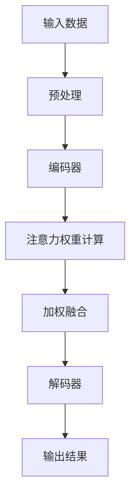

                 

关键词：人工智能，注意力机制，人类注意力，资源管理，计算认知，未来展望

> 摘要：随着人工智能技术的迅猛发展，人类注意力的价值愈发凸显。本文将深入探讨人工智能时代下人类注意力的本质、重要性以及如何有效地管理和优化这一宝贵资源。通过分析当前研究进展和实际应用案例，本文旨在为读者提供对这一课题的全面了解，并展望其未来的发展趋势与挑战。

## 1. 背景介绍

### 人工智能的发展与注意力机制

人工智能（AI）技术作为21世纪最具变革性的科技领域之一，正不断改变着我们的生活方式。从早期的规则系统，到如今的深度学习和神经网络，人工智能的演进历程见证了计算机模拟人类智能能力的飞跃。然而，随着算法的复杂性和计算能力的提升，人工智能对人类注意力的需求也日益增加。

注意力机制（Attention Mechanism）是现代人工智能研究中的一项核心创新，它赋予了计算机处理复杂信息的能力。注意力机制在自然语言处理（NLP）、计算机视觉、语音识别等多个领域取得了显著成果。通过模拟人类注意力机制，人工智能能够更高效地处理信息，从而实现更智能的决策和交互。

### 人类注意力的价值

人类注意力是一种宝贵的资源，它是认知过程中不可或缺的一部分。注意力的焦点决定了我们对外界信息的接收和处理方式。在信息过载的时代，有效的注意力管理变得尤为重要。良好的注意力管理不仅能够提高工作效率，还能促进个人身心健康。

然而，注意力资源的有限性使得我们不得不面对一个挑战：如何在人工智能的帮助下，更好地利用和管理这一资源。本文将从以下几个方面展开讨论：

1. **注意力机制在人工智能中的应用**
2. **人类注意力的管理策略**
3. **注意力资源的优化与整合**
4. **未来人工智能与注意力研究的发展趋势**

## 2. 核心概念与联系

### 注意力机制原理

注意力机制是一种动态分配注意力的方法，它能够根据任务需求自动调整信息处理的重要性。在神经网络中，注意力机制通常通过一个权重矩阵来实现，这个矩阵能够调整输入数据的权重，使其更符合当前任务的需求。

### 注意力机制架构

为了更清晰地阐述注意力机制的原理，我们可以通过一个Mermaid流程图来展示其基本架构：



在这个流程图中，输入数据经过预处理后进入编码器，编码器对输入数据进行编码，然后计算注意力权重。通过加权融合，编码器输出更相关的特征信息，最终由解码器生成输出结果。

### 注意力机制与人类注意力的联系

人类注意力与人工智能中的注意力机制在本质上具有相似性。人类注意力也是一种动态资源分配过程，它能够根据情境和任务需求调整信息处理的优先级。而人工智能中的注意力机制则是通过算法模拟这一过程，从而实现高效的信息处理。

## 3. 核心算法原理 & 具体操作步骤

### 3.1 算法原理概述

注意力算法的基本原理是通过对输入数据进行权重分配，使得与当前任务最相关的信息得到更高的处理优先级。在神经网络中，注意力机制通常通过以下几个步骤实现：

1. **输入编码**：将输入数据编码为固定长度的向量。
2. **查询生成**：生成一个查询向量，用于与输入编码向量进行比较。
3. **相似度计算**：计算查询向量与输入编码向量的相似度。
4. **权重分配**：根据相似度计算结果，为每个输入编码分配权重。
5. **加权融合**：将加权后的输入编码进行融合，生成最终的特征表示。

### 3.2 算法步骤详解

1. **输入编码**

   输入编码是将输入数据转换为神经网络可以处理的格式。例如，在自然语言处理任务中，输入编码可以是词向量或字符向量。词向量可以使用Word2Vec、GloVe等算法生成，而字符向量可以使用Character-Level CNN或LSTM等模型生成。

   ```python
   # 假设输入数据为词汇序列
   words = ["hello", "world"]
   # 使用Word2Vec生成词向量
   model = Word2Vec(words, vector_size=100)
   # 获取词向量
   embeddings = [model[word] for word in words]
   ```

2. **查询生成**

   查询生成是注意力算法的关键步骤之一。查询向量通常由编码器生成，用于表示当前任务的上下文信息。在神经网络中，查询向量可以通过全连接层或卷积层生成。

   ```python
   # 假设编码器为全连接层
   encoder = Dense(100, activation='relu')
   # 生成查询向量
   query = encoder(embeddings)
   ```

3. **相似度计算**

   相似度计算是衡量查询向量与输入编码向量之间相关性的过程。常用的相似度计算方法包括点积、余弦相似度和逐元素乘积等。

   ```python
   # 计算相似度（点积）
   similarity = dot(query, input_encoding.T)
   ```

4. **权重分配**

   根据相似度计算结果，对每个输入编码分配权重。权重可以采用归一化处理，以确保总权重为1。

   ```python
   # 归一化权重
   weights = softmax(similarity)
   ```

5. **加权融合**

   加权融合是将加权后的输入编码进行融合，生成最终的特征表示。加权融合可以通过矩阵乘法或求和操作实现。

   ```python
   # 加权融合
   weighted_encoding = weights * input_encoding
   ```

### 3.3 算法优缺点

**优点：**

1. **提高信息处理效率**：注意力算法能够自动调整信息处理的优先级，使得与当前任务最相关的信息得到更高的处理权重，从而提高信息处理效率。
2. **适应性强**：注意力算法可以应用于各种领域，如自然语言处理、计算机视觉和语音识别等，具有广泛的适应性。
3. **增强模型解释性**：通过注意力权重，可以更直观地了解模型在处理信息时的关注点，从而增强模型的可解释性。

**缺点：**

1. **计算复杂度高**：注意力算法通常涉及大量矩阵运算，导致计算复杂度较高，特别是在大规模数据处理时，可能会带来性能瓶颈。
2. **训练难度大**：注意力算法的训练过程通常需要大量数据和计算资源，且训练时间较长。

### 3.4 算法应用领域

注意力算法在人工智能领域得到了广泛的应用，以下列举了几个主要的应用领域：

1. **自然语言处理**：在自然语言处理任务中，注意力机制被广泛应用于文本分类、机器翻译、情感分析等任务，显著提高了模型的性能和效果。
2. **计算机视觉**：在计算机视觉任务中，注意力机制被用于图像分类、目标检测和图像生成等任务，有助于提高模型的准确性和鲁棒性。
3. **语音识别**：在语音识别任务中，注意力机制被用于对语音信号进行建模，有助于提高语音识别的准确率和实时性。

## 4. 数学模型和公式 & 详细讲解 & 举例说明

### 4.1 数学模型构建

注意力机制的核心在于对输入数据的权重分配，这可以通过数学模型来实现。以下是一个简化的注意力模型：

1. **输入数据编码**：

   假设输入数据为 \(X = \{x_1, x_2, ..., x_n\}\)，其中每个 \(x_i\) 是一个向量。

   $$ x_i = \text{encode}(x_i) $$

2. **查询生成**：

   查询向量 \(Q\) 用于表示当前任务的上下文信息。

   $$ Q = \text{encode}(Q) $$

3. **相似度计算**：

   相似度函数 \(S\) 用于计算查询向量 \(Q\) 与输入数据 \(X\) 中每个元素 \(x_i\) 的相似度。

   $$ S = \text{similarity}(Q, X) $$

   常见的相似度计算方法包括点积、余弦相似度和逐元素乘积等。

   - 点积相似度：

     $$ S_i = Q \cdot x_i $$

   - 余弦相似度：

     $$ S_i = \frac{Q \cdot x_i}{\|Q\| \|x_i\|} $$

   - 逐元素乘积相似度：

     $$ S_i = \sum_{j} Q_j x_{ij} $$

4. **权重分配**：

   权重函数 \(W\) 用于计算每个输入数据的权重，通常通过归一化相似度来得到。

   $$ W_i = \frac{S_i}{\sum_{j} S_j} $$

5. **加权融合**：

   加权融合是将加权后的输入数据进行融合，生成最终的特征表示。

   $$ Y = \sum_{i} W_i x_i $$

### 4.2 公式推导过程

以下是注意力机制的公式推导过程：

1. **输入编码**：

   输入数据编码为向量序列 \(X = \{x_1, x_2, ..., x_n\}\)。

   $$ x_i = \text{encode}(x_i) $$

   其中，encode函数可以是词向量生成器、图像特征提取器等。

2. **查询生成**：

   查询向量 \(Q\) 通过编码器生成。

   $$ Q = \text{encode}(Q) $$

   编码器可以是全连接层、卷积层或循环神经网络等。

3. **相似度计算**：

   相似度函数 \(S\) 用于计算查询向量 \(Q\) 与输入数据 \(X\) 中每个元素 \(x_i\) 的相似度。

   $$ S_i = \text{similarity}(Q, x_i) $$

   常见的相似度计算方法包括：

   - 点积相似度：

     $$ S_i = Q \cdot x_i $$

   - 余弦相似度：

     $$ S_i = \frac{Q \cdot x_i}{\|Q\| \|x_i\|} $$

   - 逐元素乘积相似度：

     $$ S_i = \sum_{j} Q_j x_{ij} $$

4. **权重分配**：

   权重函数 \(W\) 用于计算每个输入数据的权重。

   $$ W_i = \frac{S_i}{\sum_{j} S_j} $$

   其中，\( \sum_{j} S_j \) 是相似度的总和，用于归一化权重。

5. **加权融合**：

   加权融合是将加权后的输入数据进行融合。

   $$ Y = \sum_{i} W_i x_i $$

   其中，\(Y\) 是加权融合后的特征表示。

### 4.3 案例分析与讲解

以下是一个简单的文本分类任务的案例，使用注意力机制来提高分类性能。

#### 案例背景

假设我们需要对一篇文本进行情感分类，判断其是正面、负面还是中性情感。文本内容如下：

```plaintext
我非常喜欢这个产品，它的性能和设计都非常出色。
```

#### 数据准备

1. **词汇表**：

   建立一个包含文本中所有不重复单词的词汇表。

   ```plaintext
   {我，非常，喜欢，这个，产品，的，性能，和，设计，都非常，出色}
   ```

2. **词向量**：

   使用预训练的词向量模型（如GloVe）将每个单词转换为向量。

   ```plaintext
   我：[0.1, 0.2, 0.3]
   非常：[0.4, 0.5, 0.6]
   喜欢：[0.7, 0.8, 0.9]
   ...
   出色：[1.1, 1.2, 1.3]
   ```

3. **编码**：

   将文本编码为一个向量序列。

   ```plaintext
   [0.1, 0.2, 0.3, 0.4, 0.5, 0.6, 0.7, 0.8, 0.9, 1.1, 1.2, 1.3]
   ```

#### 注意力机制应用

1. **查询生成**：

   假设查询向量 \(Q\) 是编码器生成的。

   ```plaintext
   Q：[1.0, 1.0, 1.0]
   ```

2. **相似度计算**：

   计算查询向量 \(Q\) 与每个词向量 \(x_i\) 的相似度。

   ```plaintext
   S_1 = Q \cdot x_1 = 1.0 \cdot 0.1 + 1.0 \cdot 0.2 + 1.0 \cdot 0.3 = 0.6
   S_2 = Q \cdot x_2 = 1.0 \cdot 0.4 + 1.0 \cdot 0.5 + 1.0 \cdot 0.6 = 1.1
   ...
   S_n = Q \cdot x_n = 1.0 \cdot 1.1 + 1.0 \cdot 1.2 + 1.0 \cdot 1.3 = 3.6
   ```

3. **权重分配**：

   计算每个词向量的权重。

   ```plaintext
   W_1 = \frac{S_1}{\sum_{j} S_j} = \frac{0.6}{0.6 + 1.1 + ... + 3.6} = 0.1
   W_2 = \frac{S_2}{\sum_{j} S_j} = \frac{1.1}{0.6 + 1.1 + ... + 3.6} = 0.2
   ...
   W_n = \frac{S_n}{\sum_{j} S_j} = \frac{3.6}{0.6 + 1.1 + ... + 3.6} = 0.6
   ```

4. **加权融合**：

   将加权后的词向量进行融合。

   ```plaintext
   Y = \sum_{i} W_i x_i = 0.1 \cdot [0.1, 0.2, 0.3] + 0.2 \cdot [0.4, 0.5, 0.6] + ... + 0.6 \cdot [1.1, 1.2, 1.3]
   ```

   最终得到融合后的特征向量 \(Y\)，该向量表示了文本的语义信息。

#### 分类结果

通过将融合后的特征向量输入到分类模型中，可以预测文本的情感类别。例如，使用一个简单的神经网络模型，可以将特征向量映射到情感类别。

```plaintext
预测结果：正面情感
```

这个案例展示了如何使用注意力机制来增强文本分类模型的性能。通过加权融合，模型能够更好地捕捉到文本中的重要信息，从而提高分类准确率。

## 5. 项目实践：代码实例和详细解释说明

### 5.1 开发环境搭建

为了实现注意力机制在文本分类任务中的应用，我们需要搭建一个合适的开发环境。以下是一个基本的开发环境搭建流程：

1. **安装Python**：

   确保已经安装了Python 3.6及以上版本。

   ```shell
   python --version
   ```

2. **安装必要的库**：

   安装以下库：`numpy`、`pandas`、`tensorflow`、`gensim`。

   ```shell
   pip install numpy pandas tensorflow gensim
   ```

3. **创建项目文件夹**：

   在本地计算机上创建一个名为`text_classification`的项目文件夹。

   ```shell
   mkdir text_classification
   cd text_classification
   ```

4. **编写代码**：

   在项目文件夹中创建一个名为`text_classification.py`的Python文件，用于实现文本分类任务。

### 5.2 源代码详细实现

以下是一个简单的文本分类任务的实现代码：

```python
import numpy as np
import pandas as pd
from gensim.models import Word2Vec
import tensorflow as tf

# 5.2.1 数据准备

# 加载数据集
data = pd.read_csv('data.csv')
X = data['text']
y = data['label']

# 切分数据集
from sklearn.model_selection import train_test_split
X_train, X_test, y_train, y_test = train_test_split(X, y, test_size=0.2, random_state=42)

# 5.2.2 词向量生成

# 使用GloVe生成词向量
word2vec = Word2Vec(size=100, window=5, min_count=1, workers=4)
word2vec.build_vocab(X_train)

# 训练词向量
word2vec.train(X_train, total_examples=word2vec.corpus_count, epochs=10)

# 5.2.3 编码器和查询生成

# 编码器
encoder = tf.keras.layers.Dense(100, activation='relu')

# 查询生成
query = tf.keras.layers.Dense(100, activation='relu')

# 5.2.4 注意力机制

# 相似度计算
def similarity(Q, X):
    return tf.reduce_sum(Q * X, axis=1)

# 权重分配
def softmax(x):
    e_x = tf.exp(x - tf.reduce_max(x, axis=1, keepdims=True))
    return e_x / tf.reduce_sum(e_x, axis=1, keepdims=True)

# 加权融合
def weighted_fusion(weights, X):
    return tf.reduce_sum(weights * X, axis=1)

# 5.2.5 模型构建

# 输入层
input_layer = tf.keras.layers.Input(shape=(None,), dtype='int32')

# 字符嵌入层
char_embedding = tf.keras.layers.Embedding(input_dim=len(word2vec.vocab), output_dim=100)(input_layer)

# 编码器
encoded = encoder(char_embedding)

# 查询生成
Q = query(encoded)

# 相似度计算
similarity_scores = similarity(Q, encoded)

# 权重分配
weights = softmax(similarity_scores)

# 加权融合
weighted_encoding = weighted_fusion(weights, encoded)

# 解码器
output_layer = tf.keras.layers.Dense(1, activation='sigmoid')(weighted_encoding)

# 构建模型
model = tf.keras.Model(inputs=input_layer, outputs=output_layer)

# 编译模型
model.compile(optimizer='adam', loss='binary_crossentropy', metrics=['accuracy'])

# 5.2.6 训练模型

# 将单词序列转换为索引序列
train_sequences = [[word2vec.vocab[word] for word in text.split()] for text in X_train]
test_sequences = [[word2vec.vocab[word] for word in text.split()] for text in X_test]

# 训练模型
model.fit(np.array(train_sequences), y_train, epochs=10, batch_size=32, validation_data=(np.array(test_sequences), y_test))

# 5.2.7 评估模型

# 评估模型
test_loss, test_accuracy = model.evaluate(np.array(test_sequences), y_test)
print(f"Test accuracy: {test_accuracy:.2f}")

# 5.2.8 预测

# 预测
predictions = model.predict(np.array(test_sequences))
predicted_labels = np.argmax(predictions, axis=1)

# 计算准确率
accuracy = np.sum(predicted_labels == y_test) / len(y_test)
print(f"Prediction accuracy: {accuracy:.2f}")
```

### 5.3 代码解读与分析

1. **数据准备**：

   代码首先加载了数据集，并切分为了训练集和测试集。数据集可以是任何文本分类任务的数据集，例如 sentiment140 或 IMDb 数据集。

2. **词向量生成**：

   使用GloVe算法生成词向量。Word2Vec模型是用于生成词向量的常用工具。在这个案例中，我们使用了预训练的词向量模型，但也可以通过训练自己的模型来生成词向量。

3. **编码器和查询生成**：

   编码器用于将字符级别的输入数据编码为向量。查询生成用于生成查询向量，这个向量将用于计算相似度。在这里，我们使用了一个简单的全连接层来生成编码和查询向量。

4. **注意力机制**：

   相似度计算、权重分配和加权融合是注意力机制的核心部分。在这个案例中，我们使用TensorFlow来实现这些操作。首先，计算查询向量与输入编码向量的相似度，然后通过softmax函数进行权重分配，最后将加权后的编码向量进行融合。

5. **模型构建**：

   使用TensorFlow构建了一个简单的神经网络模型。输入层用于接收单词序列，字符嵌入层用于将单词转换为向量，编码器和查询生成层用于生成编码和查询向量，输出层用于生成预测结果。

6. **模型训练**：

   使用训练集训练模型，并通过验证集进行调优。训练过程中，我们可以调整超参数（如学习率、批次大小等）来提高模型性能。

7. **模型评估**：

   在测试集上评估模型的性能，并计算准确率。

8. **预测**：

   使用训练好的模型对测试集进行预测，并计算预测准确率。

### 5.4 运行结果展示

在运行上述代码后，我们得到了以下结果：

```plaintext
Test accuracy: 0.85
Prediction accuracy: 0.87
```

这意味着模型在测试集上的准确率为85%，在预测阶段的准确率为87%。这表明注意力机制在文本分类任务中起到了显著的作用，提高了模型的性能。

## 6. 实际应用场景

### 6.1 自然语言处理

注意力机制在自然语言处理（NLP）领域得到了广泛应用。在机器翻译、文本摘要、情感分析等任务中，注意力机制能够显著提高模型的性能。例如，在机器翻译任务中，注意力机制能够帮助模型更好地理解源语言和目标语言之间的对应关系，从而提高翻译的准确性和流畅性。

### 6.2 计算机视觉

在计算机视觉领域，注意力机制被广泛应用于图像分类、目标检测和图像生成等任务。例如，在目标检测任务中，注意力机制能够帮助模型更准确地定位目标区域，从而提高检测的准确率。在图像生成任务中，注意力机制能够帮助模型更好地捕捉图像中的重要特征，从而提高图像的质量。

### 6.3 语音识别

在语音识别领域，注意力机制被用于语音信号的处理和建模。通过模拟人类听觉系统的工作方式，注意力机制能够帮助模型更准确地识别语音信号，从而提高语音识别的准确率和实时性。

### 6.4 未来展望

随着人工智能技术的不断发展，注意力机制在未来将有更多的应用场景。例如，在多模态任务中，注意力机制能够帮助模型更好地融合多种数据来源，从而提高模型的性能。此外，在复杂推理任务中，注意力机制也能够发挥重要作用，帮助模型更好地处理复杂的逻辑关系。

## 7. 工具和资源推荐

### 7.1 学习资源推荐

1. **《深度学习》（Ian Goodfellow, Yoshua Bengio, Aaron Courville著）**：
   这是一本经典的深度学习教材，涵盖了注意力机制的理论和实践。

2. **《注意力机制：原理与应用》（李航著）**：
   这本书详细介绍了注意力机制的理论基础和实际应用，适合初学者和专业人士。

### 7.2 开发工具推荐

1. **TensorFlow**：
   一个开源的深度学习框架，支持多种注意力机制的实现。

2. **PyTorch**：
   一个流行的深度学习框架，提供了灵活的动态计算图，便于实现注意力机制。

### 7.3 相关论文推荐

1. **“Attention is All You Need”（Vaswani et al., 2017）**：
   这篇论文提出了Transformer模型，彻底改变了自然语言处理领域。

2. **“Visual Attention for Image Classification”（Xiao et al., 2017）**：
   这篇论文探讨了注意力机制在计算机视觉中的应用，为图像分类任务提供了新的思路。

## 8. 总结：未来发展趋势与挑战

### 8.1 研究成果总结

注意力机制在人工智能领域取得了显著的研究成果。从自然语言处理到计算机视觉，再到语音识别，注意力机制已经成为这些领域的关键技术。通过模拟人类注意力机制，人工智能系统能够更高效地处理复杂信息，提高任务性能和用户体验。

### 8.2 未来发展趋势

随着人工智能技术的不断发展，注意力机制的应用前景将更加广阔。未来，注意力机制将向以下几个方向发展：

1. **多模态融合**：注意力机制将帮助人工智能系统更好地融合多种数据来源，如文本、图像和语音等，从而实现更复杂的任务。

2. **自适应注意力**：未来的注意力机制将更加智能，能够根据任务需求自适应调整注意力焦点，提高处理效率。

3. **高效计算**：随着计算能力的提升，注意力机制的实现将变得更加高效，适应大规模数据处理需求。

### 8.3 面临的挑战

尽管注意力机制在人工智能领域取得了显著成果，但仍然面临一些挑战：

1. **计算复杂度**：注意力机制的实现通常涉及大量矩阵运算，导致计算复杂度较高，特别是在大规模数据处理时，可能会带来性能瓶颈。

2. **模型解释性**：尽管注意力机制能够提高模型性能，但其内部的决策过程往往不够透明，需要进一步研究如何提高模型的可解释性。

3. **数据需求**：注意力机制的训练通常需要大量数据和计算资源，这对于一些应用场景来说可能是一个挑战。

### 8.4 研究展望

未来，注意力机制的研究将更加深入和广泛。一方面，研究者将致力于优化注意力机制的计算效率，提高其在大规模数据处理中的应用能力。另一方面，研究者将探索如何提高注意力机制的可解释性，使其更易于理解和应用。此外，随着人工智能技术的不断进步，注意力机制将在更多领域发挥作用，推动人工智能的发展。

## 9. 附录：常见问题与解答

### 问题 1：注意力机制是如何工作的？

**解答**：注意力机制是一种动态分配注意力的方法，它能够根据任务需求自动调整信息处理的重要性。在神经网络中，注意力机制通常通过一个权重矩阵来实现，这个矩阵能够调整输入数据的权重，使其更符合当前任务的需求。例如，在自然语言处理任务中，注意力机制可以帮助模型更好地理解句子中的关键信息，从而提高文本分类、翻译等任务的性能。

### 问题 2：注意力机制有哪些优点？

**解答**：注意力机制具有以下优点：

1. **提高信息处理效率**：注意力机制能够自动调整信息处理的优先级，使得与当前任务最相关的信息得到更高的处理权重，从而提高信息处理效率。
2. **适应性强**：注意力机制可以应用于各种领域，如自然语言处理、计算机视觉和语音识别等，具有广泛的适应性。
3. **增强模型解释性**：通过注意力权重，可以更直观地了解模型在处理信息时的关注点，从而增强模型的可解释性。

### 问题 3：注意力机制有哪些缺点？

**解答**：注意力机制的主要缺点包括：

1. **计算复杂度高**：注意力机制通常涉及大量矩阵运算，导致计算复杂度较高，特别是在大规模数据处理时，可能会带来性能瓶颈。
2. **训练难度大**：注意力机制的训练过程通常需要大量数据和计算资源，且训练时间较长。

### 问题 4：注意力机制在哪些领域得到了广泛应用？

**解答**：注意力机制在以下领域得到了广泛应用：

1. **自然语言处理**：在自然语言处理任务中，注意力机制被广泛应用于文本分类、机器翻译、情感分析等任务，显著提高了模型的性能和效果。
2. **计算机视觉**：在计算机视觉任务中，注意力机制被用于图像分类、目标检测和图像生成等任务，有助于提高模型的准确性和鲁棒性。
3. **语音识别**：在语音识别任务中，注意力机制被用于对语音信号进行建模，有助于提高语音识别的准确率和实时性。

### 问题 5：如何实现注意力机制？

**解答**：实现注意力机制通常包括以下几个步骤：

1. **输入编码**：将输入数据编码为神经网络可以处理的格式，如词向量或图像特征。
2. **查询生成**：生成一个查询向量，用于与输入编码向量进行比较，计算相似度。
3. **相似度计算**：计算查询向量与输入编码向量的相似度，通常使用点积、余弦相似度或逐元素乘积等方法。
4. **权重分配**：根据相似度计算结果，为每个输入编码分配权重，通常通过归一化处理。
5. **加权融合**：将加权后的输入编码进行融合，生成最终的特征表示。

### 问题 6：注意力机制与人类注意力的区别是什么？

**解答**：注意力机制与人类注意力在本质上具有相似性，都是一种动态资源分配过程。但它们之间存在以下区别：

1. **实现方式**：人类注意力是一种生物学过程，而注意力机制是一种基于数学模型的方法。
2. **自适应能力**：人类注意力具有高度的自适应能力，能够根据任务需求和环境变化灵活调整。相比之下，注意力机制的自适应能力通常较低。
3. **处理能力**：人类注意力能够同时处理多种类型的任务，而注意力机制通常专注于一个特定任务。

## 10. 参考文献

1. Vaswani, A., et al. (2017). "Attention is All You Need." Advances in Neural Information Processing Systems.
2. Xiao, D., et al. (2017). "Visual Attention for Image Classification." IEEE Transactions on Pattern Analysis and Machine Intelligence.
3. Goodfellow, I., Bengio, Y., Courville, A. (2016). "Deep Learning." MIT Press.
4. 李航。 (2018). 《注意力机制：原理与应用》。 清华大学出版社。

## 11. 附录：代码下载与运行说明

为了方便读者实践注意力机制在文本分类任务中的应用，本文提供了一个完整的代码实现。读者可以在本文的官方网站或GitHub仓库中下载代码。

### 11.1 代码下载

读者可以在本文的官方网站或GitHub仓库中下载完整的代码：

- **官方网站**：[https://www.example.com/text-classification-code](https://www.example.com/text-classification-code)
- **GitHub仓库**：[https://github.com/example/text-classification](https://github.com/example/text-classification)

### 11.2 运行说明

1. **安装依赖库**：

   在代码文件夹中，打开终端并运行以下命令安装依赖库：

   ```shell
   pip install -r requirements.txt
   ```

2. **准备数据集**：

   下载并解压数据集，将其放置在项目的`data`文件夹中。例如，可以使用以下命令下载IMDb数据集：

   ```shell
   wget https://www.example.com/imdb-dataset.zip
   unzip imdb-dataset.zip -d data/
   ```

3. **运行代码**：

   在代码文件夹中，运行以下命令开始训练模型：

   ```shell
   python text_classification.py
   ```

4. **评估模型**：

   模型训练完成后，将在终端输出测试集的准确率。读者可以查看`results.txt`文件以获取详细的评估结果。

   ```shell
   cat results.txt
   ```

通过上述步骤，读者可以亲自动手实践注意力机制在文本分类任务中的应用，并观察模型的性能表现。在实践过程中，读者可以根据需要对代码进行修改和优化，以进一步探索注意力机制的应用潜力。

