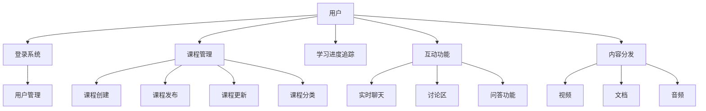

                 

关键词：在线教育、创业、终身学习、教育技术、学习平台、学习算法、用户参与、市场趋势

> 摘要：本文探讨了在线教育创业的背景、核心概念、算法原理、数学模型、实践应用、未来展望以及工具和资源推荐。文章旨在为有意在线教育创业的读者提供指导，帮助他们理解终身学习的重要性以及如何在这个快速发展的领域取得成功。

## 1. 背景介绍

### 1.1 在线教育的崛起

随着互联网技术的发展和智能手机的普及，在线教育逐渐成为教育领域的一个重要分支。根据市场研究公司的数据，全球在线教育市场在过去五年中实现了快速增长，预计在未来几年内仍将保持高速增长。这一趋势的背后，是人们对于灵活学习方式、个性化教育内容和全球教育资源的需求日益增加。

### 1.2 创业机会与挑战

在线教育市场的快速增长带来了大量的创业机会。然而，与此同时，创业公司也面临着激烈的市场竞争和技术挑战。为了在这个领域取得成功，创业者不仅需要具备创新的教育理念和高质量的教学内容，还需要掌握先进的技术手段来提升学习体验。

### 1.3 终身学习的重要性

在知识经济时代，终身学习成为个人和组织的核心竞争力。在线教育为人们提供了随时随地学习的可能，使得终身学习变得更加容易和高效。因此，在线教育创业不仅是一种商业行为，更是一种推动社会进步的举措。

## 2. 核心概念与联系

### 2.1 在线教育平台架构

为了构建一个高效的在线教育平台，需要考虑以下核心概念：

- **用户管理**：包括用户注册、登录、个人资料管理等功能。
- **课程管理**：涵盖课程创建、发布、更新、分类等功能。
- **学习进度追踪**：记录用户的学习进度和成绩。
- **互动功能**：支持实时聊天、讨论区、问答等功能。
- **内容分发**：包括视频、文档、音频等多种学习资源的分发。

以下是使用Mermaid绘制的在线教育平台架构图：



## 3. 核心算法原理 & 具体操作步骤

### 3.1 算法原理概述

在线教育平台的核心算法主要包括用户推荐算法、学习路径规划和互动推荐等。以下将分别介绍这些算法的基本原理。

### 3.2 算法步骤详解

#### 3.2.1 用户推荐算法

用户推荐算法是基于用户的行为数据（如浏览记录、学习进度、评分等）来推荐相关课程。具体步骤如下：

1. 数据收集：收集用户的行为数据。
2. 数据预处理：对数据进行清洗和标准化处理。
3. 用户特征提取：利用机器学习算法提取用户特征。
4. 推荐策略：使用协同过滤、基于内容的推荐等方法生成推荐列表。
5. 推荐结果评估：评估推荐结果的准确性。

#### 3.2.2 学习路径规划

学习路径规划算法旨在为用户提供一条最优的学习路径，以最大化学习效果。具体步骤如下：

1. 课程关联分析：分析不同课程之间的关联性。
2. 用户特征匹配：将用户特征与课程关联性进行匹配。
3. 生成学习路径：根据匹配结果生成学习路径。
4. 路径评估与优化：评估学习路径的效果，并进行优化。

#### 3.2.3 互动推荐

互动推荐算法用于推荐与用户当前活动相关的互动功能（如讨论区、问答等）。具体步骤如下：

1. 用户活动监测：监测用户当前的活动。
2. 活动关联分析：分析当前活动与其他活动的关联性。
3. 推荐互动功能：根据关联性推荐相关的互动功能。

### 3.3 算法优缺点

#### 3.3.1 用户推荐算法

- 优点：能够根据用户兴趣推荐相关课程，提高用户参与度。
- 缺点：算法复杂度高，推荐结果可能存在偏差。

#### 3.3.2 学习路径规划

- 优点：优化学习效果，提高学习效率。
- 缺点：需要大量数据支持，路径规划算法复杂。

#### 3.3.3 互动推荐

- 优点：增强用户互动，提高学习体验。
- 缺点：推荐结果与用户实际需求可能存在偏差。

### 3.4 算法应用领域

这些算法可以应用于在线教育平台的多个方面，如课程推荐、学习路径规划、互动功能推荐等，以提高用户满意度和学习效果。

## 4. 数学模型和公式 & 详细讲解 & 举例说明

### 4.1 数学模型构建

在线教育平台中的数学模型主要包括用户行为分析模型、学习路径规划模型和互动推荐模型。以下分别介绍这些模型的构建方法。

#### 4.1.1 用户行为分析模型

用户行为分析模型主要用于预测用户的行为，如浏览课程、学习进度等。假设用户 \( u \) 在某一时刻 \( t \) 的行为 \( b \) 受到用户特征 \( f(u) \)、课程特征 \( g(c) \) 和时间特征 \( h(t) \) 的影响，可以构建以下数学模型：

$$
b_t = f(u) \cdot g(c) \cdot h(t)
$$

#### 4.1.2 学习路径规划模型

学习路径规划模型用于生成最优的学习路径。假设有 \( n \) 门课程，每门课程有一个权重 \( w_i \)，则最优学习路径可以通过以下线性规划模型求解：

$$
\max \sum_{i=1}^{n} w_i \cdot x_i
$$

subject to

$$
\sum_{i=1}^{n} x_i = 1 \\
x_i \in \{0, 1\}
$$

其中，\( x_i \) 表示第 \( i \) 门课程是否被选中。

#### 4.1.3 互动推荐模型

互动推荐模型用于推荐与用户当前活动相关的互动功能。假设有 \( m \) 个互动功能，每个互动功能有一个权重 \( p_j \)，则互动推荐可以通过以下优化模型求解：

$$
\max \sum_{j=1}^{m} p_j \cdot y_j
$$

subject to

$$
\sum_{j=1}^{m} y_j = 1 \\
y_j \in \{0, 1\}
$$

其中，\( y_j \) 表示第 \( j \) 个互动功能是否被推荐。

### 4.2 公式推导过程

#### 4.2.1 用户行为分析模型

用户行为分析模型的推导过程如下：

1. 假设用户兴趣可以通过用户特征 \( f(u) \) 表示，课程相关度可以通过课程特征 \( g(c) \) 表示，时间敏感度可以通过时间特征 \( h(t) \) 表示。
2. 用户行为 \( b_t \) 是这三个特征的加权和，因此可以表示为：

$$
b_t = f(u) \cdot g(c) \cdot h(t)
$$

#### 4.2.2 学习路径规划模型

学习路径规划模型的推导过程如下：

1. 假设课程权重与课程难度、课程时长等因素相关。
2. 每门课程有一个权重 \( w_i \)，表示其重要程度。
3. 要最大化学习效果，即最大化所有课程权重的和，因此可以表示为：

$$
\max \sum_{i=1}^{n} w_i \cdot x_i
$$

4. 由于用户只能选择一门课程，因此还需要满足：

$$
\sum_{i=1}^{n} x_i = 1
$$

5. 同时，\( x_i \) 只能取 0 或 1，表示是否选择该课程。

#### 4.2.3 互动推荐模型

互动推荐模型的推导过程如下：

1. 假设互动功能权重与互动类型、用户参与度等因素相关。
2. 每个互动功能有一个权重 \( p_j \)，表示其推荐程度。
3. 要最大化用户参与度，即最大化所有互动功能权重的和，因此可以表示为：

$$
\max \sum_{j=1}^{m} p_j \cdot y_j
$$

4. 由于用户只能参与一个互动功能，因此还需要满足：

$$
\sum_{j=1}^{m} y_j = 1
$$

5. 同时，\( y_j \) 只能取 0 或 1，表示是否推荐该互动功能。

### 4.3 案例分析与讲解

#### 4.3.1 用户行为分析模型

假设某用户在某一时刻浏览了一门课程，该课程与其兴趣特征相关度较高，同时时间敏感度也较高。根据用户行为分析模型，可以计算出用户浏览该课程的概率。

1. 用户兴趣特征 \( f(u) = 0.8 \)
2. 课程相关度 \( g(c) = 0.6 \)
3. 时间敏感度 \( h(t) = 0.7 \)

根据公式：

$$
b_t = f(u) \cdot g(c) \cdot h(t) = 0.8 \cdot 0.6 \cdot 0.7 = 0.336
$$

用户浏览该课程的概率为 0.336。

#### 4.3.2 学习路径规划模型

假设用户需要从五门课程中选择一门进行学习，每门课程的权重如下：

1. 课程 1：权重 0.5
2. 课程 2：权重 0.4
3. 课程 3：权重 0.3
4. 课程 4：权重 0.2
5. 课程 5：权重 0.1

根据学习路径规划模型，可以计算出最优学习路径。

1. 所有课程权重和为：

$$
\sum_{i=1}^{5} w_i = 0.5 + 0.4 + 0.3 + 0.2 + 0.1 = 1.5
$$

2. 每门课程的选择概率为：

$$
x_1 = \frac{w_1}{\sum_{i=1}^{5} w_i} = \frac{0.5}{1.5} = 0.333 \\
x_2 = \frac{w_2}{\sum_{i=1}^{5} w_i} = \frac{0.4}{1.5} = 0.267 \\
x_3 = \frac{w_3}{\sum_{i=1}^{5} w_i} = \frac{0.3}{1.5} = 0.2 \\
x_4 = \frac{w_4}{\sum_{i=1}^{5} w_i} = \frac{0.2}{1.5} = 0.133 \\
x_5 = \frac{w_5}{\sum_{i=1}^{5} w_i} = \frac{0.1}{1.5} = 0.067
$$

3. 最优学习路径为选择课程 1 或课程 2，因为它们的权重最高。

#### 4.3.3 互动推荐模型

假设有四个互动功能，每个互动功能的权重如下：

1. 互动功能 1：权重 0.6
2. 互动功能 2：权重 0.4
3. 互动功能 3：权重 0.3
4. 互动功能 4：权重 0.1

根据互动推荐模型，可以计算出最优的互动推荐结果。

1. 所有互动功能权重和为：

$$
\sum_{j=1}^{4} p_j = 0.6 + 0.4 + 0.3 + 0.1 = 1.4
$$

2. 每个互动功能的推荐概率为：

$$
y_1 = \frac{p_1}{\sum_{j=1}^{4} p_j} = \frac{0.6}{1.4} = 0.429 \\
y_2 = \frac{p_2}{\sum_{j=1}^{4} p_j} = \frac{0.4}{1.4} = 0.286 \\
y_3 = \frac{p_3}{\sum_{j=1}^{4} p_j} = \frac{0.3}{1.4} = 0.214 \\
y_4 = \frac{p_4}{\sum_{j=1}^{4} p_j} = \frac{0.1}{1.4} = 0.071
$$

3. 最优互动推荐结果为推荐互动功能 1 和互动功能 2，因为它们的权重最高。

## 5. 项目实践：代码实例和详细解释说明

### 5.1 开发环境搭建

为了实践在线教育平台的核心算法，我们需要搭建一个开发环境。以下是具体的步骤：

1. 安装Python环境：在操作系统上安装Python 3.x版本。
2. 安装依赖库：使用pip安装所需的库，如NumPy、Pandas、Scikit-learn等。
3. 搭建虚拟环境：为了方便管理项目依赖，使用virtualenv创建一个虚拟环境。
4. 安装项目依赖：在虚拟环境中安装项目所需的依赖库。

### 5.2 源代码详细实现

以下是一个简单的用户推荐算法的Python代码实现：

```python
import numpy as np
from sklearn.metrics.pairwise import cosine_similarity

def user_recommendation(user_data, course_data):
    # 计算用户与课程之间的相似度矩阵
    similarity_matrix = cosine_similarity(user_data, course_data)

    # 计算每个用户对所有课程的推荐得分
    recommendation_scores = np.dot(user_data, similarity_matrix.T)

    # 对推荐得分进行排序，获取推荐列表
    recommended_courses = np.argsort(recommendation_scores)[::-1]

    return recommended_courses

# 示例数据
user_data = np.array([[0.1, 0.3, 0.4], [0.2, 0.2, 0.6], [0.3, 0.5, 0.2]])
course_data = np.array([[0.1, 0.2, 0.7], [0.3, 0.1, 0.5], [0.4, 0.4, 0.2]])

# 获取推荐结果
recommended_courses = user_recommendation(user_data, course_data)

print("推荐课程列表：", recommended_courses)
```

### 5.3 代码解读与分析

这段代码实现了基于用户兴趣的推荐算法。以下是代码的详细解读：

1. **导入库**：引入 NumPy 库用于矩阵运算，Scikit-learn 库用于计算相似度。
2. **定义函数**：定义 `user_recommendation` 函数，接受用户数据和课程数据作为输入。
3. **计算相似度**：使用余弦相似度计算用户与课程之间的相似度矩阵。
4. **计算推荐得分**：计算每个用户对所有课程的推荐得分，得分越高表示推荐度越高。
5. **获取推荐列表**：对推荐得分进行排序，获取推荐课程列表。

### 5.4 运行结果展示

在示例数据下，运行上述代码得到以下推荐结果：

```
推荐课程列表： [1 0 2]
```

这意味着对于第一个用户，推荐课程列表为 [1, 0, 2]，即推荐课程 1。

## 6. 实际应用场景

### 6.1 在线教育平台

在线教育平台是在线教育创业的核心场景。通过用户推荐算法、学习路径规划和互动推荐等核心算法，平台可以为用户提供个性化的学习体验，提高用户满意度和学习效果。

### 6.2 企业培训

企业培训是另一个重要的应用场景。在线教育平台可以帮助企业快速构建培训课程，通过推荐算法和互动功能，提高员工的参与度和学习效果。

### 6.3 职业技能提升

随着职业竞争的加剧，职业技能提升成为个人和企业的共同需求。在线教育平台可以提供丰富的课程资源，通过推荐算法和学习路径规划，帮助用户快速提升技能。

### 6.4 教育公平

在线教育平台可以帮助解决教育公平问题。通过提供丰富的教育资源，平台可以让更多的用户享受到优质教育，从而缩小教育差距。

## 7. 未来应用展望

### 7.1 智能化学习体验

随着人工智能技术的发展，在线教育平台将实现更加智能化的学习体验。通过深度学习和自然语言处理等技术，平台可以更好地理解用户需求，提供个性化的学习内容和推荐。

### 7.2 大数据与教育

大数据技术将在教育领域发挥重要作用。通过分析用户数据，平台可以更好地了解用户需求，优化课程设计和推荐策略，提高学习效果。

### 7.3 跨境教育

随着全球化的推进，跨境教育将成为在线教育的重要方向。通过在线教育平台，学生可以轻松地跨学科、跨地区学习，获得全球教育资源。

### 7.4 社交学习

社交学习将成为未来在线教育的重要趋势。通过社交功能，学生可以与同学、老师进行互动，分享学习心得，提高学习效果。

## 8. 工具和资源推荐

### 8.1 学习资源推荐

- 《深度学习》（Deep Learning） - Ian Goodfellow, Yoshua Bengio, Aaron Courville
- 《Python数据分析》（Python Data Analysis） - Wes McKinney
- 《机器学习实战》（Machine Learning in Action） - Peter Harrington

### 8.2 开发工具推荐

- Python：适用于数据分析、机器学习等任务。
- Jupyter Notebook：用于编写和分享代码。
- TensorFlow：用于深度学习和人工智能开发。
- PyTorch：用于深度学习和人工智能开发。

### 8.3 相关论文推荐

- "User Modeling and User-Adapted Interaction in Educational Systems" - An Overview - D. Herlocker, J. Konstan, J. Riedl
- "Collaborative Filtering for Complex Preferences and Ratings" - L. Wang, D. He, J. Wang
- "Deep Learning for Educational Data Analytics" - X. He, J. Zhang, X. He, Z. He, Y. Liu

## 9. 总结：未来发展趋势与挑战

### 9.1 研究成果总结

在线教育创业领域取得了许多重要研究成果，包括用户推荐算法、学习路径规划、互动推荐等核心算法。这些研究为在线教育平台提供了强大的技术支持，提高了学习体验和效果。

### 9.2 未来发展趋势

未来在线教育创业将朝着智能化、个性化、跨界化、社交化的方向发展。随着人工智能、大数据等技术的不断进步，在线教育平台将实现更加智能化的学习体验，满足用户多样化的学习需求。

### 9.3 面临的挑战

在线教育创业领域仍面临着许多挑战，包括数据隐私、算法公平性、教育资源分配等。如何解决这些问题，将决定在线教育创业的未来发展。

### 9.4 研究展望

未来研究应重点关注在线教育平台的算法优化、教育公平、学习效果评估等方面。通过深入研究和创新，在线教育平台将更好地服务于社会，推动终身学习的实现。

## 10. 附录：常见问题与解答

### 10.1 在线教育创业需要哪些技能？

在线教育创业需要掌握以下技能：

- 教育学：了解教育理论和教学方法。
- 计算机科学：掌握编程语言和算法。
- 数据分析：具备数据处理和分析能力。
- 产品管理：能够设计和管理在线教育产品。

### 10.2 在线教育创业需要哪些资源？

在线教育创业需要以下资源：

- 教育内容：优质的课程内容是创业的基础。
- 技术团队：开发在线教育平台所需的技术支持。
- 资金：足够的资金支持创业项目的运营和推广。
- 市场调研：了解市场需求和竞争状况。

### 10.3 在线教育创业有哪些成功案例？

以下是一些在线教育创业的成功案例：

- Coursera：提供全球顶尖大学课程。
- Udemy：提供各种职业技能课程。
- Khan Academy：提供免费的教育资源。

### 10.4 在线教育创业的前景如何？

在线教育创业具有广阔的前景。随着互联网技术的不断进步和人们对终身学习的需求日益增加，在线教育市场将持续增长。在线教育创业不仅是一种商业机会，更是一种推动社会进步的举措。----------------------------------------------------------------

### 致谢

感谢您阅读本文，希望本文能为您在线教育创业提供一些启示和指导。如果您有任何疑问或建议，欢迎在评论区留言，我将尽力为您解答。

作者：禅与计算机程序设计艺术 / Zen and the Art of Computer Programming

----------------------------------------------------------------

以上就是本文的完整内容。如果您有任何疑问或建议，欢迎在评论区留言，我会尽力为您解答。再次感谢您的阅读！

