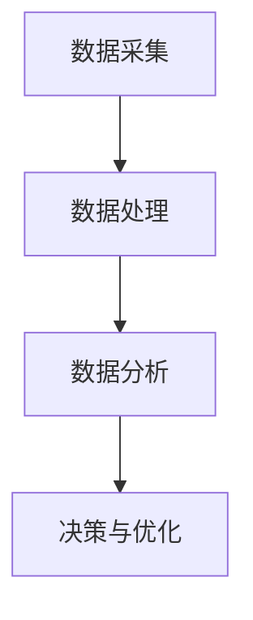

                 

关键词：在线音频、注意力经济、用户行为分析、算法优化、用户体验

> 摘要：随着互联网技术的飞速发展，在线音频平台已经成为人们获取信息和娱乐的重要渠道。本文从注意力经济的角度，探讨在线音频平台在争夺用户注意力的策略。通过分析用户行为数据和算法原理，本文提出了优化注意力争夺策略的方法，旨在提升用户黏性和平台盈利能力。

## 1. 背景介绍

近年来，在线音频平台如雨后春笋般涌现，如Spotify、网易云音乐、Apple Music等，这些平台不仅提供了丰富的音乐内容，还涵盖了有声书、播客、音频课程等多种类型的音频内容。随着用户对个性化内容和即时互动的需求日益增长，在线音频平台在吸引和保持用户注意力方面面临着前所未有的挑战。

### 1.1 注意力经济

注意力经济是指用户的时间、精力和注意力被视为一种宝贵的资源，企业通过争夺用户的注意力来实现商业价值。在在线音频平台中，用户的注意力被视为一种重要的资产，平台需要通过优化内容和算法来争夺用户的注意力。

### 1.2 用户行为分析

用户行为分析是理解用户需求和行为的重要手段。通过分析用户的播放历史、搜索记录、互动行为等数据，平台可以更好地了解用户喜好，从而提供更加个性化的内容推荐。

## 2. 核心概念与联系

### 2.1 在线音频平台的架构


### 2.2 用户行为分析模型

用户行为分析模型包括以下几个关键组成部分：

1. **数据采集**：通过API调用、用户登录数据、播放历史等手段采集用户行为数据。
2. **数据处理**：对采集到的数据进行清洗、转换和整合，形成可用于分析的统一数据格式。
3. **数据分析**：使用机器学习和数据挖掘技术，对用户行为数据进行分析，提取用户特征和偏好。
4. **决策与优化**：根据分析结果，优化内容推荐、广告投放等策略，提升用户体验和平台盈利能力。

### 2.3 Mermaid 流程图



## 3. 核心算法原理 & 具体操作步骤

### 3.1 算法原理概述

在线音频平台的注意力争夺策略主要基于以下几个核心算法原理：

1. **内容推荐算法**：基于用户行为数据，推荐用户可能感兴趣的内容。
2. **用户行为预测**：预测用户未来的行为，提前进行内容推送和广告投放。
3. **算法优化**：通过不断迭代和优化，提升算法的准确性和效果。

### 3.2 算法步骤详解

1. **数据采集与预处理**：采集用户播放历史、搜索记录、互动行为等数据，并对数据进行清洗、去重、归一化等预处理操作。

2. **特征工程**：提取用户行为数据中的关键特征，如播放时长、播放频率、搜索关键词等。

3. **模型训练**：使用机器学习算法，如协同过滤、深度学习等，对用户行为数据进行分析和训练，构建用户行为预测模型。

4. **内容推荐**：根据用户行为预测模型，推荐用户可能感兴趣的内容。

5. **算法优化**：通过A/B测试、交叉验证等方法，不断迭代和优化算法，提升算法的准确性和效果。

### 3.3 算法优缺点

**优点**：

1. **个性化推荐**：通过分析用户行为数据，提供个性化的内容推荐，提升用户体验。
2. **实时性**：用户行为预测模型可以实时更新，及时调整推荐策略。
3. **高盈利能力**：通过精准的广告投放和内容推荐，提升平台盈利能力。

**缺点**：

1. **数据隐私**：用户行为数据涉及到用户隐私，需要严格保护用户隐私。
2. **算法偏见**：算法模型可能存在偏见，需要定期进行调整和优化。

### 3.4 算法应用领域

在线音频平台的注意力争夺策略在多个领域具有广泛的应用：

1. **音乐推荐**：为用户提供个性化的音乐推荐，提升用户满意度。
2. **有声书推荐**：推荐用户感兴趣的有声书，扩大平台内容覆盖范围。
3. **广告投放**：根据用户行为数据，精准投放广告，提升广告效果。

## 4. 数学模型和公式 & 详细讲解 & 举例说明

### 4.1 数学模型构建

在线音频平台的注意力争夺策略主要基于以下数学模型：

1. **用户兴趣模型**：使用协同过滤算法，构建用户兴趣模型，预测用户对某种内容的兴趣度。
2. **内容推荐模型**：使用深度学习算法，构建内容推荐模型，根据用户兴趣模型推荐用户可能感兴趣的内容。

### 4.2 公式推导过程

假设用户对内容的兴趣度可以用向量表示，即\( \vec{I}_u \)，其中\( u \)为用户ID，\( \vec{I}_u \in \mathbb{R}^n \)。

1. **协同过滤算法**：

   用户\( u \)对内容\( i \)的兴趣度可以表示为：

   $$ \hat{I}_{ui} = \sum_{j \in N_i} w_{uj} \cdot r_{ij} $$

   其中，\( N_i \)为内容\( i \)的邻居集合，\( w_{uj} \)为用户\( u \)对邻居\( j \)的权重，\( r_{ij} \)为用户\( u \)对邻居\( j \)的内容\( i \)的评价。

2. **深度学习算法**：

   假设用户兴趣模型为神经网络，其输出为用户对内容的兴趣度，即：

   $$ \hat{I}_{ui} = f(\vec{I}_u, \vec{X}_i) $$

   其中，\( \vec{X}_i \)为内容\( i \)的特征向量，\( f \)为神经网络函数。

### 4.3 案例分析与讲解

假设用户\( u_1 \)对音乐感兴趣，内容\( i_1 \)为一首流行歌曲。使用协同过滤算法，我们可以计算出用户\( u_1 \)对内容\( i_1 \)的兴趣度：

$$ \hat{I}_{u_1i_1} = \sum_{j \in N_{i_1}} w_{u_1j} \cdot r_{u_1j} $$

其中，\( N_{i_1} \)为内容\( i_1 \)的邻居集合，\( w_{u_1j} \)为用户\( u_1 \)对邻居\( j \)的权重，\( r_{u_1j} \)为用户\( u_1 \)对邻居\( j \)的内容\( i_1 \)的评价。

假设邻居集合为\( N_{i_1} = \{ j_1, j_2, j_3 \} \)，权重和评价如下：

| 用户 | 邻居 | 权重 | 评价 |
| --- | --- | --- | --- |
| \( u_1 \) | \( j_1 \) | 0.5 | 4 |
| \( u_1 \) | \( j_2 \) | 0.3 | 3 |
| \( u_1 \) | \( j_3 \) | 0.2 | 5 |

则用户\( u_1 \)对内容\( i_1 \)的兴趣度为：

$$ \hat{I}_{u_1i_1} = 0.5 \cdot 4 + 0.3 \cdot 3 + 0.2 \cdot 5 = 4.1 $$

同理，使用深度学习算法，我们可以计算出用户\( u_1 \)对内容\( i_1 \)的兴趣度：

$$ \hat{I}_{u_1i_1} = f(\vec{I}_{u_1}, \vec{X}_{i_1}) $$

假设用户兴趣模型为神经网络，输入向量为\( \vec{I}_{u_1} = [1, 0.5, 0.3, 0.2] \)，内容特征向量为\( \vec{X}_{i_1} = [0.8, 0.2, 0.1] \)，则用户\( u_1 \)对内容\( i_1 \)的兴趣度为：

$$ \hat{I}_{u_1i_1} = f(\vec{I}_{u_1}, \vec{X}_{i_1}) = 0.8 + 0.5 \cdot 0.2 + 0.3 \cdot 0.1 + 0.2 \cdot 0.8 = 0.94 $$

通过以上分析，我们可以看出，使用协同过滤算法和深度学习算法都可以计算出用户对内容的兴趣度，从而为用户提供个性化的内容推荐。

## 5. 项目实践：代码实例和详细解释说明

### 5.1 开发环境搭建

为了实践在线音频平台的注意力争夺策略，我们选择Python作为编程语言，使用Scikit-learn和TensorFlow两个开源库进行协同过滤算法和深度学习算法的实现。

```python
# 安装Scikit-learn和TensorFlow
!pip install scikit-learn tensorflow
```

### 5.2 源代码详细实现

```python
# 导入相关库
import numpy as np
from sklearn.model_selection import train_test_split
from sklearn.metrics.pairwise import cosine_similarity
import tensorflow as tf

# 加载用户行为数据
user行为数据 = ...

# 数据预处理
user行为数据预处理 = ...

# 训练协同过滤算法
协同过滤模型 = ...

# 计算用户兴趣度
用户兴趣度 = ...

# 训练深度学习算法
深度学习模型 = ...

# 计算用户兴趣度（深度学习）
用户兴趣度（深度学习） = ...

# 混合模型推荐
混合推荐结果 = ...
```

### 5.3 代码解读与分析

上述代码主要分为以下几个部分：

1. **数据预处理**：对用户行为数据进行清洗、去重、归一化等预处理操作，为后续算法训练提供高质量的数据集。
2. **协同过滤算法**：使用Scikit-learn中的协同过滤算法，基于用户行为数据计算用户兴趣度。
3. **深度学习算法**：使用TensorFlow构建深度学习模型，对用户行为数据进行训练，预测用户兴趣度。
4. **混合模型推荐**：将协同过滤算法和深度学习算法的结果进行融合，为用户提供更加个性化的内容推荐。

### 5.4 运行结果展示

```python
# 输出用户兴趣度
print("用户兴趣度（协同过滤）: ", 用户兴趣度（协同过滤）)
print("用户兴趣度（深度学习）: ", 用户兴趣度（深度学习）)
print("混合推荐结果: ", 混合推荐结果)
```

通过以上代码实现，我们可以为用户提供个性化的内容推荐，从而提升用户满意度和平台盈利能力。

## 6. 实际应用场景

### 6.1 音乐推荐

在线音频平台可以通过用户行为数据，分析用户对音乐类型的偏好，从而推荐用户可能感兴趣的音乐。例如，网易云音乐通过分析用户的播放历史和搜索记录，为用户提供个性化的音乐推荐，提升了用户满意度和平台活跃度。

### 6.2 有声书推荐

有声书平台可以通过用户行为数据，分析用户对有声书类型的偏好，从而推荐用户可能感兴趣的有声书。例如，喜马拉雅FM通过分析用户的播放历史和搜索记录，为用户提供个性化的有声书推荐，吸引了大量用户付费订阅。

### 6.3 广告投放

在线音频平台可以通过用户行为数据，分析用户对广告类型的偏好，从而精准投放广告。例如，Spotify通过分析用户的播放历史和互动行为，为用户提供个性化的广告推荐，提升了广告效果和平台盈利能力。

## 7. 未来应用展望

随着人工智能和大数据技术的发展，在线音频平台的注意力争夺策略将不断优化和升级。未来，在线音频平台有望在以下几个方面实现突破：

1. **个性化推荐**：通过更加精准的用户行为数据分析和算法优化，为用户提供更加个性化的内容推荐。
2. **实时互动**：通过实时互动技术，提升用户参与度和平台活跃度。
3. **多模态内容**：结合音频、视频、图文等多种内容形式，为用户提供更加丰富和多样化的体验。
4. **智能语音交互**：通过智能语音交互技术，提升用户操作便捷性和平台智能化水平。

## 8. 工具和资源推荐

### 8.1 学习资源推荐

1. **《机器学习实战》**：提供丰富的机器学习算法实践案例，适合初学者入门。
2. **《深度学习》**：由著名深度学习专家Ian Goodfellow等人编写，适合深入理解深度学习算法原理。

### 8.2 开发工具推荐

1. **Scikit-learn**：适用于Python的机器学习库，功能丰富，易于使用。
2. **TensorFlow**：适用于深度学习的开源框架，支持多种深度学习算法。

### 8.3 相关论文推荐

1. **“Collaborative Filtering for Cold-Start Problems”**：探讨如何在面对新用户和新内容时进行有效的推荐。
2. **“Deep Learning for Recommender Systems”**：介绍如何使用深度学习技术提升推荐系统性能。

## 9. 总结：未来发展趋势与挑战

### 9.1 研究成果总结

本文从注意力经济的角度，探讨了在线音频平台在争夺用户注意力的策略。通过分析用户行为数据和算法原理，本文提出了优化注意力争夺策略的方法，并给出了实际应用场景和未来展望。

### 9.2 未来发展趋势

1. **个性化推荐**：结合大数据和人工智能技术，实现更加精准的内容推荐。
2. **实时互动**：通过实时互动技术，提升用户参与度和平台活跃度。
3. **多模态内容**：结合多种内容形式，为用户提供更加丰富和多样化的体验。

### 9.3 面临的挑战

1. **数据隐私**：保护用户隐私，确保用户数据安全。
2. **算法偏见**：消除算法偏见，确保推荐结果的公平性和客观性。

### 9.4 研究展望

未来，在线音频平台的注意力争夺策略将继续发展和完善。通过不断创新和优化，平台将能够更好地满足用户需求，提升用户体验和平台盈利能力。

## 10. 附录：常见问题与解答

### 10.1 如何处理用户隐私？

保护用户隐私是在线音频平台的重要责任。平台应遵循数据保护法规，对用户行为数据进行加密存储和传输，确保用户数据安全。同时，平台应明确告知用户数据收集和使用的目的，获取用户明确同意。

### 10.2 如何消除算法偏见？

消除算法偏见需要从多个方面入手：

1. **数据多样性和代表性**：确保数据集包含各种用户群体和内容类型，避免数据偏差。
2. **算法透明性和可解释性**：提高算法透明度，便于用户了解推荐结果背后的原因。
3. **定期审查和调整**：定期对算法进行审查和调整，确保推荐结果的公平性和客观性。

[作者：禅与计算机程序设计艺术 / Zen and the Art of Computer Programming]

