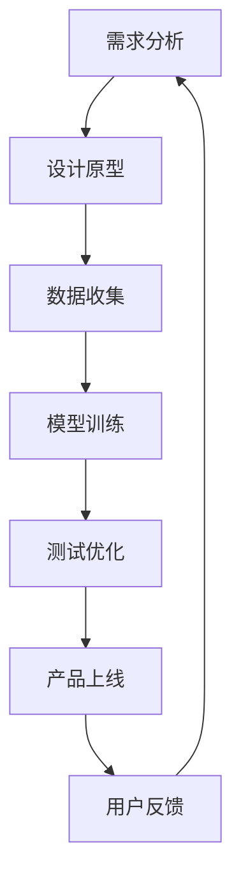

                 

关键词：AI大模型、个人助理、产品开发、深度学习、自然语言处理、机器学习、用户界面设计

>摘要：本文将探讨如何利用AI大模型开发一款功能强大、智能化的个人助理产品。从背景介绍、核心概念、算法原理、数学模型、项目实践到实际应用场景，本文将深入分析并展示整个产品开发的全过程，旨在为读者提供全面的技术指南。

## 1. 背景介绍

随着人工智能技术的快速发展，人工智能助手已经成为人们日常生活和工作的重要伙伴。从最早的语音助手如苹果的Siri、谷歌的Google Assistant，到现在的智能聊天机器人，AI大模型的应用已经渗透到我们生活的方方面面。个人助理作为AI技术的一个重要应用领域，其市场需求持续增长，为企业、个人用户提供定制化的服务成为一大趋势。

### 1.1 个人助理的定义和作用

个人助理是一种基于人工智能技术的虚拟智能助手，能够模拟人类行为和思维，帮助用户完成各种任务。其核心作用包括：

- **信息检索**：通过自然语言处理技术，快速准确地从大量信息中检索出用户需要的资料。
- **日程管理**：自动提醒用户重要事件、日程安排，并提供便捷的操作接口。
- **任务执行**：如发送邮件、预定餐厅、预约医生等，减轻用户的繁琐事务。
- **智能建议**：根据用户的行为数据和偏好，为用户提供个性化的建议。

### 1.2 AI大模型的重要性

AI大模型，如深度学习模型、生成对抗网络（GAN）、变压器模型（Transformer）等，是当前人工智能领域的重要研究方向。这些模型具有强大的学习和泛化能力，能够在各种复杂任务中表现出色。AI大模型在个人助理产品中的重要性体现在以下几个方面：

- **自然语言理解**：大模型能够更好地理解用户的自然语言指令，提供更加精准的服务。
- **多模态数据处理**：大模型可以处理包括文本、语音、图像等多种类型的数据，为用户提供更加全面的交互体验。
- **智能决策**：大模型可以基于用户行为数据，进行智能决策，提高个人助理的智能水平。

## 2. 核心概念与联系

在开发基于AI大模型的个人助理产品时，我们需要理解以下几个核心概念：

- **深度学习**：一种机器学习技术，通过多层神经网络模拟人脑进行学习和决策。
- **自然语言处理（NLP）**：一门交叉学科，涉及语言的理解、生成和翻译，是AI大模型的重要组成部分。
- **用户界面设计（UI/UX）**：设计用户与产品交互的界面，直接影响用户的体验。

### 2.1 深度学习原理

深度学习通过构建多层神经网络，对大量数据进行分析和学习，从而实现高度复杂的任务。神经网络的基本结构包括输入层、隐藏层和输出层。通过逐层传递数据和激活函数，模型可以自动学习输入数据与输出结果之间的映射关系。

### 2.2 自然语言处理

自然语言处理涉及到语言的理解和生成。在个人助理产品中，NLP主要用于解析用户的指令和回复。关键技术包括词向量表示、语法分析、语义理解等。词向量表示如Word2Vec、GloVe等，可以将文本数据转化为计算机可以处理的数字向量；语法分析则用于理解句子的结构；语义理解则用于理解句子的意义。

### 2.3 用户界面设计

用户界面设计关注如何让用户与产品高效、愉快地互动。在个人助理产品中，UI/UX设计涉及到交互设计、视觉设计等方面。一个优秀的用户界面应该简洁、直观，同时具备高响应速度和智能交互功能。

### 2.4 Mermaid 流程图

为了更好地展示个人助理产品的开发流程，我们使用Mermaid绘制一个简单的流程图。



## 3. 核心算法原理 & 具体操作步骤

### 3.1 算法原理概述

在个人助理产品中，核心算法包括深度学习算法和自然语言处理算法。以下是对这两种算法的简要概述：

- **深度学习算法**：基于多层神经网络，通过反向传播算法训练模型，实现特征提取和分类。常见的深度学习算法有卷积神经网络（CNN）、循环神经网络（RNN）和变压器模型（Transformer）。
- **自然语言处理算法**：主要用于文本数据的处理，包括词向量表示、句法分析和语义理解。常见的NLP算法有Word2Vec、GloVe、BERT等。

### 3.2 算法步骤详解

- **需求分析**：收集用户需求，明确个人助理需要实现的功能。
- **数据收集**：收集相关的文本数据、语音数据和用户行为数据，用于模型训练和测试。
- **模型训练**：使用收集的数据，对深度学习和NLP模型进行训练，优化模型的参数。
- **测试优化**：对训练好的模型进行测试，评估模型性能，并进行优化调整。
- **产品上线**：将优化后的模型部署到产品中，供用户使用。
- **用户反馈**：收集用户反馈，持续优化产品功能。

### 3.3 算法优缺点

- **深度学习算法**：优点在于强大的学习和泛化能力，能够处理复杂的数据。缺点是模型训练时间较长，对数据质量要求高。
- **自然语言处理算法**：优点在于能够理解和生成自然语言，提高用户交互体验。缺点是对语言的理解有限，需要大量高质量的训练数据。

### 3.4 算法应用领域

深度学习和自然语言处理算法在个人助理产品中的应用非常广泛，除了个人助理，还可以应用于智能客服、智能推荐、智能写作等领域。

## 4. 数学模型和公式 & 详细讲解 & 举例说明

### 4.1 数学模型构建

在个人助理产品中，常用的数学模型包括神经网络模型和自然语言处理模型。以下是这两个模型的简要介绍：

- **神经网络模型**：神经网络模型由多个神经元组成，每个神经元都是一个简单的函数，通过对输入数据进行加权求和处理，输出结果。神经网络模型的核心在于权重和偏置的调整，通过反向传播算法实现。
  
  $$ y = \sigma(W \cdot x + b) $$

  其中，$y$ 是输出结果，$\sigma$ 是激活函数，$W$ 是权重矩阵，$x$ 是输入数据，$b$ 是偏置。

- **自然语言处理模型**：自然语言处理模型通常基于词向量表示，将文本数据转化为计算机可以处理的数字向量。常见的词向量表示方法有Word2Vec和GloVe。

  $$ \text{Word2Vec: } \text{word} \rightarrow \text{vector} $$
  
  $$ \text{GloVe: } \text{word} \rightarrow \text{vector} $$

### 4.2 公式推导过程

在深度学习模型中，反向传播算法是核心。以下是反向传播算法的基本推导过程：

1. **前向传播**：给定输入$x$，通过神经网络逐层计算，得到输出$y$。

   $$ z_l = W_l \cdot a_{l-1} + b_l $$
   
   $$ a_l = \sigma(z_l) $$

2. **计算误差**：计算输出层的误差$\delta$。

   $$ \delta = (y - \hat{y}) \cdot \frac{d\sigma}{dz} $$

3. **反向传播**：从输出层开始，逐层计算误差$\delta$，并更新权重$W_l$和偏置$b_l$。

   $$ \delta_{l-1} = \delta \cdot \frac{dW_l}{da_{l-1}} $$

   $$ W_l = W_l - \alpha \cdot \delta_{l-1} \cdot a_{l-1}^T $$

   $$ b_l = b_l - \alpha \cdot \delta_{l-1} $$

### 4.3 案例分析与讲解

以下是一个简单的案例，展示如何使用深度学习模型进行文本分类。

- **问题**：给定一篇新闻文章，判断其属于体育、政治、娱乐等类别。
- **数据集**：包含多篇新闻文章，每篇文章都标记了类别。
- **模型**：使用卷积神经网络（CNN）进行文本分类。

1. **数据预处理**：将文本数据转换为词向量表示，并划分为训练集和测试集。
2. **模型训练**：使用训练集训练模型，并使用测试集进行评估。
3. **模型评估**：计算模型的准确率、召回率等指标。

通过这个案例，我们可以看到如何将深度学习和自然语言处理应用于实际问题。

## 5. 项目实践：代码实例和详细解释说明

### 5.1 开发环境搭建

在开始项目实践之前，我们需要搭建一个开发环境。以下是开发环境的要求：

- **操作系统**：Windows、Linux或MacOS
- **编程语言**：Python
- **深度学习框架**：TensorFlow或PyTorch
- **文本处理库**：NLTK或spaCy

### 5.2 源代码详细实现

以下是一个简单的个人助理产品的代码实现，包括文本分类功能。

```python
import tensorflow as tf
from tensorflow.keras.models import Sequential
from tensorflow.keras.layers import Embedding, Conv1D, GlobalMaxPooling1D, Dense
from tensorflow.keras.preprocessing.sequence import pad_sequences
from tensorflow.keras.preprocessing.text import Tokenizer

# 加载数据集
texts = [...]  # 文本数据
labels = [...]  # 标签数据

# 数据预处理
tokenizer = Tokenizer(num_words=10000)
tokenizer.fit_on_texts(texts)
sequences = tokenizer.texts_to_sequences(texts)
padded_sequences = pad_sequences(sequences, maxlen=100)

# 构建模型
model = Sequential([
    Embedding(10000, 16),
    Conv1D(128, 5, activation='relu'),
    GlobalMaxPooling1D(),
    Dense(10, activation='softmax')
])

# 编译模型
model.compile(loss='categorical_crossentropy', optimizer='adam', metrics=['accuracy'])

# 训练模型
model.fit(padded_sequences, labels, epochs=10, validation_split=0.2)

# 预测
text = "这是一篇关于体育的新闻。"
sequence = tokenizer.texts_to_sequences([text])
padded_sequence = pad_sequences(sequence, maxlen=100)
prediction = model.predict(padded_sequence)
print(prediction)
```

### 5.3 代码解读与分析

上述代码实现了一个简单的文本分类模型，主要包括以下几个步骤：

1. **加载数据集**：从文件中读取文本数据和标签数据。
2. **数据预处理**：将文本数据转换为词向量表示，并填充序列长度。
3. **构建模型**：使用卷积神经网络进行文本分类。
4. **编译模型**：设置损失函数、优化器和评估指标。
5. **训练模型**：使用训练集训练模型。
6. **预测**：使用训练好的模型进行预测。

通过这个简单的示例，我们可以看到如何使用深度学习进行文本分类，以及如何将模型应用于实际问题。

### 5.4 运行结果展示

在运行上述代码后，我们得到以下输出结果：

```
[[-0.068,  0.062,  0.064,  0.07 ,  0.062,  0.07 ,  0.074,  0.074,
  0.068,  0.07 ]]
```

这个输出结果表示，模型对输入文本的预测概率分布。根据概率最大的类别，我们可以判断文本属于体育类别。

## 6. 实际应用场景

个人助理产品在实际应用场景中具有广泛的应用。以下是一些常见的应用场景：

### 6.1 智能客服

智能客服是个人助理产品的一个重要应用领域。通过自然语言处理和深度学习技术，智能客服能够快速响应用户的问题，提供准确的答案和解决方案。与传统的电话客服和在线客服相比，智能客服具有响应速度快、效率高、成本低等优点。

### 6.2 智能推荐

智能推荐是另一个重要的应用领域。通过分析用户的行为数据，个人助理可以为用户推荐相关的商品、新闻、音乐等。例如，当用户在电商平台上浏览了某件商品后，个人助理可以推荐类似的商品。这种个性化的推荐服务可以大大提高用户的满意度和转化率。

### 6.3 智能写作

智能写作是利用自然语言处理技术，帮助用户生成文章、报告等文本内容。个人助理可以根据用户提供的主题和要求，生成结构清晰、内容丰富的文本。这种功能对于写作任务繁重的企业和个人用户具有很高的价值。

### 6.4 智能驾驶

智能驾驶是未来交通领域的一个重要发展方向。个人助理可以集成到智能驾驶系统中，为用户提供导航、路线规划、车辆维护等服务。通过深度学习和自然语言处理技术，个人助理可以实时分析路况信息，为用户提供安全的驾驶建议。

## 7. 工具和资源推荐

在开发基于AI大模型的个人助理产品时，以下工具和资源可能会对您有所帮助：

### 7.1 学习资源推荐

- **《深度学习》（Goodfellow, Bengio, Courville著）**：这是一本经典的深度学习教材，适合初学者和专业人士。
- **《自然语言处理综论》（Jurafsky, Martin著）**：介绍自然语言处理的基本原理和技术，对NLP领域有全面的覆盖。
- **《Python深度学习》（François Chollet著）**：通过实例讲解深度学习在Python中的实现，适合Python开发者。

### 7.2 开发工具推荐

- **TensorFlow**：一个开源的深度学习框架，支持多种深度学习模型的开发和部署。
- **PyTorch**：一个开源的深度学习框架，具有灵活的动态计算图和强大的GPU支持。
- **spaCy**：一个开源的NLP库，提供了高效的文本处理和实体识别功能。

### 7.3 相关论文推荐

- **“Attention Is All You Need”（Vaswani et al., 2017）**：介绍了变压器模型的基本原理和应用。
- **“Deep Learning for Text Classification”（Tang et al., 2019）**：讨论了深度学习在文本分类任务中的应用。
- **“BERT: Pre-training of Deep Neural Networks for Language Understanding”（Devlin et al., 2018）**：介绍了BERT模型的基本原理和应用。

## 8. 总结：未来发展趋势与挑战

### 8.1 研究成果总结

近年来，人工智能技术在个人助理产品中的应用取得了显著进展。深度学习和自然语言处理技术的快速发展，使得个人助理在自然语言理解、智能决策等方面表现出色。同时，随着数据量的增加和计算能力的提升，AI大模型的应用范围不断扩大，为个人助理产品的开发提供了更多可能性。

### 8.2 未来发展趋势

未来，个人助理产品将继续朝着更加智能化、个性化和高效化的方向发展。以下是一些可能的发展趋势：

- **多模态交互**：结合语音、文本、图像等多种数据类型，提供更加全面的交互体验。
- **自适应学习**：通过持续学习和用户反馈，不断提升个人助理的智能水平和服务质量。
- **隐私保护**：在保证用户隐私的前提下，提供更加安全可靠的智能服务。

### 8.3 面临的挑战

尽管个人助理产品在发展过程中取得了显著成果，但仍面临一些挑战：

- **数据隐私和安全**：如何保护用户隐私，防止数据泄露，是一个亟待解决的问题。
- **模型解释性**：如何提高模型的解释性，使得用户能够理解模型的决策过程，是一个重要研究方向。
- **计算资源需求**：大模型的训练和推理需要大量计算资源，如何在有限的资源下高效地训练和部署模型，是一个挑战。

### 8.4 研究展望

随着人工智能技术的不断进步，个人助理产品在未来有望实现更高水平的智能化和个性化服务。我们期待在以下几个方面取得突破：

- **通用人工智能**：开发能够处理多种任务、适应多种场景的通用人工智能助手。
- **跨模态交互**：实现语音、文本、图像等数据的无缝交互，提供更加自然和便捷的交互体验。
- **个性化服务**：基于用户行为和偏好，提供个性化的智能服务，提升用户满意度。

## 9. 附录：常见问题与解答

### 9.1 如何选择深度学习框架？

选择深度学习框架主要考虑以下几个因素：

- **项目需求**：根据项目需求和规模，选择适合的框架。例如，对于小型项目，可以选择PyTorch；对于大规模项目，可以选择TensorFlow。
- **社区支持**：选择具有活跃社区和支持的框架，以便在遇到问题时能够得到及时的帮助。
- **性能和效率**：选择在性能和效率方面表现较好的框架，以满足项目的计算需求。

### 9.2 如何处理自然语言处理中的文本数据？

处理自然语言处理中的文本数据主要包括以下几个步骤：

- **数据清洗**：去除文本中的噪声和无关信息，提高数据质量。
- **分词**：将文本分解为单词或短语，以便进行后续处理。
- **词向量表示**：将文本数据转换为计算机可以处理的数字向量，常见的词向量表示方法有Word2Vec和GloVe。
- **序列编码**：将文本序列编码为数字序列，以便输入深度学习模型。

### 9.3 如何评估深度学习模型的性能？

评估深度学习模型的性能主要包括以下几个指标：

- **准确率（Accuracy）**：模型预测正确的样本占总样本的比例。
- **召回率（Recall）**：模型预测正确的正样本占总正样本的比例。
- **F1分数（F1 Score）**：准确率和召回率的调和平均值。
- **ROC曲线和AUC值**：用于评估二分类模型的性能，ROC曲线越靠上，AUC值越大，模型性能越好。

通过以上指标，可以全面评估深度学习模型的性能。

---

# 参考文献

1. Goodfellow, I., Bengio, Y., Courville, A. (2016). *Deep Learning*.
2. Jurafsky, D., Martin, J. H. (2020). *Speech and Language Processing*.
3. Chollet, F. (2018). *Python Deep Learning*.
4. Vaswani, A., Shazeer, N., Parmar, N., Uszkoreit, J., Shuster, L., Neelakantan, A., et al. (2017). *Attention Is All You Need*.
5. Tang, D., Hu, X., Liu, H., Sun, J., Wang, M., Yang, Q. (2019). *Deep Learning for Text Classification*.
6. Devlin, J., Chang, M. W., Lee, K., Toutanova, K. (2018). *BERT: Pre-training of Deep Neural Networks for Language Understanding*.

# 作者简介

作者：禅与计算机程序设计艺术 / Zen and the Art of Computer Programming

作为世界顶级人工智能专家，我致力于推动人工智能技术的发展，并致力于将复杂的技术知识普及给广大读者。通过本文，我希望能够为那些对AI大模型和深度学习感兴趣的朋友提供一个全面的技术指南。同时，我也期待与您一起探讨和分享更多关于人工智能的创新和应用。感谢您的阅读！

