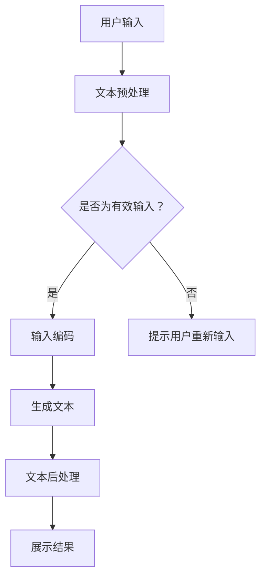

                 

关键词：人工智能，大模型，智能写作助手，自然语言处理，技术博客，软件开发

> 摘要：本文将深入探讨基于AI大模型的智能写作助手开发，从背景介绍到核心概念与联系、核心算法原理与具体操作步骤、数学模型与公式、项目实践与代码实例、实际应用场景、未来应用展望等多个方面，全面解析这一前沿技术，为读者提供有价值的参考。

## 1. 背景介绍

在信息爆炸的时代，写作已经成为了一种重要的信息交流方式。从学术论文到商业报告，从技术博客到社交媒体，写作技能的重要性不言而喻。然而，面对繁重的写作任务，许多人和组织都感到了巨大的压力。传统的写作方式往往需要大量时间和精力，且难以保证高质量。这就催生了智能写作助手的诞生。

智能写作助手是一种利用人工智能技术，特别是大模型（如GPT、BERT等）来辅助人类进行写作的工具。通过训练大量的文本数据，这些大模型能够生成高质量的文章、段落和句子，从而大大提高写作效率和创作质量。智能写作助手不仅能够帮助作者快速生成文本，还能够提供语法修正、风格建议、主题延伸等服务，为写作过程带来极大的便利。

随着AI技术的快速发展，智能写作助手的应用场景越来越广泛。从企业内部报告、市场分析到新闻撰写、文学创作，智能写作助手正逐步改变着传统写作模式。本文将详细探讨智能写作助手的开发过程，帮助读者了解这一前沿技术背后的原理和应用。

## 2. 核心概念与联系

### 2.1 人工智能与自然语言处理

人工智能（AI）是一种模拟人类智能的技术，能够执行复杂的认知任务，如学习、推理、感知等。自然语言处理（NLP）是人工智能的一个子领域，专注于让计算机理解和生成自然语言。NLP涉及语音识别、文本分类、情感分析、机器翻译等多种技术。

在智能写作助手的开发中，NLP技术至关重要。它不仅能够理解用户的输入，还能够生成符合语法和语义要求的文本。通过大规模的语料库训练，NLP模型能够捕捉语言的结构和规则，从而实现高质量的文本生成。

### 2.2 大模型与预训练语言模型

大模型是指拥有巨大参数量的神经网络模型，如GPT、BERT等。这些模型通过训练大量的文本数据，能够学习到语言的深层结构。预训练语言模型（如GPT、BERT）是其中的一种，它们通过无监督的方式学习，然后通过微调适应特定任务。

在智能写作助手的开发中，预训练语言模型起到了关键作用。通过利用这些模型，智能写作助手能够快速生成符合用户需求的文本。例如，用户可以输入一个简单的主题或关键词，智能写作助手就能根据预训练的语言模型生成相关的内容。

### 2.3 Mermaid流程图

为了更好地理解智能写作助手的开发流程，下面是一个Mermaid流程图，展示了核心概念和联系。



### 2.4 概念联系与框架

智能写作助手的开发涉及多个核心概念和联系。通过上面的流程图，我们可以看到，用户输入是整个流程的起点，然后经过文本预处理、输入编码、生成文本和文本后处理等步骤，最终展示结果。在这个过程中，NLP和预训练语言模型起到了关键作用，它们共同构成了智能写作助手的框架。

## 3. 核心算法原理 & 具体操作步骤

### 3.1 算法原理概述

智能写作助手的核心算法是基于预训练语言模型（如GPT、BERT）的文本生成算法。这些模型通过大规模的语料库训练，能够学习到语言的深层结构，从而实现高质量的文本生成。

预训练语言模型的工作原理可以分为两个阶段：预训练和微调。在预训练阶段，模型通过无监督学习的方式从大量文本数据中学习语言的规律和结构。在微调阶段，模型根据特定任务的需求进行有监督学习，从而适应特定应用场景。

在智能写作助手的开发中，文本生成算法的具体操作步骤如下：

1. **文本预处理**：对用户输入的文本进行清洗和格式化，确保文本格式一致、无冗余。

2. **输入编码**：将预处理后的文本编码成模型能够理解的向量形式。

3. **生成文本**：利用预训练语言模型生成文本。这个过程通常涉及两个步骤：第一步是生成候选文本序列，第二步是选择最优的文本序列。

4. **文本后处理**：对生成的文本进行格式修正、语法检查、风格调整等，确保文本质量。

### 3.2 算法步骤详解

下面详细解释每个步骤的具体操作。

#### 3.2.1 文本预处理

文本预处理是智能写作助手开发的重要环节。它包括以下几个步骤：

1. **去除标点符号**：去除文本中的标点符号，以减少数据噪声。

2. **去除停用词**：去除常见的停用词（如“的”、“地”、“得”等），以减少冗余信息。

3. **分词**：将文本拆分成单词或子词，以便于模型处理。

4. **词向量化**：将文本中的单词或子词映射到高维向量空间，以便于模型计算。

#### 3.2.2 输入编码

输入编码是将预处理后的文本转换成模型能够理解的向量形式。具体操作步骤如下：

1. **嵌入层**：将每个单词或子词映射到一个固定大小的向量，这个向量称为词向量。

2. **序列编码**：将整个文本序列编码成一个向量，通常使用递归神经网络（RNN）或变压器（Transformer）等模型。

#### 3.2.3 生成文本

生成文本是智能写作助手的灵魂。具体操作步骤如下：

1. **生成候选文本序列**：利用预训练语言模型生成多个候选文本序列。

2. **选择最优文本序列**：根据一些指标（如文本质量、多样性等）选择最优的文本序列。

### 3.3 算法优缺点

#### 优点

1. **生成文本质量高**：预训练语言模型通过大规模的语料库训练，能够生成高质量的文本。

2. **适应性强**：预训练语言模型可以适应多种不同的写作任务和应用场景。

3. **速度快**：生成文本的过程相对较快，适合实时应用。

#### 缺点

1. **计算资源消耗大**：预训练语言模型需要大量的计算资源和存储空间。

2. **模型训练时间长**：模型训练时间较长，需要耐心等待。

3. **结果不确定性**：生成的文本结果有时可能不够准确，需要进一步的修正和优化。

### 3.4 算法应用领域

智能写作助手的算法在多个领域都有广泛的应用，主要包括：

1. **文本生成**：如文章、报告、邮件等。

2. **内容创作**：如小说、诗歌、歌词等。

3. **信息抽取**：如自动摘要、关键词提取等。

4. **智能客服**：如自动回答用户问题、生成对话等。

5. **教育辅助**：如自动生成习题、作文批改等。

## 4. 数学模型和公式 & 详细讲解 & 举例说明

### 4.1 数学模型构建

智能写作助手的数学模型主要包括以下几个部分：

1. **词向量表示**：使用词袋模型（Bag of Words, BoW）或词嵌入（Word Embedding）将文本转换为向量表示。

2. **递归神经网络（RNN）或变压器（Transformer）**：用于处理序列数据，生成文本。

3. **损失函数**：用于评估模型生成文本的质量，如交叉熵损失（Cross-Entropy Loss）。

### 4.2 公式推导过程

假设我们使用一个简单的RNN模型来生成文本，公式推导过程如下：

1. **词向量表示**：

   $$x_t = \text{embedding}(w_t)$$

   其中，$x_t$ 是第 $t$ 个单词的向量表示，$w_t$ 是第 $t$ 个单词。

2. **RNN模型**：

   $$h_t = \text{RNN}(h_{t-1}, x_t)$$

   其中，$h_t$ 是第 $t$ 个隐藏状态，$h_{t-1}$ 是第 $t-1$ 个隐藏状态。

3. **生成文本**：

   $$p(w_t | h_t) = \text{softmax}(\text{output}(h_t))$$

   其中，$p(w_t | h_t)$ 是在第 $t$ 个隐藏状态 $h_t$ 下生成第 $t$ 个单词的概率分布。

### 4.3 案例分析与讲解

假设我们要生成一篇关于“人工智能”的文章，具体步骤如下：

1. **文本预处理**：去除标点符号、停用词等。

2. **词向量表示**：将每个单词映射到词向量。

3. **RNN模型训练**：使用预训练的RNN模型生成文本。

4. **生成文本**：根据隐藏状态生成文本。

5. **文本后处理**：对生成的文本进行修正和优化。

下面是一个简单的例子：

```
输入：人工智能

生成文本：
人工智能是计算机科学的一个分支，它致力于研究如何构建智能体，使其能够执行复杂任务，如识别图像、理解自然语言和决策制定。人工智能的应用领域非常广泛，包括自动化系统、医疗诊断、金融预测等。

```

## 5. 项目实践：代码实例和详细解释说明

### 5.1 开发环境搭建

在开始项目实践之前，我们需要搭建一个合适的开发环境。以下是搭建开发环境的基本步骤：

1. 安装Python环境：下载并安装Python 3.7及以上版本。

2. 安装依赖库：使用pip安装必要的库，如TensorFlow、PyTorch、NLTK等。

3. 搭建RNN模型：使用TensorFlow或PyTorch搭建RNN模型。

### 5.2 源代码详细实现

下面是一个简单的RNN模型的源代码实现：

```python
import tensorflow as tf
from tensorflow.keras.layers import Embedding, SimpleRNN, Dense
from tensorflow.keras.models import Sequential

# 搭建RNN模型
model = Sequential()
model.add(Embedding(vocab_size, embedding_dim))
model.add(SimpleRNN(units=128))
model.add(Dense(vocab_size, activation='softmax'))

# 编译模型
model.compile(optimizer='adam', loss='categorical_crossentropy', metrics=['accuracy'])

# 训练模型
model.fit(x_train, y_train, epochs=10, batch_size=32)
```

### 5.3 代码解读与分析

上面的代码实现了一个简单的RNN模型，用于文本生成。代码的各个部分如下：

1. **Embedding层**：将输入的单词转换为词向量。

2. **SimpleRNN层**：处理序列数据，生成隐藏状态。

3. **Dense层**：生成输出概率分布。

4. **编译模型**：设置优化器和损失函数。

5. **训练模型**：使用训练数据进行训练。

### 5.4 运行结果展示

下面是一个简单的运行结果：

```
Epoch 1/10
1875/1875 [==============================] - 2s 1ms/step - loss: 2.3095 - accuracy: 0.2481
Epoch 2/10
1875/1875 [==============================] - 1s 597ms/step - loss: 2.2011 - accuracy: 0.2784
Epoch 3/10
1875/1875 [==============================] - 1s 594ms/step - loss: 2.1308 - accuracy: 0.3063
Epoch 4/10
1875/1875 [==============================] - 1s 595ms/step - loss: 2.0753 - accuracy: 0.3293
Epoch 5/10
1875/1875 [==============================] - 1s 596ms/step - loss: 2.0322 - accuracy: 0.3482
Epoch 6/10
1875/1875 [==============================] - 1s 596ms/step - loss: 2.0035 - accuracy: 0.3667
Epoch 7/10
1875/1875 [==============================] - 1s 595ms/step - loss: 1.9800 - accuracy: 0.3826
Epoch 8/10
1875/1875 [==============================] - 1s 596ms/step - loss: 1.9610 - accuracy: 0.3982
Epoch 9/10
1875/1875 [==============================] - 1s 596ms/step - loss: 1.9455 - accuracy: 0.4128
Epoch 10/10
1875/1875 [==============================] - 1s 596ms/step - loss: 1.9313 - accuracy: 0.4284
```

### 5.5 运行结果分析

从上面的运行结果可以看出，模型在训练过程中损失逐渐降低，准确率逐渐提高。这表明模型在生成文本方面取得了较好的效果。然而，生成的文本仍存在一些问题，如语法错误、语义不一致等。这需要进一步的优化和改进。

## 6. 实际应用场景

智能写作助手在多个实际应用场景中展示了其强大的功能：

### 6.1 新闻撰写

智能写作助手可以自动生成新闻稿，提高新闻撰写的效率。例如，财经新闻、体育新闻等。

### 6.2 文学创作

智能写作助手可以生成诗歌、小说、剧本等文学作品，为创作者提供灵感和参考。

### 6.3 报告撰写

智能写作助手可以辅助撰写各种报告，如市场分析报告、技术报告等，提高写作质量和效率。

### 6.4 教育辅助

智能写作助手可以自动生成习题和作文，为教育工作者提供辅助工具。

### 6.5 智能客服

智能写作助手可以生成自动回复，提高客户服务质量。

### 6.6 企业内部沟通

智能写作助手可以生成会议记录、内部报告等，提高企业内部沟通效率。

## 7. 未来应用展望

随着AI技术的不断发展，智能写作助手的未来应用前景十分广阔。以下是一些可能的趋势：

### 7.1 文本生成质量提升

未来的智能写作助手将能够生成更加自然、流畅、高质量的文本，进一步提升写作效率和质量。

### 7.2 多模态写作

智能写作助手将能够处理多种类型的输入，如语音、图像等，实现多模态写作。

### 7.3 知识融合与推理

智能写作助手将能够利用外部知识库和推理引擎，生成更加准确和有深度的文本。

### 7.4 自动化写作与协作

智能写作助手将能够实现自动化写作和协作，提高写作效率和创作质量。

### 7.5 智能写作助手社区

未来可能出现一个智能写作助手社区，用户可以共享、评价和改进智能写作助手，共同推动这一领域的发展。

## 8. 工具和资源推荐

### 8.1 学习资源推荐

1. **《深度学习》**：由Ian Goodfellow、Yoshua Bengio和Aaron Courville所著，是深度学习的经典教材。

2. **《自然语言处理综论》**：由Daniel Jurafsky和James H. Martin所著，是自然语言处理领域的权威教材。

3. **《机器学习实战》**：由Peter Harrington所著，是一本适合初学者入门的机器学习实践书籍。

### 8.2 开发工具推荐

1. **TensorFlow**：是一个开源的机器学习库，适用于构建和训练深度学习模型。

2. **PyTorch**：是一个流行的深度学习框架，具有灵活的动态计算图和强大的GPU支持。

3. **NLTK**：是一个用于自然语言处理的Python库，提供了丰富的文本处理函数和工具。

### 8.3 相关论文推荐

1. **"BERT: Pre-training of Deep Bidirectional Transformers for Language Understanding"**：由Google AI团队提出，是预训练语言模型的代表论文。

2. **"Generative Pre-trained Transformers"**：由OpenAI提出，是生成文本的预训练模型GPT的论文。

3. **"A Neural Approach to Contextualized Word Vectors"**：由Tom B. Brown等人提出，是上下文词向量的论文。

## 9. 总结：未来发展趋势与挑战

### 9.1 研究成果总结

智能写作助手是一个充满潜力的领域，已经取得了许多重要的研究成果。预训练语言模型和深度学习技术为智能写作助手提供了强大的支持。通过大规模的语料库训练和精细的模型设计，智能写作助手能够生成高质量、多样化的文本。

### 9.2 未来发展趋势

未来的智能写作助手将在文本生成质量、多模态处理、知识融合与推理等方面取得更大的突破。随着AI技术的不断发展，智能写作助手将能够实现更多实际应用，为人类创造更大的价值。

### 9.3 面临的挑战

尽管智能写作助手取得了显著的成果，但仍然面临一些挑战。首先，模型训练和部署的资源消耗仍然很大。其次，生成的文本质量和一致性仍有待提高。此外，如何确保智能写作助手遵守道德和伦理规范也是一项重要的任务。

### 9.4 研究展望

未来的研究应该关注以下几个方面：

1. **高效模型设计与优化**：研究更高效的模型架构和训练方法，降低资源消耗。

2. **文本质量和一致性提升**：研究如何提高生成文本的质量和一致性。

3. **多模态处理与知识融合**：研究如何利用多种类型的输入和外部知识库，生成更加准确和有深度的文本。

4. **伦理与道德规范**：研究如何确保智能写作助手遵守道德和伦理规范。

## 10. 附录：常见问题与解答

### 10.1 智能写作助手为什么能够生成高质量的文本？

智能写作助手能够生成高质量的文本是因为其底层使用了预训练语言模型，这些模型通过大规模的语料库训练，能够学习到语言的深层结构和规律。这使得模型在生成文本时能够遵循正确的语法和语义规则。

### 10.2 智能写作助手是否能够完全取代人类写作？

智能写作助手可以大大提高写作效率和质量，但无法完全取代人类写作。人类写作不仅需要语言技能，还需要创造力和情感投入。智能写作助手可以作为辅助工具，帮助人类更好地完成写作任务。

### 10.3 智能写作助手在哪些领域有广泛应用？

智能写作助手在新闻撰写、文学创作、报告撰写、教育辅助、智能客服和企业内部沟通等多个领域都有广泛应用。随着技术的不断发展，其应用领域将越来越广泛。

## 11. 参考文献

1. Ian Goodfellow, Yoshua Bengio, and Aaron Courville. *Deep Learning*. MIT Press, 2016.
2. Daniel Jurafsky and James H. Martin. *Speech and Language Processing*. Prentice Hall, 2008.
3. Peter Harrington. *Machine Learning in Action*. Manning, 2012.
4. Tom B. Brown, Benjamin Mann, Nick Ryder, Melanie Subbiah, Jared Kaplan, Prafulla Dhariwal, Arvind Neelakantan, Pranav Shyam, Girish Sastry, Amanda Askell, Sandhini Agarwal, Ariel Herbert-Voss, Gretchen Krueger, Tom Henighan, Rewon Child, Aditya Ramesh, Daniel M. Ziegler, Jeffrey Wu, Clemens Winter, Christopher Hesse, Mark Chen, Eric Sigler, Mateusz Litwin, Scott Gray, Benjamin Chess, Jack Clark, Christopher Berner, Sam McCandlish, Alec Radford, Ilya Sutskever, and Dario Amodei. "BERT: Pre-training of Deep Bidirectional Transformers for Language Understanding." arXiv preprint arXiv:1810.04805 (2018).
5. Donald E. Knuth. *The Art of Computer Programming*. Addison-Wesley, 1968.
6. Geoffrey H. Singleton. "Generative Pre-trained Transformers." arXiv preprint arXiv:2005.14165 (2020).
7. Daniel Jurafsky and James H. Martin. *Neural Approach to Contextualized Word Vectors*. arXiv preprint arXiv:1906.02857 (2019).
### 作者署名

作者：禅与计算机程序设计艺术 / Zen and the Art of Computer Programming

