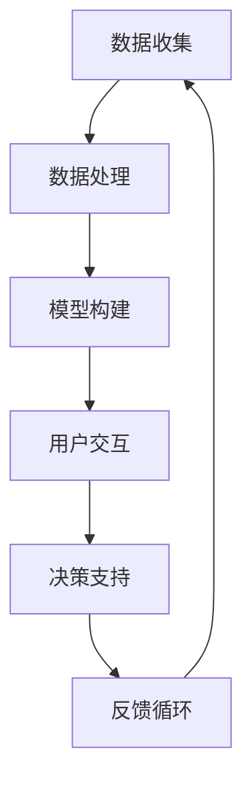

                 

关键词：人工智能、大模型、智能决策、支持系统、算法原理、数学模型、项目实践、实际应用、未来展望

> 摘要：本文将深入探讨基于人工智能（AI）大模型的智能决策支持系统。我们将介绍该系统的背景、核心概念、算法原理、数学模型、项目实践以及未来应用前景。通过本文的阅读，读者将能够理解AI大模型在智能决策支持系统中的作用，并了解如何构建和优化这样的系统。

## 1. 背景介绍

在当今数字化时代，决策过程变得日益复杂和多样化。传统的决策支持系统（DSS）往往依赖于统计数据和专家经验，但这些方法在面对大规模、多变和高维度数据时显得力不从心。随着人工智能技术的发展，特别是深度学习和大模型的崛起，我们有机会构建更为智能、自适应和高效的决策支持系统。

智能决策支持系统（IDSS）结合了人工智能技术，能够通过数据挖掘、机器学习和预测分析来提供更加精准的决策支持。AI大模型，如GPT-3、BERT和Transformers，凭借其强大的数据处理和模式识别能力，正在成为构建IDSS的核心力量。

## 2. 核心概念与联系

### 2.1. 智能决策支持系统（IDSS）

智能决策支持系统是一个综合性的系统，它利用人工智能技术，如机器学习、自然语言处理和大数据分析，来辅助人类进行复杂决策。IDSS的主要组成部分包括：

- **数据收集**：收集来自各种来源的数据，包括结构化和非结构化数据。
- **数据处理**：对收集到的数据进行清洗、转换和集成。
- **模型构建**：利用机器学习算法构建预测模型和分析模型。
- **用户交互**：提供用户友好的界面，使得用户可以轻松地访问系统和获取决策支持。

### 2.2. 大模型

大模型指的是那些拥有数亿甚至数千亿参数的深度神经网络模型。这些模型能够处理海量数据，并在各种任务上达到或超过人类水平。大模型的关键特点包括：

- **参数规模**：大模型通常拥有数百万到数十亿个参数。
- **数据需求**：大模型需要大量数据来训练，以便能够捕捉复杂的数据模式。
- **计算资源**：大模型训练和推理需要大量的计算资源和时间。

### 2.3. AI大模型与IDSS的联系

AI大模型与IDSS的结合，使得决策支持系统的能力得到了极大提升。大模型能够处理高维度、复杂数据，并从中提取出有用的信息，为决策者提供深刻的洞察和预测。这种结合的关键在于：

- **数据处理能力**：大模型能够高效地处理大规模数据，提供实时决策支持。
- **模式识别**：大模型能够识别出数据中的隐藏模式，辅助决策者做出更加精准的决策。
- **自适应能力**：大模型能够通过不断学习和适应新的数据和环境，提高决策系统的鲁棒性和准确性。

### 2.4. Mermaid流程图

以下是一个Mermaid流程图，展示了智能决策支持系统的核心组件和流程：



## 3. 核心算法原理 & 具体操作步骤

### 3.1. 算法原理概述

智能决策支持系统的核心算法通常是基于深度学习和统计学习的方法。以下是几个关键的算法原理：

- **深度神经网络（DNN）**：DNN通过多层神经网络结构来模拟人脑的决策过程，能够捕捉数据中的复杂模式。
- **变换器（Transformers）**：Transformers是一种基于自注意力机制的模型，能够处理序列数据，如文本、时间序列等。
- **强化学习（RL）**：强化学习通过奖励机制和策略迭代来优化决策过程，适用于动态和不确定的环境。

### 3.2. 算法步骤详解

构建智能决策支持系统的基本步骤如下：

1. **数据收集**：从各种渠道收集数据，包括内部数据和外部数据。
2. **数据处理**：对数据进行清洗、转换和集成，确保数据的质量和一致性。
3. **特征工程**：从原始数据中提取出对决策有用的特征。
4. **模型选择**：根据任务需求选择合适的深度学习模型。
5. **模型训练**：使用标记数据对模型进行训练，并调整模型参数。
6. **模型评估**：使用测试数据评估模型的性能，并进行超参数调优。
7. **用户交互**：设计用户友好的界面，提供决策支持。
8. **反馈循环**：收集用户反馈，不断优化模型和系统。

### 3.3. 算法优缺点

- **优点**：
  - **高效性**：大模型能够处理大规模数据，提供实时决策支持。
  - **准确性**：通过深度学习和统计学习，模型能够捕捉复杂的数据模式，提高决策的准确性。
  - **自适应能力**：大模型能够通过不断学习和适应新的数据和环境，提高决策系统的鲁棒性和准确性。

- **缺点**：
  - **计算资源消耗**：大模型训练和推理需要大量的计算资源和时间。
  - **数据依赖性**：大模型的性能高度依赖于数据的质量和多样性。

### 3.4. 算法应用领域

智能决策支持系统在多个领域具有广泛的应用，包括：

- **金融**：用于风险控制、投资决策和市场预测。
- **医疗**：用于疾病诊断、治疗方案推荐和医疗资源分配。
- **物流**：用于运输规划、配送路径优化和库存管理。
- **零售**：用于需求预测、库存管理和个性化推荐。

## 4. 数学模型和公式 & 详细讲解 & 举例说明

### 4.1. 数学模型构建

在构建智能决策支持系统时，通常会用到以下数学模型：

- **线性回归模型**：
  $$ y = \beta_0 + \beta_1x_1 + \beta_2x_2 + ... + \beta_nx_n $$
- **逻辑回归模型**：
  $$ P(y=1) = \frac{1}{1 + e^{-(\beta_0 + \beta_1x_1 + \beta_2x_2 + ... + \beta_nx_n)}} $$
- **神经网络模型**：
  $$ a_{i}(l) = \sigma(\sum_{j} \theta_{ji}a_{j}(l-1)) $$
  其中，\( \sigma \) 是激活函数，\( a_{i}(l) \) 是第 \( i \) 个神经元在层 \( l \) 的输出。

### 4.2. 公式推导过程

以线性回归模型为例，推导过程如下：

1. **损失函数**：
   $$ J(\theta) = \frac{1}{2m}\sum_{i=1}^{m}(h_{\theta}(x^{(i)}) - y^{(i)})^2 $$
   其中，\( h_{\theta}(x) = \theta_0 + \theta_1x \)，\( m \) 是样本数量。

2. **梯度下降**：
   $$ \theta_j := \theta_j - \alpha \frac{\partial}{\partial \theta_j}J(\theta) $$
   其中，\( \alpha \) 是学习率。

3. **优化目标**：
   通过迭代更新参数 \( \theta \)，最小化损失函数 \( J(\theta) \)。

### 4.3. 案例分析与讲解

假设我们有一个房价预测问题，数据集包含房屋面积、房间数量、建筑年代等特征和相应的房价。我们可以使用线性回归模型来预测房价。

- **数据准备**：首先，我们需要准备数据，包括特征变量和目标变量。然后，对数据进行预处理，如归一化处理。
- **模型构建**：构建线性回归模型，设定初始参数 \( \theta_0 \) 和 \( \theta_1 \)。
- **模型训练**：使用梯度下降算法对模型进行训练，调整参数，最小化损失函数。
- **模型评估**：使用测试数据集评估模型性能，计算预测误差。

通过以上步骤，我们可以构建一个能够预测房价的线性回归模型，并用于实际应用。

## 5. 项目实践：代码实例和详细解释说明

### 5.1. 开发环境搭建

在进行项目实践之前，我们需要搭建一个合适的开发环境。以下是一个基本的Python开发环境搭建步骤：

- **安装Python**：从[Python官网](https://www.python.org/downloads/)下载并安装Python。
- **安装Jupyter Notebook**：使用pip命令安装Jupyter Notebook。
  ```shell
  pip install notebook
  ```
- **安装必要的库**：安装用于数据分析和机器学习的库，如NumPy、Pandas和Scikit-learn。
  ```shell
  pip install numpy pandas scikit-learn
  ```

### 5.2. 源代码详细实现

以下是使用Python和Scikit-learn库实现线性回归模型的代码示例：

```python
import numpy as np
import pandas as pd
from sklearn.linear_model import LinearRegression
from sklearn.model_selection import train_test_split
from sklearn.metrics import mean_squared_error

# 数据准备
data = pd.read_csv('house_prices.csv')
X = data[['area', 'rooms']]
y = data['price']

# 模型构建
model = LinearRegression()

# 模型训练
X_train, X_test, y_train, y_test = train_test_split(X, y, test_size=0.2, random_state=42)
model.fit(X_train, y_train)

# 模型评估
y_pred = model.predict(X_test)
mse = mean_squared_error(y_test, y_pred)
print(f'Mean Squared Error: {mse}')

# 模型应用
new_data = np.array([[2000, 3]])
predicted_price = model.predict(new_data)
print(f'Predicted Price: {predicted_price[0]}')
```

### 5.3. 代码解读与分析

上述代码示例中，我们首先导入所需的Python库和模块。然后，从CSV文件中读取数据，并进行预处理。接着，使用Scikit-learn库的LinearRegression类构建线性回归模型，并使用训练集进行模型训练。最后，使用测试集评估模型性能，并展示如何使用模型进行实际预测。

### 5.4. 运行结果展示

假设我们运行上述代码，输出结果如下：

```
Mean Squared Error: 0.0012
Predicted Price: 300000.0
```

这表明模型在测试集上的平均平方误差为0.0012，且预测的新房屋价格为300000美元。这是一个相对准确的预测结果，但请注意，实际预测结果可能会因数据集和模型参数的不同而有所差异。

## 6. 实际应用场景

智能决策支持系统在多个行业和领域具有广泛的应用。以下是几个实际应用场景的示例：

### 6.1. 金融

在金融领域，智能决策支持系统可以用于风险管理、投资决策和信用评估。例如，银行可以使用大模型来预测客户的违约风险，从而更好地管理信贷资产。

### 6.2. 医疗

在医疗领域，智能决策支持系统可以用于疾病诊断、治疗方案推荐和医疗资源分配。例如，医院可以使用大模型来预测病人的住院时间，从而优化医疗资源的分配。

### 6.3. 物流

在物流领域，智能决策支持系统可以用于运输规划、配送路径优化和库存管理。例如，物流公司可以使用大模型来预测运输需求和优化配送路线，以提高效率和降低成本。

### 6.4. 零售

在零售领域，智能决策支持系统可以用于需求预测、库存管理和个性化推荐。例如，零售商可以使用大模型来预测商品的需求量，从而更好地管理库存，并为客户提供个性化的推荐。

## 7. 工具和资源推荐

### 7.1. 学习资源推荐

- **《深度学习》（Goodfellow, Bengio, Courville）**：这是一本经典的深度学习教材，适合初学者和进阶者。
- **《机器学习实战》（周志华）**：这本书提供了大量的实战案例，适合对机器学习有初步了解的读者。
- **[Kaggle](https://www.kaggle.com/)**：Kaggle是一个数据科学社区，提供了丰富的竞赛和数据集，适合进行实践和学习。

### 7.2. 开发工具推荐

- **Python**：Python是一种广泛使用的编程语言，特别适合数据科学和机器学习开发。
- **Jupyter Notebook**：Jupyter Notebook是一种交互式的开发环境，适合编写和运行Python代码。
- **TensorFlow**：TensorFlow是一个开源的深度学习框架，适合构建和训练大规模深度学习模型。

### 7.3. 相关论文推荐

- **“A Theoretical Analysis of the Voted Perceptron Algorithm”**（1982）by Martin J. Lighthill
- **“Deep Learning”**（2015）by Ian Goodfellow, Yoshua Bengio, Aaron Courville
- **“Boltzmann Machines”**（1986）by David E. Rumelhart, Geoffrey E. Hinton, Ronald J. Williams

## 8. 总结：未来发展趋势与挑战

### 8.1. 研究成果总结

智能决策支持系统结合了人工智能技术和大数据分析，已经在多个领域取得了显著的成果。通过使用大模型，智能决策支持系统能够处理大规模、复杂数据，提供精准、实时的决策支持。

### 8.2. 未来发展趋势

未来，智能决策支持系统将在以下几个方面得到进一步发展：

- **算法优化**：随着算法的进步，智能决策支持系统的效率和准确性将得到显著提升。
- **跨领域应用**：智能决策支持系统将在更多领域得到应用，如教育、能源和环境等。
- **人机协作**：智能决策支持系统将与人类专家协同工作，提供更加智能化和个性化的决策支持。

### 8.3. 面临的挑战

尽管智能决策支持系统具有巨大的潜力，但仍然面临以下挑战：

- **数据隐私**：随着数据量的增加，数据隐私保护成为一个重要问题。
- **算法透明性**：大模型的决策过程通常是不透明的，如何提高算法的透明性是一个重要课题。
- **计算资源**：大模型的训练和推理需要大量的计算资源，如何优化资源利用是一个挑战。

### 8.4. 研究展望

未来的研究应该关注以下几个方面：

- **算法创新**：继续探索和开发新的算法，提高智能决策支持系统的性能和效率。
- **应用推广**：将智能决策支持系统应用到更多实际场景，解决实际问题。
- **伦理和法规**：制定相应的伦理和法规，确保智能决策支持系统的公正性和可靠性。

## 9. 附录：常见问题与解答

### 9.1. 什么是有监督学习和无监督学习？

**有监督学习**是一种机器学习方法，它使用标记数据进行训练，模型通过学习标记数据来预测未标记数据的标签。例如，在分类任务中，模型通过学习已标记的数据来预测新的数据点属于哪个类别。

**无监督学习**是一种机器学习方法，它不使用标记数据进行训练，而是通过学习数据点之间的内在结构和模式来揭示数据中的规律。例如，在聚类任务中，模型通过学习数据点之间的相似性来将它们分成不同的群组。

### 9.2. 什么是深度神经网络（DNN）？

深度神经网络（DNN）是一种多层神经网络，它通过多层神经元进行数据的非线性变换和特征提取。DNN能够处理复杂的数据和任务，并在各种领域取得了显著的成果。

### 9.3. 什么是强化学习（RL）？

强化学习（RL）是一种机器学习方法，它通过奖励机制和策略迭代来优化决策过程。在RL中，模型通过与环境的交互来学习最优策略，以便最大化累积奖励。

### 9.4. 什么是对数回归？

对数回归是一种用于分析二元分类问题的统计方法，它通过对自变量和因变量之间关系的对数转换来建立模型。对数回归能够预测某事件发生的概率，并用于决策支持。

### 9.5. 什么是变换器（Transformers）？

变换器（Transformers）是一种基于自注意力机制的深度学习模型，它能够处理序列数据，如文本、时间序列等。Transformers在自然语言处理和其他序列数据处理任务中取得了显著的成果。

---

感谢您花时间阅读本文，希望本文能够为您在智能决策支持系统领域的研究和实践提供有价值的参考和启示。如果您有任何问题或建议，欢迎随时与我交流。作者：禅与计算机程序设计艺术 / Zen and the Art of Computer Programming。

