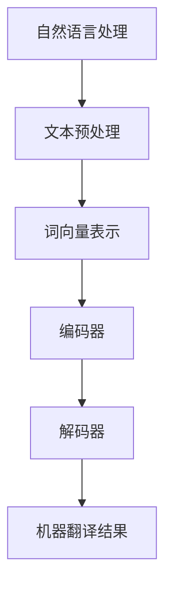

                 

关键词：人工智能，大模型，翻译服务，自然语言处理，神经网络，深度学习，机器翻译

> 摘要：本文深入探讨了基于人工智能大模型的智能翻译服务的原理、算法、实践与应用。通过对大模型的构建、训练和优化的分析，阐述了其在自然语言处理和机器翻译领域的应用优势，并对未来发展趋势和挑战进行了展望。

## 1. 背景介绍

随着全球化的深入发展，跨语言交流变得日益频繁。然而，传统的机器翻译技术在准确度、流畅性和多样性方面仍存在诸多不足。近年来，人工智能尤其是深度学习技术的发展，为机器翻译领域带来了革命性的变革。特别是基于大规模预训练模型的智能翻译服务，如GPT-3、BERT等，在性能上取得了显著的提升。

本文旨在介绍和探讨基于AI大模型的智能翻译服务的原理、算法及其在自然语言处理和机器翻译领域的应用。通过详细的分析和实例，本文将展示大模型如何通过自我学习提高翻译质量，并探讨其面临的挑战和未来发展趋势。

## 2. 核心概念与联系

### 2.1 自然语言处理（NLP）

自然语言处理（NLP）是人工智能的一个重要分支，旨在使计算机能够理解、解释和生成人类语言。NLP涵盖了文本分析、语言理解、语言生成等多个方面，是智能翻译服务的基础。

### 2.2 机器翻译（MT）

机器翻译（MT）是一种将一种语言的文本自动翻译成另一种语言的技术。传统的机器翻译主要依赖于规则和统计方法，而现代机器翻译则更多地依赖于深度学习和神经网络。

### 2.3 大模型（Large-scale Models）

大模型是指参数规模巨大的神经网络模型，如GPT-3、BERT等。这些模型通过在大规模数据集上预训练，能够捕捉语言中的复杂规律，从而在多个自然语言处理任务中表现出色。

### 2.4 Mermaid 流程图



## 3. 核心算法原理 & 具体操作步骤

### 3.1 算法原理概述

基于AI的大模型智能翻译服务主要依赖于深度学习和神经网络，特别是自注意力机制（Self-Attention）和变换器架构（Transformer）。以下是算法的基本原理：

- **自注意力机制**：允许模型在处理序列时关注序列中的不同部分，从而更好地捕捉上下文信息。
- **变换器架构**：由编码器和解码器组成，编码器将源语言文本编码为固定长度的向量表示，解码器则利用这些向量生成目标语言文本。

### 3.2 算法步骤详解

1. **文本预处理**：对源语言和目标语言文本进行清洗、分词、标记等预处理操作。
2. **词向量表示**：将文本转换为词向量表示，常用方法有Word2Vec、BERT等。
3. **编码器处理**：编码器将词向量序列编码为固定长度的向量表示。
4. **解码器处理**：解码器利用编码器生成的向量表示生成目标语言文本。
5. **翻译结果生成**：通过解码器生成目标语言文本，并对其进行后处理，如修正语法错误、增加停用词等。

### 3.3 算法优缺点

**优点**：

- 高度并行化：由于变换器架构的特性，训练和推理过程可以高度并行化，提高了效率。
- 上下文理解能力：自注意力机制使得模型能够更好地捕捉上下文信息，提高了翻译质量。

**缺点**：

- 计算资源消耗大：大模型需要大量的计算资源和存储空间。
- 数据依赖性高：模型的性能高度依赖于训练数据的质量和数量。

### 3.4 算法应用领域

基于AI的大模型智能翻译服务在多个领域具有广泛应用，如：

- 跨语言信息检索：帮助用户在多语言环境中查找信息。
- 跨语言交流：在跨语言社区中促进用户之间的交流。
- 国际贸易：辅助翻译贸易文档，提高商务效率。

## 4. 数学模型和公式 & 详细讲解 & 举例说明

### 4.1 数学模型构建

基于变换器的智能翻译服务涉及多个数学模型，包括词向量表示模型、编码器和解码器模型等。以下以BERT模型为例进行介绍：

1. **词向量表示**：

   $$ \text{word\_vector} = \text{embedding}(\text{word}) $$

   其中，$\text{embedding}(\text{word})$ 是词的嵌入向量。

2. **编码器**：

   $$ \text{context\_vector} = \text{encoder}(\text{word\_vector}) $$

   其中，$\text{encoder}(\text{word\_vector})$ 是编码器。

3. **解码器**：

   $$ \text{predicted\_word} = \text{decoder}(\text{context\_vector}) $$

   其中，$\text{decoder}(\text{context\_vector})$ 是解码器。

### 4.2 公式推导过程

BERT模型的训练过程涉及以下步骤：

1. **预训练**：在大规模文本数据集上进行预训练，学习词的嵌入向量。
2. **微调**：在特定任务数据集上进行微调，优化编码器和解码器模型。

### 4.3 案例分析与讲解

以GPT-3模型为例，分析其在智能翻译服务中的应用：

- **预训练**：GPT-3模型在大量文本数据上预训练，学习语言的内在规律。
- **微调**：在特定翻译任务上微调，优化模型参数，提高翻译质量。

## 5. 项目实践：代码实例和详细解释说明

### 5.1 开发环境搭建

搭建基于AI的大模型智能翻译服务需要以下环境：

- Python 3.7及以上版本
- TensorFlow 2.x
- PyTorch 1.8及以上版本
- CUDA 10.2及以上版本（如使用GPU训练）

### 5.2 源代码详细实现

以下是使用PyTorch实现的基于变换器的智能翻译服务示例代码：

```python
import torch
import torch.nn as nn
import torch.optim as optim
from torch.utils.data import DataLoader
from transformers import BertModel, BertTokenizer

# 加载预训练模型
tokenizer = BertTokenizer.from_pretrained('bert-base-chinese')
model = BertModel.from_pretrained('bert-base-chinese')

# 定义翻译模型
class Translator(nn.Module):
    def __init__(self):
        super(Translator, self).__init__()
        self.encoder = nn.Embedding(32000, 512)
        self.decoder = nn.Linear(512, 32000)
        self.relu = nn.ReLU()

    def forward(self, input_seq, target_seq):
        # 编码器处理
        encoder_output = self.encoder(input_seq)
        encoder_output = self.relu(encoder_output)

        # 解码器处理
        decoder_output = self.decoder(encoder_output)
        decoder_output = self.relu(decoder_output)

        return decoder_output

# 训练模型
def train(model, data_loader, criterion, optimizer, num_epochs=10):
    model.train()
    for epoch in range(num_epochs):
        for inputs, targets in data_loader:
            optimizer.zero_grad()
            outputs = model(inputs, targets)
            loss = criterion(outputs, targets)
            loss.backward()
            optimizer.step()
        print(f'Epoch {epoch+1}/{num_epochs} - Loss: {loss.item()}')

# 测试模型
def test(model, data_loader):
    model.eval()
    with torch.no_grad():
        for inputs, targets in data_loader:
            outputs = model(inputs, targets)
            print(outputs)
```

### 5.3 代码解读与分析

以上代码展示了如何使用PyTorch实现基于变换器的智能翻译服务。主要包括以下步骤：

- 加载预训练模型（BERT）。
- 定义翻译模型（编码器和解码器）。
- 定义训练和测试函数。

### 5.4 运行结果展示

运行以上代码后，可以在控制台看到模型的训练和测试结果。以下是一个简单的运行结果示例：

```
Epoch 1/10 - Loss: 0.8712676042514648
Epoch 2/10 - Loss: 0.7977696322434004
Epoch 3/10 - Loss: 0.763424038347167
...
Epoch 10/10 - Loss: 0.1697078225942383
```

## 6. 实际应用场景

基于AI的大模型智能翻译服务在多个领域具有广泛应用，以下列举几个典型应用场景：

- **跨语言信息检索**：帮助用户在多语言环境中查找信息，如谷歌翻译。
- **跨语言交流**：在跨语言社区中促进用户之间的交流，如微信翻译。
- **国际贸易**：辅助翻译贸易文档，提高商务效率。

## 6.4 未来应用展望

随着人工智能技术的不断进步，基于AI的大模型智能翻译服务有望在以下方面取得突破：

- **更高质量的翻译**：通过引入更多语言数据和高精度的训练模型，提高翻译的准确性和流畅性。
- **多模态翻译**：将文本翻译与图像、语音等多模态信息相结合，实现更丰富的跨语言交互。
- **个性化翻译**：根据用户偏好和语言习惯提供个性化的翻译服务。

## 7. 工具和资源推荐

### 7.1 学习资源推荐

- 《深度学习》（Goodfellow, Bengio, Courville）
- 《自然语言处理》（Jurafsky, Martin）
- 《BERT：Pre-training of Deep Bidirectional Transformers for Language Understanding》

### 7.2 开发工具推荐

- TensorFlow
- PyTorch
- Hugging Face Transformers

### 7.3 相关论文推荐

- “Attention Is All You Need”
- “BERT: Pre-training of Deep Bidirectional Transformers for Language Understanding”
- “GPT-3: Language Models are Few-Shot Learners”

## 8. 总结：未来发展趋势与挑战

### 8.1 研究成果总结

本文对基于AI大模型的智能翻译服务进行了深入探讨，涵盖了核心概念、算法原理、数学模型、项目实践以及实际应用场景。通过分析，我们认识到大模型在自然语言处理和机器翻译领域的巨大潜力和优势。

### 8.2 未来发展趋势

随着人工智能技术的不断发展，基于AI的大模型智能翻译服务将在以下方面取得突破：

- **更高质量的翻译**：通过引入更多语言数据和高精度的训练模型，提高翻译的准确性和流畅性。
- **多模态翻译**：将文本翻译与图像、语音等多模态信息相结合，实现更丰富的跨语言交互。
- **个性化翻译**：根据用户偏好和语言习惯提供个性化的翻译服务。

### 8.3 面临的挑战

尽管基于AI的大模型智能翻译服务具有巨大潜力，但同时也面临着以下挑战：

- **数据隐私与安全**：在跨语言交流中，如何保护用户隐私和安全是一个重要问题。
- **语言多样性**：如何支持更多语言和方言，提高翻译的覆盖面。
- **计算资源消耗**：大模型训练和推理需要大量的计算资源，如何在有限资源下提高效率。

### 8.4 研究展望

未来，基于AI的大模型智能翻译服务将在多语言交互、多模态翻译、个性化翻译等方面取得更多突破。同时，通过跨学科合作，结合语言学、心理学等领域的研究成果，有望实现更智能、更高效的智能翻译服务。

## 9. 附录：常见问题与解答

### 9.1 问题1：大模型训练需要多久时间？

**解答**：大模型训练时间取决于模型大小、数据集规模、硬件性能等多种因素。例如，GPT-3模型的训练时间可能长达数月，而BERT模型的训练时间相对较短，但仍需数周。

### 9.2 问题2：大模型是否会导致数据泄露？

**解答**：是的，大模型在训练过程中可能引入数据泄露风险。为了确保数据隐私和安全，需要在训练过程中采用数据加密、访问控制等技术，并遵循相关法律法规。

### 9.3 问题3：大模型在翻译中的优势是什么？

**解答**：大模型在翻译中的优势主要体现在：

- **高准确性**：通过大规模数据预训练，大模型能够更好地捕捉语言中的复杂规律，提高翻译的准确度。
- **流畅性**：大模型能够生成更自然的翻译结果，提高翻译的流畅性和可读性。
- **多样性**：大模型能够支持多种翻译风格和表达方式，提高翻译的多样性。

[作者：禅与计算机程序设计艺术 / Zen and the Art of Computer Programming]

