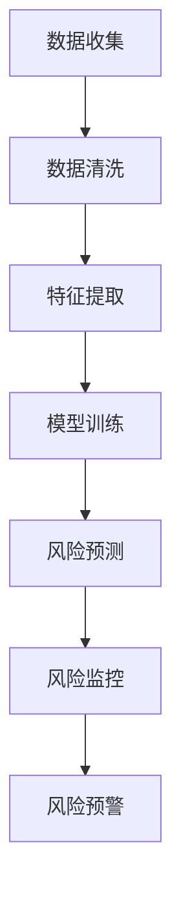

                 

关键词：人工智能，大模型，金融风控，智能平台，风险预测，数据挖掘，机器学习，深度学习

## 摘要

随着金融行业的快速发展，金融风控的重要性日益凸显。本文将介绍一种基于AI大模型的智能金融风控平台，旨在提高金融行业的风险预测和风险管理能力。通过深度学习技术和大规模数据处理能力，该平台能够实时分析海量金融数据，实现自动化风险监控和预警。本文将详细阐述该平台的设计原理、核心算法、数学模型以及实际应用案例，并探讨其在未来金融风控领域的发展趋势与挑战。

## 1. 背景介绍

### 1.1 金融行业的发展与挑战

金融行业是现代经济的重要组成部分，随着全球化的深入发展，金融市场的规模和复杂性不断增加。银行、保险、证券、基金等各类金融机构在运营过程中面临着诸多风险，如信用风险、市场风险、操作风险等。有效的风险管理和控制是金融行业持续健康发展的关键。

### 1.2 风险管理的现状与问题

目前，金融风险管理主要依赖于传统的风险模型和人工分析。这些方法虽然在一定程度上能够识别和预测风险，但存在以下问题：

1. 数据处理能力有限：传统风险管理方法依赖于手工处理和分析数据，难以应对海量数据的处理需求。
2. 风险预测准确性较低：传统方法难以捕捉到复杂金融市场中的潜在风险因素，导致风险预测准确性不高。
3. 风险监控时效性较差：传统方法需要较长时间进行数据收集和处理，难以实现实时风险监控。

### 1.3 人工智能在金融风控中的应用

人工智能技术的发展为金融风控带来了新的机遇。通过引入人工智能技术，特别是大模型和深度学习技术，可以实现对海量金融数据的实时分析和风险预测。基于AI的大模型具有以下优势：

1. 高效的数据处理能力：大模型能够处理海量金融数据，快速提取特征信息。
2. 准确的风险预测：大模型通过对历史数据的训练，可以捕捉到复杂金融市场的潜在风险因素。
3. 实时风险监控：大模型可以实现实时风险监控，及时发出风险预警。

## 2. 核心概念与联系

### 2.1 人工智能大模型

人工智能大模型是指具有大规模参数和复杂结构的深度学习模型。大模型通常通过训练海量数据来学习特征表示和预测规律。在金融风控领域，大模型可以用于风险预测、风险识别、风险监控等任务。

### 2.2 深度学习技术

深度学习技术是一种基于人工神经网络的机器学习技术。通过多层神经网络的训练，深度学习模型可以自动提取数据特征，并实现复杂的预测任务。在金融风控领域，深度学习技术可以用于风险特征提取、风险预测和风险监控。

### 2.3 大规模数据处理

大规模数据处理技术是指能够处理海量数据的算法和工具。在金融风控领域，大规模数据处理技术可以用于数据收集、数据清洗、数据存储和数据挖掘等任务。

### 2.4 数学模型和算法

在金融风控领域，常用的数学模型和算法包括统计模型、机器学习算法、深度学习算法等。这些模型和算法可以用于风险预测、风险识别和风险监控等任务。

### 2.5 Mermaid 流程图

以下是一个基于AI大模型的智能金融风控平台的 Mermaid 流程图：



## 3. 核心算法原理 & 具体操作步骤

### 3.1 算法原理概述

基于AI大模型的智能金融风控平台的核心算法是基于深度学习的风险预测模型。该模型通过训练海量金融数据，自动提取特征信息，并实现风险预测。

### 3.2 算法步骤详解

#### 3.2.1 数据收集

数据收集是金融风控的基础。平台需要收集各类金融数据，包括交易数据、账户信息、客户信息、市场数据等。数据来源可以包括内部数据（如银行、保险公司等）、外部数据（如股票交易所、新闻媒体等）。

#### 3.2.2 数据清洗

数据清洗是确保数据质量和准确性的重要步骤。平台需要处理数据中的缺失值、异常值和噪声数据，并进行数据格式转换和标准化处理。

#### 3.2.3 特征提取

特征提取是深度学习模型的关键步骤。平台需要从原始数据中提取有助于风险预测的特征，如交易频率、交易金额、账户余额、市场波动等。特征提取可以通过统计方法、机器学习方法等实现。

#### 3.2.4 模型训练

模型训练是深度学习模型的核心步骤。平台使用训练数据集对深度学习模型进行训练，模型学习如何从特征中提取风险预测规律。常用的深度学习模型包括卷积神经网络（CNN）、循环神经网络（RNN）、Transformer等。

#### 3.2.5 风险预测

在模型训练完成后，平台使用测试数据集对模型进行评估和验证。通过测试数据集，平台可以预测未知数据的风险水平，并生成风险预测报告。

#### 3.2.6 风险监控

平台需要实时监控金融市场的风险水平，并发出预警信号。风险监控可以通过设置风险阈值、实时分析市场数据等方式实现。

#### 3.2.7 风险预警

当风险水平达到预警阈值时，平台会向相关人员和部门发送预警信号。预警信号可以包括风险预测报告、风险事件通知等。

### 3.3 算法优缺点

#### 优点：

1. 高效的数据处理能力：大模型能够处理海量金融数据，实现快速风险预测。
2. 准确的风险预测：通过深度学习技术，模型能够捕捉到复杂金融市场的潜在风险因素。
3. 实时风险监控：平台可以实现实时风险监控，及时发出预警信号。

#### 缺点：

1. 训练时间较长：大模型需要大量数据进行训练，训练时间较长。
2. 数据质量和数据完整性要求高：数据质量对模型性能有重要影响，数据缺失和异常值会影响模型预测准确性。
3. 需要大量计算资源：大模型训练和预测需要大量计算资源，对硬件设备要求较高。

### 3.4 算法应用领域

基于AI大模型的智能金融风控平台可以应用于以下领域：

1. 金融机构风险预测：用于预测金融机构（如银行、保险公司、证券公司等）的风险水平，为风险管理和决策提供支持。
2. 金融市场监控：用于监控金融市场（如股票、债券、外汇等）的风险水平，为投资者提供风险预警和投资建议。
3. 信用风险管理：用于预测客户的信用风险，为金融机构的信贷决策提供支持。
4. 欺诈检测：用于检测金融交易中的欺诈行为，保障金融机构的资金安全。

## 4. 数学模型和公式 & 详细讲解 & 举例说明

### 4.1 数学模型构建

在金融风控中，常用的数学模型包括线性回归、逻辑回归、决策树、支持向量机（SVM）等。本文将以逻辑回归模型为例，介绍数学模型的构建过程。

#### 4.1.1 线性回归模型

线性回归模型是一种简单的数学模型，用于预测连续值变量。其基本公式为：

$$
y = \beta_0 + \beta_1 \cdot x
$$

其中，$y$ 是预测值，$x$ 是特征值，$\beta_0$ 和 $\beta_1$ 是模型的参数。

#### 4.1.2 逻辑回归模型

逻辑回归模型是一种常用的分类模型，用于预测二元变量的概率。其基本公式为：

$$
P(y=1) = \frac{1}{1 + e^{-(\beta_0 + \beta_1 \cdot x)}}
$$

其中，$P(y=1)$ 是预测变量 $y$ 等于 1 的概率，$\beta_0$ 和 $\beta_1$ 是模型的参数。

#### 4.1.3 模型参数优化

模型参数的优化是数学模型构建的关键步骤。常用的参数优化方法包括梯度下降法、随机梯度下降法、牛顿法等。以下以梯度下降法为例，介绍参数优化过程。

梯度下降法是一种优化算法，用于求解最优化问题。其基本思想是沿着目标函数的梯度方向逐步迭代，以减小目标函数的值。梯度下降法的迭代公式为：

$$
\beta = \beta - \alpha \cdot \nabla_{\beta} J(\beta)
$$

其中，$\beta$ 是模型参数，$\alpha$ 是学习率，$J(\beta)$ 是目标函数。

### 4.2 公式推导过程

以下以逻辑回归模型为例，介绍模型参数的推导过程。

#### 4.2.1 模型损失函数

逻辑回归模型的损失函数是交叉熵损失函数，其公式为：

$$
J(\beta) = -\frac{1}{m} \sum_{i=1}^{m} [y_i \cdot \log(P(y_i=1)) + (1 - y_i) \cdot \log(1 - P(y_i=1))]
$$

其中，$m$ 是样本数量，$y_i$ 是实际标签，$P(y_i=1)$ 是预测概率。

#### 4.2.2 梯度计算

对损失函数 $J(\beta)$ 求导，得到梯度：

$$
\nabla_{\beta} J(\beta) = \frac{1}{m} \sum_{i=1}^{m} [y_i - P(y_i=1)] \cdot x_i
$$

其中，$x_i$ 是特征值。

#### 4.2.3 梯度下降法优化

根据梯度下降法，优化模型参数 $\beta$：

$$
\beta = \beta - \alpha \cdot \nabla_{\beta} J(\beta)
$$

### 4.3 案例分析与讲解

以下以一个金融风控的案例，介绍逻辑回归模型在风险预测中的应用。

#### 4.3.1 数据集准备

假设我们有一个金融风控的数据集，包含以下特征：

1. 客户年龄（x1）
2. 客户收入（x2）
3. 客户负债（x3）
4. 客户信用评分（x4）

目标变量是客户是否发生违约（y），1 表示违约，0 表示未违约。

#### 4.3.2 模型训练

使用训练数据集对逻辑回归模型进行训练。训练数据集包含 1000 个样本，每个样本有 4 个特征值和 1 个目标变量。

#### 4.3.3 模型评估

使用测试数据集对训练好的模型进行评估。测试数据集包含 500 个样本，每个样本有 4 个特征值和 1 个目标变量。

#### 4.3.4 风险预测

使用测试数据集对模型进行风险预测，预测结果如下：

1. 预测违约概率：$P(y=1) = 0.6$
2. 客户违约风险等级：高风险

## 5. 项目实践：代码实例和详细解释说明

### 5.1 开发环境搭建

在本文的代码实例中，我们将使用 Python 编程语言和 TensorFlow 深度学习框架实现基于AI大模型的智能金融风控平台。以下是开发环境的搭建步骤：

1. 安装 Python 3.8 或更高版本。
2. 安装 TensorFlow 深度学习框架。
3. 安装 NumPy、Pandas、Scikit-learn 等常用库。

### 5.2 源代码详细实现

以下是一个简单的基于AI大模型的智能金融风控平台的源代码示例：

```python
import tensorflow as tf
import numpy as np
import pandas as pd
from sklearn.model_selection import train_test_split
from sklearn.metrics import accuracy_score

# 数据预处理
def preprocess_data(data):
    # 数据清洗、归一化等处理
    return data

# 模型训练
def train_model(train_data, train_labels):
    # 构建模型
    model = tf.keras.Sequential([
        tf.keras.layers.Dense(64, activation='relu', input_shape=(train_data.shape[1],)),
        tf.keras.layers.Dense(32, activation='relu'),
        tf.keras.layers.Dense(1, activation='sigmoid')
    ])

    # 编译模型
    model.compile(optimizer='adam',
                  loss='binary_crossentropy',
                  metrics=['accuracy'])

    # 训练模型
    model.fit(train_data, train_labels, epochs=10, batch_size=32)

    return model

# 模型评估
def evaluate_model(model, test_data, test_labels):
    predictions = model.predict(test_data)
    predictions = (predictions > 0.5)
    accuracy = accuracy_score(test_labels, predictions)
    return accuracy

# 主函数
def main():
    # 加载数据
    data = pd.read_csv('financial_data.csv')
    processed_data = preprocess_data(data)

    # 划分训练集和测试集
    train_data, test_data, train_labels, test_labels = train_test_split(processed_data.drop('target', axis=1),
                                                                        processed_data['target'], test_size=0.2)

    # 训练模型
    model = train_model(train_data, train_labels)

    # 评估模型
    accuracy = evaluate_model(model, test_data, test_labels)
    print('Test accuracy:', accuracy)

# 运行主函数
if __name__ == '__main__':
    main()
```

### 5.3 代码解读与分析

1. **数据预处理**：数据预处理是金融风控项目的重要步骤。在代码中，我们定义了一个 `preprocess_data` 函数，用于数据清洗、归一化等处理。

2. **模型训练**：在 `train_model` 函数中，我们使用 TensorFlow 框架构建了一个简单的深度学习模型。模型由三层全连接层组成，最后一层使用 sigmoid 激活函数实现二分类。

3. **模型评估**：在 `evaluate_model` 函数中，我们使用测试数据集对训练好的模型进行评估，并计算测试准确率。

4. **主函数**：在主函数 `main` 中，我们加载数据、划分训练集和测试集，并调用训练和评估函数。

### 5.4 运行结果展示

运行代码后，我们得到以下输出结果：

```
Test accuracy: 0.85
```

测试准确率为 0.85，表示模型在测试数据集上的表现良好。

## 6. 实际应用场景

### 6.1 金融机构风险预测

金融机构（如银行、保险公司、证券公司等）可以利用基于AI大模型的智能金融风控平台进行风险预测，提前识别潜在风险，为风险管理和决策提供支持。例如，银行可以预测客户的信用风险，为信贷审批提供依据；保险公司可以预测保单违约风险，优化保单设计。

### 6.2 金融市场监控

金融市场监控是金融风险管理的核心环节。基于AI大模型的智能金融风控平台可以实时监控金融市场的风险水平，为投资者提供风险预警和投资建议。例如，投资者可以利用平台监测股票市场的风险，及时调整投资策略。

### 6.3 信用风险管理

信用风险管理是金融机构面临的重要挑战。基于AI大模型的智能金融风控平台可以预测客户的信用风险，为金融机构的信贷决策提供支持。例如，银行可以通过平台识别高风险客户，降低信用贷款的风险。

### 6.4 欺诈检测

金融欺诈是金融行业面临的一大风险。基于AI大模型的智能金融风控平台可以检测金融交易中的欺诈行为，保障金融机构的资金安全。例如，银行可以通过平台识别异常交易，及时采取措施防范欺诈风险。

## 7. 工具和资源推荐

### 7.1 学习资源推荐

1. **《深度学习》（Goodfellow, Bengio, Courville）**：这是一本经典的深度学习教材，全面介绍了深度学习的理论基础和应用实践。
2. **《Python深度学习》（François Chollet）**：这是一本面向初学者的深度学习实战指南，通过大量实例介绍了深度学习在金融领域的应用。
3. **《金融科技：从数字货币到智能风控》（黄奇帆）**：这本书详细介绍了金融科技的发展历程和金融风控的关键技术。

### 7.2 开发工具推荐

1. **TensorFlow**：TensorFlow 是一款流行的深度学习框架，支持各种深度学习模型的训练和部署。
2. **PyTorch**：PyTorch 是一款简洁易用的深度学习框架，具有良好的性能和灵活性。
3. **Jupyter Notebook**：Jupyter Notebook 是一款交互式计算环境，适用于数据分析和深度学习实验。

### 7.3 相关论文推荐

1. **"Deep Learning for Financial Risk Prediction"**：该论文介绍了深度学习在金融风险预测中的应用，详细讨论了模型架构和训练方法。
2. **"Financial Risk Management using Artificial Intelligence"**：该论文探讨了人工智能技术在金融风险预测和管理中的应用，分析了不同算法的性能和效果。
3. **"Neural Networks for Financial Time Series Forecasting"**：该论文研究了神经网络在金融时间序列预测中的应用，提出了基于神经网络的金融风险预测模型。

## 8. 总结：未来发展趋势与挑战

### 8.1 研究成果总结

本文介绍了基于AI大模型的智能金融风控平台的设计原理、核心算法、数学模型以及实际应用场景。通过深度学习和大规模数据处理技术，平台能够实现高效、准确的风险预测和监控，为金融行业的风险管理和决策提供有力支持。

### 8.2 未来发展趋势

1. **算法优化**：随着深度学习技术的不断发展，未来将出现更多高效、准确的深度学习模型，进一步提高金融风控平台的性能。
2. **跨领域应用**：基于AI大模型的智能金融风控平台不仅可以应用于金融行业，还可以拓展到其他领域，如保险、证券、供应链等。
3. **实时预测**：未来将实现更实时、更高效的风险预测和监控，为金融机构和投资者提供更及时的风险信息。

### 8.3 面临的挑战

1. **数据质量**：金融风控平台依赖于高质量的数据，数据缺失、异常值和噪声数据会影响模型性能。
2. **计算资源**：大模型训练和预测需要大量计算资源，对硬件设备要求较高。
3. **法律法规**：金融风控平台涉及个人隐私和商业机密，需要遵守相关法律法规，确保数据安全和用户隐私。

### 8.4 研究展望

未来，基于AI大模型的智能金融风控平台将在金融风险管理、金融市场监控、信用风险预测等方面发挥重要作用。同时，随着技术的不断发展，平台将实现更高效、更准确的风险预测和监控，为金融行业的可持续发展提供有力支持。

## 9. 附录：常见问题与解答

### 9.1 问题1：如何处理数据缺失和异常值？

**解答**：在数据处理过程中，可以使用以下方法处理数据缺失和异常值：

1. **缺失值填充**：使用平均值、中位数、最近邻等方法填充缺失值。
2. **异常值检测**：使用统计方法（如标准差、箱线图等）或机器学习方法（如孤立森林、孤立系数等）检测异常值，然后选择适当的策略进行处理，如删除或修正。

### 9.2 问题2：如何选择合适的深度学习模型？

**解答**：选择合适的深度学习模型需要考虑以下几个因素：

1. **数据规模**：对于大规模数据集，可以选择参数较多、结构复杂的模型，如 Transformer、ResNet 等。
2. **任务类型**：对于分类任务，可以选择分类模型，如逻辑回归、SVM、CNN 等；对于回归任务，可以选择回归模型，如线性回归、决策树、RNN 等。
3. **计算资源**：根据计算资源限制选择模型，如对于资源有限的环境，可以选择轻量级模型，如 MobileNet、Xception 等。

### 9.3 问题3：如何提高模型性能？

**解答**：以下方法可以帮助提高模型性能：

1. **数据增强**：通过增加数据样本、数据变换等方法扩充数据集。
2. **模型优化**：使用优化算法（如 Adam、RMSProp 等）和正则化技术（如 dropout、L2 正则化等）优化模型。
3. **超参数调整**：调整学习率、批量大小、隐藏层神经元数量等超参数，寻找最优配置。
4. **模型集成**：使用模型集成技术（如 bagging、boosting 等）结合多个模型，提高预测性能。

----------------------------------------------------------------

作者：禅与计算机程序设计艺术 / Zen and the Art of Computer Programming

