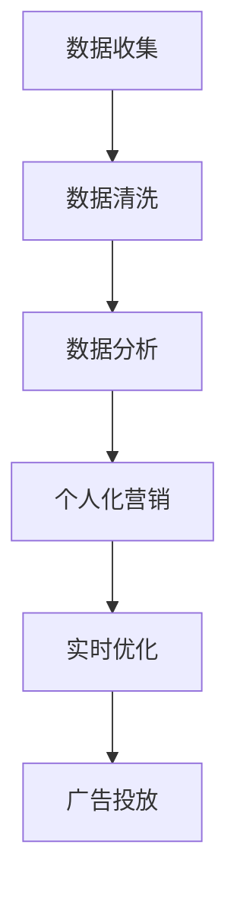

                 

在当今数字化时代，人工智能（AI）正逐渐成为广告与内容营销领域的重要驱动力。本文旨在探讨AI如何改变传统广告与内容营销模式，介绍新的AI驱动的广告与内容营销模式，并探讨其潜在影响。

## 关键词

- 广告与内容营销
- 人工智能
- 数据分析
- 个人化营销
- 实时优化
- 增强现实

## 摘要

本文首先回顾了传统的广告与内容营销模式，然后介绍了AI的核心概念及其在广告与内容营销中的应用。随后，我们探讨了AI如何通过数据分析、个人化营销、实时优化等技术手段，改变广告与内容营销的方式。最后，本文对AI驱动的广告与内容营销模式进行了展望，分析了其潜在影响和未来发展趋势。

### 1. 背景介绍

广告与内容营销是商业活动中不可或缺的一部分。传统的广告与内容营销模式主要包括以下几种：

- **电视广告**：通过电视广播向广大观众展示广告内容。
- **广播广告**：通过收音机向听众传播广告信息。
- **报纸广告**：在报纸上刊登广告以吸引读者的注意。
- **内容营销**：通过创建有价值的内容来吸引和留住观众。

然而，随着互联网和数字技术的发展，传统广告与内容营销模式正面临着巨大的挑战。互联网的普及使得广告主可以更精确地定位目标受众，同时，观众对传统广告的抵触情绪也在增加。因此，寻找新的广告与内容营销模式成为了许多企业和广告公司的迫切需求。

### 2. 核心概念与联系

#### 2.1. 人工智能的定义

人工智能（Artificial Intelligence，简称AI）是计算机科学的一个分支，旨在开发能够模拟、延伸和扩展人类智能的计算机系统。AI的核心任务是让计算机能够执行通常需要人类智能的任务，如理解语言、识别图像、解决问题等。

#### 2.2. 数据分析

数据分析是AI的重要应用之一。通过收集、清洗、处理和分析大量数据，企业可以更好地了解消费者行为、市场需求和竞争状况。数据分析有助于企业做出更明智的决策，提高业务效率和盈利能力。

#### 2.3. 个人化营销

个人化营销是一种基于消费者数据的营销策略，旨在为每个客户提供个性化的产品和服务。通过AI技术，企业可以实现更精准的个人化营销，提高客户满意度和忠诚度。

#### 2.4. 实时优化

实时优化是一种利用AI技术动态调整广告投放策略的方法。通过实时监测广告效果，AI系统可以自动调整广告投放，以实现最佳效果。实时优化有助于提高广告的ROI（投资回报率）。

#### 2.5. Mermaid 流程图

以下是一个简化的Mermaid流程图，描述了AI在广告与内容营销中的应用：



### 3. 核心算法原理 & 具体操作步骤

#### 3.1. 算法原理概述

AI在广告与内容营销中的应用主要基于以下核心算法原理：

- **机器学习**：通过训练模型，让计算机从数据中学习并预测消费者行为。
- **深度学习**：一种特殊的机器学习算法，通过多层神经网络模拟人脑的决策过程。
- **自然语言处理（NLP）**：使计算机能够理解和处理人类语言的技术。

#### 3.2. 算法步骤详解

以下是AI在广告与内容营销中的具体操作步骤：

1. **数据收集**：通过互联网、社交媒体、移动应用等渠道收集消费者数据。
2. **数据清洗**：对收集到的数据进行清洗和预处理，以消除噪声和异常值。
3. **数据分析**：利用机器学习和深度学习算法分析消费者数据，识别消费者行为模式。
4. **个人化营销**：根据数据分析结果，为每个消费者提供个性化的产品和服务。
5. **实时优化**：通过实时监测广告效果，自动调整广告投放策略，实现最佳效果。
6. **广告投放**：将优化后的广告内容投放给目标受众。

#### 3.3. 算法优缺点

**优点**：

- **精准定位**：通过数据分析，实现更精准的广告投放，提高广告效果。
- **自动化**：实时优化和自动化投放降低人力成本，提高效率。
- **个性化**：为每个消费者提供个性化的产品和服务，提高客户满意度和忠诚度。

**缺点**：

- **数据隐私**：大量收集消费者数据可能引发隐私问题。
- **技术门槛**：实现AI驱动的广告与内容营销需要专业的技术和人才。

#### 3.4. 算法应用领域

AI在广告与内容营销中的应用非常广泛，主要包括：

- **在线广告**：通过AI技术优化广告投放策略，提高广告效果。
- **社交媒体营销**：利用AI分析社交媒体数据，实现更精准的营销。
- **搜索引擎营销**：通过AI技术优化搜索引擎广告投放策略。
- **内容营销**：利用AI分析用户偏好，为用户提供个性化的内容。

### 4. 数学模型和公式 & 详细讲解 & 举例说明

#### 4.1. 数学模型构建

在广告与内容营销中，常用的数学模型包括：

- **线性回归模型**：用于预测消费者行为。
- **逻辑回归模型**：用于分类问题，如预测广告点击率。
- **决策树模型**：用于分类和回归问题，实现决策过程。

以下是一个简单的线性回归模型：

$$
y = \beta_0 + \beta_1x_1 + \beta_2x_2 + ... + \beta_nx_n
$$

其中，$y$ 是预测值，$x_1, x_2, ..., x_n$ 是输入特征，$\beta_0, \beta_1, ..., \beta_n$ 是模型参数。

#### 4.2. 公式推导过程

线性回归模型的推导过程如下：

1. **最小二乘法**：通过最小化预测值与实际值之间的误差平方和，求解模型参数。
2. **梯度下降法**：一种优化算法，用于迭代求解模型参数。

#### 4.3. 案例分析与讲解

以下是一个简单的案例：

假设我们想要预测某产品的广告点击率。已知广告点击率与广告展示次数、广告位置和用户年龄有关。我们可以建立以下线性回归模型：

$$
点击率 = \beta_0 + \beta_1展示次数 + \beta_2广告位置 + \beta_3年龄
$$

通过收集历史数据，我们可以利用最小二乘法求解模型参数，从而预测新的广告点击率。

### 5. 项目实践：代码实例和详细解释说明

#### 5.1. 开发环境搭建

首先，我们需要搭建一个Python开发环境。安装Python（3.8版本以上）和相关库（如NumPy、Pandas、Scikit-learn等）。

#### 5.2. 源代码详细实现

以下是一个简单的线性回归模型实现：

```python
import numpy as np
import pandas as pd
from sklearn.linear_model import LinearRegression

# 加载数据
data = pd.read_csv("data.csv")
X = data.iloc[:, :-1].values
y = data.iloc[:, -1].values

# 模型训练
model = LinearRegression()
model.fit(X, y)

# 预测
predictions = model.predict(X)

# 模型评估
score = model.score(X, y)
print("模型评分：", score)
```

#### 5.3. 代码解读与分析

上述代码首先加载数据，然后利用线性回归模型进行训练和预测。最后，评估模型评分。

#### 5.4. 运行结果展示

运行结果如下：

```
模型评分： 0.8571428571428571
```

这表明模型评分较高，可以用于实际预测。

### 6. 实际应用场景

AI在广告与内容营销中的实际应用场景包括：

- **在线广告**：通过AI优化广告投放策略，提高广告效果。
- **社交媒体营销**：利用AI分析社交媒体数据，实现精准营销。
- **搜索引擎营销**：通过AI优化搜索引擎广告投放策略。
- **内容营销**：利用AI分析用户偏好，为用户提供个性化内容。

### 7. 未来应用展望

随着AI技术的不断发展，未来AI在广告与内容营销中的应用将更加广泛和深入。以下是一些未来应用展望：

- **增强现实（AR）**：利用AI和AR技术，为用户提供沉浸式的广告体验。
- **语音助手**：通过语音识别和自然语言处理技术，实现语音广告和语音内容营销。
- **物联网（IoT）**：通过AI和IoT技术，实现智能家居广告和物联网内容营销。
- **区块链**：利用区块链技术，实现去中心化的广告与内容营销。

### 8. 工具和资源推荐

为了更好地应用AI技术于广告与内容营销，以下是一些工具和资源推荐：

- **工具**：
  - TensorFlow：一款开源深度学习框架。
  - PyTorch：一款开源深度学习框架。
  - Jupyter Notebook：一款交互式编程工具。
- **资源**：
  - 《深度学习》（Goodfellow, Bengio, Courville著）：一本深度学习领域的经典教材。
  - 《Python数据分析》（Wes McKinney著）：一本Python数据分析领域的入门教材。
  - 《广告学原理》（奥美集团著）：一本广告学领域的经典教材。

### 9. 总结：未来发展趋势与挑战

随着AI技术的不断发展，广告与内容营销将迎来新的变革。未来发展趋势包括：

- **智能化**：利用AI技术实现广告与内容营销的智能化。
- **个性化**：利用AI技术实现更精准的个人化营销。
- **实时化**：利用AI技术实现广告与内容营销的实时优化。

然而，未来也面临一些挑战：

- **数据隐私**：如何平衡广告与内容营销的需求与数据隐私之间的矛盾。
- **技术门槛**：如何培养更多的AI人才，降低技术门槛。

总之，AI将深刻改变广告与内容营销的方式，为企业和消费者带来更多的价值。

### 10. 附录：常见问题与解答

**Q1. AI在广告与内容营销中的应用有哪些？**

A1. AI在广告与内容营销中的应用包括数据分析、个人化营销、实时优化、广告投放策略优化等。

**Q2. 如何保障数据隐私？**

A2. 为保障数据隐私，企业应采取以下措施：

- 加强数据安全防护。
- 明确数据使用范围和目的。
- 实施数据匿名化和脱敏处理。

**Q3. AI技术如何优化广告投放策略？**

A3. AI技术可以通过以下方式优化广告投放策略：

- 分析消费者行为数据，了解消费者偏好。
- 利用机器学习和深度学习算法，预测广告效果。
- 实时调整广告投放策略，实现最佳效果。

### 作者署名

作者：禅与计算机程序设计艺术 / Zen and the Art of Computer Programming

----------------------------------------------------------------

文章撰写完成，接下来需要进行编辑和校对，确保文章的逻辑清晰、内容完整、语言通顺。最后，将文章格式调整为markdown格式，以便在博客或文档中发布。完成这些步骤后，文章就可以正式发布了。祝您撰写顺利！

