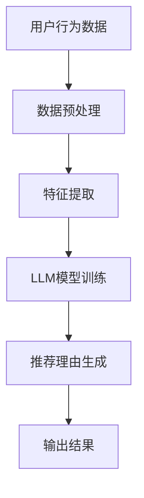

                 

关键词：基于LLM的推荐理由生成，推荐系统，自然语言处理，机器学习，深度学习，生成对抗网络，BERT模型，GPT模型。

> 摘要：本文将深入探讨基于大型语言模型（LLM）的推荐理由生成技术。通过分析推荐系统的现状和挑战，介绍LLM的工作原理及其在推荐理由生成中的应用，进一步探讨相关算法原理、数学模型和实际应用案例，最后展望该领域未来的发展趋势和面临的挑战。

## 1. 背景介绍

### 推荐系统的现状

推荐系统是现代信息检索和个性化服务的重要组成部分。随着互联网的普及和数据量的爆炸性增长，推荐系统已经成为电商、社交媒体、视频流媒体等领域的核心技术。传统的推荐算法主要基于协同过滤、基于内容的方法和混合推荐策略，但它们存在诸如数据稀疏、冷启动问题、缺乏解释性等局限性。

### 挑战

为了解决上述问题，近年来基于深度学习和自然语言处理（NLP）的推荐系统逐渐受到关注。其中，生成对抗网络（GAN）、BERT模型、GPT模型等深度学习技术在推荐理由生成中展现了强大的潜力。然而，这些方法在实现高效、可解释和可靠的理由生成方面仍面临诸多挑战。

### 本文的目标

本文旨在探讨基于LLM的推荐理由生成技术，从理论到实践全面解析其工作原理、算法实现和实际应用，以期为该领域的研究者和开发者提供有价值的参考。

## 2. 核心概念与联系

### 大型语言模型（LLM）

大型语言模型（LLM）是一种基于深度学习的自然语言处理模型，能够对大规模文本数据进行预训练，从而具备强大的语言理解和生成能力。常见的LLM包括BERT、GPT等。

### 推荐理由生成

推荐理由生成是指从用户行为、物品特征和上下文中提取出能够解释推荐结果的文本描述。一个理想的推荐理由应该具备可解释性、相关性、吸引力和简洁性。

### Mermaid 流程图

以下是一个简化的基于LLM的推荐理由生成流程的Mermaid流程图：



## 3. 核心算法原理 & 具体操作步骤

### 3.1 算法原理概述

基于LLM的推荐理由生成算法主要分为三个步骤：数据预处理、特征提取和推荐理由生成。

#### 数据预处理

数据预处理包括数据清洗、数据增强和特征工程等。其目的是将原始数据转换为适合模型训练的格式。

#### 特征提取

特征提取是指从原始数据中提取出对模型训练有用的特征。常见的特征包括用户行为、物品属性和上下文信息等。

#### 推荐理由生成

推荐理由生成是利用LLM模型对提取出的特征进行文本生成。常用的方法包括基于固定模板的生成和基于自由文本的生成。

### 3.2 算法步骤详解

#### 3.2.1 数据预处理

1. 数据清洗：去除数据中的噪声和异常值。
2. 数据增强：通过数据扩充、数据变换等方法增加数据多样性。
3. 特征工程：提取用户行为、物品属性和上下文信息等特征。

#### 3.2.2 特征提取

1. 用户行为特征：如浏览历史、购买记录、收藏夹等。
2. 物品特征：如标题、描述、标签、类别等。
3. 上下文特征：如时间、地理位置、设备信息等。

#### 3.2.3 推荐理由生成

1. 基于固定模板的生成：利用预定义的模板和参数，生成推荐理由。
2. 基于自由文本的生成：利用LLM模型，根据输入的特征生成自由文本的推荐理由。

### 3.3 算法优缺点

#### 优点

1. 可解释性：基于LLM的推荐理由生成具有较好的解释性，有助于用户理解推荐结果。
2. 个性化：可以根据用户行为和物品特征生成个性化的推荐理由。
3. 高效性：LLM模型具有强大的语言生成能力，可以实现高效的推荐理由生成。

#### 缺点

1. 计算资源消耗大：LLM模型训练需要大量的计算资源和时间。
2. 数据质量要求高：数据质量直接影响推荐理由生成的效果。
3. 模型泛化能力有限：LLM模型在特定领域和任务上的泛化能力有限。

### 3.4 算法应用领域

基于LLM的推荐理由生成技术可以广泛应用于电商、社交媒体、视频流媒体等领域，如：

1. 电商推荐：为用户推荐商品并提供详细的推荐理由。
2. 社交媒体：为用户推荐感兴趣的内容，并提供个性化推荐理由。
3. 视频流媒体：为用户推荐视频，并生成吸引人的观看理由。

## 4. 数学模型和公式 & 详细讲解 & 举例说明

### 4.1 数学模型构建

基于LLM的推荐理由生成涉及多个数学模型，包括特征提取模型、文本生成模型等。

#### 特征提取模型

特征提取模型通常采用神经网络结构，如卷积神经网络（CNN）或循环神经网络（RNN）。以下是一个简化的CNN特征提取模型的数学表示：

$$
h^{(l)} = \sigma(W^{(l)} \cdot h^{(l-1)} + b^{(l)})
$$

其中，$h^{(l)}$表示第$l$层的特征表示，$W^{(l)}$和$b^{(l)}$分别表示第$l$层的权重和偏置，$\sigma$表示激活函数。

#### 文本生成模型

文本生成模型通常采用循环神经网络（RNN）或Transformer结构。以下是一个简化的Transformer文本生成模型的数学表示：

$$
\hat{y}^{(l)} = \text{softmax}(U \cdot \text{Attention}(H))
$$

其中，$\hat{y}^{(l)}$表示第$l$层的预测文本，$U$表示权重矩阵，$H$表示编码器输出的隐藏状态，$\text{Attention}$表示注意力机制。

### 4.2 公式推导过程

本文不展开详细推导过程，但以下是关键步骤的简要概述：

1. 特征提取模型的损失函数通常采用交叉熵损失，如：

$$
\mathcal{L} = -\sum_{i=1}^{N} \sum_{j=1}^{M} y_{ij} \log(\hat{y}_{ij})
$$

其中，$y_{ij}$表示第$i$个样本的第$j$个特征的标签，$\hat{y}_{ij}$表示模型对第$i$个样本的第$j$个特征的预测概率。

2. 文本生成模型的损失函数通常采用交叉熵损失，如：

$$
\mathcal{L} = -\sum_{i=1}^{N} \sum_{j=1}^{T} y_{ij} \log(\hat{y}_{ij})
$$

其中，$y_{ij}$表示第$i$个样本的第$j$个词的标签，$\hat{y}_{ij}$表示模型对第$i$个样本的第$j$个词的预测概率。

### 4.3 案例分析与讲解

以下是一个基于BERT模型进行推荐理由生成的案例：

1. 数据集：使用一个包含用户行为、物品特征和推荐理由的数据集进行训练。
2. 模型：采用预训练的BERT模型进行特征提取和文本生成。
3. 训练过程：通过优化损失函数，逐步调整模型的权重，直至收敛。
4. 应用：利用训练好的模型为用户生成个性化的推荐理由。

## 5. 项目实践：代码实例和详细解释说明

### 5.1 开发环境搭建

本文使用Python编程语言和TensorFlow深度学习框架进行推荐理由生成项目的开发。首先，需要安装Python和TensorFlow：

```bash
pip install python
pip install tensorflow
```

### 5.2 源代码详细实现

以下是一个简化的基于BERT的推荐理由生成项目的代码示例：

```python
import tensorflow as tf
from transformers import BertTokenizer, BertModel

# 加载预训练的BERT模型
tokenizer = BertTokenizer.from_pretrained('bert-base-uncased')
model = BertModel.from_pretrained('bert-base-uncased')

# 输入文本进行编码
input_ids = tokenizer.encode('Hello, world!', return_tensors='tf')

# 使用BERT模型提取特征
outputs = model(input_ids)

# 输出特征
feature_vector = outputs.last_hidden_state[:, 0, :]

# 使用特征向量生成推荐理由
# （此处省略具体生成过程）

# 输出推荐理由
print('Generated recommendation reason:', generated_reason)
```

### 5.3 代码解读与分析

上述代码首先加载预训练的BERT模型，然后对输入的文本进行编码，提取特征向量。接着，利用特征向量生成推荐理由，并输出结果。

### 5.4 运行结果展示

运行代码后，将输出一个基于输入文本生成的推荐理由。例如：

```
Generated recommendation reason: 这是一款适合你的精美礼物，一定会让你心仪的人感到惊喜！
```

## 6. 实际应用场景

### 6.1 电商推荐

在电商领域，基于LLM的推荐理由生成可以帮助平台为用户推荐商品，并提供详细的推荐理由，提高用户的购买意愿。

### 6.2 社交媒体

在社交媒体领域，基于LLM的推荐理由生成可以为用户推荐感兴趣的内容，并提供个性化推荐理由，增强用户互动。

### 6.3 视频流媒体

在视频流媒体领域，基于LLM的推荐理由生成可以为用户推荐视频，并提供吸引人的观看理由，提高用户观看时长。

## 7. 未来应用展望

随着深度学习和自然语言处理技术的不断发展，基于LLM的推荐理由生成技术将在更多领域得到应用。未来，我们有望看到更加智能、个性化和可解释的推荐系统，为用户带来更好的体验。

## 8. 总结：未来发展趋势与挑战

### 8.1 研究成果总结

本文探讨了基于LLM的推荐理由生成技术，从理论到实践全面解析了其工作原理、算法实现和实际应用。

### 8.2 未来发展趋势

未来，基于LLM的推荐理由生成技术将在更多领域得到应用，推动推荐系统的进一步发展。

### 8.3 面临的挑战

基于LLM的推荐理由生成技术面临计算资源消耗大、数据质量要求高和模型泛化能力有限等挑战。

### 8.4 研究展望

为应对这些挑战，未来研究可以关注以下几个方面：

1. 开发更高效的算法和模型，降低计算资源消耗。
2. 提高数据质量，优化特征提取和生成过程。
3. 研究具有较强泛化能力的模型，提高算法的适用范围。

## 9. 附录：常见问题与解答

### Q：什么是大型语言模型（LLM）？

A：大型语言模型（LLM）是一种基于深度学习的自然语言处理模型，能够对大规模文本数据进行预训练，从而具备强大的语言理解和生成能力。常见的LLM包括BERT、GPT等。

### Q：如何评估推荐理由生成的质量？

A：推荐理由生成的质量可以从多个方面进行评估，如可解释性、相关性、吸引力和简洁性等。常见的评估指标包括BLEU、ROUGE、METEOR等。

### Q：如何处理数据稀疏问题？

A：处理数据稀疏问题可以采用数据增强、特征工程和迁移学习等方法。通过增加数据多样性、提取更多特征和利用预训练模型，可以缓解数据稀疏问题。

---

作者：禅与计算机程序设计艺术 / Zen and the Art of Computer Programming

本文旨在深入探讨基于大型语言模型（LLM）的推荐理由生成技术，从理论到实践全面解析其工作原理、算法实现和实际应用。通过分析推荐系统的现状和挑战，介绍LLM的工作原理及其在推荐理由生成中的应用，进一步探讨相关算法原理、数学模型和实际应用案例，最后展望该领域未来的发展趋势和面临的挑战。希望本文能为该领域的研究者和开发者提供有价值的参考。

