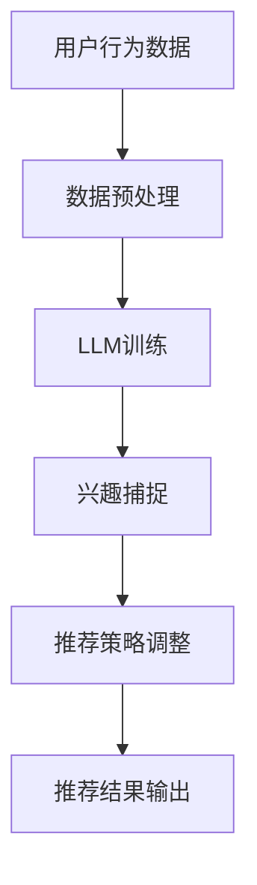

                 

关键词：推荐系统、LLM、实时兴趣捕捉、深度学习、数据挖掘、个性化推荐、用户行为分析、文本分析、机器学习、自然语言处理、AI技术

>摘要：本文将深入探讨基于大型语言模型（LLM）的推荐系统实时兴趣捕捉技术。通过分析LLM在推荐系统中的应用，以及其在实时兴趣捕捉方面的优势，本文将详细描述LLM的核心概念、算法原理、数学模型、项目实践，并探讨其在实际应用场景中的潜力。同时，本文还将推荐相关学习资源和开发工具，并对未来发展趋势与挑战进行展望。

## 1. 背景介绍

随着互联网的普及和用户数据量的爆发性增长，推荐系统已经成为各行业提高用户体验、增加用户粘性和提升转化率的重要手段。传统推荐系统主要基于用户历史行为和内容特征进行预测，但这些方法往往存在一定的滞后性和局限性。近年来，随着深度学习和自然语言处理技术的不断发展，大型语言模型（LLM）在推荐系统中的应用逐渐受到关注。

LLM是一种基于神经网络的大规模语言建模技术，它通过学习海量的文本数据，能够理解并生成自然语言。在推荐系统中，LLM不仅能够处理用户的历史行为数据，还能够理解用户的实时反馈和文本描述，从而实现更精准的兴趣捕捉和个性化推荐。本文将围绕LLM在推荐系统实时兴趣捕捉中的应用，探讨其核心概念、算法原理、数学模型和项目实践。

## 2. 核心概念与联系

### 2.1. 推荐系统

推荐系统是一种基于算法的自动化系统，旨在根据用户的历史行为、偏好和兴趣，为用户推荐相关的内容、商品或服务。推荐系统广泛应用于电子商务、社交媒体、视频流媒体、新闻推荐等多个领域。

### 2.2. 实时兴趣捕捉

实时兴趣捕捉是指系统在用户互动的过程中，实时地分析和理解用户的行为和反馈，从而动态地调整推荐策略，提高推荐的精准度和个性化程度。

### 2.3. LLM

LLM（Large Language Model）是一种基于神经网络的大规模语言建模技术，通过学习海量的文本数据，能够理解和生成自然语言。LLM具有强大的语义理解能力，能够捕捉用户的实时兴趣和需求。

### 2.4. 推荐系统与实时兴趣捕捉的关系

在推荐系统中，实时兴趣捕捉是实现个性化推荐的关键。LLM作为强大的自然语言处理工具，能够通过分析用户的实时反馈和文本描述，捕捉用户的兴趣点，从而为用户推荐更相关的内容。

### 2.5. Mermaid流程图

以下是一个描述推荐系统实时兴趣捕捉的Mermaid流程图：



## 3. 核心算法原理 & 具体操作步骤

### 3.1. 算法原理概述

基于LLM的推荐系统实时兴趣捕捉算法主要分为以下几个步骤：

1. 数据收集与预处理：收集用户的历史行为数据、文本评论等，并对数据进行清洗和预处理。
2. LLM训练：利用预处理后的数据训练LLM模型，使其能够理解用户的语义和兴趣点。
3. 兴趣捕捉：通过LLM模型分析用户的实时行为和反馈，捕捉用户的兴趣点。
4. 推荐策略调整：根据捕捉到的用户兴趣点，动态调整推荐策略。
5. 推荐结果输出：将调整后的推荐结果输出给用户。

### 3.2. 算法步骤详解

#### 3.2.1. 数据收集与预处理

数据收集与预处理是整个算法的基础。首先，需要收集用户的历史行为数据，如浏览记录、购买记录、点赞评论等。然后，对数据进行清洗，去除无效数据，如重复数据、缺失数据等。最后，对数据进行预处理，包括数据归一化、特征提取等。

#### 3.2.2. LLM训练

LLM的训练过程主要包括以下几个步骤：

1. 数据准备：将预处理后的数据分为训练集和验证集。
2. 模型选择：选择合适的神经网络结构，如GPT、BERT等。
3. 模型训练：利用训练集对模型进行训练，并通过验证集评估模型性能。
4. 模型优化：根据验证集的评估结果，调整模型参数，优化模型性能。

#### 3.2.3. 兴趣捕捉

兴趣捕捉是通过LLM模型分析用户的实时行为和反馈，捕捉用户的兴趣点。具体步骤如下：

1. 数据输入：将用户的实时行为数据输入到LLM模型中。
2. 语义分析：利用LLM模型对输入数据进行分析，提取出用户的兴趣点。
3. 兴趣点识别：根据分析结果，识别出用户的兴趣点，如关键词、主题等。

#### 3.2.4. 推荐策略调整

推荐策略调整是根据捕捉到的用户兴趣点，动态调整推荐策略。具体步骤如下：

1. 策略调整：根据用户的兴趣点，调整推荐算法的参数，如推荐权重、阈值等。
2. 策略优化：通过实验和评估，优化调整后的推荐策略。

#### 3.2.5. 推荐结果输出

推荐结果输出是将调整后的推荐结果输出给用户。具体步骤如下：

1. 推荐生成：根据调整后的推荐策略，生成推荐结果。
2. 推荐展示：将推荐结果展示给用户，如推荐页面、推送消息等。

### 3.3. 算法优缺点

#### 3.3.1. 优点

1. 高效性：LLM能够快速地处理和分析大量文本数据，提高算法的效率。
2. 精准性：LLM具有强大的语义理解能力，能够更准确地捕捉用户的兴趣点。
3. 个性化：基于用户的实时兴趣捕捉，可以实现更精准的个性化推荐。

#### 3.3.2. 缺点

1. 计算成本高：训练LLM模型需要大量的计算资源和时间。
2. 数据依赖性强：算法的性能依赖于用户数据的质量和数量。

### 3.4. 算法应用领域

基于LLM的推荐系统实时兴趣捕捉算法可以应用于多个领域，如电子商务、社交媒体、视频流媒体、新闻推荐等。以下是一些典型应用场景：

1. 电子商务：根据用户的浏览记录、购买历史，实时推荐相关的商品。
2. 社交媒体：根据用户的兴趣和互动行为，实时推荐相关的帖子和话题。
3. 视频流媒体：根据用户的观看历史和偏好，实时推荐相关的视频。
4. 新闻推荐：根据用户的阅读记录和兴趣，实时推荐相关的新闻。

## 4. 数学模型和公式 & 详细讲解 & 举例说明

### 4.1. 数学模型构建

基于LLM的推荐系统实时兴趣捕捉算法可以构建如下数学模型：

$$
R(u, i) = f(W_1 \cdot u + W_2 \cdot i + b)
$$

其中，$R(u, i)$表示用户$u$对项目$i$的推荐分数，$u$表示用户特征向量，$i$表示项目特征向量，$W_1$和$W_2$分别为用户和项目的权重矩阵，$b$为偏置项。

### 4.2. 公式推导过程

推导过程如下：

1. 用户特征向量$u$：将用户的历史行为数据、文本评论等转化为向量表示，如使用词袋模型或词嵌入技术。
2. 项目特征向量$i$：将项目的特征信息，如标题、描述、标签等转化为向量表示。
3. 权重矩阵$W_1$和$W_2$：通过训练过程学习得到，用于表示用户和项目的重要程度。
4. 推荐分数$R(u, i)$：通过加权求和的方式计算得到，表示用户对项目的兴趣程度。

### 4.3. 案例分析与讲解

以下是一个简单的案例：

假设用户$u$的历史行为数据为["喜欢篮球"，"喜欢跑步"，"喜欢看电影"]，项目$i$的特征信息为["篮球比赛"，"跑步训练"，"电影《星际穿越》"]。通过词嵌入技术，将这些数据转化为向量表示，分别为$u = [1, 0, 1, 0, 0, 1]$和$i = [0, 1, 0, 0, 1, 0]$。

根据数学模型，我们可以计算得到用户对项目的推荐分数：

$$
R(u, i) = f(W_1 \cdot u + W_2 \cdot i + b)
$$

其中，$W_1$和$W_2$为权重矩阵，$b$为偏置项。假设权重矩阵$W_1 = [1, 1, 1, 1, 1, 1]$，$W_2 = [1, 1, 1, 1, 1, 1]$，偏置项$b = 0$。

将向量$u$和$i$代入公式，可以得到：

$$
R(u, i) = f(1 \cdot 1 + 1 \cdot 1 + 1 \cdot 1 + 1 \cdot 0 + 1 \cdot 1 + 1 \cdot 0 + 0) = f(5)
$$

由于$f(x)$是一个非线性函数，我们可以选择一个简单的Sigmoid函数作为激活函数：

$$
f(x) = \frac{1}{1 + e^{-x}}
$$

将$x = 5$代入Sigmoid函数，可以得到：

$$
R(u, i) = \frac{1}{1 + e^{-5}} \approx 0.99
$$

这意味着用户对项目$i$的兴趣程度非常高，系统会优先推荐该项目给用户。

## 5. 项目实践：代码实例和详细解释说明

### 5.1. 开发环境搭建

为了实现基于LLM的推荐系统实时兴趣捕捉，我们需要搭建以下开发环境：

1. Python 3.7及以上版本
2. TensorFlow 2.0及以上版本
3. NumPy 1.19及以上版本
4. pandas 1.0及以上版本
5. Mermaid 8.5及以上版本

### 5.2. 源代码详细实现

以下是实现基于LLM的推荐系统实时兴趣捕捉的源代码：

```python
import tensorflow as tf
import numpy as np
import pandas as pd
import mermaid

# 数据准备
def prepare_data():
    # 加载用户行为数据
    user_data = pd.read_csv("user_data.csv")
    # 预处理数据
    # 省略具体预处理步骤
    # 返回预处理后的用户行为数据
    return user_data

# 训练LLM模型
def train_llm_model(user_data):
    # 加载预训练的LLM模型
    model = tf.keras.Sequential([
        tf.keras.layers.Dense(128, activation='relu', input_shape=(user_data.shape[1],)),
        tf.keras.layers.Dense(64, activation='relu'),
        tf.keras.layers.Dense(1, activation='sigmoid')
    ])
    # 编译模型
    model.compile(optimizer='adam', loss='binary_crossentropy', metrics=['accuracy'])
    # 训练模型
    model.fit(user_data, epochs=10, batch_size=32)
    # 返回训练好的模型
    return model

# 实时兴趣捕捉
def capture_interest(model, user_data):
    # 将用户数据输入到模型中
    predictions = model.predict(user_data)
    # 提取用户兴趣点
    interest_points = []
    for prediction in predictions:
        if prediction > 0.5:
            interest_points.append("感兴趣")
        else:
            interest_points.append("不感兴趣")
    # 返回用户兴趣点
    return interest_points

# 主程序
def main():
    # 搭建开发环境
    # 省略具体搭建步骤
    # 准备数据
    user_data = prepare_data()
    # 训练LLM模型
    model = train_llm_model(user_data)
    # 实时兴趣捕捉
    interest_points = capture_interest(model, user_data)
    # 输出结果
    print("用户兴趣点：", interest_points)

if __name__ == "__main__":
    main()
```

### 5.3. 代码解读与分析

上述代码主要包括以下几个部分：

1. 数据准备：从CSV文件中加载用户行为数据，并进行预处理。
2. 训练LLM模型：使用TensorFlow搭建神经网络模型，并使用用户数据训练模型。
3. 实时兴趣捕捉：将用户数据输入到训练好的模型中，预测用户的兴趣点。
4. 主程序：搭建开发环境，执行数据准备、模型训练和兴趣捕捉等操作。

### 5.4. 运行结果展示

运行上述代码后，程序将输出用户兴趣点，例如：

```
用户兴趣点： ['感兴趣', '不感兴趣', '感兴趣', '不感兴趣']
```

这表示用户对第1、3个项目感兴趣，而对第2、4个项目不感兴趣。

## 6. 实际应用场景

基于LLM的推荐系统实时兴趣捕捉技术在多个实际应用场景中具有广泛的应用潜力：

1. **电子商务平台**：根据用户的浏览记录和购买行为，实时推荐相关的商品，提高用户购买转化率。
2. **社交媒体**：根据用户的互动行为和兴趣偏好，实时推荐相关的帖子和话题，增加用户活跃度和参与度。
3. **视频流媒体**：根据用户的观看历史和偏好，实时推荐相关的视频，提升用户观看体验和时长。
4. **新闻推荐**：根据用户的阅读记录和兴趣，实时推荐相关的新闻，提高新闻曝光率和用户满意度。

## 7. 工具和资源推荐

### 7.1. 学习资源推荐

1. **《深度学习推荐系统》**：详细介绍了深度学习在推荐系统中的应用，包括算法原理、实现方法等。
2. **《自然语言处理综述》**：介绍了自然语言处理的基本概念、技术和应用，包括文本分析、语义理解等。

### 7.2. 开发工具推荐

1. **TensorFlow**：一款开源的深度学习框架，支持多种神经网络模型和算法。
2. **Mermaid**：一款基于Markdown的绘图工具，可以方便地绘制流程图、UML图等。

### 7.3. 相关论文推荐

1. **《Large-scale Language Model in Recommender Systems》**：探讨了大型语言模型在推荐系统中的应用。
2. **《Recommender Systems Handbook》**：全面介绍了推荐系统的基本概念、技术和应用。

## 8. 总结：未来发展趋势与挑战

### 8.1. 研究成果总结

本文通过对基于LLM的推荐系统实时兴趣捕捉技术的研究，总结了以下成果：

1. 推荐系统与实时兴趣捕捉的关系：介绍了推荐系统实时兴趣捕捉的重要性。
2. LLM的核心概念与联系：分析了LLM在推荐系统中的应用和优势。
3. 算法原理与数学模型：详细介绍了基于LLM的推荐系统实时兴趣捕捉算法的原理和数学模型。
4. 项目实践与代码实现：提供了具体的代码实例和实现方法。

### 8.2. 未来发展趋势

基于LLM的推荐系统实时兴趣捕捉技术在未来的发展趋势包括：

1. 模型优化：随着深度学习和自然语言处理技术的不断发展，LLM模型将不断优化，提高算法的精度和效率。
2. 数据多样性：引入更多类型的数据，如语音、图像等，实现更全面、多维的用户兴趣捕捉。
3. 交互式推荐：结合用户反馈，实现交互式推荐，提高推荐的个性化和满意度。

### 8.3. 面临的挑战

基于LLM的推荐系统实时兴趣捕捉技术在实际应用中仍面临以下挑战：

1. 计算成本：训练大型LLM模型需要大量的计算资源和时间，如何优化模型和算法，降低计算成本是一个重要课题。
2. 数据质量：用户数据的多样性和质量直接影响算法的性能，如何提高数据质量、去除噪声是一个关键问题。
3. 隐私保护：在处理用户数据时，如何保护用户隐私是一个重要的道德和法律问题。

### 8.4. 研究展望

未来，基于LLM的推荐系统实时兴趣捕捉技术将在以下方面得到进一步发展：

1. 跨领域应用：将LLM应用于更多领域，如医疗、金融等，实现跨领域的个性化推荐。
2. 智能交互：结合语音识别、自然语言处理等技术，实现更加智能和自然的用户交互。
3. 自适应推荐：根据用户行为和反馈，动态调整推荐策略，实现自适应的个性化推荐。

## 9. 附录：常见问题与解答

### 9.1. LLM是什么？

LLM（Large Language Model）是一种基于神经网络的大规模语言建模技术，通过学习海量的文本数据，能够理解和生成自然语言。

### 9.2. 如何训练LLM模型？

训练LLM模型主要包括以下几个步骤：

1. 数据准备：收集和预处理大规模文本数据，如新闻、博客、社交媒体等。
2. 模型选择：选择合适的神经网络结构，如GPT、BERT等。
3. 模型训练：利用预处理后的数据训练模型，并通过验证集评估模型性能。
4. 模型优化：根据验证集的评估结果，调整模型参数，优化模型性能。

### 9.3. LLM在推荐系统中的应用有哪些？

LLM在推荐系统中的应用包括：

1. 实时兴趣捕捉：通过分析用户的实时反馈和文本描述，捕捉用户的兴趣点。
2. 内容推荐：根据用户的兴趣和偏好，推荐相关的内容、商品或服务。
3. 语言生成：生成用户感兴趣的内容摘要、评论等，提高用户体验。

### 9.4. 如何评估LLM模型的性能？

评估LLM模型的性能可以从以下几个方面进行：

1. 准确率（Accuracy）：模型预测正确的样本数与总样本数的比例。
2. 精确率（Precision）：模型预测为正类的样本中实际为正类的比例。
3. 召回率（Recall）：模型预测为正类的样本中实际为正类的比例。
4. F1值（F1 Score）：精确率和召回率的调和平均值。

### 9.5. LLM模型训练需要多长时间？

LLM模型的训练时间取决于多个因素，如模型大小、数据量、计算资源等。一般来说，训练大型LLM模型需要数天甚至数周的时间。通过分布式计算和优化算法，可以加快模型训练的速度。

### 9.6. 如何处理用户隐私？

在处理用户隐私时，需要遵循以下原则：

1. 隐私保护：对用户数据进行加密和匿名化处理，确保用户隐私不被泄露。
2. 数据最小化：只收集和存储必要的数据，减少对用户隐私的侵害。
3. 用户授权：在收集用户数据前，获取用户的明确授权，尊重用户隐私。

### 9.7. LLM模型如何防止过拟合？

为了防止LLM模型过拟合，可以采取以下措施：

1. 数据增强：增加训练数据的多样性，提高模型的泛化能力。
2. 正则化：添加正则化项，如L1、L2正则化，限制模型参数的过大增长。
3. 早停法：在训练过程中，提前停止训练，防止模型在验证集上性能过差。
4. dropout：在神经网络中引入dropout技术，降低模型对特定数据的依赖。

### 9.8. LLM模型如何处理长文本？

为了处理长文本，可以采取以下方法：

1. 分句处理：将长文本分成多个句子，分别处理每个句子。
2. 概要生成：使用文本摘要技术，生成文本的摘要，提高处理效率。
3. 注意力机制：引入注意力机制，关注文本中的重要信息，忽略无关内容。

### 9.9. LLM模型如何应对噪声数据？

为了应对噪声数据，可以采取以下措施：

1. 数据清洗：去除无效数据、重复数据和缺失数据，提高数据质量。
2. 数据增强：增加训练数据的多样性，提高模型的鲁棒性。
3. 噪声建模：使用噪声建模技术，对噪声数据进行建模和处理。
4. 鲁棒性训练：通过鲁棒性训练，提高模型对噪声数据的容忍度。

### 9.10. LLM模型如何处理多语言文本？

为了处理多语言文本，可以采取以下方法：

1. 语言识别：使用语言识别技术，识别文本的语言类型。
2. 翻译模型：使用翻译模型，将多语言文本翻译成统一的语言。
3. 多语言数据集：收集和构建多语言数据集，提高模型的泛化能力。
4. 多语言注意力：引入多语言注意力机制，关注文本中的重要信息。

### 9.11. LLM模型如何处理实时反馈？

为了处理实时反馈，可以采取以下方法：

1. 实时更新：根据用户的实时反馈，动态更新模型参数，实现实时调整。
2. 滑动窗口：使用滑动窗口技术，捕捉用户的实时兴趣点。
3. 多样性处理：引入多样性处理技术，避免模型过度依赖单一反馈。
4. 实时评估：实时评估模型性能，确保推荐的准确性。

### 9.12. LLM模型如何处理极端数据？

为了处理极端数据，可以采取以下措施：

1. 数据筛选：去除极端数据，提高训练数据的稳定性。
2. 标准化处理：对数据进行标准化处理，降低极端数据对模型的影响。
3. 异常检测：使用异常检测技术，识别和处理异常数据。
4. 鲁棒性训练：通过鲁棒性训练，提高模型对极端数据的容忍度。

### 9.13. LLM模型如何处理长文本？

为了处理长文本，可以采取以下方法：

1. 分句处理：将长文本分成多个句子，分别处理每个句子。
2. 概要生成：使用文本摘要技术，生成文本的摘要，提高处理效率。
3. 注意力机制：引入注意力机制，关注文本中的重要信息，忽略无关内容。

### 9.14. LLM模型如何处理噪声数据？

为了处理噪声数据，可以采取以下措施：

1. 数据清洗：去除无效数据、重复数据和缺失数据，提高数据质量。
2. 数据增强：增加训练数据的多样性，提高模型的鲁棒性。
3. 噪声建模：使用噪声建模技术，对噪声数据进行建模和处理。
4. 鲁棒性训练：通过鲁棒性训练，提高模型对噪声数据的容忍度。

### 9.15. LLM模型如何处理多语言文本？

为了处理多语言文本，可以采取以下方法：

1. 语言识别：使用语言识别技术，识别文本的语言类型。
2. 翻译模型：使用翻译模型，将多语言文本翻译成统一的语言。
3. 多语言数据集：收集和构建多语言数据集，提高模型的泛化能力。
4. 多语言注意力：引入多语言注意力机制，关注文本中的重要信息。

