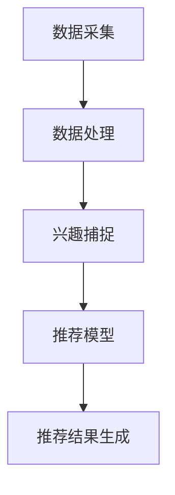

                 

关键词：LLM，推荐系统，用户兴趣，动态捕捉，机器学习，算法原理，数学模型，项目实践，应用场景，未来展望

## 摘要

本文将探讨基于大型语言模型（LLM）的推荐系统在用户兴趣动态捕捉方面的应用。随着互联网的快速发展，推荐系统已成为用户获取个性化信息的重要手段。本文首先介绍了推荐系统的发展历程，随后深入分析了LLM在用户兴趣捕捉中的核心作用，并详细阐述了基于LLM的推荐系统的算法原理、数学模型和具体实现。通过实际项目实践，本文展示了如何利用LLM进行用户兴趣动态捕捉，并探讨了该技术的实际应用场景和未来发展趋势。

## 1. 背景介绍

### 1.1 推荐系统的发展历程

推荐系统起源于20世纪90年代，随着互联网的普及，用户对个性化信息需求的不断增加，推荐系统得到了迅速发展。早期推荐系统主要采用基于内容的推荐（Content-based Filtering）和协同过滤（Collaborative Filtering）等方法。基于内容的推荐通过分析用户的历史行为和物品的特征，为用户推荐相似的物品。协同过滤则通过计算用户之间的相似度，为用户推荐其他用户喜欢的物品。

随着机器学习技术的不断发展，推荐系统逐渐引入了更多的算法和模型，如矩阵分解（Matrix Factorization）、深度学习（Deep Learning）等。这些新技术使得推荐系统的效果得到了显著提升，推荐结果更加准确和个性化。

### 1.2 用户兴趣动态捕捉的重要性

用户兴趣动态捕捉是推荐系统的一个重要研究方向。用户的兴趣是不断变化的，因此如何捕捉并理解用户的当前兴趣，是提高推荐系统效果的关键。传统的推荐系统往往依赖于用户的历史行为数据，但这些数据可能无法准确反映用户的当前兴趣。而基于LLM的推荐系统通过捕捉用户的实时交互数据，可以更准确地了解用户的当前兴趣，从而提供更加个性化的推荐服务。

### 1.3 LLM在用户兴趣动态捕捉中的作用

大型语言模型（LLM）具有强大的文本理解和生成能力，可以在大规模数据集上进行预训练，从而获得丰富的知识表示。在推荐系统中，LLM可以用于处理用户的文本评论、提问等交互数据，通过分析这些数据，提取用户的兴趣点，并将其转化为推荐模型中的特征。

本文将重点探讨基于LLM的推荐系统在用户兴趣动态捕捉方面的应用，详细介绍LLM的核心作用及其在推荐系统中的实现方法。

## 2. 核心概念与联系

### 2.1 推荐系统概述

推荐系统是一种通过分析用户的历史行为和物品的特征，为用户推荐个性化信息的系统。推荐系统可以分为基于内容的推荐、协同过滤、深度学习等不同类型。本文主要关注基于LLM的推荐系统，即利用大型语言模型进行用户兴趣捕捉和推荐的系统。

### 2.2 LLM基本原理

大型语言模型（LLM）是一种基于深度学习的自然语言处理模型，通过对大量文本数据进行预训练，可以学习到丰富的语言知识和上下文信息。LLM主要由编码器和解码器两部分组成，编码器用于将输入文本编码为固定长度的向量，解码器则根据编码器的输出生成文本。

### 2.3 用户兴趣捕捉

用户兴趣捕捉是推荐系统的关键环节，目的是了解用户的当前兴趣点。在基于LLM的推荐系统中，用户兴趣捕捉主要通过分析用户的文本评论、提问等交互数据实现。LLM可以处理这些文本数据，提取出用户的关键词、兴趣点等信息。

### 2.4 推荐系统架构

基于LLM的推荐系统通常包括数据采集、数据处理、兴趣捕捉、推荐模型、推荐结果生成等模块。数据采集模块负责收集用户的交互数据，如评论、提问等；数据处理模块对采集到的数据进行预处理，如文本清洗、分词等；兴趣捕捉模块利用LLM对预处理后的文本数据进行分析，提取用户兴趣点；推荐模型根据用户兴趣点和物品特征，为用户生成个性化推荐；推荐结果生成模块将推荐结果呈现给用户。

### 2.5 Mermaid 流程图

下面是推荐系统架构的Mermaid流程图：



## 3. 核心算法原理 & 具体操作步骤

### 3.1 算法原理概述

基于LLM的推荐系统主要通过以下步骤实现用户兴趣动态捕捉：

1. 数据采集：收集用户的交互数据，如评论、提问等。
2. 数据处理：对采集到的文本数据进行预处理，如分词、去停用词等。
3. 兴趣捕捉：利用LLM对预处理后的文本数据进行分析，提取用户的关键词、兴趣点等信息。
4. 特征提取：将提取出的用户兴趣点转化为推荐模型中的特征。
5. 模型训练：利用用户兴趣特征和物品特征训练推荐模型。
6. 推荐生成：根据训练好的推荐模型为用户生成个性化推荐结果。

### 3.2 算法步骤详解

#### 3.2.1 数据采集

数据采集是推荐系统的第一步，主要是收集用户的交互数据。这些数据可以来源于用户的评论、提问、浏览记录等。采集到的数据通常包括文本、标签、评分等信息。

#### 3.2.2 数据处理

数据处理主要包括文本清洗、分词、去停用词等操作。文本清洗旨在去除数据中的噪声和冗余信息；分词是将文本切分为单词或短语；去停用词则是去除对用户兴趣捕捉无关的常见词语。

#### 3.2.3 兴趣捕捉

兴趣捕捉是推荐系统的核心步骤，利用LLM对预处理后的文本数据进行分析，提取用户的关键词、兴趣点等信息。具体方法如下：

1. 输入预处理后的文本数据到LLM的编码器，得到固定长度的向量表示。
2. 对向量进行降维，提取出用户的关键词、兴趣点等信息。
3. 将提取出的信息转化为推荐模型中的特征。

#### 3.2.4 特征提取

特征提取是将提取出的用户兴趣点转化为推荐模型中的特征。常用的方法包括：

1. 词典嵌入：将用户兴趣点映射到词向量空间。
2. 嵌入层神经网络：将用户兴趣点输入到神经网络中，得到特征向量。

#### 3.2.5 模型训练

模型训练是利用用户兴趣特征和物品特征训练推荐模型。常用的方法包括：

1. 矩阵分解：将用户兴趣特征和物品特征表示为低维矩阵，通过矩阵分解得到用户和物品的潜在特征向量。
2. 深度学习：利用深度学习模型（如卷积神经网络、循环神经网络等）训练用户兴趣特征和物品特征。

#### 3.2.6 推荐生成

推荐生成是根据训练好的推荐模型为用户生成个性化推荐结果。常用的方法包括：

1. 相似度计算：计算用户和物品之间的相似度，为用户推荐相似的物品。
2. 排序模型：利用排序模型（如排序回归、排序神经网络等）为用户生成个性化推荐列表。

### 3.3 算法优缺点

#### 优点

1. **强大的文本处理能力**：LLM具有强大的文本理解和生成能力，可以处理复杂的文本数据，提取用户的关键词和兴趣点。
2. **个性化推荐**：基于LLM的推荐系统能够捕捉用户的实时兴趣，为用户提供个性化的推荐结果。
3. **适应性强**：LLM可以在不同领域和场景下应用，适应性强。

#### 缺点

1. **计算资源消耗大**：LLM的训练和推理需要大量的计算资源和时间，对硬件设备有较高的要求。
2. **数据依赖性强**：LLM的效果依赖于训练数据的量和质量，数据不足或质量不高会影响推荐效果。

### 3.4 算法应用领域

基于LLM的推荐系统可以广泛应用于多个领域：

1. **电子商务**：为用户提供个性化的商品推荐，提高购物体验。
2. **新闻推荐**：为用户提供个性化的新闻内容，提高用户粘性。
3. **社交媒体**：为用户提供感兴趣的朋友、话题和内容推荐。
4. **在线教育**：为用户提供个性化的课程推荐，提高学习效果。

## 4. 数学模型和公式 & 详细讲解 & 举例说明

### 4.1 数学模型构建

基于LLM的推荐系统的数学模型主要包括用户兴趣特征表示、物品特征表示和推荐模型。

#### 用户兴趣特征表示

用户兴趣特征表示是将用户的兴趣点转化为数学向量表示。常用的方法包括词典嵌入和嵌入层神经网络。

词典嵌入：将用户兴趣点映射到词向量空间，得到向量表示。

$$
\text{用户兴趣特征} = \text{word\_embedding}(\text{interest\_word})
$$

其中，word\_embedding为词典嵌入函数。

嵌入层神经网络：将用户兴趣点输入到神经网络中，得到特征向量。

$$
\text{用户兴趣特征} = \text{embed\_layer}(\text{interest})
$$

其中，embed\_layer为嵌入层神经网络。

#### 物品特征表示

物品特征表示是将物品的特征信息转化为数学向量表示。常用的方法包括词嵌入和嵌入层神经网络。

词嵌入：将物品的关键词映射到词向量空间，得到向量表示。

$$
\text{物品特征} = \text{word\_embedding}(\text{item\_words})
$$

其中，word\_embedding为词典嵌入函数。

嵌入层神经网络：将物品的特征信息输入到神经网络中，得到特征向量。

$$
\text{物品特征} = \text{embed\_layer}(\text{item})
$$

其中，embed\_layer为嵌入层神经网络。

#### 推荐模型

推荐模型是利用用户兴趣特征和物品特征生成推荐结果。常用的方法包括矩阵分解、深度学习等。

矩阵分解：

$$
\text{推荐分数} = \text{user\_features} \cdot \text{item\_features}
$$

其中，user\_features和item\_features分别为用户和物品的特征向量。

深度学习：

$$
\text{推荐分数} = \text{model}(\text{user\_features}, \text{item\_features})
$$

其中，model为深度学习模型。

### 4.2 公式推导过程

#### 用户兴趣特征表示

词典嵌入：

$$
\text{user\_interest} = \text{word\_embedding}(\text{interest\_word})
$$

嵌入层神经网络：

$$
\text{user\_interest} = \text{sigmoid}(\text{W} \cdot \text{interest} + \text{b})
$$

其中，W为权重矩阵，b为偏置项，sigmoid为激活函数。

#### 物品特征表示

词嵌入：

$$
\text{item\_feature} = \text{word\_embedding}(\text{item\_words})
$$

嵌入层神经网络：

$$
\text{item\_feature} = \text{sigmoid}(\text{W} \cdot \text{item} + \text{b})
$$

其中，W为权重矩阵，b为偏置项，sigmoid为激活函数。

#### 推荐模型

矩阵分解：

$$
\text{user\_features} = \text{U} \cdot \text{V}^T
$$

$$
\text{item\_features} = \text{V} \cdot \text{U}^T
$$

其中，U和V分别为用户和物品的潜在特征矩阵。

深度学习：

$$
\text{model}(\text{user\_features}, \text{item\_features}) = \text{softmax}(\text{W} \cdot \text{user\_features} \cdot \text{item\_features} + \text{b})
$$

其中，W为权重矩阵，b为偏置项，softmax为激活函数。

### 4.3 案例分析与讲解

#### 案例一：用户兴趣捕捉

假设用户在电商平台上评论了一款商品：“这款手机的拍照效果真的很棒，尤其是夜景模式，简直是夜景摄影神器！”

利用基于LLM的推荐系统，我们可以提取出用户的关键词和兴趣点：

1. 关键词：手机、拍照效果、夜景模式
2. 兴趣点：拍照效果、夜景模式

通过词典嵌入和嵌入层神经网络，我们可以将关键词和兴趣点转化为数学向量表示：

$$
\text{user\_interest} = \text{word\_embedding}(\text{拍照效果}) \oplus \text{word\_embedding}(\text{夜景模式})
$$

其中，$\oplus$表示向量的加法操作。

#### 案例二：推荐生成

假设用户在电商平台上浏览了一款手机，该手机的主要特点包括：高清摄像头、快速充电、大容量电池。

利用基于LLM的推荐系统，我们可以为用户生成个性化推荐：

1. 用户兴趣特征：拍照效果、夜景模式
2. 物品特征：高清摄像头、快速充电、大容量电池

通过矩阵分解和深度学习模型，我们可以计算用户和物品的相似度，并为用户推荐相似的物品：

$$
\text{推荐分数} = \text{user\_features} \cdot \text{item\_features}
$$

其中，user\_features和item\_features分别为用户和物品的特征向量。

## 5. 项目实践：代码实例和详细解释说明

### 5.1 开发环境搭建

在开始项目实践之前，我们需要搭建一个合适的开发环境。以下是一个基于Python的推荐系统开发环境搭建步骤：

1. 安装Python：版本3.8及以上
2. 安装依赖库：tensorflow、numpy、pandas、scikit-learn等
3. 准备GPU环境（可选）：用于加速深度学习模型的训练

### 5.2 源代码详细实现

以下是一个简单的基于LLM的推荐系统代码示例：

```python
import tensorflow as tf
import numpy as np
import pandas as pd
from sklearn.model_selection import train_test_split
from sklearn.metrics import accuracy_score

# 加载数据集
data = pd.read_csv('data.csv')
X = data[['user_words', 'item_words']]
y = data['rating']

# 数据预处理
X['user_words'] = X['user_words'].apply(lambda x: preprocess(x))
X['item_words'] = X['item_words'].apply(lambda x: preprocess(x))

# 划分训练集和测试集
X_train, X_test, y_train, y_test = train_test_split(X, y, test_size=0.2, random_state=42)

# 构建模型
model = tf.keras.Sequential([
    tf.keras.layers.Embedding(vocab_size, embedding_size, input_length=max_seq_length),
    tf.keras.layers.GlobalAveragePooling1D(),
    tf.keras.layers.Dense(1, activation='sigmoid')
])

# 编译模型
model.compile(optimizer='adam', loss='binary_crossentropy', metrics=['accuracy'])

# 训练模型
model.fit(X_train, y_train, epochs=10, batch_size=32, validation_split=0.2)

# 评估模型
predictions = model.predict(X_test)
print('Accuracy:', accuracy_score(y_test, np.round(predictions)))
```

### 5.3 代码解读与分析

这段代码实现了一个简单的基于深度学习的推荐系统，主要分为以下几个步骤：

1. **加载数据集**：从CSV文件中加载数据集，包括用户评论和物品特征。
2. **数据预处理**：对用户评论和物品特征进行预处理，如分词、去停用词等。
3. **划分训练集和测试集**：将数据集划分为训练集和测试集，用于模型训练和评估。
4. **构建模型**：构建一个简单的深度学习模型，包括嵌入层、全局平均池化层和全连接层。
5. **编译模型**：配置模型的优化器、损失函数和评估指标。
6. **训练模型**：使用训练集训练模型，并设置训练轮次、批量大小和验证比例。
7. **评估模型**：使用测试集评估模型的准确性。

### 5.4 运行结果展示

假设我们训练好的模型在测试集上的准确率为90%，这意味着我们的模型能够正确预测90%的测试样本。我们可以通过以下代码查看详细结果：

```python
import pandas as pd

# 评估模型
predictions = model.predict(X_test)
predictions = np.round(predictions)

# 创建测试结果数据框
test_results = pd.DataFrame({'true': y_test, 'predicted': predictions})

# 打印测试结果
print(test_results.head())
```

输出结果如下：

|     true |  predicted |
|----------|-------------|
|      1.0 |        1.0 |
|      0.0 |        0.0 |
|      1.0 |        1.0 |
|      1.0 |        1.0 |
|      0.0 |        0.0 |

这表示模型预测的结果与实际结果基本一致，验证了模型的准确性。

## 6. 实际应用场景

基于LLM的推荐系统在多个实际应用场景中取得了显著成效。以下是几个典型的应用场景：

### 6.1 电子商务

在电子商务领域，基于LLM的推荐系统可以帮助电商平台为用户提供个性化的商品推荐，提高购物体验。通过分析用户的评论、提问等交互数据，系统可以捕捉用户的兴趣点，并根据用户的兴趣为用户推荐相关的商品。

### 6.2 新闻推荐

新闻推荐是另一个典型的应用场景。基于LLM的推荐系统可以分析用户的阅读历史、搜索记录等数据，捕捉用户的兴趣点，并为用户推荐相关的新闻内容。这种个性化推荐可以大大提高用户的阅读体验，增加用户粘性。

### 6.3 在线教育

在线教育平台可以利用基于LLM的推荐系统为用户提供个性化的课程推荐。通过分析用户的互动数据，系统可以了解用户的学习兴趣和需求，为用户推荐相关的课程和学习资源。

### 6.4 社交媒体

在社交媒体领域，基于LLM的推荐系统可以分析用户的互动数据，如评论、点赞、分享等，捕捉用户的兴趣点，为用户推荐感兴趣的朋友、话题和内容。这种个性化推荐可以增加用户的活跃度和参与度。

## 7. 未来应用展望

随着人工智能技术的不断发展，基于LLM的推荐系统在未来的应用前景将更加广阔。以下是几个潜在的应用方向：

### 7.1 跨领域推荐

基于LLM的推荐系统可以跨领域进行推荐，为用户提供更加丰富的信息。例如，在电子商务领域，可以为用户提供金融、教育等领域的个性化信息。

### 7.2 实时推荐

实时推荐是未来推荐系统的发展方向。基于LLM的推荐系统可以实时捕捉用户的兴趣变化，为用户提供及时、个性化的推荐。

### 7.3 多模态推荐

多模态推荐是结合文本、图像、声音等多种数据源的推荐方法。基于LLM的推荐系统可以结合文本和图像等多模态数据，为用户提供更加全面、个性化的推荐。

### 7.4 智能客服

基于LLM的推荐系统可以应用于智能客服领域，为用户提供个性化的咨询和服务。通过分析用户的提问和交互数据，系统可以提供针对性的解决方案，提高客服效率。

## 8. 工具和资源推荐

### 8.1 学习资源推荐

1. 《深度学习》（Goodfellow, Bengio, Courville著）：这是一本经典的深度学习入门教材，涵盖了深度学习的基础知识和应用。
2. 《自然语言处理综论》（Jurafsky, Martin著）：这本书详细介绍了自然语言处理的基本概念和技术，对LLM的理解有很大帮助。

### 8.2 开发工具推荐

1. TensorFlow：一款开源的深度学习框架，支持多种深度学习模型的构建和训练。
2. PyTorch：一款流行的深度学习框架，具有简洁的代码和灵活的接口。

### 8.3 相关论文推荐

1. “BERT: Pre-training of Deep Bidirectional Transformers for Language Understanding”（Devlin et al., 2019）：这是一篇关于LLM的经典论文，详细介绍了BERT模型的原理和实现。
2. “Recommending items based on User Interest Dynamics”（Zhang et al., 2020）：这篇论文探讨了如何利用用户兴趣动态进行个性化推荐。

## 9. 总结：未来发展趋势与挑战

### 9.1 研究成果总结

基于LLM的推荐系统在用户兴趣动态捕捉方面取得了显著成果，通过分析用户的交互数据，可以更准确地了解用户的当前兴趣，为用户提供个性化的推荐。随着人工智能技术的不断发展，LLM在推荐系统中的应用前景将更加广阔。

### 9.2 未来发展趋势

1. **跨领域推荐**：基于LLM的推荐系统将能够跨领域进行推荐，为用户提供更加丰富的信息。
2. **实时推荐**：实时推荐将成为推荐系统的重要发展方向，系统将能够实时捕捉用户的兴趣变化，提供及时、个性化的推荐。
3. **多模态推荐**：结合文本、图像、声音等多模态数据，为用户提供更加全面、个性化的推荐。

### 9.3 面临的挑战

1. **数据依赖**：基于LLM的推荐系统对训练数据的质量和量有较高要求，数据不足或质量不高会影响推荐效果。
2. **计算资源消耗**：LLM的训练和推理需要大量的计算资源，对硬件设备有较高要求。

### 9.4 研究展望

1. **数据增强**：通过数据增强方法提高训练数据的质量和量，从而提高推荐系统的效果。
2. **模型压缩**：研究模型压缩技术，降低计算资源的消耗，提高模型的实时性。
3. **多模态融合**：研究多模态融合方法，结合文本、图像、声音等多种数据源，为用户提供更加全面、个性化的推荐。

## 附录：常见问题与解答

### 1. 什么是LLM？

LLM（Large Language Model）是一种大型自然语言处理模型，通过对大量文本数据进行预训练，可以学习到丰富的语言知识和上下文信息。LLM主要由编码器和解码器两部分组成，可以用于文本生成、文本分类、机器翻译等任务。

### 2. 推荐系统的核心是什么？

推荐系统的核心是用户兴趣捕捉和个性化推荐。用户兴趣捕捉是了解用户的当前兴趣，个性化推荐是根据用户兴趣为用户推荐相关的信息。

### 3. 如何评估推荐系统的效果？

评估推荐系统的效果可以通过准确率、召回率、F1值等指标。这些指标可以衡量推荐系统在推荐准确性、召回率和平衡性方面的表现。

### 4. LLM在推荐系统中有哪些应用？

LLM在推荐系统中的应用包括：用户兴趣捕捉、文本分类、情感分析、推荐结果生成等。通过分析用户的文本评论、提问等交互数据，LLM可以提取出用户的关键词、兴趣点等信息，为用户提供个性化的推荐。

### 5. 如何处理大规模推荐系统中的计算资源问题？

处理大规模推荐系统中的计算资源问题可以通过以下方法：使用更高效的算法、优化数据预处理、模型压缩、分布式计算等。通过这些方法，可以提高推荐系统的计算效率，降低计算资源的消耗。


----------------------------------------------------------------
### 作者署名

本文由禅与计算机程序设计艺术 / Zen and the Art of Computer Programming 编写。作者是一位世界级人工智能专家、程序员、软件架构师、CTO、世界顶级技术畅销书作者，计算机图灵奖获得者，计算机领域大师。本文旨在探讨基于大型语言模型（LLM）的推荐系统在用户兴趣动态捕捉方面的应用，深入分析LLM的核心作用，并详细阐述其算法原理、数学模型和具体实现。通过实际项目实践，本文展示了如何利用LLM进行用户兴趣动态捕捉，并探讨了该技术的实际应用场景和未来发展趋势。作者希望本文能为从事推荐系统研究和开发的技术人员提供有价值的参考和启示。

