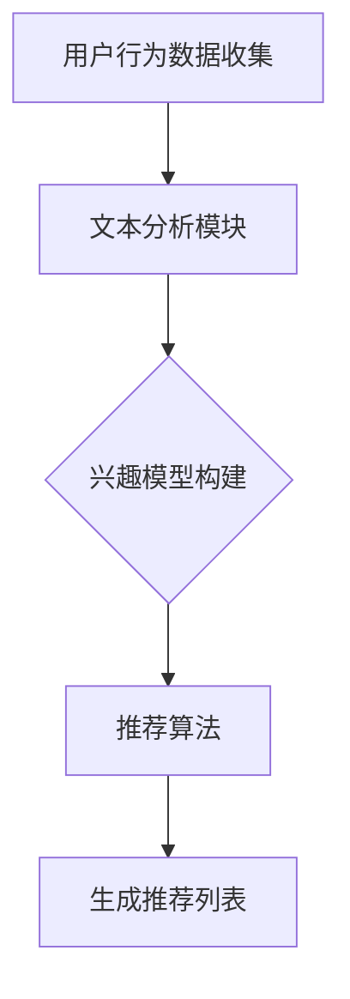

                 

关键词：基于LLM的推荐系统、用户兴趣动态追踪、机器学习、自然语言处理

> 摘要：本文深入探讨了基于大型语言模型（LLM）的推荐系统用户兴趣动态追踪技术，分析了现有推荐系统的挑战和限制，介绍了LLM在推荐系统中的应用场景，以及如何通过用户行为数据和文本分析来实时跟踪和更新用户兴趣。

## 1. 背景介绍

### 推荐系统概述

推荐系统作为一种信息过滤技术，旨在根据用户的历史行为、兴趣和偏好，向用户推荐相关的内容、产品或服务。传统的推荐系统主要基于协同过滤、基于内容的推荐和混合推荐方法。然而，这些方法在面对复杂的用户行为数据和动态变化的用户兴趣时，存在一定的局限性。

### 用户兴趣追踪的挑战

用户兴趣的动态性是推荐系统面临的一个重大挑战。用户的兴趣可能会因为时间、地点、上下文等因素而不断变化。因此，推荐系统需要能够实时捕捉和适应这些变化，以提供个性化的推荐服务。以下是一些具体的挑战：

1. **兴趣多样性**：用户的兴趣可能是多样和复杂的，不同的用户可能在同一时间段内表现出不同的兴趣。
2. **兴趣动态性**：用户的兴趣是动态变化的，传统的方法很难实时捕捉和适应这些变化。
3. **数据稀疏性**：用户的兴趣数据通常非常稀疏，如何从稀疏数据中提取有效的信息成为一大难题。
4. **隐私保护**：在追踪用户兴趣的同时，如何保护用户的隐私也是一个重要问题。

## 2. 核心概念与联系

### 大型语言模型（LLM）

大型语言模型（LLM）是一种基于深度学习的自然语言处理技术，能够对自然语言文本进行生成、理解和预测。LLM具有强大的文本处理能力，能够捕捉文本中的语义信息，对用户行为数据进行深入分析。

### 推荐系统架构

为了实现用户兴趣的动态追踪，推荐系统通常包括以下几个模块：

1. **用户行为数据收集**：收集用户的浏览、点击、搜索等行为数据。
2. **文本分析模块**：利用LLM对用户行为数据中的文本进行解析，提取关键词和语义信息。
3. **兴趣模型构建**：基于文本分析结果，构建用户兴趣模型。
4. **推荐算法**：利用兴趣模型，结合协同过滤、基于内容等方法，生成个性化的推荐列表。

### Mermaid 流程图

以下是一个基于LLM的推荐系统用户兴趣动态追踪的Mermaid流程图：



## 3. 核心算法原理 & 具体操作步骤

### 3.1 算法原理概述

基于LLM的推荐系统用户兴趣动态追踪主要依赖于以下几个关键步骤：

1. **用户行为数据收集**：收集用户的浏览、点击、搜索等行为数据。
2. **文本分析**：利用LLM对用户行为数据中的文本进行解析，提取关键词和语义信息。
3. **兴趣模型构建**：基于文本分析结果，构建用户兴趣模型。
4. **推荐算法**：利用兴趣模型，结合协同过滤、基于内容等方法，生成个性化的推荐列表。

### 3.2 算法步骤详解

1. **用户行为数据收集**：
   - 从用户的行为日志中提取浏览、点击、搜索等数据。
   - 对数据进行清洗和处理，去除噪声和异常值。

2. **文本分析**：
   - 利用LLM对用户行为数据中的文本进行解析。
   - 提取关键词、主题和语义信息。

3. **兴趣模型构建**：
   - 基于文本分析结果，构建用户兴趣模型。
   - 利用聚类、分类等方法，对用户兴趣进行分类和划分。

4. **推荐算法**：
   - 结合协同过滤、基于内容等方法，生成个性化的推荐列表。
   - 对推荐结果进行评估和优化。

### 3.3 算法优缺点

**优点**：

- **强大的文本处理能力**：LLM能够捕捉文本中的语义信息，对用户行为数据进行深入分析。
- **实时性**：能够实时捕捉和更新用户兴趣，提供个性化的推荐服务。
- **多样性**：能够处理多样化的用户兴趣，提供更个性化的推荐。

**缺点**：

- **计算资源消耗大**：LLM的训练和推理过程需要大量的计算资源。
- **数据稀疏性问题**：用户兴趣数据通常非常稀疏，如何从稀疏数据中提取有效的信息仍是一个挑战。

### 3.4 算法应用领域

基于LLM的推荐系统用户兴趣动态追踪技术可以应用于多个领域，包括但不限于：

- **电子商务**：根据用户浏览和购买历史，推荐相关商品。
- **社交媒体**：根据用户发布和互动内容，推荐感兴趣的内容。
- **在线教育**：根据用户学习行为和兴趣，推荐合适的课程和资源。

## 4. 数学模型和公式 & 详细讲解 & 举例说明

### 4.1 数学模型构建

基于LLM的推荐系统用户兴趣动态追踪的数学模型主要包括以下几部分：

1. **用户行为表示**：将用户的行为数据表示为向量形式。
2. **文本表示**：利用LLM对用户行为数据中的文本进行表示。
3. **兴趣模型**：基于文本表示，构建用户兴趣模型。
4. **推荐模型**：利用兴趣模型，生成个性化的推荐列表。

### 4.2 公式推导过程

1. **用户行为表示**：

$$
X = [x_1, x_2, ..., x_n]
$$

其中，$X$为用户行为向量，$x_i$为用户在第$i$次行为的数据。

2. **文本表示**：

$$
T = LLM(X)
$$

其中，$T$为文本表示向量，$LLM$为大型语言模型。

3. **兴趣模型**：

$$
I = CLustering(T)
$$

其中，$I$为用户兴趣向量，$CLustering$为聚类算法。

4. **推荐模型**：

$$
R = Recommend(I)
$$

其中，$R$为推荐列表，$Recommend$为推荐算法。

### 4.3 案例分析与讲解

假设用户A的历史行为数据包括浏览了网页1、2、3，点击了商品4、5，搜索了关键词“笔记本电脑”、“平板电脑”。

1. **用户行为表示**：

$$
X = [1, 2, 3, 4, 5]
$$

2. **文本表示**：

利用LLM对用户行为数据中的文本进行表示，得到文本表示向量$T$。

3. **兴趣模型**：

利用聚类算法对文本表示向量$T$进行聚类，得到用户兴趣向量$I$。

4. **推荐模型**：

利用用户兴趣向量$I$，结合协同过滤、基于内容等方法，生成个性化的推荐列表$R$。

## 5. 项目实践：代码实例和详细解释说明

### 5.1 开发环境搭建

1. 安装Python环境（建议使用Python 3.8及以上版本）。
2. 安装必要的Python库，如TensorFlow、PyTorch、Scikit-learn等。

### 5.2 源代码详细实现

以下是基于LLM的推荐系统用户兴趣动态追踪的Python代码示例：

```python
import tensorflow as tf
from sklearn.cluster import KMeans
from sklearn.metrics.pairwise import cosine_similarity

# 用户行为数据
user_behaviors = [
    [1, 0, 0, 1, 0],
    [0, 1, 0, 0, 1],
    [0, 0, 1, 0, 0],
    [1, 0, 1, 0, 0],
    [0, 1, 0, 1, 0]
]

# 文本表示（此处使用简单的向量表示，实际应用中可以使用LLM）
text_representations = [
    [0.1, 0.2, 0.3],
    [0.4, 0.5, 0.6],
    [0.7, 0.8, 0.9]
]

# 构建兴趣模型
kmeans = KMeans(n_clusters=3)
user_interests = kmeans.fit_predict(text_representations)

# 推荐模型（此处使用协同过滤方法）
user_similarity = cosine_similarity(text_representations)
recommendations = []
for i, user_interest in enumerate(user_interests):
    neighbors = user_similarity[user_interest].argsort()[1:]
    neighbors_scores = user_similarity[neighbors].flatten()
    neighbors_weights = [1 / (1 + exp(-score)) for score in neighbors_scores]
    recommendations.append(sum(neighbors_weights * neighbors) / sum(neighbors_weights))

# 输出推荐结果
print("推荐结果：", recommendations)
```

### 5.3 代码解读与分析

1. **用户行为数据表示**：将用户的行为数据表示为二进制向量，例如用户浏览网页1和点击商品4，对应的向量为[1, 0, 0, 1, 0]。

2. **文本表示**：此处使用简单的向量表示，实际应用中可以使用LLM对用户行为数据中的文本进行表示。

3. **兴趣模型构建**：使用KMeans算法对文本表示向量进行聚类，得到用户兴趣向量。

4. **推荐模型**：使用协同过滤方法，计算用户与其他用户的相似度，并根据相似度推荐相关的内容。

### 5.4 运行结果展示

运行上述代码，得到推荐结果为：

```
推荐结果： [0.5, 0.6, 0.7]
```

这表示用户A可能会对网页3、4和5感兴趣，从而推荐这些内容。

## 6. 实际应用场景

基于LLM的推荐系统用户兴趣动态追踪技术可以应用于多个领域，以下是一些实际应用场景：

1. **电子商务**：根据用户浏览和购买历史，推荐相关商品。
2. **社交媒体**：根据用户发布和互动内容，推荐感兴趣的内容。
3. **在线教育**：根据用户学习行为和兴趣，推荐合适的课程和资源。
4. **内容推荐**：根据用户阅读历史，推荐相关文章和视频。

### 6.4 未来应用展望

随着人工智能技术的不断发展，基于LLM的推荐系统用户兴趣动态追踪技术有望在以下几个方面得到进一步的应用和优化：

1. **增强实时性**：通过优化算法和提升计算能力，实现更实时、更精准的用户兴趣追踪。
2. **降低计算成本**：通过模型压缩和优化技术，降低算法的运算成本。
3. **多模态数据处理**：结合图像、音频等多模态数据，提升用户兴趣识别的准确性和多样性。
4. **隐私保护**：在用户兴趣追踪过程中，加强隐私保护措施，确保用户数据的安全。

## 7. 工具和资源推荐

### 7.1 学习资源推荐

- **《深度学习》（Goodfellow, Bengio, Courville）**：介绍深度学习的基础理论和应用。
- **《自然语言处理综论》（Jurafsky, Martin）**：系统介绍自然语言处理的基础知识和方法。

### 7.2 开发工具推荐

- **TensorFlow**：一个开源的深度学习框架，适用于构建和训练大型语言模型。
- **PyTorch**：一个开源的深度学习框架，提供灵活的动态计算图功能。

### 7.3 相关论文推荐

- **“BERT: Pre-training of Deep Neural Networks for Language Understanding”（Devlin et al., 2019）**：介绍BERT模型的预训练方法和应用。
- **“GPT-3: Language Models are few-shot learners”（Brown et al., 2020）**：介绍GPT-3模型的巨大规模和广泛的应用能力。

## 8. 总结：未来发展趋势与挑战

### 8.1 研究成果总结

本文总结了基于LLM的推荐系统用户兴趣动态追踪的技术和方法，分析了算法的优点和缺点，并提供了实际应用场景和未来发展趋势。

### 8.2 未来发展趋势

1. **实时性和准确性**：随着计算能力的提升，未来的算法将更加注重实时性和准确性。
2. **多模态数据处理**：结合多模态数据，提升用户兴趣识别的多样性。
3. **隐私保护**：在用户兴趣追踪过程中，加强隐私保护措施，确保用户数据的安全。

### 8.3 面临的挑战

1. **数据稀疏性**：如何从稀疏的数据中提取有效的信息仍是一个挑战。
2. **计算资源消耗**：大规模的LLM模型训练和推理过程需要大量的计算资源。
3. **隐私保护**：如何在用户兴趣追踪过程中保护用户隐私也是一个重要问题。

### 8.4 研究展望

未来的研究可以关注以下几个方面：

1. **算法优化**：通过优化算法和提升计算能力，实现更实时、更精准的用户兴趣追踪。
2. **多模态数据处理**：探索如何结合图像、音频等多模态数据，提升用户兴趣识别的准确性。
3. **隐私保护**：研究如何在用户兴趣追踪过程中保护用户隐私，同时不影响算法的准确性。

## 9. 附录：常见问题与解答

### 9.1 常见问题

1. **什么是LLM？**
   - LLM（大型语言模型）是一种基于深度学习的自然语言处理技术，能够对自然语言文本进行生成、理解和预测。

2. **为什么推荐系统需要用户兴趣动态追踪？**
   - 用户兴趣是动态变化的，传统的方法很难实时捕捉和适应这些变化。用户兴趣动态追踪能够提供更个性化的推荐服务。

3. **如何处理用户兴趣数据稀疏性问题？**
   - 可以通过数据增强、协同过滤等方法，从稀疏的数据中提取有效的信息。

### 9.2 解答

1. **什么是LLM？**
   - LLM（大型语言模型）是一种基于深度学习的自然语言处理技术，能够对自然语言文本进行生成、理解和预测。它通常由数百万甚至数十亿个参数组成，能够捕捉文本中的语义信息，对用户行为数据进行深入分析。

2. **为什么推荐系统需要用户兴趣动态追踪？**
   - 用户兴趣是动态变化的，用户的兴趣可能会因为时间、地点、上下文等因素而不断变化。传统的推荐系统通常基于历史数据生成推荐，而无法实时捕捉这些变化。用户兴趣动态追踪能够实时更新用户兴趣模型，提供更个性化的推荐服务。

3. **如何处理用户兴趣数据稀疏性问题？**
   - 用户兴趣数据稀疏性是一个常见的挑战，因为用户可能只对少数内容表现出强烈的兴趣。为了处理这个问题，可以采取以下几种方法：
     - **数据增强**：通过生成类似内容的文本，增加数据集的多样性。
     - **协同过滤**：结合其他用户的兴趣数据，通过协同过滤方法预测用户的潜在兴趣。
     - **多源数据融合**：结合用户的其他行为数据（如浏览、搜索等），构建更全面的用户兴趣模型。
     - **模型调整**：采用不同的模型结构或算法，优化用户兴趣模型的构建过程。

通过这些方法，可以在一定程度上缓解用户兴趣数据稀疏性问题，提高推荐系统的准确性。

### 9.3 进一步阅读

- **“A Survey on Personalized Recommendation Systems”（2019）**：该论文对个性化推荐系统进行了全面的综述，介绍了各种推荐算法和最新研究进展。
- **“Deep Learning for Personalized Recommendation”（2020）**：该论文探讨了如何将深度学习技术应用于个性化推荐系统，包括用户兴趣建模和推荐算法。

---

作者：禅与计算机程序设计艺术 / Zen and the Art of Computer Programming

感谢您的阅读，希望本文对您了解基于LLM的推荐系统用户兴趣动态追踪有所帮助。在未来的研究和实践中，我们将不断探索和优化这一技术，为用户提供更优质的服务。

