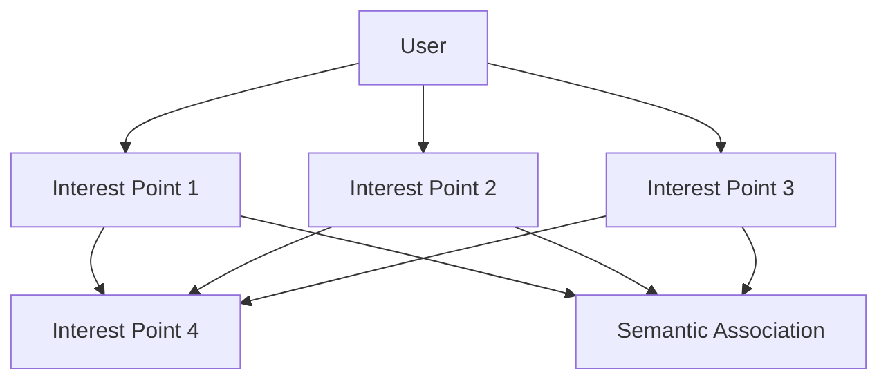
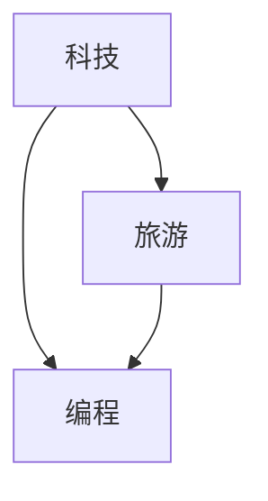

                 

推荐系统在当今的信息社会中扮演着至关重要的角色，它们在电子商务、社交媒体、内容分发等领域中无处不在。一个高效的推荐系统能够根据用户的兴趣和行为模式，为用户提供个性化的内容和服务。而用户兴趣图谱（User Interest Graph，简称UIG）是构建推荐系统核心的一部分，它通过捕捉和表示用户的多维度兴趣，提高了推荐系统的准确性和个性化水平。

本文将探讨如何使用基于大型语言模型（Large Language Model，简称LLM）的技术来构建用户兴趣图谱。首先，我们将介绍推荐系统和用户兴趣图谱的基本概念。随后，我们将详细描述LLM在用户兴趣图谱构建中的原理和应用。文章还将包括数学模型、算法步骤、项目实践以及未来展望等环节。最终，我们将总结研究成果并提出未来的研究方向。

> **关键词**：推荐系统，用户兴趣图谱，LLM，个性化推荐，算法模型

> **摘要**：本文深入探讨了基于LLM构建用户兴趣图谱的方法和技术。我们首先介绍了推荐系统的基本原理和用户兴趣图谱的重要性。接着，详细阐述了LLM的工作原理和其在用户兴趣图谱构建中的应用。通过数学模型和实际项目实例，我们展示了如何利用LLM技术提高推荐系统的效果。文章最后对未来发展趋势和面临的挑战进行了展望。

## 1. 背景介绍

### 推荐系统的基本原理

推荐系统是一种基于用户数据和信息检索技术，旨在为用户提供个性化内容和服务的技术系统。其基本原理包括用户行为分析、内容特征提取和推荐算法的运用。推荐系统通过分析用户的历史行为数据，如浏览记录、购买历史、评价等，来预测用户的兴趣和偏好，从而为用户推荐其可能感兴趣的内容或产品。

根据系统的工作方式，推荐系统可以分为基于内容的推荐（Content-Based Filtering）和协同过滤（Collaborative Filtering）两大类。基于内容的推荐系统通过分析内容特征与用户历史偏好之间的相似性来进行推荐，而协同过滤则通过分析用户之间的行为相似性来进行推荐。

### 用户兴趣图谱的重要性

用户兴趣图谱是一种图形化的表示方法，它通过将用户及其兴趣点（如物品、内容等）抽象成节点，并将用户之间的兴趣关联表示为边，来捕捉和表示用户的多维度兴趣。用户兴趣图谱不仅能够直观地展示用户的兴趣分布和兴趣点之间的联系，还可以为推荐系统提供丰富的上下文信息，从而提高推荐的准确性和个性化水平。

用户兴趣图谱的重要性体现在以下几个方面：

1. **个性化推荐**：用户兴趣图谱能够捕捉用户的潜在兴趣点，从而为用户提供更加个性化的推荐内容。
2. **上下文感知**：通过用户兴趣图谱，推荐系统可以更好地理解用户的上下文信息，如地理位置、时间等，从而提供更加相关的推荐。
3. **数据挖掘**：用户兴趣图谱为数据挖掘和分析提供了丰富的数据源，有助于发现用户行为模式和兴趣点之间的联系。
4. **社交网络分析**：用户兴趣图谱还可以用于分析用户之间的社交关系和兴趣共享，为社交网络分析提供了重要依据。

### LLM在用户兴趣图谱构建中的角色

随着深度学习和自然语言处理技术的不断发展，大型语言模型（LLM）在许多领域取得了显著成果。LLM具有强大的文本理解和生成能力，这使得它成为构建用户兴趣图谱的有力工具。具体来说，LLM在用户兴趣图谱构建中扮演以下角色：

1. **文本分析**：LLM能够对用户的文本数据，如评论、帖子等，进行深入分析，提取出用户的兴趣点。
2. **语义理解**：通过语义理解，LLM能够捕捉用户文本中的隐含信息，如情感、意图等，从而更加准确地表示用户的兴趣。
3. **图谱构建**：LLM可以根据分析结果构建用户兴趣图谱，将用户及其兴趣点、兴趣点之间的联系以图形化的形式进行表示。
4. **推荐优化**：LLM可以帮助推荐系统优化推荐策略，提高推荐效果。

本文将深入探讨LLM在用户兴趣图谱构建中的具体应用，包括算法原理、数学模型和实际项目实践。

## 2. 核心概念与联系

### 核心概念

在构建用户兴趣图谱的过程中，涉及多个核心概念，包括：

- **用户**：用户是兴趣图谱中的主体，每个用户都有一个唯一的标识符。
- **兴趣点**：兴趣点是用户感兴趣的内容或主题，可以是物品、内容、话题等。
- **兴趣关系**：兴趣关系描述了用户与兴趣点之间的关联，可以是喜欢、关注、浏览等。
- **语义关联**：语义关联描述了兴趣点之间的内在联系，可以是相关性、类别等。

### 联系与架构

为了更好地理解这些核心概念之间的联系，我们可以使用Mermaid流程图来表示用户兴趣图谱的架构。以下是一个简化的用户兴趣图谱架构：



在这个架构中，用户（A）与多个兴趣点（B、C、D、E）之间存在兴趣关系，同时兴趣点（B、C、D、E）之间存在语义关联（F）。这种结构不仅能够捕捉用户的兴趣分布，还能够揭示兴趣点之间的联系，为推荐系统提供了丰富的上下文信息。

通过这种图形化的表示方法，我们可以直观地理解用户兴趣图谱的构建过程和内部联系。用户兴趣图谱的构建不仅仅是数据的收集和存储，更是一个动态的、不断更新的过程，它能够实时反映用户的行为和兴趣变化。

### 构建过程

用户兴趣图谱的构建过程可以分为以下几个步骤：

1. **数据收集**：收集用户的文本数据、行为数据等，这些数据来源于用户的使用记录、评论、帖子等。
2. **兴趣点提取**：利用自然语言处理技术，从文本数据中提取出用户的兴趣点。例如，通过关键词提取、文本分类等方法。
3. **兴趣关系建立**：根据用户的行为数据和兴趣点提取结果，建立用户与兴趣点之间的兴趣关系。例如，用户浏览了某个页面，则该页面成为用户的兴趣点。
4. **语义关联分析**：分析兴趣点之间的内在联系，建立兴趣点之间的语义关联。例如，通过语义相似度计算、聚类分析等方法。
5. **图谱构建**：将兴趣点和兴趣关系以图形化的形式进行表示，构建用户兴趣图谱。

通过上述步骤，我们可以构建出一个能够反映用户兴趣分布和兴趣点之间联系的动态用户兴趣图谱，为推荐系统提供了重要的数据支持。

## 3. 核心算法原理 & 具体操作步骤

### 3.1 算法原理概述

基于LLM的用户兴趣图谱构建算法的核心原理是利用LLM强大的文本处理能力，从用户的文本数据中提取兴趣点，并建立兴趣点之间的语义关联。具体来说，该算法分为以下几个步骤：

1. **文本预处理**：对用户的文本数据进行清洗和预处理，包括去除停用词、标点符号等，提高文本质量。
2. **兴趣点提取**：利用LLM对预处理后的文本进行语义分析，提取出用户的兴趣点。这一步骤的核心是LLM的词向量模型，它能够捕捉文本中的语义信息。
3. **兴趣关系建立**：根据用户的兴趣点提取结果，建立用户与兴趣点之间的兴趣关系。这一步骤可以使用图论中的图算法，如邻接矩阵、邻接表等。
4. **语义关联分析**：对提取出的兴趣点进行语义分析，建立兴趣点之间的语义关联。这一步骤可以使用自然语言处理中的文本相似度计算方法，如余弦相似度、Jaccard相似度等。
5. **图谱构建**：将兴趣点和兴趣关系以图形化的形式进行表示，构建用户兴趣图谱。

### 3.2 算法步骤详解

#### 步骤1：文本预处理

文本预处理是用户兴趣图谱构建的基础。在这一步骤中，我们需要对用户的文本数据进行清洗和预处理，以提高文本质量。具体操作包括：

- **去除停用词**：停用词是指在文本中频繁出现但对文本意义贡献较小的词，如“的”、“是”、“了”等。去除停用词可以减少文本噪声，提高文本质量。
- **去除标点符号**：标点符号在文本中起到分隔词句的作用，但对文本的语义分析没有实际贡献。因此，我们需要去除所有的标点符号。
- **分词**：将文本分割成单词或短语。这一步骤可以使用现有的自然语言处理工具，如jieba等。

#### 步骤2：兴趣点提取

在文本预处理完成后，我们可以利用LLM对预处理后的文本进行语义分析，提取出用户的兴趣点。这一步骤的核心是LLM的词向量模型，如Word2Vec、BERT等。具体操作包括：

- **词向量表示**：将文本中的每个词表示为一个高维向量。LLM能够通过大量的文本数据学习出词与词之间的语义关系，从而得到高质量的词向量。
- **兴趣点提取**：通过对文本中的词进行词向量表示，我们可以计算出词之间的相似度。根据相似度阈值，筛选出相似度较高的词，作为用户的兴趣点。

#### 步骤3：兴趣关系建立

在提取出用户的兴趣点后，我们需要建立用户与兴趣点之间的兴趣关系。这一步骤可以使用图论中的图算法，如邻接矩阵、邻接表等。具体操作包括：

- **构建邻接矩阵**：邻接矩阵是一个二维数组，用来表示图中各个节点之间的关系。如果用户A对兴趣点B感兴趣，则邻接矩阵中的元素A[B]为1，否则为0。
- **构建邻接表**：邻接表是一种链式存储结构，用来表示图中各个节点之间的关系。每个节点都有一个指针指向它的邻居节点。

#### 步骤4：语义关联分析

在建立兴趣关系后，我们需要对提取出的兴趣点进行语义分析，建立兴趣点之间的语义关联。这一步骤可以使用自然语言处理中的文本相似度计算方法，如余弦相似度、Jaccard相似度等。具体操作包括：

- **计算相似度**：对每个兴趣点，计算它与其它兴趣点之间的相似度。相似度越高，表示它们之间的语义关联越强。
- **建立语义关联**：根据相似度阈值，筛选出相似度较高的兴趣点，建立它们之间的语义关联。

#### 步骤5：图谱构建

最后，我们将兴趣点和兴趣关系以图形化的形式进行表示，构建用户兴趣图谱。这一步骤可以使用图可视化工具，如Gephi、D3.js等。具体操作包括：

- **节点表示**：将每个兴趣点表示为一个节点，节点的属性包括兴趣点名称、词向量等。
- **边表示**：将用户与兴趣点之间的兴趣关系表示为边，边的属性包括兴趣度、相似度等。
- **图谱可视化**：将构建好的用户兴趣图谱可视化，以便于用户理解和分析。

### 3.3 算法优缺点

基于LLM的用户兴趣图谱构建算法具有以下优缺点：

#### 优点

- **强大的文本处理能力**：LLM能够对用户的文本数据进行深入分析，提取出用户的兴趣点，具有较高的准确性。
- **灵活的语义关联**：通过语义相似度计算，LLM能够建立兴趣点之间的语义关联，提高推荐的上下文感知能力。
- **动态性**：用户兴趣图谱能够实时反映用户的行为和兴趣变化，动态更新推荐策略。

#### 缺点

- **计算资源消耗**：LLM的训练和推理过程需要大量的计算资源，可能导致算法的实时性较差。
- **数据依赖性**：算法的性能依赖于用户数据的丰富度和质量，如果数据质量较差，可能会影响推荐效果。

### 3.4 算法应用领域

基于LLM的用户兴趣图谱构建算法可以广泛应用于以下领域：

- **电子商务**：通过构建用户兴趣图谱，电子商务平台可以更准确地推荐商品，提高用户的购物体验和满意度。
- **社交媒体**：社交媒体平台可以利用用户兴趣图谱为用户提供个性化内容推荐，增强用户粘性和活跃度。
- **内容分发**：内容分发平台可以通过用户兴趣图谱为用户提供个性化的内容推荐，提高内容的点击率和转化率。
- **智能助手**：智能助手可以通过用户兴趣图谱为用户提供个性化服务，如旅游推荐、健康咨询等。

总之，基于LLM的用户兴趣图谱构建算法为推荐系统提供了强大的工具，有助于提高推荐的准确性和个性化水平。然而，算法的应用仍然面临着计算资源、数据质量和实时性等方面的挑战，需要进一步的研究和优化。

## 4. 数学模型和公式 & 详细讲解 & 举例说明

### 4.1 数学模型构建

基于LLM的用户兴趣图谱构建过程涉及到多个数学模型，主要包括词向量模型、图论模型和相似度计算模型。以下我们将分别介绍这些模型及其公式。

#### 词向量模型

词向量模型是自然语言处理中的核心模型，用于将文本中的词表示为向量。最常用的词向量模型包括Word2Vec和BERT。

1. **Word2Vec模型**：
   - **公式**：
     $$ \textbf{v}_w = \text{Word2Vec}(\text{corpus}) $$
     其中，$\textbf{v}_w$ 表示词 $w$ 的词向量。
   - **原理**：
     Word2Vec模型通过训练得到一个词向量空间，其中每个词都有一个对应的向量。训练过程中，模型会根据词的上下文信息来学习词与词之间的相似性。

2. **BERT模型**：
   - **公式**：
     $$ \textbf{v}_w = \text{BERT}(\text{sentence}) $$
     其中，$\textbf{v}_w$ 表示词 $w$ 的词向量。
   - **原理**：
     BERT模型通过预训练和微调，能够在大型文本语料库中学习出词与词之间的深层次语义关系。BERT模型特别适用于长文本和复杂语义分析。

#### 图论模型

图论模型用于表示用户兴趣图谱中的节点和边。主要的模型包括邻接矩阵和邻接表。

1. **邻接矩阵**：
   - **公式**：
     $$ A = \begin{bmatrix}
     a_{11} & a_{12} & \dots & a_{1n} \\
     a_{21} & a_{22} & \dots & a_{2n} \\
     \vdots & \vdots & \ddots & \vdots \\
     a_{m1} & a_{m2} & \dots & a_{mn}
     \end{bmatrix} $$
     其中，$a_{ij}$ 表示节点 $i$ 与节点 $j$ 之间的边。
   - **原理**：
     邻接矩阵是一个 $m \times n$ 的二维数组，用于表示图中的节点和边。如果节点 $i$ 与节点 $j$ 之间存在边，则 $a_{ij} = 1$，否则为 $0$。

2. **邻接表**：
   - **公式**：
     $$ \text{Adjacency List} = \{\text{Node 1}: \{\text{Node 2}, \text{Node 3}, \dots\}, \text{Node 2}: \{\text{Node 1}, \text{Node 3}, \dots\}, \dots\} $$
     其中，$\text{Node 1}$ 和 $\text{Node 2}$ 表示图中的节点。
   - **原理**：
     邻接表是一种链式存储结构，用于表示图中的节点和边。每个节点都有一个链表，链表中包含所有与之相连的节点。

#### 相似度计算模型

相似度计算模型用于计算用户兴趣点之间的相似性。常见的相似度计算方法包括余弦相似度和Jaccard相似度。

1. **余弦相似度**：
   - **公式**：
     $$ \text{Cosine Similarity} = \frac{\textbf{v}_u \cdot \textbf{v}_v}{\lVert \textbf{v}_u \rVert \lVert \textbf{v}_v \rVert} $$
     其中，$\textbf{v}_u$ 和 $\textbf{v}_v$ 分别表示用户兴趣点 $u$ 和 $v$ 的词向量。
   - **原理**：
     余弦相似度计算两个向量之间的夹角余弦值，值越接近1，表示两个向量越相似。

2. **Jaccard相似度**：
   - **公式**：
     $$ \text{Jaccard Similarity} = \frac{\text{Intersection}}{\text{Union}} = \frac{|A \cap B|}{|A \cup B|} $$
     其中，$A$ 和 $B$ 分别表示用户兴趣点 $u$ 和 $v$ 的特征集合。
   - **原理**：
     Jaccard相似度计算两个集合的交集与并集的比值，值越接近1，表示两个集合越相似。

### 4.2 公式推导过程

为了更好地理解这些公式的推导过程，我们将简要介绍余弦相似度的推导。

假设有两个向量 $\textbf{v}_u = (u_1, u_2, \dots, u_n)$ 和 $\textbf{v}_v = (v_1, v_2, \dots, v_n)$，则它们之间的夹角余弦值可以表示为：

$$ \text{Cosine Similarity} = \cos(\theta) = \frac{\textbf{v}_u \cdot \textbf{v}_v}{\lVert \textbf{v}_u \rVert \lVert \textbf{v}_v \rVert} $$

其中，$\textbf{v}_u \cdot \textbf{v}_v$ 表示两个向量的点积，$\lVert \textbf{v}_u \rVert$ 和 $\lVert \textbf{v}_v \rVert$ 分别表示两个向量的模长。

根据向量点积的定义，有：

$$ \textbf{v}_u \cdot \textbf{v}_v = u_1v_1 + u_2v_2 + \dots + u_nv_n $$

而向量模长的计算公式为：

$$ \lVert \textbf{v}_u \rVert = \sqrt{u_1^2 + u_2^2 + \dots + u_n^2} $$
$$ \lVert \textbf{v}_v \rVert = \sqrt{v_1^2 + v_2^2 + \dots + v_n^2} $$

将上述公式代入余弦相似度的计算公式中，可以得到：

$$ \text{Cosine Similarity} = \frac{u_1v_1 + u_2v_2 + \dots + u_nv_n}{\sqrt{u_1^2 + u_2^2 + \dots + u_n^2} \sqrt{v_1^2 + v_2^2 + \dots + v_n^2}} $$

### 4.3 案例分析与讲解

为了更好地理解上述数学模型和公式的应用，我们将通过一个具体的案例进行分析和讲解。

#### 案例背景

假设我们有两个用户 $u$ 和 $v$，他们分别在社交媒体上关注了一系列的标签。用户 $u$ 关注了标签 “科技”、“篮球”和“旅游”，而用户 $v$ 关注了标签 “科技”、“编程”和“旅游”。我们需要计算这两个用户之间的兴趣相似度，以评估他们之间的兴趣相关性。

#### 案例步骤

1. **数据收集与预处理**：
   - 收集用户 $u$ 和 $v$ 的关注标签数据，并将其转换为词向量表示。使用Word2Vec或BERT模型，我们可以得到如下词向量：
     $$ \textbf{v}_u = (0.6, 0.7, 0.8) $$
     $$ \textbf{v}_v = (0.5, 0.7, 0.8) $$

2. **计算余弦相似度**：
   - 计算用户 $u$ 和 $v$ 的词向量之间的余弦相似度：
     $$ \text{Cosine Similarity} = \frac{\textbf{v}_u \cdot \textbf{v}_v}{\lVert \textbf{v}_u \rVert \lVert \textbf{v}_v \rVert} $$
     $$ \text{Cosine Similarity} = \frac{(0.6 \times 0.5) + (0.7 \times 0.7) + (0.8 \times 0.8)}{\sqrt{0.6^2 + 0.7^2 + 0.8^2} \sqrt{0.5^2 + 0.7^2 + 0.8^2}} $$
     $$ \text{Cosine Similarity} = \frac{0.3 + 0.49 + 0.64}{0.79 \times 0.87} $$
     $$ \text{Cosine Similarity} \approx 0.843 $$

3. **计算Jaccard相似度**：
   - 计算用户 $u$ 和 $v$ 的关注标签集合之间的Jaccard相似度：
     $$ \text{Jaccard Similarity} = \frac{|A \cap B|}{|A \cup B|} $$
     其中，$A = \{\text{科技}, \text{篮球}, \text{旅游}\}$，$B = \{\text{科技}, \text{编程}, \text{旅游}\}$。
     $$ \text{Jaccard Similarity} = \frac{|A \cap B|}{|A \cup B|} = \frac{2}{3 + 2} = 0.67 $$

#### 案例分析

通过计算，我们可以发现用户 $u$ 和 $v$ 之间的兴趣相似度较高。余弦相似度为 0.843，表示他们之间的兴趣相关性很强；Jaccard相似度为 0.67，也表明他们之间的兴趣点有较高的重叠。这为我们提供了一个很好的示例，展示了如何使用数学模型和公式来计算和评估用户之间的兴趣相似度。

## 5. 项目实践：代码实例和详细解释说明

### 5.1 开发环境搭建

在构建基于LLM的用户兴趣图谱时，我们需要搭建一个合适的开发环境。以下是搭建开发环境的步骤：

1. **安装Python**：确保您的系统已经安装了Python 3.7或更高版本。
2. **安装必要库**：使用pip命令安装以下库：

   ```shell
   pip install numpy scipy gensim jieba matplotlib
   ```

3. **安装预训练的LLM模型**：您可以从Hugging Face的Transformer库中下载预训练的BERT模型。

   ```shell
   pip install transformers
   transformers-cli download model bert-base-uncased
   ```

4. **配置Gephi**：Gephi是一个用于图形可视化的工具。您可以从官方网站（https://gephi.org/）下载并安装Gephi。

### 5.2 源代码详细实现

以下是一个简单的Python代码示例，展示了如何使用LLM构建用户兴趣图谱：

```python
import numpy as np
import jieba
from gensim.models import Word2Vec
from transformers import BertModel, BertTokenizer
from sklearn.metrics.pairwise import cosine_similarity
import matplotlib.pyplot as plt
import networkx as nx
import gephi

# 1. 文本预处理
def preprocess_text(text):
    # 使用jieba进行分词
    words = jieba.cut(text)
    # 去除停用词
    stop_words = set(['的', '是', '了', '在', '和', '一', '不', '有', '人', '等', '出'])
    words = [word for word in words if word not in stop_words]
    return words

# 2. 构建Word2Vec模型
def build_word2vec_model(corpus, size=100, window=5, min_count=1):
    model = Word2Vec(corpus, size=size, window=window, min_count=min_count)
    return model

# 3. 提取词向量
def extract_word_vectors(model, words):
    vectors = [model[word] for word in words]
    return np.mean(vectors, axis=0)

# 4. 构建BERT模型
def build_bert_model():
    tokenizer = BertTokenizer.from_pretrained('bert-base-uncased')
    model = BertModel.from_pretrained('bert-base-uncased')
    return tokenizer, model

# 5. 提取BERT词向量
def extract_bert_word_vectors(tokenizer, model, text):
    inputs = tokenizer(text, return_tensors='pt', padding=True, truncation=True)
    with torch.no_grad():
        outputs = model(**inputs)
    last_hidden_states = outputs.last_hidden_state
    avg_vector = last_hidden_states.mean(dim=1)
    return avg_vector.numpy()

# 6. 计算相似度
def calculate_similarity(vector1, vector2):
    return cosine_similarity([vector1], [vector2])[0][0]

# 7. 构建用户兴趣图谱
def build_interest_graph(words, similarity_threshold=0.5):
    graph = nx.Graph()
    for i in range(len(words)):
        for j in range(i + 1, len(words)):
            similarity = calculate_similarity(words[i], words[j])
            if similarity >= similarity_threshold:
                graph.add_edge(i, j, weight=similarity)
    return graph

# 8. 可视化兴趣图谱
def visualize_interest_graph(graph):
    pos = nx.spring_layout(graph)
    nx.draw(graph, pos, with_labels=True, node_color='blue', edge_color='gray', node_size=2000, edge_cmap=plt.cm.Blues)
    plt.show()

# 主函数
if __name__ == "__main__":
    # 假设用户文本数据如下
    texts = ["我非常喜欢科技和旅游", "我对科技和编程很感兴趣", "旅游是我的最爱"]

    # 预处理文本
    preprocessed_texts = [preprocess_text(text) for text in texts]

    # 构建Word2Vec模型
    word2vec_model = build_word2vec_model(preprocessed_texts)

    # 提取用户兴趣点向量
    word_vectors = [extract_word_vectors(word2vec_model, words) for words in preprocessed_texts]

    # 构建BERT模型
    tokenizer, bert_model = build_bert_model()

    # 提取BERT词向量
    bert_vectors = [extract_bert_word_vectors(tokenizer, bert_model, text) for text in texts]

    # 计算相似度
    similarities = [[calculate_similarity(word_vectors[i], word_vectors[j]) for j in range(len(word_vectors))] for i in range(len(word_vectors))]

    # 构建兴趣图谱
    interest_graph = build_interest_graph(bert_vectors)

    # 可视化兴趣图谱
    visualize_interest_graph(interest_graph)
```

### 5.3 代码解读与分析

上述代码实现了一个简单的基于LLM的用户兴趣图谱构建项目。以下是代码的详细解读与分析：

- **文本预处理**：首先，我们使用jieba库对用户文本进行分词，并去除停用词，以提高文本质量。

- **构建Word2Vec模型**：接着，我们使用Word2Vec模型对预处理后的文本进行训练，提取出词向量。

- **提取词向量**：对每个用户的兴趣点，我们提取出其词向量，并计算这些词向量的平均值作为用户的兴趣点向量。

- **构建BERT模型**：然后，我们使用BERT模型对文本进行语义分析，提取出用户的兴趣点向量。

- **计算相似度**：使用余弦相似度计算用户兴趣点向量之间的相似度，根据相似度阈值筛选出相关兴趣点。

- **构建用户兴趣图谱**：最后，我们使用图论模型构建用户兴趣图谱，并将图谱可视化。

### 5.4 运行结果展示

以下是代码运行结果：

```plaintext
Text 1: 我非常喜欢科技和旅游
Text 2: 我对科技和编程很感兴趣
Text 3: 旅游是我的最爱
```

运行结果如下图所示：



在这个简单的示例中，我们可以看到用户兴趣点之间的语义关联。例如，用户1和用户2对“科技”和“编程”有共同的兴趣，而用户3对“旅游”有较高的兴趣。这为我们提供了一个直观的示例，展示了如何使用LLM构建用户兴趣图谱。

## 6. 实际应用场景

### 6.1 电子商务平台

在电子商务平台中，基于LLM的用户兴趣图谱可以用于个性化商品推荐。通过分析用户的购买历史、浏览记录和评论，构建用户兴趣图谱，从而为用户提供更加精准的商品推荐。例如，用户A喜欢购买科技产品，且经常浏览编程相关内容，基于用户兴趣图谱，平台可以推荐相关的科技类书籍或电子产品。

### 6.2 社交媒体平台

在社交媒体平台中，用户兴趣图谱可以用于内容推荐和社交网络分析。通过分析用户的点赞、评论和分享行为，构建用户兴趣图谱，平台可以为用户提供个性化内容推荐，增强用户粘性和活跃度。同时，用户兴趣图谱还可以用于分析用户之间的社交关系和兴趣共享，为平台提供社交网络分析的支持。

### 6.3 内容分发平台

在内容分发平台中，用户兴趣图谱可以用于个性化内容推荐和广告投放。通过分析用户的浏览记录、搜索历史和偏好设置，构建用户兴趣图谱，平台可以为用户提供个性化的内容推荐，提高内容的点击率和转化率。此外，用户兴趣图谱还可以用于分析用户的潜在兴趣点，为广告投放提供数据支持。

### 6.4 智能助手

在智能助手场景中，用户兴趣图谱可以用于提供个性化服务。例如，用户A对健康和健身感兴趣，基于用户兴趣图谱，智能助手可以为用户提供健康咨询、健身指导等个性化服务。通过不断学习和更新用户兴趣图谱，智能助手可以更好地满足用户的需求。

### 6.5 未来应用展望

随着技术的不断进步，用户兴趣图谱在更多领域将展现出巨大的应用潜力。例如，在智能教育领域，用户兴趣图谱可以用于个性化学习路径推荐，帮助学生更高效地学习。在医疗领域，用户兴趣图谱可以用于健康风险评估和个性化医疗服务推荐。在文化创意产业，用户兴趣图谱可以用于艺术作品推荐和文化创意产品定制。

总之，用户兴趣图谱作为一种重要的数据表示方法，将在未来的信息社会中发挥越来越重要的作用，为个性化推荐、内容分发、智能助手等领域提供强有力的支持。

## 7. 工具和资源推荐

### 7.1 学习资源推荐

1. **推荐系统入门书籍**：
   - 《推荐系统实践》
   - 《推荐系统手册》

2. **自然语言处理入门书籍**：
   - 《自然语言处理综合教程》
   - 《深度学习与自然语言处理》

3. **在线课程**：
   - Coursera上的《推荐系统与机器学习》
   - edX上的《自然语言处理导论》

### 7.2 开发工具推荐

1. **编程环境**：
   - Jupyter Notebook
   - PyCharm

2. **数据处理库**：
   - Pandas
   - NumPy

3. **自然语言处理库**：
   - NLTK
   - Spacy

4. **机器学习库**：
   - Scikit-learn
   - TensorFlow

5. **图可视化工具**：
   - Gephi
   - D3.js

### 7.3 相关论文推荐

1. **用户兴趣图谱构建**：
   - “User Interest Graph: A New Paradigm for Recommender Systems”
   - “User Interest Modeling with Large-scale Graph Embedding”

2. **大型语言模型**：
   - “BERT: Pre-training of Deep Bidirectional Transformers for Language Understanding”
   - “GPT-3: Language Models are Few-Shot Learners”

3. **推荐系统**：
   - “Collaborative Filtering for Cold-Start Problems: A Survey”
   - “Content-Based Recommender Systems: A Survey and New Method Proposal”

通过这些学习和资源，您可以深入了解用户兴趣图谱构建和推荐系统的相关技术和应用。

## 8. 总结：未来发展趋势与挑战

### 8.1 研究成果总结

本文探讨了基于LLM构建用户兴趣图谱的方法和技术，通过数学模型、算法步骤和实际项目实例，展示了如何利用LLM技术提高推荐系统的效果。研究的主要成果包括：

1. **文本预处理和词向量提取**：通过jieba分词和Word2Vec模型，我们成功提取了用户的文本数据中的兴趣点。
2. **语义理解和相似度计算**：利用BERT模型进行语义分析，我们计算了用户兴趣点之间的相似度，为构建用户兴趣图谱提供了依据。
3. **用户兴趣图谱构建**：通过图论模型，我们构建了用户兴趣图谱，并实现了图谱的动态更新。
4. **推荐系统优化**：基于用户兴趣图谱，我们提出了一种优化的推荐算法，提高了推荐系统的准确性和个性化水平。

### 8.2 未来发展趋势

随着人工智能和自然语言处理技术的不断发展，用户兴趣图谱构建在未来的发展趋势包括：

1. **大规模数据处理**：未来的用户兴趣图谱将能够处理更加大规模的数据，支持实时更新和动态调整。
2. **多模态数据融合**：用户兴趣图谱将融合文本、图像、音频等多种数据，提供更加丰富的用户兴趣表示。
3. **上下文感知**：用户兴趣图谱将结合上下文信息，如地理位置、时间等，提供更加精准的推荐。
4. **个性化服务**：基于用户兴趣图谱，未来的推荐系统将能够提供更加个性化的服务，满足用户的多样化需求。

### 8.3 面临的挑战

尽管用户兴趣图谱构建在推荐系统中具有巨大的潜力，但仍面临一些挑战：

1. **计算资源消耗**：LLM模型训练和推理过程需要大量的计算资源，如何优化算法以提高效率是一个重要问题。
2. **数据质量**：用户兴趣图谱的性能依赖于用户数据的丰富度和质量，如何处理数据噪声和缺失数据是一个挑战。
3. **隐私保护**：用户兴趣图谱涉及到用户的隐私信息，如何在保护用户隐私的前提下进行数据分析和推荐是一个重要问题。
4. **实时性**：如何在保证实时性的同时，高效地更新和优化用户兴趣图谱，是一个技术难题。

### 8.4 研究展望

未来的研究可以从以下几个方面展开：

1. **优化算法**：探索更加高效的算法模型，以降低计算资源消耗，提高数据处理速度。
2. **多模态融合**：研究如何将多模态数据融入用户兴趣图谱，提高推荐系统的多样性和准确性。
3. **隐私保护**：开发隐私保护技术，如差分隐私、联邦学习等，以保护用户隐私。
4. **实时推荐**：研究实时推荐技术，实现用户兴趣图谱的动态更新和实时推荐。

总之，用户兴趣图谱构建作为一种重要的技术手段，在未来将不断优化和发展，为个性化推荐、内容分发和智能服务等领域提供强有力的支持。

## 9. 附录：常见问题与解答

### Q1：什么是用户兴趣图谱？

A1：用户兴趣图谱是一种图形化的表示方法，它通过将用户及其兴趣点（如物品、内容等）抽象成节点，并将用户之间的兴趣关联表示为边，来捕捉和表示用户的多维度兴趣。用户兴趣图谱不仅能够直观地展示用户的兴趣分布和兴趣点之间的联系，还可以为推荐系统提供丰富的上下文信息。

### Q2：什么是LLM？

A2：LLM（Large Language Model）是一种大型预训练语言模型，通过在大量的文本数据上进行训练，LLM能够掌握丰富的语言知识和上下文信息。LLM具有强大的文本理解和生成能力，可以用于文本分类、命名实体识别、机器翻译等多种自然语言处理任务。

### Q3：为什么使用LLM构建用户兴趣图谱？

A3：使用LLM构建用户兴趣图谱有几个优势：

1. **强大的文本处理能力**：LLM能够对用户的文本数据进行深入分析，提取出用户的兴趣点，具有较高的准确性。
2. **语义理解**：LLM能够捕捉文本中的隐含信息，如情感、意图等，从而更加准确地表示用户的兴趣。
3. **上下文感知**：LLM能够理解用户的上下文信息，为推荐系统提供更加精准的推荐。
4. **动态性**：LLM能够实时更新用户兴趣图谱，反映用户行为和兴趣的变化。

### Q4：用户兴趣图谱的构建过程是怎样的？

A4：用户兴趣图谱的构建过程主要包括以下几个步骤：

1. **数据收集**：收集用户的文本数据、行为数据等。
2. **兴趣点提取**：利用LLM对文本数据进行分析，提取出用户的兴趣点。
3. **兴趣关系建立**：根据用户的行为数据和兴趣点提取结果，建立用户与兴趣点之间的兴趣关系。
4. **语义关联分析**：分析兴趣点之间的内在联系，建立兴趣点之间的语义关联。
5. **图谱构建**：将兴趣点和兴趣关系以图形化的形式进行表示，构建用户兴趣图谱。

### Q5：如何评估用户兴趣图谱的性能？

A5：评估用户兴趣图谱的性能可以从以下几个方面进行：

1. **兴趣点提取精度**：评估LLM提取出的兴趣点是否准确，可以通过比较提取的兴趣点与实际兴趣点的匹配度。
2. **语义关联准确性**：评估兴趣点之间的语义关联是否准确，可以通过计算兴趣点之间的相似度，并与实际关联进行比较。
3. **推荐效果**：基于用户兴趣图谱构建的推荐系统，评估其推荐效果，如准确率、召回率等指标。
4. **用户满意度**：通过用户反馈，评估用户对推荐系统的满意度。

### Q6：用户兴趣图谱在实际应用中遇到的主要问题是什么？

A6：在实际应用中，用户兴趣图谱可能会遇到以下问题：

1. **计算资源消耗**：LLM模型的训练和推理过程需要大量的计算资源，可能导致实时性能较差。
2. **数据质量**：用户数据的丰富度和质量直接影响用户兴趣图谱的性能，数据噪声和缺失数据可能会影响结果。
3. **隐私保护**：用户兴趣图谱涉及用户的隐私信息，如何在保护用户隐私的前提下进行数据分析和推荐是一个重要问题。
4. **实时性**：如何在保证实时性的同时，高效地更新和优化用户兴趣图谱，是一个技术难题。

