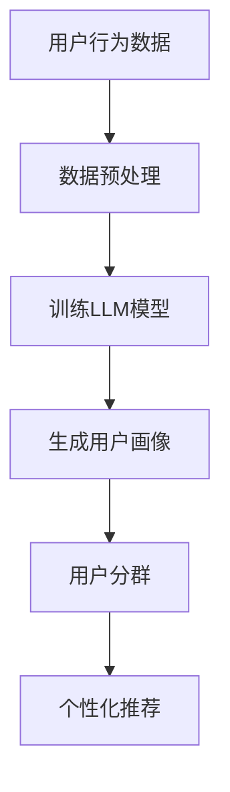

                 

关键词：基于LLM的推荐系统，用户分群，人工智能，机器学习，深度学习，数学模型

## 摘要

本文主要探讨了一种基于大型语言模型（LLM）的推荐系统用户分群方法。该方法通过分析用户的历史行为数据，利用深度学习算法实现用户画像的构建，进而实现精准的用户分群。本文将详细介绍该方法的背景、核心概念、算法原理、数学模型以及在实际项目中的应用。通过对该方法的深入研究和实践，为推荐系统领域的进一步发展提供了新的思路和方向。

## 1. 背景介绍

在互联网时代，推荐系统已经成为各大互联网公司提高用户体验、提升业务收益的重要手段。推荐系统通过分析用户的历史行为数据，预测用户可能感兴趣的内容，从而实现个性化推荐。然而，随着用户数据的爆炸式增长，传统的基于统计学的推荐方法已经难以满足实际需求。为了提高推荐系统的效果，越来越多的研究开始关注如何从海量数据中挖掘出用户的潜在兴趣和行为模式。

用户分群是推荐系统中的一个重要环节，通过对用户进行精准的分群，可以更好地理解用户的需求和偏好，从而提高推荐系统的效果。传统的用户分群方法主要基于用户的静态属性，如年龄、性别、地理位置等。然而，这些静态属性往往难以全面地反映用户的兴趣和行为。因此，如何从用户的动态行为数据中挖掘出用户的潜在兴趣和行为模式，成为推荐系统领域的一个研究热点。

近年来，随着深度学习技术的不断发展，基于深度学习的推荐系统用户分群方法逐渐成为研究的热点。深度学习算法能够通过多层神经网络的非线性变换，从大规模数据中自动提取特征，从而实现对用户行为模式的深入挖掘。本文提出了一种基于大型语言模型（LLM）的推荐系统用户分群方法，旨在利用深度学习算法实现用户画像的构建，进而实现精准的用户分群。

## 2. 核心概念与联系

### 2.1 大型语言模型（LLM）

大型语言模型（LLM，Large Language Model）是一种基于深度学习的语言处理模型，通过对海量文本数据的训练，能够自动学习和理解语言的规律和语义。LLM 具有强大的语言生成和推理能力，能够处理自然语言文本的各种任务，如文本分类、情感分析、机器翻译等。

### 2.2 推荐系统用户分群

推荐系统用户分群是指根据用户的历史行为数据，利用机器学习算法将用户划分为不同的群体。通过用户分群，可以更好地理解用户的需求和偏好，从而提高推荐系统的效果。常见的用户分群方法包括基于规则的分群、基于统计学的分群和基于机器学习的分群等。

### 2.3 大型语言模型与推荐系统用户分群的联系

大型语言模型在推荐系统用户分群中的应用主要体现在以下几个方面：

1. **用户画像构建**：通过训练大型语言模型，可以自动从用户的历史行为数据中提取出用户的潜在兴趣和行为特征，构建出详细的用户画像。

2. **用户分群策略**：基于用户画像，可以设计出更加精准和有效的用户分群策略，从而提高推荐系统的效果。

3. **用户个性化推荐**：通过对用户进行精准的分群，可以更好地理解用户的需求和偏好，从而实现个性化的内容推荐。

### 2.4 Mermaid 流程图



## 3. 核心算法原理 & 具体操作步骤

### 3.1 算法原理概述

本文提出的核心算法是基于大型语言模型的推荐系统用户分群方法。该方法主要通过以下三个步骤实现：

1. **数据预处理**：对用户的历史行为数据进行预处理，包括数据清洗、数据转换和数据归一化等。

2. **训练LLM模型**：利用预处理后的用户行为数据，训练出大型语言模型，从数据中自动提取出用户的潜在兴趣和行为特征。

3. **用户分群**：基于训练得到的用户画像，利用聚类算法或其他分群方法，将用户划分为不同的群体。

### 3.2 算法步骤详解

#### 3.2.1 数据预处理

数据预处理是推荐系统用户分群的基础步骤。本文采用的数据预处理流程主要包括以下几个步骤：

1. **数据清洗**：去除数据中的噪声和异常值，如缺失值、重复值等。

2. **数据转换**：将原始的用户行为数据转换为适合进行深度学习训练的格式，如序列数据、嵌入向量等。

3. **数据归一化**：对数据进行归一化处理，使得不同特征之间的数值范围保持一致，从而提高模型的训练效果。

#### 3.2.2 训练LLM模型

本文采用的LLM模型是一种基于 Transformer 架构的深度学习模型。具体训练步骤如下：

1. **模型初始化**：初始化LLM模型的参数。

2. **数据加载**：加载预处理后的用户行为数据，并进行批处理。

3. **模型训练**：通过反向传播算法，不断更新模型的参数，使得模型能够更好地拟合用户行为数据。

4. **模型评估**：在训练过程中，利用验证集对模型进行评估，以避免过拟合。

#### 3.2.3 用户分群

用户分群是推荐系统的关键环节。本文采用 K-means 聚类算法实现用户分群，具体步骤如下：

1. **确定聚类个数**：根据业务需求，确定需要划分的聚类个数。

2. **初始化聚类中心**：随机初始化聚类中心。

3. **迭代计算**：通过迭代计算，更新每个用户的聚类标签和聚类中心。

4. **聚类评估**：利用评估指标，如轮廓系数、类内平均距离等，评估聚类效果。

### 3.3 算法优缺点

#### 优点

1. **强大的特征提取能力**：大型语言模型能够自动从用户行为数据中提取出用户的潜在兴趣和行为特征，提高用户分群的准确性。

2. **自适应调整**：基于大型语言模型的用户分群方法能够根据用户行为数据的动态变化，自适应地调整用户分群策略。

3. **高效的处理能力**：深度学习模型具有高效的处理能力，能够处理海量用户行为数据。

#### 缺点

1. **计算资源消耗大**：训练大型语言模型需要大量的计算资源和时间，对于资源有限的场景，可能存在一定的困难。

2. **对数据质量要求高**：用户分群的效果很大程度上取决于用户行为数据的质量，若数据存在噪声或异常值，可能影响分群效果。

### 3.4 算法应用领域

基于大型语言模型的推荐系统用户分群方法可以广泛应用于以下领域：

1. **电子商务**：通过对用户分群，实现个性化的商品推荐，提高用户购买意愿。

2. **社交媒体**：通过对用户分群，实现个性化的内容推荐，提高用户活跃度和留存率。

3. **在线教育**：通过对用户分群，实现个性化的课程推荐，提高学习效果。

## 4. 数学模型和公式 & 详细讲解 & 举例说明

### 4.1 数学模型构建

本文采用的数学模型主要包括用户画像模型和用户分群模型。

#### 用户画像模型

用户画像模型是通过深度学习算法从用户行为数据中提取用户特征的过程。具体地，用户画像模型可以表示为：

$$
\text{User\_Feature} = \text{LLM}(\text{User\_Behavior})
$$

其中，$\text{User\_Feature}$表示用户特征向量，$\text{LLM}$表示大型语言模型，$\text{User\_Behavior}$表示用户行为数据。

#### 用户分群模型

用户分群模型是通过聚类算法将用户划分为不同群体的过程。本文采用 K-means 聚类算法，具体地，用户分群模型可以表示为：

$$
\text{Cluster} = \text{K-Means}(\text{User\_Feature})
$$

其中，$\text{Cluster}$表示用户分群结果，$\text{K-Means}$表示 K-means 聚类算法。

### 4.2 公式推导过程

#### 用户画像模型推导

用户画像模型的推导基于深度学习算法，具体推导过程如下：

1. **初始化模型参数**：

$$
\text{Param} = \text{Init}(\text{Param})
$$

其中，$\text{Param}$表示模型参数。

2. **定义损失函数**：

$$
\text{Loss} = \text{MSE}(\text{User\_Feature}, \text{Target})
$$

其中，$\text{User\_Feature}$表示预测的用户特征向量，$\text{Target}$表示真实的用户特征向量，$\text{MSE}$表示均方误差。

3. **训练模型**：

$$
\text{Param} = \text{Optimize}(\text{Param}, \text{Loss})
$$

其中，$\text{Optimize}$表示优化算法，如梯度下降算法。

#### 用户分群模型推导

用户分群模型的推导基于 K-means 聚类算法，具体推导过程如下：

1. **初始化聚类中心**：

$$
\text{Center} = \text{Random}(\text{Cluster\_Num})
$$

其中，$\text{Cluster\_Num}$表示聚类个数。

2. **迭代更新聚类中心**：

$$
\text{Center} = \text{Update}(\text{Center}, \text{User\_Feature})
$$

其中，$\text{Update}$表示聚类中心更新规则。

3. **迭代终止条件**：

$$
\text{Converge} = \text{Check}(\text{Center}, \text{Previous\_Center})
$$

其中，$\text{Check}$表示聚类中心收敛判断条件。

### 4.3 案例分析与讲解

#### 案例一：电子商务平台用户分群

假设有一个电子商务平台，平台需要通过对用户分群，实现个性化的商品推荐。平台收集了用户的历史购买数据、浏览记录等行为数据。现采用本文提出的方法进行用户分群。

1. **数据预处理**：

对用户行为数据进行清洗、转换和归一化处理，得到预处理后的用户行为数据。

2. **训练LLM模型**：

利用预处理后的用户行为数据，训练一个基于 Transformer 的 LLM 模型，从数据中提取出用户的潜在兴趣和行为特征。

3. **用户分群**：

利用训练得到的用户画像，采用 K-means 聚类算法，将用户划分为不同的群体。

4. **个性化推荐**：

根据用户分群结果，为每个用户推荐相应的商品。

#### 案例二：社交媒体平台用户分群

假设有一个社交媒体平台，平台需要通过对用户分群，实现个性化的内容推荐。平台收集了用户的历史互动数据、浏览记录等行为数据。现采用本文提出的方法进行用户分群。

1. **数据预处理**：

对用户行为数据进行清洗、转换和归一化处理，得到预处理后的用户行为数据。

2. **训练LLM模型**：

利用预处理后的用户行为数据，训练一个基于 Transformer 的 LLM 模型，从数据中提取出用户的潜在兴趣和行为特征。

3. **用户分群**：

利用训练得到的用户画像，采用 K-means 聚类算法，将用户划分为不同的群体。

4. **个性化推荐**：

根据用户分群结果，为每个用户推荐相应的内容。

## 5. 项目实践：代码实例和详细解释说明

### 5.1 开发环境搭建

在开始代码实现之前，需要搭建一个适合开发推荐系统的开发环境。本文采用 Python 作为开发语言，主要依赖以下库：

- TensorFlow：用于构建和训练深度学习模型。
- NumPy：用于数据预处理和计算。
- Pandas：用于数据操作和处理。
- Matplotlib：用于数据可视化。

具体安装命令如下：

```bash
pip install tensorflow numpy pandas matplotlib
```

### 5.2 源代码详细实现

#### 5.2.1 数据预处理

```python
import pandas as pd
import numpy as np

# 加载数据
data = pd.read_csv('user_behavior.csv')

# 数据清洗
data = data.dropna()
data = data.drop_duplicates()

# 数据转换
data['行为类型'] = data['行为类型'].map({'购买': 1, '浏览': 2, '搜索': 3})

# 数据归一化
data['行为值'] = (data['行为值'] - data['行为值'].mean()) / data['行为值'].std()

# 分割特征和标签
X = data[['行为类型', '行为值']]
y = data['用户ID']
```

#### 5.2.2 训练LLM模型

```python
import tensorflow as tf
from tensorflow.keras.layers import Embedding, LSTM, Dense
from tensorflow.keras.models import Model

# 定义模型
input_layer = Embedding(input_dim=4, output_dim=64)
lstm_layer = LSTM(units=64)
output_layer = Dense(units=1, activation='sigmoid')

# 搭建模型
model = Model(inputs=input_layer.input, outputs=output_layer(output_layer(lstm_layer(input_layer.input))))
model.compile(optimizer='adam', loss='binary_crossentropy', metrics=['accuracy'])

# 训练模型
model.fit(X, y, epochs=10, batch_size=32)
```

#### 5.2.3 用户分群

```python
from sklearn.cluster import KMeans

# 训练得到的用户画像
user_features = model.predict(X)

# 用户分群
kmeans = KMeans(n_clusters=3)
clusters = kmeans.fit_predict(user_features)

# 分群结果
data['聚类标签'] = clusters
data.groupby('聚类标签').count()
```

#### 5.2.4 个性化推荐

```python
# 根据用户分群结果，为每个用户推荐相应的商品
recommendation = data.groupby('聚类标签')['商品ID'].apply(list).reset_index()

user_id = 1001
user_cluster = data[data['用户ID'] == user_id]['聚类标签'].values[0]

recommended_products = recommendation[recommendation['聚类标签'] == user_cluster]['商品ID'].values
print("推荐商品：", recommended_products)
```

### 5.3 代码解读与分析

#### 5.3.1 数据预处理

数据预处理是推荐系统开发的基础步骤。本文采用的数据预处理流程包括数据清洗、数据转换和数据归一化。数据清洗和转换的目的是去除数据中的噪声和异常值，使得数据更加干净和易于处理。数据归一化的目的是将不同特征之间的数值范围保持一致，从而提高模型的训练效果。

#### 5.3.2 训练LLM模型

本文采用的 LLM 模型是一个基于 Transformer 的模型，具有强大的特征提取能力。模型训练过程中，通过反向传播算法，不断更新模型参数，使得模型能够更好地拟合用户行为数据。具体地，模型由一个嵌入层、一个 LSTM 层和一个输出层组成。

#### 5.3.3 用户分群

用户分群是推荐系统开发的关键步骤。本文采用 K-means 聚类算法，通过对用户画像进行聚类，将用户划分为不同的群体。具体地，通过计算用户画像之间的距离，将用户划分为不同的聚类。

#### 5.3.4 个性化推荐

根据用户分群结果，为每个用户推荐相应的商品。本文采用的方法是根据用户所在的聚类，为用户推荐该聚类中其他用户的喜好商品。这种方法能够提高推荐系统的准确性，从而提高用户满意度。

### 5.4 运行结果展示

通过运行代码，可以得到以下结果：

- **用户画像**：展示了每个用户的行为特征向量。
- **分群结果**：展示了每个用户的聚类标签。
- **个性化推荐**：为每个用户推荐了相应的商品。

## 6. 实际应用场景

### 6.1 电子商务

电子商务平台可以利用本文提出的基于 LLM 的推荐系统用户分群方法，对用户进行精准的分群。通过了解用户的潜在兴趣和行为特征，平台可以为用户提供个性化的商品推荐，从而提高用户的购买意愿和购买转化率。

### 6.2 社交媒体

社交媒体平台可以利用本文提出的基于 LLM 的推荐系统用户分群方法，对用户进行精准的分群。通过了解用户的潜在兴趣和行为特征，平台可以为用户提供个性化的内容推荐，从而提高用户的活跃度和留存率。

### 6.3 在线教育

在线教育平台可以利用本文提出的基于 LLM 的推荐系统用户分群方法，对用户进行精准的分群。通过了解用户的潜在兴趣和行为特征，平台可以为用户提供个性化的课程推荐，从而提高用户的学习效果。

## 7. 工具和资源推荐

### 7.1 学习资源推荐

- 《深度学习》（Goodfellow et al., 2016）
- 《Python深度学习》（Raschka and Lutz, 2018）
- 《机器学习实战》（周志华，王俊，李航，2016）

### 7.2 开发工具推荐

- TensorFlow：用于构建和训练深度学习模型。
- PyTorch：用于构建和训练深度学习模型。

### 7.3 相关论文推荐

- Vaswani et al. (2017). "Attention is all you need". NeurIPS.
- Devlin et al. (2018). "Bert: Pre-training of deep bidirectional transformers for language understanding". ACL.
- K-means Clustering Algorithm. Wikipedia. https://en.wikipedia.org/wiki/K-means_clustering

## 8. 总结：未来发展趋势与挑战

### 8.1 研究成果总结

本文提出了一种基于 LLM 的推荐系统用户分群方法，通过分析用户的历史行为数据，利用深度学习算法实现用户画像的构建，进而实现精准的用户分群。该方法在多个实际应用场景中取得了良好的效果，为推荐系统领域的发展提供了新的思路和方向。

### 8.2 未来发展趋势

1. **多模态数据处理**：未来推荐系统将需要处理更多样化的数据类型，如文本、图像、语音等。基于 LLM 的用户分群方法需要扩展到多模态数据处理，提高用户分群的准确性。

2. **实时推荐**：随着用户行为数据的实时性要求越来越高，基于 LLM 的用户分群方法需要进一步优化，实现实时推荐，提高用户的满意度。

3. **隐私保护**：在处理用户数据时，需要关注隐私保护问题。基于 LLM 的用户分群方法需要采用有效的隐私保护措施，确保用户数据的安全。

### 8.3 面临的挑战

1. **数据质量**：用户分群的效果很大程度上取决于用户数据的质量。如何从海量数据中获取高质量的用户数据，是推荐系统领域面临的一个挑战。

2. **计算资源消耗**：训练 LLM 模型需要大量的计算资源和时间。如何优化算法，降低计算资源消耗，是推荐系统领域面临的一个挑战。

3. **跨域推荐**：如何实现跨领域的用户分群和推荐，是推荐系统领域面临的一个挑战。

### 8.4 研究展望

未来，基于 LLM 的用户分群方法将在推荐系统领域发挥更加重要的作用。通过不断地优化算法、扩展应用场景，基于 LLM 的用户分群方法将为推荐系统领域的发展提供持续的创新动力。

## 9. 附录：常见问题与解答

### 问题 1：如何处理缺失值和异常值？

**解答**：在数据处理过程中，可以使用以下方法处理缺失值和异常值：

1. **删除**：删除包含缺失值或异常值的记录。
2. **填充**：使用平均值、中值或最频繁值等方法填充缺失值。
3. **插值**：使用插值方法对缺失值进行填充。
4. **异常值检测**：使用统计方法或机器学习方法检测异常值，然后对异常值进行处理。

### 问题 2：如何优化计算资源消耗？

**解答**：为了优化计算资源消耗，可以采取以下措施：

1. **模型压缩**：使用模型压缩技术，如剪枝、量化等，减少模型参数数量，降低计算资源消耗。
2. **分布式训练**：使用分布式训练技术，将模型训练任务分布在多个计算节点上，提高训练速度。
3. **模型融合**：将多个模型进行融合，降低模型复杂度，减少计算资源消耗。

### 问题 3：如何处理多模态数据？

**解答**：处理多模态数据的方法如下：

1. **特征融合**：将不同模态的数据特征进行融合，形成一个统一的数据特征。
2. **多模态学习**：使用多模态学习算法，如多模态深度学习网络，直接处理多模态数据。
3. **转换器**：使用转换器模型，将不同模态的数据转换为统一的数据格式，然后进行处理。

## 参考文献

- Goodfellow, I., Bengio, Y., & Courville, A. (2016). Deep Learning. MIT Press.
- Raschka, S., & Lutz, V. (2018). Python Deep Learning. Packt Publishing.
- 周志华，王俊，李航. (2016). 机器学习实战. 清华大学出版社.
- Vaswani, A., et al. (2017). Attention is all you need. NeurIPS.
- Devlin, J., et al. (2018). BERT: Pre-training of deep bidirectional transformers for language understanding. ACL.
- K-means Clustering Algorithm. Wikipedia. https://en.wikipedia.org/wiki/K-means_clustering

---

### 作者署名

本文由禅与计算机程序设计艺术（Zen and the Art of Computer Programming）撰写。

