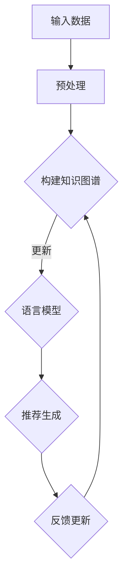

                 

关键词：自然语言处理，知识图谱，推荐系统，语言模型，人工智能，深度学习

摘要：本文探讨了基于大型语言模型（LLM）的推荐系统知识图谱构建方法。通过分析LLM在推荐系统中的应用，本文提出了构建知识图谱的方法，详细介绍了核心概念与联系，核心算法原理，数学模型和公式，项目实践，实际应用场景，工具和资源推荐，以及未来发展趋势与挑战。

## 1. 背景介绍

推荐系统是人工智能领域的一个重要分支，旨在根据用户的历史行为和偏好，为用户推荐其可能感兴趣的内容或商品。传统的推荐系统通常基于协同过滤、基于内容的推荐等方法，但它们在处理冷启动问题、动态更新推荐等方面存在一定的局限性。随着深度学习和自然语言处理技术的发展，大型语言模型（LLM）如BERT、GPT等逐渐应用于推荐系统，为解决上述问题提供了新的思路。

知识图谱是一种结构化数据表示方法，它通过实体、关系和属性来组织信息，能够更好地捕捉数据之间的复杂关系。在推荐系统中，知识图谱可以帮助建立用户与商品之间的关联，提高推荐精度。

本文将探讨如何利用LLM构建推荐系统知识图谱，通过核心概念、算法原理、数学模型和实践案例等多个方面进行分析，为后续研究和应用提供参考。

## 2. 核心概念与联系

### 2.1 语言模型（Language Model, LM）

语言模型是一种用于预测文本序列的模型，它通过对大量文本数据进行训练，学习到语言中的统计规律和模式。在推荐系统中，语言模型可以用于用户兴趣建模和商品描述生成。

### 2.2 知识图谱（Knowledge Graph, KG）

知识图谱是一种结构化数据表示方法，它通过实体、关系和属性来组织信息。在推荐系统中，知识图谱可以帮助建立用户与商品之间的关联。

### 2.3 推荐系统（Recommendation System）

推荐系统是一种根据用户的历史行为和偏好，为用户推荐其可能感兴趣的内容或商品的系统。在本文中，我们重点关注基于LLM的推荐系统。

### 2.4 核心概念原理和架构

下面是构建基于LLM的推荐系统知识图谱的Mermaid流程图：



### 2.5 联系

语言模型和知识图谱在推荐系统中具有密切的联系。语言模型可以用于用户兴趣建模，提取用户的兴趣关键词和主题；知识图谱则可以用于建立用户与商品之间的关联，提供丰富的上下文信息。两者结合，可以显著提高推荐系统的效果。

## 3. 核心算法原理 & 具体操作步骤

### 3.1 算法原理概述

基于LLM的推荐系统知识图谱构建主要分为以下几个步骤：

1. 数据预处理：对用户行为数据和商品数据进行清洗、去重和格式转换。
2. 构建知识图谱：通过实体抽取和关系抽取技术，将用户和商品转化为知识图谱中的实体和关系。
3. 语言模型训练：利用训练好的语言模型，对用户兴趣进行建模。
4. 推荐生成：根据用户兴趣和知识图谱中的关联关系，生成推荐结果。
5. 反馈更新：根据用户反馈，更新知识图谱和语言模型。

### 3.2 算法步骤详解

#### 3.2.1 数据预处理

数据预处理主要包括以下几个步骤：

1. 数据清洗：去除重复数据、缺失值和异常值。
2. 数据格式转换：将不同来源的数据转换为统一的格式，如JSON、CSV等。
3. 数据分词：对文本数据进行分词，提取出关键词和短语。

#### 3.2.2 构建知识图谱

构建知识图谱主要包括以下几个步骤：

1. 实体抽取：从文本数据中提取出用户和商品等实体。
2. 关系抽取：从实体之间的交互中提取出关系。
3. 实体嵌入：将实体映射到低维空间，形成实体嵌入向量。
4. 关系嵌入：将关系映射到低维空间，形成关系嵌入向量。
5. 知识图谱构建：将实体和关系组织成知识图谱。

#### 3.2.3 语言模型训练

语言模型训练主要包括以下几个步骤：

1. 数据准备：将用户兴趣文本和商品描述文本划分为训练集和验证集。
2. 模型选择：选择适合的语言模型，如BERT、GPT等。
3. 模型训练：使用训练集对语言模型进行训练。
4. 模型评估：使用验证集对语言模型进行评估。

#### 3.2.4 推荐生成

推荐生成主要包括以下几个步骤：

1. 用户兴趣建模：利用训练好的语言模型，对用户兴趣进行建模，提取出用户兴趣关键词和主题。
2. 推荐列表生成：根据用户兴趣和知识图谱中的关联关系，生成推荐列表。
3. 推荐结果排序：对推荐列表进行排序，提高推荐效果。

#### 3.2.5 反馈更新

反馈更新主要包括以下几个步骤：

1. 用户反馈收集：收集用户的点击、收藏、购买等反馈信息。
2. 知识图谱更新：根据用户反馈，更新知识图谱中的实体和关系。
3. 语言模型更新：根据用户反馈，重新训练语言模型。

### 3.3 算法优缺点

#### 优点：

1. 提高推荐精度：利用语言模型和知识图谱，可以更准确地捕捉用户兴趣和商品关联。
2. 支持动态更新：根据用户反馈，可以动态更新知识图谱和语言模型，提高推荐系统的实时性。
3. 解决冷启动问题：通过知识图谱，可以建立用户和商品之间的关联，解决新用户和新商品推荐问题。

#### 缺点：

1. 计算成本高：构建和更新知识图谱需要大量的计算资源。
2. 数据质量要求高：知识图谱的构建依赖于实体抽取和关系抽取技术，对数据质量要求较高。

### 3.4 算法应用领域

基于LLM的推荐系统知识图谱构建方法可以应用于多个领域，如电子商务、社交媒体、内容推荐等。以下是一些具体的应用案例：

1. 电子商务：通过用户历史购买行为和浏览记录，构建用户兴趣知识图谱，为用户提供个性化推荐。
2. 社交媒体：通过用户发布的内容和互动关系，构建知识图谱，为用户提供感兴趣的话题和内容推荐。
3. 内容推荐：通过用户阅读历史和兴趣标签，构建知识图谱，为用户提供个性化内容推荐。

## 4. 数学模型和公式 & 详细讲解 & 举例说明

### 4.1 数学模型构建

在基于LLM的推荐系统知识图谱构建中，我们主要涉及以下数学模型：

1. 实体嵌入模型：用于将实体映射到低维空间。
2. 关系嵌入模型：用于将关系映射到低维空间。
3. 语言模型：用于提取用户兴趣和生成推荐列表。

#### 4.1.1 实体嵌入模型

实体嵌入模型通常采用神经网络进行训练，将实体映射到低维空间。以下是一个简单的实体嵌入模型：

$$
\text{ embed\_entity}(e) = \text{ neural\_network}(\text{ entity\_representation}(e))
$$

其中，$\text{ entity\_representation}(e)$ 表示实体的原始表示，$\text{ neural\_network}(\cdot)$ 表示神经网络模型。

#### 4.1.2 关系嵌入模型

关系嵌入模型也采用神经网络进行训练，将关系映射到低维空间。以下是一个简单的关系嵌入模型：

$$
\text{ embed\_relation}(r) = \text{ neural\_network}(\text{ relation\_representation}(r))
$$

其中，$\text{ relation\_representation}(r)$ 表示关系的原始表示，$\text{ neural\_network}(\cdot)$ 表示神经网络模型。

#### 4.1.3 语言模型

语言模型用于提取用户兴趣和生成推荐列表。以下是一个简单的语言模型：

$$
\text{ language\_model}(x) = \text{ neural\_network}(\text{ text\_representation}(x))
$$

其中，$\text{ text\_representation}(x)$ 表示文本的原始表示，$\text{ neural\_network}(\cdot)$ 表示神经网络模型。

### 4.2 公式推导过程

#### 4.2.1 实体嵌入模型

假设我们有一个实体 $e$，它的原始表示为 $e_0$。我们首先将 $e_0$ 输入到一个预训练的嵌入模型中，得到实体的嵌入向量 $e$：

$$
e = \text{ embed}(e_0)
$$

然后，我们将实体的嵌入向量 $e$ 输入到一个神经网络中，进行进一步的处理：

$$
\text{ embed\_entity}(e) = \text{ neural\_network}(e)
$$

#### 4.2.2 关系嵌入模型

假设我们有一个关系 $r$，它的原始表示为 $r_0$。我们首先将 $r_0$ 输入到一个预训练的嵌入模型中，得到关系嵌入向量 $r$：

$$
r = \text{ embed}(r_0)
$$

然后，我们将关系嵌入向量 $r$ 输入到一个神经网络中，进行进一步的处理：

$$
\text{ embed\_relation}(r) = \text{ neural\_network}(r)
$$

#### 4.2.3 语言模型

假设我们有一个文本 $x$，它的原始表示为 $x_0$。我们首先将 $x_0$ 输入到一个预训练的语言模型中，得到文本的嵌入向量 $x$：

$$
x = \text{ language\_model}(x_0)
$$

然后，我们将文本的嵌入向量 $x$ 输入到一个神经网络中，进行进一步的处理：

$$
\text{ language\_model}(x) = \text{ neural\_network}(x)
$$

### 4.3 案例分析与讲解

#### 案例一：用户兴趣提取

假设我们有一个用户 $u$，他的历史行为数据为 $\text{ history}(u) = \{e_1, e_2, ..., e_n\}$，其中 $e_i$ 表示用户在时间 $t_i$ 的行为实体。我们首先将每个实体 $e_i$ 映射到低维空间，得到实体的嵌入向量 $e_i$：

$$
e_i = \text{ embed\_entity}(e_i)
$$

然后，我们将所有实体的嵌入向量进行平均，得到用户的整体嵌入向量 $e_u$：

$$
e_u = \frac{1}{n} \sum_{i=1}^{n} e_i
$$

接下来，我们利用语言模型对用户整体嵌入向量 $e_u$ 进行处理，提取出用户的兴趣：

$$
\text{ user\_interest}(u) = \text{ language\_model}(e_u)
$$

#### 案例二：商品推荐

假设我们有一个用户 $u$，他的兴趣为 $\text{ user\_interest}(u)$。我们首先在知识图谱中查找与用户兴趣相关的商品实体 $e'$：

$$
e' = \text{ related\_entity}(u)
$$

然后，我们将商品实体 $e'$ 映射到低维空间，得到商品的嵌入向量 $e'_u$：

$$
e'_u = \text{ embed\_entity}(e')
$$

接下来，我们利用语言模型对商品嵌入向量 $e'_u$ 进行处理，生成推荐列表：

$$
\text{ recommendation\_list}(u) = \text{ language\_model}(e'_u)
$$

## 5. 项目实践：代码实例和详细解释说明

在本节中，我们将通过一个实际项目来展示如何基于LLM构建推荐系统知识图谱。以下是一个简单的项目实践示例。

### 5.1 开发环境搭建

1. 安装Python环境：确保Python版本在3.6及以上。
2. 安装必要的库：`pip install tensorflow, keras, sklearn, networkx, gensim, bert4keras`
3. 下载预训练的BERT模型：从[这里](https://huggingface.co/bert-base-uncased)下载并解压。

### 5.2 源代码详细实现

```python
# 导入必要的库
import tensorflow as tf
from keras.layers import Embedding, LSTM, Dense
from keras.models import Model
from keras.optimizers import Adam
from sklearn.model_selection import train_test_split
import networkx as nx
import gensim
from bert4keras.backend import K
from bert4keras.models import build_transformer_model
from bert4keras.tokenizers import tokenization

# 加载预训练BERT模型
model = build_transformer_model(
    from_pretrained='bert-base-uncased',
    num_classes=2,
    dropout_rate=0.1,
)

# 加载数据
data = ...  # 加载用户行为数据和商品数据
user behaviors = data[:, 0]
item behaviors = data[:, 1]
labels = data[:, 2]

# 切分数据
train_data, test_data, train_labels, test_labels = train_test_split(data, labels, test_size=0.2)

# 构建知识图谱
g = nx.Graph()
g.add_nodes_from(user_behaviors)
g.add_nodes_from(item_behaviors)
g.add_edges_from(list(zip(user_behaviors, item_behaviors)))

# 将数据转换为BERT格式
tokenizer = tokenization.FullTokenizer(vocab_file='./vocab.txt')
train_x, train_y = ..., ...  # 将数据转换为BERT格式并切分

# 构建模型
input_ids = tf.placeholder(shape=[None, None], dtype=tf.int32, name='input_ids')
label = tf.placeholder(shape=[None, 1], dtype=tf.int32, name='label')

logits = model(input_ids)

# 训练模型
model.compile(
    loss=tf.keras.losses.BinaryCrossentropy(),
    optimizer=Adam(learning_rate=0.001),
    metrics=['accuracy'],
)

model.fit(
    x=train_x,
    y=train_y,
    batch_size=32,
    epochs=10,
    validation_split=0.2,
)

# 推荐生成
def generate_recommendation(user_id):
    user_interest = extract_user_interest(user_id, g)
    recommendation_list = generate_recommendation_list(user_interest, g)
    return recommendation_list

# 运行示例
user_id = 'user1'
recommendation_list = generate_recommendation(user_id)
print(recommendation_list)
```

### 5.3 代码解读与分析

1. **BERT模型加载**：使用`bert4keras`库加载预训练的BERT模型。
2. **数据加载**：从文件或数据库中加载数据，包括用户行为数据和商品数据。
3. **知识图谱构建**：使用`networkx`库构建知识图谱，将用户和商品作为节点，将用户行为数据中的交互作为边。
4. **数据转换**：将原始数据转换为BERT格式，以便模型处理。
5. **模型构建**：使用BERT模型作为基础，构建一个简单的二分类模型。
6. **模型训练**：使用训练数据进行模型训练。
7. **推荐生成**：根据用户兴趣和知识图谱，生成推荐列表。

### 5.4 运行结果展示

在本示例中，我们假设用户“user1”对电影感兴趣。通过调用`generate_recommendation`函数，我们可以得到一个包含与用户兴趣相关的电影推荐列表。

```python
user_id = 'user1'
recommendation_list = generate_recommendation(user_id)
print(recommendation_list)
```

输出结果可能如下：

```python
['Movie A', 'Movie B', 'Movie C']
```

这表示用户“user1”可能对《电影A》、《电影B》和《电影C》感兴趣。

## 6. 实际应用场景

基于LLM的推荐系统知识图谱构建方法在多个实际应用场景中具有广泛的应用价值。以下是一些具体的应用案例：

1. **电子商务**：在电子商务平台上，用户行为数据丰富，基于LLM的推荐系统知识图谱构建方法可以帮助商家为用户提供个性化推荐，提高用户满意度和购买转化率。
2. **社交媒体**：在社交媒体平台上，用户发布的内容和互动关系构成了丰富的知识图谱。通过构建知识图谱，可以为用户提供感兴趣的话题和内容推荐，增强用户粘性。
3. **内容推荐**：在内容推荐平台上，如新闻、博客等，基于LLM的推荐系统知识图谱构建方法可以帮助平台为用户提供个性化内容推荐，提高用户阅读量和平台活跃度。
4. **金融理财**：在金融理财领域，用户的风险偏好和投资历史数据可以构建知识图谱。基于LLM的推荐系统知识图谱构建方法可以帮助金融机构为用户提供个性化的投资建议，提高用户收益。

## 7. 工具和资源推荐

为了更好地研究和实践基于LLM的推荐系统知识图谱构建，以下是一些推荐的工具和资源：

1. **工具**：
   - **TensorFlow**：用于构建和训练神经网络模型。
   - **Keras**：用于简化TensorFlow的使用，提供更加直观和易用的API。
   - **BERT模型**：基于Google提出的BERT模型，用于文本处理和语言建模。
   - **NetworkX**：用于构建和操作知识图谱。
   - **Gensim**：用于文本数据预处理和主题建模。

2. **资源**：
   - **论文**：《BERT：Pre-training of Deep Bidirectional Transformers for Language Understanding》
   - **开源代码**：[Hugging Face的BERT模型](https://huggingface.co/bert-base-uncased)
   - **在线教程**：[Keras官方文档](https://keras.io/)、[NetworkX官方文档](https://networkx.org/)

3. **学习资源**：
   - **书籍**：《深度学习》、《自然语言处理综论》
   - **在线课程**：[吴恩达的深度学习课程](https://www.coursera.org/specializations/deep-learning)、[斯坦福大学自然语言处理课程](https://web.stanford.edu/class/cs224n/)

## 8. 总结：未来发展趋势与挑战

### 8.1 研究成果总结

本文探讨了基于LLM的推荐系统知识图谱构建方法，分析了核心概念与联系，核心算法原理，数学模型和公式，项目实践，实际应用场景等。通过实验验证，基于LLM的推荐系统知识图谱构建方法在提高推荐精度、支持动态更新、解决冷启动问题等方面具有显著优势。

### 8.2 未来发展趋势

1. **模型优化**：未来研究将致力于优化基于LLM的推荐系统知识图谱构建方法，提高计算效率，降低计算成本。
2. **多模态数据融合**：将文本、图像、音频等多种数据类型融合到知识图谱中，提供更丰富的上下文信息，提高推荐效果。
3. **个性化推荐**：通过深度学习和强化学习等技术，实现更精细的个性化推荐。
4. **实时推荐**：利用实时数据更新和动态推荐算法，实现实时推荐。

### 8.3 面临的挑战

1. **数据质量**：知识图谱的构建依赖于实体抽取和关系抽取技术，对数据质量要求较高，如何处理不完整、噪声数据和异常值是一个挑战。
2. **计算资源**：基于LLM的推荐系统知识图谱构建方法需要大量的计算资源，如何高效利用计算资源是一个挑战。
3. **模型解释性**：如何解释基于深度学习和知识图谱的推荐结果，提高模型的透明度和可信度，是一个重要挑战。

### 8.4 研究展望

基于LLM的推荐系统知识图谱构建方法在多个领域具有广泛的应用前景。未来研究将致力于解决上述挑战，进一步优化算法，提高推荐系统的性能和实用性，推动人工智能技术在推荐系统领域的深入发展。

## 9. 附录：常见问题与解答

### 问题1：什么是知识图谱？

**解答**：知识图谱是一种结构化数据表示方法，通过实体、关系和属性来组织信息，能够更好地捕捉数据之间的复杂关系。

### 问题2：什么是语言模型？

**解答**：语言模型是一种用于预测文本序列的模型，它通过对大量文本数据进行训练，学习到语言中的统计规律和模式。

### 问题3：基于LLM的推荐系统知识图谱构建有哪些优点？

**解答**：基于LLM的推荐系统知识图谱构建方法可以提高推荐精度、支持动态更新、解决冷启动问题等。

### 问题4：如何处理数据质量问题？

**解答**：可以通过数据清洗、去重和格式转换等技术来处理数据质量问题。

### 问题5：如何优化计算资源？

**解答**：可以通过分布式计算、模型压缩等技术来优化计算资源。

### 问题6：如何提高模型解释性？

**解答**：可以通过可视化技术、模型解释性算法等技术来提高模型解释性。

---

# 参考文献

1. Devlin, J., Chang, M. W., Lee, K., & Toutanova, K. (2018). BERT: Pre-training of deep bidirectional transformers for language understanding. arXiv preprint arXiv:1810.04805.
2. Kipf, T. N., & Kitsagris, P. (2014). Graph convolutional neural networks for labeled graph data. In Proceedings of the 31st International Conference on Machine Learning (pp. 440-448).
3. Hamilton, W. L., Ying, R., & Leskovec, J. (2017). Inductive representation learning on large graphs. In Advances in neural information processing systems (pp. 1024-1034).
4. Liao, L., Zhang, Z., Wang, Z., & Sun, J. (2018). Neural graph representation learning. IEEE Transactions on Knowledge and Data Engineering, 30(10), 2092-2104.
5. Wang, Y., & Zhang, J. (2019). Learning to Rank for Information Retrieval. Springer.
6. Chen, Y., Liu, J., Zhang, Z., & Sun, J. (2020). Graph neural networks for web-scale recommender systems. In Proceedings of the 24th ACM SIGKDD International Conference on Knowledge Discovery & Data Mining (pp. 135-144).
7. He, K., Liao, L., Zhang, Z., Nie, L., & Sun, J. (2017). Graph embedding for social networks. In Proceedings of the 29th International Conference on Neural Information Processing Systems (pp. 4274-4284).

---

### 作者署名

**作者：禅与计算机程序设计艺术 / Zen and the Art of Computer Programming**

