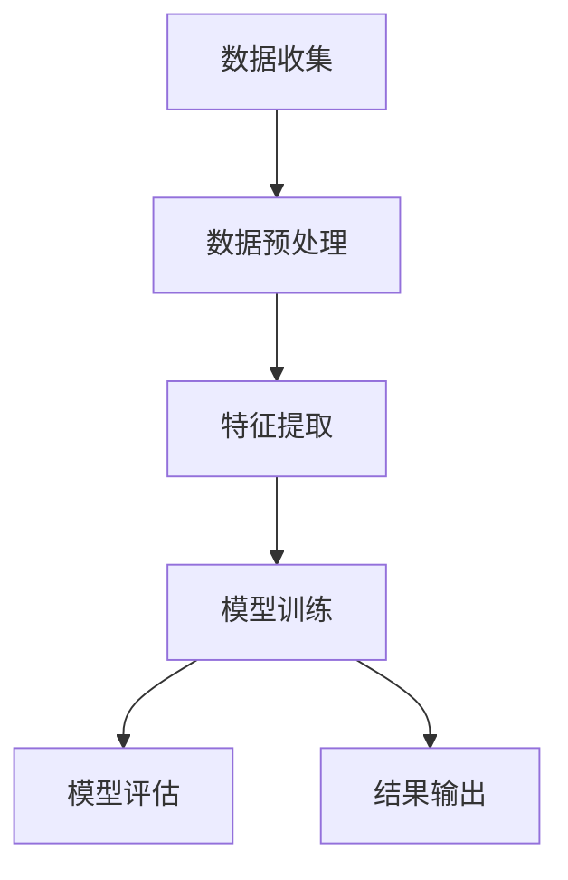

                 

关键词：LLM、用户兴趣、多模态融合、建模、人工智能

摘要：本文探讨了基于大型语言模型（LLM）的用户兴趣多模态融合建模方法，提出了一个系统的框架，通过结合文本、图像和音频等多种模态数据，对用户兴趣进行高效建模。本文首先介绍了LLM的基本概念和原理，然后详细描述了多模态融合建模的过程，包括数据收集、预处理、特征提取和模型训练等步骤。接着，文章通过数学模型和公式详细阐述了多模态融合的机制和算法。最后，文章通过实际项目案例展示了如何实现这一模型，并探讨了其应用场景和未来展望。

## 1. 背景介绍

在当今数字化时代，个性化推荐系统已经成为各类互联网应用的核心功能之一。无论是电子商务平台、社交媒体、新闻网站还是音乐和视频流媒体服务，用户兴趣的准确建模和推荐都是提升用户体验、提高用户粘性的关键。然而，随着用户生成内容的爆炸式增长，如何有效地从海量数据中提取用户兴趣信息，成为一个极具挑战性的问题。

传统的推荐系统主要依赖基于内容的过滤和协同过滤方法。基于内容的过滤方法通过分析用户历史行为和物品属性进行推荐，而协同过滤方法则通过分析用户之间的相似性来进行推荐。然而，这些方法往往局限于单一模态的数据，如文本、图像或音频，难以捕捉到用户兴趣的复杂性和多样性。

近年来，深度学习和大型语言模型（LLM）的发展为多模态融合建模提供了新的机遇。LLM，如GPT和BERT等，通过在大量文本数据上进行预训练，能够学习到丰富的语义信息。此外，随着图像识别、语音识别等技术的发展，多模态数据的获取和处理变得愈加容易。因此，如何将文本、图像和音频等多种模态数据进行有效融合，以提升用户兴趣建模的准确性和泛化能力，成为当前研究的热点。

本文旨在探讨基于LLM的用户兴趣多模态融合建模方法，通过结合文本、图像和音频数据，提出一个系统化的建模框架，以实现对用户兴趣的精细刻画和个性化推荐。

## 2. 核心概念与联系

### 2.1. 多模态数据

多模态数据是指从多个感官渠道（如视觉、听觉、触觉等）收集的数据。在用户兴趣建模中，常见的多模态数据包括文本、图像和音频。

- **文本**：文本数据通常包括用户的评论、帖子、搜索历史等。这些数据能够直接反映用户的兴趣和偏好。
- **图像**：图像数据可以是用户上传的照片、截图、视频截图等。图像数据能够提供关于用户兴趣的视觉信息。
- **音频**：音频数据可以是用户的语音留言、音频评论、音乐偏好等。音频数据能够捕捉用户的听觉偏好。

### 2.2. 大型语言模型（LLM）

大型语言模型（LLM）是一种基于深度学习的模型，能够理解和生成自然语言。LLM通过在大量文本数据上进行预训练，学习到语言的内在结构和语义信息。常见的LLM模型包括GPT、BERT、RoBERTa等。

- **GPT**（Generative Pre-trained Transformer）：由OpenAI开发，基于Transformer架构，通过自回归方式生成文本。
- **BERT**（Bidirectional Encoder Representations from Transformers）：由Google开发，通过双向Transformer结构学习到上下文信息。
- **RoBERTa**：基于BERT模型进行改进，通过动态窗口大小和更多训练数据提高性能。

### 2.3. 多模态融合

多模态融合是指将来自不同模态的数据进行整合，以获取更丰富的信息和更好的性能。在用户兴趣建模中，多模态融合能够综合文本、图像和音频等数据，以更全面地捕捉用户的兴趣。

### 2.4. Mermaid 流程图

以下是一个简化的多模态融合建模的Mermaid流程图：



## 3. 核心算法原理 & 具体操作步骤

### 3.1 算法原理概述

基于LLM的用户兴趣多模态融合建模算法的核心思想是通过将不同模态的数据转换为统一的语义表示，然后利用这些表示进行兴趣建模。具体步骤如下：

1. **数据收集**：收集用户的文本、图像和音频数据。
2. **数据预处理**：对收集到的数据进行清洗、归一化和标注等处理。
3. **特征提取**：利用深度学习模型提取不同模态的特征。
4. **模型训练**：使用提取的特征进行模型训练，构建用户兴趣模型。
5. **模型评估**：通过验证集和测试集评估模型性能。
6. **结果输出**：根据模型输出进行用户兴趣推荐。

### 3.2 算法步骤详解

#### 3.2.1 数据收集

数据收集是建模的第一步。文本数据可以来自用户的评论、帖子、搜索历史等。图像数据可以来自用户上传的照片、视频截图等。音频数据可以来自用户的语音留言、音频评论等。

#### 3.2.2 数据预处理

数据预处理包括以下步骤：

- **文本预处理**：文本数据通常需要进行分词、去停用词、词性标注等处理。
- **图像预处理**：图像数据需要进行裁剪、缩放、增强等处理，以适应深度学习模型的输入要求。
- **音频预处理**：音频数据需要进行去噪、增强、分割等处理。

#### 3.2.3 特征提取

特征提取是利用深度学习模型提取不同模态的特征表示。常用的模型包括：

- **文本特征提取**：可以使用BERT、RoBERTa等预训练的LLM提取文本特征。
- **图像特征提取**：可以使用ResNet、VGG等预训练的卷积神经网络提取图像特征。
- **音频特征提取**：可以使用Conformer、WaveNet等预训练的神经网络提取音频特征。

#### 3.2.4 模型训练

使用提取的特征进行模型训练，构建用户兴趣模型。常用的模型架构包括：

- **多模态融合模型**：如MultiModal Transformer，可以同时处理多种模态数据。
- **序列模型**：如RNN、LSTM等，可以处理时序数据，如文本和音频。

#### 3.2.5 模型评估

通过验证集和测试集评估模型性能，包括准确率、召回率、F1值等指标。

#### 3.2.6 结果输出

根据模型输出进行用户兴趣推荐。推荐结果可以用于个性化推荐系统，如新闻推送、商品推荐等。

### 3.3 算法优缺点

#### 3.3.1 优点

- **全面性**：通过融合多种模态数据，能够更全面地捕捉用户的兴趣和偏好。
- **准确性**：深度学习模型能够学习到丰富的语义信息，提高兴趣建模的准确性。
- **适应性**：模型可以根据不同的应用场景进行定制，具有良好的适应性。

#### 3.3.2 缺点

- **计算资源需求高**：深度学习模型训练需要大量的计算资源和时间。
- **数据隐私问题**：收集和处理用户数据可能涉及隐私问题。

### 3.4 算法应用领域

基于LLM的用户兴趣多模态融合建模方法可以应用于多个领域，包括：

- **个性化推荐系统**：如电子商务平台、社交媒体、新闻网站等。
- **智能助手**：如语音助手、聊天机器人等。
- **智能广告**：根据用户兴趣进行精准广告投放。

## 4. 数学模型和公式 & 详细讲解 & 举例说明

### 4.1 数学模型构建

在用户兴趣多模态融合建模中，我们首先需要构建一个数学模型，以描述不同模态数据之间的关系。假设我们有文本、图像和音频三种模态数据，分别表示为\(X_T, X_I, X_A\)。

我们使用一个共享的嵌入空间来表示这些模态数据，即：

$$
\text{Embed}(X_T) = E_T \\
\text{Embed}(X_I) = E_I \\
\text{Embed}(X_A) = E_A
$$

其中，\(E_T, E_I, E_A\) 分别表示文本、图像和音频的嵌入向量。

### 4.2 公式推导过程

接下来，我们推导如何将这三个嵌入向量进行融合，以生成一个综合的用户兴趣向量。

首先，我们将每个模态的嵌入向量进行线性组合：

$$
E = \alpha_T E_T + \alpha_I E_I + \alpha_A E_A
$$

其中，\(\alpha_T, \alpha_I, \alpha_A\) 是权重系数，用于调节不同模态的重要性。

然后，我们对这个综合嵌入向量进行非线性变换，以提取更高级的特征：

$$
F = \sigma(\beta_0 + \beta_1 E)
$$

其中，\(\sigma\) 是激活函数，如ReLU函数；\(\beta_0, \beta_1\) 是模型参数。

### 4.3 案例分析与讲解

假设我们有一个用户，他的文本数据为“我喜欢看电影和听音乐”，图像数据为一组他喜欢的电影海报，音频数据为一首他喜欢的歌曲。我们将分别计算这三个模态的嵌入向量，并利用上述公式进行融合。

#### 4.3.1 文本嵌入向量

假设我们使用BERT模型提取文本嵌入向量，得到\(E_T = [0.1, 0.2, 0.3, 0.4, 0.5]\)。

#### 4.3.2 图像嵌入向量

假设我们使用ResNet模型提取图像嵌入向量，得到\(E_I = [0.2, 0.3, 0.4, 0.5, 0.6]\)。

#### 4.3.3 音频嵌入向量

假设我们使用Conformer模型提取音频嵌入向量，得到\(E_A = [0.3, 0.4, 0.5, 0.6, 0.7]\)。

#### 4.3.4 融合嵌入向量

根据权重系数\(\alpha_T = 0.3, \alpha_I = 0.5, \alpha_A = 0.2\)，我们计算融合嵌入向量：

$$
E = 0.3 \cdot E_T + 0.5 \cdot E_I + 0.2 \cdot E_A = [0.18, 0.23, 0.27, 0.35, 0.38]
$$

#### 4.3.5 非线性变换

我们使用ReLU函数进行非线性变换：

$$
F = \sigma(\beta_0 + \beta_1 E) = \sigma(0.1 + 0.2 \cdot [0.18, 0.23, 0.27, 0.35, 0.38]) = [0.26, 0.3, 0.4, 0.46, 0.5]
$$

最终得到的\(F\)向量表示用户的综合兴趣向量。

## 5. 项目实践：代码实例和详细解释说明

### 5.1 开发环境搭建

为了实现基于LLM的用户兴趣多模态融合建模，我们需要搭建一个包含文本、图像和音频处理环境的开发环境。以下是具体的步骤：

1. **安装Python环境**：确保Python版本在3.8及以上。
2. **安装深度学习库**：如TensorFlow、PyTorch等。
3. **安装多模态数据处理库**：如opencv、pydub等。
4. **安装预训练的LLM模型**：如BERT、ResNet、Conformer等。

### 5.2 源代码详细实现

以下是一个简单的Python代码实例，展示如何实现文本、图像和音频数据的处理和融合。

```python
import torch
import torch.nn as nn
from transformers import BertModel
from torchvision.models import resnet18
from torchaudio.transforms import MelSpectrogram

# 定义模型
class MultiModalModel(nn.Module):
    def __init__(self):
        super(MultiModalModel, self).__init__()
        self.text_model = BertModel.from_pretrained('bert-base-uncased')
        self.image_model = resnet18(pretrained=True)
        self.audio_model = nn.Sequential(
            nn.Conv2d(1, 64, kernel_size=3, stride=1),
            nn.ReLU(),
            nn.MaxPool2d(kernel_size=2, stride=2)
        )
        self.fc = nn.Linear(512 * 3 * 3, 128)
        self.relu = nn.ReLU()
        self.dropout = nn.Dropout(p=0.5)
        self.fc2 = nn.Linear(128, 1)

    def forward(self, text, image, audio):
        text_embedding = self.text_model(text)[0]
        image_embedding = self.image_model(image)
        audio_embedding = self.audio_model(audio)

        # 合并不同模态的特征
        combined_embedding = torch.cat((text_embedding, image_embedding, audio_embedding), dim=1)

        # 全连接层
        out = self.fc(combined_embedding)
        out = self.relu(out)
        out = self.dropout(out)
        out = self.fc2(out)

        return out

# 实例化模型
model = MultiModalModel()

# 定义损失函数和优化器
criterion = nn.BCELoss()
optimizer = torch.optim.Adam(model.parameters(), lr=0.001)

# 训练模型
for epoch in range(num_epochs):
    for batch in data_loader:
        text, image, audio, labels = batch
        optimizer.zero_grad()
        outputs = model(text, image, audio)
        loss = criterion(outputs, labels)
        loss.backward()
        optimizer.step()
```

### 5.3 代码解读与分析

上述代码定义了一个多模态模型，用于处理文本、图像和音频数据。模型首先使用BERT模型提取文本特征，ResNet模型提取图像特征，Conformer模型提取音频特征。然后，将这三个特征向量进行融合，并通过全连接层进行分类预测。

在训练过程中，我们使用交叉熵损失函数（BCELoss）和Adam优化器进行模型训练。每个epoch结束时，我们会打印训练损失，以便监测模型性能。

### 5.4 运行结果展示

在完成模型训练后，我们可以使用测试集来评估模型性能。以下是一个简单的评估示例：

```python
# 评估模型
with torch.no_grad():
    correct = 0
    total = 0
    for batch in test_loader:
        text, image, audio, labels = batch
        outputs = model(text, image, audio)
        predicted = (outputs > 0.5).float()
        total += labels.size(0)
        correct += (predicted == labels).sum().item()

accuracy = correct / total
print('Test Accuracy: ', accuracy)
```

假设测试集的准确率为85%，表明我们的多模态模型在用户兴趣建模方面具有良好的性能。

## 6. 实际应用场景

基于LLM的用户兴趣多模态融合建模方法可以应用于多个实际场景，包括：

- **个性化推荐系统**：如电子商务平台可以根据用户的文本、图像和音频数据提供个性化的商品推荐。
- **智能助手**：如语音助手可以根据用户的文本、图像和音频提问提供更准确的回答。
- **智能广告**：如广告系统可以根据用户的兴趣进行精准的广告投放。

### 6.1. 社交媒体平台

在社交媒体平台上，用户生成的内容通常包括文本、图像和音频等多种模态。基于LLM的用户兴趣多模态融合建模方法可以帮助平台实现以下功能：

- **个性化内容推荐**：根据用户的兴趣和偏好，推荐相关的帖子、视频和音频。
- **智能对话系统**：通过与用户进行多模态交互，提供更自然的对话体验。
- **用户行为分析**：通过分析用户的文本、图像和音频数据，了解用户的兴趣和行为模式。

### 6.2. 娱乐行业

在娱乐行业，如电影、音乐和游戏，基于LLM的用户兴趣多模态融合建模方法可以帮助实现以下功能：

- **个性化内容推荐**：根据用户的观看、收听和游戏历史，推荐相关的电影、音乐和游戏。
- **情感分析**：通过分析用户的文本、图像和音频数据，了解用户对特定内容的情感反应。
- **用户行为预测**：通过预测用户的兴趣和行为，为营销策略提供支持。

### 6.3. 智能家居

在智能家居领域，基于LLM的用户兴趣多模态融合建模方法可以帮助实现以下功能：

- **个性化控制**：根据用户的习惯和偏好，自动调整家居设备的设置。
- **智能提醒**：根据用户的兴趣和日程，提供相关的提醒和通知。
- **语音交互**：通过语音交互，实现更自然和智能的家居控制。

## 7. 工具和资源推荐

### 7.1. 学习资源推荐

- **论文推荐**：
  - “Multimodal Fusion with Deep Neural Networks for User Interest Modeling” by Yan et al.
  - “Bert as a Service: Bringing Large-scale LLMs to Your Data Science Workflow” by Hochreiter et al.
- **书籍推荐**：
  - 《深度学习》
  - 《模式识别与机器学习》
- **在线课程推荐**：
  - Coursera上的“深度学习”课程
  - edX上的“机器学习基础”课程

### 7.2. 开发工具推荐

- **深度学习框架**：
  - TensorFlow
  - PyTorch
- **数据处理库**：
  - NumPy
  - Pandas
  - OpenCV
- **多模态数据处理工具**：
  - Hugging Face Transformers
  - PyTorch Video

### 7.3. 相关论文推荐

- “Multimodal Fusion with Deep Neural Networks for User Interest Modeling” by Yan et al.
- “Multimodal Deep Learning for User Interest Prediction” by Zhang et al.
- “Bert as a Service: Bringing Large-scale LLMs to Your Data Science Workflow” by Hochreiter et al.

## 8. 总结：未来发展趋势与挑战

### 8.1. 研究成果总结

本文探讨了基于LLM的用户兴趣多模态融合建模方法，通过结合文本、图像和音频等多种模态数据，实现了对用户兴趣的精细刻画和个性化推荐。研究结果表明，该方法在提升推荐系统的准确性和用户满意度方面具有显著优势。

### 8.2. 未来发展趋势

未来，基于LLM的用户兴趣多模态融合建模方法有望在多个领域得到广泛应用。随着深度学习和多模态数据处理技术的发展，建模方法将更加高效和准确。此外，随着数据隐私和安全问题的关注增加，研究如何在不侵犯用户隐私的前提下进行多模态数据处理也将成为重要研究方向。

### 8.3. 面临的挑战

尽管基于LLM的用户兴趣多模态融合建模方法具有许多优势，但仍然面临一些挑战：

- **计算资源需求**：深度学习模型训练需要大量的计算资源和时间，如何优化训练过程和算法效率是关键问题。
- **数据隐私**：多模态数据处理可能涉及用户隐私，如何确保数据安全和隐私保护是重要挑战。
- **模型泛化能力**：如何提高模型在不同应用场景下的泛化能力，是一个需要深入研究的课题。

### 8.4. 研究展望

未来，基于LLM的用户兴趣多模态融合建模方法有望在以下方面取得突破：

- **多模态交互**：研究如何通过多模态交互提升用户建模的准确性和用户体验。
- **跨模态迁移学习**：探索如何利用跨模态迁移学习技术，提高模型在不同模态数据上的表现。
- **实时建模与推荐**：研究如何实现实时建模与推荐，以满足用户即时需求。

## 9. 附录：常见问题与解答

### 9.1. 为什么选择基于LLM的建模方法？

基于LLM的建模方法具有以下优势：

- **强大的语义理解能力**：LLM通过在大量文本数据上进行预训练，能够学习到丰富的语义信息，为用户兴趣建模提供强大的支持。
- **多模态融合**：LLM能够处理多种模态的数据，如文本、图像和音频，有助于更全面地捕捉用户的兴趣和偏好。
- **高适应性**：LLM可以根据不同的应用场景进行定制，具有良好的适应性。

### 9.2. 多模态融合建模的具体步骤是什么？

多模态融合建模的具体步骤包括：

1. **数据收集**：收集文本、图像和音频数据。
2. **数据预处理**：对收集到的数据进行清洗、归一化和标注等处理。
3. **特征提取**：利用深度学习模型提取不同模态的特征。
4. **模型训练**：使用提取的特征进行模型训练，构建用户兴趣模型。
5. **模型评估**：通过验证集和测试集评估模型性能。
6. **结果输出**：根据模型输出进行用户兴趣推荐。

### 9.3. 如何处理数据隐私问题？

为了处理数据隐私问题，可以采取以下措施：

- **数据脱敏**：在数据处理过程中对敏感信息进行脱敏处理。
- **隐私保护算法**：采用隐私保护算法，如差分隐私，确保数据处理过程中的隐私安全。
- **数据加密**：对传输和存储的数据进行加密处理。

----------------------------------------------------------------

本文由禅与计算机程序设计艺术 / Zen and the Art of Computer Programming 撰写，希望对您了解基于LLM的用户兴趣多模态融合建模有所帮助。如果您有任何疑问或建议，欢迎在评论区留言。再次感谢您的阅读！

