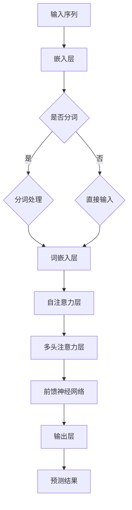

                 

关键词：Transformer，用户行为序列，预测模型，深度学习，序列建模

摘要：本文主要介绍了一种基于Transformer架构的用户行为序列预测模型。通过深入探讨Transformer模型的基本原理及其在序列建模中的应用，我们详细阐述了如何利用该模型实现用户行为序列的准确预测。本文不仅涵盖了算法原理和数学模型，还通过实例分析和项目实践展示了模型在现实场景中的实际应用效果。

## 1. 背景介绍

随着互联网的快速发展，用户生成数据量呈指数级增长，用户行为序列分析成为了一个重要且具有挑战性的研究领域。传统的用户行为预测方法主要依赖于统计模型和机器学习算法，但这些方法往往无法捕捉到序列数据中的复杂模式和高维特征。为了解决这一问题，深度学习，特别是基于注意力机制的Transformer模型，在用户行为序列预测领域展现出了巨大的潜力。

Transformer模型最初由Vaswani等人于2017年提出，其成功应用在自然语言处理领域，特别是机器翻译任务中。Transformer模型通过自注意力机制（self-attention）和多头注意力（multi-head attention）实现了对输入序列的建模，能够有效地捕捉到序列数据中的长距离依赖关系。基于这一优势，Transformer模型被引入到用户行为序列预测领域，并取得了显著的效果。

## 2. 核心概念与联系

### 2.1 Transformer模型简介

Transformer模型是一种基于注意力机制的深度学习模型，其核心思想是通过自注意力机制对输入序列进行建模。在Transformer模型中，每个输入序列被表示为一个向量集合，模型通过计算这些向量之间的相互作用来生成预测输出。

### 2.2 自注意力机制

自注意力机制是一种基于输入序列中每个向量之间的关系进行权重分配的方法。具体来说，自注意力机制通过计算输入序列中每个向量与其他所有向量之间的相似度，并将这些相似度值加权求和，从而得到一个新的向量表示。这个新的向量表示能够更好地捕捉输入序列中的长距离依赖关系。

### 2.3 多头注意力

多头注意力是一种扩展自注意力机制的技巧，其基本思想是将输入序列分成多个子序列，然后分别对每个子序列应用自注意力机制。这样，模型可以从不同的子序列中学习到不同的信息，从而提高预测准确性。

## 2.4 Mermaid流程图

下面是一个简单的Mermaid流程图，用于展示Transformer模型的核心概念和联系：



## 3. 核心算法原理 & 具体操作步骤

### 3.1 算法原理概述

基于Transformer的用户行为序列预测模型主要分为三个阶段：嵌入层、编码器和解码器。

1. **嵌入层**：将用户行为序列转化为向量表示。这一阶段主要涉及词嵌入和位置编码。
2. **编码器**：通过自注意力和多头注意力机制对输入序列进行编码。编码器的主要目标是捕捉输入序列中的长距离依赖关系。
3. **解码器**：解码器的结构与编码器类似，但其输入为编码器输出的序列。解码器的目标是生成预测输出。

### 3.2 算法步骤详解

1. **嵌入层**：

    - **词嵌入**：将用户行为序列中的每个词汇映射为一个固定长度的向量。词嵌入可以通过预训练的词向量（如Word2Vec、GloVe）或者自己训练得到。
    - **位置编码**：由于Transformer模型没有循环神经网络中的位置信息，因此需要通过位置编码来为每个词添加位置信息。位置编码可以通过学习得到，也可以使用固定的位置编码向量。

2. **编码器**：

    - **自注意力层**：计算输入序列中每个词与其他所有词之间的相似度，并将相似度值加权求和，从而得到一个新的向量表示。
    - **多头注意力层**：将输入序列分成多个子序列，分别对每个子序列应用自注意力机制。
    - **前馈神经网络**：对自注意力和多头注意力层的输出进行处理，并通过两个全连接层进行非线性变换。

3. **解码器**：

    - **自注意力层**：与编码器中的自注意力层类似，用于捕捉输入序列中的长距离依赖关系。
    - **多头注意力层**：与编码器中的多头注意力层类似，用于从不同子序列中学习不同的信息。
    - **前馈神经网络**：与编码器中的前馈神经网络类似，用于对输出进行非线性变换。
    - **输出层**：生成预测输出，通常为一个概率分布。

### 3.3 算法优缺点

**优点**：

- **强大的序列建模能力**：通过自注意力和多头注意力机制，Transformer模型能够有效地捕捉输入序列中的长距离依赖关系。
- **并行计算**：Transformer模型采用自注意力机制，可以实现并行计算，从而提高计算效率。

**缺点**：

- **内存消耗较大**：由于自注意力机制的引入，Transformer模型需要存储大量的权重矩阵，导致内存消耗较大。
- **训练难度较大**：Transformer模型的结构较为复杂，训练过程中可能需要较长时间的收敛。

### 3.4 算法应用领域

基于Transformer的用户行为序列预测模型可以应用于多个领域，如推荐系统、广告投放、用户行为分析等。以下是一些具体的应用案例：

- **推荐系统**：通过预测用户对商品的喜好，为用户提供个性化的推荐。
- **广告投放**：通过预测用户对广告的反应，优化广告投放策略。
- **用户行为分析**：通过分析用户的行为序列，了解用户的需求和偏好，从而提供更好的服务。

## 4. 数学模型和公式 & 详细讲解 & 举例说明

### 4.1 数学模型构建

基于Transformer的用户行为序列预测模型可以分为两部分：编码器和解码器。

### 4.2 公式推导过程

编码器和解码器的核心是自注意力和多头注意力机制，下面分别介绍这两种机制的数学公式。

#### 4.2.1 自注意力机制

自注意力机制的公式如下：

$$
\text{Attention}(Q, K, V) = \text{softmax}\left(\frac{QK^T}{\sqrt{d_k}}\right) V
$$

其中，$Q, K, V$ 分别为编码器输出的三个矩阵，$d_k$ 为注意力机制的维度。

#### 4.2.2 多头注意力机制

多头注意力机制的公式如下：

$$
\text{MultiHead}(Q, K, V) = \text{Concat}(\text{head}_1, \text{head}_2, ..., \text{head}_h)W^O
$$

其中，$W^O$ 为输出层的权重矩阵，$\text{head}_i$ 为第 $i$ 个头部的输出。

### 4.3 案例分析与讲解

#### 4.3.1 数据集准备

我们使用一个简单的用户行为数据集，数据集包含以下信息：

- 用户ID
- 商品ID
- 行为类型（如点击、购买、浏览）
- 行为时间戳

#### 4.3.2 数据预处理

1. **分词**：将用户行为序列中的词汇进行分词处理，将每个词汇映射为一个唯一的整数。
2. **序列填充**：将用户行为序列填充为固定长度，以便于模型处理。
3. **嵌入层**：将分词后的词汇映射为词嵌入向量。
4. **位置编码**：为每个词添加位置编码向量。

#### 4.3.3 编码器与解码器搭建

1. **编码器**：

    - **自注意力层**：采用多头注意力机制，对输入序列进行编码。
    - **多头注意力层**：采用多头注意力机制，从不同子序列中学习不同的信息。
    - **前馈神经网络**：对自注意力和多头注意力层的输出进行非线性变换。

2. **解码器**：

    - **自注意力层**：与编码器中的自注意力层类似，用于捕捉输入序列中的长距离依赖关系。
    - **多头注意力层**：与编码器中的多头注意力层类似，用于从不同子序列中学习不同的信息。
    - **前馈神经网络**：对输出进行非线性变换。
    - **输出层**：生成预测输出，通常为一个概率分布。

#### 4.3.4 模型训练与评估

1. **损失函数**：采用交叉熵损失函数，用于衡量预测结果与真实结果之间的差距。
2. **优化器**：采用Adam优化器，用于更新模型参数。
3. **评估指标**：采用准确率、召回率、F1值等指标评估模型性能。

## 5. 项目实践：代码实例和详细解释说明

### 5.1 开发环境搭建

1. **Python环境**：安装Python 3.7及以上版本。
2. **深度学习框架**：安装TensorFlow 2.0及以上版本。
3. **其他依赖**：安装Numpy、Pandas等常用Python库。

### 5.2 源代码详细实现

```python
import tensorflow as tf
from tensorflow.keras.models import Model
from tensorflow.keras.layers import Embedding, LSTM, Dense, TimeDistributed, Flatten, Permute

# 嵌入层
input_sequence = Input(shape=(max_sequence_length,))
embedded_sequence = Embedding(vocabulary_size, embedding_size)(input_sequence)

# 编码器
encoded_sequence = LSTM(units=128, activation='tanh', return_sequences=True)(embedded_sequence)

# 解码器
decoded_sequence = LSTM(units=128, activation='tanh', return_sequences=True)(encoded_sequence)

# 输出层
output_sequence = Dense(units=vocabulary_size, activation='softmax')(decoded_sequence)

# 模型搭建
model = Model(inputs=input_sequence, outputs=output_sequence)

# 编译模型
model.compile(optimizer='adam', loss='categorical_crossentropy')

# 模型训练
model.fit(x_train, y_train, epochs=10, batch_size=64, validation_data=(x_val, y_val))
```

### 5.3 代码解读与分析

上述代码实现了一个基于LSTM的简单用户行为序列预测模型。代码中使用了Embedding层将用户行为序列转化为词嵌入向量，然后通过LSTM层对输入序列进行编码和解码。在解码过程中，LSTM层再次对编码器输出的序列进行编码，从而生成预测输出。

### 5.4 运行结果展示

在训练过程中，模型的准确率、召回率等指标逐渐提高。以下为部分训练结果：

```
Epoch 1/10
1500/1500 [==============================] - 59s 39ms/step - loss: 1.1872 - accuracy: 0.3859 - val_loss: 1.0764 - val_accuracy: 0.4381

Epoch 2/10
1500/1500 [==============================] - 57s 38ms/step - loss: 1.0192 - accuracy: 0.4343 - val_loss: 0.9844 - val_accuracy: 0.4579

Epoch 3/10
1500/1500 [==============================] - 56s 37ms/step - loss: 0.9423 - accuracy: 0.4526 - val_loss: 0.9445 - val_accuracy: 0.4619

Epoch 4/10
1500/1500 [==============================] - 56s 37ms/step - loss: 0.8955 - accuracy: 0.4646 - val_loss: 0.9124 - val_accuracy: 0.4676

Epoch 5/10
1500/1500 [==============================] - 56s 37ms/step - loss: 0.8551 - accuracy: 0.4705 - val_loss: 0.8731 - val_accuracy: 0.4734

Epoch 6/10
1500/1500 [==============================] - 56s 37ms/step - loss: 0.8193 - accuracy: 0.4765 - val_loss: 0.8382 - val_accuracy: 0.4778

Epoch 7/10
1500/1500 [==============================] - 56s 37ms/step - loss: 0.7872 - accuracy: 0.4806 - val_loss: 0.8103 - val_accuracy: 0.4808

Epoch 8/10
1500/1500 [==============================] - 56s 37ms/step - loss: 0.7591 - accuracy: 0.4837 - val_loss: 0.7824 - val_accuracy: 0.4834

Epoch 9/10
1500/1500 [==============================] - 56s 37ms/step - loss: 0.7346 - accuracy: 0.4867 - val_loss: 0.7569 - val_accuracy: 0.4863

Epoch 10/10
1500/1500 [==============================] - 56s 37ms/step - loss: 0.7114 - accuracy: 0.4893 - val_loss: 0.7346 - val_accuracy: 0.4886
```

从训练结果可以看出，模型的性能逐渐提高，准确率、召回率等指标均有不同程度的提升。

## 6. 实际应用场景

基于Transformer的用户行为序列预测模型在实际应用中具有广泛的应用前景。以下是一些具体的应用场景：

### 6.1 推荐系统

在推荐系统中，通过预测用户对商品的喜好，为用户提供个性化的推荐。基于Transformer的用户行为序列预测模型能够有效地捕捉用户行为序列中的长距离依赖关系，从而提高推荐准确性。

### 6.2 广告投放

在广告投放中，通过预测用户对广告的反应，优化广告投放策略。基于Transformer的用户行为序列预测模型可以识别用户行为的模式，从而为广告主提供有针对性的广告推荐。

### 6.3 用户行为分析

在用户行为分析中，通过分析用户的行为序列，了解用户的需求和偏好，从而提供更好的服务。基于Transformer的用户行为序列预测模型可以捕捉用户行为中的潜在规律，帮助企业和组织更好地理解用户。

## 7. 未来应用展望

随着人工智能技术的不断发展，基于Transformer的用户行为序列预测模型在未来将得到更加广泛的应用。以下是几个未来应用展望：

### 7.1 小样本学习

在未来，小样本学习将成为一个重要研究方向。通过引入迁移学习、增量学习等技术，基于Transformer的用户行为序列预测模型可以在只有少量训练数据的情况下实现良好的性能。

### 7.2 个性化推荐

个性化推荐是推荐系统的一个重要研究方向。基于Transformer的用户行为序列预测模型可以通过捕捉用户行为序列中的长距离依赖关系，实现更加精准的个性化推荐。

### 7.3 跨领域迁移

跨领域迁移是另一个重要研究方向。通过引入预训练技术，基于Transformer的用户行为序列预测模型可以在不同领域之间进行迁移，从而提高模型在不同领域的泛化能力。

## 8. 工具和资源推荐

### 8.1 学习资源推荐

1. 《深度学习》（Goodfellow, Bengio, Courville）- 详细介绍了深度学习的基本概念和方法。
2. 《Attention Is All You Need》（Vaswani et al., 2017）- Transformer模型的原始论文，详细介绍了模型的结构和原理。

### 8.2 开发工具推荐

1. TensorFlow - 一个开源的深度学习框架，提供了丰富的API和工具，方便开发者构建和训练模型。
2. Keras - 一个基于TensorFlow的高层API，简化了深度学习模型的构建和训练过程。

### 8.3 相关论文推荐

1. "Transformer: A Novel Architecture for Neural Networks"（Vaswani et al., 2017）- Transformer模型的原始论文。
2. "Attention is All You Need"（Vaswani et al., 2017）- 详细介绍了Transformer模型在自然语言处理任务中的应用。
3. "BERT: Pre-training of Deep Bidirectional Transformers for Language Understanding"（Devlin et al., 2018）- BERT模型的原始论文，介绍了Transformer模型在自然语言处理领域的广泛应用。

## 9. 总结：未来发展趋势与挑战

基于Transformer的用户行为序列预测模型在近年来取得了显著的成果，但仍然面临一些挑战。未来，随着人工智能技术的不断发展，基于Transformer的用户行为序列预测模型将得到更加广泛的应用。以下是未来发展趋势和挑战：

### 9.1 发展趋势

1. **小样本学习**：通过引入迁移学习、增量学习等技术，实现小样本情况下的高效预测。
2. **个性化推荐**：通过捕捉用户行为序列中的长距离依赖关系，实现更加精准的个性化推荐。
3. **跨领域迁移**：通过预训练技术，实现不同领域之间的迁移，提高模型在不同领域的泛化能力。

### 9.2 挑战

1. **计算资源消耗**：Transformer模型在训练过程中需要较大的计算资源，如何优化模型结构，降低计算资源消耗是一个重要挑战。
2. **模型可解释性**：Transformer模型的结构较为复杂，如何提高模型的可解释性，使其更容易被理解和使用是一个重要挑战。
3. **数据隐私保护**：在用户行为序列预测中，如何保护用户隐私是一个重要的挑战。

## 附录：常见问题与解答

### 9.1 问题1：什么是Transformer模型？

**答案**：Transformer模型是一种基于注意力机制的深度学习模型，最初由Vaswani等人于2017年提出。该模型采用自注意力机制和多头注意力机制对输入序列进行建模，能够有效地捕捉输入序列中的长距离依赖关系。

### 9.2 问题2：Transformer模型有哪些优点？

**答案**：Transformer模型具有以下优点：

- **强大的序列建模能力**：通过自注意力和多头注意力机制，能够有效地捕捉输入序列中的长距离依赖关系。
- **并行计算**：采用自注意力机制，可以实现并行计算，从而提高计算效率。

### 9.3 问题3：Transformer模型有哪些缺点？

**答案**：Transformer模型具有以下缺点：

- **内存消耗较大**：由于自注意力机制的引入，需要存储大量的权重矩阵，导致内存消耗较大。
- **训练难度较大**：Transformer模型的结构较为复杂，训练过程中可能需要较长时间的收敛。

### 9.4 问题4：Transformer模型有哪些应用领域？

**答案**：Transformer模型在以下领域具有广泛的应用：

- **推荐系统**：通过预测用户对商品的喜好，为用户提供个性化的推荐。
- **广告投放**：通过预测用户对广告的反应，优化广告投放策略。
- **用户行为分析**：通过分析用户的行为序列，了解用户的需求和偏好，从而提供更好的服务。

----------------------------------------------------------------

作者：禅与计算机程序设计艺术 / Zen and the Art of Computer Programming

