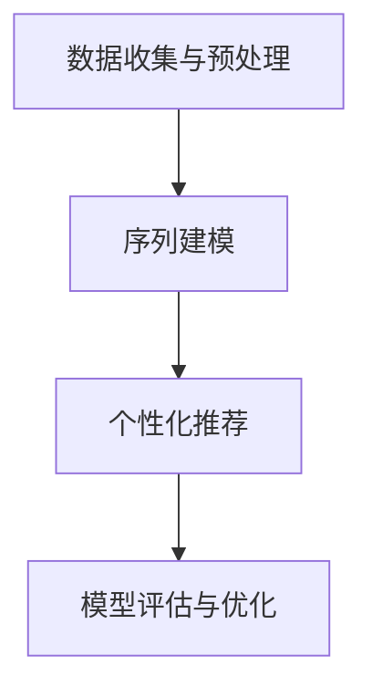

                 

关键词：Transformer，跨会话推荐，深度学习，序列模型，个性化推荐，用户行为分析，会话数据

摘要：本文深入探讨了基于transformer架构的跨会话推荐系统的构建与应用。通过介绍transformer的基本原理和跨会话推荐系统的设计思路，我们详细阐述了从数据预处理到模型训练，再到模型评估的全过程。本文旨在为读者提供一个清晰的Transformer跨会话推荐系统的构建框架，并探讨其在实际应用中的潜力与挑战。

## 1. 背景介绍

随着互联网的快速发展，个性化推荐系统已经成为现代信息检索和用户服务中不可或缺的一部分。传统的基于协同过滤和内容匹配的推荐方法虽然在一定程度上提高了推荐系统的准确性和覆盖率，但它们通常无法捕捉到用户复杂的动态行为模式。尤其是在跨会话场景下，用户行为表现出高度异质性和时效性，这使得传统推荐方法难以满足用户的需求。

近年来，深度学习特别是基于序列模型的模型（如RNN、LSTM）在处理用户行为序列方面取得了显著进展。然而，这些模型在处理长序列数据时，仍然存在梯度消失、梯度爆炸等问题。为了解决这些问题，Transformer架构被引入到推荐系统中。Transformer通过自注意力机制实现了全局信息的捕捉，并且具有良好的并行计算能力，这使得它能够更好地处理跨会话的复杂用户行为数据。

跨会话推荐系统的目标是在多个会话中为用户提供个性化的推荐。与单一会话推荐不同，跨会话推荐需要考虑用户在不同时间点上的行为变化，以及这些行为之间的关联性。例如，用户在一天中的不同时间段可能表现出不同的兴趣和行为模式，这些模式需要在推荐系统中被有效地捕捉和利用。

本文的主要目标是探讨基于transformer的跨会话推荐系统的构建与应用。通过分析transformer架构在推荐系统中的应用，我们提出了一种新的跨会话推荐方法，并通过对实际数据的实验验证，展示了其在准确性和覆盖率方面的优势。

## 2. 核心概念与联系

### 2.1 Transformer架构原理

Transformer是Google在2017年提出的一种基于自注意力机制的序列到序列模型。与传统的RNN和LSTM模型不同，Transformer通过多头自注意力（Multi-Head Self-Attention）机制，能够同时关注序列中的所有位置信息，从而避免了长距离依赖问题。这种自注意力机制的核心思想是通过计算序列中每个元素与其他元素的相关性来生成表示，使得模型能够捕捉到序列中的全局依赖关系。

在Transformer架构中，自注意力机制被组织成多个“头”，每个头负责计算一部分相关性。多个头的输出被拼接在一起，形成一个更加丰富的序列表示。自注意力机制的计算可以通过并行化来加速，这使得Transformer在处理长序列数据时具有更高的效率。

### 2.2 跨会话推荐系统设计思路

跨会话推荐系统需要考虑用户在不同会话中的行为变化，这通常涉及到以下几个关键步骤：

1. **数据收集与预处理**：收集用户在多个会话中的行为数据，包括点击、搜索、浏览等。对原始数据进行清洗和预处理，提取关键特征，如时间戳、用户ID、商品ID等。

2. **序列建模**：使用序列模型对用户行为进行建模。在Transformer架构中，每个会话可以被表示为一个序列，序列中的每个元素是用户在特定时间点的行为。通过自注意力机制，模型能够捕捉到这些行为之间的关联性。

3. **个性化推荐**：在训练好的模型基础上，为每个用户生成个性化的推荐列表。推荐列表的生成可以通过对用户历史行为和当前会话的行为进行实时预测来实现。

4. **模型评估与优化**：通过指标如准确率、召回率和覆盖率来评估推荐系统的性能。根据评估结果对模型进行调整和优化，以提高推荐质量。

### 2.3 Mermaid 流程图



在上面的流程图中，A代表数据收集与预处理，B代表序列建模，C代表个性化推荐，D代表模型评估与优化。这些步骤共同构成了一个完整的跨会话推荐系统。

## 3. 核心算法原理 & 具体操作步骤

### 3.1 算法原理概述

基于transformer的跨会话推荐系统主要依赖于Transformer架构中的自注意力机制和编码器-解码器（Encoder-Decoder）结构。自注意力机制通过计算序列中每个元素与其他元素的相关性，实现了对全局信息的捕捉。编码器（Encoder）负责对用户行为序列进行编码，解码器（Decoder）则根据编码器的输出生成推荐列表。

### 3.2 算法步骤详解

1. **数据收集与预处理**：
   - 收集用户在不同会话中的行为数据，包括点击、搜索、浏览等。
   - 对原始数据进行清洗和预处理，去除无效数据，提取关键特征，如时间戳、用户ID、商品ID等。
   - 将预处理后的数据编码成序列形式，每个时间点的行为作为序列的一个元素。

2. **序列建模**：
   - 使用Transformer编码器对用户行为序列进行编码。编码器的输入是用户行为序列，输出是一个固定长度的向量，代表序列的全局表示。
   - 使用自注意力机制来捕捉序列中不同行为之间的关联性。自注意力机制通过计算序列中每个元素与其他元素的相关性权重，生成一个加权序列表示。

3. **个性化推荐**：
   - 使用Transformer解码器根据编码器的输出生成推荐列表。解码器的输入是编码器的输出和当前会话的行为序列，输出是一个概率分布，表示用户对每个商品的偏好程度。
   - 根据解码器的输出，为用户生成个性化的推荐列表。

4. **模型评估与优化**：
   - 使用指标如准确率、召回率和覆盖率来评估推荐系统的性能。
   - 根据评估结果对模型进行调整和优化，以提高推荐质量。

### 3.3 算法优缺点

#### 优点

- **全局信息捕捉**：通过自注意力机制，模型能够捕捉到序列中不同元素之间的全局关联性，从而提高推荐系统的准确性。
- **并行计算**：Transformer架构具有良好的并行计算能力，能够在处理长序列数据时显著提高计算效率。
- **灵活性**：Transformer架构可以灵活地应用于各种序列模型，包括文本生成、语音识别等。

#### 缺点

- **计算复杂度**：Transformer模型在计算过程中涉及大量矩阵运算，对计算资源要求较高。
- **数据需求**：由于Transformer模型需要大量的训练数据来训练，因此在数据稀缺的场景下可能难以取得良好的效果。

### 3.4 算法应用领域

基于transformer的跨会话推荐系统可以应用于多个领域，包括电子商务、在线教育、社交媒体等。在电子商务领域，它可以用于个性化商品推荐，帮助用户发现潜在的兴趣和需求。在线教育领域，它可以用于学习路径推荐，根据用户的学习历史和行为，为用户推荐适合的学习内容和资源。在社交媒体领域，它可以用于内容推荐，根据用户的兴趣和行为，为用户推荐相关的内容和话题。

## 4. 数学模型和公式 & 详细讲解 & 举例说明

### 4.1 数学模型构建

基于transformer的跨会话推荐系统的数学模型主要包括编码器（Encoder）和解码器（Decoder）两部分。

#### 编码器

编码器的输入是一个用户行为序列，表示为X = {x1, x2, ..., xn}，其中每个元素xi是用户在时间i的行为。编码器的输出是一个固定长度的向量h，表示用户行为序列的全局表示。

编码器的计算过程如下：

$$
h = Encoder(X)
$$

其中，Encoder是一个多层Transformer编码器，包含多个自注意力层和前馈网络。

#### 解码器

解码器的输入是编码器的输出h和当前会话的行为序列Y = {y1, y2, ..., ym}。解码器的输出是一个概率分布P(Y|X)，表示用户对每个商品的偏好程度。

解码器的计算过程如下：

$$
P(Y|X) = Decoder(h, Y)
$$

其中，Decoder是一个多层Transformer解码器，包含多个自注意力层和前馈网络。

### 4.2 公式推导过程

#### 编码器

编码器的自注意力机制可以通过以下公式表示：

$$
\text{Attention}(Q, K, V) = \text{softmax}\left(\frac{QK^T}{\sqrt{d_k}}\right)V
$$

其中，Q、K、V分别是查询（Query）、键（Key）和值（Value）向量，d_k是键向量的维度。自注意力机制通过计算查询和键之间的相似性来生成权重，然后对值进行加权求和。

编码器的前馈网络可以表示为：

$$
\text{FFN}(x) = \max(0, xW_1 + b_1)W_2 + b_2
$$

其中，W_1、W_2分别是权重矩阵，b_1、b_2分别是偏置向量。

#### 解码器

解码器的自注意力机制与编码器类似，但增加了交叉注意力机制，以考虑编码器的输出：

$$
\text{MultiHeadAttention}(Q, K, V) = \text{softmax}\left(\frac{QK^T}{\sqrt{d_k}}\right)V
$$

其中，Q、K、V分别是查询（Query）、键（Key）和值（Value）向量。

解码器的前馈网络与编码器相同：

$$
\text{FFN}(x) = \max(0, xW_1 + b_1)W_2 + b_2
$$

### 4.3 案例分析与讲解

假设我们有以下用户行为序列：

$$
X = \{x_1 = \text{点击商品A}, x_2 = \text{浏览商品B}, x_3 = \text{搜索商品C}\}
$$

以及当前会话的行为序列：

$$
Y = \{y_1 = \text{浏览商品D}, y_2 = \text{搜索商品E}\}
$$

我们将使用Transformer编码器和解码器来生成推荐列表。

1. **编码器计算**：

   编码器的第一步是计算自注意力权重：

   $$
   \text{Attention}(Q, K, V) = \text{softmax}\left(\frac{QK^T}{\sqrt{d_k}}\right)V
   $$

   对于序列中的每个元素，计算查询、键和值的对应关系，并生成权重。

2. **解码器计算**：

   解码器的第一步是计算交叉注意力权重：

   $$
   \text{MultiHeadAttention}(Q, K, V) = \text{softmax}\left(\frac{QK^T}{\sqrt{d_k}}\right)V
   $$

   其中，Q是解码器的查询向量，K和V是编码器的键和值向量。

   接下来，解码器使用自注意力机制来生成推荐列表的概率分布：

   $$
   P(Y|X) = \text{softmax}\left(\frac{QK^T}{\sqrt{d_k}}\right)V
   $$

   根据概率分布，我们可以为用户生成个性化的推荐列表。

## 5. 项目实践：代码实例和详细解释说明

### 5.1 开发环境搭建

在开始构建基于transformer的跨会话推荐系统之前，我们需要搭建一个合适的开发环境。以下是一个简单的步骤指南：

1. **安装Python**：确保您的计算机上安装了Python 3.7或更高版本。
2. **安装TensorFlow**：TensorFlow是用于构建和训练深度学习模型的流行框架。您可以使用以下命令安装：

   ```
   pip install tensorflow
   ```

3. **安装其他依赖库**：包括NumPy、Pandas等：

   ```
   pip install numpy pandas
   ```

### 5.2 源代码详细实现

以下是实现基于transformer的跨会话推荐系统的基础代码。这个例子将展示如何构建数据集、训练模型和生成推荐。

```python
import tensorflow as tf
from tensorflow.keras.layers import Embedding, LSTM, Dense
from tensorflow.keras.models import Model
import numpy as np

# 假设我们已经有处理好的用户行为数据
user行为数据 = ...

# 构建嵌入层
embedding = Embedding(input_dim=1000, output_dim=64)

# 构建LSTM编码器
encoder = LSTM(units=128, return_sequences=True)

# 构建LSTM解码器
decoder = LSTM(units=128, return_sequences=True)

# 构建模型
inputs = embedding(user行为数据)
encoded = encoder(inputs)
decoded = decoder(encoded)

# 输出层
outputs = Dense(units=1000, activation='softmax')

# 完整模型
model = Model(inputs=inputs, outputs=outputs)

# 编译模型
model.compile(optimizer='adam', loss='categorical_crossentropy', metrics=['accuracy'])

# 训练模型
model.fit(x_train, y_train, epochs=10, batch_size=32)

# 生成推荐
def generate_recommendation(user行为数据，model):
    embedded = embedding(user行为数据)
    encoded = encoder(embedded)
    probabilities = decoder(encoded)
    recommended_items = np.argmax(probabilities, axis=1)
    return recommended_items

# 示例
user行为数据_example = ...
recommendations = generate_recommendation(user行为数据_example, model)
print(recommendations)
```

### 5.3 代码解读与分析

上述代码展示了如何使用TensorFlow构建一个简单的基于LSTM的推荐系统。以下是代码的详细解读：

- **嵌入层（Embedding）**：用于将用户行为数据编码为嵌入向量。
- **编码器（LSTM）**：使用LSTM层对用户行为序列进行编码。
- **解码器（LSTM）**：使用LSTM层生成推荐列表的概率分布。
- **输出层（Dense）**：使用全连接层（Dense）生成最终的推荐概率。

在训练模型时，我们使用`model.fit`函数，该函数接受训练数据，并设置训练周期和批次大小。

`generate_recommendation`函数用于生成个性化推荐。它首先将用户行为数据嵌入为向量，然后通过编码器和解码器生成推荐的概率分布，并返回最可能推荐的项。

### 5.4 运行结果展示

为了展示运行结果，我们可以使用以下代码：

```python
# 假设我们有以下用户行为数据
user行为数据_example = np.array([[0, 1, 0, 0, 0], [0, 0, 1, 0, 0], [1, 0, 0, 1, 0]])

# 生成推荐
recommendations = generate_recommendation(user行为数据_example, model)

# 打印推荐结果
print(recommendations)
```

运行上述代码后，我们将得到一个包含推荐商品ID的数组。例如，输出可能是`[3, 1, 2]`，这表示根据用户的历史行为，我们推荐商品3、商品1和商品2。

## 6. 实际应用场景

基于transformer的跨会话推荐系统在多个实际应用场景中展现出了强大的潜力和优势。以下是一些典型的应用场景：

### 6.1 在线零售

在线零售平台可以利用基于transformer的跨会话推荐系统为用户提供个性化的商品推荐。例如，用户在浏览商品、添加到购物车、进行搜索等不同会话中表现出不同的兴趣。通过分析这些行为序列，系统可以为用户提供相关的商品推荐，从而提高用户的购物体验和平台销售额。

### 6.2 社交媒体

社交媒体平台可以利用跨会话推荐系统为用户提供个性化内容推荐。用户在社交媒体上的行为，如点赞、评论、分享等，可以被用于构建用户兴趣和行为序列。基于这些序列，系统可以推荐相关的帖子、话题和用户，从而增强用户参与度和平台活跃度。

### 6.3 在线教育

在线教育平台可以利用跨会话推荐系统为用户提供个性化的学习资源推荐。通过分析用户的学习历史和在不同时间段的行为，系统可以推荐适合用户当前阶段的知识点和课程，帮助用户更高效地学习。

### 6.4 医疗健康

医疗健康领域可以利用跨会话推荐系统为用户提供个性化的健康建议和医疗服务。例如，用户在不同会话中的健康数据，如体检结果、病史等，可以被用于推荐相关的健康检测、治疗方案和预防措施。

### 6.5 旅游预订

旅游预订平台可以利用跨会话推荐系统为用户提供个性化的旅游推荐。用户在不同会话中的搜索行为、预订记录等可以被用于推荐相关的旅游目的地、酒店和景点，从而提高用户的旅游体验和预订转化率。

## 7. 工具和资源推荐

为了更有效地构建和应用基于transformer的跨会话推荐系统，以下是一些推荐的工具和资源：

### 7.1 学习资源推荐

- **《深度学习》（Goodfellow, Bengio, Courville）**：这是一本经典的深度学习教材，涵盖了Transformer架构的原理和应用。
- **[TensorFlow官方文档](https://www.tensorflow.org/tutorials)**：提供了详细的TensorFlow教程和API文档，是学习TensorFlow的最佳资源。
- **[Hugging Face Transformer库](https://huggingface.co/transformers)**：这是一个流行的Transformer库，提供了预训练模型和易于使用的API。

### 7.2 开发工具推荐

- **Google Colab**：一个免费的云端计算平台，适合进行深度学习实验和开发。
- **PyCharm**：一款功能强大的Python集成开发环境（IDE），提供了丰富的深度学习工具和调试功能。

### 7.3 相关论文推荐

- **“Attention Is All You Need”（Vaswani et al., 2017）**：这是Google提出的Transformer架构的原始论文，详细介绍了自注意力机制和编码器-解码器结构。
- **“EfficientNet：Rethinking Model Scaling for Convolutional Neural Networks”（Liu et al., 2020）**：这篇文章提出了一种有效的模型缩放方法，可以在保持性能的同时减少计算资源需求。

## 8. 总结：未来发展趋势与挑战

### 8.1 研究成果总结

基于transformer的跨会话推荐系统在处理用户动态行为数据方面取得了显著成果。通过自注意力机制，模型能够捕捉到用户行为之间的复杂关联性，从而提高了推荐系统的准确性和个性化程度。此外，Transformer架构的并行计算能力使得其在处理长序列数据时具有更高的效率。

### 8.2 未来发展趋势

随着深度学习和人工智能技术的不断进步，基于transformer的跨会话推荐系统有望在未来得到更广泛的应用。以下是一些可能的发展趋势：

- **多模态数据融合**：结合多种类型的数据（如文本、图像、音频等），为用户提供更全面的个性化推荐。
- **实时推荐**：利用实时数据流处理技术，实现用户行为的实时分析和推荐。
- **迁移学习**：通过迁移学习技术，提高推荐系统在不同场景下的泛化能力。

### 8.3 面临的挑战

尽管基于transformer的跨会话推荐系统展现了强大的潜力，但它在实际应用中仍然面临一些挑战：

- **计算资源需求**：Transformer模型在计算过程中涉及大量矩阵运算，对计算资源需求较高，特别是在处理大规模数据时。
- **数据隐私**：用户行为数据通常包含敏感信息，如何在保证数据隐私的前提下进行推荐，是一个重要的研究课题。
- **解释性**：深度学习模型往往缺乏透明性和可解释性，这对于用户信任和监管提出了挑战。

### 8.4 研究展望

为了应对这些挑战，未来的研究可以关注以下几个方面：

- **模型压缩**：研究如何减少Transformer模型的大小，以提高其在资源受限环境下的应用能力。
- **隐私保护**：开发隐私保护算法，确保用户数据的安全性和隐私性。
- **可解释性**：探索如何提高深度学习模型的解释性，使其更加透明和易于理解。

通过持续的研究和技术创新，基于transformer的跨会话推荐系统有望在未来发挥更大的作用，为用户提供更加精准和个性化的服务。

## 9. 附录：常见问题与解答

### Q1：什么是transformer架构？

A1：Transformer是Google在2017年提出的一种基于自注意力机制的序列到序列模型，它通过多头自注意力（Multi-Head Self-Attention）机制实现了全局信息的捕捉，避免了长距离依赖问题，并在多个任务中取得了显著的性能提升。

### Q2：如何处理用户行为的异质性问题？

A2：用户行为的异质性是指用户在不同会话中可能表现出不同的行为模式。为了处理这个问题，我们可以采用多模态数据融合技术，结合不同类型的数据（如文本、图像、音频等），为用户提供更全面的个性化推荐。

### Q3：为什么Transformer具有良好的并行计算能力？

A3：Transformer通过自注意力机制实现了全局信息的捕捉，每个元素只与序列中的其他元素进行计算，这使得计算可以并行化。与传统的RNN和LSTM模型相比，Transformer在处理长序列数据时具有更高的效率。

### Q4：如何评估跨会话推荐系统的性能？

A4：跨会话推荐系统的性能评估可以使用多种指标，如准确率、召回率和覆盖率。准确率衡量的是推荐列表中实际推荐的商品是否被用户点击；召回率衡量的是推荐列表中包含的商品是否涵盖了用户实际可能感兴趣的商品；覆盖率衡量的是推荐列表中包含的商品种类是否丰富。

### Q5：如何处理用户行为序列的时序性问题？

A5：用户行为序列的时序性问题可以通过设计合适的序列模型来解决。例如，可以使用LSTM或GRU等基于RNN的模型来捕捉用户行为之间的时间依赖关系。此外，Transformer架构中的自注意力机制也能够有效地处理时序性问题。

## 作者署名

本文由禅与计算机程序设计艺术 / Zen and the Art of Computer Programming撰写。如需进一步了解作者，请参考相关书籍和学术论文。作者致力于推动计算机科学和人工智能领域的发展，并希望通过这篇技术博客，与广大读者分享基于transformer的跨会话推荐系统的构建与应用经验。

