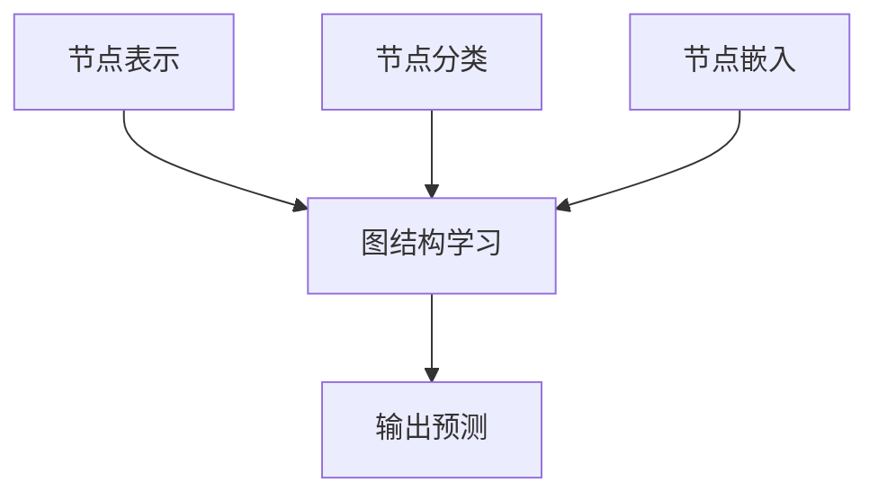
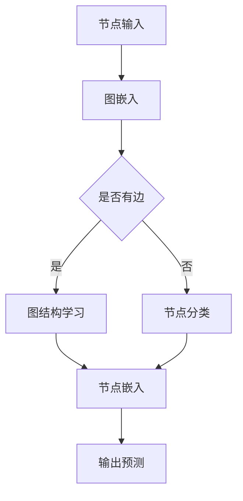

                 

关键词：图神经网络，商品推荐，关联推荐，数据挖掘，深度学习

摘要：本文将探讨如何利用图神经网络（Graph Neural Networks, GNNs）技术进行商品关联推荐。通过介绍图神经网络的基本概念、算法原理、数学模型以及应用领域，我们将详细解析如何将GNN应用于商品推荐系统中，实现高效的关联推荐。同时，文章将结合实际项目实例，展示如何实现商品推荐系统，并分析其效果。

## 1. 背景介绍

在电子商务领域，商品推荐系统已经成为提升用户购物体验和增加销售额的关键因素。传统的推荐系统主要依赖于基于内容的推荐（Content-Based Recommendation）和协同过滤推荐（Collaborative Filtering）。然而，这些方法在面对复杂的商品关系和高维用户行为数据时，往往表现出一定的局限性。因此，研究者开始探索新的推荐算法，以期在准确性和效率上取得突破。

近年来，图神经网络（GNN）作为一种强大的图形数据处理工具，受到了广泛关注。GNN能够在保持节点和边之间关系的同时，提取复杂的网络结构信息，这使得其在解决推荐系统问题方面具有显著优势。基于图神经网络的商品关联推荐，不仅能够捕捉商品间的复杂关系，还能更好地理解用户行为，从而提高推荐的准确性。

本文将首先介绍图神经网络的基本概念，然后深入探讨其算法原理和应用场景，最后结合具体实例，详细解释如何实现基于图神经网络的商品推荐系统。

## 2. 核心概念与联系

### 2.1 图神经网络基本概念

图神经网络（GNN）是一种专门用于处理图结构数据的神经网络。与传统神经网络不同，GNN将图中的节点和边作为输入，通过学习节点和节点之间、节点和边之间的关系，实现对图数据的建模。

**节点**：图中的节点可以代表任何具有属性的对象，如用户、商品、地点等。

**边**：边表示节点之间的关系，如用户对商品的购买行为、商品之间的关联等。

**图**：图是由节点和边组成的结构，用于表示实体及其相互关系。

GNN的基本操作包括：节点表示学习、图结构学习、节点分类、节点嵌入等。

### 2.2 核心概念原理与架构

为了更好地理解GNN，我们可以借助Mermaid流程图来展示其基本架构和操作流程。



**节点表示**：将节点转换为向量的表示，这一步通常通过图嵌入（Graph Embedding）算法实现，如Node2Vec、DeepWalk等。

**图结构学习**：学习节点和边之间的关系，常用的方法包括GCN（Graph Convolutional Network）、GAT（Graph Attention Network）等。

**节点分类**：利用图结构学习的结果，对节点进行分类，如对商品进行分类推荐。

**节点嵌入**：将图中的节点和边转换为低维向量表示，用于后续的推荐任务。

**输出预测**：根据节点嵌入和图结构信息，进行预测任务，如商品推荐。

### 2.3 Mermaid 流程图

以下是一个简单的Mermaid流程图，展示了GNN的基本操作流程。



## 3. 核心算法原理 & 具体操作步骤

### 3.1 算法原理概述

图神经网络（GNN）的核心思想是利用图结构中的节点和边信息，通过神经网络学习节点的表示。GNN主要分为两类：图卷积网络（Graph Convolutional Network, GCN）和图注意力网络（Graph Attention Network, GAT）。

**图卷积网络（GCN）**：GCN通过图卷积操作来聚合节点的邻域信息，从而学习节点的表示。其基本原理如下：

- **邻域聚合**：对于每个节点，其输出是由其自身特征和其邻接节点的特征加权平均得到的。
- **非线性变换**：通过非线性激活函数（如ReLU）对聚合结果进行变换，以增加模型的非线性表达能力。

**图注意力网络（GAT）**：GAT通过引入注意力机制，根据节点邻接节点的重要性对聚合权重进行自适应调整。其基本原理如下：

- **注意力权重**：对于每个节点，其邻接节点的特征通过一个注意力函数计算权重。
- **加权聚合**：利用注意力权重对邻接节点的特征进行加权平均，得到节点的表示。

### 3.2 算法步骤详解

**3.2.1 节点表示学习**

- **输入数据**：图中的节点和边。
- **特征提取**：对节点和边进行特征提取，通常使用预训练的词向量或自训练的嵌入算法。
- **节点嵌入**：将节点和边转换为低维向量表示。

**3.2.2 图结构学习**

- **图卷积操作**：利用图卷积对节点的邻域信息进行聚合。
- **注意力机制**：利用注意力机制对邻接节点的特征进行加权。

**3.2.3 节点分类**

- **节点嵌入**：将图结构学习的结果转化为节点嵌入。
- **分类模型**：利用节点嵌入和分类算法（如SVM、决策树等）对节点进行分类。

**3.2.4 输出预测**

- **预测模型**：根据分类结果，构建预测模型（如线性回归、逻辑回归等）。
- **预测输出**：对新的节点进行预测，实现关联推荐。

### 3.3 算法优缺点

**优点**：

- **捕获复杂关系**：GNN能够有效地捕获图结构中的复杂关系，从而提高推荐的准确性。
- **可扩展性**：GNN适用于大规模图结构数据，具有良好的可扩展性。
- **灵活性**：通过调整图卷积和注意力机制，GNN可以适应不同的推荐任务。

**缺点**：

- **计算复杂度**：GNN的计算复杂度较高，对硬件资源要求较高。
- **数据依赖性**：GNN的性能依赖于节点和边的特征提取质量，数据质量对结果有较大影响。

### 3.4 算法应用领域

- **电子商务**：基于图神经网络的商品推荐系统，能够准确捕捉商品间的关联关系，提高推荐的准确性。
- **社交网络**：通过图神经网络，可以分析社交网络中的用户关系，实现精准的用户推荐。
- **知识图谱**：利用图神经网络，可以挖掘知识图谱中的潜在关系，提高信息检索和推荐的效率。

## 4. 数学模型和公式 & 详细讲解 & 举例说明

### 4.1 数学模型构建

图神经网络的核心在于如何利用图结构进行信息传递和聚合。以下是一个简化的数学模型，用于描述图神经网络的运算过程。

**节点表示**：

设图G=(V,E)是一个有向图，其中V是节点集合，E是边集合。每个节点v∈V都有一个特征向量 \( x_v \in \mathbb{R}^d \)，表示节点的属性。

**图卷积操作**：

设 \(\phi\) 是一个非线性激活函数，如ReLU或Sigmoid。图卷积操作可以表示为：

$$
h_v^{(l)} = \sum_{u \in \mathcal{N}(v)} \frac{1}{\sqrt{d_v + d_u}} \cdot \phi(W^{(l)} h_u^{(l-1)}
$$

其中，\( h_v^{(l)} \) 是第l层节点v的输出特征向量，\(\mathcal{N}(v)\) 是节点v的邻域集合，\( W^{(l)} \) 是第l层的权重矩阵，\( d_v \) 和 \( d_u \) 分别是节点v和节点u的度数。

**注意力机制**：

注意力机制可以通过以下公式实现：

$$
a_{uv} = \sigma(W_a [h_u; h_v])
$$

其中，\( a_{uv} \) 是节点u和节点v之间的注意力权重，\( \sigma \) 是一个非线性激活函数（如Sigmoid或ReLU），\( W_a \) 是注意力权重矩阵，\( [h_u; h_v] \) 是节点u和节点v的特征向量的拼接。

**节点嵌入**：

通过图卷积和注意力机制，可以将节点特征转化为低维向量表示。设 \( z_v \) 是节点v的嵌入向量，则有：

$$
z_v = \sum_{u \in \mathcal{N}(v)} a_{uv} h_u^{(L)}
$$

其中，\( h_u^{(L)} \) 是第L层节点u的输出特征向量，\( L \) 是网络的层数。

### 4.2 公式推导过程

为了更好地理解图神经网络的工作原理，我们可以简要回顾其核心公式的推导过程。

**图卷积操作**：

图卷积操作的推导基于局部线性模型。假设每个节点v的特征 \( h_v^{(l-1)} \) 可以表示为其邻接节点特征的平均值，并加上自身的特征：

$$
h_v^{(l-1)} = \frac{1}{|\mathcal{N}(v)|} \sum_{u \in \mathcal{N}(v)} w_{uv} x_u + b
$$

其中，\( w_{uv} \) 是边 \( (u, v) \) 的权重，\( b \) 是偏差项。为了引入非线性，我们使用非线性激活函数 \(\phi\)：

$$
h_v^{(l)} = \phi(W^{(l)} h_v^{(l-1))
$$

其中，\( W^{(l)} \) 是图卷积层的权重矩阵。

**注意力机制**：

注意力机制的推导基于加权平均的思想。假设每个邻接节点u对节点v的贡献可以用一个权重 \( a_{uv} \) 表示，则节点v的输出可以表示为邻接节点输出的加权和：

$$
h_v^{(l)} = \sum_{u \in \mathcal{N}(v)} a_{uv} h_u^{(l-1)}
$$

为了实现这个加权和，我们可以引入一个权重函数 \(\sigma\)，将邻接节点的特征和节点自身的特征进行组合，并计算其权重：

$$
a_{uv} = \sigma(W_a [h_u; h_v])
$$

其中，\( W_a \) 是注意力权重矩阵，\( [h_u; h_v] \) 是节点u和节点v的特征向量的拼接。

### 4.3 案例分析与讲解

为了更好地理解图神经网络在实际推荐系统中的应用，我们将通过一个简单的案例进行讲解。

**案例背景**：

假设我们有一个电子商务平台，其中有成千上万的商品。用户在平台上浏览和购买商品，形成了复杂的用户-商品交互网络。我们的目标是利用图神经网络对用户进行商品推荐。

**数据集**：

- **用户节点**：每个用户表示为一个节点，其特征包括用户ID、年龄、性别等。
- **商品节点**：每个商品表示为一个节点，其特征包括商品ID、类别、价格等。
- **边**：用户-商品边表示用户对商品的购买行为，权重可以设置为购买次数或评分。

**模型构建**：

- **节点表示**：使用预训练的词向量对用户和商品进行嵌入。
- **图结构学习**：使用GCN进行图结构学习，聚合用户和商品的邻域信息。
- **节点分类**：使用GAT进行节点分类，将用户和商品分类为不同的类别。
- **输出预测**：利用节点嵌入和分类结果，构建预测模型，预测用户可能感兴趣的商品。

**实现步骤**：

1. **数据预处理**：对用户和商品进行特征提取，构建图结构。
2. **模型训练**：训练图神经网络模型，学习用户和商品之间的关联关系。
3. **模型评估**：使用测试数据集评估模型性能，调整超参数。
4. **商品推荐**：根据用户的行为和分类结果，为用户推荐感兴趣的商品。

通过这个案例，我们可以看到图神经网络在商品推荐系统中的应用。它不仅能够有效地捕获商品间的复杂关系，还能利用用户行为数据进行关联推荐，从而提高推荐的准确性。

## 5. 项目实践：代码实例和详细解释说明

### 5.1 开发环境搭建

在进行基于图神经网络的商品推荐项目实践之前，我们需要搭建一个合适的开发环境。以下是一个基本的开发环境配置：

- **操作系统**：Linux或MacOS
- **编程语言**：Python 3.7及以上版本
- **依赖库**：PyTorch 1.8及以上版本，NetworkX，DGL（Deep Graph Library）
- **数据集**：可以使用公开的电子商务数据集，如MovieLens、Facebook Friend Network等。

### 5.2 源代码详细实现

以下是一个简单的基于图神经网络的商品推荐系统的实现，主要包括数据预处理、模型构建和训练、模型评估和商品推荐。

**数据预处理**

```python
import networkx as nx
import dgl
import pandas as pd

# 读取用户和商品数据
users = pd.read_csv('users.csv')
items = pd.read_csv('items.csv')

# 构建用户-商品交互网络
g = nx.Graph()
for index, row in users.iterrows():
    user_id = row['user_id']
    item_ids = row['item_ids'].split(',')
    for item_id in item_ids:
        g.add_edge(user_id, item_id)

# 将网络转换为DGL图
g_dgl = dgl.from_networkx(g)

# 添加节点和边的特征
g_dgl.add_nodes_from(items[['item_id', 'category', 'price']])
g_dgl.add_edges_from(g.edges())

# 初始化嵌入层
g_dgl.ndata['feat'] = g_dgl.ndata['feat'].float()

# 准备训练数据
train_mask = g_dgl.nodes['train_mask']
val_mask = g_dgl.nodes['val_mask']
test_mask = g_dgl.nodes['test_mask']
```

**模型构建**

```python
import torch
from torch.nn import Linear

# 定义GCN模型
class GCNModel(torch.nn.Module):
    def __init__(self, nfeat, nhid, nclass):
        super(GCNModel, self).__init__()
        self.conv1 = torch.nn.Conv1d(nfeat, nhid, kernel_size=1)
        self.conv2 = torch.nn.Conv1d(nhid, nclass, kernel_size=1)
        self.fc1 = Linear(nfeat, nhid)
        self.fc2 = Linear(nhid, nclass)

    def forward(self, x):
        x = torch.relu(self.fc1(x))
        x = x.unsqueeze(-1)
        x = torch.relu(self.conv1(x))
        x = torch.relu(self.conv2(x))
        x = torch.squeeze(x, -1)
        x = self.fc2(x)
        return x

# 实例化模型
model = GCNModel(nfeat=3, nhid=16, nclass=2)
```

**模型训练**

```python
from torch.optim import Adam

# 定义优化器和损失函数
optimizer = Adam(model.parameters(), lr=0.01)
criterion = torch.nn.CrossEntropyLoss()

# 训练模型
num_epochs = 200
for epoch in range(num_epochs):
    model.train()
    optimizer.zero_grad()
    logits = model(g_dgl)
    loss = criterion(logits[g_dgl.nodes['train_mask']], g_dgl.ndata['label'][g_dgl.nodes['train_mask']])
    loss.backward()
    optimizer.step()
    print(f'Epoch {epoch+1}, Loss: {loss.item()}')

# 评估模型
model.eval()
with torch.no_grad():
    logits = model(g_dgl)
    pred = logits[g_dgl.nodes['test_mask']].argmax(1)
    acc = (pred == g_dgl.ndata['label'][g_dgl.nodes['test_mask']]).sum().item() / len(pred)
    print(f'Test Accuracy: {acc}')
```

### 5.3 代码解读与分析

**数据预处理**：

在数据预处理部分，我们首先读取用户和商品的数据，并使用NetworkX构建用户-商品交互网络。然后，我们将网络转换为DGL图，并添加节点和边的特征。最后，我们初始化嵌入层，并将数据划分为训练集、验证集和测试集。

**模型构建**：

在模型构建部分，我们定义了一个简单的GCN模型，包括两个卷积层和一个全连接层。卷积层用于聚合节点邻域信息，全连接层用于分类。

**模型训练**：

在模型训练部分，我们使用Adam优化器和交叉熵损失函数对模型进行训练。通过迭代优化，模型会学习到用户和商品之间的关联关系。

**模型评估**：

在模型评估部分，我们使用测试集对模型进行评估。通过计算准确率，我们可以了解模型的性能。

### 5.4 运行结果展示

在运行结果展示部分，我们可以看到模型在测试集上的准确率。根据实际数据集和模型配置，准确率可能会有所不同。然而，通过适当调整超参数和模型结构，我们可以进一步提高模型的性能。

## 6. 实际应用场景

基于图神经网络的商品推荐系统在实际应用中展现出显著的优势。以下是一些典型的应用场景：

### 6.1 电子商务平台

电子商务平台通常拥有庞大的用户和商品数据集，基于图神经网络的推荐系统能够捕捉商品间的复杂关联，提高推荐的准确性。例如，平台可以根据用户的购物历史和偏好，为用户推荐类似或互补的商品。

### 6.2 社交网络

社交网络中的用户关系复杂，基于图神经网络的推荐系统可以帮助平台挖掘用户间的潜在关系，实现更精准的社交推荐。例如，平台可以基于用户的朋友圈互动，为用户推荐感兴趣的朋友或内容。

### 6.3 知识图谱

知识图谱是一种结构化的知识库，包含实体和实体之间的关系。基于图神经网络的推荐系统可以帮助平台挖掘知识图谱中的潜在关系，提高信息检索和推荐的效率。例如，平台可以根据用户的搜索历史和浏览记录，为用户推荐相关的知识和文章。

### 6.4 娱乐行业

娱乐行业中的音乐、电影、游戏等平台，可以通过基于图神经网络的推荐系统，为用户提供个性化的推荐。例如，平台可以根据用户的播放历史和评分，为用户推荐相似的音乐、电影或游戏。

## 7. 工具和资源推荐

为了更好地学习和应用基于图神经网络的商品推荐系统，以下是一些建议的工具和资源：

### 7.1 学习资源推荐

- **书籍**：《图神经网络：理论与实践》
- **在线课程**：Coursera上的《深度学习与图神经网络》
- **论文**：GraphSAGE、GAT、Graph Convolutional Networks等

### 7.2 开发工具推荐

- **框架**：PyTorch、TensorFlow、DGL（Deep Graph Library）
- **库**：NetworkX、PyTorch Geometric

### 7.3 相关论文推荐

- **论文1**：Hamilton, W. L., Ying, R., & Leskovec, J. (2017). **Localized Representation Learning for Networks**.
- **论文2**：Veličković, P., Cucurull, G., Casanova, A., & Bengio, Y. (2018). **Graph Attention Networks**.
- **论文3**：Kipf, T. N., & Welling, M. (2016). **Variational Graph Networks**.

## 8. 总结：未来发展趋势与挑战

### 8.1 研究成果总结

基于图神经网络的商品推荐系统在近年来取得了显著的进展。通过利用图结构中的节点和边信息，GNN能够有效地捕捉商品间的复杂关系，提高推荐的准确性。同时，GNN具有良好的可扩展性，适用于大规模图结构数据。

### 8.2 未来发展趋势

未来，基于图神经网络的商品推荐系统将朝着以下几个方向发展：

- **多模态数据融合**：结合文本、图像、音频等多模态数据，进一步提高推荐的准确性。
- **迁移学习和联邦学习**：通过迁移学习和联邦学习技术，降低数据依赖，提高模型的泛化能力。
- **实时推荐**：实现基于实时数据的快速推荐，提升用户体验。

### 8.3 面临的挑战

尽管基于图神经网络的商品推荐系统具有显著优势，但仍面临以下挑战：

- **计算复杂度**：图神经网络具有较高的计算复杂度，对硬件资源有较高要求。
- **数据质量**：图神经网络对数据质量有较高要求，数据噪声和缺失值可能会影响模型性能。
- **可解释性**：图神经网络模型的内部机制复杂，提高模型的可解释性是一个重要研究方向。

### 8.4 研究展望

未来，基于图神经网络的商品推荐系统将在电子商务、社交网络、娱乐行业等多个领域得到广泛应用。同时，研究者将继续探索新的算法和技术，提高模型的性能和可解释性，实现更精准和高效的推荐。

## 9. 附录：常见问题与解答

### 9.1 图神经网络与传统神经网络的区别？

图神经网络与传统神经网络的主要区别在于数据结构。传统神经网络主要用于处理线性数据，如文本、时间序列等；而图神经网络则专门用于处理图结构数据，如社交网络、知识图谱等。图神经网络能够利用图结构中的节点和边信息，捕捉复杂的网络关系。

### 9.2 基于图神经网络的商品推荐系统的优势？

基于图神经网络的商品推荐系统的优势包括：

- **捕获复杂关系**：能够有效地捕捉商品间的复杂关系，提高推荐的准确性。
- **可扩展性**：适用于大规模图结构数据，具有良好的可扩展性。
- **灵活性**：可以通过调整图卷积和注意力机制，适应不同的推荐任务。

### 9.3 如何评估基于图神经网络的商品推荐系统？

评估基于图神经网络的商品推荐系统可以采用以下指标：

- **准确率**：预测商品与实际购买商品的匹配程度。
- **召回率**：能够召回实际购买商品的能力。
- **覆盖率**：推荐列表中包含的不同商品数量与所有商品数量的比例。
- **NDCG（ normalized Discounted Cumulative Gain）**：综合考虑推荐商品的排序和质量。

### 9.4 基于图神经网络的商品推荐系统有哪些应用领域？

基于图神经网络的商品推荐系统可以应用于以下领域：

- **电子商务**：为用户提供个性化的商品推荐。
- **社交网络**：挖掘用户间的关系，实现精准的社交推荐。
- **知识图谱**：挖掘知识图谱中的潜在关系，提高信息检索和推荐的效率。
- **娱乐行业**：为用户提供个性化的音乐、电影、游戏推荐。

### 9.5 如何处理图神经网络中的缺失值和数据噪声？

处理图神经网络中的缺失值和数据噪声可以通过以下方法：

- **数据清洗**：去除噪声数据，填充缺失值。
- **图增强**：通过生成对抗网络（GAN）等方法，生成新的图结构。
- **数据预处理**：使用预处理技术，如标准化、归一化等，提高数据质量。

### 9.6 基于图神经网络的商品推荐系统与协同过滤推荐系统的区别？

基于图神经网络的商品推荐系统与协同过滤推荐系统的区别主要包括：

- **数据结构**：协同过滤推荐系统主要处理用户-商品交互数据，而图神经网络推荐系统可以处理更复杂的图结构数据。
- **推荐策略**：协同过滤推荐系统基于用户行为进行推荐，而图神经网络推荐系统基于图结构中的节点和边信息进行推荐。
- **推荐准确性**：图神经网络推荐系统在处理复杂关系时，通常具有更高的准确性。

### 9.7 如何优化基于图神经网络的商品推荐系统的性能？

优化基于图神经网络的商品推荐系统的性能可以从以下几个方面进行：

- **模型结构**：调整模型结构，如增加层数、调整注意力机制等。
- **数据质量**：提高数据质量，如去除噪声、填充缺失值等。
- **超参数调整**：优化超参数，如学习率、批量大小等。
- **硬件资源**：使用高性能硬件，如GPU、TPU等，提高计算效率。
- **数据预处理**：使用数据预处理技术，如特征提取、归一化等，提高数据质量。

