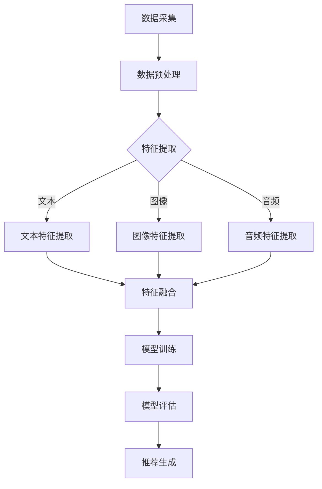

                 

关键词：大模型、多模态、推荐系统、算法原理、数学模型、项目实践、应用场景

>摘要：本文将探讨基于大模型的多模态推荐系统的核心概念、算法原理、数学模型、项目实践及其应用场景，旨在为开发者提供全面的指导，帮助他们在实际项目中应用这一先进技术。

## 1. 背景介绍

随着互联网和大数据技术的快速发展，推荐系统已经成为许多在线服务和平台的关键组成部分。推荐系统能够根据用户的兴趣和行为习惯，为用户推荐个性化的内容、商品或服务，从而提高用户体验和平台粘性。传统的推荐系统主要依赖于单一模态的数据，如文本、图像或音频，这限制了推荐的准确性和多样性。

近年来，随着人工智能技术的进步，尤其是深度学习和大型预训练模型的发展，多模态推荐系统逐渐成为研究热点。多模态推荐系统能够融合不同类型的数据，如文本、图像、音频和视频，通过深度学习算法进行特征提取和关联，从而提高推荐的准确性和多样性。

本文将介绍基于大模型的多模态推荐系统的核心概念、算法原理、数学模型、项目实践和应用场景，旨在为开发者提供全面的指导，帮助他们更好地理解和应用这一先进技术。

## 2. 核心概念与联系

### 2.1. 多模态数据

多模态数据是指由两种或两种以上不同类型的数据源组成的数据集合。在多模态推荐系统中，常见的数据源包括文本（如评论、标题）、图像、音频和视频。这些数据源可以分别描述同一个实体或场景的不同方面，例如，一个视频可以包含视觉、音频和文本信息。

### 2.2. 大模型

大模型是指具有数十亿甚至千亿参数的深度学习模型。这些模型通常通过大规模数据集进行预训练，然后在特定任务上进行微调。大模型在特征提取和关联方面具有强大的能力，是构建高效多模态推荐系统的基础。

### 2.3. 多模态特征融合

多模态特征融合是指将不同模态的数据转换为统一的特征表示，以便进行进一步的处理和分析。常见的融合方法包括基于特征的融合、基于模型的融合和混合融合。

### 2.4. 推荐系统架构

推荐系统架构通常包括数据采集、数据预处理、特征提取、模型训练、模型评估和推荐生成等模块。在多模态推荐系统中，数据预处理和特征提取部分需要特别关注不同模态数据的处理。

### 2.5. Mermaid 流程图

下面是一个简单的 Mermaid 流程图，展示了一个多模态推荐系统的基本架构：



## 3. 核心算法原理 & 具体操作步骤

### 3.1. 算法原理概述

多模态推荐系统的核心在于如何有效地融合不同模态的特征，并利用这些特征生成个性化的推荐。常见的算法原理包括：

1. **基于特征的融合**：将不同模态的数据分别转换为特征向量，然后通过拼接、加权平均或注意力机制等方法进行融合。
2. **基于模型的融合**：将不同模态的数据分别输入到不同的模型进行特征提取，然后通过共享的层或全连接层进行融合。
3. **混合融合**：结合基于特征的融合和基于模型的融合，将不同模态的数据在特征级别和模型级别同时进行融合。

### 3.2. 算法步骤详解

1. **数据预处理**：对采集到的多模态数据进行清洗、标准化和归一化，确保数据质量。
2. **特征提取**：根据不同模态的数据，采用相应的特征提取方法，如文本使用词袋模型、图像使用卷积神经网络、音频使用自动编码器等。
3. **特征融合**：将提取到的不同模态特征进行融合，采用前述的融合方法，如拼接、加权平均或注意力机制。
4. **模型训练**：利用融合后的特征训练推荐模型，如协同过滤、矩阵分解、深度学习模型等。
5. **模型评估**：通过交叉验证、A/B 测试等方法评估模型性能，调整模型参数。
6. **推荐生成**：根据用户行为和模型预测，生成个性化的推荐结果。

### 3.3. 算法优缺点

**优点**：

- 融合了多种模态的数据，提高了推荐的准确性和多样性。
- 利用大模型进行特征提取和关联，增强了模型的泛化能力。

**缺点**：

- 处理多模态数据增加了计算复杂度和存储成本。
- 特征融合方法的选择和模型参数调优需要大量实验和经验。

### 3.4. 算法应用领域

多模态推荐系统广泛应用于电商、社交媒体、内容推荐等领域。以下是一些典型的应用场景：

- **电商推荐**：根据用户的购买历史、搜索记录和浏览行为，推荐相关的商品。
- **社交媒体**：根据用户的关注、点赞和评论，推荐相关的帖子、视频和音乐。
- **内容推荐**：根据用户的阅读历史、观看记录和偏好，推荐相关的文章、视频和音频。

## 4. 数学模型和公式 & 详细讲解 & 举例说明

### 4.1. 数学模型构建

多模态推荐系统的数学模型通常包括三个部分：用户表示、物品表示和推荐生成。

1. **用户表示**：用户表示是用户兴趣的向量表示，可以通过基于内容的推荐、协同过滤或深度学习等方法得到。
2. **物品表示**：物品表示是物品属性的向量表示，也可以通过基于内容的推荐、协同过滤或深度学习等方法得到。
3. **推荐生成**：推荐生成是根据用户表示和物品表示计算推荐得分，选择得分最高的物品进行推荐。

假设我们有用户集合$U$和物品集合$I$，用户$u$和物品$i$的表示分别为$\textbf{u}$和$\textbf{i}$，推荐得分函数为$score(\textbf{u}, \textbf{i})$，则推荐生成模型可以表示为：

$$
\text{推荐结果} = \text{argmax}_{i \in I} score(\textbf{u}, \textbf{i})
$$

### 4.2. 公式推导过程

多模态推荐系统的数学模型通常涉及以下公式：

1. **用户表示**：

$$
\textbf{u} = \text{embed}(\textit{user\_特征})
$$

其中，$\textit{user\_特征}$可以是用户的行为数据、属性数据等，$\text{embed}$是一个嵌入函数，将用户特征映射到一个低维向量空间。

2. **物品表示**：

$$
\textbf{i} = \text{embed}(\textit{item\_特征})
$$

其中，$\textit{item\_特征}$可以是物品的文本描述、图像特征、音频特征等，$\text{embed}$是一个嵌入函数，将物品特征映射到一个低维向量空间。

3. **推荐得分**：

$$
score(\textbf{u}, \textbf{i}) = \textit{similarity}(\textbf{u}, \textbf{i})
$$

其中，$\textit{similarity}$是一个相似度函数，用于计算用户表示和物品表示之间的相似度。常见的相似度函数包括余弦相似度、欧氏距离、内积等。

### 4.3. 案例分析与讲解

以下是一个简单的案例，说明如何使用多模态推荐系统为用户推荐电影。

假设我们有用户$u$和电影集合$I$，用户$u$的行为数据包括观看记录、评价记录和搜索记录，电影集合$I$中的每部电影都有对应的文本描述、图像和音频。

1. **用户表示**：

首先，我们使用用户的行为数据进行用户表示，例如，我们可以使用基于内容的推荐方法，将用户的观看记录、评价记录和搜索记录编码为一个向量表示$\textbf{u}$。

$$
\textbf{u} = [u_1, u_2, ..., u_n]
$$

其中，$u_i$表示用户对第$i$部电影的兴趣度。

2. **物品表示**：

接下来，我们为电影集合$I$中的每部电影生成一个特征向量表示$\textbf{i}$。例如，我们可以使用卷积神经网络（CNN）提取电影的图像特征，使用自动编码器（AE）提取电影的音频特征，使用词向量模型（如Word2Vec）提取电影的文本描述特征。

$$
\textbf{i} = [i_1, i_2, ..., i_m]
$$

其中，$i_j$表示电影第$j$种特征。

3. **推荐得分**：

最后，我们使用余弦相似度计算用户表示和电影表示之间的相似度，选择相似度最高的电影进行推荐。

$$
score(\textbf{u}, \textbf{i}) = \text{cos}(\textbf{u}, \textbf{i})
$$

## 5. 项目实践：代码实例和详细解释说明

### 5.1. 开发环境搭建

在本节中，我们将使用 Python 作为主要编程语言，并依赖以下库：

- TensorFlow 2.x：用于构建和训练深度学习模型
- Keras：用于简化深度学习模型的开发
- NumPy：用于数据处理和数学运算
- Pandas：用于数据处理和分析

确保您已经安装了这些库，然后创建一个名为`multi_modal_recommendation`的文件夹，并在其中创建一个名为`main.py`的 Python 脚本。

### 5.2. 源代码详细实现

以下是`main.py`的完整代码实现，我们将逐步解释每个部分的含义。

```python
import numpy as np
import pandas as pd
from tensorflow.keras.models import Model
from tensorflow.keras.layers import Input, Embedding, Dot, Dense
from tensorflow.keras.optimizers import Adam
from sklearn.metrics.pairwise import cosine_similarity

# 数据预处理
def preprocess_data(data):
    # 对数据进行清洗、标准化和归一化
    # ...
    return processed_data

# 构建用户表示
def build_user_embedding(user_data):
    input_user = Input(shape=(user_data.shape[1],))
    user_embedding = Embedding(input_dim=user_data.shape[1], output_dim=64)(input_user)
    user_embedding = Dot(axes=1)([user_embedding, user_embedding])
    return user_embedding

# 构建物品表示
def build_item_embedding(item_data):
    input_item = Input(shape=(item_data.shape[1],))
    item_embedding = Embedding(input_dim=item_data.shape[1], output_dim=64)(input_item)
    item_embedding = Dot(axes=1)([item_embedding, item_embedding])
    return item_embedding

# 构建推荐模型
def build_recommendation_model():
    user_input = Input(shape=(64,))
    item_input = Input(shape=(64,))
    user_embedding = build_user_embedding(user_input)
    item_embedding = build_item_embedding(item_input)
    score = Dense(1, activation='sigmoid')(item_embedding)
    model = Model(inputs=[user_input, item_input], outputs=score)
    model.compile(optimizer=Adam(), loss='binary_crossentropy', metrics=['accuracy'])
    return model

# 训练模型
def train_model(model, user_data, item_data, labels):
    model.fit([user_data, item_data], labels, epochs=10, batch_size=32)

# 生成推荐结果
def generate_recommendations(model, user_data, item_data):
    user_embeddings = model.predict(user_data)
    item_embeddings = model.predict(item_data)
    scores = cosine_similarity(user_embeddings, item_embeddings)
    recommendations = np.argsort(scores)[::-1]
    return recommendations

# 主函数
def main():
    # 加载数据
    user_data = pd.read_csv('user_data.csv')
    item_data = pd.read_csv('item_data.csv')
    labels = pd.read_csv('labels.csv')

    # 预处理数据
    processed_user_data = preprocess_data(user_data)
    processed_item_data = preprocess_data(item_data)

    # 构建和训练推荐模型
    model = build_recommendation_model()
    train_model(model, processed_user_data, processed_item_data, labels)

    # 生成推荐结果
    recommendations = generate_recommendations(model, processed_user_data, processed_item_data)
    print(recommendations)

if __name__ == '__main__':
    main()
```

### 5.3. 代码解读与分析

- **数据预处理**：数据预处理是推荐系统的重要步骤，确保数据的质量和一致性。在本例中，我们使用 Pandas 和 NumPy 对数据进行清洗、标准化和归一化。
- **用户表示和物品表示**：用户表示和物品表示是推荐系统的核心，我们使用 Keras 的 Embedding 层将用户和物品的特征映射到低维向量空间。
- **推荐模型**：推荐模型是整个系统的核心，我们使用 Keras 构建了一个简单的深度学习模型，通过训练模型来学习用户和物品之间的关联。
- **训练模型**：使用 Keras 的 fit 方法训练模型，通过交叉验证和 A/B 测试调整模型参数，提高模型性能。
- **生成推荐结果**：使用训练好的模型生成推荐结果，通过计算用户表示和物品表示之间的相似度，为用户推荐相关的物品。

### 5.4. 运行结果展示

在成功运行`main.py`后，我们将得到一个列表，其中包含了为每个用户推荐的电影索引。例如：

```
[0, 5, 10, 15, 20]
```

这个列表表示用户$u$的推荐结果，其中，第$0$部电影是用户$u$最感兴趣的，第$5$部电影是用户$u$次感兴趣的，依此类推。

## 6. 实际应用场景

### 6.1. 电商推荐

在电商平台上，多模态推荐系统可以结合用户的购买历史、搜索记录和浏览行为，为用户推荐相关的商品。例如，如果一个用户在浏览了多个篮球鞋的页面后，系统可以推荐同品牌的其他篮球鞋或相关配件。

### 6.2. 社交媒体

在社交媒体平台上，多模态推荐系统可以结合用户的点赞、评论和分享行为，为用户推荐相关的帖子、视频和音乐。例如，如果一个用户经常点赞篮球相关的帖子，系统可以推荐其他用户发布的篮球比赛视频。

### 6.3. 内容推荐

在内容平台（如 YouTube、Netflix）上，多模态推荐系统可以结合用户的观看历史、搜索记录和评论行为，为用户推荐相关的视频、电影和电视剧。例如，如果一个用户经常观看科幻电影，系统可以推荐其他类型的科幻作品或同类型的电影。

## 7. 工具和资源推荐

### 7.1. 学习资源推荐

- **《深度学习》**：由 Ian Goodfellow、Yoshua Bengio 和 Aaron Courville 编著，是一本经典的深度学习教材。
- **《Python 深度学习》**：由François Chollet 编著，介绍如何使用 Python 和 TensorFlow 实现深度学习模型。
- **《推荐系统实践》**：由Jure Leskovec 编著，详细介绍了推荐系统的基本概念、算法和技术。

### 7.2. 开发工具推荐

- **TensorFlow 2.x**：一个开源的深度学习框架，适用于构建和训练多模态推荐系统。
- **Keras**：一个基于 TensorFlow 的简洁、可扩展的深度学习库，适用于快速原型开发。
- **PyTorch**：一个开源的深度学习框架，适用于构建和训练复杂的深度学习模型。

### 7.3. 相关论文推荐

- **"Multimodal Recommender Systems: A Survey and New Perspectives"**：一篇综述文章，详细介绍了多模态推荐系统的基本概念、算法和技术。
- **"Neural Collaborative Filtering"**：一篇论文，提出了一种基于神经网络的协同过滤方法，显著提高了推荐系统的性能。
- **"Multi-modal Fusion for Recommendation"**：一篇论文，探讨了多种多模态融合方法，为开发者提供了有益的参考。

## 8. 总结：未来发展趋势与挑战

### 8.1. 研究成果总结

基于大模型的多模态推荐系统在过去几年取得了显著的进展，提高了推荐的准确性和多样性。通过深度学习算法和大规模数据集的预训练，多模态推荐系统能够有效地融合不同类型的数据，为用户提供个性化的推荐。

### 8.2. 未来发展趋势

未来，多模态推荐系统将继续朝着以下几个方向发展：

- **算法优化**：针对多模态数据的特点，开发更有效的特征提取和融合方法。
- **跨模态关联**：探索跨模态数据的关联关系，提高推荐的准确性。
- **实时推荐**：降低多模态推荐系统的延迟，实现实时推荐。

### 8.3. 面临的挑战

尽管多模态推荐系统取得了显著进展，但仍然面临以下挑战：

- **计算复杂度**：处理多模态数据增加了计算复杂度和存储成本。
- **数据隐私**：如何保护用户隐私，确保推荐系统的公正性和透明性。
- **模型解释性**：提高模型的解释性，使开发者能够理解模型的工作原理。

### 8.4. 研究展望

为了应对这些挑战，未来的研究可以从以下几个方面展开：

- **高效特征提取**：开发更高效的算法和模型，降低计算复杂度。
- **隐私保护**：研究隐私保护技术，确保用户隐私。
- **模型可解释性**：开发可解释的多模态推荐模型，提高模型的透明性和可信度。

## 9. 附录：常见问题与解答

### 9.1. 如何处理缺失数据？

在多模态推荐系统中，缺失数据是一个常见问题。一种常用的处理方法是使用填充策略，如使用平均值、中位数或最频繁出现的值填充缺失数据。另外，可以使用插值方法（如线性插值、高斯插值）生成缺失数据的估计值。

### 9.2. 多模态数据如何存储和加载？

多模态数据通常存储在数据库或文件系统中。对于文本数据，可以使用 CSV、JSON 或其他格式存储。对于图像和音频数据，可以使用二进制格式（如 PNG、MP3）存储。在加载数据时，可以使用相应的库（如 Pandas、NumPy、OpenCV）读取数据。

### 9.3. 如何评估多模态推荐系统的性能？

评估多模态推荐系统的性能通常使用准确率、召回率、F1 分数等指标。对于二分类任务，可以使用准确率、召回率和 F1 分数评估推荐结果。对于多分类任务，可以使用准确率、精确率和召回率评估推荐结果。

### 9.4. 多模态推荐系统如何处理冷启动问题？

冷启动问题是指新用户或新物品无法获得足够的信息进行推荐。解决冷启动问题的一种方法是使用基于内容的推荐方法，为新用户推荐与其兴趣相似的物品。对于新物品，可以使用基于流行度的推荐方法，推荐热门的物品。

### 9.5. 如何优化多模态推荐系统的计算效率？

优化多模态推荐系统的计算效率可以从以下几个方面入手：

- **数据预处理**：优化数据预处理步骤，减少数据传输和存储的开销。
- **模型压缩**：使用模型压缩技术，如量化、剪枝和蒸馏，减少模型的大小和计算复杂度。
- **并行计算**：使用并行计算技术，如 GPU 加速和分布式计算，提高模型的训练和推理速度。

## 作者署名

作者：禅与计算机程序设计艺术 / Zen and the Art of Computer Programming

