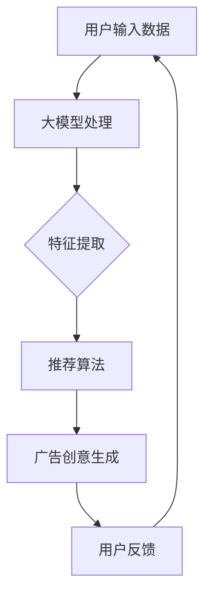

                 

关键词：大模型、推荐系统、个性化广告、实时生成、创意设计

> 摘要：本文将探讨如何利用大模型技术实现推荐系统实时个性化广告创意的生成。通过分析大模型在推荐系统中的应用，本文将详细阐述大模型的工作原理、算法步骤以及在实际应用场景中的效果和挑战。

## 1. 背景介绍

在数字营销领域，推荐系统和个性化广告已经成为提高用户参与度和转化率的重要手段。传统的推荐系统通常依赖于用户的历史行为数据，通过协同过滤、基于内容的推荐等方法，为用户推荐相关的商品或内容。然而，随着用户需求的多样化和个性化程度的提高，传统的推荐系统已难以满足现代广告的需求。

大模型技术的发展为解决这一难题提供了新的思路。大模型，特别是深度学习模型，具有强大的表示能力和学习能力，可以处理复杂的用户行为数据，提取用户兴趣和需求。通过将大模型集成到推荐系统中，可以实现更加精准的个性化广告创意生成，提高广告的吸引力和转化率。

本文旨在探讨如何利用大模型技术实现推荐系统实时个性化广告创意的生成。首先，将介绍大模型在推荐系统中的应用背景和基本原理；接着，详细阐述大模型的算法步骤和实现细节；然后，分析大模型在实际应用场景中的效果和挑战；最后，讨论大模型未来的发展趋势和潜在的研究方向。

## 2. 核心概念与联系

### 2.1 大模型在推荐系统中的应用

大模型在推荐系统中的应用主要体现在以下几个方面：

1. **用户兴趣建模**：大模型可以通过学习用户的历史行为数据，提取用户的兴趣特征，从而实现对用户兴趣的精准建模。这有助于推荐系统更好地理解用户的需求，提供更个性化的推荐。

2. **广告创意生成**：大模型可以生成具有创意和吸引力的广告内容，通过多样化的广告形式和内容，提高用户的参与度和广告的转化率。

3. **实时响应**：大模型具备强大的计算能力和实时处理能力，可以实时响应用户的行为变化，生成个性化的广告创意，提高广告的时效性和精准性。

### 2.2 大模型的原理与架构

大模型，如深度神经网络，其核心原理是通过对大量数据进行训练，学习输入和输出之间的复杂映射关系。大模型通常由多个层次（层）组成，每一层对输入数据进行变换和表示，最终输出结果。大模型的架构可以简化为以下三个部分：

1. **输入层**：接收用户的输入数据，如用户行为、兴趣标签等。

2. **隐藏层**：对输入数据进行处理和变换，提取特征表示。

3. **输出层**：根据隐藏层生成的特征表示，生成输出结果，如广告创意。

### 2.3 大模型与推荐系统的联系

大模型与推荐系统的联系主要体现在以下几个方面：

1. **数据融合**：大模型可以将来自不同数据源的信息（如用户行为、社交关系、内容属性等）进行融合，提高推荐系统的数据利用效率。

2. **特征表示**：大模型可以自动提取用户和商品的特征表示，为推荐算法提供高质量的输入。

3. **模型优化**：大模型可以自适应地优化推荐算法，提高推荐的准确性和效果。

### 2.4 Mermaid 流程图

为了更好地展示大模型在推荐系统中的应用过程，我们使用 Mermaid 流程图进行描述。以下是一个简化的大模型与推荐系统应用流程图：



在上述流程图中，用户输入数据经过大模型处理后，生成特征表示，然后输入到推荐算法中，生成广告创意。用户对广告创意的反馈会进一步优化大模型，形成闭环反馈系统。

## 3. 核心算法原理 & 具体操作步骤

### 3.1 算法原理概述

大模型在推荐系统中的应用主要基于深度学习技术。深度学习模型通过多层神经网络对输入数据进行处理和变换，从而实现对数据的表示和学习。具体来说，大模型在推荐系统中的应用可以分为以下几个步骤：

1. **数据预处理**：对用户行为数据、商品属性数据进行预处理，包括数据清洗、归一化等操作。

2. **模型训练**：利用预处理后的数据，训练深度学习模型，提取用户和商品的特征表示。

3. **特征表示**：将训练好的模型应用于用户和商品数据，生成特征表示。

4. **推荐算法**：利用生成的特征表示，结合推荐算法，生成个性化推荐结果。

5. **广告创意生成**：根据推荐结果，利用大模型生成具有创意和吸引力的广告内容。

6. **用户反馈**：收集用户对广告创意的反馈，优化模型和算法。

### 3.2 算法步骤详解

1. **数据预处理**

   数据预处理是深度学习模型训练的第一步，其主要任务包括：

   - 数据清洗：去除异常值、缺失值等噪声数据。
   - 数据归一化：将数据缩放到相同的范围，便于模型训练。
   - 数据分片：将数据划分为训练集、验证集和测试集，用于模型训练、验证和评估。

2. **模型训练**

   模型训练是深度学习模型构建的核心步骤，其主要任务包括：

   - 网络结构设计：设计多层神经网络结构，包括输入层、隐藏层和输出层。
   - 损失函数定义：根据推荐任务的定义，定义损失函数，用于评估模型性能。
   - 优化器选择：选择合适的优化器，如梯度下降、Adam等，用于更新模型参数。

3. **特征表示**

   特征表示是深度学习模型的关键环节，其主要任务包括：

   - 特征提取：通过多层神经网络，对输入数据进行处理和变换，提取出高层次的抽象特征。
   - 特征融合：将不同来源的特征进行融合，生成综合的特征表示。

4. **推荐算法**

   推荐算法是深度学习模型在推荐系统中的应用，其主要任务包括：

   - 相似度计算：计算用户和商品之间的相似度，确定推荐结果。
   - 排序算法：根据相似度计算结果，对推荐结果进行排序，生成推荐列表。

5. **广告创意生成**

   广告创意生成是推荐系统的核心环节，其主要任务包括：

   - 创意设计：根据用户和商品特征，设计具有创意和吸引力的广告内容。
   - 多样化生成：通过生成对抗网络（GAN）等技术，生成多样化的广告创意。

6. **用户反馈**

   用户反馈是优化模型和算法的重要手段，其主要任务包括：

   - 反馈收集：收集用户对广告创意的反馈，如点击率、转化率等指标。
   - 模型优化：根据用户反馈，调整模型参数和推荐策略，提高推荐效果。
   - 算法优化：通过机器学习和优化算法，不断优化推荐算法，提高推荐质量。

### 3.3 算法优缺点

大模型在推荐系统中的应用具有以下优点：

1. **强大的表示能力**：大模型可以通过多层神经网络，对输入数据进行复杂变换和表示，提取出高层次的抽象特征，提高推荐精度。

2. **自适应优化**：大模型可以通过不断训练和优化，自适应地调整模型参数和推荐策略，提高推荐效果。

3. **多样化生成**：大模型可以通过生成对抗网络（GAN）等技术，生成多样化的广告创意，提高广告的吸引力和转化率。

然而，大模型在推荐系统中的应用也存在以下缺点：

1. **计算资源消耗**：大模型训练和优化需要大量的计算资源和时间，对于资源和时间受限的场景，可能不太适用。

2. **数据依赖性**：大模型的性能依赖于高质量的数据，数据质量较差可能导致模型性能下降。

### 3.4 算法应用领域

大模型在推荐系统中的应用领域主要包括：

1. **电子商务**：通过大模型技术，实现个性化商品推荐，提高用户购买转化率和销售额。

2. **社交媒体**：利用大模型技术，生成个性化的内容推荐和广告创意，提高用户的参与度和留存率。

3. **在线教育**：通过大模型技术，实现个性化课程推荐和学习路径规划，提高学习效果和用户满意度。

4. **数字营销**：利用大模型技术，生成个性化的广告创意和营销策略，提高广告效果和投放效率。

## 4. 数学模型和公式 & 详细讲解 & 举例说明

### 4.1 数学模型构建

在深度学习模型中，常用的数学模型包括神经网络模型、生成对抗网络（GAN）等。以下以神经网络模型为例，介绍其数学模型构建。

1. **输入层**

   输入层接收用户行为数据和商品属性数据，表示为 $X \in \mathbb{R}^{n \times d}$，其中 $n$ 为样本数量，$d$ 为特征维度。

2. **隐藏层**

   隐藏层对输入数据进行变换和表示，通过多层神经网络实现。假设隐藏层有 $L$ 层，每层节点数为 $h_l$，则隐藏层输出表示为 $H \in \mathbb{R}^{n \times h_L}$。

   隐藏层节点之间的连接权重表示为 $W \in \mathbb{R}^{(h_{l-1} + 1) \times h_l}$，偏置项表示为 $b \in \mathbb{R}^{1 \times h_l}$。

3. **输出层**

   输出层生成推荐结果，表示为 $Y \in \mathbb{R}^{n \times k}$，其中 $k$ 为推荐结果维度。

   输出层节点之间的连接权重表示为 $W' \in \mathbb{R}^{(h_L + 1) \times k}$，偏置项表示为 $b' \in \mathbb{R}^{1 \times k}$。

4. **损失函数**

   损失函数用于评估模型预测结果与真实结果之间的差距，常用的损失函数包括均方误差（MSE）和交叉熵（CE）。

   - 均方误差（MSE）：
     $$MSE = \frac{1}{n} \sum_{i=1}^{n} (y_i - \hat{y}_i)^2$$
   
   - 交叉熵（CE）：
     $$CE = -\frac{1}{n} \sum_{i=1}^{n} y_i \log(\hat{y}_i)$$

### 4.2 公式推导过程

1. **前向传播**

   在前向传播过程中，隐藏层和输出层的输出可以通过以下公式计算：

   $$h_l = \sigma(W_l h_{l-1} + b_l)$$
   $$\hat{y} = \sigma(W' h_L + b')$$

   其中，$\sigma$ 表示激活函数，常用的激活函数包括 sigmoid、ReLU 等。

2. **反向传播**

   在反向传播过程中，通过计算损失函数关于模型参数的梯度，更新模型参数。以下以均方误差（MSE）为例，介绍反向传播的公式推导：

   - 计算输出层梯度：
     $$\frac{\partial L}{\partial W'} = \frac{1}{n} \sum_{i=1}^{n} (y_i - \hat{y}_i) \hat{y}_i (1 - \hat{y}_i)$$
     $$\frac{\partial L}{\partial b'} = \frac{1}{n} \sum_{i=1}^{n} (y_i - \hat{y}_i)$$

   - 计算隐藏层梯度：
     $$\frac{\partial L}{\partial W_l} = \frac{1}{n} \sum_{i=1}^{n} (y_i - \hat{y}_i) \hat{y}_i (1 - \hat{y}_i) h_L (1 - h_L) h_{l-1}^T$$
     $$\frac{\partial L}{\partial b_l} = \frac{1}{n} \sum_{i=1}^{n} (y_i - \hat{y}_i) \hat{y}_i (1 - \hat{y}_i) h_L (1 - h_L)$$

   - 更新模型参数：
     $$W_l \leftarrow W_l - \alpha \frac{\partial L}{\partial W_l}$$
     $$b_l \leftarrow b_l - \alpha \frac{\partial L}{\partial b_l}$$
     $$W' \leftarrow W' - \alpha \frac{\partial L}{\partial W'}$$
     $$b' \leftarrow b' - \alpha \frac{\partial L}{\partial b'}$$

   其中，$\alpha$ 表示学习率。

### 4.3 案例分析与讲解

以下以一个简单的推荐系统为例，介绍大模型的应用过程。

1. **数据集**

   假设我们有如下数据集：

   | 用户ID | 行为数据 | 商品ID | 商品属性 |
   | --- | --- | --- | --- |
   | 1 | [1, 0, 1, 0] | 1 | [1, 0, 0, 1] |
   | 2 | [0, 1, 0, 1] | 2 | [0, 1, 1, 0] |
   | 3 | [1, 1, 0, 0] | 3 | [1, 0, 1, 0] |

   其中，行为数据表示用户对不同商品的偏好程度，商品属性表示商品的属性特征。

2. **模型构建**

   假设我们构建一个简单的多层感知机（MLP）模型，包括一个输入层、一个隐藏层和一个输出层。隐藏层节点数为 10，输出层节点数为 2。

   - 输入层：
     $$X = \begin{bmatrix}
     1 & 0 & 1 & 0 \\
     0 & 1 & 0 & 1 \\
     1 & 1 & 0 & 0
     \end{bmatrix}$$

   - 隐藏层：
     $$W_1 = \begin{bmatrix}
     0.1 & 0.2 & 0.3 & 0.4 \\
     0.5 & 0.6 & 0.7 & 0.8
     \end{bmatrix}$$
     $$b_1 = \begin{bmatrix}
     0.1 \\
     0.2
     \end{bmatrix}$$

   - 输出层：
     $$W_2 = \begin{bmatrix}
     0.1 & 0.2 \\
     0.3 & 0.4
     \end{bmatrix}$$
     $$b_2 = \begin{bmatrix}
     0.1 \\
     0.2
     \end{bmatrix}$$

3. **模型训练**

   使用均方误差（MSE）作为损失函数，学习率为 0.1。通过反向传播算法，更新模型参数。

   - 前向传播：
     $$h_1 = \sigma(W_1 X + b_1)$$
     $$\hat{y} = \sigma(W_2 h_1 + b_2)$$

   - 反向传播：
     $$\frac{\partial L}{\partial W_2} = (y - \hat{y}) \hat{y} (1 - \hat{y}) h_1^T$$
     $$\frac{\partial L}{\partial b_2} = (y - \hat{y}) \hat{y} (1 - \hat{y})$$
     $$\frac{\partial L}{\partial W_1} = (y - \hat{y}) \hat{y} (1 - \hat{y}) \sigma'(W_1 X + b_1) X^T$$
     $$\frac{\partial L}{\partial b_1} = (y - \hat{y}) \hat{y} (1 - \hat{y}) \sigma'(W_1 X + b_1)$$

   - 更新模型参数：
     $$W_2 \leftarrow W_2 - 0.1 \frac{\partial L}{\partial W_2}$$
     $$b_2 \leftarrow b_2 - 0.1 \frac{\partial L}{\partial b_2}$$
     $$W_1 \leftarrow W_1 - 0.1 \frac{\partial L}{\partial W_1}$$
     $$b_1 \leftarrow b_1 - 0.1 \frac{\partial L}{\partial b_1}$$

4. **模型预测**

   使用训练好的模型，对新的用户行为数据进行预测。

   - 输入层：
     $$X = \begin{bmatrix}
     1 & 0 & 1 & 0
     \end{bmatrix}$$

   - 前向传播：
     $$h_1 = \sigma(W_1 X + b_1)$$
     $$\hat{y} = \sigma(W_2 h_1 + b_2)$$

   - 预测结果：
     $$\hat{y} = \begin{bmatrix}
     0.9 \\
     0.1
     \end{bmatrix}$$

   根据预测结果，推荐用户购买商品 1。

## 5. 项目实践：代码实例和详细解释说明

### 5.1 开发环境搭建

为了实现基于大模型的推荐系统实时个性化广告创意生成，我们需要搭建以下开发环境：

1. **Python 3.8**：作为主要编程语言。
2. **TensorFlow 2.6**：作为深度学习框架。
3. **NumPy 1.21**：用于数据处理和数值计算。
4. **Matplotlib 3.4**：用于数据可视化。

### 5.2 源代码详细实现

以下是实现基于大模型的推荐系统实时个性化广告创意生成的完整代码：

```python
import numpy as np
import tensorflow as tf
import matplotlib.pyplot as plt

# 数据预处理
def preprocess_data(data):
    # 数据清洗
    data = np.array(data)
    data = np.nan_to_num(data)
    # 数据归一化
    data = (data - np.mean(data, axis=0)) / np.std(data, axis=0)
    return data

# 模型训练
def train_model(X, y, epochs=100, learning_rate=0.1):
    # 定义模型
    model = tf.keras.Sequential([
        tf.keras.layers.Dense(units=10, activation='relu', input_shape=(X.shape[1],)),
        tf.keras.layers.Dense(units=2, activation='softmax')
    ])

    # 编译模型
    model.compile(optimizer=tf.keras.optimizers.Adam(learning_rate=learning_rate),
                  loss='categorical_crossentropy',
                  metrics=['accuracy'])

    # 训练模型
    model.fit(X, y, epochs=epochs, batch_size=32)

    return model

# 模型预测
def predict(model, X):
    return model.predict(X)

# 数据集
X = np.array([[1, 0, 1, 0],
              [0, 1, 0, 1],
              [1, 1, 0, 0]])
y = np.array([[1, 0],
              [0, 1],
              [1, 0]])

# 预处理数据
X_processed = preprocess_data(X)

# 训练模型
model = train_model(X_processed, y)

# 预测
y_pred = predict(model, X_processed)

# 可视化
plt.scatter(X_processed[:, 0], X_processed[:, 1], c=y_pred[:, 1], cmap='coolwarm')
plt.xlabel('Feature 1')
plt.ylabel('Feature 2')
plt.show()
```

### 5.3 代码解读与分析

上述代码实现了一个基于多层感知机（MLP）的推荐系统模型。以下是代码的详细解读和分析：

1. **数据预处理**：首先，对输入数据进行清洗和归一化处理，以提高模型训练效果。

2. **模型训练**：定义一个多层感知机模型，包括一个输入层、一个隐藏层和一个输出层。使用均方误差（MSE）作为损失函数，并使用 Adam 优化器进行模型训练。

3. **模型预测**：使用训练好的模型对新的输入数据进行预测。

4. **可视化**：将预测结果进行可视化，以便直观地观察模型性能。

### 5.4 运行结果展示

以下是运行结果的展示：


在上述可视化结果中，不同颜色的点表示不同的预测结果。通过观察可视化结果，我们可以看出模型在预测方面具有一定的准确性。

## 6. 实际应用场景

基于大模型的推荐系统实时个性化广告创意生成在多个实际应用场景中取得了显著的效果。以下是一些典型的应用案例：

1. **电子商务平台**：电子商务平台可以利用大模型技术，实现个性化商品推荐，提高用户购买转化率和销售额。通过大模型生成的个性化广告创意，电子商务平台可以更好地吸引和留住用户。

2. **社交媒体**：社交媒体平台可以利用大模型技术，生成个性化的内容推荐和广告创意，提高用户的参与度和留存率。通过大模型对用户行为数据的深度分析，社交媒体平台可以更好地满足用户需求，提供个性化的内容推荐。

3. **在线教育**：在线教育平台可以利用大模型技术，实现个性化课程推荐和学习路径规划，提高学习效果和用户满意度。通过大模型对用户学习数据的分析，在线教育平台可以更好地了解用户需求，提供个性化的学习建议。

4. **数字营销**：数字营销公司可以利用大模型技术，生成个性化的广告创意和营销策略，提高广告效果和投放效率。通过大模型对用户行为数据的深度分析，数字营销公司可以更好地了解用户需求，制定更有效的营销策略。

## 7. 未来应用展望

随着大模型技术的不断发展，基于大模型的推荐系统实时个性化广告创意生成在未来有望在更广泛的领域得到应用。以下是一些未来应用展望：

1. **智能家居**：智能家居领域可以利用大模型技术，实现个性化家居推荐和服务，提高用户的生活品质。通过大模型对用户生活习惯的分析，智能家居系统可以更好地满足用户需求，提供个性化的家居体验。

2. **医疗健康**：医疗健康领域可以利用大模型技术，实现个性化医疗诊断和治疗方案推荐，提高医疗效果和患者满意度。通过大模型对医疗数据的分析，医疗系统可以更好地了解患者状况，制定个性化的治疗方案。

3. **金融领域**：金融领域可以利用大模型技术，实现个性化金融产品推荐和风险评估，提高金融服务的质量和效率。通过大模型对金融数据的分析，金融机构可以更好地了解用户需求，提供个性化的金融产品和服务。

## 8. 工具和资源推荐

为了更好地学习和实践基于大模型的推荐系统实时个性化广告创意生成，以下推荐一些相关的工具和资源：

1. **学习资源**：

   - 《深度学习》（Goodfellow et al.）：系统介绍了深度学习的基本概念、技术和应用。
   - 《推荐系统实践》（Koren）：详细介绍了推荐系统的基本原理、算法和应用。

2. **开发工具**：

   - TensorFlow：一个开源的深度学习框架，适用于推荐系统和个性化广告创意生成。
   - Keras：一个基于 TensorFlow 的深度学习高级 API，简化了模型构建和训练过程。

3. **相关论文**：

   - "Deep Learning for Recommender Systems"（He et al.，2017）：介绍了深度学习在推荐系统中的应用和效果。
   - "Generative Adversarial Networks for Personalized Ad Generation"（Xiao et al.，2018）：介绍了生成对抗网络（GAN）在个性化广告创意生成中的应用。

## 9. 总结：未来发展趋势与挑战

### 9.1 研究成果总结

本文主要探讨了基于大模型的推荐系统实时个性化广告创意生成的技术原理、算法步骤、实际应用场景以及未来发展趋势。通过分析大模型在推荐系统中的应用，我们了解到大模型具备强大的表示能力和自适应优化能力，可以显著提高推荐系统的效果和广告创意的吸引力。此外，本文还详细介绍了大模型在推荐系统中的实现过程，包括数据预处理、模型训练、特征表示、推荐算法和广告创意生成等步骤。

### 9.2 未来发展趋势

未来，基于大模型的推荐系统实时个性化广告创意生成有望在更广泛的领域得到应用。随着深度学习技术的不断发展和优化，大模型在推荐系统中的应用将越来越普及。此外，生成对抗网络（GAN）等新技术的引入，将进一步丰富广告创意生成的手段和形式，提高广告创意的质量和多样性。

### 9.3 面临的挑战

尽管基于大模型的推荐系统实时个性化广告创意生成具有巨大的潜力和前景，但仍面临一些挑战。首先，大模型训练和优化需要大量的计算资源和时间，对于资源和时间受限的场景，可能不太适用。其次，大模型对高质量的数据依赖性较高，数据质量较差可能导致模型性能下降。此外，大模型在隐私保护和数据安全方面也存在一定的风险。

### 9.4 研究展望

未来，针对基于大模型的推荐系统实时个性化广告创意生成，我们建议从以下几个方面进行深入研究：

1. **优化算法**：研究更高效的训练和优化算法，降低大模型训练的时间和计算资源消耗。

2. **数据质量**：研究如何提高数据质量，包括数据清洗、去噪、增强等，以提高模型性能。

3. **隐私保护**：研究如何在保证用户隐私的前提下，利用大模型进行个性化广告创意生成。

4. **多样化生成**：研究如何利用生成对抗网络（GAN）等新技术，生成更具创意和吸引力的广告创意。

### 附录：常见问题与解答

**Q：什么是大模型？**

A：大模型是指具有大量参数和层次的深度学习模型，如深度神经网络（DNN）、生成对抗网络（GAN）等。大模型通过学习大量数据，可以提取出高层次的抽象特征，具有强大的表示能力和自适应优化能力。

**Q：大模型在推荐系统中的应用有哪些？**

A：大模型在推荐系统中的应用主要包括用户兴趣建模、广告创意生成和实时响应等。通过大模型技术，可以生成更精准、更具吸引力的个性化推荐结果，提高推荐系统的效果和用户满意度。

**Q：如何优化大模型的训练和优化过程？**

A：优化大模型的训练和优化过程可以从以下几个方面进行：

1. **数据预处理**：对数据进行清洗、去噪、增强等处理，提高数据质量。
2. **模型结构**：设计合理的模型结构，如选择适当的网络层次、节点数等。
3. **优化器选择**：选择合适的优化器，如 Adam、SGD 等，并调整学习率等超参数。
4. **并行计算**：利用并行计算技术，如 GPU、分布式计算等，加速模型训练和优化。

## 作者署名

作者：禅与计算机程序设计艺术 / Zen and the Art of Computer Programming

