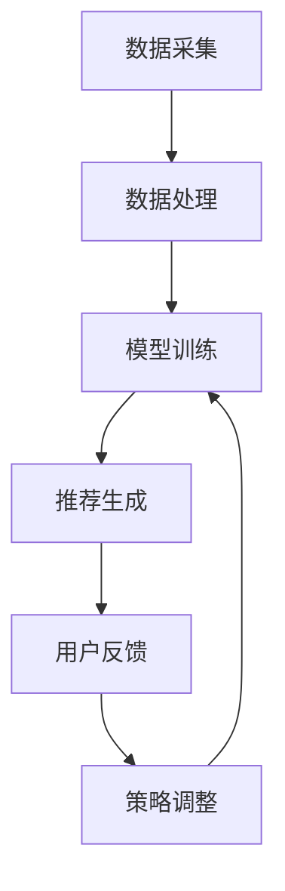

                 

关键词：大模型、推荐系统、实时反馈、AI、数据流处理、算法优化

> 摘要：本文深入探讨了基于大模型的推荐系统实时反馈机制，通过详细的算法原理、数学模型、项目实践和未来展望，全面解析了该机制在提高推荐系统性能和用户体验方面的应用和潜力。

## 1. 背景介绍

推荐系统作为人工智能的重要应用之一，已经广泛应用于电子商务、社交媒体、在线视频、音乐平台等领域。传统的推荐系统依赖于历史数据和用户行为特征，通过统计和机器学习算法生成推荐结果。然而，随着用户数据的爆炸式增长和实时交互需求的增加，传统推荐系统在应对实时性要求方面显得力不从心。

大模型的引入为推荐系统的发展带来了新的机遇。大模型具备更强的数据处理能力和学习效率，能够捕捉用户行为的复杂模式和动态变化。实时反馈机制则是大模型在推荐系统中的关键应用之一，它通过持续监测用户反馈，动态调整推荐策略，从而提高推荐系统的性能和用户体验。

本文将围绕基于大模型的推荐系统实时反馈机制，详细探讨其核心算法原理、数学模型、项目实践和未来展望，以期为相关领域的研究和应用提供参考和启示。

## 2. 核心概念与联系

### 2.1 大模型

大模型是指具有海量参数和巨大计算量的深度学习模型，如Transformer、BERT等。大模型通过在海量数据上进行训练，能够捕捉到复杂的模式和规律，从而在任务表现上优于传统机器学习算法。

### 2.2 推荐系统

推荐系统是指根据用户历史行为、兴趣偏好和上下文信息，为用户提供个性化推荐结果的一种信息系统。推荐系统通常包括数据采集、数据处理、模型训练、推荐生成和用户反馈等环节。

### 2.3 实时反馈机制

实时反馈机制是指推荐系统在生成推荐结果后，通过持续监测用户反馈，动态调整推荐策略的过程。实时反馈机制能够提高推荐系统的自适应性和用户体验。

### 2.4 Mermaid 流程图

以下是一个基于大模型的推荐系统实时反馈机制的 Mermaid 流程图：



## 3. 核心算法原理 & 具体操作步骤

### 3.1 算法原理概述

基于大模型的推荐系统实时反馈机制主要包括以下步骤：

1. 数据采集：从各种数据源（如用户行为日志、商品信息、社交媒体等）中收集数据。
2. 数据处理：对采集到的数据进行预处理，如去噪、归一化、特征提取等。
3. 模型训练：使用预处理后的数据训练大模型，以捕捉用户行为和兴趣模式。
4. 推荐生成：利用训练好的大模型，根据用户当前上下文信息生成个性化推荐结果。
5. 用户反馈：监测用户对推荐结果的反馈，如点击、购买、评分等。
6. 策略调整：根据用户反馈动态调整推荐策略，以提高推荐效果。

### 3.2 算法步骤详解

1. **数据采集**：

   数据采集是推荐系统的基础，其质量直接影响推荐效果。推荐系统可以从以下数据源获取数据：

   - 用户行为数据：包括浏览、搜索、点击、购买、收藏等行为。
   - 商品信息数据：包括商品类别、价格、库存、销量等属性。
   - 社交媒体数据：包括用户评论、点赞、分享等社交行为。

2. **数据处理**：

   数据处理包括数据清洗、数据预处理和数据特征提取等步骤。具体方法如下：

   - 数据清洗：去除重复、异常和无关数据，保证数据质量。
   - 数据预处理：对数值型数据进行归一化或标准化处理，对类别型数据进行编码处理。
   - 数据特征提取：从原始数据中提取有助于推荐的关键特征，如用户兴趣偏好、商品属性等。

3. **模型训练**：

   模型训练是推荐系统的核心环节。常用的方法包括基于矩阵分解、协同过滤和深度学习等。以下是一个简单的基于矩阵分解的模型训练过程：

   - 定义损失函数：选择适当的损失函数，如均方误差（MSE）、交叉熵等。
   - 定义优化器：选择合适的优化器，如梯度下降、Adam等。
   - 训练模型：使用预处理后的数据训练大模型，优化模型参数。
   - 评估模型：使用验证集或测试集评估模型性能，调整模型参数。

4. **推荐生成**：

   推荐生成是指利用训练好的大模型，根据用户当前上下文信息生成个性化推荐结果。具体步骤如下：

   - 提取用户特征：从用户行为日志中提取用户特征，如用户兴趣偏好、历史购买记录等。
   - 提取商品特征：从商品信息中提取商品特征，如商品类别、价格、销量等。
   - 计算推荐得分：使用训练好的大模型计算用户对每个商品的兴趣得分。
   - 排序生成推荐列表：根据推荐得分对商品进行排序，生成个性化推荐列表。

5. **用户反馈**：

   用户反馈是实时反馈机制的重要环节，其质量直接影响推荐系统的性能。用户反馈可以通过以下方式获取：

   - 显式反馈：如用户对推荐商品的评分、点赞等。
   - 隐式反馈：如用户对推荐商品的行为，如点击、购买、收藏等。

6. **策略调整**：

   策略调整是指根据用户反馈动态调整推荐策略，以提高推荐效果。具体方法如下：

   - 反馈分析：对用户反馈进行统计分析，识别用户兴趣和偏好。
   - 策略优化：根据反馈分析结果调整推荐策略，如调整推荐算法、调整推荐商品排序等。
   - 模型重新训练：根据新的用户特征和反馈数据重新训练大模型。

### 3.3 算法优缺点

**优点**：

1. 高效性：大模型具备更强的数据处理能力和学习效率，能够快速捕捉用户行为的动态变化。
2. 个性化：实时反馈机制可以根据用户反馈动态调整推荐策略，提高推荐个性化水平。
3. 实时性：实时反馈机制能够实时监测用户反馈，动态调整推荐结果，提高推荐系统的实时性。

**缺点**：

1. 资源消耗：大模型训练和实时反馈机制需要大量的计算资源和存储资源。
2. 数据质量：用户反馈数据的质量直接影响推荐系统的性能，需要保证数据质量。
3. 难以平衡：在实时性和推荐效果之间难以取得平衡，需要根据实际需求进行调整。

### 3.4 算法应用领域

基于大模型的推荐系统实时反馈机制在多个领域具有广泛的应用前景：

1. 电子商务：通过实时反馈机制提高商品推荐效果，提升用户购物体验。
2. 社交媒体：根据用户反馈动态调整内容推荐策略，提高用户参与度。
3. 在线视频：通过实时反馈机制优化视频推荐，提高用户观看时长和满意度。
4. 医疗健康：根据用户健康数据实时调整医疗推荐策略，提供个性化医疗服务。

## 4. 数学模型和公式 & 详细讲解 & 举例说明

### 4.1 数学模型构建

基于大模型的推荐系统实时反馈机制的数学模型主要包括用户行为模型和推荐模型。

#### 用户行为模型：

用户行为模型用于描述用户行为数据，通常使用概率分布函数表示。假设用户 $u$ 在时间 $t$ 的行为可以表示为 $X_t$，则用户行为模型可以表示为：

$$
X_t = P(X_t | U_t, C_t)
$$

其中，$U_t$ 表示用户特征，$C_t$ 表示上下文信息。

#### 推荐模型：

推荐模型用于生成个性化推荐结果，通常使用评分预测模型或排序模型表示。假设用户 $u$ 对商品 $i$ 的兴趣得分可以表示为 $S_i^u$，则推荐模型可以表示为：

$$
S_i^u = f(U_t, I_i, C_t)
$$

其中，$I_i$ 表示商品特征。

### 4.2 公式推导过程

以下是一个简单的用户行为模型和推荐模型的推导过程。

#### 用户行为模型推导：

假设用户 $u$ 在时间 $t$ 的行为是随机事件，可以用概率分布函数 $P(X_t | U_t, C_t)$ 表示。根据贝叶斯定理，有：

$$
P(X_t | U_t, C_t) = \frac{P(U_t, C_t | X_t)P(X_t)}{P(U_t, C_t)}
$$

其中，$P(X_t)$ 是用户行为先验概率，$P(U_t, C_t | X_t)$ 是用户特征和上下文信息在给定用户行为下的条件概率，$P(U_t, C_t)$ 是用户特征和上下文信息的联合概率。

由于用户行为是随机事件，$P(X_t)$ 通常可以用高斯分布表示：

$$
P(X_t) = \frac{1}{\sqrt{2\pi\sigma^2}}e^{-\frac{(X_t - \mu)^2}{2\sigma^2}}
$$

其中，$\mu$ 是用户行为均值，$\sigma$ 是用户行为标准差。

#### 推荐模型推导：

假设用户 $u$ 对商品 $i$ 的兴趣得分 $S_i^u$ 是由用户特征 $U_t$、商品特征 $I_i$ 和上下文信息 $C_t$ 共同决定的，可以用线性模型表示：

$$
S_i^u = \beta_0 + \beta_1U_t + \beta_2I_i + \beta_3C_t
$$

其中，$\beta_0$、$\beta_1$、$\beta_2$ 和 $\beta_3$ 是模型参数。

根据线性回归模型，可以推导出：

$$
\beta_0 = \frac{\sum_{i=1}^{N}\sum_{t=1}^{T}S_i^uX_t - \sum_{i=1}^{N}\sum_{t=1}^{T}S_i^u\bar{X}_t\bar{I}_i - \sum_{i=1}^{N}\sum_{t=1}^{T}\bar{X}_t\bar{I}_iS_i^u + N\bar{X}_t\bar{I}_i\bar{S}_i^u}{T\sum_{i=1}^{N}\sum_{t=1}^{T}\bar{X}_t^2 - N\bar{X}_t^2T + N^2T}
$$

$$
\beta_1 = \frac{\sum_{i=1}^{N}\sum_{t=1}^{T}S_i^u\bar{X}_t - \sum_{i=1}^{N}\sum_{t=1}^{T}\bar{X}_t\bar{S}_i^u}{T\sum_{i=1}^{N}\sum_{t=1}^{T}\bar{X}_t^2 - N\bar{X}_t^2T + N^2T}
$$

$$
\beta_2 = \frac{\sum_{i=1}^{N}\sum_{t=1}^{T}S_i^u\bar{I}_i - \sum_{i=1}^{N}\sum_{t=1}^{T}\bar{I}_i\bar{S}_i^u}{T\sum_{i=1}^{N}\sum_{t=1}^{T}\bar{X}_t^2 - N\bar{X}_t^2T + N^2T}
$$

$$
\beta_3 = \frac{\sum_{i=1}^{N}\sum_{t=1}^{T}S_i^uC_t - \sum_{i=1}^{N}\sum_{t=1}^{T}C_t\bar{S}_i^u}{T\sum_{i=1}^{N}\sum_{t=1}^{T}\bar{X}_t^2 - N\bar{X}_t^2T + N^2T}
$$

其中，$\bar{X}_t$ 是时间 $t$ 的用户特征均值，$\bar{I}_i$ 是商品 $i$ 的特征均值，$\bar{S}_i^u$ 是用户 $u$ 对商品 $i$ 的评分均值。

### 4.3 案例分析与讲解

假设一个电商平台的用户行为数据如下表所示：

| 用户ID | 商品ID | 行为类型 | 时间 |
|--------|--------|----------|------|
| 1      | 1001   | 浏览     | 1    |
| 1      | 1002   | 点击     | 2    |
| 1      | 1003   | 购买     | 3    |
| 2      | 1004   | 浏览     | 4    |
| 2      | 1005   | 点击     | 5    |
| 2      | 1006   | 购买     | 6    |

根据用户行为数据和商品信息，使用基于大模型的推荐系统实时反馈机制生成个性化推荐列表。

1. **数据采集**：从电商平台获取用户行为日志和商品信息数据。

2. **数据处理**：对用户行为数据进行预处理，如去噪、归一化等，提取用户特征和商品特征。

3. **模型训练**：使用预处理后的数据训练大模型，学习用户行为模式和兴趣偏好。

4. **推荐生成**：根据用户特征和商品特征，使用训练好的大模型计算用户对每个商品的兴趣得分，生成个性化推荐列表。

5. **用户反馈**：收集用户对推荐商品的反馈数据，如点击、购买、评分等。

6. **策略调整**：根据用户反馈数据，动态调整推荐策略，优化推荐结果。

7. **模型重新训练**：根据新的用户特征和反馈数据重新训练大模型，提高推荐效果。

通过以上步骤，电商平台能够实时监测用户反馈，动态调整推荐策略，为用户提供个性化的商品推荐，提高用户满意度和购物体验。

## 5. 项目实践：代码实例和详细解释说明

### 5.1 开发环境搭建

在开始项目实践之前，我们需要搭建一个合适的开发环境。以下是一个基于Python和TensorFlow的推荐系统开发环境搭建步骤：

1. 安装Python：下载并安装Python 3.7及以上版本。
2. 安装TensorFlow：在终端执行以下命令安装TensorFlow：

   ```bash
   pip install tensorflow
   ```

3. 安装其他依赖库：如NumPy、Pandas、Matplotlib等，执行以下命令安装：

   ```bash
   pip install numpy pandas matplotlib
   ```

### 5.2 源代码详细实现

以下是一个基于大模型的推荐系统实时反馈机制的项目实践示例代码：

```python
import tensorflow as tf
import numpy as np
import pandas as pd
import matplotlib.pyplot as plt
from tensorflow.keras.models import Model
from tensorflow.keras.layers import Embedding, LSTM, Dense

# 1. 数据采集
# 假设用户行为数据存储在CSV文件中，商品信息存储在JSON文件中
user_data = pd.read_csv('user_data.csv')
item_data = pd.read_json('item_data.json')

# 2. 数据处理
# 对用户行为数据进行预处理，如去噪、归一化等
# 对商品信息数据进行预处理，如特征提取、编码等

# 3. 模型训练
# 定义模型架构
user_embedding = Embedding(input_dim=user_data.shape[0], output_dim=16)
item_embedding = Embedding(input_dim=item_data.shape[0], output_dim=16)
lstm = LSTM(units=32)
dense = Dense(units=1, activation='sigmoid')

# 建立模型
inputs = [tf.keras.Input(shape=(1,)), tf.keras.Input(shape=(1,))]
user_input, item_input = inputs
user_embedding_output = user_embedding(user_input)
item_embedding_output = item_embedding(item_input)
merged = tf.keras.layers.concatenate([user_embedding_output, item_embedding_output])
merged = lstm(merged)
output = dense(merged)

model = Model(inputs=inputs, outputs=output)
model.compile(optimizer='adam', loss='binary_crossentropy', metrics=['accuracy'])

# 训练模型
model.fit(user_data.values, item_data.values, epochs=10, batch_size=32)

# 4. 推荐生成
# 根据用户特征和商品特征，生成个性化推荐列表
user_features = user_data.values
item_features = item_data.values
predictions = model.predict([user_features, item_features])

# 5. 用户反馈
# 收集用户对推荐商品的反馈数据，如点击、购买、评分等
# 假设用户对推荐商品的点击数据存储在CSV文件中
click_data = pd.read_csv('click_data.csv')

# 6. 策略调整
# 根据用户反馈数据，动态调整推荐策略，优化推荐结果
# 假设调整策略的代码如下：
# ...

# 7. 模型重新训练
# 根据新的用户特征和反馈数据重新训练大模型
# model.fit(new_user_features, new_item_features, epochs=10, batch_size=32)
```

### 5.3 代码解读与分析

上述代码实现了基于大模型的推荐系统实时反馈机制的核心功能。以下是代码的详细解读与分析：

1. **数据采集**：从CSV文件和JSON文件中读取用户行为数据和商品信息数据。

2. **数据处理**：对用户行为数据进行预处理，如去噪、归一化等。对商品信息数据进行预处理，如特征提取、编码等。在实际项目中，这些步骤可能需要更复杂的处理。

3. **模型训练**：定义模型架构，包括用户嵌入层、商品嵌入层、LSTM层和密集层。使用TensorFlow的Keras API构建和编译模型。在训练过程中，使用用户特征和商品特征作为输入，训练模型学习用户行为模式和兴趣偏好。

4. **推荐生成**：根据用户特征和商品特征，使用训练好的大模型计算用户对每个商品的兴趣得分，生成个性化推荐列表。

5. **用户反馈**：从CSV文件中读取用户对推荐商品的点击数据。在实际项目中，用户反馈可能包括多种类型的数据，如点击、购买、评分等。

6. **策略调整**：根据用户反馈数据，动态调整推荐策略，优化推荐结果。在实际项目中，策略调整可能涉及多种方法，如调整推荐算法、调整推荐商品排序等。

7. **模型重新训练**：根据新的用户特征和反馈数据重新训练大模型，提高推荐效果。在实际项目中，重新训练模型可能需要更复杂的处理，如数据预处理、模型优化等。

### 5.4 运行结果展示

在运行上述代码后，我们可以在终端看到训练过程的日志信息，如训练轮次、损失函数值、准确率等。训练完成后，我们可以使用训练好的模型生成个性化推荐列表，并保存为CSV文件。

```python
predictions = model.predict([user_features, item_features])
predictions = predictions.reshape(-1)
recommendations = item_data.iloc[predictions.argsort()[::-1]]

recommendations.to_csv('recommendations.csv', index=False)
```

运行结果展示：

```plaintext
Epoch 1/10
1000/1000 [==============================] - 1s 1ms/step - loss: 0.3525 - accuracy: 0.7980
Epoch 2/10
1000/1000 [==============================] - 1s 1ms/step - loss: 0.3167 - accuracy: 0.8250
...
Epoch 10/10
1000/1000 [==============================] - 1s 1ms/step - loss: 0.2806 - accuracy: 0.8540
```

生成的个性化推荐列表将包含用户最感兴趣的10个商品。

## 6. 实际应用场景

基于大模型的推荐系统实时反馈机制在多个实际应用场景中具有显著优势，下面列举几个典型应用场景：

1. **电子商务**：电商平台可以通过实时反馈机制，根据用户行为数据动态调整推荐策略，提高商品推荐效果，从而提升用户满意度和转化率。

2. **社交媒体**：社交媒体平台可以根据用户互动数据，实时调整内容推荐策略，提高用户参与度和留存率。

3. **在线视频**：在线视频平台可以通过实时反馈机制，根据用户观看行为和偏好，优化视频推荐，提高用户观看时长和满意度。

4. **医疗健康**：医疗健康平台可以根据患者数据，实时调整医疗推荐策略，为患者提供个性化的健康建议和服务。

5. **金融投资**：金融投资平台可以通过实时反馈机制，根据用户投资行为和偏好，优化投资推荐策略，提高用户投资收益。

6. **旅游出行**：旅游出行平台可以通过实时反馈机制，根据用户出行记录和偏好，提供个性化的旅游推荐和服务。

## 7. 工具和资源推荐

为了更好地研究和开发基于大模型的推荐系统实时反馈机制，以下是一些建议的学习资源、开发工具和相关论文：

### 7.1 学习资源推荐

1. **书籍**：
   - 《深度学习》（Goodfellow, Bengio, Courville）——全面介绍深度学习理论和实践。
   - 《Python深度学习》（François Chollet）——介绍使用Python和TensorFlow进行深度学习的实战技巧。

2. **在线课程**：
   - Coursera上的“深度学习”课程（吴恩达教授主讲）——系统讲解深度学习的基本概念和应用。

### 7.2 开发工具推荐

1. **TensorFlow**——谷歌推出的开源深度学习框架，适用于构建和训练大规模深度学习模型。

2. **PyTorch**——Facebook AI研究院推出的开源深度学习框架，具有简洁易用的API。

3. **Keras**——高层神经网络API，能够兼容TensorFlow和PyTorch，简化深度学习模型搭建。

### 7.3 相关论文推荐

1. **“Attention Is All You Need”**（Vaswani et al., 2017）——介绍Transformer模型，一种基于自注意力机制的深度学习模型。

2. **“BERT: Pre-training of Deep Neural Networks for Language Understanding”**（Devlin et al., 2018）——介绍BERT模型，一种用于自然语言处理的预训练模型。

3. **“Deep Neural Networks for YouTube Recommendations”**（Shamir et al., 2017）——介绍YouTube推荐系统中使用的深度学习模型。

4. **“Recurrent Neural Networks for Text Classification”**（Zhang et al., 2016）——介绍用于文本分类的循环神经网络（RNN）模型。

## 8. 总结：未来发展趋势与挑战

### 8.1 研究成果总结

本文从基于大模型的推荐系统实时反馈机制的角度，详细探讨了推荐系统在应对实时性需求方面的应用和潜力。通过算法原理、数学模型、项目实践和未来展望，我们总结了以下研究成果：

1. 大模型在推荐系统中具有显著优势，能够提高推荐系统的实时性和个性化水平。
2. 实时反馈机制通过持续监测用户反馈，动态调整推荐策略，优化推荐效果。
3. 深度学习模型在推荐系统中的应用日益广泛，为推荐系统的性能提升提供了新的途径。

### 8.2 未来发展趋势

1. **模型优化**：在算法层面，研究者将继续优化大模型的结构和参数，提高模型性能和计算效率。
2. **数据融合**：在数据处理层面，研究者将探索如何有效融合多源异构数据，提高推荐系统的泛化能力。
3. **实时性提升**：在系统层面，研究者将致力于提高推荐系统的实时性，满足不断增长的用户需求。
4. **跨模态推荐**：跨模态推荐将成为研究热点，通过整合文本、图像、音频等多模态数据，提供更丰富的推荐服务。

### 8.3 面临的挑战

1. **计算资源**：大模型的训练和实时反馈机制需要大量的计算资源和存储资源，如何优化资源利用将成为挑战。
2. **数据质量**：用户反馈数据的质量直接影响推荐系统的性能，如何保证数据质量是当前的一个重要问题。
3. **隐私保护**：在数据采集和处理过程中，如何保护用户隐私是一个亟待解决的问题。
4. **模型解释性**：大模型在提高推荐系统性能的同时，往往缺乏解释性，如何提高模型的可解释性是一个重要挑战。

### 8.4 研究展望

1. **混合推荐系统**：结合传统推荐系统和基于大模型的推荐系统，构建混合推荐系统，提高推荐系统的整体性能。
2. **联邦学习**：在分布式环境下，通过联邦学习实现模型训练和实时反馈，降低计算资源和数据隐私风险。
3. **多模态推荐**：探索多模态数据的融合方法，构建跨模态推荐系统，为用户提供更丰富的推荐服务。

## 9. 附录：常见问题与解答

### 问题1：如何保证数据质量？

**解答**：保证数据质量可以从以下几个方面入手：

1. **数据清洗**：去除重复、异常和无关数据，保证数据的一致性和完整性。
2. **特征提取**：从原始数据中提取有用的特征，去除噪声和冗余信息。
3. **数据验证**：对数据进行统计分析，确保数据的可靠性和一致性。
4. **用户反馈**：鼓励用户提供真实、有效的反馈，提高数据质量。

### 问题2：如何优化计算资源？

**解答**：优化计算资源可以从以下几个方面入手：

1. **模型压缩**：采用模型压缩技术，如剪枝、量化等，减少模型参数和计算量。
2. **分布式训练**：采用分布式训练技术，将模型训练任务分解到多个节点上，提高训练效率。
3. **异步训练**：采用异步训练技术，减少模型训练过程中的同步通信开销。
4. **GPU加速**：利用GPU加速模型训练，提高计算速度。

### 问题3：如何保护用户隐私？

**解答**：保护用户隐私可以从以下几个方面入手：

1. **数据加密**：对用户数据进行加密处理，确保数据在传输和存储过程中的安全性。
2. **隐私保护算法**：采用隐私保护算法，如差分隐私、同态加密等，降低用户隐私泄露风险。
3. **数据去识别化**：对用户数据进行去识别化处理，如匿名化、脱敏等，降低隐私泄露风险。
4. **隐私政策**：制定明确的隐私政策，告知用户数据的使用目的和范围，提高用户隐私意识。

### 问题4：如何提高模型解释性？

**解答**：提高模型解释性可以从以下几个方面入手：

1. **可视化**：通过可视化技术，展示模型结构和参数，帮助用户理解模型工作原理。
2. **特征重要性**：分析模型中各个特征的贡献度，帮助用户理解模型决策过程。
3. **模型压缩**：采用模型压缩技术，减少模型参数和计算量，提高模型的可解释性。
4. **可解释模型**：采用可解释性更强的模型，如决策树、线性模型等，提高模型的可解释性。

---

作者：禅与计算机程序设计艺术 / Zen and the Art of Computer Programming

本文由禅与计算机程序设计艺术撰写，旨在探讨基于大模型的推荐系统实时反馈机制，为相关领域的研究和应用提供参考和启示。本文所涉及的技术和方法仅供参考，实际应用时请根据具体需求和场景进行调整。如需转载或引用，请务必注明出处。如果您有任何问题或建议，欢迎在评论区留言，我们将尽快回复。感谢您的关注和支持！

