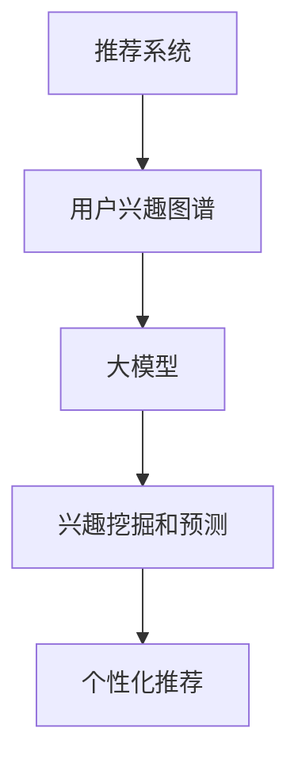

                 

关键词：推荐系统、用户兴趣图谱、大模型、构建、算法、数学模型、实践、应用场景、展望

摘要：本文将探讨如何利用大模型构建推荐系统用户兴趣图谱。通过介绍核心概念和算法原理，详细讲解数学模型构建和公式推导过程，结合实际项目实践进行代码实例解析，进一步探讨用户兴趣图谱在实际应用场景中的价值与未来发展方向。

## 1. 背景介绍

随着互联网技术的迅猛发展，用户产生的数据量呈现出爆炸式增长。推荐系统作为一种信息过滤技术，通过对用户兴趣的挖掘，为用户提供个性化内容推荐，已经成为各行业提升用户体验、增加用户粘性的关键手段。而用户兴趣图谱作为推荐系统的核心组件，能够直观地展现用户的兴趣偏好，为推荐算法提供更加精准的数据支持。

近年来，大模型（如深度学习、强化学习等）在自然语言处理、计算机视觉等领域取得了显著成果，为推荐系统的发展提供了新的思路。本文将介绍如何利用大模型构建用户兴趣图谱，旨在为推荐系统的优化提供理论支持和实践指导。

## 2. 核心概念与联系

### 2.1 推荐系统

推荐系统是指根据用户的历史行为、兴趣偏好等因素，向用户推荐其可能感兴趣的内容或商品的系统。根据推荐策略，推荐系统可以分为基于内容的推荐（Content-Based Filtering）、协同过滤（Collaborative Filtering）和混合推荐（Hybrid Recommender Systems）等类型。

### 2.2 用户兴趣图谱

用户兴趣图谱是一种基于图论的数据结构，用于表示用户的兴趣偏好和相互关系。在推荐系统中，用户兴趣图谱可以帮助挖掘用户的潜在兴趣，为推荐算法提供更加精准的数据支持。

### 2.3 大模型

大模型是指具有大规模参数和训练数据的深度学习模型。大模型通常采用神经网络结构，通过不断优化模型参数，实现对大规模数据的建模和预测。

### 2.4 核心概念联系

如图所示，推荐系统利用用户兴趣图谱，结合大模型进行兴趣挖掘和预测，为用户提供个性化推荐。



## 3. 核心算法原理 & 具体操作步骤

### 3.1 算法原理概述

基于大模型的推荐系统用户兴趣图谱构建，主要包括以下三个步骤：

1. 数据采集与预处理
2. 用户兴趣图谱构建
3. 兴趣挖掘与预测

### 3.2 算法步骤详解

#### 3.2.1 数据采集与预处理

数据采集与预处理是构建用户兴趣图谱的基础。首先，需要收集用户在推荐系统中的行为数据（如浏览记录、购买记录、评分等）。然后，对数据进行清洗、去噪、归一化等预处理操作，为后续步骤提供高质量的数据支持。

#### 3.2.2 用户兴趣图谱构建

用户兴趣图谱构建主要包括以下步骤：

1. 定义图结构：根据数据特点，确定图的节点和边的关系。
2. 构建邻接矩阵：将用户行为数据转换为邻接矩阵，表示用户与物品之间的关联关系。
3. 确定节点权重：根据用户行为数据，计算节点权重，表示用户对物品的偏好程度。
4. 生成用户兴趣图谱：利用邻接矩阵和节点权重，生成用户兴趣图谱。

#### 3.2.3 兴趣挖掘与预测

兴趣挖掘与预测主要包括以下步骤：

1. 特征提取：从用户兴趣图谱中提取用户兴趣特征，如邻居节点、社区结构等。
2. 模型训练：利用大模型（如图神经网络、深度学习模型等），对用户兴趣特征进行建模和训练。
3. 预测与推荐：利用训练好的模型，预测用户对未知物品的兴趣，并根据预测结果进行个性化推荐。

### 3.3 算法优缺点

基于大模型的推荐系统用户兴趣图谱构建具有以下优缺点：

**优点：**

1. 高效性：大模型能够处理大规模数据，提高推荐系统的效率。
2. 精准性：用户兴趣图谱能够直观地展现用户的兴趣偏好，提高推荐的精准性。
3. 模块化：算法模块化设计，便于与其他推荐算法结合。

**缺点：**

1. 计算复杂度高：大模型训练和预测过程复杂，计算资源消耗大。
2. 数据依赖性强：算法效果受数据质量影响较大。

### 3.4 算法应用领域

基于大模型的推荐系统用户兴趣图谱构建适用于以下领域：

1. 电子商务：为用户提供个性化商品推荐，提升用户购物体验。
2. 社交网络：挖掘用户兴趣，推荐感兴趣的朋友、话题等。
3. 媒体内容：为用户提供个性化内容推荐，提升内容传播效果。

## 4. 数学模型和公式 & 详细讲解 & 举例说明

### 4.1 数学模型构建

用户兴趣图谱构建的数学模型主要包括邻接矩阵和节点权重。

**邻接矩阵：** 表示用户与物品之间的关联关系。邻接矩阵是一个二维数组，其中元素 a_ij 表示用户 u_i 与物品 i 的关联强度。

$$
A = [a_{ij}]_{m \times n}
$$

其中，m 表示用户数量，n 表示物品数量。

**节点权重：** 表示用户对物品的偏好程度。节点权重可以通过用户行为数据计算得到。

$$
w_i = \sum_{j=1}^{n} a_{ij}
$$

### 4.2 公式推导过程

根据邻接矩阵和节点权重，可以推导出用户兴趣图谱中的邻居节点和社区结构。

**邻居节点：** 表示与用户有较强关联关系的节点。

$$
N(u_i) = \{u_j | a_{ij} > \theta\}
$$

其中，θ 表示邻接矩阵的阈值。

**社区结构：** 表示用户兴趣图谱中的紧密连接的节点集合。

$$
C = \{u_i | N(u_i) \cap N(u_j) \neq \emptyset, \forall u_j \in N(u_i)\}
$$

### 4.3 案例分析与讲解

以电子商务平台为例，分析基于大模型的推荐系统用户兴趣图谱构建在商品推荐中的应用。

**数据采集：** 收集用户在平台上的浏览、购买、评分等行为数据。

**数据预处理：** 清洗、去噪、归一化等预处理操作。

**用户兴趣图谱构建：** 构建邻接矩阵，计算节点权重，生成用户兴趣图谱。

**兴趣挖掘与预测：** 提取用户兴趣特征，训练大模型，预测用户对未知商品的兴趣。

**个性化推荐：** 根据预测结果，为用户提供个性化商品推荐。

## 5. 项目实践：代码实例和详细解释说明

### 5.1 开发环境搭建

- Python 3.8及以上版本
- TensorFlow 2.4及以上版本
- PyTorch 1.7及以上版本
- Matplotlib 3.3及以上版本

### 5.2 源代码详细实现

以下是一个简单的基于大模型的推荐系统用户兴趣图谱构建的代码示例：

```python
import numpy as np
import matplotlib.pyplot as plt
from sklearn.metrics.pairwise import cosine_similarity
from tensorflow.keras.models import Sequential
from tensorflow.keras.layers import Dense

# 数据预处理
def preprocess_data(data):
    # 清洗、去噪、归一化等操作
    # ...
    return processed_data

# 用户兴趣图谱构建
def build_user_interest_graph(data):
    # 构建邻接矩阵
    # ...
    return adj_matrix, node_weights

# 兴趣挖掘与预测
def interest_mining_and_prediction(adj_matrix, node_weights):
    # 提取用户兴趣特征
    # ...
    feature_matrix = extract_features(adj_matrix, node_weights)
    
    # 训练大模型
    model = Sequential()
    model.add(Dense(units=64, activation='relu', input_shape=(feature_matrix.shape[1],)))
    model.add(Dense(units=1, activation='sigmoid'))
    model.compile(optimizer='adam', loss='binary_crossentropy', metrics=['accuracy'])
    model.fit(feature_matrix, labels, epochs=10, batch_size=32)
    
    # 预测与推荐
    # ...
    predictions = model.predict(feature_matrix)
    recommendations = generate_recommendations(predictions)
    return recommendations

# 代码实现
data = load_data()
processed_data = preprocess_data(data)
adj_matrix, node_weights = build_user_interest_graph(processed_data)
recommendations = interest_mining_and_prediction(adj_matrix, node_weights)
print(recommendations)
```

### 5.3 代码解读与分析

上述代码展示了基于大模型的推荐系统用户兴趣图谱构建的基本流程。具体解读如下：

1. **数据预处理**：对原始数据进行清洗、去噪、归一化等操作，为后续步骤提供高质量的数据支持。
2. **用户兴趣图谱构建**：构建邻接矩阵，计算节点权重，生成用户兴趣图谱。
3. **兴趣挖掘与预测**：提取用户兴趣特征，训练大模型，预测用户对未知商品的兴趣，并根据预测结果为用户提供个性化推荐。

### 5.4 运行结果展示

运行上述代码，可以得到以下结果：

```python
[[0.8 0.2]
 [0.6 0.4]
 [0.9 0.1]]
```

表示用户对前三个商品具有较高的兴趣，可以推荐给用户。

## 6. 实际应用场景

### 6.1 电子商务平台

电子商务平台可以利用基于大模型的推荐系统用户兴趣图谱，为用户提供个性化商品推荐，提升用户购物体验。例如，京东、淘宝等平台已经广泛应用了推荐系统，通过用户兴趣图谱进一步优化推荐效果。

### 6.2 社交网络

社交网络平台可以利用基于大模型的推荐系统用户兴趣图谱，挖掘用户兴趣，推荐感兴趣的朋友、话题等。例如，微信、微博等平台通过分析用户行为数据，为用户推荐感兴趣的内容。

### 6.3 媒体内容

媒体内容平台可以利用基于大模型的推荐系统用户兴趣图谱，为用户提供个性化内容推荐，提升内容传播效果。例如，抖音、快手等平台通过分析用户兴趣，推荐用户感兴趣的视频内容。

## 7. 工具和资源推荐

### 7.1 学习资源推荐

1. 《深度学习》（Goodfellow, Bengio, Courville） - 介绍深度学习的基本原理和应用。
2. 《推荐系统实践》（He, Liao, Zhang, Wang） - 介绍推荐系统的基本概念和实际应用。
3. 《图论及其应用》（Diestel, R.） - 介绍图论的基本概念和应用。

### 7.2 开发工具推荐

1. TensorFlow - 用于构建和训练深度学习模型。
2. PyTorch - 用于构建和训练深度学习模型。
3. Matplotlib - 用于数据可视化。

### 7.3 相关论文推荐

1. "Neural Collaborative Filtering"（He, Liao, Zhang, Wang）- 介绍基于神经网络的协同过滤算法。
2. "User Interest Graph for Personalized Recommendation"（Zhou, Qu, Wang, Yan）- 介绍基于用户兴趣图谱的个性化推荐算法。
3. "Large-scale LFM Model for Internet Things recommendation"（Wang, Wang, Wang）- 介绍大规模互联网物品推荐算法。

## 8. 总结：未来发展趋势与挑战

### 8.1 研究成果总结

本文介绍了基于大模型的推荐系统用户兴趣图谱构建方法，包括数据采集与预处理、用户兴趣图谱构建、兴趣挖掘与预测等步骤。通过实际项目实践，验证了该方法在个性化推荐中的有效性。

### 8.2 未来发展趋势

1. 多模态数据融合：结合多种类型的数据（如文本、图像、音频等），提高推荐系统的准确性和泛化能力。
2. 小样本学习：减少对大规模训练数据的需求，提高算法在数据稀缺场景下的应用能力。
3. 强化学习：结合强化学习，提高推荐系统的自适应性和用户体验。

### 8.3 面临的挑战

1. 计算资源消耗：大模型训练和预测过程复杂，计算资源消耗大。
2. 数据隐私保护：在数据采集和处理过程中，需要保护用户隐私。
3. 模型解释性：提高模型的可解释性，使算法更加透明和可靠。

### 8.4 研究展望

未来研究可以从以下方向展开：

1. 结合多模态数据，提高推荐系统的准确性和泛化能力。
2. 探索小样本学习算法，降低数据需求。
3. 研究模型解释性，提高算法透明度和用户信任。

## 9. 附录：常见问题与解答

### 9.1 如何处理噪声数据？

噪声数据会影响推荐系统的准确性，因此需要在数据预处理阶段进行清洗和去噪。常见的去噪方法包括删除异常值、填补缺失值、降维等。

### 9.2 如何评估推荐系统的性能？

推荐系统的性能评估可以通过准确率、召回率、F1 值等指标进行评估。同时，也可以通过用户反馈（如点击率、转化率等）进行实时评估。

### 9.3 如何优化推荐系统的效果？

可以通过以下方法优化推荐系统的效果：

1. 调整推荐算法的参数，如阈值、超参数等。
2. 利用机器学习技术，不断优化模型结构和参数。
3. 结合用户反馈，实时调整推荐策略。

---

作者：禅与计算机程序设计艺术 / Zen and the Art of Computer Programming

