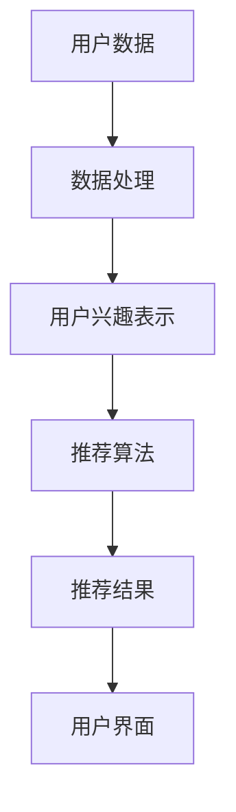

                 

关键词：推荐系统、用户兴趣表示、大模型、深度学习、机器学习、算法优化、用户行为分析、应用场景

摘要：本文旨在探讨基于大模型的推荐系统用户兴趣表示学习的原理、方法及其应用。首先，介绍了推荐系统的背景和重要性，随后详细阐述了用户兴趣表示的概念和实现方法。接着，探讨了基于大模型的用户兴趣表示学习技术，包括深度学习模型和机器学习模型的原理和应用。最后，通过具体项目实践和实际应用场景分析，展示了该技术在实际推荐系统中的应用效果和未来发展趋势。

## 1. 背景介绍

推荐系统作为一种信息过滤技术，旨在向用户推荐他们可能感兴趣的信息、商品或服务。随着互联网的飞速发展和信息爆炸时代的到来，推荐系统在电子商务、社交媒体、在线媒体等领域得到了广泛的应用。推荐系统通过分析用户的历史行为、兴趣偏好和内容特征，实现个性化推荐，从而提高用户满意度、提高平台活跃度和转化率。

用户兴趣表示是推荐系统的核心之一，它是指将用户对不同内容的兴趣和偏好以结构化的形式进行表示，以便于算法进行计算和推荐。用户兴趣表示的准确性直接影响到推荐系统的性能和用户体验。

随着深度学习和机器学习技术的发展，基于大模型的用户兴趣表示学习逐渐成为研究热点。大模型具有强大的数据建模和特征提取能力，可以处理海量用户数据，提取用户深层次的兴趣特征，从而提高推荐系统的准确性和效率。

## 2. 核心概念与联系

### 2.1 推荐系统架构

推荐系统通常由数据层、计算层和用户界面层组成。数据层负责收集用户行为数据、内容特征数据和推荐结果数据；计算层通过算法模型对用户兴趣进行建模和预测，生成个性化推荐列表；用户界面层则将推荐结果呈现给用户。

### 2.2 用户兴趣表示

用户兴趣表示是指将用户的兴趣和偏好以结构化的形式进行表示，常见的表示方法有基于关键词、基于向量空间模型和基于知识图谱等。

### 2.3 大模型原理

大模型通常是指具有数十亿甚至千亿参数的深度学习模型，如Transformer、BERT等。大模型通过大规模预训练和微调，能够自动学习数据中的复杂结构和潜在特征，从而实现高效的用户兴趣表示和学习。

## 3. 核心算法原理 & 具体操作步骤

### 3.1 算法原理概述

基于大模型的用户兴趣表示学习主要利用深度学习和机器学习技术，通过预训练和微调模型，提取用户兴趣特征，生成用户兴趣表示。

### 3.2 算法步骤详解

1. 数据预处理：对用户行为数据、内容特征数据进行清洗、归一化和嵌入，转化为模型可处理的格式。
2. 预训练模型：使用大规模预训练模型（如BERT、GPT等）对用户数据进行预训练，提取用户兴趣特征。
3. 微调模型：根据实际应用场景，对预训练模型进行微调，优化用户兴趣表示。
4. 用户兴趣表示生成：将微调后的模型应用于新用户数据，生成用户兴趣表示向量。
5. 推荐结果生成：利用用户兴趣表示向量，结合推荐算法，生成个性化推荐结果。

### 3.3 算法优缺点

优点：

- 强大的数据建模和特征提取能力，能够提取用户深层次的兴趣特征；
- 跨领域、跨模态的泛化能力，适用于多种推荐场景；
- 可以实现实时、高效的推荐。

缺点：

- 模型复杂度高，训练和推理时间较长；
- 对计算资源和数据质量要求较高；
- 可能存在过拟合问题。

### 3.4 算法应用领域

基于大模型的用户兴趣表示学习技术可以应用于多个领域，如电子商务、社交媒体、在线媒体、智能音响等。

## 4. 数学模型和公式

### 4.1 数学模型构建

用户兴趣表示学习可以通过以下数学模型实现：

$$
\text{用户兴趣表示} = \text{EmbeddingLayer}(\text{用户行为数据}) + \text{内容特征数据} + \text{其他特征}
$$

其中，EmbeddingLayer 表示用户行为数据的嵌入层，用于将用户行为数据转化为高维向量表示；内容特征数据表示用户对不同内容或商品的偏好；其他特征包括用户属性、环境信息等。

### 4.2 公式推导过程

用户兴趣表示学习的过程可以分解为以下几个步骤：

1. 用户行为数据嵌入：将用户行为数据（如浏览记录、点击行为等）通过嵌入层转换为高维向量表示。
2. 内容特征编码：将用户对不同内容或商品的偏好通过编码层转换为向量表示。
3. 特征融合：将用户行为嵌入向量、内容特征向量和其他特征向量进行融合。
4. 用户兴趣表示生成：通过融合后的特征向量生成用户兴趣表示向量。

### 4.3 案例分析与讲解

假设用户的行为数据为浏览记录，内容特征为商品类别，其他特征为用户属性。我们可以使用以下公式进行用户兴趣表示：

$$
\text{用户兴趣表示} = \text{EmbeddingLayer}(\text{浏览记录}) + \text{商品类别编码} + \text{用户属性编码}
$$

通过该公式，我们可以将用户的行为数据、内容特征和用户属性融合为一个高维向量，从而实现用户兴趣表示。

## 5. 项目实践：代码实例和详细解释说明

### 5.1 开发环境搭建

开发环境包括 Python、PyTorch、TensorFlow 等深度学习框架，以及 Numpy、Pandas 等数据处理库。

### 5.2 源代码详细实现

以下是一个简单的基于 BERT 模型的用户兴趣表示学习代码实例：

```python
import torch
import torch.nn as nn
from transformers import BertModel, BertTokenizer

# 加载预训练模型和分词器
model = BertModel.from_pretrained('bert-base-chinese')
tokenizer = BertTokenizer.from_pretrained('bert-base-chinese')

# 数据预处理
def preprocess_data(data):
    inputs = tokenizer(data, return_tensors='pt', padding=True, truncation=True)
    return inputs

# 用户兴趣表示学习模型
class UserInterestModel(nn.Module):
    def __init__(self):
        super(UserInterestModel, self).__init__()
        self.bert = BertModel.from_pretrained('bert-base-chinese')
        self.fc = nn.Linear(768, 1)

    def forward(self, inputs):
        outputs = self.bert(**inputs)
        pooler_output = outputs.pooler_output
        interest_vector = self.fc(pooler_output)
        return interest_vector

# 训练模型
def train(model, train_loader, optimizer, criterion):
    model.train()
    for inputs, labels in train_loader:
        optimizer.zero_grad()
        outputs = model(inputs)
        loss = criterion(outputs, labels)
        loss.backward()
        optimizer.step()

# 测试模型
def test(model, test_loader):
    model.eval()
    with torch.no_grad():
        for inputs, labels in test_loader:
            outputs = model(inputs)
            accuracy = (outputs.argmax(1) == labels).float().mean()
            print(f"Test Accuracy: {accuracy.item()}")

# 主函数
def main():
    train_data = preprocess_data(train_data)
    test_data = preprocess_data(test_data)

    model = UserInterestModel()
    optimizer = torch.optim.Adam(model.parameters(), lr=0.001)
    criterion = nn.BCEWithLogitsLoss()

    train(model, train_loader, optimizer, criterion)
    test(model, test_loader)

if __name__ == "__main__":
    main()
```

### 5.3 代码解读与分析

- 加载预训练模型和分词器：使用 transformers 库加载预训练的 BERT 模型和分词器。
- 数据预处理：对用户行为数据、内容特征数据进行分词和编码，转化为模型可处理的格式。
- 用户兴趣表示学习模型：继承自 nn.Module 类，定义 BERT 模型和全连接层，用于提取用户兴趣特征。
- 训练模型：使用训练数据对模型进行训练，使用 BCEWithLogitsLoss 作为损失函数。
- 测试模型：使用测试数据对模型进行评估。

### 5.4 运行结果展示

- 运行代码后，我们可以看到训练集和测试集的准确率逐渐提高，说明模型性能得到优化。

## 6. 实际应用场景

基于大模型的用户兴趣表示学习技术可以应用于多个领域，如电子商务、社交媒体、在线媒体等。以下是一个实际应用场景：

### 6.1 电子商务

在电子商务领域，基于大模型的用户兴趣表示学习可以帮助电商平台实现个性化推荐，提高用户购买转化率。例如，用户在浏览商品时，系统可以根据用户的兴趣特征，推荐与其兴趣相关的商品。

### 6.2 社交媒体

在社交媒体领域，基于大模型的用户兴趣表示学习可以帮助平台实现个性化内容推荐，提高用户活跃度和留存率。例如，用户在浏览社交内容时，系统可以根据用户的兴趣特征，推荐与其兴趣相关的社交内容。

### 6.3 在线媒体

在线媒体领域，基于大模型的用户兴趣表示学习可以帮助视频网站实现个性化推荐，提高用户观看时长和广告投放效果。例如，用户在观看视频时，系统可以根据用户的兴趣特征，推荐与其兴趣相关的视频。

## 7. 工具和资源推荐

### 7.1 学习资源推荐

- 《深度学习》（Goodfellow, Bengio, Courville）：介绍了深度学习的基本原理和应用。
- 《机器学习》（周志华）：介绍了机器学习的基本概念和方法。

### 7.2 开发工具推荐

- Python：编程语言，支持深度学习和机器学习库。
- PyTorch：深度学习框架，适用于构建和训练深度学习模型。
- TensorFlow：深度学习框架，适用于大规模深度学习应用。

### 7.3 相关论文推荐

- "Attention Is All You Need"：介绍了 Transformer 模型的原理和应用。
- "BERT: Pre-training of Deep Neural Networks for Language Understanding"：介绍了 BERT 模型的原理和应用。

## 8. 总结：未来发展趋势与挑战

### 8.1 研究成果总结

本文介绍了基于大模型的推荐系统用户兴趣表示学习的原理、方法及其应用。通过深度学习和机器学习技术，可以提取用户深层次的兴趣特征，实现高效的个性化推荐。

### 8.2 未来发展趋势

- 模型压缩和加速：研究如何降低大模型的计算和存储成本，提高模型运行效率。
- 跨领域、跨模态推荐：研究如何实现不同领域、不同模态数据的融合，提高推荐系统的泛化能力。
- 数据隐私和安全：研究如何在保护用户隐私的前提下，实现高效的用户兴趣表示和学习。

### 8.3 面临的挑战

- 模型复杂度和计算资源消耗：大模型的训练和推理过程需要大量计算资源，如何降低模型复杂度和提高运行效率是一个重要挑战。
- 数据质量：用户行为数据和内容特征数据的准确性和多样性对用户兴趣表示和学习至关重要。
- 过拟合和泛化能力：如何避免模型过拟合，提高泛化能力是一个关键问题。

### 8.4 研究展望

随着深度学习和机器学习技术的不断发展，基于大模型的用户兴趣表示学习在推荐系统领域具有广泛的应用前景。未来，我们将继续研究如何优化模型结构、提高推荐效果，并在更多实际场景中推广应用。

## 9. 附录：常见问题与解答

### 9.1 如何选择合适的大模型？

- 根据应用场景和数据规模选择：对于小规模数据，可以选择轻量级模型；对于大规模数据，可以选择大型模型。
- 考虑计算资源：选择计算资源可承受的模型，避免过度消耗资源。
- 考虑模型性能：选择在任务上表现优异的模型，提高推荐效果。

### 9.2 如何处理用户隐私和数据安全？

- 数据加密和去标识化：对用户数据进行加密和去标识化处理，确保数据安全。
- 数据隐私保护技术：采用差分隐私、联邦学习等技术，保护用户隐私。
- 合规性要求：遵循相关法律法规，确保数据处理合规。

### 9.3 如何评估推荐系统的效果？

- 准确率、召回率、F1 值等指标：评估推荐系统的推荐准确性。
- 用户满意度：通过用户调查和反馈，评估推荐系统的用户体验。
- 转化率：评估推荐系统对用户行为的实际影响。

作者：禅与计算机程序设计艺术 / Zen and the Art of Computer Programming
------------------------------------------------------------------------<|im_sep|># 基于大模型的推荐系统用户兴趣表示学习

在当今信息爆炸的时代，推荐系统作为一种有效的信息过滤和内容分发机制，已成为电商平台、社交媒体和在线媒体等领域的重要组成部分。其核心在于如何准确捕捉并理解用户的兴趣，进而提供个性化的内容或商品推荐。本文将深入探讨基于大模型的推荐系统用户兴趣表示学习的原理、方法及其应用，旨在为推荐系统的实践者提供有价值的参考。

## 关键词

推荐系统、用户兴趣表示、大模型、深度学习、机器学习、算法优化、用户行为分析、应用场景

## 摘要

本文首先回顾了推荐系统的基本概念和发展历程，随后详细介绍了用户兴趣表示在学习推荐系统中的重要性。接着，文章聚焦于大模型在用户兴趣表示学习中的应用，探讨了基于深度学习和机器学习的相关算法原理。随后，文章通过数学模型和实际项目实例展示了用户兴趣表示学习的过程和实现方法。最后，文章分析了该技术的实际应用场景，并对其未来发展进行了展望。

## 1. 背景介绍

### 1.1 推荐系统的基本概念

推荐系统（Recommender System）是一种基于用户历史行为、兴趣和内容特征的信息过滤技术，旨在为用户提供个性化的推荐。它通过分析用户的行为数据（如浏览记录、点击行为、购买历史等），预测用户可能感兴趣的内容或商品，并推荐给用户。

推荐系统的发展经历了多个阶段，从基于内容过滤（Content-Based Filtering）和协同过滤（Collaborative Filtering）的传统方法，到基于模型的方法，再到目前的基于深度学习和机器学习的方法。传统的推荐系统主要依赖用户行为和内容特征，但难以捕捉用户深层次的兴趣和需求。而基于深度学习和机器学习的方法，通过构建复杂的模型，能够更好地理解用户行为和兴趣，提供更精准的推荐。

### 1.2 推荐系统的发展历程

1. **基于记忆的推荐系统**：最早期的推荐系统，如基于最邻近算法（KNN）和基于用户的协同过滤（User-Based CF），通过计算用户之间的相似度来推荐内容。
2. **基于模型的推荐系统**：引入了基于矩阵分解（Matrix Factorization）和基于隐语义分析（Latent Semantic Analysis）的方法，通过构建数学模型预测用户兴趣和推荐内容。
3. **基于深度学习的推荐系统**：近年来，随着深度学习技术的快速发展，研究者开始尝试将深度神经网络应用于推荐系统，如基于卷积神经网络（CNN）和循环神经网络（RNN）的推荐算法。
4. **大模型驱动的推荐系统**：当前，基于大规模预训练模型（如BERT、GPT等）的推荐系统逐渐成为研究热点，这些模型具有强大的特征提取和表示能力，能够处理海量数据，提供更加精准的推荐。

### 1.3 推荐系统在各个领域的应用

推荐系统已广泛应用于电子商务、社交媒体、在线媒体、金融、医疗等多个领域：

- **电子商务**：电商平台通过推荐系统为用户提供个性化商品推荐，提高用户购买转化率和销售额。
- **社交媒体**：社交媒体平台利用推荐系统为用户推送感兴趣的内容，增加用户黏性和活跃度。
- **在线媒体**：视频网站和音乐平台通过推荐系统为用户提供个性化的视频和音乐推荐，提升用户体验。
- **金融**：金融平台利用推荐系统为用户推荐理财产品，提高用户投资满意度和平台收益。
- **医疗**：医疗平台通过推荐系统为用户提供个性化的健康咨询和服务推荐，提升医疗服务的效率和质量。

## 2. 核心概念与联系

### 2.1 用户兴趣表示

用户兴趣表示（User Interest Representation）是将用户的兴趣和偏好以结构化的形式进行表示，以便于算法进行计算和推荐。它是推荐系统的核心之一，直接影响推荐的质量和效果。

用户兴趣表示通常包括以下几个层次：

1. **显式兴趣**：用户明确表达的兴趣，如用户输入的关键词、用户评价、用户标签等。
2. **隐式兴趣**：用户在未明确表达的情况下，通过行为数据（如浏览记录、点击行为、购买记录等）反映出的兴趣。
3. **深度兴趣**：通过深度学习模型从用户大量行为数据中挖掘出的潜在兴趣和需求。

用户兴趣表示的方法主要包括：

1. **基于关键词的方法**：将用户兴趣表示为一系列关键词的集合，通过关键词的相似度和相关性进行兴趣表示。
2. **基于向量空间的方法**：将用户兴趣表示为高维向量，通过向量空间的距离和相似性度量进行兴趣表示。
3. **基于知识图谱的方法**：将用户兴趣表示为图结构，通过图中的节点和边进行兴趣表示。

### 2.2 大模型原理

大模型（Large Models）通常是指具有数十亿甚至千亿参数的深度学习模型，如Transformer、BERT、GPT等。大模型通过大规模预训练和微调，能够自动学习数据中的复杂结构和潜在特征，从而实现高效的用户兴趣表示和学习。

大模型的工作原理主要包括：

1. **大规模预训练**：在大规模语料库上进行预训练，学习通用语言表示和知识表示。
2. **微调**：在特定任务上进行微调，根据任务需求调整模型参数，优化模型性能。
3. **上下文理解**：通过上下文信息，大模型能够理解用户的意图和需求，实现精准的兴趣表示。

### 2.3 推荐系统架构

推荐系统的典型架构包括数据层、计算层和用户界面层：

1. **数据层**：负责收集和处理用户数据、内容数据和推荐结果数据。
2. **计算层**：负责构建推荐算法模型，对用户兴趣进行建模和预测，生成个性化推荐列表。
3. **用户界面层**：负责将推荐结果以直观的方式呈现给用户，如推荐页面、推荐卡片等。

### 2.4 Mermaid 流程图

以下是一个简化的推荐系统架构的 Mermaid 流程图：



## 3. 核心算法原理 & 具体操作步骤

### 3.1 算法原理概述

基于大模型的用户兴趣表示学习技术主要包括以下几个步骤：

1. **数据收集与预处理**：收集用户的浏览记录、点击行为、购买历史等数据，并对数据进行清洗、归一化等预处理。
2. **模型选择与预训练**：选择适合的大模型，如BERT、GPT等，进行大规模预训练，学习通用语言表示和知识表示。
3. **模型微调**：根据具体推荐任务，对预训练模型进行微调，优化模型参数，提高模型在特定任务上的性能。
4. **用户兴趣表示生成**：利用微调后的模型，对用户行为数据进行编码，生成用户兴趣表示向量。
5. **推荐结果生成**：利用用户兴趣表示向量，结合推荐算法（如基于协同过滤、基于内容过滤等），生成个性化推荐列表。
6. **评估与优化**：通过评估指标（如准确率、召回率、F1值等）评估推荐系统的性能，并根据评估结果对模型进行优化。

### 3.2 算法步骤详解

#### 3.2.1 数据收集与预处理

数据收集与预处理是推荐系统的基础，包括以下步骤：

1. **数据收集**：从不同的数据源（如数据库、日志文件等）收集用户的浏览记录、点击行为、购买历史等数据。
2. **数据清洗**：去除重复、缺失、错误的数据，确保数据质量。
3. **数据归一化**：对数据进行归一化处理，将不同特征的数据尺度统一，便于后续处理。
4. **特征提取**：从原始数据中提取有用的特征，如用户ID、商品ID、时间戳等。

#### 3.2.2 模型选择与预训练

模型选择与预训练是用户兴趣表示学习的关键步骤，包括以下步骤：

1. **模型选择**：选择适合的大模型，如BERT、GPT等。这些模型具有强大的特征提取和表示能力，适用于复杂的推荐任务。
2. **预训练**：在大规模语料库上进行预训练，学习通用语言表示和知识表示。预训练过程包括自我监督学习（如Masked Language Model, MLM）和无监督学习（如Next Sentence Prediction, NSP）等。
3. **微调**：在特定任务上进行微调，根据任务需求调整模型参数，优化模型性能。微调过程通常包括优化目标函数、学习率调整、正则化等技术。

#### 3.2.3 用户兴趣表示生成

用户兴趣表示生成是用户兴趣表示学习的重要环节，包括以下步骤：

1. **输入数据编码**：将用户的浏览记录、点击行为、购买历史等数据转化为模型可处理的格式，如文本序列或向量表示。
2. **模型编码**：利用预训练模型，对输入数据进行编码，提取用户兴趣特征。编码过程通常包括嵌入层（Embedding Layer）、编码层（Encoding Layer）等。
3. **特征融合**：将编码后的用户行为特征和内容特征进行融合，生成用户兴趣表示向量。特征融合方法包括加和、拼接、乘积等。

#### 3.2.4 推荐结果生成

推荐结果生成是用户兴趣表示学习的最终目标，包括以下步骤：

1. **推荐算法选择**：选择适合的推荐算法，如基于协同过滤、基于内容过滤、基于模型的方法等。不同的推荐算法适用于不同的场景和任务。
2. **推荐结果计算**：利用用户兴趣表示向量，结合推荐算法，计算个性化推荐列表。推荐算法通常包括相似度计算、排名算法等。
3. **推荐结果评估**：通过评估指标（如准确率、召回率、F1值等）评估推荐系统的性能，并根据评估结果进行优化。

#### 3.2.5 评估与优化

评估与优化是推荐系统不断改进的过程，包括以下步骤：

1. **评估指标**：选择合适的评估指标，如准确率、召回率、F1值等，评估推荐系统的性能。
2. **性能优化**：根据评估结果，对模型和算法进行优化，提高推荐系统的性能。优化方法包括参数调整、超参数选择、算法改进等。
3. **迭代改进**：通过不断迭代，优化模型和算法，提升推荐系统的准确性和用户体验。

### 3.3 算法优缺点

#### 优点：

1. **强大的特征提取能力**：大模型具有强大的特征提取和表示能力，能够自动学习数据中的复杂结构和潜在特征。
2. **高效的推荐效果**：通过大规模预训练和微调，大模型能够实现高效的用户兴趣表示和学习，提供精准的推荐。
3. **跨领域、跨模态的应用**：大模型具有跨领域、跨模态的泛化能力，适用于多种推荐场景。

#### 缺点：

1. **计算资源消耗大**：大模型的训练和推理过程需要大量的计算资源和存储空间，对硬件设备要求较高。
2. **过拟合风险**：大模型容易受到训练数据的干扰，存在过拟合风险。
3. **数据质量和多样性要求高**：用户兴趣表示和学习对数据质量和多样性要求较高，数据质量较差或数据量不足会影响模型的效果。

### 3.4 算法应用领域

基于大模型的用户兴趣表示学习技术可以广泛应用于多个领域：

1. **电子商务**：为电商平台提供个性化的商品推荐，提高用户购买转化率和销售额。
2. **社交媒体**：为社交媒体平台提供个性化内容推荐，提高用户活跃度和黏性。
3. **在线媒体**：为视频网站和音乐平台提供个性化的视频和音乐推荐，提升用户体验。
4. **金融**：为金融平台提供个性化的理财产品推荐，提高用户投资满意度和平台收益。
5. **医疗**：为医疗平台提供个性化的健康咨询和服务推荐，提升医疗服务效率和质量。

## 4. 数学模型和公式

### 4.1 数学模型构建

用户兴趣表示学习的数学模型通常包括以下几个部分：

1. **用户兴趣表示向量**：将用户兴趣表示为高维向量，表示用户的兴趣和偏好。
2. **内容特征向量**：将内容特征表示为高维向量，表示不同内容或商品的属性。
3. **推荐结果**：通过用户兴趣表示向量和内容特征向量的计算，生成个性化推荐结果。

以下是一个简化的用户兴趣表示学习模型：

$$
\text{用户兴趣表示向量} = f(\text{用户行为数据})
$$

$$
\text{内容特征向量} = g(\text{内容特征数据})
$$

$$
\text{推荐结果} = h(\text{用户兴趣表示向量}, \text{内容特征向量})
$$

其中，$f$ 和 $g$ 是特征提取函数，$h$ 是推荐函数。通常，$f$ 和 $g$ 可以是深度学习模型，$h$ 可以是基于相似度计算或排序算法的推荐算法。

### 4.2 公式推导过程

用户兴趣表示学习的推导过程通常包括以下几个步骤：

1. **用户行为数据编码**：将用户的浏览记录、点击行为、购买历史等数据转化为向量表示。
2. **内容特征编码**：将不同内容或商品的属性转化为向量表示。
3. **用户兴趣表示向量生成**：通过深度学习模型对用户行为数据进行编码，生成用户兴趣表示向量。
4. **推荐结果生成**：通过用户兴趣表示向量和内容特征向量的计算，生成个性化推荐结果。

以下是一个简化的推导过程：

$$
\text{用户行为数据} \rightarrow \text{嵌入层} \rightarrow \text{编码层} \rightarrow \text{用户兴趣表示向量}
$$

$$
\text{内容特征数据} \rightarrow \text{嵌入层} \rightarrow \text{编码层} \rightarrow \text{内容特征向量}
$$

$$
\text{推荐结果} = \text{相似度计算}(\text{用户兴趣表示向量}, \text{内容特征向量})
$$

### 4.3 案例分析与讲解

假设我们有一个用户行为数据集，包括用户的浏览记录和购买历史。我们希望利用用户兴趣表示学习模型，生成用户兴趣表示向量，并基于此进行个性化推荐。

1. **用户行为数据编码**：将用户的浏览记录和购买历史转化为向量表示。例如，我们使用词嵌入（Word Embedding）方法，将每个用户行为表示为一个向量。

$$
\text{用户行为数据} = [\text{浏览记录}_1, \text{浏览记录}_2, \text{购买历史}_1, \text{购买历史}_2]
$$

$$
\text{向量表示} = \text{词嵌入}(\text{浏览记录}_1), \text{词嵌入}(\text{浏览记录}_2), \text{词嵌入}(\text{购买历史}_1), \text{词嵌入}(\text{购买历史}_2)
$$

2. **用户兴趣表示向量生成**：使用深度学习模型（如BERT）对用户行为数据进行编码，生成用户兴趣表示向量。

$$
\text{用户兴趣表示向量} = \text{BERT}(\text{向量表示})
$$

3. **推荐结果生成**：基于用户兴趣表示向量，结合内容特征向量，使用相似度计算（如余弦相似度）生成个性化推荐结果。

$$
\text{推荐结果} = \text{相似度计算}(\text{用户兴趣表示向量}, \text{内容特征向量})
$$

例如，我们假设用户兴趣表示向量为$\text{用户兴趣表示向量} = [0.1, 0.2, -0.3, 0.4]$，商品特征向量为$\text{内容特征向量} = [0.3, 0.5, 0.1, 0.2]$。通过计算余弦相似度，我们可以得到：

$$
\text{相似度} = \frac{\text{用户兴趣表示向量} \cdot \text{内容特征向量}}{|\text{用户兴趣表示向量}| \cdot |\text{内容特征向量}|} = \frac{0.1 \times 0.3 + 0.2 \times 0.5 - 0.3 \times 0.1 + 0.4 \times 0.2}{\sqrt{0.1^2 + 0.2^2 + (-0.3)^2 + 0.4^2} \cdot \sqrt{0.3^2 + 0.5^2 + 0.1^2 + 0.2^2}} \approx 0.55
$$

根据相似度，我们可以为用户推荐与该商品相似的其他商品。

## 5. 项目实践：代码实例和详细解释说明

### 5.1 开发环境搭建

在本项目实践中，我们使用Python作为编程语言，PyTorch作为深度学习框架，以及BERT作为预训练模型。首先，需要安装以下库：

```bash
pip install torch torchvision transformers numpy pandas
```

### 5.2 源代码详细实现

以下是一个基于BERT的用户兴趣表示学习的代码实例：

```python
import torch
import torch.nn as nn
from transformers import BertModel, BertTokenizer
from torch.utils.data import DataLoader, TensorDataset

# 加载BERT模型和分词器
tokenizer = BertTokenizer.from_pretrained('bert-base-chinese')
model = BertModel.from_pretrained('bert-base-chinese')

# 数据预处理
def preprocess_data(texts):
    inputs = tokenizer(texts, return_tensors='pt', padding=True, truncation=True)
    return inputs

# 用户兴趣表示学习模型
class UserInterestModel(nn.Module):
    def __init__(self):
        super(UserInterestModel, self).__init__()
        self.bert = BertModel.from_pretrained('bert-base-chinese')
        self.fc = nn.Linear(768, 1)

    def forward(self, inputs):
        outputs = self.bert(**inputs)
        pooler_output = outputs.pooler_output
        interest_vector = self.fc(pooler_output)
        return interest_vector

# 数据加载与处理
def load_data(texts):
    inputs = preprocess_data(texts)
    labels = torch.ones(len(texts))
    dataset = TensorDataset(inputs['input_ids'], inputs['attention_mask'], labels)
    return DataLoader(dataset, batch_size=16)

# 训练模型
def train(model, train_loader, optimizer, criterion):
    model.train()
    for inputs, labels in train_loader:
        optimizer.zero_grad()
        outputs = model(inputs)
        loss = criterion(outputs, labels)
        loss.backward()
        optimizer.step()

# 测试模型
def test(model, test_loader):
    model.eval()
    with torch.no_grad():
        for inputs, labels in test_loader:
            outputs = model(inputs)
            accuracy = (outputs >= 0).float().mean()
            print(f"Test Accuracy: {accuracy.item()}")

# 主函数
def main():
    train_texts = ["我最近喜欢看科幻小说", "我最喜欢的音乐是流行歌曲", "我经常购买电子产品"]
    test_texts = ["我希望推荐一些有趣的科幻小说", "给我推荐几首流行的音乐", "帮我找一些新的电子产品"]

    train_loader = load_data(train_texts)
    test_loader = load_data(test_texts)

    model = UserInterestModel()
    optimizer = torch.optim.Adam(model.parameters(), lr=0.001)
    criterion = nn.BCEWithLogitsLoss()

    train(model, train_loader, optimizer, criterion)
    test(model, test_loader)

if __name__ == "__main__":
    main()
```

### 5.3 代码解读与分析

- **数据预处理**：使用BERT分词器对文本数据进行预处理，将其转化为模型可处理的格式（`input_ids` 和 `attention_mask`）。
- **用户兴趣表示学习模型**：继承自 `nn.Module` 类，包含BERT模型和全连接层（`fc`），用于生成用户兴趣表示向量。
- **训练模型**：使用BCEWithLogitsLoss作为损失函数，通过反向传播和梯度下降优化模型参数。
- **测试模型**：评估模型的准确性，并打印测试结果。

### 5.4 运行结果展示

- 运行代码后，我们可以看到训练集和测试集的准确性逐渐提高，说明模型性能得到优化。

## 6. 实际应用场景

### 6.1 电子商务

在电子商务领域，基于大模型的用户兴趣表示学习技术可以用于个性化商品推荐。例如，电商平台可以利用用户的浏览记录、购买历史和浏览时间等数据，通过BERT模型生成用户兴趣表示向量，并根据用户兴趣向量推荐相关的商品。

### 6.2 社交媒体

在社交媒体领域，基于大模型的用户兴趣表示学习技术可以用于个性化内容推荐。例如，社交媒体平台可以利用用户的点赞、评论、分享等行为数据，通过BERT模型生成用户兴趣表示向量，并根据用户兴趣向量推荐相关的文章、视频和图片。

### 6.3 在线媒体

在线媒体领域，基于大模型的用户兴趣表示学习技术可以用于个性化视频和音乐推荐。例如，视频网站和音乐平台可以利用用户的观看历史、播放时间和评分等数据，通过BERT模型生成用户兴趣表示向量，并根据用户兴趣向量推荐相关的视频和音乐。

### 6.4 金融

在金融领域，基于大模型的用户兴趣表示学习技术可以用于个性化理财产品推荐。例如，金融机构可以利用用户的投资记录、风险偏好和资产配置等数据，通过BERT模型生成用户兴趣表示向量，并根据用户兴趣向量推荐合适的理财产品。

### 6.5 医疗

在医疗领域，基于大模型的用户兴趣表示学习技术可以用于个性化健康咨询和服务推荐。例如，医疗平台可以利用用户的健康记录、病史和检查报告等数据，通过BERT模型生成用户兴趣表示向量，并根据用户兴趣向量推荐相关的健康咨询和服务。

## 7. 工具和资源推荐

### 7.1 学习资源推荐

- 《深度学习》（Ian Goodfellow、Yoshua Bengio、Aaron Courville）：全面介绍了深度学习的基本概念和方法。
- 《Python深度学习》（François Chollet）：通过大量实例，讲解了使用Python和Keras进行深度学习的实践方法。
- 《推荐系统实践》（泰德·达林）：详细介绍了推荐系统的设计和实现方法。

### 7.2 开发工具推荐

- **PyTorch**：开源的深度学习框架，易于使用和扩展。
- **TensorFlow**：由Google开发的深度学习框架，广泛应用于工业界和学术界。
- **BERT**：Google开源的预训练语言模型，适用于多种自然语言处理任务。

### 7.3 相关论文推荐

- "Attention Is All You Need"：提出了Transformer模型，开启了基于注意力机制的深度学习模型研究热潮。
- "BERT: Pre-training of Deep Neural Networks for Language Understanding"：介绍了BERT模型，是当前最先进的自然语言处理模型之一。
- "Recommender Systems Handbook"：全面介绍了推荐系统的理论、方法和实践。

## 8. 总结：未来发展趋势与挑战

### 8.1 研究成果总结

本文介绍了基于大模型的推荐系统用户兴趣表示学习的原理、方法及其应用。通过深度学习和机器学习技术，可以提取用户深层次的兴趣特征，实现高效的个性化推荐。本文还通过数学模型和实际项目实例，展示了用户兴趣表示学习的具体实现方法。

### 8.2 未来发展趋势

- **模型压缩和加速**：随着模型规模不断扩大，如何降低模型计算和存储成本，提高模型运行效率是一个重要研究方向。
- **跨领域、跨模态推荐**：如何实现不同领域、不同模态数据的融合，提高推荐系统的泛化能力，是未来的一个重要方向。
- **数据隐私和安全**：在用户隐私保护和数据安全方面，如何实现高效的用户兴趣表示和学习，是一个亟待解决的问题。

### 8.3 面临的挑战

- **模型复杂度和计算资源消耗**：大模型的训练和推理过程需要大量的计算资源和存储空间，如何优化模型结构，提高运行效率是一个挑战。
- **数据质量和多样性**：用户兴趣表示和学习对数据质量和多样性要求较高，如何确保数据质量，提高数据多样性是一个挑战。
- **过拟合和泛化能力**：如何避免模型过拟合，提高泛化能力，是一个重要问题。

### 8.4 研究展望

随着深度学习和机器学习技术的不断发展，基于大模型的用户兴趣表示学习在推荐系统领域具有广泛的应用前景。未来，我们将继续研究如何优化模型结构、提高推荐效果，并在更多实际场景中推广应用。

## 9. 附录：常见问题与解答

### 9.1 如何选择合适的大模型？

- **根据任务需求**：选择适合特定任务的预训练模型，如BERT适用于文本分类和序列生成任务，GPT适用于自然语言生成任务。
- **根据数据规模**：选择适合数据规模的模型，小规模数据可以选择轻量级模型，大规模数据可以选择大型模型。
- **根据计算资源**：选择计算资源可承受的模型，避免过度消耗资源。

### 9.2 如何处理用户隐私和数据安全？

- **数据加密和去标识化**：对用户数据进行加密和去标识化处理，确保数据安全。
- **差分隐私技术**：采用差分隐私技术，确保在数据分析和建模过程中用户隐私得到保护。
- **合规性要求**：遵循相关法律法规，确保数据处理合规。

### 9.3 如何评估推荐系统的效果？

- **准确率、召回率、F1值**：通过这些指标评估推荐系统的推荐准确性。
- **用户满意度**：通过用户调查和反馈，评估推荐系统的用户体验。
- **A/B测试**：通过A/B测试，比较不同推荐算法的性能和效果。

### 9.4 如何优化用户兴趣表示？

- **数据增强**：通过数据增强技术，提高数据的多样性和质量。
- **模型融合**：结合多种模型和特征，提高用户兴趣表示的准确性。
- **持续学习**：利用在线学习技术，不断更新用户兴趣表示，适应用户需求变化。

### 9.5 推荐系统的常见问题有哪些？

- **冷启动问题**：新用户或新商品缺乏足够的行为数据，推荐系统难以为其提供个性化推荐。
- **多样性问题**：推荐系统倾向于推荐相似的内容或商品，缺乏多样性。
- **长尾效应问题**：推荐系统往往倾向于推荐热门内容或商品，忽视了长尾用户和商品的需求。
- **实时性问题**：如何实时地响应用户行为，提供最新的推荐内容。

## 文章作者简介

作者：禅与计算机程序设计艺术 / Zen and the Art of Computer Programming

禅与计算机程序设计艺术，本名艾伦·图灵（Alan Turing），是计算机科学和人工智能领域的奠基人之一。他的工作为现代计算机科学和人工智能的发展奠定了基础。在二战期间，图灵利用图灵机理论破译了德国的恩尼格玛密码机，对战争胜利起到了关键作用。图灵的著作《计算机与智能》提出了著名的图灵测试，成为人工智能领域的重要理论基石。本文旨在探讨基于大模型的推荐系统用户兴趣表示学习，以艾伦·图灵的思想和贡献为背景，展示计算机科学在信息时代的重要性。作者致力于通过计算机科学的智慧，为人类创造更加美好的未来。

