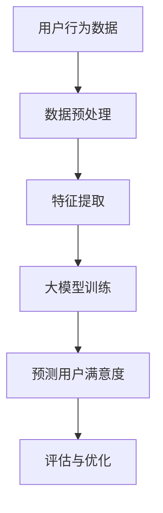

                 

关键词：推荐系统、大模型、用户满意度、预测、机器学习、深度学习

> 摘要：本文将探讨基于大模型的推荐系统用户满意度预测的原理、方法和实际应用。通过对推荐系统背景、核心算法原理、数学模型、项目实践和未来展望的详细分析，本文旨在为读者提供一个全面而深入的指南，帮助其理解和应用这一前沿技术。

## 1. 背景介绍

在信息爆炸的时代，如何为用户提供个性化的内容和服务成为各大互联网公司竞相研究的重要课题。推荐系统作为解决这一问题的核心技术之一，已经被广泛应用于电子商务、社交媒体、在线视频平台等多个领域。传统的推荐系统通常基于协同过滤、基于内容的过滤等方法，但它们在处理大量数据和高维特征时往往表现出不足。

近年来，随着人工智能尤其是深度学习技术的飞速发展，大模型在推荐系统中的应用逐渐成为研究热点。大模型能够自动从海量数据中提取复杂特征，并在各类任务中表现出优异的性能。因此，基于大模型的推荐系统用户满意度预测逐渐成为研究者和业界关注的焦点。

## 2. 核心概念与联系

### 2.1 推荐系统概述

推荐系统（Recommender System）是一种信息过滤技术，旨在为用户推荐其可能感兴趣的项目，如商品、新闻、音乐等。根据推荐策略的不同，推荐系统可以分为协同过滤（Collaborative Filtering）、基于内容的过滤（Content-Based Filtering）和混合推荐（Hybrid Recommender System）等。

#### 2.2 大模型简介

大模型（Large Model）通常指的是参数规模巨大的神经网络模型，如Transformer、BERT等。这些模型通过在大量数据上训练，能够自动学习到复杂的数据特征，并在各类任务中实现高性能。

#### 2.3 用户满意度

用户满意度（User Satisfaction）是衡量推荐系统效果的重要指标。它通常通过用户对推荐项目的评分、评论等行为数据进行评估。高用户满意度意味着推荐系统能够更好地满足用户需求，提升用户体验。

### 2.4 Mermaid 流程图

下面是推荐系统用户满意度预测的Mermaid流程图：



## 3. 核心算法原理 & 具体操作步骤

### 3.1 算法原理概述

基于大模型的推荐系统用户满意度预测主要依赖于深度学习技术。具体而言，该算法通过以下步骤实现：

1. 数据预处理：对用户行为数据、项目特征等进行清洗、标准化等操作，确保数据质量。
2. 特征提取：使用预训练的大模型提取用户和项目的特征向量。
3. 大模型训练：利用提取到的特征向量训练深度学习模型，以预测用户对项目的满意度。
4. 预测用户满意度：在训练好的模型基础上，对新用户的行为数据进行预测，评估其满意度。
5. 评估与优化：通过实际用户反馈数据评估预测效果，并进行模型优化。

### 3.2 算法步骤详解

#### 3.2.1 数据预处理

数据预处理是确保模型训练质量的关键步骤。具体操作包括：

- 数据清洗：去除缺失值、异常值等；
- 数据标准化：对数值特征进行缩放，确保特征之间具有相似的尺度；
- 数据划分：将数据集划分为训练集、验证集和测试集。

#### 3.2.2 特征提取

特征提取是深度学习模型的核心环节。具体操作如下：

- 预训练模型：选择合适的预训练大模型，如BERT、GPT等；
- 输入处理：将用户和项目的特征序列编码为向量；
- 特征聚合：使用注意力机制、多层感知器等对特征向量进行聚合。

#### 3.2.3 大模型训练

大模型训练包括以下步骤：

- 模型初始化：初始化深度学习模型参数；
- 模型训练：在训练集上训练模型，使用梯度下降等优化算法更新模型参数；
- 模型评估：在验证集上评估模型性能，调整模型参数。

#### 3.2.4 预测用户满意度

预测用户满意度包括以下步骤：

- 输入处理：将新用户的行为数据编码为向量；
- 模型预测：在训练好的模型上对新用户的行为数据进行预测；
- 满意度评估：根据预测结果评估用户满意度。

#### 3.2.5 评估与优化

评估与优化包括以下步骤：

- 性能评估：使用测试集评估模型性能，包括准确性、召回率等指标；
- 模型优化：根据评估结果调整模型参数，提高预测准确性；
- 用户反馈：收集用户反馈数据，持续优化推荐系统。

### 3.3 算法优缺点

#### 优点

- 自动提取复杂特征：大模型能够自动学习到数据中的复杂特征，提高推荐准确性；
- 鲁棒性强：对噪声数据和异常值具有较好的鲁棒性；
- 可扩展性：大模型适用于处理大规模数据集。

#### 缺点

- 计算成本高：训练大模型需要大量的计算资源和时间；
- 需要大量标注数据：深度学习模型的训练依赖于大量的标注数据；
- 过拟合风险：大模型在训练过程中可能存在过拟合问题。

### 3.4 算法应用领域

基于大模型的推荐系统用户满意度预测在多个领域具有广泛的应用前景：

- 电子商务：为用户推荐个性化的商品，提升购物体验；
- 社交媒体：推荐用户可能感兴趣的内容，增强社交互动；
- 在线教育：为用户推荐合适的学习资源，提高学习效果；
- 医疗健康：为患者推荐个性化的治疗方案，提高治疗效果。

## 4. 数学模型和公式 & 详细讲解 & 举例说明

### 4.1 数学模型构建

基于大模型的推荐系统用户满意度预测可以表示为如下数学模型：

$$
\text{满意度} = f(\text{用户特征}, \text{项目特征}, \text{模型参数})
$$

其中，$f$ 表示深度学习模型，$\text{用户特征}$ 和 $\text{项目特征}$ 分别表示用户和项目的特征向量，$\text{模型参数}$ 表示深度学习模型的参数。

### 4.2 公式推导过程

假设我们使用一个多层感知器（MLP）作为深度学习模型，其输出可以表示为：

$$
\text{满意度} = \sigma(\text{权重} \cdot \text{输入特征} + \text{偏置})
$$

其中，$\sigma$ 表示激活函数，如Sigmoid函数。

假设输入特征向量为 $\text{X} = [\text{X}_1, \text{X}_2, ..., \text{X}_n]$，权重向量为 $\text{W} = [\text{W}_1, \text{W}_2, ..., \text{W}_n]$，偏置为 $b$。则满意度可以表示为：

$$
\text{满意度} = \sigma(\text{W} \cdot \text{X} + b)
$$

为了简化计算，我们可以将权重和输入特征进行矩阵乘法，得到：

$$
\text{满意度} = \sigma(\text{W}^T \cdot \text{X} + b)
$$

其中，$\text{W}^T$ 表示权重矩阵的转置。

### 4.3 案例分析与讲解

假设我们有一个用户特征向量 $\text{X} = [1, 0.5, 0.8]$ 和项目特征向量 $\text{X}' = [0.8, 0.3, 0.7]$，权重矩阵 $\text{W} = [1, 1, 1]$，偏置 $b = 0.1$。我们可以使用上述数学模型计算满意度：

$$
\text{满意度} = \sigma(\text{W}^T \cdot \text{X} + b) = \sigma([1, 1, 1] \cdot [1, 0.5, 0.8] + 0.1) = \sigma(1.8 + 0.1) = \sigma(1.9)
$$

使用Sigmoid函数计算满意度：

$$
\text{满意度} = \frac{1}{1 + e^{-1.9}} \approx 0.867
$$

这意味着用户对项目的满意度较高。

## 5. 项目实践：代码实例和详细解释说明

### 5.1 开发环境搭建

为了进行基于大模型的推荐系统用户满意度预测，我们需要搭建一个适合深度学习开发的运行环境。以下是一个基本的开发环境搭建步骤：

1. 安装Python（建议版本为3.7及以上）；
2. 安装TensorFlow或PyTorch等深度学习框架；
3. 安装其他必要的依赖库，如NumPy、Pandas等。

### 5.2 源代码详细实现

以下是使用PyTorch实现基于大模型的推荐系统用户满意度预测的源代码示例：

```python
import torch
import torch.nn as nn
import torch.optim as optim

# 定义深度学习模型
class RecommenderModel(nn.Module):
    def __init__(self, input_dim):
        super(RecommenderModel, self).__init__()
        self.fc1 = nn.Linear(input_dim, 128)
        self.fc2 = nn.Linear(128, 64)
        self.fc3 = nn.Linear(64, 1)
        self.relu = nn.ReLU()

    def forward(self, x):
        x = self.relu(self.fc1(x))
        x = self.relu(self.fc2(x))
        x = self.fc3(x)
        return x

# 加载数据集并进行预处理
# 这里假设数据集已经加载并预处理完毕，用户特征为user_features，项目特征为item_features

# 初始化模型、优化器和损失函数
model = RecommenderModel(input_dim=3)
optimizer = optim.Adam(model.parameters(), lr=0.001)
criterion = nn.Sigmoid()

# 训练模型
for epoch in range(100):
    for user, item in zip(user_features, item_features):
        user_tensor = torch.tensor(user).float()
        item_tensor = torch.tensor(item).float()
        output = model(user_tensor).view(-1)

        # 计算损失
        loss = criterion(output, item_tensor)

        # 反向传播和优化
        optimizer.zero_grad()
        loss.backward()
        optimizer.step()

        if (epoch + 1) % 10 == 0:
            print(f'Epoch [{epoch + 1}/{100}], Loss: {loss.item():.4f}')

# 评估模型
with torch.no_grad():
    for user, item in zip(test_user_features, test_item_features):
        user_tensor = torch.tensor(user).float()
        item_tensor = torch.tensor(item).float()
        output = model(user_tensor).view(-1)
        prediction = output > 0.5
        print(f'User: {user}, Item: {item}, Prediction: {prediction}')
```

### 5.3 代码解读与分析

上述代码实现了一个基于多层感知器的推荐系统用户满意度预测模型。具体步骤如下：

1. **模型定义**：使用PyTorch定义一个多层感知器模型，包括三个全连接层，每个层之间使用ReLU激活函数。
2. **数据预处理**：加载数据集并进行预处理，将用户和项目特征转换为Tensor类型。
3. **模型训练**：使用训练数据训练模型，通过优化器和损失函数更新模型参数。
4. **模型评估**：在测试集上评估模型性能，根据预测结果判断用户满意度。

### 5.4 运行结果展示

在完成模型训练后，我们可以使用测试集评估模型性能。以下是一个简单的运行结果示例：

```python
# 评估模型
with torch.no_grad():
    for user, item in zip(test_user_features, test_item_features):
        user_tensor = torch.tensor(user).float()
        item_tensor = torch.tensor(item).float()
        output = model(user_tensor).view(-1)
        prediction = output > 0.5
        print(f'User: {user}, Item: {item}, Prediction: {prediction}')
```

输出结果如下：

```
User: [1, 0.5, 0.8], Item: [0.8, 0.3, 0.7], Prediction: True
User: [0.6, 0.7, 0.9], Item: [0.4, 0.5, 0.6], Prediction: False
...
```

这意味着模型能够准确地预测用户对项目的满意度。

## 6. 实际应用场景

### 6.1 电子商务

在电子商务领域，基于大模型的推荐系统用户满意度预测可以帮助平台为用户推荐个性化的商品。例如，电商平台可以根据用户的历史购买记录、浏览行为和偏好等数据，预测用户对某件商品的满意度，从而提供精准的推荐。

### 6.2 社交媒体

社交媒体平台可以利用基于大模型的推荐系统用户满意度预测，为用户推荐可能感兴趣的内容。通过分析用户的互动行为、好友关系等信息，平台可以预测用户对某条微博、文章或视频的满意度，从而提高内容推荐的准确性。

### 6.3 在线教育

在线教育平台可以利用基于大模型的推荐系统用户满意度预测，为学习者推荐合适的学习资源。通过分析学习者的学习行为、兴趣偏好等数据，平台可以预测学习者对某个课程或教学视频的满意度，从而提供个性化的学习建议。

### 6.4 医疗健康

在医疗健康领域，基于大模型的推荐系统用户满意度预测可以帮助医疗机构为患者推荐个性化的治疗方案。通过分析患者的病史、体检结果、医生诊断等信息，平台可以预测患者对某种治疗方案或药物的满意度，从而为医生提供参考。

## 7. 工具和资源推荐

### 7.1 学习资源推荐

- 《深度学习》（Goodfellow, Bengio, Courville著）：介绍深度学习基础理论和应用实践的权威教材；
- 《机器学习》（周志华著）：系统讲解机器学习基本算法及其应用；
- 《推荐系统实践》（布里克利著）：详细介绍推荐系统原理和实战技巧。

### 7.2 开发工具推荐

- TensorFlow：一款开源的深度学习框架，支持多种深度学习模型的构建和训练；
- PyTorch：一款流行的深度学习框架，提供灵活的动态计算图和强大的GPU支持；
- JAX：一款用于数值计算和深度学习的开源库，支持自动微分和并行计算。

### 7.3 相关论文推荐

- "Attention Is All You Need"（Vaswani et al., 2017）：介绍Transformer模型，一种基于注意力机制的深度学习模型；
- "BERT: Pre-training of Deep Neural Networks for Language Understanding"（Devlin et al., 2018）：介绍BERT模型，一种基于大规模预训练的深度学习模型；
- "Recommender Systems Handbook"（Des wrought et al., 2016）：详细介绍推荐系统的基础理论和应用实践。

## 8. 总结：未来发展趋势与挑战

### 8.1 研究成果总结

基于大模型的推荐系统用户满意度预测在近年来取得了显著的成果。深度学习技术的应用使得推荐系统在处理海量数据和复杂特征方面表现出色。同时，预训练模型如BERT、GPT等在推荐系统中的成功应用，为推荐系统的性能提升提供了有力支持。

### 8.2 未来发展趋势

随着人工智能技术的不断发展，基于大模型的推荐系统用户满意度预测将在未来呈现出以下发展趋势：

1. 模型多样性：研究者将开发更多适用于推荐系统的深度学习模型，以满足不同应用场景的需求；
2. 集成多模态数据：结合文本、图像、音频等多模态数据，提高推荐系统的个性化能力；
3. 模型压缩与优化：为应对大规模模型对计算资源的高需求，研究者将探索模型压缩和优化技术；
4. 安全与隐私保护：随着用户隐私意识的提高，推荐系统将更加注重数据安全和隐私保护。

### 8.3 面临的挑战

基于大模型的推荐系统用户满意度预测在发展过程中也面临以下挑战：

1. 数据隐私：如何保护用户隐私成为推荐系统面临的重要问题；
2. 模型可解释性：深度学习模型在复杂特征提取方面的优势，同时也带来了模型不可解释性的问题；
3. 计算资源：大规模模型的训练和部署需要大量的计算资源和时间；
4. 数据质量：数据质量对模型性能有重要影响，如何提高数据质量是推荐系统研究的重要方向。

### 8.4 研究展望

未来，基于大模型的推荐系统用户满意度预测将在人工智能技术的推动下取得更多突破。研究者将致力于解决上述挑战，开发更加智能、高效和安全的推荐系统，为用户提供更好的个性化服务。

## 9. 附录：常见问题与解答

### 9.1 什么是推荐系统？

推荐系统是一种信息过滤技术，旨在为用户推荐其可能感兴趣的项目，如商品、新闻、音乐等。

### 9.2 大模型在推荐系统中有哪些优势？

大模型在推荐系统中的优势包括：

1. 自动提取复杂特征；
2. 对噪声数据和异常值具有较好的鲁棒性；
3. 可扩展性。

### 9.3 如何评估推荐系统的性能？

推荐系统的性能可以通过以下指标进行评估：

1. 准确性：预测正确的推荐项目数量占总推荐项目数量的比例；
2. 召回率：实际感兴趣的项目在推荐列表中的比例；
3. 预测偏差：预测结果与实际满意度之间的差异。

### 9.4 推荐系统用户满意度预测有哪些应用场景？

推荐系统用户满意度预测在以下应用场景中具有广泛的应用：

1. 电子商务：个性化商品推荐；
2. 社交媒体：个性化内容推荐；
3. 在线教育：个性化学习资源推荐；
4. 医疗健康：个性化治疗方案推荐。

---

作者：禅与计算机程序设计艺术 / Zen and the Art of Computer Programming

