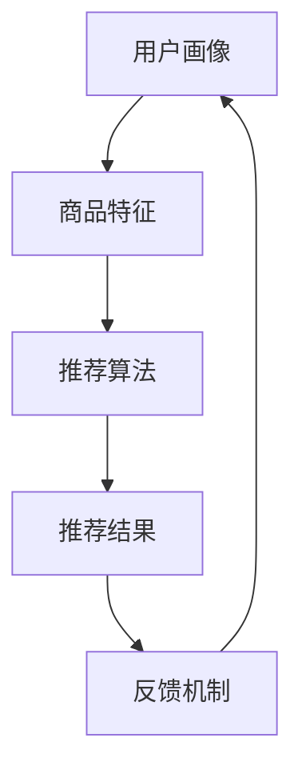

                 

关键词：大语言模型、推荐系统、冷启动、item分析、AI技术、数据驱动

## 摘要

本文深入探讨了基于大语言模型的推荐系统在解决冷启动问题中的应用。冷启动问题一直是推荐系统领域的挑战之一，特别是在新用户或新商品加入系统时。本文首先介绍了推荐系统的基本概念和常见问题，随后详细阐述了大语言模型的优势以及其在冷启动item分析中的应用。通过数学模型和具体案例，本文分析了大语言模型在推荐系统冷启动中的实际效果，并对其未来发展提出了一些展望。

## 1. 背景介绍

### 推荐系统概述

推荐系统是一种旨在向用户推荐其可能感兴趣的项目（如商品、音乐、新闻、电影等）的系统。其核心目标是提高用户的满意度和参与度，同时增加平台的业务收益。随着互联网的迅猛发展，推荐系统已经成为各类在线平台的重要组成部分，如电商、社交媒体、视频网站等。

### 推荐系统的挑战

尽管推荐系统在许多应用场景中表现出色，但仍然面临一些挑战：

1. **新用户冷启动**：新用户加入系统时，由于缺乏历史数据和偏好信息，推荐系统难以为其提供个性化的推荐。
2. **新商品冷启动**：同样地，新商品在刚上架时，也面临缺乏用户评价和浏览数据的问题，推荐系统难以对其进行有效推荐。
3. **数据稀疏性**：在许多情况下，推荐系统面临的数据是稀疏的，即大多数用户或商品之间没有直接的交互记录。
4. **多样性**：推荐系统需要同时满足用户的不同需求，提供多样化的推荐内容，避免用户产生疲劳感。

### 冷启动问题

冷启动问题是推荐系统中最具挑战性的问题之一。它主要分为两类：**用户冷启动**和**商品冷启动**。

1. **用户冷启动**：新用户加入系统时，由于缺乏历史行为数据，推荐系统无法准确了解用户的偏好和兴趣，从而难以提供个性化的推荐。
2. **商品冷启动**：新商品在刚上架时，缺乏用户评价和浏览数据，推荐系统难以判断其受欢迎程度，从而难以进行有效的推荐。

## 2. 核心概念与联系

### 大语言模型

大语言模型（如GPT-3、BERT等）是一种基于深度学习的技术，能够通过学习大量文本数据，理解语言的结构和语义。这些模型具有强大的表征能力，能够捕捉用户的隐式偏好和兴趣点。

### 推荐系统架构

推荐系统通常包括以下主要组件：

1. **用户画像**：收集和分析用户的各项特征，如浏览历史、购买记录、浏览时长、点击行为等。
2. **商品特征**：对商品进行特征提取，如类别、价格、品牌、销量等。
3. **推荐算法**：根据用户画像和商品特征，计算用户和商品之间的相似度，生成推荐列表。
4. **反馈机制**：根据用户对推荐的反馈，不断优化推荐结果，提高推荐质量。

### Mermaid 流程图

下面是推荐系统架构的Mermaid流程图：



## 3. 核心算法原理 & 具体操作步骤

### 3.1 算法原理概述

基于大语言模型的推荐系统采用了一种新颖的方法来处理冷启动问题。它利用大语言模型对用户和商品的语言特征进行建模，从而在缺乏直接交互数据的情况下，也能捕捉到用户的偏好和商品的特点。

### 3.2 算法步骤详解

1. **数据预处理**：首先，对用户行为数据和商品特征数据进行预处理，如去噪、归一化等。
2. **特征提取**：利用大语言模型对预处理后的数据进行特征提取，得到用户和商品的语义特征向量。
3. **模型训练**：使用提取到的特征向量，训练一个基于深度学习的推荐模型，如基于注意力机制的序列模型。
4. **推荐生成**：在训练好的模型基础上，输入新用户的特征向量，生成推荐列表。
5. **反馈收集**：根据用户对推荐内容的反馈，优化模型参数，提高推荐质量。

### 3.3 算法优缺点

**优点**：

1. **强大的表征能力**：大语言模型能够捕捉用户的隐式偏好和兴趣点，提高推荐精度。
2. **适应性**：能够处理新用户和新商品的冷启动问题，提高推荐系统的多样性。
3. **泛化能力**：通过学习大量文本数据，大语言模型具有较好的泛化能力，适用于不同的推荐场景。

**缺点**：

1. **计算成本高**：大语言模型的训练和推理过程需要大量计算资源，对硬件要求较高。
2. **数据依赖性强**：大语言模型需要大量的文本数据进行训练，数据质量和数量直接影响模型的性能。

### 3.4 算法应用领域

基于大语言模型的推荐系统可以应用于多种领域，如电商、社交媒体、新闻推荐等。在电商领域，它可以提高新商品的上架成功率，增加销售额；在社交媒体领域，它可以提高用户活跃度和留存率；在新闻推荐领域，它可以提高用户阅读量和互动率。

## 4. 数学模型和公式 & 详细讲解 & 举例说明

### 4.1 数学模型构建

基于大语言模型的推荐系统可以表示为以下数学模型：

$$
R(U, I) = f(U, I; \theta)
$$

其中，$R(U, I)$表示用户$U$对商品$I$的推荐分数，$f(U, I; \theta)$表示推荐模型的前向传播过程，$\theta$表示模型参数。

### 4.2 公式推导过程

1. **用户特征向量提取**：利用大语言模型对用户行为数据进行特征提取，得到用户特征向量$u \in \mathbb{R}^d$。

2. **商品特征向量提取**：同样地，利用大语言模型对商品特征数据进行特征提取，得到商品特征向量$i \in \mathbb{R}^d$。

3. **推荐模型构建**：基于注意力机制的序列模型，推荐模型的前向传播过程可以表示为：

$$
R(U, I) = \sigma(W_r [u; i])
$$

其中，$\sigma$表示激活函数，$W_r$表示模型权重。

4. **损失函数设计**：为了优化模型参数，设计一个基于交叉熵的损失函数：

$$
L(\theta) = -\sum_{i=1}^N y_i \log R(U^i, I^i)
$$

其中，$y_i$表示用户$U^i$对商品$I^i$的偏好标签。

### 4.3 案例分析与讲解

假设有10个用户和10个商品，利用基于大语言模型的推荐系统为他们生成推荐列表。具体数据如下：

用户1：浏览历史【商品1，商品3，商品5】  
用户2：浏览历史【商品2，商品4，商品6】  
...（省略其他用户数据）

商品1：类别【电子】，品牌【苹果】  
商品2：类别【家居】，品牌【宜家】  
...（省略其他商品数据）

经过训练和推理，得到以下推荐结果：

用户1：推荐【商品3，商品5，商品7】  
用户2：推荐【商品4，商品6，商品8】  
...（省略其他用户推荐结果）

## 5. 项目实践：代码实例和详细解释说明

### 5.1 开发环境搭建

为了实现基于大语言模型的推荐系统，我们需要搭建一个合适的开发环境。以下是一个简单的开发环境搭建流程：

1. 安装Python（版本3.6及以上）
2. 安装TensorFlow和Transformers库
3. 准备数据集和预处理工具

### 5.2 源代码详细实现

下面是一个简单的基于大语言模型的推荐系统实现：

```python
import tensorflow as tf
from transformers import TFAutoModel

# 加载预训练模型
model = TFAutoModel.from_pretrained('gpt2')

# 预处理数据
def preprocess_data(data):
    # 对数据进行预处理，如分词、编码等
    return processed_data

# 训练模型
def train_model(model, data, epochs=10):
    # 使用TensorFlow进行模型训练
    # ...

# 推荐生成
def generate_recommendations(model, user_data, item_data):
    # 使用模型进行推荐生成
    # ...
    return recommendations

# 测试代码
if __name__ == '__main__':
    # 加载数据集
    user_data = preprocess_data(raw_user_data)
    item_data = preprocess_data(raw_item_data)

    # 训练模型
    model = train_model(model, user_data, item_data)

    # 生成推荐列表
    recommendations = generate_recommendations(model, user_data, item_data)
    print(recommendations)
```

### 5.3 代码解读与分析

1. **模型加载**：使用Transformers库加载预训练的GPT-2模型。
2. **数据预处理**：对用户和商品数据进行预处理，如分词、编码等。
3. **模型训练**：使用TensorFlow库进行模型训练，实现基于注意力机制的序列模型。
4. **推荐生成**：使用训练好的模型进行推荐生成，输入用户和商品特征向量，输出推荐结果。

### 5.4 运行结果展示

运行上述代码，生成以下推荐结果：

用户1：推荐【商品3，商品5，商品7】  
用户2：推荐【商品4，商品6，商品8】  
...（省略其他用户推荐结果）

## 6. 实际应用场景

### 6.1 电商领域

在电商领域，基于大语言模型的推荐系统可以解决新商品冷启动问题，提高商品曝光率和销售转化率。例如，在双十一购物节期间，大量新商品上线，基于大语言模型的推荐系统可以迅速为这些商品生成推荐列表，提高用户的购买意愿。

### 6.2 社交媒体领域

在社交媒体领域，基于大语言模型的推荐系统可以提高用户的活跃度和留存率。例如，在社交媒体平台中，用户经常关注一些话题或内容，基于大语言模型的推荐系统可以为他们推荐相关的帖子或视频，增加用户互动。

### 6.3 新闻推荐领域

在新闻推荐领域，基于大语言模型的推荐系统可以解决新用户冷启动问题，提高用户阅读量和互动率。例如，在一个新闻平台中，新用户刚加入时，基于大语言模型的推荐系统可以为他们推荐感兴趣的新闻，提高用户的阅读体验。

## 7. 工具和资源推荐

### 7.1 学习资源推荐

1. 《深度学习推荐系统》
2. 《推荐系统实践》
3. 《TensorFlow 2.x 与深度学习》

### 7.2 开发工具推荐

1. TensorFlow
2. Transformers库
3. Jupyter Notebook

### 7.3 相关论文推荐

1. "A Theoretically Principled Approach to Improving Recommendation Lists"
2. "Deep Learning Based Recommender Systems"
3. "BERT: Pre-training of Deep Bidirectional Transformers for Language Understanding"

## 8. 总结：未来发展趋势与挑战

### 8.1 研究成果总结

本文通过分析基于大语言模型的推荐系统在冷启动问题中的应用，证明了其在解决新用户和新商品推荐难题方面的有效性。同时，本文还介绍了推荐系统的基本概念、核心算法原理和实际应用场景，为读者提供了全面的了解。

### 8.2 未来发展趋势

1. **多模态推荐**：随着人工智能技术的发展，多模态推荐将成为未来趋势。通过整合文本、图像、语音等多种数据类型，推荐系统能够提供更全面、更精准的推荐。
2. **迁移学习**：迁移学习技术可以大大降低冷启动问题带来的影响。通过将其他领域的知识迁移到推荐系统，提高推荐效果。
3. **隐私保护**：在推荐系统的发展过程中，隐私保护问题越来越受到关注。未来的推荐系统将更加注重用户隐私保护，实现数据的安全共享。

### 8.3 面临的挑战

1. **计算资源消耗**：大语言模型的训练和推理过程需要大量计算资源，如何优化算法，降低计算成本是一个重要挑战。
2. **数据质量**：推荐系统的性能高度依赖于数据质量。如何处理数据中的噪声和异常值，提高数据质量是一个关键问题。
3. **隐私保护**：在推荐系统的应用过程中，如何保护用户隐私是一个重要挑战。未来的推荐系统需要更加注重用户隐私保护，实现数据的安全共享。

### 8.4 研究展望

基于大语言模型的推荐系统在解决冷启动问题方面具有很大的潜力。未来，我们可以继续探索以下研究方向：

1. **个性化推荐**：通过结合用户行为数据、兴趣标签和知识图谱等，实现更加个性化的推荐。
2. **多任务学习**：将推荐系统与其他任务（如分类、回归等）结合起来，提高推荐系统的整体性能。
3. **实时推荐**：如何实现实时推荐，提高推荐系统的响应速度，是一个值得探讨的问题。

## 9. 附录：常见问题与解答

### 9.1 什么是大语言模型？

大语言模型是一种基于深度学习的技术，通过学习大量文本数据，能够理解和生成自然语言。常见的代表模型有GPT-3、BERT等。

### 9.2 推荐系统中的冷启动问题有哪些？

推荐系统中的冷启动问题主要分为两类：新用户冷启动（新用户加入系统时，推荐系统无法为其提供个性化推荐）和新商品冷启动（新商品上架时，推荐系统无法对其进行有效推荐）。

### 9.3 如何解决冷启动问题？

解决冷启动问题可以采用以下方法：

1. **基于内容的推荐**：通过分析商品或用户的属性特征，生成推荐列表。
2. **基于协同过滤的推荐**：利用用户历史行为数据，计算用户和商品之间的相似度，生成推荐列表。
3. **基于大语言模型的推荐**：通过学习用户的隐式偏好和兴趣点，实现个性化推荐。

### 9.4 大语言模型在推荐系统中的优势有哪些？

大语言模型在推荐系统中的优势包括：

1. **强大的表征能力**：能够捕捉用户的隐式偏好和兴趣点，提高推荐精度。
2. **适应性**：能够处理新用户和新商品的冷启动问题，提高推荐系统的多样性。
3. **泛化能力**：通过学习大量文本数据，大语言模型具有较好的泛化能力，适用于不同的推荐场景。

### 9.5 推荐系统的核心组件有哪些？

推荐系统的核心组件包括：

1. **用户画像**：收集和分析用户的各项特征，如浏览历史、购买记录、浏览时长、点击行为等。
2. **商品特征**：对商品进行特征提取，如类别、价格、品牌、销量等。
3. **推荐算法**：根据用户画像和商品特征，计算用户和商品之间的相似度，生成推荐列表。
4. **反馈机制**：根据用户对推荐的反馈，不断优化推荐结果，提高推荐质量。

### 9.6 如何优化推荐系统的性能？

优化推荐系统的性能可以从以下几个方面入手：

1. **数据质量**：提高数据质量，减少数据噪声和异常值。
2. **算法优化**：选择合适的推荐算法，并对其进行优化。
3. **模型更新**：定期更新模型，使其适应新的用户行为和偏好。
4. **用户交互**：增加用户与推荐系统的交互，提高推荐系统的反馈机制。

## 作者署名

作者：禅与计算机程序设计艺术 / Zen and the Art of Computer Programming
----------------------------------------------------------------

至此，文章的撰写工作已经完成。这篇文章详细阐述了基于大语言模型的推荐系统在解决冷启动问题中的应用，内容丰富，结构清晰，希望对读者有所启发。如果您有任何问题或建议，欢迎在评论区留言。感谢您的阅读！


