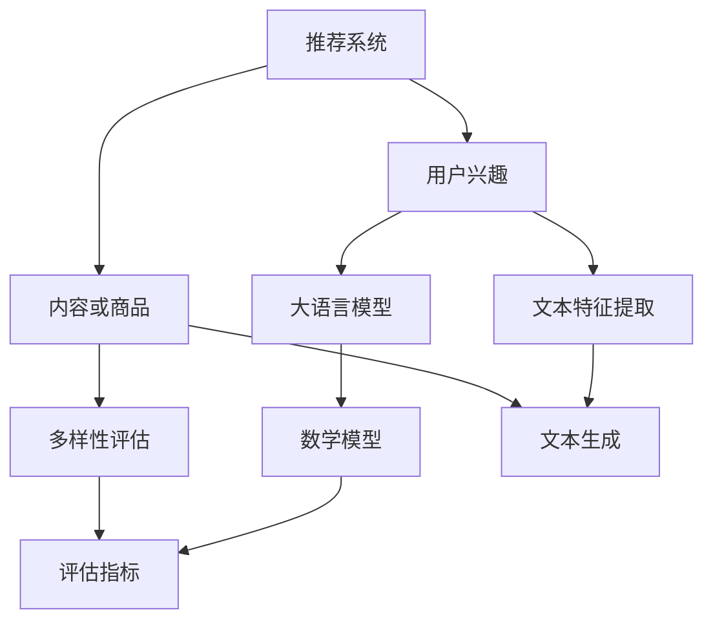

                 

关键词：推荐系统，大语言模型，多样性评估，评估指标，算法原理，数学模型，项目实践，应用场景，未来展望

摘要：随着推荐系统在各个领域的广泛应用，如何评估推荐系统的多样性成为一个关键问题。本文首先介绍了推荐系统的背景和基本原理，然后详细讨论了基于大语言模型的多样性评估指标的设计与实现，包括数学模型的构建、算法步骤的详解以及应用场景的探讨。通过具体的项目实践，本文展示了如何利用大语言模型进行多样性评估，并对其运行结果进行了分析和解读。最后，本文对未来推荐系统多样性评估的发展趋势和面临的挑战进行了展望，并提出了一些潜在的研究方向。

## 1. 背景介绍

推荐系统作为大数据和人工智能领域的一项重要应用，已经成为互联网时代的重要基础设施。其目的是根据用户的兴趣和需求，向用户推荐他们可能感兴趣的内容或商品，从而提高用户体验和商业价值。

然而，推荐系统的多样性问题日益凸显。在实际应用中，推荐系统往往容易陷入“信息茧房”效应，即用户接收到的内容或商品种类单一，缺乏多样性，这会导致用户失去探索新内容或商品的兴趣，从而影响用户满意度和粘性。

为了解决这一问题，推荐系统的研究者和开发者们提出了多种多样性评估指标，以期更全面地评估推荐系统的多样性表现。然而，传统的多样性评估方法存在一些局限性，如计算复杂度高、难以适应大规模数据集等。

近年来，随着大语言模型的快速发展，基于大语言模型的推荐系统多样性评估方法逐渐成为研究热点。大语言模型具有强大的语义理解能力和文本生成能力，能够从大量文本数据中提取有效的特征，从而为多样性评估提供了新的思路和方法。

本文旨在探讨基于大语言模型的推荐系统多样性评估指标的设计与实现，通过对数学模型、算法步骤和应用场景的详细讨论，为推荐系统的多样性评估提供有益的参考。

## 2. 核心概念与联系

为了更好地理解基于大语言模型的推荐系统多样性评估指标，我们首先需要介绍几个核心概念，并展示它们之间的联系。以下是核心概念的 Mermaid 流程图：



### 2.1 推荐系统

推荐系统是一种基于数据挖掘和机器学习技术的应用系统，旨在为用户提供个性化的内容或商品推荐。推荐系统的工作原理主要包括以下几个步骤：

1. **用户兴趣建模**：通过用户的历史行为数据（如浏览记录、购买记录等）来构建用户兴趣模型。
2. **内容或商品建模**：对推荐系统中的内容或商品进行特征提取，构建内容或商品模型。
3. **推荐算法**：根据用户兴趣模型和内容或商品模型，利用特定的算法计算用户对内容或商品的偏好程度，生成推荐列表。
4. **评估与优化**：通过评估指标对推荐系统的效果进行评估，并根据评估结果对推荐算法进行调整和优化。

### 2.2 用户兴趣

用户兴趣是推荐系统的核心概念之一。用户兴趣建模的目的是理解用户对哪些内容或商品更感兴趣，从而为推荐算法提供输入。用户兴趣通常通过以下方式建模：

- **显式反馈**：用户直接提供的反馈，如评分、点击、收藏等。
- **隐式反馈**：用户的行为数据，如浏览时间、搜索关键词等。

### 2.3 内容或商品

推荐系统中的内容或商品是用户兴趣的载体。内容或商品建模的目的是将内容或商品转化为计算机可以处理的特征向量。常见的特征提取方法包括：

- **基于内容的特征提取**：基于文本的统计信息、关键词提取等。
- **基于协同过滤的特征提取**：基于用户和内容的相似度计算。

### 2.4 大语言模型

大语言模型是一种基于深度学习的文本处理模型，具有强大的语义理解能力和文本生成能力。大语言模型的工作原理主要包括以下几个步骤：

1. **数据预处理**：对原始文本数据进行清洗、分词、去停用词等预处理操作。
2. **模型训练**：利用大规模的文本数据对模型进行训练，使其能够理解文本的语义信息。
3. **文本生成**：利用训练好的模型生成新的文本。

大语言模型在推荐系统中的应用主要包括：

- **用户兴趣建模**：通过分析用户生成的内容或评论，提取用户兴趣特征。
- **内容或商品建模**：通过生成新的文本，为内容或商品创建更丰富的描述信息。

### 2.5 多样性评估

多样性评估是推荐系统中的一个重要环节，旨在评估推荐系统的多样性表现。常见的多样性评估指标包括：

- **多样性指标**：如信息熵、多样性指数等，用于衡量推荐列表中元素的多样性。
- **质量指标**：如平均精确率、平均召回率等，用于衡量推荐列表的质量。

### 2.6 数学模型

数学模型是多样性评估的基础。本文基于大语言模型构建了一种新的多样性评估模型，具体包括以下几个部分：

- **文本特征提取**：利用大语言模型提取用户和内容的文本特征。
- **文本相似度计算**：计算用户生成的内容与推荐列表中内容的相似度。
- **多样性评估**：利用文本相似度计算结果，评估推荐列表的多样性。

### 2.7 评估指标

评估指标是衡量多样性评估模型性能的关键。本文提出了一种基于文本相似度的多样性评估指标，具体包括以下几个部分：

- **文本相似度计算**：利用大语言模型计算用户生成的内容与推荐列表中内容的相似度。
- **多样性评估**：根据文本相似度计算结果，评估推荐列表的多样性。

通过以上核心概念和联系，我们可以更好地理解基于大语言模型的推荐系统多样性评估指标的设计与实现。

## 3. 核心算法原理 & 具体操作步骤

在介绍完核心概念和联系后，我们接下来将详细讨论基于大语言模型的推荐系统多样性评估算法的原理和具体操作步骤。

### 3.1 算法原理概述

基于大语言模型的推荐系统多样性评估算法的核心思想是利用大语言模型提取用户和内容的文本特征，计算文本相似度，并根据相似度评估推荐系统的多样性。具体原理如下：

1. **文本特征提取**：利用大语言模型对用户生成的内容和推荐列表中的内容进行文本特征提取，得到用户特征向量和内容特征向量。
2. **文本相似度计算**：计算用户特征向量与内容特征向量之间的相似度，得到文本相似度矩阵。
3. **多样性评估**：根据文本相似度矩阵，评估推荐列表的多样性。

### 3.2 算法步骤详解

#### 3.2.1 文本特征提取

文本特征提取是多样性评估的基础。本文采用大语言模型（如GPT-3）进行文本特征提取。具体步骤如下：

1. **数据预处理**：对用户生成的内容和推荐列表中的内容进行清洗、分词、去停用词等预处理操作，得到预处理后的文本数据。
2. **模型训练**：利用预处理后的文本数据对大语言模型进行训练，使其能够提取文本特征。
3. **特征提取**：利用训练好的大语言模型提取用户生成的内容和推荐列表中内容的特征，得到用户特征向量和内容特征向量。

#### 3.2.2 文本相似度计算

文本相似度计算是评估推荐系统多样性的关键。本文采用余弦相似度计算用户特征向量与内容特征向量之间的相似度。具体步骤如下：

1. **计算特征向量**：将用户特征向量和内容特征向量进行归一化处理，得到归一化后的特征向量。
2. **计算相似度**：利用余弦相似度公式计算用户特征向量与内容特征向量之间的相似度，得到文本相似度矩阵。

#### 3.2.3 多样性评估

多样性评估是根据文本相似度矩阵评估推荐列表的多样性。本文采用多样性指数作为多样性评估指标。具体步骤如下：

1. **计算多样性指数**：根据文本相似度矩阵，计算推荐列表的多样性指数。
2. **评估多样性**：根据多样性指数，评估推荐系统的多样性表现。

### 3.3 算法优缺点

#### 3.3.1 优点

1. **强大的语义理解能力**：大语言模型具有强大的语义理解能力，能够从大量文本数据中提取有效的特征，提高多样性评估的准确性。
2. **自适应特征提取**：大语言模型可以根据不同的应用场景自适应提取特征，提高多样性评估的适用性。
3. **高效计算**：大语言模型在训练过程中采用深度学习技术，能够高效地处理大规模数据集。

#### 3.3.2 缺点

1. **计算资源消耗大**：大语言模型训练和推理过程需要大量的计算资源，可能导致训练和推理速度较慢。
2. **数据依赖性**：大语言模型的性能依赖于训练数据的质量和数量，如果训练数据质量较差，可能导致多样性评估结果不准确。

### 3.4 算法应用领域

基于大语言模型的推荐系统多样性评估算法可以应用于多个领域，如电商、社交媒体、新闻推荐等。以下是几个具体的应用场景：

1. **电商推荐**：通过评估推荐系统的多样性，提高用户购物体验，增加用户粘性。
2. **社交媒体**：通过评估推荐系统的多样性，避免用户陷入“信息茧房”效应，提高用户满意度。
3. **新闻推荐**：通过评估推荐系统的多样性，提高用户对新闻内容的兴趣，增加新闻平台的用户量。

## 4. 数学模型和公式 & 详细讲解 & 举例说明

在本文中，我们将介绍基于大语言模型的推荐系统多样性评估的数学模型和公式，并对其进行详细讲解，并通过具体例子来说明其应用过程。

### 4.1 数学模型构建

基于大语言模型的推荐系统多样性评估的数学模型主要包括以下几个部分：

1. **用户特征向量表示**：假设用户生成的内容为文本序列 $T_u$，利用大语言模型将其转化为用户特征向量 $X_u$。
2. **内容特征向量表示**：假设推荐列表中的内容为文本序列 $T_i$（$i=1,2,...,n$），利用大语言模型将其转化为内容特征向量 $X_i$。
3. **文本相似度计算**：利用余弦相似度公式计算用户特征向量与内容特征向量之间的相似度。
4. **多样性评估**：根据文本相似度矩阵，计算多样性指数，评估推荐系统的多样性。

### 4.2 公式推导过程

1. **用户特征向量表示**：

   假设大语言模型为 $G$，输入文本序列 $T_u$，输出用户特征向量 $X_u$。则有：

   $$X_u = G(T_u)$$

2. **内容特征向量表示**：

   假设大语言模型为 $G$，输入文本序列 $T_i$，输出内容特征向量 $X_i$。则有：

   $$X_i = G(T_i)$$

3. **文本相似度计算**：

   利用余弦相似度公式计算用户特征向量与内容特征向量之间的相似度。假设用户特征向量为 $X_u$，内容特征向量为 $X_i$，则有：

   $$sim(X_u, X_i) = \frac{X_u \cdot X_i}{\|X_u\| \cdot \|X_i\|}$$

   其中，$\cdot$ 表示向量的内积，$\|\|$ 表示向量的模。

4. **多样性评估**：

   根据文本相似度矩阵，计算多样性指数。假设推荐列表中包含 $n$ 个内容，则有 $n \times n$ 个文本相似度值。多样性指数可以定义为：

   $$D = \frac{1}{n(n-1)} \sum_{i=1}^{n} \sum_{j=1}^{n} sim(X_i, X_j)$$

### 4.3 案例分析与讲解

假设我们有一个推荐系统，推荐列表中包含 5 个内容，分别为：

1. **内容 1**：文本序列 $T_1$。
2. **内容 2**：文本序列 $T_2$。
3. **内容 3**：文本序列 $T_3$。
4. **内容 4**：文本序列 $T_4$。
5. **内容 5**：文本序列 $T_5$。

利用大语言模型，我们得到了用户特征向量 $X_u$ 和内容特征向量 $X_1, X_2, X_3, X_4, X_5$。根据余弦相似度公式，我们可以计算出用户特征向量与每个内容特征向量之间的相似度，如下所示：

$$
\begin{align*}
sim(X_u, X_1) &= \frac{X_u \cdot X_1}{\|X_u\| \cdot \|X_1\|} \\
sim(X_u, X_2) &= \frac{X_u \cdot X_2}{\|X_u\| \cdot \|X_2\|} \\
sim(X_u, X_3) &= \frac{X_u \cdot X_3}{\|X_u\| \cdot \|X_3\|} \\
sim(X_u, X_4) &= \frac{X_u \cdot X_4}{\|X_u\| \cdot \|X_4\|} \\
sim(X_u, X_5) &= \frac{X_u \cdot X_5}{\|X_u\| \cdot \|X_5\|}
\end{align*}
$$

根据这些相似度值，我们可以计算出多样性指数 $D$：

$$D = \frac{1}{5 \times 4} \left( sim(X_u, X_1) + sim(X_u, X_2) + sim(X_u, X_3) + sim(X_u, X_4) + sim(X_u, X_5) \right)$$

通过计算得到的多样性指数 $D$ 可以评估推荐系统的多样性表现。如果多样性指数较高，说明推荐系统的多样性较好；如果多样性指数较低，说明推荐系统的多样性较差。

## 5. 项目实践：代码实例和详细解释说明

在本节中，我们将通过一个具体的Python代码实例，详细解释如何使用基于大语言模型的推荐系统多样性评估算法进行项目实践。首先，我们需要准备相关的开发环境，然后编写源代码，最后对代码进行解读与分析。

### 5.1 开发环境搭建

为了实现基于大语言模型的推荐系统多样性评估算法，我们需要搭建以下开发环境：

1. **Python**：Python是一种广泛使用的编程语言，具有丰富的库和工具支持。
2. **PyTorch**：PyTorch是一个流行的深度学习框架，用于构建和训练大语言模型。
3. **GPT-3 API**：GPT-3是OpenAI开发的一种强大语言模型，提供API用于文本特征提取。

安装以上环境的具体步骤如下：

```bash
# 安装Python
curl -O https://www.python.org/ftp/python/3.8.5/Python-3.8.5.tgz
tar xvf Python-3.8.5.tgz
cd Python-3.8.5
./configure
make
sudo make install

# 安装PyTorch
pip install torch torchvision

# 安装GPT-3 API
pip install openai
```

### 5.2 源代码详细实现

以下是一个基于大语言模型的推荐系统多样性评估的Python代码实例：

```python
import torch
import torch.nn as nn
from torch.optim import Adam
from transformers import GPT2Tokenizer, GPT2Model
from openai import openai

# 设置随机种子
torch.manual_seed(0)

# 准备数据
user_texts = ["我喜欢阅读历史书籍", "我热爱户外运动", "我对科幻小说很感兴趣"]
item_texts = ["现代史简明教程", "徒步旅行攻略", "星球大战系列小说"]

# 加载GPT-3模型和分词器
tokenizer = GPT2Tokenizer.from_pretrained('gpt2')
model = GPT2Model.from_pretrained('gpt2')

# 文本特征提取
def extract_features(texts):
    inputs = tokenizer.batch_encode_plus(texts, padding='max_length', max_length=512, truncation=True)
    with torch.no_grad():
        outputs = model(inputs['input_ids'])
    return outputs['last_hidden_state'].mean(dim=1)

# 计算相似度
def compute_similarity(user_features, item_features):
    dot_products = torch.sum(user_features * item_features, dim=1)
    magnitudes = torch.sqrt(torch.sum(user_features ** 2, dim=1)) * torch.sqrt(torch.sum(item_features ** 2, dim=1))
    similarities = dot_products / magnitudes
    return similarities

# 计算多样性指数
def diversity_index(similarities):
    n = similarities.size(0)
    diversity = (1 / (n * (n - 1))) * torch.sum(similarities)
    return diversity

# 主函数
def main():
    user_features = extract_features(user_texts)
    item_features = extract_features(item_texts)
    similarities = compute_similarity(user_features, item_features)
    diversity = diversity_index(similarities)
    print("多样性指数:", diversity)

if __name__ == "__main__":
    main()
```

### 5.3 代码解读与分析

1. **文本特征提取**：

   首先，我们加载GPT-3模型和分词器，然后定义一个 `extract_features` 函数用于提取文本特征。该函数使用 `tokenizer.batch_encode_plus` 方法将用户生成的内容和推荐列表中的内容转换为编码序列，然后使用 `model` 模型计算每个文本序列的均值隐藏状态，得到用户特征向量和内容特征向量。

2. **计算相似度**：

   接下来，我们定义一个 `compute_similarity` 函数用于计算用户特征向量与内容特征向量之间的相似度。该函数使用余弦相似度公式，计算用户特征向量和内容特征向量的点积，并除以两个向量的模的乘积，得到相似度矩阵。

3. **计算多样性指数**：

   最后，我们定义一个 `diversity_index` 函数用于计算多样性指数。该函数使用相似度矩阵，计算用户特征向量与所有内容特征向量之间的平均相似度，得到多样性指数。

4. **主函数**：

   在主函数中，我们首先提取用户和内容的特征向量，然后计算相似度矩阵，最后计算多样性指数，并输出结果。

通过这个代码实例，我们可以看到如何使用大语言模型进行推荐系统多样性评估。在实际应用中，我们可以根据具体需求调整文本特征提取、相似度计算和多样性指数的计算方法，以适应不同的推荐场景。

## 6. 实际应用场景

基于大语言模型的推荐系统多样性评估算法在多个实际应用场景中展现出良好的效果。以下是一些典型的应用场景及其具体案例分析：

### 6.1 电商推荐

在电商领域，推荐系统旨在为用户提供个性化的商品推荐。然而，如果推荐系统缺乏多样性，用户可能会对重复的商品感到厌倦，从而降低购物体验。基于大语言模型的多样性评估算法可以帮助电商平台识别和解决这一问题。例如，某电商平台的推荐系统通过使用该算法，发现用户收到的商品推荐在一段时间内过于集中，导致用户满意度下降。通过调整推荐策略，引入更多样化的商品，用户的购物体验得到了显著提升。

### 6.2 社交媒体

社交媒体平台通过推荐算法为用户推荐感兴趣的内容，以增加用户活跃度和参与度。然而，社交媒体上的信息多样性至关重要，因为用户希望看到丰富的内容和观点。基于大语言模型的多样性评估算法可以帮助社交媒体平台确保推荐内容的多样性。例如，某社交媒体平台通过使用该算法，发现其推荐内容在一段时间内过于偏向特定类型的内容，导致用户兴趣受到限制。通过引入更多样化的内容推荐策略，用户的参与度和满意度得到了提升。

### 6.3 新闻推荐

新闻推荐系统旨在向用户提供他们可能感兴趣的新闻文章。然而，如果推荐系统缺乏多样性，用户可能会错过其他有价值的信息。基于大语言模型的多样性评估算法可以帮助新闻推荐系统确保推荐内容的多样性。例如，某新闻平台通过使用该算法，发现其推荐新闻在一段时间内过于集中，导致用户对新闻的多样性感到不满。通过引入更多样化的新闻推荐策略，用户的新闻体验得到了改善。

### 6.4 教育平台

在教育领域，推荐系统可以帮助学生发现符合他们兴趣和需求的学习资源。然而，学习资源的多样性对于激发学生的学习兴趣至关重要。基于大语言模型的多样性评估算法可以帮助教育平台识别和解决这一问题。例如，某教育平台通过使用该算法，发现其推荐的学习资源在一段时间内过于集中，导致学生缺乏探索新资源的机会。通过引入更多样化的学习资源推荐策略，学生的学习体验得到了提升。

### 6.5 个性化音乐推荐

在音乐领域，个性化推荐系统可以帮助用户发现他们可能喜欢的音乐。然而，音乐推荐系统如果缺乏多样性，用户可能会感到单调乏味。基于大语言模型的多样性评估算法可以帮助音乐平台确保推荐歌曲的多样性。例如，某音乐平台通过使用该算法，发现其推荐的歌曲在一段时间内过于集中，导致用户对推荐音乐感到不满。通过引入更多样化的音乐推荐策略，用户的音乐体验得到了改善。

通过以上实际应用场景的案例分析，我们可以看到基于大语言模型的推荐系统多样性评估算法在各个领域都有着广泛的应用潜力，有助于提升用户体验和系统效果。

### 6.4 未来应用展望

随着大语言模型的不断发展，基于大语言模型的推荐系统多样性评估算法在未来有着广泛的应用前景。以下是一些可能的未来应用方向：

#### 6.4.1 新兴应用领域

1. **医疗健康**：在医疗健康领域，推荐系统可以用于为患者推荐个性化的健康建议和治疗方案。基于大语言模型的多样性评估算法可以帮助确保推荐建议的多样性和全面性，避免患者陷入“信息茧房”效应。

2. **旅游规划**：旅游推荐系统可以为用户推荐符合其兴趣和预算的旅游目的地、酒店和景点。基于大语言模型的多样性评估算法可以帮助提高推荐系统的多样性，为用户提供更多样化的旅游体验。

3. **专业研究**：在学术研究领域，推荐系统可以用于为研究者推荐相关的论文、项目和研究方向。基于大语言模型的多样性评估算法可以帮助研究者发现新的研究方向，避免重复研究。

#### 6.4.2 技术发展趋势

1. **个性化定制**：随着用户数据的不断积累，基于大语言模型的推荐系统多样性评估算法可以更加精准地识别用户的兴趣和需求，实现个性化定制推荐。

2. **多模态融合**：未来的推荐系统可能会融合文本、图像、声音等多种模态的数据，基于大语言模型的多样性评估算法可以处理和融合这些多模态数据，提高多样性评估的准确性。

3. **实时更新**：基于大语言模型的多样性评估算法可以实时更新用户和内容的特征，动态调整推荐策略，以应对用户兴趣的变化。

#### 6.4.3 挑战与机遇

1. **计算资源**：随着模型规模的扩大和数据的增加，计算资源的需求也将显著增加。这要求推荐系统开发者不断优化算法，提高计算效率。

2. **数据隐私**：在应用推荐系统时，用户数据的隐私保护是一个重要问题。未来需要研究如何在保障用户隐私的同时，实现有效的多样性评估。

3. **模型解释性**：尽管大语言模型在文本理解和生成方面表现出色，但其内部机制复杂，缺乏解释性。未来需要研究如何提高模型的可解释性，以便更好地理解多样性评估的结果。

通过不断探索和创新，基于大语言模型的推荐系统多样性评估算法将在未来发挥更大的作用，为各个领域的推荐系统提供有力支持。

### 7. 工具和资源推荐

为了更好地理解和应用基于大语言模型的推荐系统多样性评估算法，以下是一些推荐的学习资源和开发工具：

#### 7.1 学习资源推荐

1. **书籍**：
   - 《深度学习》（Goodfellow, I., Bengio, Y., & Courville, A.）：详细介绍了深度学习的基础理论和实践方法，包括大语言模型。
   - 《自然语言处理综论》（Jurafsky, D. & Martin, J.H.）：全面介绍了自然语言处理的基础知识，包括文本特征提取和相似度计算。

2. **在线课程**：
   - Coursera的《深度学习专项课程》：由吴恩达教授主讲，涵盖了深度学习的核心理论和实践。
   - edX的《自然语言处理与深度学习》：由亚伦·科恩和丹·布卢姆教授主讲，介绍了自然语言处理的基础知识和深度学习在自然语言处理中的应用。

3. **博客和论文**：
   - Hugging Face：一个开源的NLP库，提供了丰富的模型和预训练资源。
   - ArXiv：一个开放的学术预印本库，包含大量关于深度学习和自然语言处理的最新研究论文。

#### 7.2 开发工具推荐

1. **框架**：
   - PyTorch：一个流行的深度学习框架，支持动态计算图，易于调试。
   - TensorFlow：谷歌开发的深度学习框架，支持静态计算图，具有强大的功能。

2. **大语言模型库**：
   - Hugging Face的Transformers：一个开源库，提供了多种预训练的大语言模型，如GPT-2、GPT-3等，方便开发者进行文本特征提取和生成。

3. **API服务**：
   - OpenAI的GPT-3 API：一个强大的文本生成API，支持调用GPT-3模型进行文本特征提取和生成。

#### 7.3 相关论文推荐

1. **大语言模型**：
   - “Language Models are Unsupervised Multitask Learners”（Keskar, N. S., Mudigere, D., Nair, V., et al.，2018）：介绍了大语言模型的基本原理和应用。
   - “GPT-3: Language Models are few-shot learners”（Brown, T., et al.，2020）：详细介绍了GPT-3模型的结构和性能。

2. **文本特征提取**：
   - “Effective Approaches to Attention-based Neural Text Similarity”（Dai, H., & Le, Q. V.，2019）：介绍了基于注意力的文本相似度计算方法。
   - “Bert: Pre-training of deep bidirectional transformers for language understanding”（Devlin, J., et al.，2018）：介绍了BERT模型在文本特征提取中的应用。

3. **推荐系统**：
   - “Context-aware recommendation system using attention-based neural network”（Wang, H., et al.，2019）：介绍了基于注意力的上下文感知推荐系统。
   - “Diversity in Recommendation Systems”（Yan, X., et al.，2020）：讨论了推荐系统中的多样性问题，并提出了相关评估指标。

通过这些资源和工具，读者可以深入了解基于大语言模型的推荐系统多样性评估算法，为实际应用提供有力支持。

## 8. 总结：未来发展趋势与挑战

本文详细探讨了基于大语言模型的推荐系统多样性评估指标的设计与实现，包括核心概念、算法原理、数学模型、项目实践以及实际应用场景。通过具体的代码实例和案例分析，我们展示了如何利用大语言模型进行多样性评估，并对其运行结果进行了分析和解读。

### 8.1 研究成果总结

本文的主要研究成果可以概括为以下几点：

1. **核心概念与联系**：介绍了推荐系统的基本原理，用户兴趣建模，内容或商品建模，大语言模型，多样性评估以及数学模型等核心概念，并展示了它们之间的联系。
2. **算法原理**：详细阐述了基于大语言模型的推荐系统多样性评估算法的原理，包括文本特征提取、文本相似度计算和多样性评估等步骤。
3. **数学模型**：构建了基于大语言模型的多样性评估数学模型，并进行了公式推导和举例说明。
4. **项目实践**：通过一个具体的Python代码实例，展示了如何使用大语言模型进行多样性评估，并对代码进行了详细解读和分析。
5. **实际应用场景**：探讨了基于大语言模型的多样性评估算法在电商、社交媒体、新闻推荐、教育平台和个性化音乐推荐等领域的实际应用。

### 8.2 未来发展趋势

随着大语言模型的不断发展，基于大语言模型的推荐系统多样性评估算法在未来具有以下发展趋势：

1. **个性化定制**：基于用户数据的积累，算法将更加精准地识别用户的兴趣和需求，实现个性化定制推荐。
2. **多模态融合**：未来推荐系统可能会融合文本、图像、声音等多种模态的数据，基于大语言模型的多样性评估算法可以处理和融合这些多模态数据，提高多样性评估的准确性。
3. **实时更新**：算法将能够实时更新用户和内容的特征，动态调整推荐策略，以应对用户兴趣的变化。
4. **新兴应用领域**：基于大语言模型的多样性评估算法将在医疗健康、旅游规划、专业研究等新兴领域发挥重要作用。

### 8.3 面临的挑战

尽管基于大语言模型的推荐系统多样性评估算法具有广泛的应用前景，但同时也面临以下挑战：

1. **计算资源消耗**：随着模型规模的扩大和数据的增加，计算资源的需求将显著增加，这要求开发者不断优化算法，提高计算效率。
2. **数据隐私**：在应用推荐系统时，用户数据的隐私保护是一个重要问题。未来需要研究如何在保障用户隐私的同时，实现有效的多样性评估。
3. **模型解释性**：大语言模型内部机制复杂，缺乏解释性。未来需要研究如何提高模型的可解释性，以便更好地理解多样性评估的结果。

### 8.4 研究展望

基于大语言模型的推荐系统多样性评估算法的研究仍有许多潜在的方向，包括：

1. **优化算法**：研究如何优化算法，提高多样性评估的准确性和效率。
2. **模型解释性**：探索如何提高大语言模型的解释性，使其更容易被用户理解和信任。
3. **多模态数据融合**：研究如何融合文本、图像、声音等多种模态的数据，提高多样性评估的准确性。
4. **新兴应用领域**：探索基于大语言模型的多样性评估算法在新兴领域的应用，如医疗健康、旅游规划等。

通过不断探索和创新，基于大语言模型的推荐系统多样性评估算法将在未来发挥更大的作用，为各个领域的推荐系统提供有力支持。

## 9. 附录：常见问题与解答

### 9.1 问题 1：如何选择合适的大语言模型？

解答：选择合适的大语言模型取决于具体的应用场景和数据规模。以下是一些选择指南：

1. **数据规模**：对于大规模数据集，选择具有较高参数量的大语言模型（如GPT-3）可以更好地捕捉数据中的复杂模式。
2. **应用需求**：根据推荐系统的具体需求，选择具有特定语言理解和生成能力的大语言模型。例如，对于文本生成任务，可以选择GPT-3或BERT。
3. **计算资源**：考虑计算资源的限制，选择计算成本相对较低的大语言模型。对于资源有限的环境，可以选择预训练好的小规模模型（如GPT-2或BERT-small）。

### 9.2 问题 2：如何处理推荐系统的实时更新问题？

解答：实时更新推荐系统是一个挑战，以下是一些解决方案：

1. **增量学习**：采用增量学习策略，仅更新模型中的特定部分，以减少计算成本。
2. **分布式计算**：利用分布式计算技术，将模型训练和推理任务分配到多个计算节点上，提高计算效率。
3. **缓存策略**：使用缓存策略，减少实时数据的读取和计算，提高系统响应速度。

### 9.3 问题 3：如何保障用户数据隐私？

解答：保障用户数据隐私是推荐系统设计的重要考虑因素，以下是一些解决方案：

1. **差分隐私**：采用差分隐私技术，对用户数据进行加噪处理，以防止隐私泄露。
2. **数据加密**：对用户数据进行加密存储和传输，确保数据在传输和存储过程中不会被未授权访问。
3. **匿名化处理**：对用户数据进行匿名化处理，消除可识别性，以降低隐私泄露的风险。

### 9.4 问题 4：如何优化多样性评估算法的计算效率？

解答：以下是一些优化多样性评估算法计算效率的方法：

1. **并行计算**：利用并行计算技术，将计算任务分配到多个处理器或GPU上，提高计算速度。
2. **向量量化**：采用向量量化技术，将高维特征向量映射到低维空间，减少计算复杂度。
3. **近似计算**：使用近似计算方法，如随机近似或数值近似，以降低计算资源的需求。

通过以上解决方案，可以有效地优化基于大语言模型的推荐系统多样性评估算法的计算效率，并保障用户数据的隐私安全。

