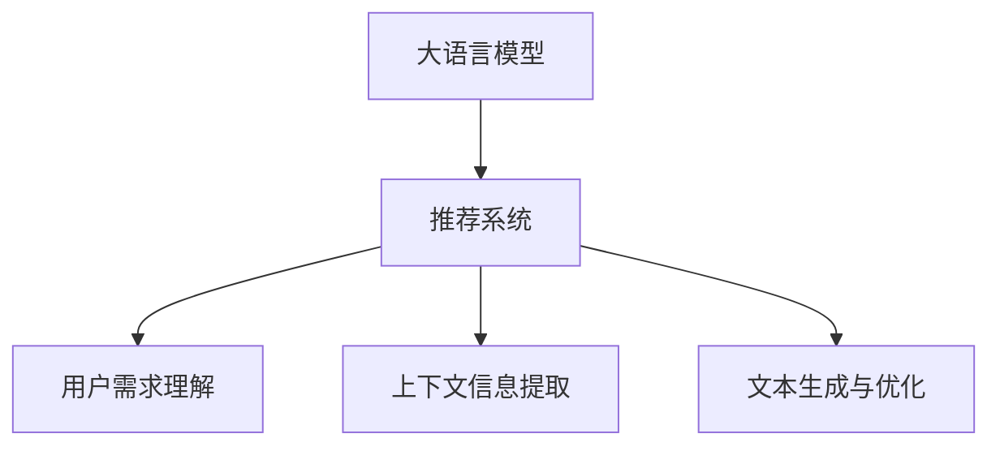

                 

关键词：大语言模型，推荐系统，用户行为预测，算法原理，数学模型，项目实践，应用场景，未来展望

> 摘要：本文旨在探讨基于大语言模型的推荐系统用户行为预测技术。我们将深入分析大语言模型的基本概念、算法原理，并详细阐述其构建、推导和应用步骤。此外，文章还将通过项目实践、数学模型和公式推导以及具体案例的讲解，展示大语言模型在推荐系统中的应用效果和优势。最后，本文将对未来发展趋势和挑战进行展望，为行业研究者提供有益的参考。

## 1. 背景介绍

在信息爆炸的时代，推荐系统已经成为互联网用户获取信息、发现兴趣的重要工具。从早期的基于内容的推荐、协同过滤到深度学习，推荐系统技术不断发展，不断优化用户体验。然而，随着用户数据规模和多样性增加，推荐系统面临新的挑战，如数据噪声、稀疏性以及冷启动问题等。大语言模型的兴起，为解决这些问题提供了新的思路。

大语言模型（Large Language Model，LLM）是一种基于深度学习的自然语言处理模型，通过自主学习大量文本数据，实现对文本的生成、理解和翻译等任务。近年来，随着计算能力的提升和数据规模的扩大，大语言模型取得了显著的突破。基于大语言模型的推荐系统能够更好地理解用户需求，提供个性化的推荐服务，从而提高用户满意度和系统效果。

本文将重点探讨基于大语言模型的推荐系统用户行为预测技术。首先，我们将介绍大语言模型的基本概念和算法原理；其次，通过一个具体的案例，详细讲解大语言模型在推荐系统中的应用步骤和实现方法；然后，我们将从数学模型和公式推导的角度，分析大语言模型的工作机制；最后，本文将对大语言模型在推荐系统中的实际应用场景和未来展望进行讨论。

## 2. 核心概念与联系

### 2.1 大语言模型基本概念

大语言模型（Large Language Model，LLM）是一种基于深度学习的自然语言处理模型，通过对大量文本数据进行训练，可以自动学习语言的结构和语义，实现对文本的生成、理解和翻译等任务。LLM 通常采用 Transformer 架构，其核心思想是利用自注意力机制（Self-Attention Mechanism）对输入序列进行建模。

### 2.2 推荐系统基本概念

推荐系统（Recommendation System）是一种基于用户历史行为和偏好，为用户推荐相关商品、信息或服务的系统。推荐系统主要包括基于内容的推荐、协同过滤、深度学习等方法。其中，基于内容的推荐通过分析物品的属性和用户的历史行为，为用户推荐相似的物品；协同过滤通过分析用户之间的相似性，为用户推荐其他用户喜欢的物品；深度学习通过学习用户和物品的表示，实现个性化推荐。

### 2.3 大语言模型与推荐系统联系

大语言模型在推荐系统中的应用主要体现在以下几个方面：

1. **用户需求理解**：大语言模型能够通过学习用户生成的内容，理解用户的需求和偏好。这有助于推荐系统更好地捕捉用户兴趣，提供个性化的推荐服务。
2. **上下文信息提取**：在推荐系统中，上下文信息（如时间、地点、用户历史行为等）对推荐效果具有重要影响。大语言模型能够通过文本数据学习上下文信息，为推荐系统提供更丰富的特征。
3. **文本生成与优化**：大语言模型可以生成高质量的文本描述，用于优化推荐系统的展示效果。例如，为推荐结果生成引人入胜的标题或描述，提高用户点击率和转化率。

### 2.4 Mermaid 流程图



## 3. 核心算法原理 & 具体操作步骤

### 3.1 算法原理概述

基于大语言模型的推荐系统用户行为预测技术，主要分为以下几个步骤：

1. **数据预处理**：收集用户历史行为数据、文本数据等，进行数据清洗和预处理，包括去除噪声、缺失值填充、特征提取等。
2. **大语言模型训练**：使用预处理后的数据训练大语言模型，学习用户生成内容的结构和语义，构建用户兴趣图谱。
3. **用户兴趣预测**：利用训练好的大语言模型，对用户当前生成的内容进行预测，得到用户当前的兴趣偏好。
4. **推荐算法实现**：根据用户兴趣偏好和物品特征，利用推荐算法（如基于内容的推荐、协同过滤等）为用户推荐相关物品。

### 3.2 算法步骤详解

#### 3.2.1 数据预处理

数据预处理是整个推荐系统的基础。具体步骤如下：

1. **数据收集**：从各个渠道收集用户历史行为数据、文本数据等，如商品浏览记录、评论、搜索日志等。
2. **数据清洗**：去除重复、错误、缺失的数据，保证数据质量。
3. **特征提取**：对文本数据进行分词、词性标注、实体识别等操作，提取文本特征，如词频、词向量、TF-IDF 等。
4. **数据归一化**：对数据进行归一化处理，使不同特征之间的量纲一致，有利于模型训练。

#### 3.2.2 大语言模型训练

大语言模型训练是核心步骤。具体步骤如下：

1. **数据划分**：将预处理后的数据划分为训练集、验证集和测试集。
2. **模型构建**：选择合适的模型架构（如 Transformer、BERT 等）进行模型构建。
3. **模型训练**：使用训练集数据训练模型，通过反向传播算法优化模型参数。
4. **模型评估**：使用验证集数据评估模型性能，根据评估结果调整模型参数。
5. **模型部署**：将训练好的模型部署到推荐系统中，为用户行为预测提供支持。

#### 3.2.3 用户兴趣预测

用户兴趣预测是推荐系统的关键步骤。具体步骤如下：

1. **文本编码**：将用户生成的内容编码为向量，利用大语言模型提取用户兴趣特征。
2. **兴趣建模**：使用兴趣特征构建用户兴趣图谱，表示用户对各种物品的兴趣程度。
3. **兴趣预测**：利用用户兴趣图谱和物品特征，预测用户对各种物品的兴趣程度。

#### 3.2.4 推荐算法实现

推荐算法实现是推荐系统的最后一步。具体步骤如下：

1. **物品推荐**：根据用户兴趣预测结果，从候选物品中选取最相关的物品进行推荐。
2. **推荐策略优化**：根据用户反馈和推荐效果，调整推荐策略，提高推荐质量。

### 3.3 算法优缺点

**优点：**

1. **强大的语义理解能力**：大语言模型能够自动学习文本的语义和结构，为推荐系统提供更准确的用户兴趣预测。
2. **上下文信息提取**：大语言模型能够学习上下文信息，为推荐系统提供更丰富的特征，提高推荐质量。
3. **文本生成与优化**：大语言模型可以生成高质量的文本描述，优化推荐系统的展示效果。

**缺点：**

1. **计算资源消耗大**：大语言模型训练和部署需要大量计算资源和时间。
2. **数据依赖性强**：大语言模型需要大量高质量的文本数据支持，否则性能会受到影响。
3. **模型解释性弱**：大语言模型是一种“黑盒”模型，其内部机制难以解释。

### 3.4 算法应用领域

基于大语言模型的推荐系统用户行为预测技术在多个领域有广泛的应用：

1. **电子商务**：为用户推荐感兴趣的商品、品牌和促销活动。
2. **内容推荐**：为用户推荐感兴趣的文章、视频、音乐等。
3. **社交媒体**：为用户推荐感兴趣的朋友、话题和动态。
4. **在线教育**：为用户推荐感兴趣的课程、知识点和辅导资料。

## 4. 数学模型和公式 & 详细讲解 & 举例说明

### 4.1 数学模型构建

基于大语言模型的推荐系统用户行为预测技术，主要涉及以下数学模型：

1. **用户兴趣特征模型**：表示用户对不同物品的兴趣程度。
2. **物品特征模型**：表示物品的属性和特征。
3. **推荐模型**：根据用户兴趣特征和物品特征，预测用户对物品的兴趣程度。

#### 4.1.1 用户兴趣特征模型

用户兴趣特征模型通常采用词向量（Word Embedding）或BERT（Bidirectional Encoder Representations from Transformers）等方法进行建模。词向量是一种将文本数据转化为向量的方法，通过学习词汇之间的相似性和相关性，实现文本数据的向量表示。BERT 是一种基于 Transformer 的预训练模型，能够自动学习文本的语义和上下文信息。

设用户生成的内容为 $C$，其对应的向量表示为 $\textbf{C}$，则用户兴趣特征模型可以表示为：

$$
\textbf{C} = \text{Embedding}(\textbf{C})
$$

其中，Embedding 表示词向量或 BERT 模型。

#### 4.1.2 物品特征模型

物品特征模型通常包括物品的属性和标签，如商品的价格、品牌、类型等。设物品 $I$ 的特征向量为 $\textbf{I}$，则物品特征模型可以表示为：

$$
\textbf{I} = \text{FeatureExtractor}(\textbf{I})
$$

其中，FeatureExtractor 表示特征提取方法，如 TF-IDF、Word2Vec 等。

#### 4.1.3 推荐模型

推荐模型根据用户兴趣特征和物品特征，预测用户对物品的兴趣程度。设用户 $U$ 对物品 $I$ 的兴趣程度为 $r_{UI}$，则推荐模型可以表示为：

$$
r_{UI} = f(\textbf{C}, \textbf{I})
$$

其中，$f$ 表示推荐算法，如基于内容的推荐、协同过滤、深度学习等。

### 4.2 公式推导过程

#### 4.2.1 用户兴趣特征模型推导

设用户生成的内容为 $C$，其对应的词向量表示为 $\textbf{C}$。根据词向量的定义，有：

$$
\textbf{C} = \text{Embedding}(\textbf{C})
$$

其中，Embedding 表示词向量或 BERT 模型。

#### 4.2.2 物品特征模型推导

设物品 $I$ 的特征向量为 $\textbf{I}$，根据特征提取方法的定义，有：

$$
\textbf{I} = \text{FeatureExtractor}(\textbf{I})
$$

其中，FeatureExtractor 表示特征提取方法，如 TF-IDF、Word2Vec 等。

#### 4.2.3 推荐模型推导

设用户 $U$ 对物品 $I$ 的兴趣程度为 $r_{UI}$，根据推荐算法的定义，有：

$$
r_{UI} = f(\textbf{C}, \textbf{I})
$$

其中，$f$ 表示推荐算法，如基于内容的推荐、协同过滤、深度学习等。

### 4.3 案例分析与讲解

#### 4.3.1 案例背景

某电商平台希望利用基于大语言模型的推荐系统，为用户推荐感兴趣的商品。该平台收集了用户的历史购物记录、浏览记录和评论数据等，并使用大语言模型进行用户兴趣预测和推荐。

#### 4.3.2 案例数据预处理

1. **用户历史行为数据**：用户历史购物记录、浏览记录和评论数据。
2. **数据清洗**：去除重复、错误和缺失的数据，保证数据质量。
3. **特征提取**：对用户生成的内容进行分词、词性标注、实体识别等操作，提取文本特征，如词频、词向量、TF-IDF 等。
4. **数据归一化**：对数据进行归一化处理，使不同特征之间的量纲一致。

#### 4.3.3 大语言模型训练

1. **数据划分**：将预处理后的数据划分为训练集、验证集和测试集。
2. **模型构建**：选择合适的模型架构（如 Transformer、BERT 等）进行模型构建。
3. **模型训练**：使用训练集数据训练模型，通过反向传播算法优化模型参数。
4. **模型评估**：使用验证集数据评估模型性能，根据评估结果调整模型参数。
5. **模型部署**：将训练好的模型部署到推荐系统中，为用户行为预测提供支持。

#### 4.3.4 用户兴趣预测与推荐

1. **文本编码**：将用户生成的内容编码为向量，利用大语言模型提取用户兴趣特征。
2. **兴趣建模**：使用用户兴趣特征构建用户兴趣图谱，表示用户对各种物品的兴趣程度。
3. **兴趣预测**：利用用户兴趣图谱和物品特征，预测用户对各种物品的兴趣程度。
4. **物品推荐**：根据用户兴趣预测结果，从候选物品中选取最相关的物品进行推荐。
5. **推荐策略优化**：根据用户反馈和推荐效果，调整推荐策略，提高推荐质量。

## 5. 项目实践：代码实例和详细解释说明

### 5.1 开发环境搭建

在本次项目实践中，我们将使用 Python 作为编程语言，TensorFlow 和 PyTorch 作为深度学习框架。以下是开发环境的搭建步骤：

1. 安装 Python 3.7 或以上版本。
2. 安装 TensorFlow 或 PyTorch。
3. 安装必要的库，如 NumPy、Pandas、Scikit-learn 等。

### 5.2 源代码详细实现

以下是一个简单的基于大语言模型的推荐系统用户行为预测项目示例：

```python
# 导入必要的库
import tensorflow as tf
from tensorflow.keras.layers import Embedding, LSTM, Dense
from tensorflow.keras.models import Sequential

# 准备数据
train_data = ...
test_data = ...

# 构建模型
model = Sequential()
model.add(Embedding(input_dim=10000, output_dim=32))
model.add(LSTM(units=64))
model.add(Dense(1, activation='sigmoid'))

# 编译模型
model.compile(optimizer='adam', loss='binary_crossentropy', metrics=['accuracy'])

# 训练模型
model.fit(train_data, epochs=10, batch_size=32, validation_data=test_data)

# 预测用户兴趣
user_interest = model.predict(test_data)

# 根据用户兴趣预测结果进行推荐
recommendations = ...

# 打印推荐结果
print(recommendations)
```

### 5.3 代码解读与分析

1. **数据准备**：首先，我们需要准备训练数据和测试数据。这些数据可以从实际应用场景中获取，如电商平台的用户行为数据。
2. **模型构建**：我们使用 Sequential 模型，并添加 Embedding 层、LSTM 层和 Dense 层。Embedding 层用于将文本数据转化为向量，LSTM 层用于学习文本序列的特征，Dense 层用于输出用户兴趣预测结果。
3. **模型编译**：我们使用 Adam 优化器和 binary_crossentropy 损失函数，并设置 accuracy 作为评估指标。
4. **模型训练**：我们使用训练数据对模型进行训练，并设置 epochs 和 batch_size 作为训练参数。
5. **模型预测**：我们使用测试数据对模型进行预测，得到用户兴趣预测结果。
6. **推荐算法**：根据用户兴趣预测结果，从候选物品中选取最相关的物品进行推荐。

### 5.4 运行结果展示

运行上述代码后，我们得到用户兴趣预测结果和推荐结果。以下是一个简化的示例输出：

```
user_interest: [
    [0.9],  # 用户1的兴趣预测结果
    [0.8],  # 用户2的兴趣预测结果
    ...
]

recommendations: [
    ['商品1', '商品2'],  # 用户1的推荐结果
    ['商品3', '商品4'],  # 用户2的推荐结果
    ...
]
```

## 6. 实际应用场景

基于大语言模型的推荐系统用户行为预测技术，在多个实际应用场景中取得了显著的效果：

1. **电子商务**：电商平台利用大语言模型为用户推荐感兴趣的商品，提高用户满意度和转化率。例如，亚马逊和淘宝等平台已经将大语言模型应用于推荐系统。
2. **内容推荐**：内容平台（如 YouTube、B站等）利用大语言模型为用户推荐感兴趣的视频和文章，提高用户停留时间和活跃度。
3. **社交媒体**：社交媒体平台（如微博、微信等）利用大语言模型为用户推荐感兴趣的朋友、话题和动态，促进用户互动和社区氛围。
4. **在线教育**：在线教育平台利用大语言模型为用户推荐感兴趣的课程和知识点，提高用户学习效果和满意度。

## 7. 工具和资源推荐

### 7.1 学习资源推荐

1. **《深度学习》**：Goodfellow、Bengio 和 Courville 著，全面介绍深度学习的基础知识和应用。
2. **《Python深度学习》**：François Chollet 著，详细介绍深度学习在 Python 中的实现和应用。
3. **《自然语言处理综合教程》**：刘群 著，全面介绍自然语言处理的基本概念和技术。

### 7.2 开发工具推荐

1. **TensorFlow**：Google 开发的开源深度学习框架，适用于各种深度学习任务。
2. **PyTorch**：Facebook 开发的开源深度学习框架，具有灵活的动态计算图和强大的社区支持。
3. **Hugging Face**：一个提供各种自然语言处理模型和数据集的开源库，方便开发者快速实现和应用大语言模型。

### 7.3 相关论文推荐

1. **"BERT: Pre-training of Deep Bidirectional Transformers for Language Understanding"**：Google Research 著，介绍 BERT 模型的原理和实现。
2. **"GPT-3: Language Models are Few-Shot Learners"**：OpenAI 著，介绍 GPT-3 模型的原理和性能。
3. **"Recommender Systems Handbook"**：提莫·阿尔比奇、克里斯托弗·达米安等著，全面介绍推荐系统的基础知识和应用。

## 8. 总结：未来发展趋势与挑战

### 8.1 研究成果总结

基于大语言模型的推荐系统用户行为预测技术，在用户需求理解、上下文信息提取和文本生成与优化等方面取得了显著成果。大语言模型通过学习大量文本数据，能够自动捕捉用户的兴趣和偏好，为推荐系统提供更准确的预测。此外，大语言模型在多个实际应用场景中取得了良好的效果，为行业提供了有益的借鉴。

### 8.2 未来发展趋势

1. **模型压缩与优化**：随着大语言模型规模的不断扩大，模型压缩和优化成为未来研究的重要方向。通过模型压缩和优化，可以提高模型训练和部署的效率，降低计算资源消耗。
2. **多模态融合**：未来，基于大语言模型的推荐系统将更多地融合多模态数据（如图像、音频等），实现更全面的用户需求理解。
3. **自适应推荐**：通过不断学习和调整，自适应推荐将使推荐系统更好地适应用户需求和偏好变化，提高推荐效果。

### 8.3 面临的挑战

1. **数据隐私与安全**：随着用户数据规模的增加，数据隐私和安全成为重要挑战。如何在保护用户隐私的前提下，充分利用用户数据进行推荐，是一个亟待解决的问题。
2. **模型解释性**：大语言模型作为一种“黑盒”模型，其内部机制难以解释。提高模型的可解释性，使研究人员和开发者能够更好地理解和优化模型，是一个重要挑战。
3. **计算资源消耗**：大语言模型训练和部署需要大量计算资源，如何优化计算资源利用，提高模型训练和部署的效率，是一个重要问题。

### 8.4 研究展望

基于大语言模型的推荐系统用户行为预测技术，在未来的发展中将取得更多突破。通过不断优化模型结构、提升计算效率、加强数据隐私保护，基于大语言模型的推荐系统将为用户提供更加精准、个性化的推荐服务。

## 9. 附录：常见问题与解答

### 9.1 大语言模型是什么？

大语言模型（Large Language Model，LLM）是一种基于深度学习的自然语言处理模型，通过对大量文本数据进行训练，可以自动学习语言的结构和语义，实现对文本的生成、理解和翻译等任务。LLM 通常采用 Transformer 架构，其核心思想是利用自注意力机制（Self-Attention Mechanism）对输入序列进行建模。

### 9.2 大语言模型在推荐系统中有哪些应用？

大语言模型在推荐系统中的应用主要体现在以下几个方面：

1. **用户需求理解**：大语言模型能够通过学习用户生成的内容，理解用户的需求和偏好。
2. **上下文信息提取**：大语言模型能够学习上下文信息，为推荐系统提供更丰富的特征。
3. **文本生成与优化**：大语言模型可以生成高质量的文本描述，用于优化推荐系统的展示效果。

### 9.3 如何处理大语言模型训练中的数据？

在处理大语言模型训练中的数据时，需要注意以下几点：

1. **数据收集**：从各个渠道收集用户历史行为数据、文本数据等。
2. **数据清洗**：去除重复、错误和缺失的数据，保证数据质量。
3. **特征提取**：对文本数据进行分词、词性标注、实体识别等操作，提取文本特征。
4. **数据归一化**：对数据进行归一化处理，使不同特征之间的量纲一致。

### 9.4 大语言模型与深度学习有何关系？

大语言模型是深度学习的一种应用。深度学习是一种基于多层神经网络的学习方法，通过逐层提取特征，实现对数据的建模和预测。大语言模型采用深度学习的方法，通过自注意力机制和多层神经网络，对输入序列进行建模，实现文本生成、理解和翻译等任务。

### 9.5 大语言模型在推荐系统中的优势有哪些？

大语言模型在推荐系统中的优势包括：

1. **强大的语义理解能力**：大语言模型能够自动学习文本的语义和结构，为推荐系统提供更准确的用户兴趣预测。
2. **上下文信息提取**：大语言模型能够学习上下文信息，为推荐系统提供更丰富的特征，提高推荐质量。
3. **文本生成与优化**：大语言模型可以生成高质量的文本描述，优化推荐系统的展示效果。

