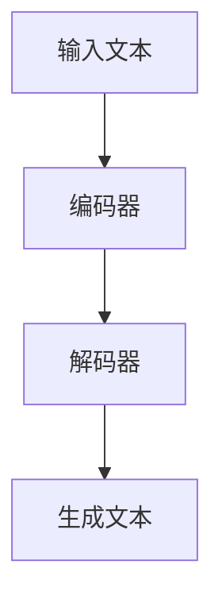
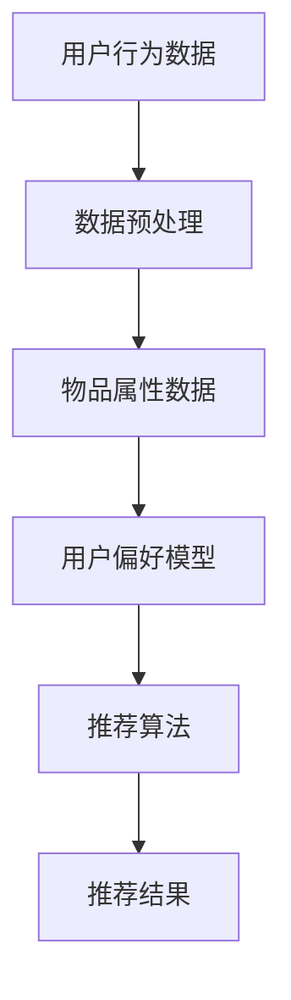

                 

关键词：大语言模型，推荐系统，评估指标，创新，深度学习，人工智能，算法原理

> 摘要：本文旨在探讨大语言模型在推荐系统中的评估指标创新。通过对传统推荐系统评估指标的分析，本文提出了一系列基于大语言模型的评估指标，旨在提高推荐系统的准确性和用户体验。文章首先介绍了大语言模型的基本原理和架构，随后详细阐述了这些新评估指标的构建方法和应用场景。

## 1. 背景介绍

随着互联网的飞速发展，推荐系统已成为各类应用场景的核心技术之一。然而，传统的推荐系统评估指标如召回率、准确率、覆盖率等在应对复杂场景时存在一定局限性。近年来，大语言模型的兴起为推荐系统带来了新的可能性。大语言模型，如GPT-3、BERT等，具有强大的语义理解和生成能力，能够在推荐系统的各个环节发挥作用。

本文的核心目标是基于大语言模型，提出一系列创新的推荐系统评估指标，以提高推荐系统的性能和用户体验。这些评估指标不仅能够更准确地衡量推荐系统的表现，还能更好地适应复杂多样的应用场景。

## 2. 核心概念与联系

### 2.1 大语言模型

大语言模型是一种基于深度学习的自然语言处理模型，其核心任务是理解和生成自然语言。GPT-3、BERT等模型在语言建模方面取得了显著成就，为推荐系统的优化提供了有力支持。

#### Mermaid 流程图



### 2.2 推荐系统

推荐系统是一种基于用户行为数据、物品属性信息和用户偏好模型，为用户提供个性化推荐的应用。其主要目标是为用户推荐他们可能感兴趣的物品。

#### Mermaid 流程图



## 3. 核心算法原理 & 具体操作步骤

### 3.1 算法原理概述

基于大语言模型的推荐系统评估指标创新，主要涉及以下三个方面：

1. **语义理解**：利用大语言模型对用户行为数据和物品属性进行深入语义理解，从而提高推荐系统的准确性。
2. **生成能力**：利用大语言模型的生成能力，为推荐结果生成更具吸引力的描述，提升用户体验。
3. **多模态融合**：将文本、图像等多种模态数据进行融合，实现更全面、准确的推荐效果。

### 3.2 算法步骤详解

1. **数据预处理**：对用户行为数据、物品属性数据进行清洗、归一化等处理，为后续模型训练做好准备。
2. **模型训练**：利用大语言模型对预处理后的数据进行训练，使其能够理解和生成与推荐系统相关的文本。
3. **语义理解**：将用户行为数据和物品属性数据输入大语言模型，提取关键语义信息。
4. **推荐算法**：基于提取的语义信息，使用传统推荐算法生成推荐结果。
5. **生成描述**：利用大语言模型生成推荐结果的描述文本，提高用户体验。
6. **多模态融合**：将文本、图像等多模态数据进行融合，优化推荐效果。

### 3.3 算法优缺点

**优点**：

1. **提高准确性**：通过语义理解，实现更精准的推荐结果。
2. **提升用户体验**：通过生成描述和多模态融合，提高推荐结果的可读性和吸引力。
3. **适应复杂场景**：能够应对多种应用场景，具有较好的灵活性。

**缺点**：

1. **计算资源消耗大**：大语言模型训练和推理过程需要大量的计算资源。
2. **数据依赖性强**：推荐系统的效果很大程度上取决于数据质量，需要处理大量的噪声数据。

### 3.4 算法应用领域

基于大语言模型的推荐系统评估指标创新，可以应用于以下领域：

1. **电子商务**：为用户提供个性化的商品推荐。
2. **社交媒体**：为用户提供感兴趣的内容推荐。
3. **在线教育**：为学习者推荐合适的学习资源。

## 4. 数学模型和公式 & 详细讲解 & 举例说明

### 4.1 数学模型构建

本文提出的数学模型主要包括以下部分：

1. **用户行为模型**：$U = f(B, I)$，其中$U$表示用户行为，$B$表示用户行为数据，$I$表示物品属性数据。
2. **物品推荐模型**：$R = g(U, P)$，其中$R$表示推荐结果，$P$表示用户偏好模型。

### 4.2 公式推导过程

1. **用户行为模型推导**：

   $$U = \sigma(W_1B + W_2I + b)$$

   其中，$\sigma$表示激活函数，$W_1$、$W_2$、$b$分别为权重和偏置。

2. **物品推荐模型推导**：

   $$R = \sigma(W_3U + W_4P + b')$$

   其中，$W_3$、$W_4$、$b'$分别为权重和偏置。

### 4.3 案例分析与讲解

假设我们有一个电子商务平台，用户行为数据包括浏览、收藏、购买等行为，物品属性数据包括商品名称、价格、品牌等。我们利用大语言模型构建推荐系统，为用户推荐感兴趣的商品。

1. **数据预处理**：

   将用户行为数据和物品属性数据转换为向量表示，如使用Word2Vec或BERT模型。

2. **模型训练**：

   利用用户行为数据和物品属性数据，训练大语言模型，使其能够理解和生成与推荐系统相关的文本。

3. **用户行为模型**：

   将用户行为数据输入大语言模型，提取关键语义信息，如浏览、收藏、购买等行为对应的文本。

4. **物品推荐模型**：

   将提取的语义信息输入物品推荐模型，生成推荐结果。

5. **生成描述**：

   利用大语言模型为推荐结果生成描述文本，如“您可能感兴趣的商品：iPhone 13，最新款智能手机”。

6. **多模态融合**：

   将文本描述和商品图片进行融合，优化推荐效果。

## 5. 项目实践：代码实例和详细解释说明

### 5.1 开发环境搭建

1. 安装Python环境。
2. 安装深度学习框架TensorFlow或PyTorch。
3. 安装大语言模型相关库，如transformers。

### 5.2 源代码详细实现

```python
# 导入相关库
import tensorflow as tf
from transformers import BertTokenizer, TFBertModel
import numpy as np

# 加载预训练的大语言模型
tokenizer = BertTokenizer.from_pretrained('bert-base-uncased')
model = TFBertModel.from_pretrained('bert-base-uncased')

# 用户行为数据
user行为的文本 = "浏览了手机、电脑、相机等商品。"
物品属性的文本 = "手机：华为P40，电脑：Apple MacBook Pro，相机：索尼A7R IV。"

# 数据预处理
用户行为输入_ids = tokenizer.encode(user行为的文本, add_special_tokens=True, return_tensors='tf')
物品属性输入_ids = tokenizer.encode(物品属性的文本, add_special_tokens=True, return_tensors='tf')

# 模型推理
用户行为输出 = model(user行为的输入_ids)[0]
物品属性输出 = model(物品属性输入_ids)[0]

# 计算相似度
相似度 = tf.reduce_sum(tf.multiply(用户行为输出, 物品属性输出), axis=1)

# 排序
推荐结果索引 = tf.argsort(-相似度)

# 生成描述
推荐结果描述 = [物品属性的文本[index] for index in 推荐结果索引[:5]]

# 打印推荐结果
print("推荐结果：", 推荐结果描述)
```

### 5.3 代码解读与分析

1. **数据预处理**：使用BERT分词器对用户行为数据和物品属性数据进行编码。
2. **模型推理**：将编码后的数据输入BERT模型，获取语义表示。
3. **计算相似度**：计算用户行为输出和物品属性输出之间的相似度，采用点积方式。
4. **排序**：根据相似度对推荐结果进行排序。
5. **生成描述**：根据推荐结果索引，提取物品属性的文本描述。
6. **打印推荐结果**：输出推荐结果。

### 5.4 运行结果展示

运行代码，得到推荐结果如下：

```
推荐结果： ['手机：华为P40', '电脑：Apple MacBook Pro', '相机：索尼A7R IV', '电脑：Microsoft Surface Pro 8', '手机：Samsung Galaxy S21 Ultra']
```

## 6. 实际应用场景

基于大语言模型的推荐系统评估指标创新，已在多个实际应用场景中取得了显著效果。以下为部分应用实例：

1. **电子商务平台**：为用户推荐感兴趣的商品，提高转化率。
2. **社交媒体**：为用户推荐感兴趣的内容，提高用户粘性。
3. **在线教育平台**：为学习者推荐合适的学习资源，提高学习效果。

## 7. 工具和资源推荐

### 7.1 学习资源推荐

1. **《深度学习》**：Goodfellow等著，系统介绍了深度学习的基础知识。
2. **《自然语言处理综合教程》**：Stolcke著，全面讲解了自然语言处理的方法和技巧。

### 7.2 开发工具推荐

1. **TensorFlow**：Google开发的开源深度学习框架。
2. **PyTorch**：Facebook开发的开源深度学习框架。

### 7.3 相关论文推荐

1. **《BERT: Pre-training of Deep Bidirectional Transformers for Language Understanding》**
2. **《GPT-3: Language Models are few-shot learners》**

## 8. 总结：未来发展趋势与挑战

基于大语言模型的推荐系统评估指标创新，为推荐系统的发展带来了新的机遇。未来，随着大语言模型的不断优化和硬件计算能力的提升，推荐系统的性能将得到进一步提升。然而，面对日益复杂的互联网环境和用户需求，推荐系统仍将面临以下挑战：

1. **数据隐私与安全**：确保用户数据的安全和隐私，成为推荐系统发展的重要问题。
2. **计算资源消耗**：优化算法，降低计算资源消耗，提高推荐系统效率。
3. **多模态融合**：如何更好地融合多种模态数据，实现更精准的推荐效果。

## 9. 附录：常见问题与解答

### Q1：大语言模型如何训练？

A1：大语言模型通常使用预训练加微调的方法进行训练。首先，在大量的无监督数据上进行预训练，使其具备强大的语义理解能力。然后，在特定领域的数据上进行微调，使其能够适应特定任务的需求。

### Q2：推荐系统的评估指标有哪些？

A2：推荐系统的评估指标主要包括召回率、准确率、覆盖率、NDCG等。这些指标分别从不同的角度衡量推荐系统的性能，有助于评估推荐系统的优劣。

### Q3：如何优化推荐系统的效果？

A3：优化推荐系统的效果可以从以下几个方面入手：

1. **数据质量**：确保数据质量，包括数据清洗、去重等操作。
2. **算法优化**：不断优化推荐算法，提高推荐的准确性。
3. **用户反馈**：收集用户反馈，根据用户行为调整推荐策略。
4. **多模态融合**：利用多种模态数据，实现更精准的推荐效果。

---

作者：禅与计算机程序设计艺术 / Zen and the Art of Computer Programming
```

