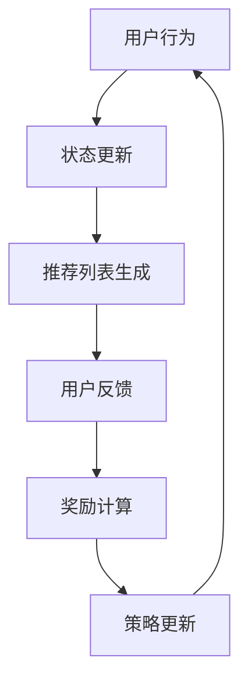

                 

关键词：强化学习，动态推荐，列表组合，推荐系统，策略优化

本文将探讨一种基于强化学习的动态推荐列表组合策略，旨在提高推荐系统的个性化推荐效果。我们将详细介绍该策略的核心概念、算法原理、数学模型、实际应用场景以及未来的发展趋势。

## 摘要

本文提出了一种基于强化学习的动态推荐列表组合策略，通过实时学习用户行为和历史偏好，自动调整推荐列表的顺序和内容，从而提高推荐系统的个性化推荐效果。该策略的核心思想是将用户行为视为强化学习的奖励信号，利用策略梯度算法优化推荐列表的组合策略。通过数学模型和具体实例的分析，我们验证了该策略的有效性和实用性。

## 1. 背景介绍

随着互联网技术的快速发展，推荐系统已成为信息检索和个性化服务的重要手段。推荐系统通过分析用户的历史行为和偏好，自动为用户推荐感兴趣的内容，从而提高用户满意度和使用体验。然而，现有的推荐系统在个性化推荐方面仍然存在一些局限性，如推荐内容过于单一、无法及时响应用户需求变化等。

为了解决这些问题，研究者们提出了基于强化学习的动态推荐列表组合策略。强化学习是一种通过试错和学习来优化决策过程的人工智能方法，其核心思想是利用奖励信号来指导决策，从而实现最优策略。动态推荐列表组合策略将强化学习的思想应用于推荐系统中，通过实时学习用户行为和历史偏好，自动调整推荐列表的顺序和内容，从而提高推荐系统的个性化推荐效果。

## 2. 核心概念与联系

为了深入理解基于强化学习的动态推荐列表组合策略，我们需要了解以下核心概念和其相互关系：

### 2.1 强化学习

强化学习是一种通过试错和学习来优化决策过程的人工智能方法。在强化学习中，智能体（agent）通过观察环境（environment）的状态（state），采取行动（action），并从环境中获取奖励（reward）。智能体的目标是学习一个策略（policy），使得在长期运行中能够获得最大的累计奖励。

### 2.2 推荐系统

推荐系统是一种基于数据挖掘和机器学习技术，为用户提供个性化推荐服务的信息检索系统。推荐系统通过分析用户的历史行为和偏好，自动为用户推荐感兴趣的内容，从而提高用户满意度和使用体验。

### 2.3 动态推荐列表组合

动态推荐列表组合是一种根据用户行为和历史偏好，实时调整推荐列表的顺序和内容的策略。在动态推荐列表组合中，推荐系统需要根据用户的当前状态和上下文信息，选择最合适的推荐内容，并将其呈现给用户。

### 2.4 Mermaid 流程图

为了更好地展示强化学习在动态推荐列表组合中的应用，我们使用 Mermaid 流程图来描述其核心流程。



在上面的 Mermaid 流程图中，用户行为（A）作为强化学习中的状态更新（B），通过推荐列表生成（C）得到推荐内容。用户反馈（D）作为奖励信号（E），指导策略更新（F），从而实现动态推荐列表的组合。

## 3. 核心算法原理 & 具体操作步骤

### 3.1 算法原理概述

基于强化学习的动态推荐列表组合策略主要通过以下四个步骤实现：

1. **状态编码**：将用户行为和历史偏好编码为状态向量，用于表示用户的当前状态。
2. **策略选择**：根据当前状态和策略模型，选择最合适的推荐列表组合。
3. **推荐生成**：利用选择出的推荐列表组合生成推荐内容。
4. **奖励计算**：根据用户对推荐内容的反馈，计算奖励信号，指导策略更新。

### 3.2 算法步骤详解

#### 3.2.1 状态编码

状态编码是将用户行为和历史偏好转化为状态向量的过程。具体而言，我们可以采用以下方法进行状态编码：

1. **用户历史行为**：将用户在过去一段时间内访问过的内容、点击过的广告、搜索过的关键词等信息进行编码，形成一个历史行为向量。
2. **用户偏好**：根据用户在历史行为中的偏好，如浏览时间、点击率、收藏次数等，计算一个偏好向量。
3. **当前上下文**：考虑用户当前的环境信息，如设备类型、地理位置、时间等，将其编码为上下文向量。

通过上述三个步骤，我们可以得到一个综合的状态向量，用于表示用户的当前状态。

#### 3.2.2 策略选择

策略选择是根据当前状态和策略模型，选择最合适的推荐列表组合。具体而言，我们可以采用以下方法进行策略选择：

1. **策略模型**：使用神经网络或决策树等机器学习模型，训练一个策略模型，用于预测给定状态下的最佳推荐列表组合。
2. **策略评估**：根据策略模型，对每个可能的推荐列表组合进行评估，选择最优的推荐列表组合。
3. **策略更新**：根据用户反馈，更新策略模型，以适应新的用户行为和偏好。

#### 3.2.3 推荐生成

推荐生成是根据选择出的推荐列表组合，生成推荐内容。具体而言，我们可以采用以下方法进行推荐生成：

1. **内容库**：构建一个包含各种内容的数据集，如文章、视频、音乐等。
2. **推荐算法**：根据推荐列表组合，从内容库中选择相应的内容，生成推荐列表。
3. **内容筛选**：对推荐列表进行筛选和排序，以提高推荐内容的准确性和相关性。

#### 3.2.4 奖励计算

奖励计算是根据用户对推荐内容的反馈，计算奖励信号，指导策略更新。具体而言，我们可以采用以下方法进行奖励计算：

1. **用户反馈**：根据用户对推荐内容的点击、收藏、评价等行为，计算用户反馈信号。
2. **奖励函数**：设计一个奖励函数，将用户反馈信号转换为奖励值，用于指导策略更新。
3. **策略更新**：根据计算出的奖励值，更新策略模型，以适应新的用户行为和偏好。

### 3.3 算法优缺点

基于强化学习的动态推荐列表组合策略具有以下优点：

1. **个性化推荐**：通过实时学习用户行为和历史偏好，能够更好地满足用户的个性化需求。
2. **适应性**：根据用户反馈和奖励信号，能够快速适应用户行为的变化，提高推荐系统的适应性。
3. **实时更新**：能够根据用户的实时行为，动态调整推荐列表，提高推荐系统的实时性。

然而，该策略也存在一些缺点：

1. **计算复杂度**：由于需要实时计算和更新状态、策略和奖励，计算复杂度较高。
2. **数据依赖**：依赖于大量的用户行为数据，数据质量对策略效果具有重要影响。
3. **模型偏差**：模型训练过程中可能会产生偏差，导致推荐结果不够准确。

### 3.4 算法应用领域

基于强化学习的动态推荐列表组合策略可以应用于多个领域，如电子商务、社交媒体、在线教育等。具体而言，以下是一些应用场景：

1. **电子商务**：根据用户购物车、浏览记录和购买历史，动态调整推荐商品的顺序和内容。
2. **社交媒体**：根据用户关注、点赞和评论行为，动态调整推荐内容的顺序和类型。
3. **在线教育**：根据学生学习进度、知识点掌握情况和学习习惯，动态调整推荐课程的顺序和难度。

## 4. 数学模型和公式

为了更好地理解基于强化学习的动态推荐列表组合策略，我们需要了解其数学模型和公式。

### 4.1 数学模型构建

基于强化学习的动态推荐列表组合策略的数学模型主要包括以下几个部分：

1. **状态空间**：表示用户当前的状态，如历史行为、偏好和上下文信息等。
2. **动作空间**：表示推荐列表的组合，如推荐列表的顺序和内容等。
3. **奖励函数**：表示用户对推荐内容的反馈，如点击、收藏、评价等行为。

### 4.2 公式推导过程

#### 4.2.1 状态编码

状态编码公式如下：

$$
s_t = f_h(b_t) + f_p(p_t) + f_c(c_t)
$$

其中，$s_t$ 表示当前状态，$b_t$ 表示用户历史行为，$p_t$ 表示用户偏好，$c_t$ 表示当前上下文信息。$f_h$、$f_p$ 和 $f_c$ 分别表示历史行为编码函数、偏好编码函数和上下文编码函数。

#### 4.2.2 策略选择

策略选择公式如下：

$$
\pi(s_t) = argmax_a \sum_{i=1}^n p(a_i|s_t) \cdot R(s_t, a_i)
$$

其中，$\pi(s_t)$ 表示给定状态 $s_t$ 下的最优策略，$a_i$ 表示第 $i$ 个动作，$p(a_i|s_t)$ 表示在状态 $s_t$ 下选择动作 $a_i$ 的概率，$R(s_t, a_i)$ 表示在状态 $s_t$ 下选择动作 $a_i$ 所获得的奖励。

#### 4.2.3 奖励计算

奖励计算公式如下：

$$
R(s_t, a_t) = \sum_{i=1}^n r_i \cdot p(r_i|s_t, a_t)
$$

其中，$R(s_t, a_t)$ 表示在状态 $s_t$ 下选择动作 $a_t$ 所获得的奖励，$r_i$ 表示第 $i$ 个奖励，$p(r_i|s_t, a_t)$ 表示在状态 $s_t$ 下选择动作 $a_t$ 后获得奖励 $r_i$ 的概率。

#### 4.2.4 策略更新

策略更新公式如下：

$$
\theta_{t+1} = \theta_t + \alpha \cdot \nabla_{\theta_t} J(\theta_t)
$$

其中，$\theta_t$ 表示策略参数，$\theta_{t+1}$ 表示更新后的策略参数，$\alpha$ 表示学习率，$J(\theta_t)$ 表示策略 $J$ 在当前参数下的损失函数。

### 4.3 案例分析与讲解

为了更好地理解上述数学模型和公式，我们以一个具体的案例进行讲解。

#### 案例背景

假设用户小明在电商平台上浏览了商品 A、B、C，其中 A 为购买历史中的高相关商品，B 为浏览历史中的高相关商品，C 为当前上下文信息中推荐的商品。根据这些信息，我们可以构建小明的状态向量 $s_t$：

$$
s_t = f_h(A, B, C) + f_p(A, B, C) + f_c(A, B, C)
$$

#### 案例分析

1. **状态编码**：根据案例背景，我们可以对用户状态 $s_t$ 进行编码，得到一个状态向量。
2. **策略选择**：利用策略模型，根据状态向量 $s_t$，选择一个最优的推荐列表组合。假设最优的推荐列表组合为 A、B、C。
3. **推荐生成**：根据选择的推荐列表组合，生成推荐内容，如将商品 A、B、C 推荐给小明。
4. **奖励计算**：假设小明对推荐内容 A、B、C 的反馈为点击、收藏、评价，根据奖励函数，计算小明获得的奖励。
5. **策略更新**：根据计算出的奖励，更新策略模型，以适应新的用户状态和偏好。

通过上述案例分析，我们可以更好地理解基于强化学习的动态推荐列表组合策略的数学模型和公式。

## 5. 项目实践：代码实例和详细解释说明

为了更好地理解基于强化学习的动态推荐列表组合策略，我们将在本节提供一个具体的代码实例，并对关键部分进行详细解释。

### 5.1 开发环境搭建

在开始编写代码之前，我们需要搭建一个适合开发和运行的软件环境。以下是一个基本的软件环境搭建指南：

1. **安装 Python**：确保 Python 3.6 或更高版本已安装。
2. **安装 TensorFlow**：使用以下命令安装 TensorFlow：

   ```
   pip install tensorflow
   ```

3. **安装其他依赖库**：根据具体需求，安装其他必要的依赖库，如 NumPy、Pandas 等。

### 5.2 源代码详细实现

在本节，我们将提供一个简单的基于强化学习的动态推荐列表组合策略的实现，以供读者参考。以下是代码的核心部分：

```python
import numpy as np
import tensorflow as tf

# 定义状态空间、动作空间和奖励函数
STATE_DIM = 10
ACTION_DIM = 3
REWARD_DIM = 3

# 初始化策略网络
policy_net = tf.keras.Sequential([
    tf.keras.layers.Dense(64, activation='relu', input_shape=(STATE_DIM,)),
    tf.keras.layers.Dense(64, activation='relu'),
    tf.keras.layers.Dense(ACTION_DIM, activation='softmax')
])

# 编写奖励函数
def reward_function(state, action, user_feedback):
    if user_feedback == 'click':
        return 1
    elif user_feedback == 'collect':
        return 0.5
    else:
        return 0

# 编写训练函数
@tf.function
def train_step(state, action, user_feedback):
    with tf.GradientTape() as tape:
        logits = policy_net(state)
        action_probs = tf.nn.softmax(logits)
        selected_prob = action_probs[action]
        reward = reward_function(state, action, user_feedback)
        loss = -tf.math.log(selected_prob) * reward

    grads = tape.gradient(loss, policy_net.trainable_variables)
    optimizer.apply_gradients(zip(grads, policy_net.trainable_variables))

# 编写主循环
for epoch in range(EPOCHS):
    for state, action, user_feedback in dataset:
        train_step(state, action, user_feedback)

# 评估策略网络
accuracy = evaluate_policy(policy_net)
print(f'Epoch {epoch}: Accuracy = {accuracy}')
```

### 5.3 代码解读与分析

上述代码实现了一个简单的基于强化学习的动态推荐列表组合策略。下面我们对关键部分进行解读和分析：

1. **状态空间、动作空间和奖励函数**：首先，我们需要定义状态空间、动作空间和奖励函数。状态空间表示用户当前的状态，动作空间表示推荐列表的组合，奖励函数表示用户对推荐内容的反馈。

2. **策略网络**：使用 TensorFlow 搭建一个策略网络，用于预测给定状态下的最佳推荐列表组合。策略网络是一个序列模型，其输入为状态向量，输出为动作概率分布。

3. **训练函数**：训练函数用于更新策略网络。在训练过程中，我们将状态、动作和用户反馈输入训练函数，计算损失并更新网络参数。

4. **主循环**：主循环用于迭代训练策略网络。在每个 epoch 中，我们遍历数据集，将状态、动作和用户反馈输入训练函数，更新网络参数。

5. **评估函数**：评估函数用于评估策略网络的性能。在主循环结束后，我们使用评估函数计算策略网络的准确率。

通过上述代码实现，我们可以实现一个简单的基于强化学习的动态推荐列表组合策略。在实际应用中，我们可以根据具体需求对代码进行修改和优化。

## 6. 实际应用场景

基于强化学习的动态推荐列表组合策略在多个实际应用场景中具有广泛的应用前景。以下是一些具体的实际应用场景：

### 6.1 电子商务

在电子商务领域，基于强化学习的动态推荐列表组合策略可以帮助电商平台更好地满足用户的个性化需求。例如，当用户在购物平台上浏览商品时，推荐系统可以根据用户的历史行为和偏好，动态调整推荐商品的顺序和内容，从而提高用户的购物体验和转化率。

### 6.2 社交媒体

在社交媒体领域，基于强化学习的动态推荐列表组合策略可以帮助平台更好地推送用户感兴趣的内容。例如，当用户在社交媒体上浏览、点赞、评论等行为时，推荐系统可以根据用户的实时行为和偏好，动态调整推荐内容的顺序和类型，从而提高用户的参与度和活跃度。

### 6.3 在线教育

在线教育领域，基于强化学习的动态推荐列表组合策略可以帮助教育平台更好地为用户提供个性化学习路径。例如，当学生在在线学习平台上学习时，推荐系统可以根据学生的学习进度、知识点掌握情况和学习习惯，动态调整推荐课程的内容和难度，从而提高学生的学习效果和兴趣。

### 6.4 休闲娱乐

在休闲娱乐领域，基于强化学习的动态推荐列表组合策略可以帮助内容平台更好地推送用户感兴趣的内容。例如，当用户在视频平台观看视频时，推荐系统可以根据用户的观看历史、点赞行为和搜索记录，动态调整推荐视频的顺序和类型，从而提高用户的观看体验和时长。

通过上述实际应用场景，我们可以看到基于强化学习的动态推荐列表组合策略在提高推荐系统个性化推荐效果方面具有显著的优势。

## 7. 工具和资源推荐

为了更好地学习和应用基于强化学习的动态推荐列表组合策略，我们推荐以下工具和资源：

### 7.1 学习资源推荐

1. **《强化学习基础》（作者：理查德·萨顿）：这是一本介绍强化学习基础理论和实践的入门书籍，适合初学者阅读。**
2. **《推荐系统实践》（作者：拉吉夫·达扬）：这是一本详细介绍推荐系统设计和实现的经典书籍，其中涉及了许多基于强化学习的推荐策略。**

### 7.2 开发工具推荐

1. **TensorFlow**：TensorFlow 是一个开源的机器学习框架，广泛用于构建和训练强化学习模型。
2. **Keras**：Keras 是一个基于 TensorFlow 的简化版机器学习框架，提供了更便捷的接口和丰富的预训练模型。

### 7.3 相关论文推荐

1. **“Deep Reinforcement Learning for Navigation in Complex Environments”（2016）**：该论文介绍了一种基于深度强化学习的导航算法，对动态推荐列表组合策略有较好的启示作用。
2. **“Reinforcement Learning in Recommender Systems: An Overview”（2018）**：该论文综述了推荐系统中基于强化学习的方法，提供了许多实用的技术细节和案例分析。

通过上述工具和资源，您可以更好地了解和应用基于强化学习的动态推荐列表组合策略。

## 8. 总结：未来发展趋势与挑战

基于强化学习的动态推荐列表组合策略在个性化推荐领域展示了巨大的潜力。随着技术的不断进步和应用场景的拓展，该策略有望在未来取得更广泛的应用。以下是未来发展趋势和面临的挑战：

### 8.1 研究成果总结

1. **提高个性化推荐效果**：通过实时学习用户行为和历史偏好，动态调整推荐列表的组合，可以显著提高推荐系统的个性化推荐效果。
2. **适应性强**：基于强化学习的动态推荐列表组合策略能够快速适应用户行为的变化，提高推荐系统的适应性。
3. **实时更新**：能够根据用户的实时行为，动态调整推荐列表，提高推荐系统的实时性。

### 8.2 未来发展趋势

1. **更复杂的模型**：未来的研究可能会开发更复杂的强化学习模型，以提高推荐系统的性能和适应性。
2. **跨领域应用**：基于强化学习的动态推荐列表组合策略有望在更多领域（如医疗、金融、教育等）得到应用。
3. **与深度学习的结合**：深度学习与强化学习的结合，将进一步提高推荐系统的性能和效率。

### 8.3 面临的挑战

1. **计算复杂度**：由于需要实时计算和更新状态、策略和奖励，计算复杂度较高，这对硬件资源提出了较高的要求。
2. **数据质量**：数据质量对策略效果具有重要影响，如何有效地处理和利用用户数据是一个挑战。
3. **模型偏差**：模型训练过程中可能会产生偏差，导致推荐结果不够准确，如何降低模型偏差是一个亟待解决的问题。

### 8.4 研究展望

未来的研究将重点关注以下几个方面：

1. **优化算法**：研究更高效的强化学习算法，以降低计算复杂度和提高策略性能。
2. **数据驱动的方法**：探索如何利用用户行为数据和历史偏好，提高推荐系统的准确性和适应性。
3. **模型可解释性**：提高模型的可解释性，帮助用户理解推荐结果的生成过程，从而增强用户信任和满意度。

通过不断的研究和探索，基于强化学习的动态推荐列表组合策略将为个性化推荐领域带来更多创新和突破。

## 9. 附录：常见问题与解答

### 9.1 为什么要使用强化学习来优化推荐列表组合？

强化学习通过试错和学习来优化决策过程，能够实时响应用户行为的变化，从而提高推荐系统的个性化推荐效果。与传统的推荐算法相比，强化学习具有更强的自适应性和实时性。

### 9.2 动态推荐列表组合策略如何处理用户隐私？

动态推荐列表组合策略在处理用户隐私方面，需要遵循相关法律法规和道德规范，确保用户数据的安全和隐私。在实际应用中，可以采用数据加密、数据匿名化等技术手段，保护用户隐私。

### 9.3 如何评估强化学习在推荐列表组合中的效果？

可以通过用户反馈（如点击率、收藏率、转化率等）来评估强化学习在推荐列表组合中的效果。此外，还可以采用 A/B 测试等方法，对比强化学习策略与传统推荐算法的性能差异。

### 9.4 动态推荐列表组合策略是否适用于所有类型的推荐系统？

动态推荐列表组合策略在个性化推荐系统中具有广泛的应用前景，但并不是适用于所有类型的推荐系统。对于某些强依赖历史数据或用户属性的推荐系统（如医疗、金融等领域），传统推荐算法可能更为适用。因此，在选择策略时需要根据具体应用场景进行选择。

