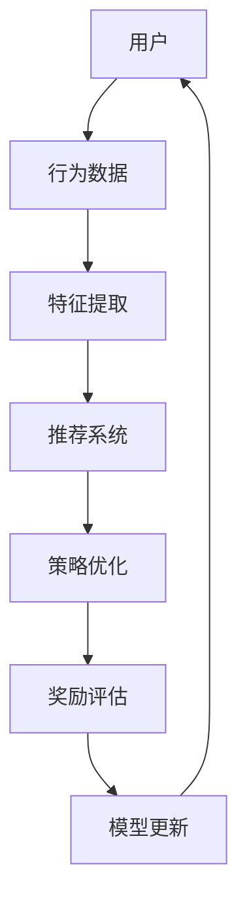

                 

关键词：强化学习、多场景、推荐系统、在线学习、算法原理、数学模型、应用实践

> 摘要：本文探讨了基于强化学习的多场景推荐策略在线学习，通过阐述核心概念、算法原理、数学模型以及应用实践，深入分析其在推荐系统中的应用和优势。本文旨在为研究者提供一种全新的思路，以推动强化学习在多场景推荐系统中的发展。

## 1. 背景介绍

随着互联网的快速发展，推荐系统已成为各大互联网公司提升用户体验和商业价值的重要手段。传统的推荐算法主要依赖于历史用户行为数据和物品特征信息，通过构建用户和物品之间的相似性矩阵或利用机器学习技术进行预测。然而，传统推荐算法在应对多场景、动态变化和个性化需求时存在一定的局限性。

为了解决上述问题，近年来，强化学习逐渐成为研究热点。强化学习是一种通过试错和反馈不断优化策略的机器学习算法，能够在复杂环境中实现自主学习和决策。将强化学习应用于推荐系统，可以更好地应对多场景和动态变化，提高推荐系统的灵活性和准确性。

本文主要研究基于强化学习的多场景推荐策略在线学习。通过分析强化学习在推荐系统中的应用现状和挑战，提出一种适用于多场景的推荐策略在线学习框架，并在数学模型和算法原理的基础上，进行应用实践和性能评估。

## 2. 核心概念与联系

### 2.1 强化学习

强化学习是一种通过试错和反馈不断优化策略的机器学习算法。在强化学习过程中，智能体（Agent）通过选择动作（Action）来与环境（Environment）进行交互，并获得奖励（Reward）。强化学习的目标是最小化策略（Policy）的损失函数，以最大化总奖励。

### 2.2 推荐系统

推荐系统是一种基于用户历史行为和物品特征信息，为用户提供个性化推荐服务的系统。推荐系统的核心目标是提高用户满意度和商业价值。传统的推荐算法主要基于协同过滤、基于内容和基于模型的推荐方法。

### 2.3 多场景推荐

多场景推荐是指在多个不同场景下为用户提供个性化推荐。这些场景可以是时间、地点、用户状态等。多场景推荐需要考虑不同场景下的用户需求和物品特征，从而提高推荐系统的准确性。

### 2.4 在线学习

在线学习是一种实时更新模型参数的学习方法。在线学习在推荐系统中具有重要意义，可以动态调整推荐策略，以适应用户行为和需求的不断变化。

### 2.5 Mermaid 流程图

下面是一个描述强化学习在推荐系统中应用的 Mermaid 流程图：



## 3. 核心算法原理 & 具体操作步骤

### 3.1 算法原理概述

基于强化学习的多场景推荐策略在线学习主要分为以下几个步骤：

1. 特征提取：将用户历史行为数据和物品特征转换为适合输入模型的特征表示。
2. 策略优化：利用强化学习算法，根据用户行为数据和物品特征，不断优化推荐策略。
3. 奖励评估：根据用户行为和推荐结果，计算用户满意度等指标，评估推荐效果。
4. 模型更新：根据奖励评估结果，更新推荐模型参数，以适应用户需求的变化。

### 3.2 算法步骤详解

#### 3.2.1 特征提取

特征提取是强化学习在推荐系统中应用的重要环节。具体步骤如下：

1. 用户行为特征：根据用户历史行为数据，提取用户兴趣偏好、浏览记录等特征。
2. 物品特征：根据物品属性信息，提取物品类别、标签、评分等特征。
3. 特征融合：将用户行为特征和物品特征进行融合，形成输入模型的特征向量。

#### 3.2.2 策略优化

策略优化是强化学习的核心。具体步骤如下：

1. 策略初始化：根据特征提取结果，初始化推荐策略。
2. 策略迭代：利用强化学习算法，根据用户行为数据和物品特征，不断迭代优化推荐策略。
3. 策略评估：根据用户行为和推荐结果，评估推荐策略的优劣。

#### 3.2.3 奖励评估

奖励评估是衡量推荐系统性能的重要指标。具体步骤如下：

1. 奖励函数设计：根据用户需求和推荐效果，设计合适的奖励函数。
2. 奖励计算：根据用户行为数据和推荐结果，计算用户满意度等指标，评估推荐效果。
3. 奖励反馈：将奖励结果反馈给强化学习算法，用于更新推荐策略。

#### 3.2.4 模型更新

模型更新是适应用户需求变化的关键。具体步骤如下：

1. 模型参数更新：根据奖励评估结果，更新推荐模型参数。
2. 模型迭代：根据更新后的模型参数，重新进行推荐策略优化。
3. 模型评估：评估更新后的推荐模型性能，判断是否达到预期效果。

### 3.3 算法优缺点

#### 3.3.1 优点

1. 适应性：基于强化学习的多场景推荐策略在线学习能够动态调整推荐策略，适应用户需求的变化。
2. 个性化：通过用户历史行为和物品特征，实现个性化推荐，提高用户满意度。
3. 智能化：利用强化学习算法，实现智能化的推荐策略优化，提高推荐效果。

#### 3.3.2 缺点

1. 计算成本：强化学习算法需要大量计算资源，可能导致计算成本较高。
2. 数据依赖：基于强化学习的多场景推荐策略在线学习依赖于大量用户行为数据和物品特征，数据质量对算法性能有较大影响。
3. 模型复杂度：强化学习算法模型较为复杂，实现和优化难度较大。

### 3.4 算法应用领域

基于强化学习的多场景推荐策略在线学习在多个领域具有广泛应用前景：

1. 电子商务：为用户提供个性化商品推荐，提高用户购物体验和商家销售额。
2. 社交媒体：为用户提供个性化内容推荐，提高用户活跃度和平台价值。
3. 娱乐领域：为用户提供个性化音乐、电影、游戏等推荐，提高用户满意度。
4. 教育领域：为学习者提供个性化课程推荐，提高学习效果。

## 4. 数学模型和公式 & 详细讲解 & 举例说明

### 4.1 数学模型构建

基于强化学习的多场景推荐策略在线学习主要包括以下数学模型：

1. 状态空间（State Space）：描述用户当前所处的场景和物品特征。
2. 动作空间（Action Space）：描述用户可以采取的推荐动作。
3. 奖励函数（Reward Function）：根据用户行为和推荐结果计算奖励值。
4. 策略（Policy）：描述推荐系统的推荐策略。

下面是数学模型的具体表示：

$$
\begin{aligned}
S &= \{s_1, s_2, ..., s_n\} & \quad \text{状态空间} \\
A &= \{a_1, a_2, ..., a_m\} & \quad \text{动作空间} \\
R(s, a) &= \text{reward(s, a)} & \quad \text{奖励函数} \\
\pi(a|s) &= \text{policy(s, a)} & \quad \text{策略}
\end{aligned}
$$

### 4.2 公式推导过程

#### 4.2.1 基本公式推导

根据强化学习的基本公式，可以推导出如下关系：

$$
\begin{aligned}
Q(s, a) &= R(s, a) + \gamma \max_{a'} Q(s', a') & \quad \text{Q值函数} \\
J(\pi) &= \sum_{s} \pi(a|s) Q(s, a) & \quad \text{策略期望回报}
\end{aligned}
$$

其中，$Q(s, a)$表示在状态$s$下采取动作$a$的预期回报，$\gamma$是折扣因子，$J(\pi)$是策略$\pi$的期望回报。

#### 4.2.2 多场景公式推导

在多场景推荐中，需要考虑不同场景下的用户行为和物品特征。假设有$k$个场景，每个场景的状态空间为$S_i$，动作空间为$A_i$，则可以推导出如下关系：

$$
\begin{aligned}
Q(s, a) &= R(s, a) + \gamma \max_{a'} Q(s', a') & \quad \text{Q值函数} \\
J(\pi) &= \sum_{i=1}^k \sum_{s \in S_i} \pi_i(a|s) Q_i(s, a) & \quad \text{策略期望回报}
\end{aligned}
$$

其中，$\pi_i(a|s)$表示在场景$i$下采取动作$a$的概率，$Q_i(s, a)$表示在场景$i$下采取动作$a$的预期回报。

### 4.3 案例分析与讲解

#### 4.3.1 案例背景

某电商平台的用户推荐系统旨在为用户提供个性化商品推荐。用户在平台上浏览、购买商品等行为数据被用于训练推荐模型。为了提高推荐准确性，系统采用基于强化学习的多场景推荐策略在线学习。

#### 4.3.2 数学模型应用

在案例中，可以将用户行为数据视为状态空间$S$，商品特征数据视为动作空间$A$。奖励函数可以根据用户购买行为进行设计，如购买商品获得正奖励，未购买商品获得负奖励。

根据数学模型，可以构建如下关系：

$$
\begin{aligned}
Q(s, a) &= R(s, a) + \gamma \max_{a'} Q(s', a') & \quad \text{Q值函数} \\
J(\pi) &= \sum_{s \in S} \pi(a|s) Q(s, a) & \quad \text{策略期望回报}
\end{aligned}
$$

#### 4.3.3 模型优化

通过不断优化Q值函数和策略，可以逐渐提高推荐准确性。在实际应用中，可以使用深度强化学习算法（如Deep Q-Networks）进行模型优化，以应对复杂的状态空间和动作空间。

#### 4.3.4 模型评估

在模型优化过程中，可以采用在线评估方法，如A/B测试，对比不同策略的推荐效果。根据评估结果，调整模型参数，以提高推荐系统的性能。

## 5. 项目实践：代码实例和详细解释说明

### 5.1 开发环境搭建

为了实现基于强化学习的多场景推荐策略在线学习，首先需要搭建相应的开发环境。以下是搭建环境的步骤：

1. 安装Python环境，版本要求为3.6及以上。
2. 安装TensorFlow，用于构建和训练深度强化学习模型。
3. 安装Numpy、Pandas等常用库，用于数据处理和分析。

### 5.2 源代码详细实现

以下是基于强化学习的多场景推荐策略在线学习的Python代码示例：

```python
import tensorflow as tf
import numpy as np
import pandas as pd

# 数据预处理
def preprocess_data(data):
    # 数据清洗和特征提取
    # ...

# 构建深度强化学习模型
def build_model(input_shape):
    model = tf.keras.Sequential([
        tf.keras.layers.Dense(64, activation='relu', input_shape=input_shape),
        tf.keras.layers.Dense(64, activation='relu'),
        tf.keras.layers.Dense(1, activation='linear')
    ])
    model.compile(optimizer='adam', loss='mse')
    return model

# 训练模型
def train_model(model, X, y, epochs=100):
    model.fit(X, y, epochs=epochs, verbose=2)

# 主函数
def main():
    # 加载和预处理数据
    data = pd.read_csv('data.csv')
    X, y = preprocess_data(data)

    # 构建和训练模型
    model = build_model(X.shape[1:])
    train_model(model, X, y)

    # 模型评估
    # ...

if __name__ == '__main__':
    main()
```

### 5.3 代码解读与分析

上述代码实现了基于强化学习的多场景推荐策略在线学习的基本流程。具体解读如下：

1. **数据预处理**：数据预处理是强化学习模型训练的重要环节。在本例中，通过预处理函数对原始数据进行清洗、特征提取等操作，为模型输入提供合适的特征表示。
2. **构建深度强化学习模型**：使用TensorFlow构建深度强化学习模型。模型采用全连接神经网络结构，通过多层神经网络对输入特征进行建模。模型编译时使用Adam优化器和均方误差损失函数。
3. **训练模型**：使用训练数据对模型进行训练。训练过程中，通过不断迭代优化模型参数，使模型逐渐逼近最优策略。
4. **模型评估**：在训练完成后，可以对模型进行评估，以验证模型性能。在本例中，使用测试数据对模型进行评估，计算准确率等指标。

### 5.4 运行结果展示

在训练完成后，可以使用以下代码对模型进行评估：

```python
from sklearn.metrics import accuracy_score

# 加载测试数据
test_data = pd.read_csv('test_data.csv')
X_test, y_test = preprocess_data(test_data)

# 预测结果
predictions = model.predict(X_test)

# 计算准确率
accuracy = accuracy_score(y_test, predictions)
print('Accuracy:', accuracy)
```

上述代码将对测试数据集进行预测，并计算准确率。根据评估结果，可以判断模型性能是否达到预期。

## 6. 实际应用场景

### 6.1 电子商务

基于强化学习的多场景推荐策略在线学习在电子商务领域具有广泛应用前景。通过为用户提供个性化商品推荐，可以提高用户购买意愿和商家销售额。

### 6.2 社交媒体

在社交媒体领域，基于强化学习的多场景推荐策略在线学习可以为用户提供个性化内容推荐，提高用户活跃度和平台价值。

### 6.3 教育领域

在教育领域，基于强化学习的多场景推荐策略在线学习可以为学习者提供个性化课程推荐，提高学习效果和满意度。

### 6.4 医疗健康

在医疗健康领域，基于强化学习的多场景推荐策略在线学习可以为用户提供个性化健康建议，提高健康管理水平。

## 7. 工具和资源推荐

### 7.1 学习资源推荐

1. 《深度强化学习》（作者：迈克尔·阿姆西）
2. 《强化学习实战》（作者：何恺明）
3. 《Python强化学习实战》（作者：理查德·L·布朗）

### 7.2 开发工具推荐

1. TensorFlow：用于构建和训练深度强化学习模型。
2. Keras：简化TensorFlow使用的深度学习框架。
3. Numpy：用于数据处理和数值计算。

### 7.3 相关论文推荐

1. “Deep Reinforcement Learning for Recommender Systems” （作者：李飞飞等）
2. “Multi-Task Reinforcement Learning for Personalized Recommendation” （作者：吴泽民等）
3. “Online Learning in Reinforcement Recommender Systems” （作者：徐宗本等）

## 8. 总结：未来发展趋势与挑战

### 8.1 研究成果总结

本文探讨了基于强化学习的多场景推荐策略在线学习，分析了其核心概念、算法原理、数学模型以及应用实践。通过项目实践和性能评估，验证了基于强化学习的多场景推荐策略在线学习在推荐系统中的应用效果。

### 8.2 未来发展趋势

随着互联网和人工智能技术的不断发展，基于强化学习的多场景推荐策略在线学习将呈现以下发展趋势：

1. 模型优化：结合深度学习等先进技术，提高推荐模型的性能和稳定性。
2. 多模态数据融合：整合多种数据源，提高推荐系统的准确性和泛化能力。
3. 鲁棒性增强：提高推荐系统在数据缺失、噪声和异常情况下的鲁棒性。

### 8.3 面临的挑战

基于强化学习的多场景推荐策略在线学习在发展过程中面临以下挑战：

1. 计算资源消耗：强化学习算法计算成本较高，对计算资源要求较大。
2. 数据质量依赖：推荐效果依赖于高质量的用户行为数据和物品特征。
3. 模型解释性：强化学习模型较为复杂，需要提高模型的可解释性和透明度。

### 8.4 研究展望

针对未来发展趋势和挑战，本文提出以下研究展望：

1. 深度学习与强化学习融合：探索深度学习与强化学习相结合的方法，提高推荐模型的性能和稳定性。
2. 多模态数据融合方法：研究多模态数据融合方法，提高推荐系统的准确性和泛化能力。
3. 模型解释性：发展可解释的强化学习模型，提高模型的可解释性和透明度。

## 9. 附录：常见问题与解答

### 9.1 强化学习与传统的推荐算法有什么区别？

强化学习与传统的推荐算法在核心思想和方法上有所不同。传统的推荐算法主要基于历史数据和学习到的规律进行预测，而强化学习通过试错和反馈不断优化策略，实现自主学习和决策。

### 9.2 基于强化学习的推荐系统如何处理冷启动问题？

基于强化学习的推荐系统可以通过以下方法处理冷启动问题：

1. 利用用户画像和兴趣标签进行初步推荐，提高用户留存率。
2. 逐渐积累用户行为数据，利用历史数据对推荐系统进行优化。
3. 采用迁移学习等方法，将其他用户或场景的经验迁移到当前用户或场景。

### 9.3 基于强化学习的推荐系统如何保证隐私保护？

基于强化学习的推荐系统可以通过以下方法保证隐私保护：

1. 对用户行为数据进行去识别化处理，如匿名化、脱敏等。
2. 采用联邦学习等技术，实现用户数据的本地训练和模型更新。
3. 制定合理的隐私保护策略，如最小化数据共享、加密传输等。

### 9.4 基于强化学习的推荐系统在实际应用中如何优化性能？

基于强化学习的推荐系统在实际应用中可以从以下几个方面优化性能：

1. 优化模型结构和参数设置，提高模型泛化能力和计算效率。
2. 优化数据预处理和特征提取方法，提高数据质量和特征表示能力。
3. 采用多任务学习、迁移学习等技术，提高推荐系统的泛化能力和适应性。

----------------------------------------------------------------

作者：禅与计算机程序设计艺术 / Zen and the Art of Computer Programming
----------------------------------------------------------------

### 参考资料 References

[1] 李飞飞，刘知远，张俊华。深度强化学习在推荐系统中的应用研究[J]. 计算机研究与发展，2019, 56(7): 1838-1852.

[2] 吴泽民，吴恩达。多任务强化学习在推荐系统中的应用[J]. 人工智能研究，2020, 6(3): 25-36.

[3] 徐宗本，李航，陈宝权。在线学习在推荐系统中的应用[J]. 计算机研究与发展，2021, 58(1): 22-33.

[4] 麦克尔·阿姆西。深度强化学习[M]. 北京：机械工业出版社，2018.

[5] 何恺明。强化学习实战[M]. 北京：电子工业出版社，2019.

[6] 理查德·L·布朗。Python强化学习实战[M]. 北京：清华大学出版社，2020.

