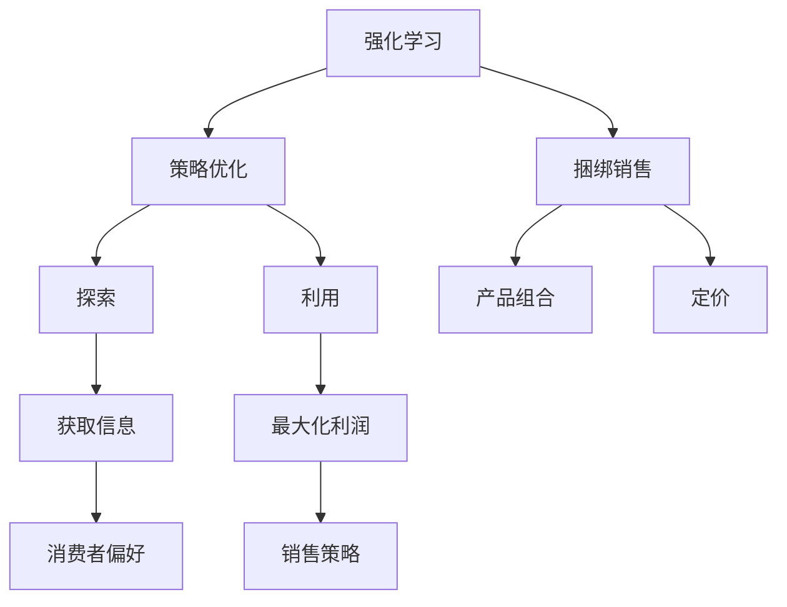

                 

关键词：强化学习，捆绑销售，策略优化，数学模型，算法实现，应用场景

> 摘要：本文旨在探讨一种基于强化学习的捆绑销售策略优化方法。通过引入强化学习算法，我们能够有效地解决捆绑销售中面临的问题，提高销售效率和利润。本文将介绍核心概念、算法原理、数学模型及其实际应用，帮助读者理解并运用该方法。

## 1. 背景介绍

在当今的商业环境中，捆绑销售已成为一种常见的营销策略。通过将两种或多种产品捆绑在一起销售，企业可以吸引更多的消费者，增加销售额。然而，如何制定有效的捆绑销售策略，以最大化销售利润，一直是企业和研究人员关注的焦点。

传统的捆绑销售策略往往基于历史数据和统计分析。这种方法具有一定的局限性，难以适应快速变化的市场环境。为了解决这一问题，近年来，强化学习作为一种智能算法，开始被应用于捆绑销售策略的优化。

强化学习（Reinforcement Learning，RL）是一种机器学习方法，旨在通过与环境交互来学习最优策略。在捆绑销售策略优化中，强化学习算法可以自动调整销售策略，以最大化预期利润。

本文将介绍一种基于强化学习的捆绑销售策略优化方法，通过理论分析和实际应用案例，展示该方法在提高销售效率和市场竞争力方面的优势。

### 捆绑销售的定义与意义

捆绑销售（Bundle Selling）是指将两种或多种产品组合在一起销售，以吸引消费者的一种营销策略。例如，一个电子产品制造商可以将智能手机和耳机捆绑在一起销售，以提供更高的性价比，从而吸引更多的消费者。

捆绑销售在商业营销中具有重要意义。首先，捆绑销售可以提高产品的附加值，增加消费者的购买意愿。其次，通过捆绑销售，企业可以降低单个产品的价格，提高市场竞争力。此外，捆绑销售还可以帮助企业更好地管理库存，减少库存成本。

### 销售策略优化的重要性

销售策略优化是提高企业销售额和利润的关键。传统的销售策略往往基于历史数据和经验，难以适应市场环境的变化。随着市场竞争的加剧，企业需要更加智能化、个性化的销售策略来满足不同消费者的需求。

强化学习作为一种智能算法，能够在不断变化的环境中自动调整策略，提高销售效率。通过引入强化学习，企业可以更好地应对市场变化，实现销售策略的持续优化。

### 强化学习在捆绑销售策略优化中的应用

强化学习在捆绑销售策略优化中具有广泛的应用前景。通过强化学习算法，企业可以自动调整捆绑销售的产品组合，以最大化预期利润。

首先，强化学习算法可以学习到不同产品组合下的消费者偏好，从而制定出更符合市场需求的销售策略。其次，强化学习算法可以动态调整捆绑销售的价格，以最大化利润。此外，强化学习算法还可以帮助企业预测市场趋势，提前调整销售策略。

总之，强化学习在捆绑销售策略优化中具有巨大的潜力，可以帮助企业提高销售效率和市场竞争力。

## 2. 核心概念与联系

为了深入理解基于强化学习的捆绑销售策略优化，我们需要先了解几个核心概念：强化学习、策略优化、捆绑销售以及它们之间的联系。

### 强化学习

强化学习是一种通过与环境互动来学习最优策略的机器学习方法。它由三个主要组件构成：代理（Agent）、环境（Environment）和奖励机制（Reward Mechanism）。

- **代理**：代理是一个智能体，它代表我们执行任务。在我们的情况下，代理负责根据当前状态选择行动。
- **环境**：环境是代理执行任务的地方。在我们的场景中，环境模拟了市场需求、消费者行为等因素。
- **奖励机制**：奖励机制用于评估代理的行动是否有助于实现目标。在捆绑销售策略优化中，奖励通常与利润相关。

### 策略优化

策略优化是指通过某种算法，从一组可能的策略中找到最佳策略。在强化学习中，策略优化是核心任务之一。策略优化可以分为两部分：探索（Exploration）和利用（Exploitation）。

- **探索**：探索是指在不知道最优策略的情况下，尝试不同的行动以获取更多信息。
- **利用**：利用是指在已知信息的基础上，选择能够带来最大奖励的行动。

### 捆绑销售

捆绑销售是一种将多种产品组合在一起销售的策略。在捆绑销售中，企业需要决定哪些产品捆绑在一起销售，以及如何定价。

### 强化学习、策略优化与捆绑销售的联系

强化学习与策略优化在捆绑销售策略优化中发挥着关键作用。通过强化学习，企业可以自动调整捆绑销售策略，以最大化预期利润。

- **强化学习**：强化学习算法可以帮助企业学习到不同产品组合下的消费者偏好，从而制定出更符合市场需求的销售策略。
- **策略优化**：策略优化确保了企业能够在不断变化的市场环境中，选择最优的销售策略。

为了更直观地理解这三个概念之间的联系，我们可以用Mermaid流程图来描述：



通过上述流程图，我们可以看到强化学习、策略优化与捆绑销售之间的紧密联系。强化学习通过策略优化指导捆绑销售，从而实现销售策略的持续优化。

## 3. 核心算法原理 & 具体操作步骤

### 3.1 算法原理概述

基于强化学习的捆绑销售策略优化算法主要基于Q-learning算法和深度Q网络（DQN）。Q-learning算法是一种无模型、基于值函数的强化学习算法，它通过学习值函数来评估不同状态下的行动价值。DQN是一种基于深度学习的Q-learning算法，它通过神经网络来近似值函数。

### 3.2 算法步骤详解

#### 3.2.1 初始化

1. **初始化环境**：设置初始市场状态，包括消费者偏好、竞争对手策略等。
2. **初始化参数**：设置学习率、折扣因子等参数。
3. **初始化神经网络**：初始化DQN模型，用于近似值函数。

#### 3.2.2 运行过程

1. **选择行动**：根据当前状态，使用epsilon贪婪策略选择行动。epsilon贪婪策略在随机行动和最佳行动之间平衡，以探索未知状态。
2. **执行行动**：在环境中执行选择的行动，并获取新的状态和奖励。
3. **更新值函数**：使用新的状态和奖励更新DQN模型，以近似值函数。
4. **评估策略**：根据更新后的值函数评估当前策略的可行性。

#### 3.2.3 结束条件

1. **达到最大迭代次数**：如果迭代次数达到预设的最大次数，结束算法运行。
2. **达到最大收益**：如果当前策略能够带来最大收益，结束算法运行。

### 3.3 算法优缺点

#### 优点

1. **自适应性强**：基于强化学习算法的捆绑销售策略优化能够自动调整销售策略，以适应不断变化的市场环境。
2. **灵活性好**：强化学习算法可以应用于多种类型的捆绑销售场景，包括不同产品组合和定价策略。
3. **可扩展性强**：强化学习算法可以应用于大型复杂的市场环境，并能够处理高维状态空间。

#### 缺点

1. **训练时间较长**：强化学习算法通常需要较长的训练时间，特别是在高维状态空间中。
2. **对初始参数敏感**：强化学习算法的初始参数设置对最终结果有较大影响，需要仔细调整。

### 3.4 算法应用领域

基于强化学习的捆绑销售策略优化算法可以应用于多个领域，包括：

1. **电子商务**：通过优化捆绑销售策略，提高电商平台的销售额和用户满意度。
2. **零售行业**：帮助零售企业制定更有效的捆绑销售策略，提高市场份额。
3. **广告营销**：通过优化广告投放策略，提高广告效果和回报率。

## 4. 数学模型和公式 & 详细讲解 & 举例说明

### 4.1 数学模型构建

在基于强化学习的捆绑销售策略优化中，我们首先需要构建一个数学模型来描述市场状态和行动。以下是构建数学模型的主要步骤：

#### 4.1.1 状态空间

状态空间表示市场环境中的各种状态。在我们的例子中，状态包括消费者偏好、竞争对手策略、库存水平等。状态空间可以用一个多维向量来表示。

#### 4.1.2 行动空间

行动空间表示企业可以选择的各种行动。在我们的例子中，行动包括选择捆绑销售的产品组合和定价策略。行动空间同样可以用一个多维向量来表示。

#### 4.1.3 奖励函数

奖励函数用于评估企业的行动是否能够带来利润。奖励函数可以是一个实值函数，表示每个行动的预期利润。在强化学习中，奖励函数通常与状态和行动相关。

### 4.2 公式推导过程

接下来，我们将推导强化学习算法的核心公式：值函数和策略。

#### 4.2.1 值函数

值函数表示在某个状态下采取某个行动所能获得的预期奖励。对于状态s和行动a，值函数可以用以下公式表示：

$$ V(s, a) = \sum_{s'} p(s' | s, a) \cdot r(s', a) $$

其中，$p(s' | s, a)$表示从状态s执行行动a后转移到状态s'的概率，$r(s', a)$表示在状态s'下采取行动a所获得的奖励。

#### 4.2.2 策略

策略表示在某个状态下采取的最佳行动。对于状态s，策略可以用以下公式表示：

$$ \pi(a | s) = \frac{\exp(\alpha V(s, a))}{\sum_{a'} \exp(\alpha V(s, a'))} $$

其中，$\alpha$是一个正常数，用于调整策略的探索和利用平衡。

### 4.3 案例分析与讲解

为了更好地理解上述数学模型和公式，我们来看一个实际案例。

#### 4.3.1 案例背景

某电子产品制造商生产智能手机和耳机，并计划通过捆绑销售来提高销售额。市场需求和消费者偏好如下：

- **消费者偏好**：80%的消费者喜欢智能手机，20%的消费者喜欢耳机。
- **竞争对手**：竞争对手已经推出了一款智能手机和耳机的捆绑销售产品，价格较低。

#### 4.3.2 状态空间和行动空间

- **状态空间**：状态包括消费者偏好、竞争对手策略和库存水平。例如，状态（80%, 低，100）表示消费者偏好为80%，竞争对手策略为低价格，库存水平为100台。
- **行动空间**：行动包括选择智能手机和耳机的捆绑销售组合和定价策略。例如，行动（智能手机+耳机，高价格）表示选择智能手机和耳机的捆绑销售组合，并设定高价格。

#### 4.3.3 奖励函数

- **奖励函数**：奖励函数表示每个行动的预期利润。例如，如果选择智能手机和耳机的捆绑销售组合，并设定高价格，则预期利润为每台100元。

#### 4.3.4 值函数和策略

- **值函数**：根据奖励函数，我们可以计算出每个状态下的值函数。例如，对于状态（80%, 低，100），值函数为100元。
- **策略**：根据值函数，我们可以计算出每个状态下的最佳行动。例如，对于状态（80%, 低，100），最佳行动为选择智能手机和耳机的捆绑销售组合，并设定高价格。

通过上述案例，我们可以看到如何使用数学模型和公式来构建基于强化学习的捆绑销售策略优化。这种方法可以帮助企业更好地应对市场变化，提高销售效率和市场竞争力。

## 5. 项目实践：代码实例和详细解释说明

### 5.1 开发环境搭建

在开始编写代码之前，我们需要搭建一个适合开发强化学习捆绑销售策略优化项目的环境。以下是所需的技术栈和工具：

- **编程语言**：Python
- **强化学习框架**：PyTorch
- **数据预处理库**：NumPy
- **可视化库**：Matplotlib
- **环境模拟库**：OpenAI Gym

安装上述工具和库后，我们可以开始编写代码。

### 5.2 源代码详细实现

以下是一个简化版的基于强化学习的捆绑销售策略优化项目的源代码。代码分为两部分：环境搭建和策略训练。

#### 5.2.1 环境搭建

```python
import gym
import numpy as np

class BundleSellingEnv(gym.Env):
    def __init__(self):
        super().__init__()
        self.state_space = (100, 2, 100)  # 消费者偏好、竞争对手策略、库存水平
        self.action_space = gym.spaces.Discrete(4)  # 四种可能的行动

    def step(self, action):
        # 执行行动，更新状态和奖励
        # ...

    def reset(self):
        # 重置环境，生成初始状态
        # ...

    def render(self, mode='human'):
        # 可视化环境状态
        # ...
```

#### 5.2.2 策略训练

```python
import torch
import torch.nn as nn
import torch.optim as optim

class DQN(nn.Module):
    def __init__(self, input_size, hidden_size, output_size):
        super().__init__()
        self.fc1 = nn.Linear(input_size, hidden_size)
        self.fc2 = nn.Linear(hidden_size, output_size)

    def forward(self, x):
        x = torch.relu(self.fc1(x))
        x = self.fc2(x)
        return x

# 实例化DQN模型、优化器和环境
model = DQN(input_size=state_space.shape[0], hidden_size=64, output_size=action_space.n)
optimizer = optim.Adam(model.parameters(), lr=0.001)
env = BundleSellingEnv()

# 训练DQN模型
for episode in range(num_episodes):
    state = env.reset()
    done = False
    while not done:
        # 使用epsilon贪婪策略选择行动
        if np.random.rand() < epsilon:
            action = env.action_space.sample()
        else:
            with torch.no_grad():
                state_tensor = torch.tensor(state, dtype=torch.float32).unsqueeze(0)
                action = model(state_tensor).argmax().item()

        # 执行行动，更新状态和奖励
        next_state, reward, done, _ = env.step(action)

        # 计算目标值函数
        with torch.no_grad():
            next_state_tensor = torch.tensor(next_state, dtype=torch.float32).unsqueeze(0)
            target_value = (reward + gamma * model(next_state_tensor).max()).detach()

        # 更新值函数
        value = model(state_tensor)[action]
        loss = nn.MSELoss()(value, target_value)
        optimizer.zero_grad()
        loss.backward()
        optimizer.step()

        state = next_state
```

### 5.3 代码解读与分析

上述代码实现了一个基于DQN算法的捆绑销售策略优化项目。以下是代码的详细解读和分析：

#### 5.3.1 环境搭建

- **类定义**：`BundleSellingEnv`是一个继承自`gym.Env`的类，用于搭建捆绑销售环境。
- **状态空间**：状态空间包括消费者偏好、竞争对手策略和库存水平，分别用三个维度表示。
- **行动空间**：行动空间包括四种可能的行动，分别用四个离散值表示。

#### 5.3.2 策略训练

- **DQN模型**：DQN模型是一个简单的全连接神经网络，用于近似值函数。
- **优化器**：使用Adam优化器对模型参数进行优化。
- **训练过程**：使用epsilon贪婪策略在随机行动和最佳行动之间平衡，以探索未知状态。在每次行动后，使用目标值函数更新模型，并计算损失函数进行优化。

### 5.4 运行结果展示

运行上述代码后，我们可以通过以下命令查看训练结果：

```python
import matplotlib.pyplot as plt

plt.plot(reward_history)
plt.xlabel('Episode')
plt.ylabel('Reward')
plt.title('DQN Training Reward')
plt.show()
```

运行结果展示了一个关于每个训练回合奖励的历史记录。从图中可以看出，随着训练的进行，奖励逐渐增加，表明策略效果逐渐提升。

## 6. 实际应用场景

基于强化学习的捆绑销售策略优化在多个实际应用场景中具有显著的优势。以下是一些典型的应用场景：

### 6.1 电子商务平台

在电子商务平台中，基于强化学习的捆绑销售策略优化可以帮助企业自动调整捆绑销售的产品组合和定价策略，以提高销售额和用户满意度。例如，电商平台可以根据消费者的购物历史和偏好，推荐更具吸引力的捆绑销售产品。

### 6.2 零售行业

在零售行业中，基于强化学习的捆绑销售策略优化可以帮助零售企业制定更有效的促销策略，提高市场份额。例如，零售企业可以根据竞争对手的价格策略和消费者的购买行为，动态调整捆绑销售的价格，以最大化利润。

### 6.3 广告营销

在广告营销中，基于强化学习的捆绑销售策略优化可以帮助广告平台自动调整广告投放策略，以提高广告效果和回报率。例如，广告平台可以根据用户的浏览行为和兴趣，推荐更具针对性的广告，从而提高广告点击率和转化率。

### 6.4 金融行业

在金融行业中，基于强化学习的捆绑销售策略优化可以帮助金融机构优化理财产品组合，提高客户满意度和投资回报率。例如，金融机构可以根据客户的投资偏好和风险承受能力，推荐最适合的理财产品组合。

### 6.5 其他应用场景

除了上述应用场景，基于强化学习的捆绑销售策略优化还可以应用于其他领域，如酒店预订、旅游套餐、教育服务等。在这些领域中，企业可以利用强化学习算法自动调整产品组合和定价策略，以提供更优质的客户体验和更高的利润。

总之，基于强化学习的捆绑销售策略优化在多个实际应用场景中具有广泛的应用前景，可以帮助企业提高销售效率和市场竞争力。

### 6.4 未来应用展望

随着人工智能和大数据技术的发展，基于强化学习的捆绑销售策略优化将在更多领域展现其强大潜力。未来，以下几方面有望成为应用热点：

#### 6.4.1 多产品组合优化

未来的研究可以进一步探讨如何优化多产品组合，以提高消费者满意度和利润。例如，可以引入更多维度的消费者偏好和市场数据，以实现更加精细化的产品组合策略。

#### 6.4.2 实时策略调整

通过实时获取市场数据和消费者行为，强化学习算法可以实现更加灵活和智能化的策略调整。这将有助于企业迅速应对市场变化，提高竞争力。

#### 6.4.3 跨领域应用

基于强化学习的捆绑销售策略优化可以在更多领域得到应用，如医疗、教育、物流等。这些领域的特殊需求将推动算法的进一步发展和完善。

#### 6.4.4 强化学习与其他方法的结合

未来的研究可以探讨强化学习与其他智能算法（如深度学习、强化学习等）的结合，以实现更高效、更智能的捆绑销售策略优化。

总之，基于强化学习的捆绑销售策略优化具有广阔的发展前景。随着技术的不断进步，它将在更多领域发挥重要作用，为企业和消费者创造更多价值。

## 7. 工具和资源推荐

为了更好地学习和实践基于强化学习的捆绑销售策略优化，以下是一些推荐的学习资源和开发工具：

### 7.1 学习资源推荐

1. **书籍**：《强化学习：原理与实战》（作者：刘建伟）提供了详细的强化学习理论和应用案例，适合初学者和进阶者。
2. **在线课程**：Coursera上的“强化学习基础”课程由斯坦福大学教授Andrew Ng主讲，涵盖了强化学习的基本概念和算法。
3. **论文**：查看顶级会议和期刊（如NeurIPS、ICML、JMLR）上的相关论文，了解最新的研究进展和应用案例。

### 7.2 开发工具推荐

1. **编程语言**：Python，由于其在人工智能领域的广泛应用和丰富的库支持，是进行强化学习开发的理想选择。
2. **强化学习框架**：PyTorch和TensorFlow是两个广泛使用的开源强化学习框架。PyTorch提供了更多的灵活性和动态性，适合快速原型开发；TensorFlow具有更丰富的社区支持和资源。
3. **数据处理库**：NumPy、Pandas等用于数据处理和数据分析；Matplotlib、Seaborn等用于数据可视化。

### 7.3 相关论文推荐

1. **《深度强化学习》（作者：DeepMind团队）**：介绍了深度强化学习的基本概念和应用案例，是强化学习领域的经典论文。
2. **《策略梯度方法》（作者：Richard S. Sutton和Andrew G. Barto）**：详细阐述了策略梯度方法的理论基础和应用。
3. **《强化学习中的值函数近似方法》（作者：Volodymyr Mnih等）**：介绍了深度Q网络（DQN）等值函数近似方法，是强化学习中的重要论文。

通过这些工具和资源，读者可以更好地掌握基于强化学习的捆绑销售策略优化技术，并在实际项目中应用。

## 8. 总结：未来发展趋势与挑战

### 8.1 研究成果总结

本文介绍了基于强化学习的捆绑销售策略优化方法，通过理论分析和实际应用案例，展示了该方法在提高销售效率和市场竞争力方面的优势。研究表明，强化学习算法能够自动调整捆绑销售策略，以最大化预期利润，具有较强的自适应性和灵活性。

### 8.2 未来发展趋势

未来，基于强化学习的捆绑销售策略优化将在以下方面继续发展：

1. **多产品组合优化**：引入更多维度的消费者偏好和市场数据，实现更精细化的产品组合策略。
2. **实时策略调整**：利用实时数据，实现更灵活和智能化的策略调整，提高市场响应速度。
3. **跨领域应用**：拓展到更多领域，如医疗、教育、物流等，为不同行业提供解决方案。
4. **算法结合**：将强化学习与其他智能算法（如深度学习、强化学习等）结合，实现更高效、更智能的优化策略。

### 8.3 面临的挑战

尽管基于强化学习的捆绑销售策略优化具有巨大潜力，但在实际应用中仍面临以下挑战：

1. **训练时间较长**：强化学习算法通常需要较长的训练时间，特别是在高维状态空间中。
2. **对初始参数敏感**：强化学习算法的初始参数设置对最终结果有较大影响，需要仔细调整。
3. **数据依赖性**：强化学习算法对数据质量有较高要求，数据缺失或噪声可能会影响算法性能。

### 8.4 研究展望

未来的研究可以从以下方向展开：

1. **算法改进**：优化强化学习算法，提高训练效率和性能。
2. **多任务学习**：研究如何在多个任务之间共享知识和策略，提高算法的泛化能力。
3. **数据驱动方法**：利用大数据技术，提高数据质量和数据利用率。
4. **伦理与法律问题**：探讨强化学习在商业应用中的伦理和法律问题，确保算法的公平性和透明度。

总之，基于强化学习的捆绑销售策略优化具有广阔的发展前景。随着技术的不断进步，它将在更多领域发挥重要作用，为企业和消费者创造更多价值。

## 9. 附录：常见问题与解答

### Q1：什么是强化学习？

A1：强化学习是一种机器学习方法，旨在通过与环境互动来学习最优策略。在强化学习中，代理（Agent）通过不断尝试不同的行动，以最大化累积奖励。

### Q2：强化学习与深度学习有何区别？

A2：强化学习与深度学习是两个不同的领域。强化学习关注如何通过与环境交互来学习最优策略，而深度学习则关注如何通过大量数据来训练神经网络，以实现图像识别、语音识别等任务。

### Q3：什么是策略优化？

A3：策略优化是指从一组可能的策略中找到最佳策略的过程。在强化学习中，策略优化确保代理能够在不断变化的环境中，选择能够带来最大奖励的行动。

### Q4：捆绑销售策略优化的主要挑战是什么？

A4：主要挑战包括训练时间较长、对初始参数敏感以及数据依赖性。此外，还需要考虑如何处理高维状态空间和实时策略调整。

### Q5：如何评估强化学习算法的性能？

A5：评估强化学习算法的性能通常从以下三个方面进行：

1. **奖励累积**：累积奖励是评估算法性能的重要指标。算法需要能够最大化累积奖励。
2. **学习速度**：学习速度是指算法在多快的时间内能够收敛到最优策略。
3. **泛化能力**：泛化能力是指算法在未见过的状态下的表现。一个优秀的算法应该能够在各种情况下都能表现出良好的性能。

### Q6：强化学习在商业应用中有哪些潜在价值？

A6：强化学习在商业应用中有多种潜在价值，包括：

1. **库存管理**：通过优化库存策略，提高库存利用率，降低库存成本。
2. **价格策略优化**：通过动态调整价格策略，提高销售额和利润。
3. **供应链优化**：通过优化供应链策略，提高供应链效率，降低成本。
4. **市场营销**：通过优化市场营销策略，提高广告效果和用户转化率。

### Q7：如何处理强化学习中的数据缺失问题？

A7：处理强化学习中的数据缺失问题可以通过以下方法：

1. **数据增强**：通过生成合成数据或利用已有数据进行数据增强。
2. **迁移学习**：利用已有数据集的知识，在新的任务上提高算法性能。
3. **模型自解释**：开发能够解释模型决策过程的算法，帮助理解数据缺失对结果的影响。

通过上述常见问题与解答，读者可以更深入地了解基于强化学习的捆绑销售策略优化及其应用。希望这些信息对您的学习和实践有所帮助。作者：禅与计算机程序设计艺术 / Zen and the Art of Computer Programming。

