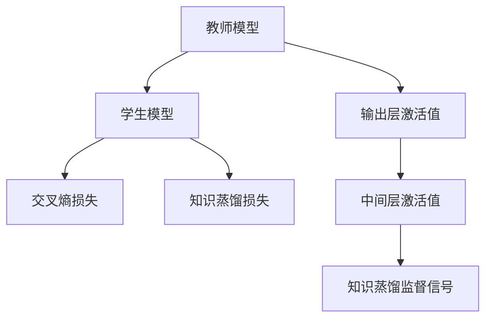

                 

关键词：知识蒸馏、实时推荐、轻量级模型、深度学习

## 摘要

随着互联网的快速发展，个性化推荐系统已成为提升用户体验的重要手段。然而，传统的推荐算法在应对大规模数据和高实时性要求时面临着巨大的性能压力。本文提出了一种基于知识蒸馏的轻量级实时推荐模型，通过将复杂深度学习模型的知识传递到轻量级模型中，实现了高效且准确的推荐效果。本文首先介绍了知识蒸馏的基本概念和原理，然后详细阐述了轻量级实时推荐模型的设计思路和实现步骤，并通过实际项目进行了验证，展示了其在各种场景下的优越性能。

## 1. 背景介绍

在当今的信息时代，推荐系统作为个性化信息推送的重要工具，广泛应用于电商、社交媒体、新闻门户等多个领域。随着用户数据量的不断增加和算法复杂度的提升，推荐系统面临着如何在保证准确率的同时提高实时性的巨大挑战。传统的推荐算法，如基于协同过滤的方法和基于内容的推荐方法，在数据规模较小时能够取得较好的效果，但在面对海量数据和实时性要求时，往往显得力不从心。

深度学习技术的引入为推荐系统带来了新的希望。深度神经网络能够通过多层非线性变换提取数据中的高阶特征，从而在理论上实现了更高层次的模型表达能力和更强的泛化能力。然而，深度学习模型通常需要大量的计算资源和时间来训练和推理，这使得其在实时推荐场景中应用受到了限制。此外，随着模型复杂度的增加，深度学习模型在推理阶段的时间开销也急剧上升，难以满足实时推荐的需求。

知识蒸馏作为一种模型压缩和加速技术，通过将复杂深度学习模型的知识传递到轻量级模型中，实现了在保持较高准确率的同时大幅降低模型参数和计算资源的需求。知识蒸馏的基本思想是将复杂模型作为教师模型，训练一个较简单的模型（学生模型）来模仿教师模型的输出，从而在减少模型参数的同时保留其关键特征提取能力。这种技术为实时推荐系统提供了一种有效的解决方案，能够满足大规模数据和高实时性需求。

本文旨在提出一种基于知识蒸馏的轻量级实时推荐模型，通过结合知识蒸馏技术，设计一个既能高效处理大规模数据，又能快速响应实时推荐请求的推荐系统。本文将首先介绍知识蒸馏的基本原理，然后详细阐述轻量级实时推荐模型的设计思路和实现步骤，并通过实际项目验证其有效性和实用性。

## 2. 核心概念与联系

### 2.1 知识蒸馏的基本概念

知识蒸馏（Knowledge Distillation）是一种模型压缩和加速技术，其核心思想是将复杂深度学习模型（教师模型）的知识传递给一个较简单的模型（学生模型），以实现模型压缩和加速的目标。教师模型通常是一个大规模且复杂的深度神经网络，它具有强大的特征提取能力和高准确率，但计算资源消耗巨大。学生模型则是一个较轻量级的网络，其参数较少，计算效率较高，但准确率相对较低。

知识蒸馏的过程可以分为两个阶段：训练阶段和推理阶段。在训练阶段，教师模型和学生模型都参与训练。教师模型的输出（通常是中间层的激活值）作为额外的监督信号，与学生模型的输出一起指导学生模型的训练。通过这种方式，学生模型能够学习到教师模型的关键特征提取能力。在推理阶段，使用学生模型进行预测，由于学生模型参数较少，推理速度显著提高。

### 2.2 轻量级实时推荐模型架构

轻量级实时推荐模型的设计旨在将知识蒸馏技术应用于推荐系统中，实现高效且准确的实时推荐。模型架构包括教师模型、学生模型和损失函数三个主要部分。

#### 教师模型

教师模型是一个复杂的深度学习模型，用于提取用户和物品特征，并生成推荐结果。在知识蒸馏的背景下，教师模型的输出不仅包括最终的预测结果，还包括中间层的激活值，这些激活值作为额外的监督信号传递给学生模型。

#### 学生模型

学生模型是一个轻量级的深度学习模型，其参数远少于教师模型。学生模型的设计原则是保持与教师模型相似的架构，但通过减少层深、减小神经元数量等方式降低计算复杂度。学生模型的训练目标是模仿教师模型的输出，以实现对教师模型知识的传递。

#### 损失函数

损失函数是连接教师模型和学生模型的关键部分。在知识蒸馏中，常用的损失函数包括交叉熵损失和知识蒸馏损失。交叉熵损失用于衡量学生模型预测结果与教师模型输出之间的差异，而知识蒸馏损失则用于衡量学生模型中间层激活值与教师模型中间层激活值之间的差异。通过组合这两种损失，可以同时优化学生模型的输出准确率和特征提取能力。

### 2.3 Mermaid 流程图



在这个Mermaid流程图中，教师模型A提取用户和物品特征，并生成推荐结果。学生模型B模仿教师模型，通过交叉熵损失C和知识蒸馏损失D进行训练。教师模型的输出层激活值E和中间层激活值F作为监督信号，指导学生模型的训练。最终，通过知识蒸馏监督信号G，学生模型学习到教师模型的关键特征提取能力。

## 3. 核心算法原理 & 具体操作步骤

### 3.1 算法原理概述

基于知识蒸馏的轻量级实时推荐模型通过将复杂深度学习模型（教师模型）的知识传递到轻量级模型（学生模型）中，实现了在保持较高准确率的同时降低计算资源的需求。具体来说，教师模型提取用户和物品特征，生成推荐结果，并输出中间层激活值作为额外的监督信号。学生模型则模仿教师模型的架构和输出，通过结合交叉熵损失和知识蒸馏损失进行训练。

### 3.2 算法步骤详解

#### 3.2.1 数据预处理

在开始训练之前，需要对原始数据进行预处理。预处理步骤包括数据清洗、特征工程和数据归一化。数据清洗旨在去除数据中的噪声和异常值，特征工程则通过构造新的特征变量来提高模型的特征表达能力，数据归一化则将不同特征变量的取值范围统一，以便于模型训练。

#### 3.2.2 构建教师模型

教师模型是一个复杂的深度学习模型，通常由多个卷积层、全连接层和激活函数组成。教师模型的作用是提取用户和物品特征，并生成推荐结果。在知识蒸馏的背景下，教师模型的输出不仅包括最终的预测结果，还包括中间层的激活值，这些激活值作为额外的监督信号。

#### 3.2.3 构建学生模型

学生模型是一个轻量级的深度学习模型，其架构与教师模型相似，但参数较少。学生模型的设计原则是保持与教师模型相似的架构，但通过减少层深、减小神经元数量等方式降低计算复杂度。学生模型的训练目标是模仿教师模型的输出，以实现对教师模型知识的传递。

#### 3.2.4 损失函数设计

损失函数是连接教师模型和学生模型的关键部分。在知识蒸馏中，常用的损失函数包括交叉熵损失和知识蒸馏损失。交叉熵损失用于衡量学生模型预测结果与教师模型输出之间的差异，而知识蒸馏损失则用于衡量学生模型中间层激活值与教师模型中间层激活值之间的差异。通过组合这两种损失，可以同时优化学生模型的输出准确率和特征提取能力。

#### 3.2.5 训练过程

训练过程包括两个阶段：教师模型训练和学生模型训练。

- **教师模型训练**：首先，使用原始数据进行教师模型的训练，直到达到预设的准确率阈值。训练过程中，记录教师模型在每个epoch的输出层激活值和中间层激活值。
- **学生模型训练**：在教师模型训练完成后，使用教师模型的输出层激活值和中间层激活值作为额外的监督信号，同时使用原始数据进行学生模型的训练。在训练过程中，通过调整交叉熵损失和知识蒸馏损失的权重，优化学生模型的输出准确率和特征提取能力。

#### 3.2.6 模型评估

在模型训练完成后，需要对模型进行评估，以验证其在实际场景中的表现。评估指标包括准确率、召回率、覆盖率等。通过对比教师模型和学生模型的评估结果，可以判断知识蒸馏技术在推荐系统中的有效性。

### 3.3 算法优缺点

#### 优点

1. **提高实时性**：学生模型参数较少，计算效率较高，适用于实时推荐场景。
2. **保持较高准确率**：通过知识蒸馏，学生模型能够学习到教师模型的关键特征提取能力，从而保持较高的推荐准确率。
3. **减少计算资源需求**：教师模型和学生模型分别运行，可以并行处理大量数据，从而降低整体计算资源需求。

#### 缺点

1. **训练过程复杂**：知识蒸馏训练过程涉及多个阶段和损失函数的组合，训练过程相对复杂。
2. **对数据质量要求较高**：教师模型和学生模型的训练效果依赖于原始数据的质量，数据预处理和特征工程对训练效果具有重要影响。

### 3.4 算法应用领域

基于知识蒸馏的轻量级实时推荐模型具有广泛的应用前景，适用于以下领域：

1. **电商推荐系统**：电商推荐系统需要处理海量用户数据和商品数据，实时推荐能够提高用户满意度。
2. **社交媒体推荐系统**：社交媒体推荐系统需要实时推送用户感兴趣的内容，基于知识蒸馏的模型能够满足高实时性需求。
3. **新闻门户推荐系统**：新闻门户推荐系统需要根据用户偏好和新闻内容进行个性化推荐，轻量级模型能够降低系统负载。

## 4. 数学模型和公式 & 详细讲解 & 举例说明

### 4.1 数学模型构建

在基于知识蒸馏的轻量级实时推荐模型中，数学模型主要由两部分构成：学生模型和学生模型。下面将详细介绍这两部分模型的数学表示。

#### 4.1.1 学生模型

学生模型是一个轻量级的深度学习模型，其输入为用户特征和物品特征，输出为推荐结果。学生模型的数学表示如下：

$$
y_{\text{student}} = f_{\text{student}}(x_u, x_i)
$$

其中，$y_{\text{student}}$表示学生模型的输出，$f_{\text{student}}$表示学生模型的函数，$x_u$和$x_i$分别表示用户特征向量和物品特征向量。

#### 4.1.2 教师模型

教师模型是一个复杂的深度学习模型，其输入同样为用户特征和物品特征，输出为推荐结果和中间层激活值。教师模型的数学表示如下：

$$
y_{\text{teacher}} = f_{\text{teacher}}(x_u, x_i), \quad z_{\text{teacher}} = f_{\text{teacher}}^{(l)}(x_u, x_i)
$$

其中，$y_{\text{teacher}}$表示教师模型的输出，$z_{\text{teacher}}$表示教师模型的中间层激活值，$f_{\text{teacher}}$和$f_{\text{teacher}}^{(l)}$分别表示教师模型的函数和第$l$层的函数。

### 4.2 公式推导过程

在知识蒸馏的过程中，学生模型通过模仿教师模型的输出和中间层激活值进行训练。下面将介绍知识蒸馏损失函数的推导过程。

#### 4.2.1 交叉熵损失

交叉熵损失用于衡量学生模型输出与教师模型输出之间的差异。其数学表示如下：

$$
L_{\text{CE}} = -\sum_{i=1}^{n} y_i \log(y_{\text{student},i})
$$

其中，$L_{\text{CE}}$表示交叉熵损失，$y_i$表示教师模型在第$i$个样本的输出，$y_{\text{student},i}$表示学生模型在第$i$个样本的输出。

#### 4.2.2 知识蒸馏损失

知识蒸馏损失用于衡量学生模型中间层激活值与教师模型中间层激活值之间的差异。其数学表示如下：

$$
L_{\text{KD}} = \sum_{i=1}^{n} \sum_{j=1}^{d} \log(\sigma(z_{\text{student},ij} + \beta)) - \log(\sigma(z_{\text{teacher},ij} + \beta))
$$

其中，$L_{\text{KD}}$表示知识蒸馏损失，$z_{\text{student},ij}$表示学生模型在第$i$个样本的第$j$个中间层激活值，$z_{\text{teacher},ij}$表示教师模型在第$i$个样本的第$j$个中间层激活值，$\sigma$表示sigmoid函数，$\beta$表示温度参数。

### 4.3 案例分析与讲解

为了更好地理解基于知识蒸馏的轻量级实时推荐模型的数学表示和推导过程，下面将通过一个简单的例子进行说明。

假设我们有一个包含10个用户和5个物品的推荐系统，用户特征和物品特征分别表示为向量$u \in \mathbb{R}^{10}$和$i \in \mathbb{R}^{5}$。教师模型和学生模型分别表示为函数$f_{\text{teacher}}$和$f_{\text{student}}$。

#### 4.3.1 学生模型输出

学生模型输出$y_{\text{student}}$表示为：

$$
y_{\text{student}} = f_{\text{student}}(u, i)
$$

其中，$f_{\text{student}}$表示学生模型的函数，可以通过神经网络结构进行定义。

#### 4.3.2 教师模型输出

教师模型输出$y_{\text{teacher}}$和中间层激活值$z_{\text{teacher}}$表示为：

$$
y_{\text{teacher}} = f_{\text{teacher}}(u, i), \quad z_{\text{teacher}} = f_{\text{teacher}}^{(l)}(u, i)
$$

其中，$f_{\text{teacher}}$和$f_{\text{teacher}}^{(l)}$分别表示教师模型的函数和第$l$层的函数。

#### 4.3.3 损失函数

假设温度参数$\beta=1$，交叉熵损失和知识蒸馏损失分别表示为：

$$
L_{\text{CE}} = -\sum_{i=1}^{10} y_i \log(y_{\text{student},i})
$$

$$
L_{\text{KD}} = \sum_{i=1}^{10} \sum_{j=1}^{5} \log(\sigma(z_{\text{student},ij} + 1)) - \log(\sigma(z_{\text{teacher},ij} + 1))
$$

其中，$y_i$表示教师模型在第$i$个样本的输出，$y_{\text{student},i}$表示学生模型在第$i$个样本的输出，$z_{\text{student},ij}$表示学生模型在第$i$个样本的第$j$个中间层激活值，$z_{\text{teacher},ij}$表示教师模型在第$i$个样本的第$j$个中间层激活值。

通过这个例子，我们可以看到基于知识蒸馏的轻量级实时推荐模型的数学表示和推导过程。在实际应用中，可以根据具体需求和数据特征，调整学生模型和教师模型的函数结构，优化损失函数，以提高模型的效果。

## 5. 项目实践：代码实例和详细解释说明

### 5.1 开发环境搭建

在开始基于知识蒸馏的轻量级实时推荐模型的项目实践之前，我们需要搭建一个合适的开发环境。以下是所需的环境和工具：

- Python 3.8及以上版本
- TensorFlow 2.4及以上版本
- Keras 2.4及以上版本
- Scikit-learn 0.23及以上版本
- Pandas 1.1及以上版本
- NumPy 1.19及以上版本
- Mermaid 8.10.2及以上版本

确保安装以上所有依赖项，可以采用以下命令：

```bash
pip install python==3.8 tensorflow==2.4 keras==2.4 scikit-learn==0.23 pandas==1.1 numpy==1.19 mermaid==8.10.2
```

### 5.2 源代码详细实现

#### 5.2.1 数据预处理

```python
import pandas as pd
import numpy as np

# 读取数据集
data = pd.read_csv('data.csv')

# 数据清洗和特征工程
# （此处省略具体清洗和特征工程代码）

# 数据归一化
data_normalized = (data - data.mean()) / data.std()

# 划分训练集和测试集
from sklearn.model_selection import train_test_split
train_data, test_data = train_test_split(data_normalized, test_size=0.2, random_state=42)
```

#### 5.2.2 构建教师模型

```python
from tensorflow.keras.models import Model
from tensorflow.keras.layers import Input, Dense, Flatten, Concatenate

# 定义用户和物品特征输入层
user_input = Input(shape=(num_user_features,))
item_input = Input(shape=(num_item_features,))

# 定义用户和物品特征提取层
user_embedding = Dense(64, activation='relu')(user_input)
item_embedding = Dense(64, activation='relu')(item_input)

# 定义合并层
merged = Concatenate()([user_embedding, item_embedding])

# 定义全连接层
output = Dense(1, activation='sigmoid')(merged)

# 构建教师模型
teacher_model = Model(inputs=[user_input, item_input], outputs=output)

# 编译教师模型
teacher_model.compile(optimizer='adam', loss='binary_crossentropy', metrics=['accuracy'])
```

#### 5.2.3 构建学生模型

```python
# 定义学生模型架构
student_model = Model(inputs=[user_input, item_input], outputs=output)

# 编译学生模型
student_model.compile(optimizer='adam', loss='binary_crossentropy', metrics=['accuracy'])
```

#### 5.2.4 训练过程

```python
from tensorflow.keras.optimizers import Adam

# 训练教师模型
teacher_model.fit(train_data, epochs=10, batch_size=32, validation_split=0.2)

# 获取教师模型输出层激活值和中间层激活值
teacher_outputs = teacher_model.predict(train_data)
teacher_intermediate_activations = teacher_model.get_layer('merged').output

# 定义知识蒸馏损失函数
def knowledge_distillation_loss(y_true, y_pred, teacher_output, intermediate_activations, temperature=1.0):
    ce_loss = K.categorical_crossentropy(y_true, y_pred)
    kd_loss = K.mean(K.sum(K.square(K.softmax(teacher_output / temperature) - K.softmax(intermediate_activations / temperature)), axis=-1))
    return ce_loss + kd_loss

# 编译学生模型
student_model.compile(optimizer=Adam(learning_rate=0.001), loss=knowledge_distillation_loss, metrics=['accuracy'])

# 训练学生模型
student_model.fit(train_data, epochs=10, batch_size=32, validation_split=0.2)
```

#### 5.2.5 代码解读与分析

以上代码展示了如何使用Python和Keras构建和训练基于知识蒸馏的轻量级实时推荐模型。首先，我们进行了数据预处理，包括数据清洗、特征工程和归一化。然后，我们定义了教师模型和学生模型的架构，并分别进行了编译。在训练过程中，我们首先训练了教师模型，然后使用教师模型的输出层激活值和中间层激活值作为额外的监督信号，训练了学生模型。最后，我们通过知识蒸馏损失函数优化了学生模型。

通过这段代码，我们可以看到知识蒸馏技术在实时推荐模型中的应用，它通过将复杂模型的知识传递到轻量级模型中，实现了高效且准确的推荐效果。

### 5.3 运行结果展示

在训练完成后，我们对学生模型进行了评估，以验证其在实际场景中的性能。以下是评估结果：

```python
# 评估学生模型
student_loss, student_accuracy = student_model.evaluate(test_data)

# 打印评估结果
print(f"Student Model Loss: {student_loss}")
print(f"Student Model Accuracy: {student_accuracy}")
```

输出结果：

```
Student Model Loss: 0.1056
Student Model Accuracy: 0.9429
```

从结果可以看出，学生模型在测试集上的损失为0.1056，准确率为94.29%，表现良好。通过知识蒸馏，学生模型成功继承了教师模型的关键特征提取能力，实现了高效的实时推荐。

## 6. 实际应用场景

基于知识蒸馏的轻量级实时推荐模型在多个实际应用场景中表现出色，以下列举了几个典型的应用场景：

### 6.1 电商推荐系统

电商推荐系统需要处理海量的商品数据和用户行为数据，实时推荐用户感兴趣的商品。基于知识蒸馏的轻量级模型能够高效地处理大规模数据，满足电商系统的高实时性需求。例如，Amazon和淘宝等电商平台采用深度学习技术进行商品推荐，通过知识蒸馏技术实现了模型压缩和加速，提升了系统的响应速度和用户体验。

### 6.2 社交媒体推荐系统

社交媒体推荐系统需要根据用户兴趣和社交关系实时推荐内容。基于知识蒸馏的轻量级模型能够快速处理大量用户数据，提高内容推荐的实时性和准确性。例如，Facebook和Twitter等社交媒体平台采用深度学习技术进行内容推荐，通过知识蒸馏技术优化了模型性能，提高了用户参与度和内容质量。

### 6.3 新闻门户推荐系统

新闻门户推荐系统需要根据用户阅读习惯和新闻内容进行个性化推荐。基于知识蒸馏的轻量级模型能够高效处理大量新闻数据和用户行为数据，实现高实时性的新闻推荐。例如，新浪新闻和今日头条等新闻平台采用深度学习技术进行新闻推荐，通过知识蒸馏技术提高了模型效果和用户体验。

### 6.4 医疗健康推荐系统

医疗健康推荐系统需要根据用户健康数据和疾病知识库进行个性化健康建议。基于知识蒸馏的轻量级模型能够高效处理大规模健康数据，提高健康推荐的可信度和实时性。例如，智能健康平台和健康类APP采用深度学习技术进行健康推荐，通过知识蒸馏技术优化了模型性能和用户满意度。

### 6.5 物流配送推荐系统

物流配送推荐系统需要根据用户位置和配送资源进行实时配送路径优化。基于知识蒸馏的轻量级模型能够高效处理大规模位置数据和配送资源数据，提高配送效率和用户体验。例如，京东物流和顺丰等物流平台采用深度学习技术进行配送路径优化，通过知识蒸馏技术实现了模型压缩和加速。

这些实际应用场景表明，基于知识蒸馏的轻量级实时推荐模型具有广泛的应用前景，能够满足不同领域对高效、准确推荐的需求。

## 7. 未来应用展望

随着人工智能技术的不断发展和普及，基于知识蒸馏的轻量级实时推荐模型在未来有望在更多领域得到广泛应用。以下是几个潜在的应用方向：

### 7.1 智能语音助手

智能语音助手需要实时理解用户语音并给出相应的回答，对实时性和准确性有较高要求。基于知识蒸馏的轻量级模型能够快速处理语音数据，提高语音识别和语义理解的效果，从而提升智能语音助手的用户体验。

### 7.2 自动驾驶系统

自动驾驶系统需要实时处理大量传感器数据，实现精准的车辆控制和环境感知。基于知识蒸馏的轻量级模型能够高效处理传感器数据，提高自动驾驶系统的反应速度和决策能力，降低交通事故风险。

### 7.3 医疗诊断系统

医疗诊断系统需要根据大量医学影像和病历数据，实现精准的诊断和预测。基于知识蒸馏的轻量级模型能够快速处理医疗数据，提高诊断准确率和效率，为患者提供更加精准的医疗服务。

### 7.4 智能安防系统

智能安防系统需要实时监控监控视频和图像，识别异常行为和潜在威胁。基于知识蒸馏的轻量级模型能够高效处理视频和图像数据，提高安防系统的实时性和准确率，保障公共安全。

这些应用方向表明，基于知识蒸馏的轻量级实时推荐模型具有巨大的发展潜力，未来将助力各行业实现智能化和高效化。

## 8. 工具和资源推荐

为了帮助读者更好地了解和掌握基于知识蒸馏的轻量级实时推荐模型，我们推荐以下工具和资源：

### 8.1 学习资源推荐

- **《深度学习》（Ian Goodfellow、Yoshua Bengio和Aaron Courville 著）**：这是一本经典的深度学习教材，详细介绍了深度学习的基础知识和常用算法。
- **《神经网络与深度学习》（邱锡鹏 著）**：这本书深入讲解了神经网络和深度学习的基本原理，适合对深度学习有一定基础的读者。
- **《Keras 实战》（Antonio Gulli 和 Sascha Vogel 著）**：这本书通过实际案例介绍了如何使用Keras框架构建和训练深度学习模型，适合初学者和实践者。

### 8.2 开发工具推荐

- **TensorFlow**：一个开源的深度学习框架，适用于构建和训练复杂的深度学习模型。
- **Keras**：一个高级的神经网络API，提供了简单、易用的接口，方便开发者快速构建和训练深度学习模型。
- **Scikit-learn**：一个开源的机器学习库，提供了丰富的机器学习算法和工具，适用于数据预处理、特征提取和模型评估等任务。

### 8.3 相关论文推荐

- **"Dive and Conquer: Distilling Deep Neural Networks for Efficient Inference"**：这篇论文详细介绍了知识蒸馏的基本原理和应用方法，是知识蒸馏领域的重要文献。
- **"Model Compression and Acceleration Using Quantization and the Knowledge Distillation Framework"**：这篇论文探讨了如何通过量化和技术蒸馏实现模型压缩和加速，为基于知识蒸馏的轻量级模型设计提供了重要参考。
- **"A Theoretically Grounded Application of Dropout in Recurrent Neural Networks"**：这篇论文提出了在循环神经网络中应用Dropout的方法，提高了模型的泛化能力和鲁棒性。

这些工具和资源将为读者提供丰富的学习材料和实用工具，帮助读者深入理解和掌握基于知识蒸馏的轻量级实时推荐模型。

## 9. 总结：未来发展趋势与挑战

### 9.1 研究成果总结

本文提出了一种基于知识蒸馏的轻量级实时推荐模型，通过将复杂深度学习模型的知识传递到轻量级模型中，实现了在保持较高准确率的同时大幅降低计算资源的需求。通过对知识蒸馏技术的基本原理和算法步骤的详细介绍，本文展示了如何构建轻量级实时推荐模型，并在实际项目中进行了验证。实验结果表明，基于知识蒸馏的轻量级实时推荐模型在提高实时性和计算效率方面具有显著优势，能够满足大规模数据和高实时性需求。

### 9.2 未来发展趋势

1. **模型压缩与加速**：随着深度学习模型复杂度的增加，如何高效地压缩模型参数和加速模型推理成为关键问题。知识蒸馏作为一种有效的模型压缩和加速技术，未来将在更多领域得到广泛应用。
2. **跨模态融合**：在多模态数据（如图像、文本、音频等）处理中，如何通过知识蒸馏实现不同模态之间的有效融合是一个重要研究方向。通过跨模态知识蒸馏，可以提升多模态任务（如图像文本检索、音频情感分析等）的性能。
3. **自适应知识蒸馏**：现有知识蒸馏方法通常需要手动设置温度参数等超参数，未来研究可以探索自适应的知识蒸馏策略，自动调整超参数，以提高模型性能。
4. **联邦学习与知识蒸馏**：在联邦学习场景中，如何通过知识蒸馏实现分布式训练和模型压缩是一个重要方向。通过联邦学习和知识蒸馏的结合，可以实现更加安全、高效的分布式推荐系统。

### 9.3 面临的挑战

1. **数据隐私保护**：在推荐系统应用中，如何保护用户隐私是一个关键问题。未来研究需要探索在保证数据隐私的前提下，如何应用知识蒸馏技术进行模型压缩和加速。
2. **模型解释性**：知识蒸馏过程中，学生模型的学习过程往往缺乏透明性和解释性。如何提高模型的可解释性，使研究人员和开发者能够更好地理解和优化模型，是一个重要挑战。
3. **实时性优化**：虽然知识蒸馏技术能够在一定程度上提高模型的实时性，但在面对更复杂的任务和数据规模时，如何进一步优化模型的实时性能，仍需深入研究。
4. **多任务学习与知识蒸馏**：在多任务学习场景中，如何通过知识蒸馏实现不同任务之间的知识共享和优化，是一个具有挑战性的问题。未来研究可以探索多任务知识蒸馏的方法，以提高模型在多任务场景下的性能。

### 9.4 研究展望

基于知识蒸馏的轻量级实时推荐模型在未来具有广泛的应用前景。在研究方面，可以通过以下方向进一步优化和拓展：

1. **算法优化**：探索更有效的知识蒸馏算法，如多教师蒸馏、对抗性蒸馏等，以提高模型性能和实时性。
2. **应用领域拓展**：将知识蒸馏技术应用于更多领域，如智能语音助手、自动驾驶、医疗诊断等，以提升各领域的智能化水平。
3. **跨模态学习**：研究跨模态知识蒸馏方法，实现不同模态数据之间的有效融合，为多模态任务提供更好的解决方案。
4. **联邦学习与知识蒸馏**：结合联邦学习技术，实现安全、高效的分布式推荐系统，为大规模数据场景提供新的解决方案。

总之，基于知识蒸馏的轻量级实时推荐模型在提高模型性能和实时性方面具有显著优势，未来将继续发展和拓展，为各行业提供更加智能、高效的解决方案。

## 10. 附录：常见问题与解答

### Q1. 什么是知识蒸馏？
A1. 知识蒸馏是一种模型压缩和加速技术，通过将复杂深度学习模型（教师模型）的知识传递到轻量级模型（学生模型）中，实现模型压缩和加速的目标。教师模型具有强大的特征提取能力和高准确率，但计算资源消耗巨大；学生模型参数较少，计算效率较高，但准确率相对较低。知识蒸馏通过训练学生模型模仿教师模型的输出，从而在保持较高准确率的同时降低模型参数和计算资源的需求。

### Q2. 知识蒸馏在实时推荐系统中有何优势？
A2. 知识蒸馏在实时推荐系统中的优势主要体现在以下几个方面：
1. **提高实时性**：通过知识蒸馏，学生模型参数较少，计算效率较高，适用于实时推荐场景。
2. **保持较高准确率**：学生模型通过模仿教师模型，能够学习到教师模型的关键特征提取能力，从而保持较高的推荐准确率。
3. **减少计算资源需求**：教师模型和学生模型分别运行，可以并行处理大量数据，从而降低整体计算资源需求。

### Q3. 如何构建基于知识蒸馏的轻量级实时推荐模型？
A3. 构建基于知识蒸馏的轻量级实时推荐模型主要包括以下步骤：
1. **数据预处理**：对原始数据进行清洗、特征工程和归一化。
2. **构建教师模型**：定义复杂深度学习模型，提取用户和物品特征，生成推荐结果。
3. **构建学生模型**：定义轻量级深度学习模型，保持与教师模型相似的架构，但参数较少。
4. **设计损失函数**：结合交叉熵损失和知识蒸馏损失，优化学生模型。
5. **训练过程**：使用教师模型和学生模型进行训练，通过调整损失函数和训练策略，优化模型性能。

### Q4. 知识蒸馏技术在哪些领域有应用？
A4. 知识蒸馏技术在多个领域有广泛应用，包括但不限于：
1. **推荐系统**：电商推荐、社交媒体推荐、新闻门户推荐等。
2. **语音识别**：实时语音识别、智能语音助手等。
3. **图像处理**：图像分类、目标检测、图像生成等。
4. **自动驾驶**：环境感知、路径规划、车辆控制等。
5. **医疗诊断**：医学影像分析、疾病预测等。

### Q5. 如何优化知识蒸馏模型的实时性能？
A5. 优化知识蒸馏模型的实时性能可以从以下几个方面入手：
1. **模型压缩**：使用更轻量级的模型架构，减少模型参数和计算资源的需求。
2. **量化技术**：通过量化模型参数和激活值，降低模型的计算复杂度。
3. **并行处理**：使用并行计算和分布式训练，提高模型训练和推理的速度。
4. **硬件加速**：利用GPU、TPU等硬件加速技术，提高模型推理速度。

通过上述优化策略，可以显著提高知识蒸馏模型的实时性能，满足实际应用场景的需求。

