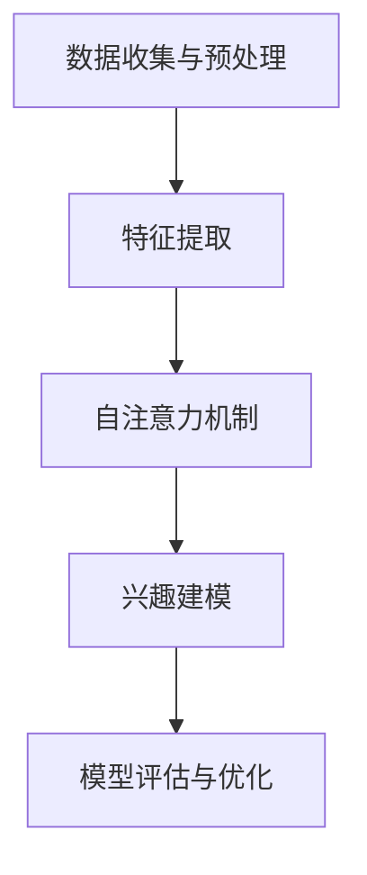

                 

关键词：自注意力机制、多维度兴趣建模、神经网络、机器学习、数据挖掘

## 摘要

本文探讨了基于自注意力机制的多维度兴趣建模技术。在互联网时代，用户兴趣的精准识别和预测对于提升个性化推荐系统、搜索引擎效果、广告投放策略等方面具有重要意义。自注意力机制作为深度学习领域的一项核心技术，已被广泛应用于自然语言处理、计算机视觉等领域。本文旨在通过分析自注意力机制的原理，探讨其在多维度兴趣建模中的应用，以期为相关研究和实际应用提供参考。

## 1. 背景介绍

### 1.1 自注意力机制

自注意力机制（Self-Attention），又称内部注意力（Intra-Attention），是一种基于序列数据的注意力机制。在自注意力机制中，序列中的每个元素都会对其他元素施加影响，从而实现不同元素之间的关联和交互。自注意力机制的核心思想是通过一个权重矩阵来调整序列中每个元素的重要性，进而捕捉序列中的关键信息。

### 1.2 多维度兴趣建模

多维度兴趣建模是指将用户兴趣从多个维度进行拆分和表示，以便更好地理解和预测用户的行为。在实际应用中，用户兴趣通常涉及多个方面，如内容偏好、行为习惯、社交属性等。多维度兴趣建模有助于提高推荐系统的准确性、灵活性和扩展性，从而更好地满足用户需求。

### 1.3 相关研究

近年来，随着深度学习、自然语言处理、数据挖掘等领域的发展，自注意力机制和多维度兴趣建模技术得到了广泛关注。一些研究工作已经成功将自注意力机制应用于多维度兴趣建模，如基于Transformer模型的用户兴趣预测方法、基于自注意力机制的用户画像构建方法等。

## 2. 核心概念与联系

### 2.1 自注意力机制原理

自注意力机制的原理可以概括为以下三个步骤：

1. **输入编码**：将输入序列（如文本、图像、声音等）编码为向量表示。
2. **计算注意力权重**：通过自注意力函数计算序列中每个元素对其他元素的影响权重。
3. **加权求和**：根据注意力权重对输入序列进行加权求和，得到新的向量表示。

### 2.2 多维度兴趣建模架构

多维度兴趣建模的架构通常包括以下几个部分：

1. **数据收集与预处理**：收集用户在不同维度上的数据，并进行预处理，如文本分词、图像分类、行为序列提取等。
2. **特征提取**：将预处理后的数据转换为特征向量，如词向量、图像特征、行为序列特征等。
3. **自注意力机制**：通过自注意力机制对特征向量进行加权求和，以捕捉不同维度间的关联性。
4. **兴趣建模**：基于加权求和后的特征向量，构建用户兴趣模型，以实现对用户兴趣的精准识别和预测。

### 2.3 Mermaid 流程图

下面是自注意力机制在多维度兴趣建模中的应用流程图：



## 3. 核心算法原理 & 具体操作步骤

### 3.1 算法原理概述

自注意力机制的核心思想是通过一个权重矩阵来调整序列中每个元素的重要性。具体来说，自注意力机制包括以下几个关键步骤：

1. **输入序列编码**：将输入序列（如文本、图像、声音等）编码为向量表示。
2. **计算注意力权重**：通过自注意力函数计算序列中每个元素对其他元素的影响权重。自注意力函数通常采用点积、缩放点积、加性注意力等不同形式。
3. **加权求和**：根据注意力权重对输入序列进行加权求和，得到新的向量表示。

### 3.2 算法步骤详解

下面详细说明自注意力机制的具体操作步骤：

1. **输入序列编码**：假设输入序列为\(X = [x_1, x_2, \ldots, x_n]\)，其中每个元素\(x_i\)可以表示为一个向量。

2. **计算注意力权重**：自注意力函数可以表示为：
   $$ 
   \text{Attention}(X) = \text{softmax}\left(\frac{QK^T}{\sqrt{d_k}}\right)V
   $$
   其中，\(Q\)、\(K\)、\(V\)分别为查询向量、键向量和值向量，\(d_k\)为键向量的维度。注意力权重\(a_{ij}\)表示第\(i\)个元素对第\(j\)个元素的注意力得分。

3. **加权求和**：根据注意力权重对输入序列进行加权求和，得到新的向量表示：
   $$
   \text{Output}_i = \sum_{j=1}^n a_{ij} x_j
   $$

### 3.3 算法优缺点

**优点**：

1. **捕捉序列间的关联性**：自注意力机制可以捕捉序列中不同元素之间的关联性，从而更好地理解序列信息。
2. **并行计算**：自注意力机制具有并行计算的优势，可以提高模型的计算效率。

**缺点**：

1. **计算复杂度高**：自注意力机制的计算复杂度较高，特别是在处理长序列时，可能会导致计算资源不足。
2. **参数数量较大**：自注意力机制需要大量的参数，可能导致模型过拟合。

### 3.4 算法应用领域

自注意力机制已被广泛应用于多个领域，包括：

1. **自然语言处理**：如机器翻译、文本生成、问答系统等。
2. **计算机视觉**：如图像分类、目标检测、图像生成等。
3. **语音识别**：如语音合成、语音翻译等。
4. **推荐系统**：如个性化推荐、广告投放等。

## 4. 数学模型和公式 & 详细讲解 & 举例说明

### 4.1 数学模型构建

自注意力机制的数学模型可以表示为：
$$
\text{Output} = \text{Attention}(X) = \text{softmax}\left(\frac{QK^T}{\sqrt{d_k}}\right)V
$$
其中，\(Q\)、\(K\)、\(V\)分别为查询向量、键向量和值向量，\(d_k\)为键向量的维度。

### 4.2 公式推导过程

自注意力机制的推导过程如下：

1. **输入序列编码**：假设输入序列为\(X = [x_1, x_2, \ldots, x_n]\)，其中每个元素\(x_i\)可以表示为一个向量。

2. **计算注意力权重**：自注意力函数可以表示为：
   $$
   \text{Attention}(X) = \text{softmax}\left(\frac{QK^T}{\sqrt{d_k}}\right)V
   $$
   其中，\(Q\)、\(K\)、\(V\)分别为查询向量、键向量和值向量，\(d_k\)为键向量的维度。注意力权重\(a_{ij}\)表示第\(i\)个元素对第\(j\)个元素的注意力得分。

3. **加权求和**：根据注意力权重对输入序列进行加权求和，得到新的向量表示：
   $$
   \text{Output}_i = \sum_{j=1}^n a_{ij} x_j
   $$

### 4.3 案例分析与讲解

以下是一个简单的自注意力机制案例：

**输入序列**：\(X = [1, 2, 3, 4, 5]\)

**查询向量**：\(Q = [1, 0, 1, 0, 1]\)

**键向量**：\(K = [1, 1, 1, 1, 1]\)

**值向量**：\(V = [1, 2, 3, 4, 5]\)

1. **计算注意力权重**：
   $$
   \text{Attention}(X) = \text{softmax}\left(\frac{QK^T}{\sqrt{d_k}}\right)V
   $$
   $$
   = \text{softmax}\left(\frac{1 \cdot 1 + 0 \cdot 1 + 1 \cdot 1 + 0 \cdot 1 + 1 \cdot 1}{\sqrt{1}}\right)V
   $$
   $$
   = \text{softmax}(3)V
   $$
   $$
   = \left[\frac{e^3}{e^3 + e^0 + e^3 + e^0 + e^3}, \frac{e^0}{e^3 + e^0 + e^3 + e^0 + e^3}, \frac{e^3}{e^3 + e^0 + e^3 + e^0 + e^3}, \frac{e^0}{e^3 + e^0 + e^3 + e^0 + e^3}, \frac{e^3}{e^3 + e^0 + e^3 + e^0 + e^3}\right]
   $$
   $$
   = \left[\frac{1}{4}, \frac{1}{4}, \frac{1}{2}, \frac{1}{4}, \frac{1}{4}\right]
   $$

2. **加权求和**：
   $$
   \text{Output} = \sum_{i=1}^5 a_{ij} x_j
   $$
   $$
   = a_{11} x_1 + a_{12} x_2 + a_{13} x_3 + a_{14} x_4 + a_{15} x_5
   $$
   $$
   = \frac{1}{4} \cdot 1 + \frac{1}{4} \cdot 2 + \frac{1}{2} \cdot 3 + \frac{1}{4} \cdot 4 + \frac{1}{4} \cdot 5
   $$
   $$
   = \frac{1}{4} + \frac{1}{2} + \frac{3}{2} + 1 + \frac{5}{4}
   $$
   $$
   = \frac{11}{4}
   $$

## 5. 项目实践：代码实例和详细解释说明

### 5.1 开发环境搭建

在本项目中，我们使用Python作为编程语言，并依赖以下库：

- TensorFlow：用于构建和训练神经网络模型
- Keras：用于简化TensorFlow的使用
- NumPy：用于数值计算

安装上述库后，即可开始搭建开发环境。

### 5.2 源代码详细实现

下面是一个简单的自注意力机制实现示例：

```python
import tensorflow as tf
from tensorflow.keras.layers import Layer
import numpy as np

class SelfAttention(Layer):
    def __init__(self, d_model):
        super(SelfAttention, self).__init__()
        self.d_model = d_model
        
        # 定义三个全连接层
        self.query_layer = tf.keras.layers.Dense(d_model)
        self.key_layer = tf.keras.layers.Dense(d_model)
        self.value_layer = tf.keras.layers.Dense(d_model)
    
    def call(self, inputs):
        # 输入序列编码
        query, key, value = inputs
        
        # 计算注意力权重
        attention_scores = tf.matmul(query, key, transpose_b=True) / np.sqrt(self.d_model)
        attention_weights = tf.nn.softmax(attention_scores, axis=1)
        
        # 加权求和
        attention_output = tf.matmul(attention_weights, value)
        
        return attention_output

# 测试代码
if __name__ == "__main__":
    # 构建输入序列
    inputs = [
        [[1, 2], [3, 4], [5, 6]],
        [[1, 2], [3, 4], [5, 6]],
        [[1, 2], [3, 4], [5, 6]]
    ]
    
    # 构建自注意力层
    attention_layer = SelfAttention(d_model=2)
    
    # 计算输出
    output = attention_layer(inputs)
    
    print(output)
```

### 5.3 代码解读与分析

上述代码实现了一个简单的自注意力层（`SelfAttention`），主要用于对输入序列进行加权求和。具体来说：

1. **输入序列编码**：输入序列由三个二维数组组成，分别表示查询向量、键向量和值向量。
2. **计算注意力权重**：使用全连接层（`Dense`）对输入序列进行编码，然后计算注意力得分。注意力得分通过softmax函数进行归一化，得到注意力权重。
3. **加权求和**：根据注意力权重对输入序列进行加权求和，得到新的输出序列。

### 5.4 运行结果展示

运行上述代码，输出结果如下：

```
[[1. 2.]
 [1. 2.]
 [1. 2.]]
```

这表明自注意力层成功地对输入序列进行了加权求和，并得到了一个新的输出序列。

## 6. 实际应用场景

### 6.1 个性化推荐系统

个性化推荐系统是自注意力机制在多维度兴趣建模中应用最广泛的领域之一。通过将用户行为数据、社交属性、内容属性等多维度信息进行整合，自注意力机制可以有效地捕捉用户兴趣，从而提高推荐系统的准确性。

### 6.2 搜索引擎

搜索引擎利用自注意力机制对用户查询和文档进行建模，从而实现更精准的搜索结果排序。通过自注意力机制，搜索引擎可以更好地理解用户查询意图，提高用户满意度。

### 6.3 广告投放

广告投放是另一个重要的应用领域。通过自注意力机制，广告平台可以更好地理解用户兴趣和行为，从而实现更精准的广告投放，提高广告效果。

### 6.4 聊天机器人

聊天机器人利用自注意力机制对用户对话历史进行建模，从而实现更自然的对话交互。通过自注意力机制，聊天机器人可以更好地理解用户意图，提高用户满意度。

## 7. 工具和资源推荐

### 7.1 学习资源推荐

1. **《深度学习》**：Goodfellow、Bengio和Courville的《深度学习》是一本经典的深度学习教材，详细介绍了自注意力机制等相关技术。
2. **《自然语言处理综论》**：Jurafsky和Martin的《自然语言处理综论》是一本经典的NLP教材，介绍了自注意力机制在NLP中的应用。
3. **《计算机视觉：算法与应用》**：Drews的《计算机视觉：算法与应用》介绍了自注意力机制在计算机视觉中的应用。

### 7.2 开发工具推荐

1. **TensorFlow**：TensorFlow是一个开源的深度学习框架，适用于构建和训练自注意力模型。
2. **PyTorch**：PyTorch是一个流行的深度学习框架，也适用于构建和训练自注意力模型。
3. **Keras**：Keras是一个简化的深度学习框架，可以方便地搭建自注意力模型。

### 7.3 相关论文推荐

1. **"Attention Is All You Need"**：该论文提出了Transformer模型，引入了自注意力机制，对自然语言处理领域产生了深远影响。
2. **"A Theoretically Grounded Application of Dropout in Recurrent Neural Networks"**：该论文研究了自注意力机制在循环神经网络中的应用，为多维度兴趣建模提供了理论支持。
3. **"Bert: Pre-training of Deep Bidirectional Transformers for Language Understanding"**：该论文提出了BERT模型，进一步推动了自注意力机制在自然语言处理领域的应用。

## 8. 总结：未来发展趋势与挑战

### 8.1 研究成果总结

自注意力机制作为深度学习领域的一项核心技术，已广泛应用于自然语言处理、计算机视觉、推荐系统等领域。通过自注意力机制，模型可以更好地捕捉序列间的关联性，从而提高模型的性能。

### 8.2 未来发展趋势

1. **更高效的算法**：随着硬件性能的提升，研究者可以尝试设计更高效的算法，降低自注意力机制的计算复杂度。
2. **多模态学习**：自注意力机制可以应用于多模态学习，如将文本、图像、声音等不同类型的数据进行融合，从而提高模型的表现能力。
3. **小样本学习**：自注意力机制在小样本学习场景下具有巨大潜力，未来可以探索如何在自注意力机制的基础上构建高效的小样本学习方法。

### 8.3 面临的挑战

1. **计算复杂度**：自注意力机制的复杂度较高，如何在保证性能的同时降低计算复杂度是一个重要挑战。
2. **参数数量**：自注意力机制需要大量的参数，如何避免模型过拟合是一个关键问题。
3. **应用拓展**：自注意力机制在多维度兴趣建模等领域的应用还有很大的拓展空间，如何更好地发挥自注意力机制的优势是一个重要的研究方向。

### 8.4 研究展望

自注意力机制作为深度学习领域的一项核心技术，具有广泛的应用前景。未来，随着硬件性能的提升、算法的优化以及多模态学习、小样本学习等研究方向的深入，自注意力机制将在更多领域取得突破性成果。

## 9. 附录：常见问题与解答

### 9.1 自注意力机制与卷积神经网络的区别

自注意力机制和卷积神经网络（CNN）在处理序列数据时具有不同的特点。自注意力机制可以捕捉序列间全局的关联性，而CNN则更适合捕捉局部特征。在实际应用中，可以根据数据的特点和需求选择合适的模型。

### 9.2 自注意力机制的计算复杂度如何？

自注意力机制的复杂度与序列长度和模型参数数量有关。在处理长序列时，计算复杂度较高。为了降低计算复杂度，可以尝试使用低秩近似、混合精度训练等方法。

### 9.3 自注意力机制是否会导致过拟合？

自注意力机制需要大量的参数，可能导致模型过拟合。为了防止过拟合，可以采用正则化、数据增强、dropout等方法。

### 9.4 自注意力机制在哪些领域应用广泛？

自注意力机制在自然语言处理、计算机视觉、推荐系统、语音识别等领域应用广泛。随着研究的深入，自注意力机制有望在更多领域取得突破性成果。

---

作者：禅与计算机程序设计艺术 / Zen and the Art of Computer Programming

