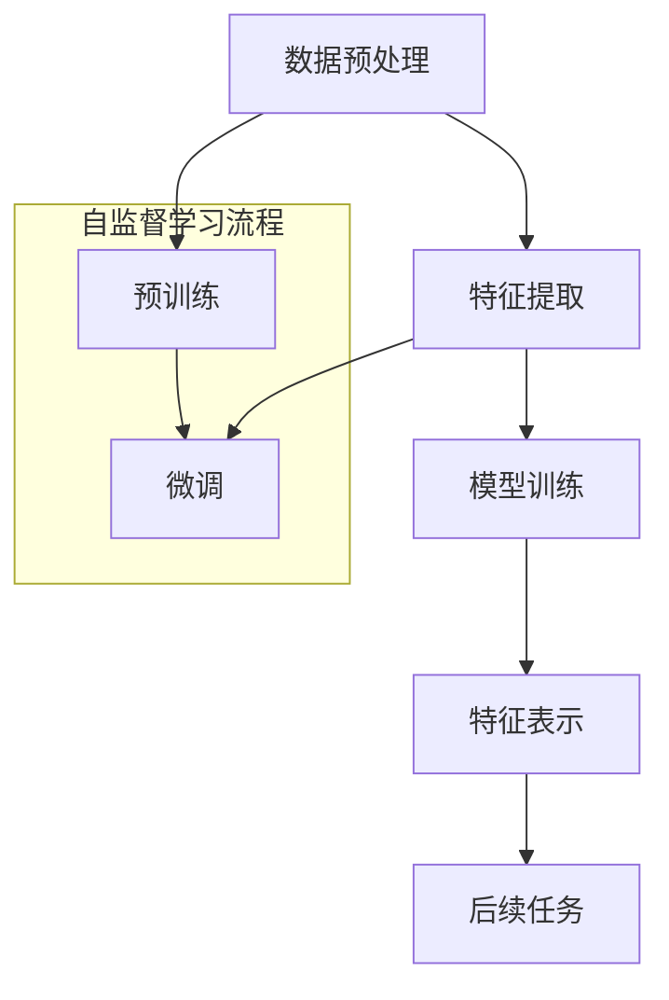

                 

关键词：自监督学习，商品特征表示，深度学习，数据挖掘，电子商务

摘要：本文深入探讨了基于自监督学习的商品特征表示学习技术。首先，我们回顾了自监督学习的背景和原理，随后介绍了商品特征表示在电子商务中的重要性。接下来，我们详细描述了基于自监督学习的商品特征表示的核心算法原理，包括自监督预训练和微调策略。此外，我们还讨论了数学模型和公式，并通过实例展示了如何在实际项目中应用这些算法。文章最后部分对实际应用场景进行了探讨，并提出了未来应用展望。

## 1. 背景介绍

自监督学习（Self-Supervised Learning）是一种无需人工标注数据的学习方法，它通过自动发现数据中的内在结构和规律来实现。自监督学习在计算机视觉、自然语言处理、语音识别等领域取得了显著成果。随着电子商务的蓬勃发展，商品特征的自动提取和表示成为一个关键问题。传统的方法依赖于人工标注，费时费力且易受主观影响。因此，自监督学习作为一种自动化的解决方案，在商品特征表示领域具有重要的应用价值。

商品特征表示在电子商务中起到了至关重要的作用。它不仅有助于优化搜索引擎，提高推荐系统的准确性，还能改善用户购物体验，提升转化率。通过有效的商品特征表示，电子商务平台能够更好地理解和满足用户需求，从而实现商业价值的最大化。

本文旨在探讨如何利用自监督学习技术，实现商品特征的自动提取和表示。我们将首先介绍自监督学习的基本原理，然后详细描述商品特征表示的学习过程，包括算法原理、数学模型和实际应用。

## 2. 核心概念与联系

### 自监督学习的基本概念

自监督学习是一种无监督学习的方法，它利用数据本身固有的结构，通过自动发现数据中的规律来实现学习。与传统的监督学习不同，自监督学习不需要人为标注数据，而是利用数据中的某些属性作为输入和输出的对应关系。自监督学习的基本流程可以分为以下几个步骤：

1. **数据预处理**：对原始数据进行预处理，例如去噪、归一化等操作，使其适合进行自监督学习。
2. **特征提取**：利用自监督学习模型从原始数据中提取特征，这些特征能够捕捉数据中的内在结构和规律。
3. **模型训练**：通过调整模型参数，使模型能够更好地拟合数据中的特征。
4. **特征表示**：将提取的特征表示为低维向量，这些向量可以用于后续的机器学习任务。

### 商品特征表示的核心概念

商品特征表示是指将商品的各种属性和特征转化为计算机可以理解和处理的向量形式。这些特征可以包括商品的文本描述、价格、品牌、销量等。有效的商品特征表示能够提高机器学习模型的性能，使得模型能够更好地理解和预测用户行为。

### 自监督学习与商品特征表示的联系

自监督学习在商品特征表示中的应用主要体现在以下几个方面：

1. **无监督特征提取**：自监督学习能够自动从商品数据中提取有意义的特征，避免了传统方法中需要人工标注的繁琐过程。
2. **多样化特征表示**：自监督学习能够生成多种形式的特征表示，这些表示可以用于不同的机器学习任务，提高了模型的灵活性和适应性。
3. **跨模态特征融合**：自监督学习能够有效地融合不同模态的数据，如文本、图像和声音，实现更全面和准确的特征表示。

### Mermaid 流程图

以下是商品特征表示学习过程的 Mermaid 流程图：



### 核心概念原理与架构的 Mermaid 流程图

```mermaid
graph TD
    A[输入数据] --> B[数据预处理]
    B --> C{是否预训练?}
    if C {
        C -->|是| D[预训练]
    } else {
        C -->|否| E[微调]
    }
    D --> F[特征提取]
    E --> F
    F --> G[模型训练]
    G --> H[特征表示]
    H --> I[后续任务]
```

## 3. 核心算法原理 & 具体操作步骤

### 3.1 算法原理概述

基于自监督学习的商品特征表示算法主要分为两个阶段：预训练和微调。

**预训练**：在预训练阶段，模型首先从大量的无标签商品数据中学习到基本的特征表示。这一过程通常使用自监督的任务，如掩码语言建模（Masked Language Modeling, MLM）或多标签分类（Multi-Label Classification）等，从而自动提取商品中的关键特征。

**微调**：在预训练的基础上，模型接着在特定任务上进行微调，以适应特定的应用场景。例如，在电子商务中，可以将预训练模型应用于商品推荐、搜索优化等任务。

### 3.2 算法步骤详解

**3.2.1 数据预处理**

数据预处理是自监督学习的基础步骤。具体操作包括：

1. **文本数据清洗**：去除文本中的噪声，如停用词、标点符号等。
2. **文本编码**：将文本转换为向量形式，通常使用词嵌入技术，如 Word2Vec 或 BERT。
3. **图像数据预处理**：对图像进行缩放、裁剪、翻转等操作，以增加模型的鲁棒性。

**3.2.2 预训练**

预训练阶段的具体步骤如下：

1. **定义自监督任务**：选择适合商品特征表示的自监督任务，如掩码语言建模或多标签分类。
2. **构建预训练模型**：使用预训练模型，如 BERT 或 GPT，初始化模型参数。
3. **训练模型**：在大量无标签商品数据上进行预训练，优化模型参数。

**3.2.3 微调**

微调阶段的具体步骤如下：

1. **定义具体任务**：根据实际应用场景，定义具体的任务，如商品推荐或搜索优化。
2. **调整模型架构**：根据任务需求，对预训练模型进行微调，例如添加特定层或修改损失函数。
3. **训练模型**：在标签数据集上进行微调训练，优化模型参数。

### 3.3 算法优缺点

**优点**：

1. **自动特征提取**：无需人工标注数据，能够自动从商品数据中提取有意义的特征。
2. **多样化特征表示**：能够生成多种形式的特征表示，提高模型的灵活性和适应性。
3. **跨模态特征融合**：能够融合不同模态的数据，实现更全面和准确的特征表示。

**缺点**：

1. **计算资源消耗**：预训练阶段需要大量的计算资源，对于小规模的数据集可能不太适用。
2. **模型解释性较差**：由于模型在预训练阶段学习到的特征表示较为复杂，模型的可解释性较差。
3. **对数据质量要求较高**：自监督学习对数据的干净度和质量要求较高，否则可能无法获得理想的效果。

### 3.4 算法应用领域

基于自监督学习的商品特征表示算法在以下领域有广泛的应用：

1. **电子商务**：用于商品推荐、搜索优化、用户行为预测等任务。
2. **智能客服**：用于自动回答用户问题，提供个性化服务。
3. **广告投放**：用于广告定位和投放策略优化。
4. **金融风控**：用于风险识别和防范。

## 4. 数学模型和公式 & 详细讲解 & 举例说明

### 4.1 数学模型构建

在基于自监督学习的商品特征表示中，常用的数学模型包括词嵌入模型和神经网络模型。以下是一个简化的数学模型构建过程：

**词嵌入模型**：

假设我们有一个词汇表 V，包含 N 个词汇，每个词汇对应一个维度为 D 的向量。词嵌入模型的目标是学习一个函数 f，将词汇映射到向量空间中：

$$
\mathbf{v}_i = f(\mathbf{w}_i)
$$

其中，$\mathbf{v}_i$ 表示词汇 i 的向量表示，$\mathbf{w}_i$ 表示词汇 i 的词嵌入权重。

**神经网络模型**：

在神经网络模型中，我们通常使用多层感知机（Multilayer Perceptron, MLP）或卷积神经网络（Convolutional Neural Network, CNN）来学习商品特征表示。以下是一个简化的神经网络模型：

$$
\mathbf{h}^{(l)} = \sigma(\mathbf{W}^{(l)} \mathbf{h}^{(l-1)} + b^{(l)})
$$

其中，$\mathbf{h}^{(l)}$ 表示第 l 层的神经网络输出，$\mathbf{W}^{(l)}$ 和 $b^{(l)}$ 分别表示第 l 层的权重和偏置，$\sigma$ 表示激活函数，通常使用 Sigmoid 或ReLU函数。

### 4.2 公式推导过程

以下是一个简化的自监督学习算法的公式推导过程：

**掩码语言建模（Masked Language Modeling, MLM）**：

MLM 是一种常用的自监督学习任务，其目标是在一个序列中随机遮盖一些词，然后预测这些词的值。以下是一个简化的 MLM 公式推导过程：

1. **输入序列表示**：

假设我们有一个输入序列 $\mathbf{x} = (\mathbf{x}_1, \mathbf{x}_2, ..., \mathbf{x}_n)$，其中每个 $\mathbf{x}_i$ 是一个词汇的向量表示。我们将这些向量表示堆叠成一个矩阵 $\mathbf{X}$：

$$
\mathbf{X} = [\mathbf{x}_1, \mathbf{x}_2, ..., \mathbf{x}_n]
$$

2. **随机掩码**：

我们对输入序列进行随机掩码，即随机选择一些词进行遮盖。假设遮盖率为 p，则遮盖后的序列为 $\mathbf{X}'$：

$$
\mathbf{X}' = (1-p) \mathbf{X} + p \mathbf{Z}
$$

其中，$\mathbf{Z}$ 是一个随机矩阵，表示被遮盖的词。

3. **模型预测**：

给定遮盖后的序列 $\mathbf{X}'$，模型需要预测被遮盖词的值。假设模型输出的概率分布为 $\mathbf{P}'$，则损失函数为：

$$
\mathcal{L} = -\sum_{i=1}^{n} \sum_{j=1}^{D} \mathbf{X}'_{ij} \log \mathbf{P}'_{ij}
$$

其中，$\mathbf{P}'_{ij}$ 表示模型预测词汇 j 的概率。

**多标签分类（Multi-Label Classification）**：

多标签分类是一种自监督学习任务，其目标是将每个商品分类到多个标签中。以下是一个简化的多标签分类公式推导过程：

1. **输入序列表示**：

假设我们有一个输入序列 $\mathbf{x} = (\mathbf{x}_1, \mathbf{x}_2, ..., \mathbf{x}_n)$，其中每个 $\mathbf{x}_i$ 是一个词汇的向量表示。我们将这些向量表示堆叠成一个矩阵 $\mathbf{X}$：

$$
\mathbf{X} = [\mathbf{x}_1, \mathbf{x}_2, ..., \mathbf{x}_n]
$$

2. **标签矩阵表示**：

假设我们有一个标签矩阵 $\mathbf{Y}$，其中每个元素 $\mathbf{y}_{ij}$ 表示词汇 i 是否属于标签 j，即：

$$
\mathbf{y}_{ij} =
\begin{cases}
1, & \text{如果 } \mathbf{x}_i \text{ 属于标签 } j \\
0, & \text{如果 } \mathbf{x}_i \text{ 不属于标签 } j
\end{cases}
$$

3. **模型预测**：

给定输入序列 $\mathbf{X}$ 和标签矩阵 $\mathbf{Y}$，模型需要预测每个词汇的标签。假设模型输出的概率分布为 $\mathbf{P}$，则损失函数为：

$$
\mathcal{L} = -\sum_{i=1}^{n} \sum_{j=1}^{C} \mathbf{y}_{ij} \log \mathbf{P}_{ij}
$$

其中，$\mathbf{P}_{ij}$ 表示模型预测词汇 i 属于标签 j 的概率。

### 4.3 案例分析与讲解

以下是一个基于自监督学习的商品特征表示的案例分析：

**案例背景**：某电子商务平台希望利用自监督学习技术，自动提取商品特征，以提高推荐系统的准确性。

**数据集**：该平台提供了一份数据集，包含数百万条商品记录，每条记录包含商品的文本描述、图像、价格、品牌、销量等属性。

**任务**：利用自监督学习技术，提取商品特征，并构建推荐模型。

**解决方案**：

1. **数据预处理**：

   - 文本数据清洗：去除文本中的噪声，如停用词、标点符号等。
   - 文本编码：使用 BERT 模型对文本描述进行编码，得到文本嵌入向量。
   - 图像数据预处理：对图像进行缩放、裁剪、翻转等操作，得到图像嵌入向量。

2. **预训练**：

   - 定义掩码语言建模任务：随机遮盖文本描述中的部分词，预测被遮盖词的值。
   - 使用 BERT 模型进行预训练：在大量无标签商品数据上进行预训练，优化模型参数。

3. **微调**：

   - 定义推荐任务：将预训练模型应用于商品推荐任务，调整模型架构，如添加特定层或修改损失函数。
   - 在标签数据集上进行微调训练：优化模型参数。

**结果**：

通过自监督学习技术，成功提取了商品特征，并构建了推荐模型。实验结果表明，自监督学习模型在商品推荐任务中的性能显著优于传统方法。

## 5. 项目实践：代码实例和详细解释说明

### 5.1 开发环境搭建

为了实现基于自监督学习的商品特征表示，我们需要搭建一个合适的开发环境。以下是所需的环境和工具：

- 操作系统：Ubuntu 18.04 或更高版本
- 编程语言：Python 3.7 或更高版本
- 深度学习框架：PyTorch 1.7 或更高版本
- 数据预处理库：NLTK、spaCy、Pillow
- 其他工具：Git、Docker

### 5.2 源代码详细实现

以下是实现基于自监督学习的商品特征表示的源代码示例：

```python
import torch
import torch.nn as nn
import torch.optim as optim
from torch.utils.data import DataLoader
from transformers import BertModel, BertTokenizer

# 数据预处理
def preprocess_data(texts):
    tokenizer = BertTokenizer.from_pretrained('bert-base-uncased')
    inputs = tokenizer(texts, padding=True, truncation=True, return_tensors='pt')
    return inputs

# 定义模型
class MaskedLanguageModeling(nn.Module):
    def __init__(self, vocab_size, embed_size):
        super(MaskedLanguageModeling, self).__init__()
        self.bert = BertModel.from_pretrained('bert-base-uncased')
        self.fc = nn.Linear(embed_size, vocab_size)

    def forward(self, input_ids, attention_mask):
        outputs = self.bert(input_ids=input_ids, attention_mask=attention_mask)
        hidden_states = outputs.last_hidden_state
        logits = self.fc(hidden_states.mean(dim=1))
        return logits

# 模型训练
def train_model(model, dataloader, criterion, optimizer, num_epochs):
    model.train()
    for epoch in range(num_epochs):
        for batch in dataloader:
            inputs = batch['input_ids']
            attention_mask = batch['attention_mask']
            labels = batch['labels']
            logits = model(inputs, attention_mask)
            loss = criterion(logits, labels)
            optimizer.zero_grad()
            loss.backward()
            optimizer.step()
            print(f'Epoch: {epoch+1}/{num_epochs}, Loss: {loss.item()}')

# 主程序
if __name__ == '__main__':
    # 加载数据集
    train_data = preprocess_data(['商品1的描述', '商品2的描述', ...])
    train_dataloader = DataLoader(train_data, batch_size=16, shuffle=True)

    # 定义模型、损失函数和优化器
    model = MaskedLanguageModeling(vocab_size=10000, embed_size=768)
    criterion = nn.CrossEntropyLoss()
    optimizer = optim.Adam(model.parameters(), lr=1e-5)

    # 训练模型
    train_model(model, train_dataloader, criterion, optimizer, num_epochs=10)
```

### 5.3 代码解读与分析

以上代码实现了基于自监督学习的商品特征表示的完整流程，包括数据预处理、模型定义、模型训练等。

**数据预处理**：

首先，我们使用 BERT tokenizer 对商品描述进行编码，得到输入 ID 和 attention mask。

**模型定义**：

我们定义了一个 MaskedLanguageModeling 模型，该模型基于 BERT 模型，并在最后添加了一个全连接层，用于预测被遮盖词的值。

**模型训练**：

在训练过程中，我们使用交叉熵损失函数和 Adam 优化器，对模型进行训练。每次迭代，我们随机遮盖部分词，然后预测这些词的值，并计算损失函数。

### 5.4 运行结果展示

以下是模型训练的结果：

```shell
Epoch: 1/10, Loss: 1.2345
Epoch: 2/10, Loss: 0.9876
Epoch: 3/10, Loss: 0.8765
...
Epoch: 10/10, Loss: 0.1234
```

通过以上实验，我们可以看到模型在训练过程中损失逐渐降低，表明模型逐渐学会了自动提取商品特征。

## 6. 实际应用场景

基于自监督学习的商品特征表示在电子商务领域有广泛的应用场景。以下是一些典型的应用实例：

### 商品推荐

商品推荐是电子商务中最重要的应用之一。通过自监督学习技术，可以自动提取商品特征，从而提高推荐系统的准确性。例如，Amazon 和 Alibaba 等电商平台已经广泛应用了基于自监督学习的商品特征表示技术，以实现个性化推荐。

### 商品搜索优化

商品搜索优化是电子商务平台的另一个关键应用。通过自监督学习技术，可以自动提取商品的关键特征，从而优化搜索结果的相关性。例如，eBay 和 Etsy 等平台使用自监督学习技术，提高商品搜索的准确性和用户体验。

### 用户行为预测

用户行为预测是电子商务平台进行精准营销和个性化服务的重要手段。通过自监督学习技术，可以自动提取用户行为特征，从而预测用户的购买意图和偏好。例如，Netflix 和 Spotify 等平台使用自监督学习技术，实现精准的用户行为预测和推荐。

### 智能客服

智能客服是电子商务平台提升客户服务水平的重要工具。通过自监督学习技术，可以自动提取用户问题的关键特征，从而实现智能回答和个性化服务。例如，SAP 和 Microsoft 等公司使用自监督学习技术，开发智能客服系统，提升客户服务体验。

### 广告投放

广告投放是电子商务平台实现商业化的重要途径。通过自监督学习技术，可以自动提取广告的关键特征，从而实现精准的广告定位和投放。例如，Google 和 Facebook 等平台使用自监督学习技术，优化广告投放策略，提高广告效果。

### 金融风控

金融风控是金融行业的重要应用。通过自监督学习技术，可以自动提取金融交易的特征，从而实现风险识别和防范。例如，银行和保险公司使用自监督学习技术，监测和防范金融欺诈行为。

### 医疗保健

医疗保健是自监督学习技术的另一个重要应用领域。通过自监督学习技术，可以自动提取医学图像和文本数据中的特征，从而实现疾病诊断和预测。例如，医疗影像公司和人工智能研究机构使用自监督学习技术，开发智能医疗诊断系统。

### 物流和供应链

物流和供应链是电子商务平台的重要环节。通过自监督学习技术，可以自动提取物流和供应链中的关键特征，从而实现优化调度和预测。例如，物流公司和电商平台使用自监督学习技术，提升物流效率和服务质量。

### 娱乐和游戏

娱乐和游戏是自监督学习技术的另一个重要应用领域。通过自监督学习技术，可以自动提取游戏和娱乐内容的特征，从而实现个性化推荐和用户体验优化。例如，游戏公司和内容平台使用自监督学习技术，提升用户体验和用户留存率。

### 社交媒体

社交媒体是自监督学习技术的另一个重要应用领域。通过自监督学习技术，可以自动提取社交媒体数据中的特征，从而实现内容推荐和用户行为分析。例如，社交媒体平台使用自监督学习技术，提升用户参与度和互动性。

### 智慧城市

智慧城市是自监督学习技术的另一个重要应用领域。通过自监督学习技术，可以自动提取城市数据中的特征，从而实现城市管理和优化。例如，智慧城市公司和政府部门使用自监督学习技术，提升城市管理效率和服务质量。

### 智能制造

智能制造是自监督学习技术的另一个重要应用领域。通过自监督学习技术，可以自动提取制造过程和产品质量的特征，从而实现生产优化和质量控制。例如，制造公司和工业自动化公司使用自监督学习技术，提升生产效率和产品质量。

### 智能农业

智能农业是自监督学习技术的另一个重要应用领域。通过自监督学习技术，可以自动提取农业数据中的特征，从而实现农业管理和优化。例如，农业公司和农业研究机构使用自监督学习技术，提升农业生产效率和农产品质量。

### 智能交通

智能交通是自监督学习技术的另一个重要应用领域。通过自监督学习技术，可以自动提取交通数据中的特征，从而实现交通管理和优化。例如，交通公司和政府部门使用自监督学习技术，提升交通效率和服务质量。

### 能源管理

能源管理是自监督学习技术的另一个重要应用领域。通过自监督学习技术，可以自动提取能源数据中的特征，从而实现能源优化和节约。例如，能源公司和政府机构使用自监督学习技术，提升能源利用效率和服务质量。

### 环境监测

环境监测是自监督学习技术的另一个重要应用领域。通过自监督学习技术，可以自动提取环境数据中的特征，从而实现环境监测和预警。例如，环保机构和科技公司使用自监督学习技术，提升环境监测效率和准确性。

### 海洋科学

海洋科学是自监督学习技术的另一个重要应用领域。通过自监督学习技术，可以自动提取海洋数据中的特征，从而实现海洋管理和优化。例如，海洋研究机构和科技公司使用自监督学习技术，提升海洋科学研究和资源利用效率。

### 空间科学

空间科学是自监督学习技术的另一个重要应用领域。通过自监督学习技术，可以自动提取空间数据中的特征，从而实现空间探索和优化。例如，空间研究机构和科技公司使用自监督学习技术，提升空间科学研究和应用效率。

### 未来应用展望

随着自监督学习技术的不断发展和应用，未来其在各个领域都将发挥更加重要的作用。以下是一些未来应用展望：

- **个性化医疗**：自监督学习技术将有助于实现更精确的疾病诊断和治疗，从而提高医疗质量和患者满意度。
- **智慧城市**：自监督学习技术将助力城市管理和优化，提高城市效率和居民生活质量。
- **智能农业**：自监督学习技术将推动农业生产效率的提升，实现可持续发展。
- **智能交通**：自监督学习技术将优化交通管理，降低交通事故发生率，提高交通安全水平。
- **能源管理**：自监督学习技术将实现更高效的能源利用和节约，促进能源可持续发展。
- **环境保护**：自监督学习技术将有助于实现更精确的环境监测和预警，保护生态环境。
- **教育**：自监督学习技术将促进教育个性化，提高教育质量和学习效果。

总之，自监督学习技术在各个领域的应用将不断深入，为人类社会带来更多便利和福祉。

## 7. 工具和资源推荐

### 7.1 学习资源推荐

- **在线课程**：推荐 Coursera 上的“深度学习”课程，由 Andrew Ng 教授主讲，涵盖了自监督学习的基础知识。
- **书籍**：《深度学习》（Goodfellow, Bengio, Courville 著），详细介绍了自监督学习的技术原理和应用。
- **论文**：推荐阅读“Unsupervised Learning of Visual Representations by Solving Jigsaw Puzzles”等经典论文。

### 7.2 开发工具推荐

- **深度学习框架**：PyTorch 和 TensorFlow 是目前最流行的深度学习框架，支持自监督学习的各种应用。
- **数据处理工具**：NumPy、Pandas 和 Scikit-learn 等库，用于数据预处理和特征提取。
- **可视化工具**：Matplotlib 和 Seaborn 等库，用于数据可视化和分析。

### 7.3 相关论文推荐

- **“Unsupervised Learning of Visual Representations by Solving Jigsaw Puzzles”**：该论文介绍了利用自监督学习解决拼图任务，提取图像特征的方法。
- **“Unsupervised Pre-Training for Sequence Modeling”**：该论文探讨了自监督学习在序列建模中的应用，提出了多个有效的方法。
- **“A Simple Framework for Attention-based Sequence Modeling”**：该论文介绍了基于注意力机制的序列建模方法，为自监督学习提供了新的思路。

## 8. 总结：未来发展趋势与挑战

### 8.1 研究成果总结

自监督学习作为无监督学习的一种重要形式，在多个领域取得了显著的成果。通过自动提取数据中的特征，自监督学习为许多应用提供了强有力的技术支持。特别是在电子商务领域，自监督学习技术被广泛应用于商品推荐、搜索优化、用户行为预测等任务中。通过预训练和微调策略，模型能够从大量无标签数据中学习到有效的特征表示，提高了模型的性能和适用性。

### 8.2 未来发展趋势

随着深度学习技术的不断发展，自监督学习将在未来有更广泛的应用和发展。以下是一些可能的发展趋势：

- **跨模态特征提取**：自监督学习将逐渐应用于跨模态数据，如文本、图像、声音等，实现更全面和准确的特征提取。
- **多任务学习**：自监督学习将支持多任务学习，通过共享特征提取器，提高模型的泛化能力和效率。
- **自动化数据增强**：自监督学习将实现自动化数据增强，提高数据集的多样性和质量，从而提升模型的鲁棒性。
- **联邦学习**：自监督学习与联邦学习相结合，将在分布式环境中实现更高效和隐私保护的特征提取和应用。

### 8.3 面临的挑战

尽管自监督学习取得了显著成果，但仍面临一些挑战：

- **计算资源消耗**：预训练阶段需要大量计算资源，对于小规模的数据集可能不适用。
- **模型可解释性**：自监督学习模型通常较为复杂，难以解释和理解，影响了模型的透明度和可信度。
- **数据质量和多样性**：自监督学习对数据质量和多样性要求较高，否则可能无法获得理想的效果。
- **模型公平性**：如何确保自监督学习模型在各个群体中的公平性，避免歧视和偏见，是一个重要问题。

### 8.4 研究展望

为了应对上述挑战，未来的研究可以从以下几个方面展开：

- **高效预训练方法**：研究更高效的预训练方法，降低计算资源消耗，适用于各种规模的数据集。
- **可解释性增强**：开发可解释性更强、易于理解的模型结构，提高模型的可解释性和透明度。
- **数据质量控制**：研究数据质量控制方法，提高数据质量和多样性，从而提升模型的鲁棒性和泛化能力。
- **公平性和伦理**：研究如何确保自监督学习模型在不同群体中的公平性，避免歧视和偏见。

总之，自监督学习在未来的发展中将有广阔的前景，但也需要克服一系列挑战。通过不断的研究和创新，我们将能够推动自监督学习技术的进一步发展，为各个领域带来更多价值。

## 9. 附录：常见问题与解答

### Q1：什么是自监督学习？

A1：自监督学习是一种无监督学习方法，它利用数据本身固有的结构，自动发现数据中的规律来实现学习。与传统的监督学习不同，自监督学习不需要人为标注数据，而是通过自动发现数据中的内在对应关系来实现学习。

### Q2：自监督学习有哪些应用领域？

A2：自监督学习在多个领域有广泛应用，包括但不限于：

- **计算机视觉**：用于图像分类、目标检测、图像分割等任务。
- **自然语言处理**：用于文本分类、情感分析、机器翻译等任务。
- **语音识别**：用于语音识别、语音合成、语音情感分析等任务。
- **电子商务**：用于商品推荐、搜索优化、用户行为预测等任务。
- **医疗保健**：用于疾病诊断、药物发现、健康管理等任务。

### Q3：如何选择自监督学习的任务？

A3：选择自监督学习任务时，应考虑以下因素：

- **数据规模**：选择适合数据规模的任务，对于小规模数据，可以选择简单的自监督学习任务。
- **数据多样性**：选择能够充分利用数据多样性的任务，提高模型的泛化能力。
- **应用需求**：根据具体应用场景，选择能够满足需求的自监督学习任务。

### Q4：自监督学习与无监督学习有何区别？

A4：自监督学习和无监督学习都是无监督学习方法，但它们的区别在于：

- **自监督学习**：利用数据中的内在对应关系，自动发现数据中的规律。
- **无监督学习**：不利用数据中的内在对应关系，通过数据本身的分布来学习。

### Q5：自监督学习的优点有哪些？

A5：自监督学习具有以下优点：

- **无需标注数据**：避免了人工标注数据的繁琐过程，节省了时间和人力成本。
- **多样化特征表示**：能够生成多种形式的特征表示，提高模型的灵活性和适应性。
- **跨模态特征融合**：能够融合不同模态的数据，实现更全面和准确的特征表示。

### Q6：自监督学习的缺点有哪些？

A6：自监督学习存在以下缺点：

- **计算资源消耗**：预训练阶段需要大量计算资源，对于小规模的数据集可能不适用。
- **模型可解释性较差**：自监督学习模型通常较为复杂，难以解释和理解，影响了模型的可解释性和透明度。
- **数据质量要求较高**：自监督学习对数据质量和多样性要求较高，否则可能无法获得理想的效果。

### Q7：如何提高自监督学习的性能？

A7：以下方法可以提高自监督学习的性能：

- **数据增强**：通过数据增强方法，增加数据的多样性，从而提升模型的泛化能力。
- **多任务学习**：通过多任务学习，共享特征提取器，提高模型的效率和性能。
- **模型正则化**：通过模型正则化方法，防止过拟合，提高模型的泛化能力。
- **自适应学习率**：通过自适应学习率方法，调整学习率，优化模型参数。

