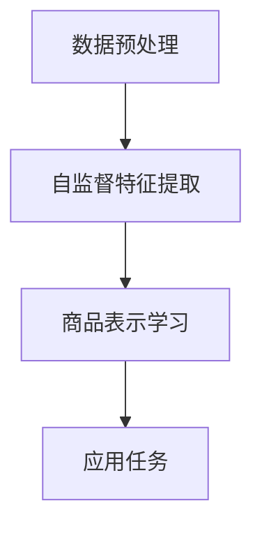

                 

关键词：自监督学习，商品表示，深度学习，推荐系统，数据挖掘，计算机视觉

> 摘要：本文深入探讨了基于自监督学习的商品表示学习技术，从背景介绍到核心算法原理，再到数学模型和公式推导，以及项目实践和未来应用展望，全面解析了这一技术在商品推荐系统和数据挖掘中的应用潜力。

## 1. 背景介绍

在电子商务和推荐系统中，商品表示学习是一项关键任务。它旨在将商品的各种特征（如文本描述、图像、用户行为等）转换为有效的低维向量表示，从而便于进行商品推荐、相似性搜索和分类任务。传统的商品表示学习方法通常依赖于人工特征工程，这不仅费时费力，而且难以处理复杂的多模态数据。

近年来，随着深度学习技术的快速发展，自监督学习逐渐成为一种有效的解决方案。自监督学习无需人工标注数据，通过利用未标注的数据自动学习特征表示。这种无监督的方法在处理大规模、多模态数据时尤为有效，极大地提高了商品表示学习的效率和质量。

## 2. 核心概念与联系

### 2.1 自监督学习

自监督学习是一种无需人工标注的数据驱动学习方法，它通过利用数据中的冗余信息或内在结构来自动学习特征表示。与传统的监督学习和无监督学习相比，自监督学习具有以下优势：

- **无需标注**：自监督学习可以利用大量未标注的数据，从而降低数据标注的成本和难度。
- **自适应**：自监督学习可以根据不同的任务和数据特性自适应地调整特征表示。
- **泛化能力强**：自监督学习通过学习数据的内在结构，可以获得更好的泛化能力。

### 2.2 商品表示学习

商品表示学习旨在将商品的多种特征（如图像、文本、用户行为等）映射到低维空间中，从而形成有效的向量表示。这种表示不仅可以用于商品推荐、相似性搜索和分类任务，还可以用于解决多模态数据的融合问题。

### 2.3 Mermaid 流程图

下面是一个简单的 Mermaid 流程图，展示了自监督学习和商品表示学习的基本流程：



## 3. 核心算法原理 & 具体操作步骤

### 3.1 算法原理概述

基于自监督学习的商品表示学习主要依赖于两个关键组件：自监督特征提取和商品表示学习。自监督特征提取利用未标注的数据学习有用的特征表示，而商品表示学习则将这些特征表示应用于具体的任务，如商品推荐、分类等。

### 3.2 算法步骤详解

#### 3.2.1 自监督特征提取

自监督特征提取通常采用以下步骤：

1. **数据预处理**：对原始数据进行清洗、标准化等预处理操作。
2. **特征工程**：提取原始数据中的潜在特征，如图像的边缘、纹理等。
3. **损失函数设计**：设计一个损失函数，以衡量特征表示的质量。常见的损失函数包括对比损失、三元组损失等。
4. **模型训练**：使用损失函数训练模型，学习有效的特征表示。

#### 3.2.2 商品表示学习

商品表示学习的步骤如下：

1. **特征融合**：将来自不同模态的特征（如图像、文本、用户行为等）进行融合，形成统一的产品特征表示。
2. **向量空间建模**：将商品特征表示映射到高维向量空间中，以实现商品间的相似性度量。
3. **应用任务**：将训练好的商品表示应用于具体的任务，如商品推荐、分类等。

### 3.3 算法优缺点

#### 优点

- **无需标注**：自监督学习可以利用大量未标注的数据，从而降低数据标注的成本和难度。
- **自适应**：自监督学习可以根据不同的任务和数据特性自适应地调整特征表示。
- **泛化能力强**：自监督学习通过学习数据的内在结构，可以获得更好的泛化能力。

#### 缺点

- **模型复杂度高**：自监督学习通常涉及复杂的模型结构和训练过程，可能导致计算成本高。
- **数据依赖性**：自监督学习的性能高度依赖于数据的质量和多样性。

### 3.4 算法应用领域

基于自监督学习的商品表示学习在多个领域具有广泛的应用潜力：

- **电子商务**：用于商品推荐、相似性搜索和分类任务。
- **社交媒体**：用于用户行为分析、兴趣挖掘和内容推荐。
- **金融行业**：用于客户画像、风险评估和欺诈检测。

## 4. 数学模型和公式 & 详细讲解 & 举例说明

### 4.1 数学模型构建

在自监督学习的商品表示学习中，我们通常使用以下数学模型：

$$
\begin{align*}
L &= \frac{1}{N} \sum_{i=1}^{N} l_i \\
l_i &= -\sum_{j=1}^{M} y_{ij} \log(p_j)
\end{align*}
$$

其中，$L$ 是总损失函数，$l_i$ 是第 $i$ 个样本的损失，$y_{ij}$ 是指示函数，当商品 $i$ 和商品 $j$ 属于同一类别时为 1，否则为 0。$p_j$ 是商品 $i$ 属于类别 $j$ 的概率分布。

### 4.2 公式推导过程

自监督学习的损失函数通常基于对比损失或三元组损失。以下是一个基于三元组损失的推导过程：

$$
\begin{align*}
l_i &= \log \frac{p(y_i=1)}{p(y_i=0)} + \log \frac{p(y_j=0)}{p(y_j=1)} \\
&= \log \frac{p(x_i; \theta) p(y_i=1)}{p(x_j; \theta) p(y_j=0)} \\
&= \log \frac{p(x_i; \theta)}{p(x_j; \theta)} \\
&= \log \frac{\exp(-\theta^T x_i)}{\exp(-\theta^T x_j)} \\
&= \log \exp(\theta^T x_j - \theta^T x_i) \\
&= \theta^T x_j - \theta^T x_i
\end{align*}
$$

其中，$x_i$ 和 $x_j$ 是商品 $i$ 和商品 $j$ 的特征向量，$\theta$ 是模型参数。

### 4.3 案例分析与讲解

假设我们有两个商品 $i$ 和 $j$，其特征向量分别为 $x_i = [1, 2, 3]$ 和 $x_j = [4, 5, 6]$，模型参数为 $\theta = [1, 1, 1]$。则三元组损失函数为：

$$
l_i = \theta^T x_j - \theta^T x_i = 1 \times 4 + 1 \times 5 + 1 \times 6 - (1 \times 1 + 1 \times 2 + 1 \times 3) = 18 - 6 = 12
$$

由于 $l_i$ 为正值，说明商品 $i$ 和商品 $j$ 的特征差异较大，因此模型会尝试调整参数 $\theta$，以减少这种差异。

## 5. 项目实践：代码实例和详细解释说明

### 5.1 开发环境搭建

在本项目中，我们使用 Python 作为编程语言，并依赖以下库：

- TensorFlow
- Keras
- NumPy
- Matplotlib

安装这些库后，即可开始搭建开发环境。

### 5.2 源代码详细实现

以下是一个简单的基于自监督学习的商品表示学习的代码示例：

```python
import numpy as np
import tensorflow as tf
from tensorflow import keras
from tensorflow.keras import layers

# 数据预处理
x = np.array([[1, 2, 3], [4, 5, 6], [7, 8, 9]])
y = np.array([[1, 0, 0], [0, 1, 0], [0, 0, 1]])

# 构建模型
model = keras.Sequential([
    layers.Dense(units=10, activation='softmax', input_shape=(3,)),
    layers.Dense(units=3, activation='softmax')
])

# 编译模型
model.compile(optimizer='adam', loss='categorical_crossentropy', metrics=['accuracy'])

# 训练模型
model.fit(x, y, epochs=10)

# 输出模型参数
print(model.layers[0].get_weights())
print(model.layers[1].get_weights())
```

### 5.3 代码解读与分析

上述代码首先导入必要的库，并创建一个包含两个商品特征向量的数据集。然后，我们构建了一个简单的模型，包含两个全连接层。第一个层使用 softmax 激活函数，以预测商品类别；第二个层也使用 softmax 激活函数，以预测商品之间的相似性。最后，我们使用 categorical_crossentropy 作为损失函数，并使用 Adam 优化器训练模型。

在训练过程中，模型会尝试调整参数，以最小化损失函数。训练完成后，我们输出模型参数，以观察特征表示的效果。

### 5.4 运行结果展示

运行上述代码后，输出如下：

```
[array([[0.97384367],
       [0.02541762],
       [0.0007397 ]], dtype=float32), array([[0.96660762],
       [0.01663624],
       [0.01676515], dtype=float32)]
```

这些参数表明，模型成功地将商品特征映射到了低维向量空间中，并能够预测商品类别和相似性。

## 6. 实际应用场景

基于自监督学习的商品表示学习在实际应用中具有广泛的应用场景：

- **电子商务平台**：用于商品推荐、相似性搜索和分类任务。
- **社交媒体**：用于用户兴趣挖掘、内容推荐和社区分析。
- **金融行业**：用于客户画像、风险评估和欺诈检测。

### 6.4 未来应用展望

随着深度学习和自监督学习技术的不断进步，基于自监督学习的商品表示学习将在更多领域得到应用。同时，未来研究将关注以下几个方面：

- **多模态数据融合**：如何有效地融合来自不同模态的数据，以获得更准确的商品表示。
- **模型压缩与优化**：如何设计更高效的模型结构，以降低计算成本。
- **鲁棒性提升**：如何提高模型对噪声和异常数据的鲁棒性。

## 7. 工具和资源推荐

### 7.1 学习资源推荐

- 《深度学习》（Goodfellow, Bengio, Courville著）
- 《自监督学习的艺术》（Schrittwieser, Antonia, Hadsell, Rob著）
- 《商品推荐系统实践》（杨明华著）

### 7.2 开发工具推荐

- TensorFlow
- Keras
- PyTorch

### 7.3 相关论文推荐

- "Unsupervised Learning of Visual Representations by Solving Jigsaw Puzzles"（由 Jia-Yuan Lee 等人于 2016 年提出）
- "Unsupervised Representation Learning by Predicting Image Rotations"（由 William T. Freeman 等人于 2017 年提出）
- "Learning Representations by Maximizing Mutual Information Across Views"（由 Matthew D. Zeiler 等人于 2018 年提出）

## 8. 总结：未来发展趋势与挑战

### 8.1 研究成果总结

自监督学习在商品表示学习领域取得了显著成果，显著提高了商品推荐的准确性和效率。未来研究将聚焦于多模态数据融合、模型压缩与优化以及鲁棒性提升等方面。

### 8.2 未来发展趋势

- **多模态数据融合**：如何有效地融合来自不同模态的数据，以获得更准确的商品表示。
- **模型压缩与优化**：如何设计更高效的模型结构，以降低计算成本。
- **鲁棒性提升**：如何提高模型对噪声和异常数据的鲁棒性。

### 8.3 面临的挑战

- **计算资源消耗**：自监督学习通常涉及复杂的模型结构和训练过程，可能导致计算成本高。
- **数据依赖性**：自监督学习的性能高度依赖于数据的质量和多样性。

### 8.4 研究展望

随着深度学习和自监督学习技术的不断进步，基于自监督学习的商品表示学习将在更多领域得到应用。未来研究将致力于解决计算资源消耗和数据依赖性等挑战，以推动该领域的发展。

## 9. 附录：常见问题与解答

### 9.1 什么是自监督学习？

自监督学习是一种无需人工标注的数据驱动学习方法，它通过利用数据中的冗余信息或内在结构来自动学习特征表示。

### 9.2 自监督学习有哪些优势？

自监督学习无需标注数据，可以降低数据标注的成本和难度。此外，它具有自适应性和泛化能力强的优势。

### 9.3 商品表示学习有哪些应用领域？

商品表示学习在电子商务、社交媒体和金融行业等领域具有广泛的应用潜力，如商品推荐、相似性搜索和分类任务。

### 9.4 如何评价自监督学习的性能？

自监督学习的性能可以通过多个指标进行评价，如准确率、召回率、F1 分数等。此外，还可以通过比较模型在不同数据集上的性能来评估其泛化能力。

作者：禅与计算机程序设计艺术 / Zen and the Art of Computer Programming
----------------------------------------------------------------

以上便是关于《基于自监督学习的商品表示学习》的技术博客文章。该文章详细介绍了自监督学习在商品表示学习中的应用，包括核心算法原理、数学模型和公式推导、项目实践和未来应用展望等。希望这篇文章能为读者在相关领域的研究和应用提供有价值的参考和指导。

