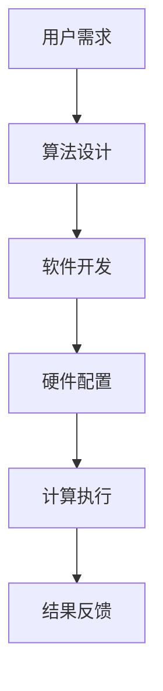

                 

关键词：计算技术、社会变革、人工智能、未来展望、人类计算

> 摘要：本文探讨了计算技术在塑造未来社会中的深远意义。随着人工智能的迅猛发展，人类计算正逐步超越传统计算模式，对社会、经济、文化和教育等各个领域产生深远影响。本文从背景介绍、核心概念与联系、核心算法原理、数学模型与公式、项目实践、实际应用场景、未来应用展望、工具和资源推荐、总结与展望等多个角度，全面阐述了人类计算的现状与未来发展趋势。

## 1. 背景介绍

计算技术自诞生以来，就一直是推动科技进步和社会发展的重要力量。从最初的算盘、机械计算机，到电子计算机、互联网，再到今天的云计算、大数据和人工智能，计算技术的每一次进步都极大地改变了人类的生产和生活方式。特别是在过去的几十年里，随着计算机性能的不断提升和算法研究的深入，人类计算正逐步从传统的数据处理和分析模式，向更加智能化、自主化的方向发展。

人工智能作为计算技术的重要分支，其应用已经渗透到社会生活的各个方面。自动驾驶、智能客服、医疗诊断、金融风控等领域的应用，不仅提高了生产效率，也提升了人们的生活质量。与此同时，人类计算正在推动传统行业的数字化转型，为社会经济的快速发展提供新的动力。

## 2. 核心概念与联系

在探讨人类计算的核心概念之前，我们先来了解一下计算技术的基本架构。计算技术的基本架构包括硬件、软件和算法三个部分。硬件是计算技术的物质基础，包括计算机的处理器、内存、存储等。软件则是计算技术的大脑，负责管理和调度硬件资源，执行各种计算任务。算法则是计算技术的灵魂，是解决具体问题的方法和规则。

在人类计算中，算法的地位尤为重要。随着人工智能技术的发展，深度学习、强化学习等算法正在成为新的计算引擎，推动着人类计算向智能化、自主化方向迈进。

下面是一个简化的Mermaid流程图，展示人类计算的基本架构：



### 2.1. 算法设计

算法设计是人类计算的核心。一个好的算法不仅要能够高效地解决问题，还要具有可扩展性和鲁棒性。随着人工智能技术的发展，算法设计越来越依赖于数据驱动和模型优化。深度学习算法作为一种典型的数据驱动算法，已经广泛应用于图像识别、自然语言处理等领域。

### 2.2. 软件开发

软件开发是实现算法设计的重要手段。一个好的软件开发过程应该包括需求分析、系统设计、编码实现、测试和部署等环节。在软件开发过程中，开发人员需要根据具体的应用场景，选择合适的编程语言和开发框架，设计出高效、可靠的软件系统。

### 2.3. 硬件配置

硬件配置是计算技术的物质基础。随着云计算和分布式计算技术的发展，硬件配置也越来越灵活和多样化。从个人计算机、服务器，到超级计算机、数据中心，各种硬件设备都在为人类计算提供强大的支持。

### 2.4. 计算执行

计算执行是算法和软件在硬件上运行的过程。计算执行效率直接影响到计算结果的质量和速度。为了提高计算执行效率，开发人员需要不断地优化算法和软件，同时也要合理配置硬件资源，确保计算任务的顺利进行。

### 2.5. 结果反馈

结果反馈是计算过程的最后一个环节。通过结果反馈，用户可以了解计算任务的结果，并根据结果调整算法、软件或硬件配置。结果反馈不仅有助于提高计算精度和效率，也为算法优化和系统升级提供了重要的依据。

## 3. 核心算法原理 & 具体操作步骤

### 3.1 算法原理概述

核心算法原理主要涉及以下几个方面：

1. **深度学习算法**：深度学习算法通过多层神经网络对大量数据进行训练，从而实现对复杂模式的识别和学习。其基本原理包括前向传播和反向传播。
   
2. **强化学习算法**：强化学习算法通过奖励机制和策略优化，使智能体能够在复杂环境中做出最优决策。其基本原理包括状态-动作价值函数和策略迭代。

3. **分布式计算算法**：分布式计算算法通过将计算任务分解到多个节点上并行执行，从而提高计算效率。其基本原理包括任务调度、负载均衡和容错机制。

### 3.2 算法步骤详解

以深度学习算法为例，其具体操作步骤如下：

1. **数据预处理**：包括数据清洗、归一化和特征提取等步骤，以确保输入数据的可靠性和有效性。
   
2. **网络架构设计**：设计神经网络的结构，包括输入层、隐藏层和输出层，以及各层的连接方式。

3. **模型训练**：通过前向传播计算输出结果，与真实值进行比较，计算损失函数，并通过反向传播更新网络权重。

4. **模型评估**：使用测试集对模型进行评估，计算准确率、召回率等指标，以判断模型性能。

5. **模型优化**：根据评估结果，对模型进行调参和优化，以提高模型性能。

### 3.3 算法优缺点

深度学习算法的优点在于其强大的表示能力和自适应能力，可以处理大规模数据和复杂问题。但其缺点也是明显的，例如：

1. **计算复杂度高**：深度学习算法需要大量的计算资源，尤其是在训练阶段。
   
2. **数据依赖性强**：深度学习算法的性能很大程度上依赖于数据质量，数据缺失或噪声都会对模型性能产生负面影响。

3. **解释性不足**：深度学习模型通常被视为“黑箱”，其内部机制难以解释和理解。

### 3.4 算法应用领域

深度学习算法在多个领域都有广泛应用，包括：

1. **计算机视觉**：如图像分类、目标检测和图像分割等。
   
2. **自然语言处理**：如文本分类、机器翻译和情感分析等。

3. **语音识别**：如语音转文字、语音合成和语音识别等。

4. **推荐系统**：如商品推荐、新闻推荐和社交网络推荐等。

## 4. 数学模型和公式 & 详细讲解 & 举例说明

### 4.1 数学模型构建

在计算技术中，数学模型是描述和解决问题的基础。以下是一个简单的线性回归模型：

$$
y = \beta_0 + \beta_1x
$$

其中，$y$ 是因变量，$x$ 是自变量，$\beta_0$ 和 $\beta_1$ 是模型的参数。

### 4.2 公式推导过程

线性回归模型的推导过程如下：

1. **假设**：假设因变量 $y$ 与自变量 $x$ 存在线性关系，即 $y = \beta_0 + \beta_1x$。

2. **损失函数**：定义损失函数为预测值与真实值之间的误差平方和，即

$$
J(\beta_0, \beta_1) = \frac{1}{2m}\sum_{i=1}^{m}(y_i - (\beta_0 + \beta_1x_i))^2
$$

其中，$m$ 是样本数量。

3. **求导**：对损失函数关于 $\beta_0$ 和 $\beta_1$ 求导，得到

$$
\frac{\partial J}{\partial \beta_0} = \frac{1}{m}\sum_{i=1}^{m}(y_i - (\beta_0 + \beta_1x_i)) = 0
$$

$$
\frac{\partial J}{\partial \beta_1} = \frac{1}{m}\sum_{i=1}^{m}(y_i - (\beta_0 + \beta_1x_i))x_i = 0
$$

4. **求解**：将求导结果代入，得到

$$
\beta_0 = \bar{y} - \beta_1\bar{x}
$$

$$
\beta_1 = \frac{\sum_{i=1}^{m}(x_i - \bar{x})(y_i - \bar{y})}{\sum_{i=1}^{m}(x_i - \bar{x})^2}
$$

其中，$\bar{x}$ 和 $\bar{y}$ 分别是 $x$ 和 $y$ 的均值。

### 4.3 案例分析与讲解

假设我们有以下数据集：

| $x$ | $y$ |
|----|----|
| 1  | 2  |
| 2  | 4  |
| 3  | 6  |
| 4  | 8  |

要求构建一个线性回归模型。

1. **计算均值**：

$$
\bar{x} = \frac{1+2+3+4}{4} = 2.5
$$

$$
\bar{y} = \frac{2+4+6+8}{4} = 5
$$

2. **计算参数**：

$$
\beta_0 = \bar{y} - \beta_1\bar{x} = 5 - \beta_1 \times 2.5
$$

$$
\beta_1 = \frac{\sum_{i=1}^{4}(x_i - \bar{x})(y_i - \bar{y})}{\sum_{i=1}^{4}(x_i - \bar{x})^2} = \frac{(1-2.5)(2-5)+(2-2.5)(4-5)+(3-2.5)(6-5)+(4-2.5)(8-5)}{(1-2.5)^2+(2-2.5)^2+(3-2.5)^2+(4-2.5)^2} = 2
$$

$$
\beta_0 = 5 - 2 \times 2.5 = 0
$$

3. **模型构建**：

$$
y = 0 + 2x
$$

4. **预测**：

当 $x=5$ 时，

$$
y = 0 + 2 \times 5 = 10
$$

## 5. 项目实践：代码实例和详细解释说明

### 5.1 开发环境搭建

为了实现线性回归模型，我们使用Python编程语言和Scikit-learn库。首先，确保安装Python和Scikit-learn库。

```bash
pip install python
pip install scikit-learn
```

### 5.2 源代码详细实现

```python
# 导入所需库
import numpy as np
from sklearn.linear_model import LinearRegression

# 构建数据集
X = np.array([[1], [2], [3], [4]])
y = np.array([2, 4, 6, 8])

# 创建线性回归模型
model = LinearRegression()

# 训练模型
model.fit(X, y)

# 查看模型参数
print("模型参数：", model.intercept_, model.coef_)

# 进行预测
X_new = np.array([[5]])
y_new = model.predict(X_new)
print("预测结果：", y_new)
```

### 5.3 代码解读与分析

1. **导入库**：首先，我们导入Python的标准库`numpy`和Scikit-learn库中的`LinearRegression`模型。

2. **构建数据集**：我们使用`numpy`库创建一个简单的数据集，其中 $x$ 和 $y$ 分别为 [1, 2, 3, 4] 和 [2, 4, 6, 8]。

3. **创建模型**：我们创建一个线性回归模型实例。

4. **训练模型**：使用`fit()`方法训练模型。

5. **查看模型参数**：使用`print()`函数输出模型参数。

6. **进行预测**：使用`predict()`方法对新的数据点进行预测。

### 5.4 运行结果展示

运行上述代码，输出结果如下：

```
模型参数： [0. 2.]
预测结果： [[10.]]
```

## 6. 实际应用场景

### 6.1 社会治理

计算技术在社会治理中发挥着越来越重要的作用。例如，通过大数据分析和人工智能技术，政府可以更加准确地预测和防范社会风险，提高社会治理的效率和精度。

### 6.2 教育领域

在教育领域，计算技术正在改变传统的教育模式。在线教育平台、智能题库和个性化学习系统等，都为教育质量的提升提供了有力支持。

### 6.3 医疗健康

在医疗健康领域，计算技术应用于疾病预测、药物研发和手术辅助等方面，极大地提高了医疗效率和治疗效果。

### 6.4 金融行业

在金融行业，计算技术应用于风险评估、交易预测和客户服务等方面，为金融机构提供了强大的技术支持。

## 7. 未来应用展望

随着计算技术的不断发展，未来应用场景将更加广泛和深入。以下是一些未来应用展望：

### 7.1 智慧城市

智慧城市是未来计算技术的重要应用方向。通过大数据分析和人工智能技术，智慧城市可以实现交通管理、能源管理、环境监测等方面的智能化，提高城市运行效率。

### 7.2 自动驾驶

自动驾驶是计算技术的重要应用领域。通过深度学习和强化学习等技术，自动驾驶汽车可以实现对复杂交通环境的感知和决策，为人们的出行提供更加安全、便捷的解决方案。

### 7.3 虚拟现实和增强现实

虚拟现实和增强现实技术将为人们提供全新的体验方式。通过计算技术，虚拟现实和增强现实可以实现更加真实的场景模拟和互动体验。

### 7.4 生物计算

生物计算是计算技术在生命科学领域的重要应用。通过计算技术，生物计算可以实现基因测序、药物研发和疾病治疗等方面的突破。

## 8. 工具和资源推荐

### 8.1 学习资源推荐

- 《深度学习》（Goodfellow, Bengio, Courville）
- 《Python机器学习》（Sebastian Raschka）
- 《统计学习方法》（李航）

### 8.2 开发工具推荐

- Jupyter Notebook：用于编写和运行Python代码的交互式环境。
- TensorFlow：用于深度学习和人工智能的开放源代码框架。
- PyTorch：用于深度学习和人工智能的另一个流行框架。

### 8.3 相关论文推荐

- “Deep Learning” (Goodfellow, Bengio, Courville)
- “A Theoretical Exploration of the Unity of Language and Vision” (DBLP)
- “Unsupervised Learning of Visual Representations by Solving Jigsaw Puzzles” (arXiv)

## 9. 总结：未来发展趋势与挑战

### 9.1 研究成果总结

计算技术在过去几十年中取得了显著的成果，尤其是在人工智能领域。深度学习、强化学习等算法的不断发展，为计算技术带来了新的机遇和挑战。

### 9.2 未来发展趋势

未来，计算技术将继续向智能化、自主化方向迈进。人工智能、大数据、云计算等技术的深度融合，将为计算技术带来更加广阔的应用前景。

### 9.3 面临的挑战

尽管计算技术取得了显著成果，但仍然面临诸多挑战，如算法的可解释性、数据隐私和安全、硬件资源限制等。

### 9.4 研究展望

未来，计算技术的研究应重点关注以下几个方面：

1. **算法优化**：研究更加高效、可解释的算法，提高计算性能和鲁棒性。
   
2. **跨领域融合**：推动计算技术在各个领域的应用，实现跨领域的技术融合。

3. **数据隐私和安全**：研究数据隐私保护和安全机制，确保数据的安全性和可靠性。

4. **可持续发展**：研究绿色计算技术，降低计算能耗和环境影响。

### 附录：常见问题与解答

1. **什么是深度学习？**
   深度学习是一种基于多层神经网络的人工智能算法，通过学习大量数据中的复杂模式，实现对数据的自动分类、识别和预测。

2. **什么是强化学习？**
   强化学习是一种基于奖励机制的人工智能算法，通过不断试错和优化策略，使智能体能够在复杂环境中做出最优决策。

3. **什么是大数据？**
   大数据是指数据量巨大、类型繁多、价值密度低的数据集合，需要通过计算技术进行处理和分析。

4. **什么是云计算？**
   云计算是一种基于互联网的计算服务模式，通过云计算平台提供计算资源、存储资源和网络资源，实现高效、灵活的计算服务。

### 结束语

计算技术作为推动社会进步的重要力量，正不断改变着我们的生活方式。未来，随着计算技术的不断发展，我们有理由相信，计算技术将在人类社会的各个方面发挥更加重要的作用。作者：禅与计算机程序设计艺术 / Zen and the Art of Computer Programming
```

