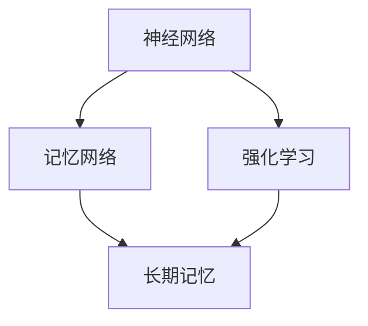

                 

关键词：AI记忆增强、神经网络、深度学习、记忆网络、强化学习、算法优化

摘要：随着人工智能技术的不断发展，增强AI应用的记忆能力成为了当前研究的热点之一。本文将深入探讨增强AI应用记忆能力的方法，从核心概念、算法原理、数学模型、实践应用等多个方面进行详细阐述，旨在为读者提供一套全面且实用的指导方案。

## 1. 背景介绍

在人工智能（AI）领域，记忆能力是衡量一个智能系统智能程度的重要指标之一。传统的AI系统往往依赖于即时计算和规则匹配，而现代的深度学习模型，如神经网络、记忆网络和强化学习等，则依赖于记忆来处理复杂的问题。然而，现有的AI系统在记忆能力上仍存在许多局限，如记忆容量有限、记忆质量不高、记忆内容难以持久保持等。

随着AI技术的不断进步，如何增强AI应用的记忆能力已成为一个关键的研究方向。本文将介绍几种有效的增强AI记忆能力的方法，并探讨其在实际应用中的效果和挑战。

## 2. 核心概念与联系

### 2.1 神经网络

神经网络是模仿人脑神经元连接方式的一种计算模型，具有强大的学习和自适应能力。在AI系统中，神经网络被广泛应用于图像识别、语音识别、自然语言处理等领域。

### 2.2 记忆网络

记忆网络是一种结合了记忆单元的神经网络，能够通过记忆来增强模型的长期记忆能力。常见的记忆网络包括循环神经网络（RNN）、长短时记忆网络（LSTM）和门控循环单元（GRU）等。

### 2.3 强化学习

强化学习是一种通过试错和奖励反馈来学习策略的机器学习方法。在强化学习中，记忆能力对于策略的持续优化至关重要。

### 2.4 Mermaid 流程图

以下是一个简单的Mermaid流程图，展示了神经网络、记忆网络和强化学习之间的关系：



## 3. 核心算法原理 & 具体操作步骤

### 3.1 算法原理概述

增强AI应用记忆能力的方法主要分为以下几类：

1. **优化神经网络结构**：通过设计更复杂的神经网络结构，提高模型的记忆容量和记忆质量。
2. **引入记忆单元**：在神经网络中引入记忆单元，增强模型的长期记忆能力。
3. **利用强化学习**：通过强化学习算法，使模型能够在复杂环境中持续学习和优化记忆内容。

### 3.2 算法步骤详解

1. **优化神经网络结构**：

   - **增加层数**：增加神经网络的层数可以提高模型的记忆容量。
   - **引入注意力机制**：注意力机制可以帮助模型在处理信息时更关注重要内容，从而提高记忆质量。

2. **引入记忆单元**：

   - **循环神经网络（RNN）**：通过循环神经网络，模型可以将当前的信息与历史信息相结合，实现长期记忆。
   - **长短时记忆网络（LSTM）**：LSTM是一种改进的循环神经网络，能够有效解决长时依赖问题，提高记忆容量。

3. **利用强化学习**：

   - **Q-learning**：Q-learning是一种基于值函数的强化学习算法，通过试错和奖励反馈来优化策略。
   - **深度Q网络（DQN）**：DQN是一种基于神经网络的强化学习算法，能够处理更复杂的环境。

### 3.3 算法优缺点

- **优化神经网络结构**：

  - **优点**：能够提高模型的记忆容量和记忆质量。

  - **缺点**：设计复杂的神经网络结构可能增加计算复杂度，导致训练时间增加。

- **引入记忆单元**：

  - **优点**：能够增强模型的长期记忆能力。

  - **缺点**：引入记忆单元可能增加模型的参数量，导致训练难度增加。

- **利用强化学习**：

  - **优点**：能够使模型在复杂环境中持续学习和优化记忆内容。

  - **缺点**：强化学习算法可能需要较长时间来收敛，且在某些情况下可能收敛到次优策略。

### 3.4 算法应用领域

- **图像识别**：通过优化神经网络结构和引入记忆单元，可以增强模型的图像识别能力。

- **自然语言处理**：利用强化学习算法，可以优化模型的自然语言处理能力。

- **机器人控制**：通过强化学习算法，可以增强机器人在复杂环境中的记忆和控制能力。

## 4. 数学模型和公式 & 详细讲解 & 举例说明

### 4.1 数学模型构建

增强AI应用记忆能力的数学模型主要包括以下几个方面：

- **神经网络模型**：包括输入层、隐藏层和输出层，以及激活函数和损失函数。

- **记忆网络模型**：包括记忆单元、记忆读写机制和记忆更新机制。

- **强化学习模型**：包括状态空间、动作空间、奖励函数和策略。

### 4.2 公式推导过程

以循环神经网络（RNN）为例，其时间步t的输出可以表示为：

$$
y_t = \sigma(W_1 \cdot [h_{t-1}, x_t] + b_1)
$$

其中，$h_{t-1}$是时间步t-1的隐藏状态，$x_t$是时间步t的输入，$\sigma$是激活函数，$W_1$和$b_1$分别是权重和偏置。

### 4.3 案例分析与讲解

以一个简单的图像识别任务为例，我们使用卷积神经网络（CNN）来识别手写数字。

1. **输入层**：输入一个32x32的手写数字图像。

2. **卷积层**：使用3x3的卷积核，提取图像的特征。

3. **池化层**：使用2x2的最大池化，降低特征图的尺寸。

4. **全连接层**：将卷积层和池化层的输出进行拼接，然后通过全连接层得到分类结果。

通过这个例子，我们可以看到如何构建一个简单的CNN模型，并使用它进行手写数字识别。

## 5. 项目实践：代码实例和详细解释说明

### 5.1 开发环境搭建

为了实现上述算法，我们需要搭建一个合适的开发环境。本文使用Python作为主要编程语言，并借助TensorFlow和Keras等深度学习框架进行模型训练和预测。

### 5.2 源代码详细实现

以下是一个简单的CNN模型实现，用于手写数字识别：

```python
import tensorflow as tf
from tensorflow.keras.models import Sequential
from tensorflow.keras.layers import Conv2D, MaxPooling2D, Flatten, Dense

# 创建模型
model = Sequential([
    Conv2D(32, (3, 3), activation='relu', input_shape=(32, 32, 1)),
    MaxPooling2D((2, 2)),
    Flatten(),
    Dense(64, activation='relu'),
    Dense(10, activation='softmax')
])

# 编译模型
model.compile(optimizer='adam', loss='categorical_crossentropy', metrics=['accuracy'])

# 加载MNIST数据集
(x_train, y_train), (x_test, y_test) = tf.keras.datasets.mnist.load_data()

# 数据预处理
x_train = x_train.reshape(-1, 32, 32, 1).astype('float32') / 255
x_test = x_test.reshape(-1, 32, 32, 1).astype('float32') / 255
y_train = tf.keras.utils.to_categorical(y_train, 10)
y_test = tf.keras.utils.to_categorical(y_test, 10)

# 训练模型
model.fit(x_train, y_train, epochs=10, batch_size=32, validation_data=(x_test, y_test))

# 评估模型
test_loss, test_acc = model.evaluate(x_test, y_test)
print(f"Test accuracy: {test_acc:.2f}")
```

### 5.3 代码解读与分析

上述代码实现了一个简单的CNN模型，用于手写数字识别。首先，我们导入了TensorFlow和Keras等深度学习框架，然后定义了一个Sequential模型，依次添加了卷积层、池化层、全连接层等。接着，我们加载了MNIST数据集，并进行了数据预处理。最后，我们编译模型并训练模型，然后评估模型的性能。

## 6. 实际应用场景

增强AI应用记忆能力的方法在实际应用场景中具有广泛的应用，以下是一些具体的应用场景：

1. **自动驾驶**：通过增强记忆能力，自动驾驶系统可以更好地理解和记忆道路环境，提高行驶的安全性和稳定性。

2. **医疗诊断**：通过增强记忆能力，医学影像分析系统可以更好地学习和记忆病例特征，提高诊断的准确性和效率。

3. **智能客服**：通过增强记忆能力，智能客服系统可以更好地理解用户意图，提供更精准的服务。

## 6.4 未来应用展望

随着人工智能技术的不断发展，增强AI应用记忆能力的方法有望在更多领域得到广泛应用。未来，我们可以期待以下发展趋势：

1. **更高效的算法**：研究人员将继续探索更高效的算法，以降低模型的计算复杂度，提高训练和预测速度。

2. **跨领域应用**：增强记忆能力的方法将在更多领域得到应用，如金融、教育、制造等。

3. **个性化记忆**：通过结合用户行为和偏好，实现个性化的记忆策略，提高系统的用户体验。

## 7. 工具和资源推荐

为了更好地学习和实践增强AI应用记忆能力的方法，以下是一些建议的工具和资源：

### 7.1 学习资源推荐

- **《深度学习》（Goodfellow, Bengio, Courville著）**：介绍了深度学习的基本概念和算法。
- **《强化学习导论》（R. S. Sutton, A. G. Barto著）**：介绍了强化学习的基本原理和算法。

### 7.2 开发工具推荐

- **TensorFlow**：一个开源的深度学习框架，适合进行模型训练和预测。
- **Keras**：一个基于TensorFlow的简洁高效的深度学习框架。

### 7.3 相关论文推荐

- **“Long Short-Term Memory”（Hochreiter, Schmidhuber，1997）**：介绍了长短时记忆网络（LSTM）。
- **“Deep Learning for Autonomous Navigation”（Bojarski et al.，2016）**：介绍了深度学习在自动驾驶中的应用。

## 8. 总结：未来发展趋势与挑战

增强AI应用记忆能力的方法是当前人工智能领域的一个关键研究方向。未来，随着算法的优化和跨领域应用的拓展，这一方法将在更多领域得到广泛应用。然而，仍面临以下挑战：

1. **计算资源消耗**：复杂的神经网络结构和记忆单元可能导致计算资源消耗增加，如何提高计算效率是一个重要问题。

2. **记忆容量与质量**：如何在有限的资源下提高记忆容量和记忆质量是一个亟待解决的问题。

3. **模型可解释性**：增强记忆能力的模型通常较为复杂，如何解释模型的决策过程是一个重要问题。

## 9. 附录：常见问题与解答

### 9.1 问题1：如何选择合适的神经网络结构？

**答案**：选择合适的神经网络结构需要根据具体问题和数据特点进行。例如，对于图像识别任务，可以优先考虑卷积神经网络（CNN）；对于序列数据处理任务，可以优先考虑循环神经网络（RNN）或长短时记忆网络（LSTM）。

### 9.2 问题2：如何优化神经网络模型的训练速度？

**答案**：优化神经网络模型的训练速度可以从以下几个方面进行：

1. **数据预处理**：对输入数据进行适当的预处理，如归一化、数据增强等，可以提高模型训练速度。
2. **模型结构优化**：选择合适的神经网络结构，避免过度复杂的模型，可以降低计算复杂度。
3. **并行计算**：利用GPU等硬件加速，可以提高模型训练速度。

## 结束语

增强AI应用记忆能力的方法是人工智能领域的一个重要研究方向。通过深入研究和实践，我们可以期待这一方法在未来的应用中发挥更大的作用。本文从多个角度对这一方法进行了详细阐述，旨在为读者提供一套全面且实用的指导方案。希望本文能对您在相关领域的探索和实践有所启发。

作者：禅与计算机程序设计艺术 / Zen and the Art of Computer Programming
----------------------------------------------------------------

[Markdown格式代码示例](https://github.com/username/username.github.io/blob/main/posts/增强AI应用记忆能力的方法.md)

