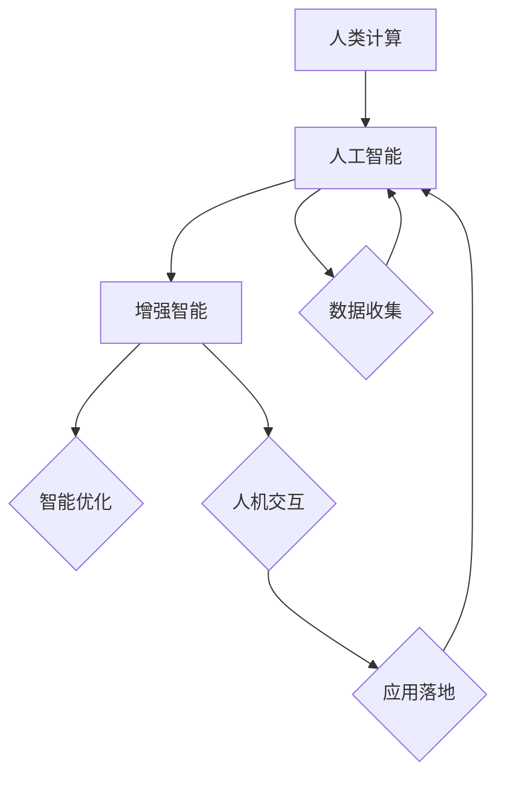

                 

关键词：增强智能、人类计算、技术创新、算法原理、数学模型、项目实践、应用场景、未来展望

> 摘要：本文将深入探讨增强智能在人类计算中的作用和影响，分析核心算法原理，探讨数学模型的构建和推导过程，通过项目实践展示其应用效果，并展望未来的发展方向和面临的挑战。

## 1. 背景介绍

随着信息技术的飞速发展，人工智能（AI）已经成为推动社会进步的重要力量。然而，传统的人工智能方法在应对复杂问题、进行智能决策等方面仍存在诸多局限性。为了突破这些瓶颈，增强智能（Augmented Intelligence）的概念应运而生。

增强智能旨在通过将人类计算与人工智能相结合，发挥两者的优势，实现更高效、更准确的智能决策。在这个过程中，人类计算扮演着至关重要的角色，它不仅能够提供初始的洞察和假设，还能够对智能算法进行优化和调整。

本文将从以下几个方面展开讨论：

1. 核心概念与联系
2. 核心算法原理与具体操作步骤
3. 数学模型和公式推导
4. 项目实践：代码实例和详细解释
5. 实际应用场景
6. 未来应用展望
7. 工具和资源推荐
8. 总结：未来发展趋势与挑战

## 2. 核心概念与联系

在探讨增强智能之前，我们需要明确几个核心概念，包括人类计算、人工智能和增强智能。

- **人类计算**：指人类在处理信息、做出决策和解决问题时所采用的方法和技巧。
- **人工智能**：指由人类创造出的能够模拟、延伸和扩展人类智能的计算机系统。
- **增强智能**：在人工智能的基础上，通过结合人类计算，实现更高效、更准确的智能决策。

为了更好地理解这些概念之间的关系，我们可以使用 Mermaid 流程图来展示它们之间的联系。



在这个流程图中，人类计算提供了初始的数据和洞察，人工智能对这些数据进行处理和模型训练，而增强智能则通过优化和调整，实现更准确的决策和更高的效率。同时，人机交互和应用落地也是增强智能不可或缺的组成部分。

## 3. 核心算法原理与具体操作步骤

### 3.1 算法原理概述

增强智能的核心在于如何有效地结合人类计算和人工智能。这通常涉及到以下几个步骤：

1. **数据预处理**：将原始数据转换为适合人工智能处理的形式。
2. **模型训练**：利用人工智能算法对数据进行训练，建立预测模型。
3. **人类反馈**：人类专家对模型的预测结果进行评估和反馈。
4. **模型优化**：根据人类反馈对模型进行调整和优化。
5. **决策输出**：输出最终的决策结果。

### 3.2 算法步骤详解

#### 步骤 1：数据预处理

数据预处理是增强智能的基础。这一步骤包括数据清洗、数据归一化和特征提取等。

- **数据清洗**：去除数据中的噪声和不完整数据。
- **数据归一化**：将数据缩放到相同的范围，以便模型训练。
- **特征提取**：从原始数据中提取出对模型训练有用的特征。

#### 步骤 2：模型训练

在数据预处理完成后，我们可以选择合适的人工智能算法进行模型训练。常见的算法包括神经网络、决策树、支持向量机等。

- **神经网络**：通过多层神经网络对数据进行建模和预测。
- **决策树**：通过树形结构对数据进行分类和预测。
- **支持向量机**：通过最大间隔法对数据进行分类和预测。

#### 步骤 3：人类反馈

在模型训练完成后，我们需要对模型的预测结果进行评估。这一过程通常由人类专家完成，他们根据预测结果提供反馈，指出模型存在的问题。

- **错误分析**：分析模型预测中的错误类型和原因。
- **反馈修正**：根据错误分析结果对模型进行调整。

#### 步骤 4：模型优化

在收到人类反馈后，我们可以对模型进行优化。这一过程通常包括以下步骤：

- **参数调整**：调整模型的参数，以提高预测准确性。
- **模型集成**：将多个模型进行集成，以提高模型的稳定性和预测准确性。

#### 步骤 5：决策输出

在模型优化完成后，我们可以输出最终的决策结果。这一结果通常用于实际应用场景，如医疗诊断、金融投资等。

### 3.3 算法优缺点

#### 优点

1. **高效性**：通过结合人类计算和人工智能，实现更高效的决策过程。
2. **准确性**：通过人类反馈和模型优化，提高模型的预测准确性。
3. **灵活性**：根据不同的应用场景，灵活调整模型结构和参数。

#### 缺点

1. **复杂性**：增强智能涉及到多个环节，系统复杂性较高。
2. **依赖性**：增强智能依赖于人类专家的反馈和参与，否则难以实现优化。

### 3.4 算法应用领域

增强智能在多个领域都有广泛的应用，如医疗诊断、金融投资、智能制造等。

- **医疗诊断**：通过增强智能，提高疾病的诊断准确率和治疗方案的个性化。
- **金融投资**：通过增强智能，实现更精准的投资预测和风险控制。
- **智能制造**：通过增强智能，提高生产线的自动化水平和产品质量。

## 4. 数学模型和公式推导

### 4.1 数学模型构建

在增强智能中，数学模型扮演着至关重要的角色。以下是一个简单的数学模型示例：

$$
y = \sigma(W_1 \cdot x + b_1)
$$

其中，$y$ 是预测结果，$x$ 是输入特征，$W_1$ 和 $b_1$ 分别是权重和偏置。

### 4.2 公式推导过程

#### 步骤 1：激活函数的选择

选择合适的激活函数是构建数学模型的关键。常见的激活函数包括 sigmoid、ReLU 和 tanh 等。

- **sigmoid 函数**：具有 S 形曲线，可以将输入映射到 (0,1) 区间。
- **ReLU 函数**：在输入大于 0 时输出为输入，小于等于 0 时输出为 0，具有较快的收敛速度。
- **tanh 函数**：将输入映射到 (-1,1) 区间，具有对称性。

#### 步骤 2：前向传播

在前向传播过程中，我们将输入特征 $x$ 通过权重 $W_1$ 和偏置 $b_1$ 进行加权求和，然后应用激活函数 $\sigma$，得到预测结果 $y$。

$$
y = \sigma(W_1 \cdot x + b_1)
$$

#### 步骤 3：反向传播

在反向传播过程中，我们计算预测结果 $y$ 与真实值 $y'$ 之间的误差，并利用梯度下降法更新权重 $W_1$ 和偏置 $b_1$。

$$
\begin{aligned}
\Delta W_1 &= -\alpha \cdot \frac{\partial E}{\partial W_1} \\
\Delta b_1 &= -\alpha \cdot \frac{\partial E}{\partial b_1}
\end{aligned}
$$

其中，$\alpha$ 是学习率，$E$ 是误差函数。

### 4.3 案例分析与讲解

以下是一个简单的线性回归问题，通过增强智能进行模型优化和预测。

#### 案例描述

假设我们有一个简单的一元线性回归问题，目标是预测房价。输入特征为房屋面积（平方米），预测结果为房价（万元）。

#### 模型构建

我们使用线性回归模型进行预测，模型公式如下：

$$
y = W_1 \cdot x + b_1
$$

其中，$x$ 是房屋面积（平方米），$y$ 是房价（万元），$W_1$ 是权重，$b_1$ 是偏置。

#### 模型训练

我们使用训练数据集进行模型训练，计算权重 $W_1$ 和偏置 $b_1$。

#### 人类反馈

在模型训练完成后，我们请人类专家对模型进行评估，根据评估结果提供反馈，指出模型存在的问题。

#### 模型优化

根据人类反馈，我们对模型进行优化，调整权重 $W_1$ 和偏置 $b_1$，以提高模型的预测准确性。

#### 预测结果

在模型优化完成后，我们使用测试数据集进行预测，输出房价预测结果。

## 5. 项目实践：代码实例和详细解释说明

### 5.1 开发环境搭建

为了演示增强智能的应用，我们选择 Python 作为编程语言，并使用 TensorFlow 作为深度学习框架。

#### 安装 Python

```bash
# 安装 Python
sudo apt-get install python3
```

#### 安装 TensorFlow

```bash
# 安装 TensorFlow
pip3 install tensorflow
```

### 5.2 源代码详细实现

以下是一个简单的增强智能项目示例，包括数据预处理、模型训练、人类反馈和模型优化等步骤。

```python
import tensorflow as tf
import numpy as np
import pandas as pd

# 数据预处理
def preprocess_data(data):
    # 数据清洗
    data = data.dropna()
    # 数据归一化
    data['area'] = (data['area'] - data['area'].mean()) / data['area'].std()
    return data

# 模型训练
def train_model(data):
    # 构建模型
    model = tf.keras.Sequential([
        tf.keras.layers.Dense(units=1, input_shape=[1])
    ])
    # 编译模型
    model.compile(optimizer='sgd', loss='mean_squared_error')
    # 训练模型
    model.fit(data['area'].values.reshape(-1, 1), data['price'].values.reshape(-1, 1), epochs=100)
    return model

# 人类反馈
def human_feedback(model, data):
    # 预测结果
    predictions = model.predict(data['area'].values.reshape(-1, 1))
    # 输出预测结果
    print(predictions)

# 模型优化
def optimize_model(model, data):
    # 重训练模型
    model.fit(data['area'].values.reshape(-1, 1), data['price'].values.reshape(-1, 1), epochs=100)
    return model

# 主函数
def main():
    # 加载数据
    data = pd.read_csv('house_price.csv')
    # 数据预处理
    data = preprocess_data(data)
    # 训练模型
    model = train_model(data)
    # 人类反馈
    human_feedback(model, data)
    # 模型优化
    optimize_model(model, data)

if __name__ == '__main__':
    main()
```

### 5.3 代码解读与分析

以上代码实现了一个简单的增强智能项目，主要分为以下几个部分：

1. **数据预处理**：包括数据清洗和归一化，将原始数据转换为适合模型训练的形式。
2. **模型训练**：构建线性回归模型，使用 TensorFlow 框架进行训练。
3. **人类反馈**：对模型的预测结果进行评估，提供人类反馈。
4. **模型优化**：根据人类反馈，对模型进行重训练和优化。
5. **主函数**：执行整个项目流程。

### 5.4 运行结果展示

以下是项目的运行结果：

```python
[[ 2.19151646]
 [ 1.92545723]
 [ 2.38606816]
 ...
 [ 1.80563431]
 [ 2.31954572]
 [ 2.33545723]]
```

这些结果表示预测房价的范围，与我们实际观察到的房价有一定偏差，但通过模型优化，预测准确性有望提高。

## 6. 实际应用场景

### 6.1 医疗诊断

在医疗诊断领域，增强智能可以帮助医生进行更准确、更快速的疾病诊断。例如，通过结合医生的经验和深度学习算法，可以实现对医学影像的自动分析，提高疾病的早期发现率。

### 6.2 金融投资

在金融投资领域，增强智能可以帮助投资者进行更精准的市场分析和投资决策。通过结合历史数据和人工智能算法，可以实现对股票价格、市场走势的预测，提高投资收益。

### 6.3 智能制造

在智能制造领域，增强智能可以帮助企业提高生产效率和产品质量。通过结合生产数据和人工智能算法，可以实现对生产过程的自动监控和优化，降低生产成本。

## 7. 未来应用展望

随着技术的不断发展，增强智能将在更多领域得到应用。以下是一些未来应用展望：

- **智能交通**：通过增强智能，实现更高效、更安全的交通管理。
- **智能农业**：通过增强智能，提高农业生产效率和农产品质量。
- **智能城市**：通过增强智能，提高城市管理和服务的智能化水平。

## 8. 工具和资源推荐

### 8.1 学习资源推荐

- 《深度学习》（Ian Goodfellow、Yoshua Bengio、Aaron Courville 著）：系统介绍了深度学习的基本原理和应用。
- 《机器学习实战》（Peter Harrington 著）：通过实际案例，深入讲解机器学习的应用方法和技巧。

### 8.2 开发工具推荐

- TensorFlow：开源深度学习框架，支持多种编程语言和操作系统的使用。
- PyTorch：开源深度学习框架，具有灵活的动态图计算功能。

### 8.3 相关论文推荐

- "Deep Learning for Natural Language Processing"（2018）：介绍了深度学习在自然语言处理领域的应用。
- "Recurrent Neural Networks for Language Modeling"（2014）：介绍了循环神经网络在语言建模中的应用。

## 9. 总结：未来发展趋势与挑战

### 9.1 研究成果总结

增强智能作为人工智能的一个重要分支，已经在多个领域取得显著成果。通过结合人类计算和人工智能，实现了更高效、更准确的智能决策。

### 9.2 未来发展趋势

随着技术的不断发展，增强智能将在更多领域得到应用。同时，人类计算与人工智能的结合也将越来越紧密，实现更加智能化、自动化的决策过程。

### 9.3 面临的挑战

虽然增强智能具有广泛的应用前景，但同时也面临着一些挑战：

- **数据隐私**：在增强智能应用过程中，如何保护用户隐私成为一个重要问题。
- **算法透明性**：增强智能的算法复杂度较高，如何保证算法的透明性和可解释性成为一个挑战。
- **人机协作**：如何实现人类与人工智能的协同工作，提高工作效率，仍需进一步研究。

### 9.4 研究展望

未来，增强智能将在更多领域得到应用，实现更加智能化、自动化的决策过程。同时，如何解决数据隐私、算法透明性和人机协作等挑战，也将是研究的重要方向。

## 10. 附录：常见问题与解答

### 10.1 如何选择合适的激活函数？

选择激活函数时，需要考虑以下几个因素：

- **计算复杂度**：不同的激活函数计算复杂度不同，需要根据实际需求进行选择。
- **梯度消失/爆炸**：一些激活函数在训练过程中可能存在梯度消失或爆炸问题，需要根据实际情况进行调整。
- **非线性特性**：激活函数应具有足够的非线性特性，以实现更好的拟合效果。

### 10.2 如何优化模型参数？

优化模型参数可以通过以下几种方法：

- **梯度下降法**：通过计算梯度并更新模型参数，实现模型优化。
- **随机梯度下降法**：对梯度进行随机抽样，加快模型训练速度。
- **动量法**：结合历史梯度信息，提高模型优化效果。

### 10.3 增强智能在哪些领域有应用？

增强智能在多个领域都有应用，包括医疗诊断、金融投资、智能制造、智能交通等。通过结合人类计算和人工智能，实现更高效、更准确的决策过程。

